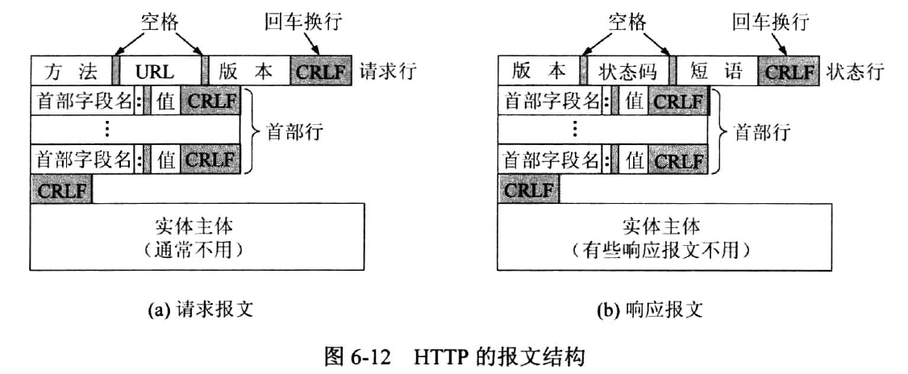
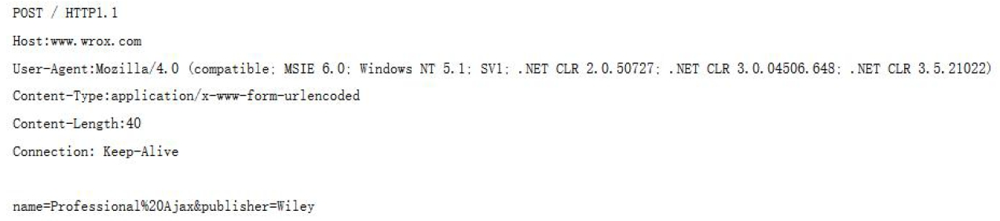
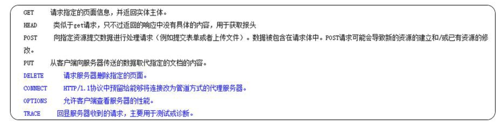
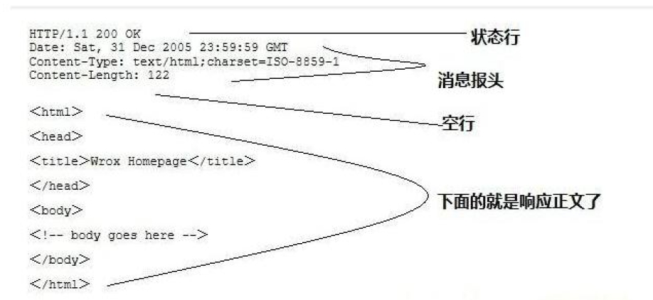
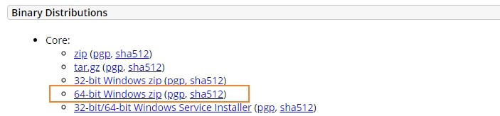
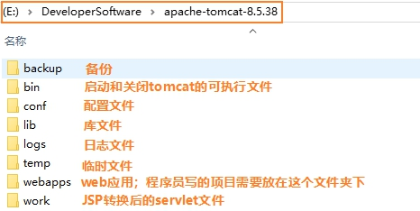
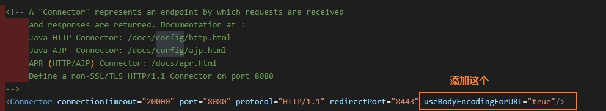

- HTTP为互联网规范，遵守这个协议，client和server才能正常通信
- tomcat是服务器；是一个长期运行的，能对请求做出响应的应用程序
- servlet是服务器和开发人员的规范，开发人员只有遵守servlet的规范，写出的程序才能在tomcat上运行。

## 1. HTTP协议

### 1.1 request--格式

#### 请求报文格式



- 请求行：请求方法（post、get）+ URL + 版本（HTTP1.0/HTTP1.1）
- 首部行：一般用来说明客户端需要使用的一些附加信息。是键值对
- 空行：位于首部行和实体主体之间，`空行是必须的`
- 实体主体：POST使用，Get不用




#### HTTP协议的请求方式

HTTP1.0定义了三种请求方式：`get、post`、head方法

HTTP1.1定义了八种请求方法：`get、post`、head、options、put、delete、trace和connect方法



**get和post请求方式的区别：**

- get: 请求数据会`以？的形式`隔开拼接在请求头中，`不安全`，`没有请求实体部分`。因为浏览器对URL的长度是有限制的，所以get 请求不能携带大量的数据
- post: 请求数据`在请求实体`中进行发送，在URL中看不到具体的请求数据，`安全`【因此密码会用post】。适合数据量大的数据发送

### 1.2 response--格式

#### 响应报文格式


- 状态行：HTTP版本、状态码（200、404、500）、短语（OK等）
- 首部行：消息报头、客户端使用的附加信息
- 空行：响应头和响应实体之间，`是必须的`
- 响应实体：正文，`服务器返回给浏览器的信息`



#### 响应状态码

HTTP 状态码由三个十进制数字组成，`第一个十进制数字定义了状态码的类型`

| 分类  |                    分类描述                    |
| :---: | :--------------------------------------------: |
|  1**  | 信息，服务器收到请求，`需要请求者继续执行操作` |
|  2**  |          `成功`，操作被成功接收并处理          |
|  3**  |      `重定向`，需要进一步的操作以完成请求      |
|  4**  |     `客户端错误`，请求错误或者无法完成请求     |
|  5**  | `服务器错误`，服务器在处理请求的过程发生了错误 |

| 状态码 |         短语          |                              描述                              |
| :----: | :-------------------: | :------------------------------------------------------------: |
|  200   |          OK           |                         客户端请求成功                         |
|  400   |      Bad Request      |            客户端请求有语法错误，不能被服务器所理解            |
|  401   |     Unauthorized      | 请求未经授权，这个状态代码必须和WWW-Authenticate报头域一起使用 |
|  403   |       Forbidden       |                服务器收到请求，但是拒绝提供服务                |
|  404   |       Not Found       |               请求的资源不存在，比如`请求写错了`               |
|  500   | Internal Server Error |                    服务器发送不可预期的错误                    |
|  503   |  Server Unavailable   |     服务器当前不能处理客户端的请求，一段时候后可能恢复正常     |

## 2. Tomcat

什么叫服务器？

简单来说：就是`一个长期运行，根据请求给出响应的程序`。

具体来说，服务器其实就是代码编写的一个可以根据用户请求实时的调用执行对应的逻辑代码`的一个容器`。在普通用户看来就是一个安装程序。我们只需要将服务器`在操作系统上进行安装`，并将我们事先编写好的逻辑处理代码根据规则放到服务器的指定位置，启动服务器，那么服务器就自动的会根据接收到请求调用,并执行对象的逻辑代码进行处理。

### 2.1 tomcat的下载和安装

下载地址为：<https://tomcat.apache.org/download-70.cgi>



**安装：**

下载成功后会为压缩包文件，解压即可使用。注意：尽量`不要解压在中文目录`中

**目录结构构成：**



**检验安装：**

打开bin 目录，然后双击执行`startup.bat` 文件【`Linux下为startup.sh`】，打开浏览器在地址栏中输入localhost：8080/ 如果出现tomcat 广告页安装成功.

**问题及其解决：**

1. tomcat的运行环境依赖JDK，必须先配置jdk环境。【一般来讲`版本`是没问题的。但是，如果jdk和tomcat都配置好了，仍然会出现错误的话，要注意一下jdk和tomcat的版本对应关系】
2. 闪退，闪退，启动闪退问题一般是因为JDK 的环境变量配置有问题，参照1 进行重新进行配置，如果还是闪退，使用：在bin\startup.bat 文件中的第一行前面加入【可以右键vs code打开】：  
`SET JAVA_HOME=JDK 目录`  
`SET CATALINA_HOME=解压后Tomcat 的目录`  
这样，运行startup.bat 就可以正常启动tomcat 服务器，如果想点击shutdown.bat 关闭服务器，同样在shutdown.bat 文件中加入上面的两行即可
3. 如果端口号被占用，可以杀掉占用端口号的进程（比如重启电脑），或者`在server.xml中“Ctrl+ F 8080”`

### 3.2 tomcat的集成

tomcat的底层原理为：我们代码编写完毕后，手动将代码放到tomcat上，然后运行tomcat，就能运行该服务器。

但是每次都手动放编写完的代码到tomcat很麻烦啊，怎么解决？

在IDE上集成tomcat，这样子，我们在IDE编写代码后，摁下保存，IDE自动帮我们将代码集成到tomcat上，这样子，就很省事了。

[idea部署tomcat](https://blog.csdn.net/HughGilbert/article/details/56424137)

## 3. servlet

### 3.1 servlet有什么用

servlet是`程序员和服务器`之间的桥梁。`服务器知道servlet，程序员调用servlet`。这样子就能使服务器调用程序员写的代码啦。

更具体来讲呢，过程是这样子的：

😄tomcat服务器运行，这个时候如果有请求过来，那么服务器会查询xml文件，找到对应的class文件。根据请求的post/get，调用class文件的service()或者doPost()/doGet()方法。

😄而程序员则覆写service()/doPost()/doGet()方法，就能够实现程序员写的代码在服务器运行，并且能够根据请求做出反应。【servlet生命周期则看“是否调入内存”或“是否从内存移除”】

**理论说法：**

Servlet 的实现遵循了服务器能够识别的规则，也就是服务器会自动的根据请求调用对应的servlet 进行请求处理。servlet简单方便，可移植性强。

### 3.2 servletd的使用

**代码编写：**

1. 创建普通的java 类并继承HttpServlet
2. 覆写service 方法
3. 在service 方法中书写逻辑代码即可
4. 在webRoot 下的WEB-INF 文件夹下的web.xml文件中配置servlet

**url访问：**

用URL访问：如这个url <http://localhost:8080/project/my>

解析这个URL地址：`IP地址:端口号/webapps目录下的project文件/在web.xml中找到请求my【url-pattern】,并调用调用相应的servlet执行`

**doGet()、doPost()、service():**

Service 方法:  
不管是get 方式还是post 方式的请求，如果Servlet 类中有service 方法，则优先调用Service 方法。

doGet 方法:  
在没有service 方法的情况下如果是get 方式的请求所调用的处理请求的方法

doPost 方法:  
在没有service 方法的情况下如果是post 方式的请求所调用的处理请求的方法

注意：  
如果在覆写service方法中调用了父类的service方法(super.service(arg0,arg1)),则service方法处理完后，会`再次`根据请求方式响应的doGet和doPost方法执行。【比如调用两次get/post】.所以，`一般情况下我们是不在覆写的service中调用父类的service方法的`。

### 3.3 servletd的代码

?> 注意：HttpServlet类是tomcat的javax.servlet的jar包下的类，如果你写程序需要用到这个类，你可以导入:<https://blog.csdn.net/HuachengGJ/article/details/79403636>

覆写MyServlet类中的service():

```java
public class MyServlet extends HttpServlet{
    @Override
    protected void service(HttpServletRequest req,HttpServletResponse resp)
        throws ServletException, IOException {
            resp.getWriter().write("this is my first servlet.");
            System.out.println("this is my first servlet.");
    }
}
```

在web-INF下找到web.xml文件并配置：

```xml
<!--配置servlet-->
    <!--配置servlet类的路径-->
    <servlet>
        <servlet-name>my</servlet-name>
        <servlet-class>com.sxt.servlet.MyServlet</servlet-class>
    </servlet>
    <!--配置访问方式-->
    <servlet-mapping>
        <servlet-name>my</servlet-name>
        <url-pattern>/my</url-pattern>
    </servlet-mapping>
```

这里是通过反射创建对象.

实际上服务器只需要找到com.servlet.MyServlet在哪里,找到该类后创建对象后就能够对请求做出响应了。那为什么请求需要写`url-pattern`而不是直接`com.servlet.MyServlet`呢，为了`安全`！别人只能知道url-pattern,而不知道我内部的servlet-class是怎么样的

如果反射创建不了对象，则会报class not found错误。

### 3.4 注意

IDEA 是开发工具，通过此工具便`于程序员的代码编写`。`真正运行的代码`不是IDEA 中编写的代码，`而是tomcat 服务器中部署好的代码`。tomcat 会根据请求自动调用对应的代码进行请求处理。

但是，这样子对于程序员很不方便，如果每次都要将程序部署到tomcat上的话。

### 3.5 servlet的生命周期

从操作系统“程序运行都要装载进内存”的角度理解。

**Servlet的生命周期：**

1. 从`第一次调用`到`服务器关闭`。
2. 如果Servlet在web.xml中配置了load-on-startup，生命周期为
从`服务器启动`到`服务器关闭`

**注意：**

`init`方法是对Servlet进行初始化的一个方法，会在Servlet `第一次加载进行存储时`执行。`destory`方法是在servlet被销毁时执行，也就服务器关闭时。

```java
package com.bjsxt.servlet;
import java.io.IOException;
import javax.servlet.ServletException;
import javax.servlet.http.HttpServlet;
import javax.servlet.http.HttpServletRequest;
import javax.servlet.http.HttpServletResponse;

/**
* Servlet的生命周期：
* 1、从第一次调用到服务器关闭。
* 2、如果Servlet在web.xml中配置了load-on-startup，生命周期为
从服务器启动到服务器关闭
* 注意：
* init方法是对Servlet进行初始化的一个方法，会在Servlet第一次
加载进行存储时执行
* destory方法是在servlet被销毁时执行，也就服务器关闭时。
**/

public class ServletLife extends HttpServlet {
    //初始化方法，在servlet第一次加载内容的时候被调用
    @Override
    public void init() throws ServletException {
        System.out.println("servlet初始化完成");
    }
    //service方法，真正处理请求的方法
    @Override
    protected void service(HttpServletRequest req,HttpServletResponse resp)
        throws ServletException, IOException {
            resp.getWriter().write("servlet life")
            System.out.println("servlet life");
    }
    @Override
    public void destroy() {
        System.out.println("我被销毁了...");
    }
}
```

```xml
<servlet>
        <servlet-name>life</servlet-name>
        <servlet-class>com.sxt.servlet.ServletLife</servlet-class>
        <load-on-startup>1</load-on-startup>
    </servlet>
    <servlet-mapping>
        <servlet-name>life</servlet-name>
        <url-pattern>/life</url-pattern>
    </servlet-mapping>
```

### 3.6 servlet常见错误总结

- **404错误:**

资源未找到  

原因一：在请求地址中的servlet的别名书写错误。  
原因二：虚拟项目名称拼写错误  

- **500错误：**

内部服务器错误

错误一：  
java.lang.ClassNotFoundException: com.bjsxt.servlet.ServletMothod  
解决：  
在web.xml中校验servlet类的全限定路径是否拼写错误。  

错误二：  
因为service方法体的代码执行错误导致  
解决：  
根据错误提示对service方法体中的代码进行错误更改。

- **405错误:**

请求方式不支持

原因：  
请求方式和servlet中的方法不匹配所造成的。  
解决：  
尽量使用service 方法进行请求处理，并且不要再service 方法中调用父类的service

### 3.7 Request对象

浏览器发起请求到服务器，会遵循HTTP协议将请求数据发送给服务器。服务器怎么存储收到的请求呢？

服务器每接受一个请求，就会创建一个**Request对象**来存储收到的请求数据。`服务器在调动servlet时会将创建的request对象作为实参传递给servlet的方法`，比如：service(HttpServletRequest req, HttpServletResponse resp),doPost(),doGet().

```text
- 获取请求行数据  

req.getHeader("键名")；//返回指定的请求头信息  
req.getHeaderNames("键名")；//返回请求头的键名的枚举类型

- 获取用户数据

req.getParameter("键名")；//返回指定用户数据  
req.getParameterValues("键名")；//用于一键多值，比如爱好，返回值的数组  
req.getParameterNames("键名")；//返回所有用户请求数据的枚举集合

- 注意：

使用getPaperrameterNames(),如果获取的值为空，要进一步打印值则会出现空指针异常。  
如果获取的请求数据不存在，不会报错，返回null.
```

代码为：

```java
@Override
    protected void service(HttpServletRequest req, HttpServletResponse resp)
        throws ServletException, IOException {
        //获取请求对象的“请求行数据”
        System.out.println("\nconsole-请求行 : " + "\n" +
                req.getMethod() + '\n' +
                req.getSession() + '\n' +
                req.getRequestURL() + '\n' +
                req.getProtocol() + '\n' +
                req.getScheme());
        //获取请求对象的“首部行数据”
        System.out.println("\nconsole-首部行：");
        Enumeration e = req.getHeaderNames();
        while (e.hasMoreElements()) {
            System.out.println(e.nextElement() + ":" + req.getHeader((String) e.nextElement()));
        }
        //获取用户数据
        System.out.println("\nconsole-用户数据：" + "\n");
        Enumeration userDataEnum = req.getParameterNames();
//        while (userDataEnum.hasMoreElements()) {
//            System.out.println(userDataEnum.nextElement() + ":" +
//               req.getParameter((String) userDataEnum.nextElement()) + "\n");
//        }
        System.out.println("\nconsole-一键多值");
        String [] favs = req.getParameterValues("fav");
        if (favs != null) {
            for (String fav : favs) {
                System.out.println(fav + "  ");
            }
        }
    }
```

可能的结果为：

```text
console-请求行 :  
POST
org.apache.catalina.session.StandardSessionFacade@6fded2cb
http://localhost:8080/01FirstServlet_war_exploded/req
HTTP/1.1
http

console-首部行：
host:keep-alive
content-length:max-age=0
origin:1
content-type:Mozilla/5.0 (Windows NT 10.0; Win64; x64) AppleWebKit/537.36 (KHTML, like Gecko) Chrome/79.0.3945.117 Safari/537.36
sec-fetch-user:text/html,application/xhtml+xml,application/xml;q=0.9,image/webp,image/apng,*/*;q=0.8,application/signed-exchange;v=b3;q=0.9
sec-fetch-site:navigate
referer:gzip, deflate, br
accept-language:JSESSIONID=32A0407647C96C1AA055F917C8B7351D; Idea-9613d063=2f1bd8dc-702d-4084-b2a4-0eb2b3dcc5ad

console-用户数据：


console-一键多值
1  
2  
3  
```

### 3.8 Response对象

服务器用Response对象存储“要发给浏览器的数据”。

服务器在调用指定的Servlet 进行请求处理的时候，会给Servlet 的方法传递两个实参request 和response。其中request 中封存了请求相关的请求数据，而response 则是用来进行响应的一个对象。

```text
response
作用：用来响应数据到浏览器的一个对象
使用：

	设置响应头
	setHeader(String name,String value);在响应头中添加响应信息，但是同键会覆盖
	setHeader(String name,String value);在响应头中添加信息，但是不会覆盖，可以存在一值多键

	设置响应状态
	setError(int num,String msg);//自定义响应状态码

	设置响应实体
	resp.getWriter().write(String str);//响应具体的数据给浏览器【getWriter()流】

	设置响应编码格式：
	resp.setContentType("text/html;charset=utf-8");
```

```java
@Override
    protected void service(HttpServletRequest req, HttpServletResponse resp) throws ServletException, IOException {
        //设置响应头
        resp.setHeader("mouse","罗技");
        resp.setHeader("mouse","bazalias");
        resp.addHeader("key","thinkpad");
        resp.addHeader("key","樱桃");
        //设置响应编码格式
        resp.setContentType("text/html;charset=utf-8");
        //resp.setContentType("text/xml;charset=utf-8");
        //设置响应状态码
//        resp.sendError(404,"来到知识的荒原");
        //设置响应实体
        resp.getWriter().write("<H3>今天天气真好</H3>");
    }
```

### 3.9 请求、响应乱码解决方法

为什么会产生乱码呢？

当浏览器和服务器建立连接后，浏览器和服务器之间是通过字节流【二进制】的形式进行数据传输的，而浏览器编码格式是`utf-8`,当它转换程二进制字节流在网络中传输，到了服务器却以`iso8859-1`的格式进行解析，这样子肯定就解析不成功，出现乱码【乱码针对中文】。

那怎么解决呢?

- 浏览器到服务器编码格式问题

方法一：可以将获得的数据转换成字节流，再以`utf-8`格式进行解析。

```java
    uname = new String(uname.getBytes("iso8859-1"),"utf-8");
```

这个方法，无论是get，还是post，肯定可以转化成不乱码的格式，但是缺点是，每一个属性都要进行转换，很麻烦。

方法二：整体修改编码格式。

但是有一点要注意，因为get，post数据键值对写的方式不一样，get是写在url后面，post是写在实体主体后面，所以批量修改需要区分get和post。

首先讲一下post，post将数据键值对写在实体主体，可以通过下面这种方式解决编码格式问题：

```java
    req.setCharacterEncoding("utf-8");
```

get整体修改方法为：

```java
    req.setCharacterEncoding("utf-8");
```

除了这个，还需要tomcat服务器目录下面的conf文件下找到server.xml文件，打开进行如下配置：



- 服务器到浏览器的编码格式问题

```java
    resp.setContentType("text/html;charset=utf-8");
```

### 3.10 流程总结

Servlet 的使用流程:  

1. 设置请求编码格式  
1. 设置响应编码格式  
1. 获取请求信息  
1. 处理请求信息  
1. 响应处理结果  

数据流转流程:

浏览器------>服务器------->数据库  
浏览器<------服务器<-------数据库

### 3.11 请求转发

但一个servlet A的需要另一个servlet B协助处理数据的时候，A该怎么使用另一个servlet B 呢？

这里可以使用请求转发【请求转发很就`函数调用`】

```java
req.getRequestDispatcher("index.jsp").forward(req,resp);
```

请求转发的特点为：

1. 地址栏的信息不变，servlet B 可以使用servlet A的Request对象的数据
2. 请求只有一个

### 3.12 Request对象作用域

请求转发需要注意以下Request的作用域。因为请求转发，可以使servlet B 共享Servlet A 的数据。

同时，Servlet可以对Request对象的数据进行加工，再交给servlet B【原理和函数调用差不多】

```java
request.setAttribute(object name,Object value);
request.getAttribute(Object obj)
```

解决了一次请求内的不同Servlet 的数据(请求数据+其他数据)共享问题。

作用域：基于请求转发，一次请求中的所有Servlet 共享。

注意：使用Request 对象进行数据流转，数据只在一次请求内有效。

### 3.13 重定向

当你登录的时候，网络不是很好，需要重复刷新页面的时候，请求转发是怎么做的呢？

每一次都是重新提交表单的数据，这其实在某方面有很大弊端，比如增加对服务器的访问量，如果是付款，则会不断付款。能不能说，提交表单后，不断刷新却不会重新提交表单呢？

可以使用重定向。

```java
resp.sendRedirect("url-partten");
```

特点：

1. 两次请求  
1. 浏览器地址栏信息改变  
1. 避免表单重复提交  
