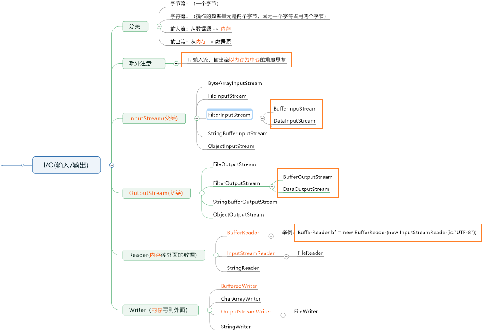

IO常用的类如下：



## 参考资料

> 廖雪峰的IO博客：<https://www.liaoxuefeng.com/wiki/1252599548343744/1255945227202752>

## 核心要点

IO是指Input/OutPut,即输入和输出。**以内存为中心**：

- Input指从外部读入数据到内存，例如，把文件从磁盘读取到内存，从网络读取到内存等等。
- Output指把数据从内存输出到外部设备，例如，把数据从内存写到文件，把数据从内存输出到网络等等。

为什么要把数据读到内存才能处理这些数据呢？  
这是因为代码是在内存中运行的，数据也必须读到内存中，最终的表示方法无非是byte数组、字符串等等，都必须放到内存中。

### 同步和异步

同步IO是指，读写IO时代码必须等待数据返回后才继续执行代码，它的优点是代码编写简单，缺点是CPU执行效率低。

而异步IO是指，读写IO时仅发出请求，然后立即执行后续代码，它的优点是CPU执行效率高，缺点是代码编写复杂。

Java标准库的包java.io提供了同步IO，而java.nio则是异步IO。上面我们讨论的`InputStream`、`OutputStream`、`Reader`和`Writer`都是同步IO的抽象类，对应的具体实现类，以文件为例，有`FileInputStream`、`FileOutputStream`、`FileReader`和`FileWriter`。

## File对象

在计算机文件系统中，文件是非常重要的存储方式。Java的标准库`java.io`提供了`File`对象来操作文件和目录。

要构造一个**File对象**，需要传入文件路径：

```java
public class Main {
    public static void main(String[] args) {
        File f = new File("C:\\Windows\\notepad.exe");
        System.out.println(f);
    }
}
```

构造File对象时，既可以传入绝对路径，也可以传入相对路径。绝对路径是以根目录开头的完整路径，例如：

```java
File f = new File("C:\\Windows\\nodepad.exe");
```

注意Windows平台使用\作为路径分隔符，在Java字符串中需要用\\表示一个\。Linux平台使用/作为路径分隔符：(当然Windows也可以用"/"作为风格字符，所以最后统一用"/")

```java
File f = new File("/user/bin/javac");
```

传入相对路径时，相对路径前面加上当前目录就是绝对路径

```java
//假设当前目录是：D:/Workspace/Github
File f1 = new File("blog"); // D:/Workspace/Github/blog
File f2 = new File("./blog"); // D:/Workspace/Github/blog
File f3 = new File("../Github2"); //D:Workspace/Github2
```

可以用`.`表示当前目录，`..`表示上级目录。

## InputStream

InputStream就是Java标准库提供的最基本的输入流。它位于java.io这个包里。java.io包提供了**所有同步IO的功能**。

要特别注意一点的是，InputStream并不是一个接口，而是**一个抽象类**，它是**所有输入流的超类**。这个抽象类定义的最重要的一个方法就是`int read()`,签名如下：

```java
public abstract int read() throws IOException
```

这个方法会读取输入流的下一个字节，并返回字节表示额`int`值（0~255）。如果读到`-1`就不能再继续读取了。

在计算机中，类似文件、网络端口这些资源，都是由**操作系统统一管理**的。应用程序在运行的过程中，如果打开了一个文件进行读写，完成后要及时地关闭，以便让**操作系统把资源释放掉**，否则，应用程序占用的资源会越来越多，不但占用自身内存，还会影响其他程序的运行。

`InputStream`和`OutputStream`都是通过`close()`方法来关闭流。关闭流就会释放对应的底层资源。

我们还要注意到在读取或写入IO流的过程中，**可能会发生错误**，例如，文件不存在导致无法读取，没有写权限导致写入失败，等等，这些底层错误由Java虚拟机自动封装成`IOException`异常并抛出。因此，所有与IO操作相关的代码都必须正确处理IOException。

因此，我们需要用`try...finally`保证`InputStream`在无论是否发生IO错误的时候都能正确的关闭：

```java
public void readFile() throws IOException {
    try (InputStream input = new FileInputStream("src/readme.txt")) {
        int n;
        while ((n = input.read()) != -1) {
            System.out.println(n);
        }
    } // 编译器在此自动为我们写入finally并调用close()
}
```

### 缓冲

在读取流的时候，一次读取一个字节并不是最高效的方法。很多流支持一次性读取多个字节到缓冲区，对于文件和网络流来说，利用缓冲区一次性读取多个字节效率往往要高很多。`InputStream`提供了两个重载方法来支持读取多个字节：

- int read(byte[] b)：读取若干字节并填充到byte[]数组，返回读取的字节数
- int read(byte[] b, int off, int len)：指定byte[]数组的偏移量和最大填充数

利用上述方法一次读取多个字节时，需要先定义一个`byte[]`数组作为缓冲区，`read()`方法会尽可能多地读取字节到缓冲区， 但不会超过缓冲区的大小。`read()`方法的返回值不再是字节的int值，而是返回实际读取了多少个字节。如果返回`-1`，表示没有更多的数据了。

```java
public void readFile() throws IOException {
    try (InputStream input = new FileInputStream("src/readme.txt")) {
        // 定义1000个字节大小的缓冲区:
        byte[] buffer = new byte[1000];
        int n;
        while ((n = input.read(buffer)) != -1) { // 读取到缓冲区
            System.out.println("read " + n + " bytes.");
        }
    }
}
```

## OutpubStream

和`InputStream`相反，`OutputStream`是`Java`标准库提供的最基本的输出流。

和`InputStream`类似，`OutputStream`也是抽象类，它是所有输出流的超类。这个抽象类定义的一个最重要的方法就是`void write(int b)`。

## Reader

如果我们读取一个纯ASCII编码的文本文件，文件中包含中文，可能会出现**乱码**，因为`FileReader`默认的编码与系统相关，例如，Windows系统的默认编码`可能是GBK`，打开一个`UTF-8`编码的文本文件就会出现乱码。

要避免乱码问题，我们需要在创建`FileReader`时指定编码：

```java
Reader reader = new Reader("src/readme.txt","UTF-8");
```