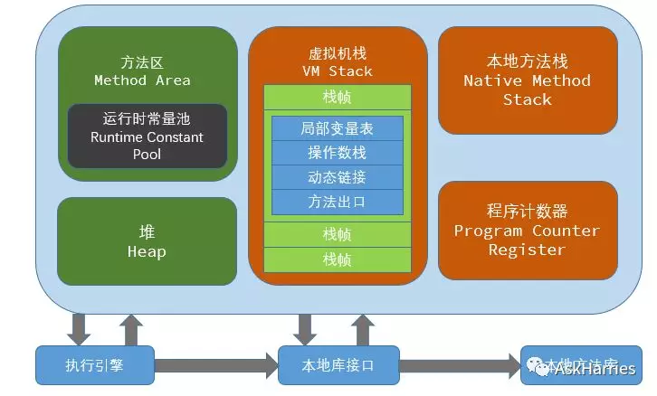
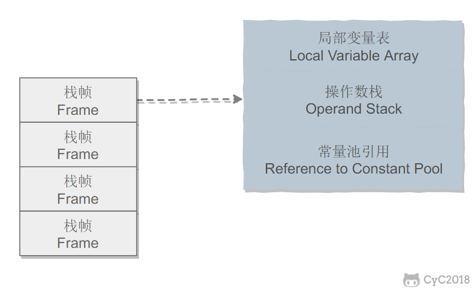
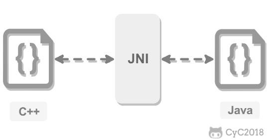
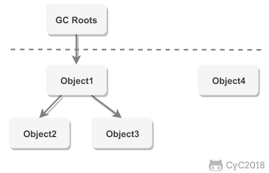

## Java 虚拟机

### 运行时的数据区域



### 程序计数器

每个线程都有一个程序计数器。记录`正在执行`的虚拟机字节码`指令的地址`（如果正在执行的是本地方法则为空）

### Java虚拟机栈

Java虚拟机栈入栈和出栈的对象是：栈帧。

每个`Java方法`在执行的同时会创建`一个栈帧`用于存储`局部变量表、操作数栈、常量池引用`等信息。从方法调用直至执行完成的过程，对应着一个栈帧在Java虚拟机栈中入栈和出栈的过程。



!> 命令执行错误，原因未找到

可以通过`-Xss`这个虚拟机参数来指定每个线程的Java虚拟机`栈的内存大小`，在JDK 1.4中默认为256K，而在JDK 1.5+中默认为1M：

```
java -Xss2M HackTheJava
```

该区域可能抛出以下异常：

- 当线程请求的`栈深度`超过最大值，会抛出`StackOverflowError`异常；
- 栈进行`动态扩展`时如果`无法申请到足够内存，`会抛出`OutOfMemoryError`异常。

### 本地方法栈

本地方法栈与Java虚拟机栈类似，它们之间的区别只不过本地方法栈是`为本地方法服务的`。

本地方法一般是用其他语言`（C、C++或汇编语言等）`编写的，并且被编译为`基于本地硬件和操作系统的程序`，对待这些方法需要特别处理。



### 堆

所有`对象`都在这里分配内存，是`垃圾回收的主要区域`（“GC堆”）

现代的垃圾收集器基本都是采用分代收集算法，其主要的思想是针对不同类型的对象采取不同的垃圾回收算法。可以将堆分为两块：

- 新生代（Young Generation）
- 老年代（Old Generation）

堆不需要连续内存，并且可以动态增加其内存，增加失败会抛出OutOfMemoryError异常。

可以通过`- Xms`和`- Xmx`这两个虚拟机参数来指定一个程序的`堆内存大小`，第一个参数设置初始值，第二个参数设置最大值。

```
java -Xms1M -Xmx2M HackTheJava
```

### 方法区

用于存放`已被加载的类信息、常量、静态变量、即时编译器编译后的代码`等数据。

方法区是一个JVM规范，永久代与元空间都是其一种实现方式。和堆一样不需要连续的内存，并且可以动态扩展，动态扩展失败一样会抛出OutOfMemoryError异常。这块区域进行垃圾回收的主要目标是`对常量池的回收`和`对类的卸载`，但是一般比较难实现。

在JDK 1.8之前，把它当成永久代来进行垃圾回收。但是受很多因素的影响，它经常会抛出OutOfMemoryError异常。在JDK 1.8之后，原来永久代的数据被分到元空间和堆中。`元空间位于本地内存`，存储`类的原信息`，`静态变量和常量池等放入堆中`。

### 运行时常量池

运行时常量池是方法区的一部分。

Class文件中的常量池（编译器生成的`字面量和符号引用`）会在类加载后被放入这个区域。【扩展：[符号引用和直接引用](https://blog.csdn.net/u014656992/article/details/51107127)】

除了编译器生成的常量，还允许动态生成，例如String类的intern().

### 直接内存

在JDK 1.4中新引入了NIO类，它可以使用`Native函数库`直接分配堆外内存，然后通过Java`堆里的DirectByteBuffer对象`作为这块内存的引用进行操作。这样能在一定场景显著提高性能。

## 二、垃圾收集

垃圾收集主要针对`堆和方法区`进行。`程序计数器、虚拟机栈和本地方法栈这三个区域属于线程私有的`，只存在于线程的生命周期内，`线程结束之后就会消失`，因此不需要对这三个区域进行垃圾回收。

### 判断一个对象是否可被回收

#### 1. 引用计数算法

为对象添加一个引用计数器，当对象增加一个引用时计数器加1，引用失效时计数器减1。引用计数器为0时的对象可以被回收。

在两个对象出现`循环引用`时，此时引用计数器永远不为0，导致无法对它们进行回收。正是因为循环引用的存在，因为Java不使用引用计数算法。

```java
public class Test{
    public Object instance = null;

    public static void main(String[] args){
        //堆中分配Test()对象空间，栈帧中局部变量a,b
        Test a = new Test();
        Test b = new Test();
        a.instace = b;
        b.instace = a;
        a = null;
        b = null;
        doSomething();
    }
}
```

在上述代码中，a与b引用的对象实例存在`互相持有对象的引用`，因此当我们把a对象和b对象的引用去除后，由于两个对象还存在互相之间的引用，导致两个对象无法被回收。

> [类的声明，创建及类的使用](https://blog.csdn.net/miao_9/article/details/62057732)

#### 2. 可达性分析算法

以`GC Roots`为起始点进行搜索，`可达的对象都是存活的，不可达的对象可被回收`。

Java虚拟机使用该算法来判断对象是否可被回收，GC Roots一般包含以下内容：

- 虚拟机栈中的局部变量表引用的对象
- 本地方法栈中JNI中引用的对象
- 方法区中类`静态`属性引用的对象
- 方法区中的`常量`引用的对象



#### 3. 方法区的回收

因为方法区主要存放永久代对象，而永久代对象的回收率比新生代低很多，所以在方法区上进行回收的性价比不高。

主要对常量池的回收和对类的卸载。

在大量使用反射和动态代理的场景，为了避免内存溢出，都需要具备类卸载功能。

类的卸载条件很多，需要满足以下三个条件，并且满足了条件也不一定会被卸载：

- 该类所有的实例都已经被回收，此时堆中不存在类的任何实例。
- 加载该类的ClassLoader已经被回收。
- 该类对应的Class对象没有在任何地方被引用，也就无法在任何地方通过反射访问该类方法。

#### 4. finalize()

类似C++的析构函数，用于关闭外部资源。但是try-finally等方法可以做的很好，并且该方法运行代价很高，不确定性大，无法保证各个对象的调用顺序，因此最好不要使用。

### 引用类型

无论是通过引用计数算法判断对象的引用数量，还是通过可达性分析法判断对象是否可达，判定对象是否可被回收都与`引用`有关。

Java提供四种强度不同的引用类型。

#### 1. 强引用

被强引用关联的对象不会被回收。

使用new一个新对象的方式来创建强引用。

```java
Object obj = new Object();
```

#### 2. 软引用

被软引用关联的对象只有在内存不够的情况下才会被回收。

使用SoftReference类来创建软引用

```java
Object obj = new Object();
SoftReference<Object> sf = new SoftReference<Object>(obj);
obj = null; //使对象只被软引用关联
```

#### 3. 弱引用

被弱引用关联的对象一定会被回收，也就是说它只能存活到下一次垃圾回收发生之前。

使用WeakReference类来创建弱引用。

```java
Object obj = new Object();
WeakReference<Object> wf = new WeakReference<Object>(obj);
obj = null;
```

#### 4. 虚引用

又称为幽灵引用或者幻影引用，一个对象是否有虚引用的存在，不会对其生存时间造成影响，也无法通过虚引用得到一个对象。

为一个对象设置虚引用的唯一目的是能在`这个对象被回收时收到一个系统通知`。

使用PhantomReference来创建虚引用

```java
Object obj = new Object();
PhantomReference<Object> pf = new PhantomReference<Object>(obj, null);
obj = null;
```

### 垃圾收集算法

#### 1. 标记-清除算法


在标记阶段，程序会检查每个对象是否为活动对象，如果是活动对象，则程序会在对象头部打上标记。

在清除阶段，会进行对象回收并取消标志位，另外，还会判断回收后的分块与前一个空闲分块是否连续，若连续，会合并这两个分块。回收对象就是把对象作为分块，连接到被称为“空闲链表”的单向链表，之后进行分配时只需要遍历这个空闲链表，就可以找到分块。

在分配时，程序会搜索空闲链表寻找空间大于等于新对象大小size的块block。如果它找到的块等于size，会直接返回这个分块；如果找到的块大于size，会将块分割成大小为size与（block - size）的两部分，返回大小为size的分块，并把大小为（block - size）的块返回给空闲链表。

不足：

- 标记和清除过程效率都不高
- 会产生大量不连续的内存碎片，导致无法给大对象分配内存

#### 2. 标记-整理算法


让所有存活的对象都向一端移动，然后直接清理掉端边界以外的内存。

优点：

- 不会产生内存碎片

缺点：

- 需要移动大量的数据，处理效率比较低

#### 3. 复制


将内存划分为大小相等的两块，每次只使用其中的一块，当这一块内存用完后将将还存活的对象复制到另一块上面，然后把使用过的内存进行一次清理。

主要不足是只使用了内存的一半。

现在的商业虚拟机都采用`收集算法`回收新生代，但是并不是化分为大小相等的两块，而是一块较大的Eden空间和两块较小的Survivor空间，每次使用Eden和其中一块Survivor。在回收时，将Eden和Survivor中还存活着的对象全部复制到另一块Survivor上，最后清理Eden和使用过的那一块Survivor。

HotSpot虚拟机的Eden和Surivor大小比例默认为8：1，保证了内存的利用率达到90%。如果每次回收有多于10%的对象存活，那么一块Survivor就不够用了，此时需要依赖于老年代进行空间分配担保，也就是借用老年代的空间存储放不下的对象。

#### 4. 分代收集

现在的商业虚拟机采用分代收集算法，它根据对象存活周期将内存划分为几块，不同块采用适当的收集算法。

一般将堆分为新生代和老年代。

- 新生代使用：复制算法
- 老年代使用：标记-清除 或者 标记-整理算法

## 三、内存分配和垃圾回收

### Minor GC 和 Full GC

- Minor GC:回收新生代，因为新生代对象存活的时间很短，因此Minor GC会频繁执行，执行的速度一般也比较快。
- Full GC:回收老年代和新生代，老年代对象其存活时间长，因此full GC很少执行，执行速度比Minor GC慢很多。

### 内存分配策略

#### 1. 对象优先在Eden分配

大多数情况下，对象在新生代Eden上分配，当Eden空间不够时，发起Minor GC。

#### 2. 大对象直接进入老年代

大对象是指需要连续内存空间的对象，最典型的大对象是那种很长的字符串以及数组。

经常出现大对象会提前出发垃圾收集以获得足够连续空间分配给大对象。

#### 3. 长期存活的对象进入老年代

为对象定义年龄计数器，对象在Eden 出生并经过Minor GC依然存活，将移动到Survivor中，年龄就增加1岁，增加到一定年龄则移动进入老年代中。

-XX：MaxTenuringThreshold用来定义年龄的阈值。

#### 4. 动态对象年龄判断

虚拟机并不是永远要求对象年龄必须达到MaxTenuringThreshold才能晋升老年代，如果在Survivor中相同年龄所有对象大小总和大于Survivor空间的一半，则年龄大于或等于该年龄的对象可以直接进入老年代，无需等到MaxTenuringThreshold中要求的年龄。

#### 5. 空间分配担保

在发生Minor GC之前，虚拟机先检查老年代`最大可用的连续空间`是否大于等于`新生代所有对象总空间`，如果条件成立的话，那么Minor GC可以确定是安全的。

如果不成立的话虚拟机查看HandlePromotionFailure的值是否允许担保失败，如果允许那么就会继续检查老年代最大可用的连续空间是否大于历次晋升到老年代对象的平均值大小，如果大于，将尝试进行一次Minor GC；如果小于，或者HandlePromotionFailture的值不允许冒险，那么将要进行一次Full GC。

### Full GC的触发条件

对于Minor GC，其触发条件非常简单，当Eden空间满时，就将出发一次Minor GC，而Full GC则相对复杂，有以下条件

#### 1. 调用System.gc()

只是建议虚拟机执行Full GC，但是虚拟机不一定真正执行。不建议使用这种方法，而是让虚拟机管理内存。

#### 2. 老年代空间不足

老年代空间不足的常见场景是前文所说的大对象直接进入老年代，长期存活对象进入老年代等。

为了避免以上原因引起的Full GC，应当尽量不要创建过大的对象以及数组。除此之外，可以通过-Xmn虚拟机参数调大新生代的大小，让对象尽量在新生代被回收掉，不进入老年代。还可以通过-XX:MaxTenuringThreshold调大对象进入老年代的年龄，让对象在新生代多存活一段时间。

#### 3. 空间分配担保失败

使用复制算法的Minor GC 需要老年代的内存空间作担保，如果担保失败会执行一次Full GC。

#### 4. JDK 1.7 及以前的永久代空间不足

在 JDK 1.7 及以前，HotSpot 虚拟机中的方法区是用永久代实现的，永久代中存放的为一些 Class 的信息、常量、静态变量等数据。

当系统中要加载的类、反射的类和调用的方法较多时，永久代可能会被占满，在未配置为采用 CMS GC 的情况下也会执行 Full GC。如果经过 Full GC 仍然回收不了，那么虚拟机会抛出 java.lang.OutOfMemoryError。

为避免以上原因引起的 Full GC，可采用的方法为增大永久代空间或转为使用 CMS GC。

#### 5. 5. Concurrent Mode Failure

## 四、类加载机制

类是在运行期间`第一次使用时动态加载的`，而不是一次性加载所有的类。因为如果一次性加载，那么会占用很多的内存。

### 类的生命周期

- 

包括以下7个阶段：

- 加载（Loading）
- 验证（Verification）
- 准备（Preparation）
- 解析（Resolution）
- 初始化（Initialization）
- 使用（Using）
- 卸载（Unloading）

#### 1. 加载

加载是类加载的一个阶段，注意不要混淆

加载过程完成以下三件事：

- 通过类的`完全限定名称`获取该类的二进制字节流
- 将该类字节流表示的静态存储结构转换为方法区的`运行时存储结构`
- `在内存中生成一个代表该类的Class对象`，作为方法区中该类各种数据的访问入口。

#### 2. 验证

确保Class文件的字节流中包含的信息符合当前虚拟机的要求，并且不会危害到虚拟机自身的安全。

#### 3. 准备

类变量是被static修饰的变量，准备阶段为类变量分配内存并设置初始值，使用的是方法区的内存。

实例变量不会在这个阶段分配内存，它会在对象实例化时顺着对象一起被分配在堆中。应该注意到，实例化不是类加载的一个过程，类加载是发生在实例化操作之前，并且`类加载只进行一次，实例化可以进行多次`。

`初始值一般为0值`，例如下面的类变量value被初始化为0而不是123.[参考：Java静态变量的初始化（static块的本质）](https://blog.csdn.net/darxin/article/details/5293427)

```java
public static int value = 123;
```

如果变量是常量，那么它将初始化为表达式所定义的值而不是0.例如下面的常量value被初始化为123而不是0.

```java
public static final int value = 123;
```

#### 4. 解析

将常量池的符号引用替换为直接引用的过程。

其中解析过程在某些情况下可以在初始化阶段之后再开始，这是为了支持Java的动态绑定。

#### 5. 初始化

初始化阶段才真正开始执行类中定义的Java程序代码。初始化阶段是虚拟机`执行类构造器`<clinit>()方法的过程。在准备阶段，类变量已经赋过一次系统要求的初始值，而在初始化阶段，根据程序员通过程序制定的`主观计划`去初始化类变量和其他资源。

`<client>()`是由编译器自动收集类中`所有类变量的赋值动作`和`静态语句块中的语句`合并产生的,

### 类初始化的时机

#### 1. 主动引用

虚拟机规范中并没有强制约束何时进行加载，但是规范严格规定了有且只有下列五种情况必须对类进行初始化（加载、验证、准备都会随之发生）：

- 遇到new、getstatic、putstatic、invokestatic这四条字节码指令时，如果类没有进行初始化，则必须先出发其初始化。最常见的生成这4条指令的场景是：使用new关键字实例化对象的时候；读取或设置一个类的静态字段（被final修饰、已在编译期把结果放入常量池的字段除外）的时候，以及调用一个类的静态方法的时候。
- 使用java.lang.reflect包的方法对类进行反射调用的时候，如果类没有进行初始化，则需要先触发其初始化。
- 当初始化一个类的时候，如果发现其父类还没有进行过初始化，则需要先触发父类的初始化。
- 当虚拟机启动时，用户需要指定一个要执行的主类（包含main()方法的那个类），虚拟机会先初始化这个主类；

#### 2. 被动引用

以上5种场景中的行为称为对一个类进行主动引用。除此之外，所有引用类的方式都不会触发初始化，称为被动引用。被动引用常见的例子包括：

- 通过子类引用父类的静态字段，不会导致子类初始化。

```java
System.out.println(SubClass.value); //value字段在SuperClass中定义
```

- 通过数组定义来引用类，不会触发类的初始化。该过程会对数组类进行初始化，数组类是一个由虚拟机自动生成的，直接继承自Object的子类，其中包含了数组的属性和方法。

```java
SuperClass[] sca = new SuperClass[10];
```

- 常量在编译阶段会存入调用类的常量池中，本质上并没有直接引用到定义常量的类，因此不会触发定义常量的类的初始化

```java
System.out.println(ConstClass.HELLOWORLD);
```

### 类加载机制


## 参考资料

- [cyc：Java 虚拟机](https://cyc2018.github.io/CS-Notes/#/notes/Java%20%E8%99%9A%E6%8B%9F%E6%9C%BA?id=minor-gc-%e5%92%8c-full-gc)
- [程序员小灰：聊一聊jvm模型](https://mp.weixin.qq.com/s?__biz=MzIxMjE5MTE1Nw==&mid=2653193961&idx=2&sn=cdfa0d38829a0dc1ad5d23350e1aca90&chksm=8c99f433bbee7d25f353b6156375a0d0d430080e1c7489f47499fa3f4051e0fa4449811cfddb&mpshare=1&scene=24&srcid=0918qfGbysTlfjPXmduulgUo&sharer_sharetime=1568776478467&sharer_shareid=1bfcc99ef12aaea8b1dde0097af37dff&key=cae512a5b65f4701f2382ff2ea363791318ad3ccb1f206af7e178692374df6394ad60f19f75dddaad89a6b57ccdca959b3722b18cb3778129629cbf5dd21ae757f30aff12229ee8ff003b8e1abd0584c&ascene=14&uin=OTg4ODk0OTA5&devicetype=Windows+10&version=62080079&lang=zh_CN&exportkey=Ax95PJWj0XFP8cIoZnsOTl0%3D&pass_ticket=wmWQbrM10jrZn1o2ipbB1KchZd7GRFWavJBPTlWNtX5ZcirmusiDgc3tZ2kp3J0U)
