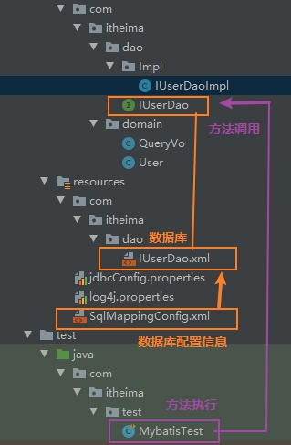
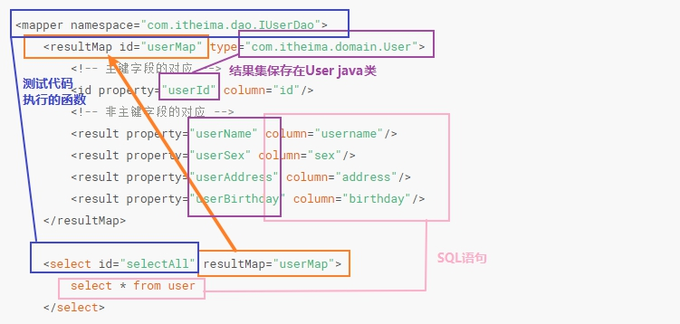
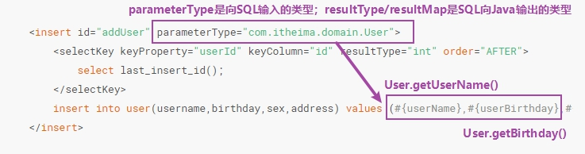

前面我们已经写了selectAll的，那更具体地CRUD写法，将在下面给出。

## 1. 推荐写法-mybaits使用代理对象实现



**IUserDao类的代码【接口】：**

```java
public interface IUserDao  {

    /**
     * 列出所有数据
     * @return
     */
    List<User> selectAll();

    /**
     * 向数据库保存新增加的user
     */
    void addUser(User user);

    /**
     * 更新数据库的内容
     * @param user
     */
    void updateUser(User user);

    /**
     * 删除数据库某一项的内容
     * @param userId
     */
    void deleteUser(Integer userId);

    /**
     * 根据userid查询数据库
     * @param userId
     * @return
     */
    User selectId(Integer userId);

    /**
     * 根据用户名模糊查询
     * @param userName
     * @return
     */
    List<User> selectName(String userName);

    /**
     * 查询总条数
     * @return
     */
    Integer selectTotal();

    /**
     * 自定义对象查询
     * @param queryVo
     * @return
     */
    List<User> selectVo(QueryVo queryVo);
}
```

**可以看到，上面用用了一个QueryVo类：**

```java
public class QueryVo {
    private User user;

    public User getUser() {
        return user;
    }

    public void setUser(User user) {
        this.user = user;
    }

    public QueryVo(User user) {
        this.user = user;
    }
}
```

这里为什么要多用一个QueryVo类呢？

我们在实际的项目开发过程中，很多时候查询出来的结果是多表连结查询出来的。当然查询出来的结果基本也不是同一张表的内容。

那用什么对象来封装查询出来的结果呢？

我们可以想到，多建立一个实体类就封装查询出来的结果。对，这就是Vo类的作用。

**IUserDao类对应的IUserDao.xml：**

```sql
<?xml version="1.0" encoding="UTF-8" ?>
<!DOCTYPE mapper
        PUBLIC "-//mybatis.org//DTD Mapper 3.0//EN"
        "http://mybatis.org/dtd/mybatis-3-mapper.dtd">

<mapper namespace="com.itheima.dao.IUserDao">
    <resultMap id="userMap" type="com.itheima.domain.User">
        <!-- 主键字段的对应 -->
        <id property="userId" column="id"/>
        <!-- 非主键字段的对应 -->
        <result property="userName" column="username"/>
        <result property="userSex" column="sex"/>
        <result property="userAddress" column="address"/>
        <result property="userBirthday" column="birthday"/>
    </resultMap>

    <select id="selectAll" resultMap="userMap">
        select * from user
    </select>

    <insert id="addUser" parameterType="com.itheima.domain.User">
        <selectKey keyProperty="userId" keyColumn="id" resultType="int" order="AFTER">
            select last_insert_id();
        </selectKey>
        insert into user(username,birthday,sex,address) values (#{userName},#{userBirthday},#{userSex},#{userAddress})
    </insert>

    <update id="updateUser" parameterType="com.itheima.domain.User">
        update user set username = #{userName},birthday = #{userBirthday},sex = #{userSex},address = #{userAddress} where id = #{userId}
    </update>

    <delete id="deleteUser" parameterType="Integer">
        delete from user where id = #{id}
    </delete>

    <select id="selectId" parameterType="Integer" resultMap="userMap">
        select * from user where id = #{userid}
    </select>

    <select id="selectName" parameterType="String" resultMap="userMap">
        select * from user where username like #{username}
    </select>

    <select id="selectTotal" resultType="int">
        select count(id) from user
    </select>

    <select id="selectVo" resultType="com.itheima.domain.User" parameterType="com.itheima.domain.QueryVo">
        select id as userId,username as userName,address as userAddress,sex as userSex,birthday as userBirthday from user where username like #{user.userName}
    </select>
</mapper>
```

对xml的解析：





- **对于resultMap具体介绍：**

如果不使用resultMap会怎么样呢？

我们看到代码，SQL是"select * from user"，当SQL查询到返回集后，会将数据封装到resultType(com.itheima.domian.User)中。但是，具体到`属性`是怎么赋值的呢？

SQL和Java实体类字段名不是一样的【只列出几个做比对】:

|   SQL    |     Java     |
| :------: | :----------: |
|    id    |    userId    |
| username |   userName   |
|   sex    |   userSex    |
| address  | userAddress  |
| birthday | userBirthday |

mysql在window环境下是不区分大小写的，可以封装username【linux下不可以】，其他数据程序就不知道怎么封装了，因此，查询结果出来，测试案例看不到除userName的其他数据。

这个时候resultMap就是解决SQL和Java属性映射的关系！让结果集能够正确封装！

✨`property对应的是Java实体类的属性名；`  
✨`column对应的是SQL语句的命名【SQL有别名的为别名，没有别名的为字段名】`

除了这个resultMap方法外,使用别名也可以使SQL和Java属性映射：

select `id as userId`,username,`birthday as userBirthday`,`sex as userSex`,`address as userAdder` from user;

- **对于上面的#{userName},#{userBirthday}我们再具体介绍一下：**

这是`OGNL表达式`（object graphic navigation language`对象图导航语言`）。

`它是通过对象的取值方式来获取数据。在写法上把get给省略了。`

比如：我们获取用户的名称：类中的写法  `user.getUsername()`; OGNL表达式写法`user.username`。

mybatis为什么能直接写username，而不用user.呢？

因为在parameterType中`已经提供了属性所属的类`，所以此时不需要写对象名。

**测试类：**

```java
public class MybatisTest {

    private InputStream in;
    private SqlSession session;
    private IUserDao userDao;

    @Before
    public void init() throws IOException {
        //读取配置文件，生成字节数组
        in = Resources.getResourceAsStream("SqlMappingConfig.xml");
        //利用反射创建代理对象
        session = new SqlSessionFactoryBuilder().build(in).openSession();
        userDao = session.getMapper(IUserDao.class);
    }

    @After
    public void destroy() throws IOException {
        session.commit();
        session.close();
        in.close();
    }

    @Test
    public void testSelectAll() {
        //执行dao代理对象的方法
        List<User> users = userDao.selectAll();
        for (User user : users) {
            System.out.println(user);
        }
    }

    @Test
    public void testSelectId(){
        //执行dao代理对象的方法
        User users = userDao.selectId(41);
        System.out.println(users);
    }

    @Test
    public void testSelectName(){
        //执行dao代理对象的方法
        List<User> users = userDao.selectName("%小%");
        for (User user : users) {
            System.out.println(user);
        }
    }

    @Test
    public void testSelectTotal(){
        System.out.println(userDao.selectTotal());
    }

    @Test
    public void testAddUser(){
        User user = new User();
        user.setUserName("mybatis-new-user");
        user.setUserBirthday(new Date());
        user.setUserAddress("北京市");
        user.setUserSex("男");
        System.out.println("提交前:" + user);

        userDao.addUser(user);
        System.out.println("提交后:" + user);
    }

    @Test
    public void testUpdateUser(){
        User user = new User();
        user.setUserId(53);
        user.setUserName("--user");
        user.setUserBirthday(new Date());
        user.setUserAddress("北京市");
        user.setUserSex("男");

        userDao.updateUser(user);
    }

    @Test
    public void testDeleteUser(){
        userDao.deleteUser(56);
    }

    @Test
    public void testSelectVo(){
        User user = new User();
        user.setUserName("%小%");
        QueryVo queryVo = new QueryVo(user);

        List<User> users = userDao.selectVo(queryVo);
        if (users != null) {
            for (User user1 : users) {
                System.out.println(user1);
            }
        }

    }

}
```

**对于测试类：**

@Before的作用是：代表在测试函数执行前执行，存放初始化语句；

@After的作用是：代表在测试函数执行结束后执行，存放关闭销毁语句；

每一个测试函数可以单独运行；

也可以一次性运行全部的函数。

## 2. 拓展-自己实现Impl类

**userDaoImpl类：**

```java
public class IUserDaoImpl implements IUserDao {

    private SqlSessionFactory factory;

    public IUserDaoImpl(SqlSessionFactory factory){
        this.factory = factory;
    }

    public List<User> selectAll() {
        SqlSession session = factory.openSession();
        List<User> users = session.selectList("com.itheima.dao.IUserDao.selectAll");
        session.close();
        return  users;
    }

    public void addUser(User user) {
        SqlSession session = factory.openSession();
        session.insert("com.itheima.dao.IUserDao.addUser",user);
        session.commit();
        session.close();
    }

    public void updateUser(User user) {
        SqlSession session = factory.openSession();
        session.update("com.itheima.dao.IUserDao.updateUser",user);
        session.commit();
        session.close();
    }

    public void deleteUser(Integer userId) {
        SqlSession session = factory.openSession();
        session.delete("com.itheima.dao.IUserDao.deleteUser",userId);
        session.commit();
        session.close();
    }

    public User selectId(Integer userId) {
        return null;
    }

    public List<User> selectName(String userName) {
        return null;
    }

    public Integer selectTotal() {
        return null;
    }

    public List<User> selectVo(QueryVo queryVo) {
        SqlSession session = factory.openSession();
        List<User> users = session.selectList("com.itheima.dao.IUserDao.selectVo", queryVo);
        session.close();
        return users;
    }
}
```

**测试类的修改：**

```java
public class MybatisTest {

    private InputStream in;
    private SqlSession session;
    private IUserDao userDao;

    @Before
    public void init() throws IOException {
        //读取配置文件，生成字节数组
        in = Resources.getResourceAsStream("SqlMappingConfig.xml");
        //利用反射创建代理对象
        session = new SqlSessionFactoryBuilder().build(in).openSession();
        userDao = session.getMapper(IUserDao.class);
    }

    @After
    public void destroy() throws IOException {
        session.commit();
        session.close();
        in.close();
    }

    @Test
    public void testSelectAll() {
        //执行dao代理对象的方法
        List<User> users = userDao.selectAll();
        for (User user : users) {
            System.out.println(user);
        }
    }

    @Test
    public void testSelectId(){
        //执行dao代理对象的方法
        User users = userDao.selectId(41);
        System.out.println(users);
    }

    @Test
    public void testSelectName(){
        //执行dao代理对象的方法
        List<User> users = userDao.selectName("%小%");
        for (User user : users) {
            System.out.println(user);
        }
    }

    @Test
    public void testSelectTotal(){
        System.out.println(userDao.selectTotal());
    }

    @Test
    public void testAddUser(){
        User user = new User();
        user.setUserName("mybatis-new-user");
        user.setUserBirthday(new Date());
        user.setUserAddress("北京市");
        user.setUserSex("男");
        System.out.println("提交前:" + user);

        userDao.addUser(user);
        System.out.println("提交后:" + user);
    }

    @Test
    public void testUpdateUser(){
        User user = new User();
        user.setUserId(53);
        user.setUserName("--user");
        user.setUserBirthday(new Date());
        user.setUserAddress("北京市");
        user.setUserSex("男");

        userDao.updateUser(user);
    }

    @Test
    public void testDeleteUser(){
        userDao.deleteUser(56);
    }

    @Test
    public void testSelectVo(){
        User user = new User();
        user.setUserName("%小%");
        QueryVo queryVo = new QueryVo(user);

        List<User> users = userDao.selectVo(queryVo);
        if (users != null) {
            for (User user1 : users) {
                System.out.println(user1);
            }
        }
    }
}
```

这里再介绍一下properties:

properties的目的是：`将数据库连接的配置信息和SqlMapConfig.xml解耦`。

```xml
<configuration>

    <properties  resource="jdbcConfig.properties">
    </properties>

    <environments default="mysql">
        <environment id="mysql">
            <transactionManager type="JDBC"/>
            <dataSource type="POOLED">
                <property name="driver" value="${jdbc.driver}"/>
                <property name="url" value="${jdbc.url}"/>
                <property name="username" value="${jdbc.username}"/>
                <property name="password" value="${jdbc.password}"/>
            </dataSource>
        </environment>
    </environments>

    <mappers>
        <mapper resource="com/itheima/dao/IUserDao.xml"/>
    </mappers>
</configuration>
```

**resources文件下的jdbcConfig.properties文件：**

```text
jdbc.driver=com.mysql.jdbc.Driver
jdbc.url=jdbc:mysql://localhost:3306/myproject_textdb?characterEncoding=utf8
jdbc.username=root
jdbc.password=root
```

**再介绍一下typeAliases:**

properties针对的是全局配置文件【SQL连接配置】，而typeAliases针对的是Dao,但是写的位置是“SqlMapConfig.xml”

```xml
<!-- 使用typeAliases配置别名，它只能配置domain中类的别名 -->
<typeAliases>
    <!-- typeAlias用于配置别名，type属性指定的是实体类全限定类名。
    alias属性指定别名，当指定了别名就可以不再区分大小写
     <typeAlias type="com.itheima.domain.User" alias="user"></typeAias>-->

    <!-- 用于指定要配置别名的包，当指定后，该包下的实体类都会注册别名，
    并且类名就是别名，不再区分大小写 -->
     <package name="com.itheima.domain"></package>
</typeAliases>
```

### 3. 源码图解

拖到桌面再详细看


.png ':size=600x100')

