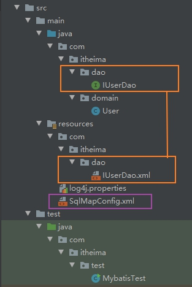
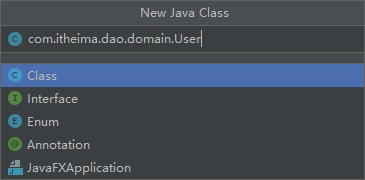
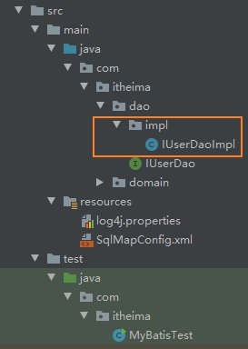
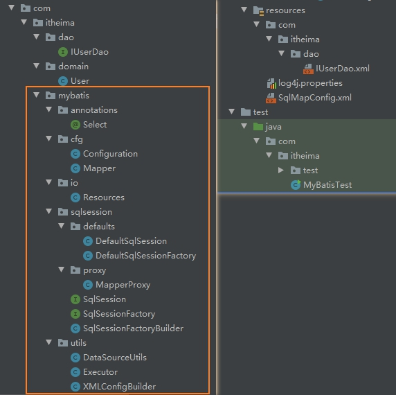

## 1. mybatis介绍

### 1.1 mybatis框架

**什么是框架：**

框架是我们软件开发中的`一套解决方案`，不同的框架解决的是不同的问题。简单来说，框架其实就是`某种应用的半成品`，就是一组组件，供你选用完成你自己的系统。

简单说就是使用别人搭好的舞台，你来做表演。而且，框架一般是成熟的，不断升级的软件。

使用框架的好处：框架封装了很多的细节，使开发者可以使用极简的方式实现功能，大大提高开发效率。

**mybaits解决的问题--jdbc问题分析：**

1. 数据库链接创建、释放频繁造成系统资源浪费从而影响系统性能，如果使用`数据库链接池`可解决此问题。
2. SQL语句在代码中硬编码，造成代码不易维护，实际应用SQL变化的可能较大，SQL变动需要改变Java代码。
3. 使用prepareedStatement向占有位符号传参数存在硬编码，因为SQL语句的where条件不一定，可能多也可能少，修改SQL还需要修改代码，系统不易维护。
4. 对结果集解析存在硬编码（查询列名），SQL变化导致解析代码变化，系统不易维护，如果能将数据库记录封装成pojo对象解析比较方便。

**mybaits概述：**

[mybatis官方文档](https://mybatis.org/mybatis-3/zh/index.html)

[9种设计模式在Mybatis中的运用](https://mp.weixin.qq.com/s/LREgc0jQFkdTWdLgmLn9og)

mybais是一个持久层框架，用Java编写的。它封装了jdbc操作的很多细节，使开发者只需关注sql语句本身，而无需关注注册驱动，创建连接等繁杂过程。

mybatis通过xml或注解的方式将要执行的各种statement配置起来，并通过Java对象和statement中SQL的动态参数进行映射生成最终执行的SQL语句，最后由mybatis框架执行SQL并将结果映射为Java对象并返回。

采用ORM思想解决了实体和数据库映射的问题，对jdbc进行了封装，屏蔽了jdbc api底层访问细节，使我们不用与jdbc api打交道，就可以完成对数据库的持久化操作。

ORM：Object Relational Mapping `对象关系映射`。简单的说：就是`把数据库表`和`实体类`及实体类的属性对应起来。让我们可以操作实体类就实现操作数据库表。

### 1.2 三层架构

**表现层：** 用于展现数据

**业务层：** 处理业务需求

**持久层：** 和数据库交互

## 2. 编写mybatis的入门程序

### 2.1 mybatis入门案例--xml实现查询

创建maven项目【不用勾选archetype】，在项目中的pom.xml文件坐标中引入：

```xml
<dependencies>
        <dependency>
            <groupId>org.mybatis</groupId>
            <artifactId>mybatis</artifactId>
            <version>3.4.5</version>
        </dependency>
        <dependency>
            <groupId>mysql</groupId>
            <artifactId>mysql-connector-java</artifactId>
            <version>5.1.6</version>
        </dependency>
        <dependency>
            <groupId>log4j</groupId>
            <artifactId>log4j</artifactId>
            <version>1.2.12</version>
        </dependency>
        <dependency>
            <groupId>junit</groupId>
            <artifactId>junit</artifactId>
            <version>4.10</version>
        </dependency>
    </dependencies>
```

创建user表

```sql
DROP TABLE IF EXISTS `user`;

CREATE TABLE `user` (
  `id` int(11) NOT NULL auto_increment,
  `username` varchar(32) NOT NULL COMMENT '用户名称',
  `birthday` datetime default NULL COMMENT '生日',
  `sex` char(1) default NULL COMMENT '性别',
  `address` varchar(256) default NULL COMMENT '地址',
  PRIMARY KEY  (`id`)
) ENGINE=InnoDB DEFAULT CHARSET=utf8;


insert  into `user`(`id`,`username`,`birthday`,`sex`,`address`) values
    (41,'老王','2018-02-27 17:47:08','男','北京'),
    (42,'小二王','2018-03-02 15:09:37','女','北京金燕龙'),
    (43,'小二王','2018-03-04 11:34:34','女','北京金燕龙'),
    (45,'传智播客','2018-03-04 12:04:06','男','北京金燕龙'),
    (46,'老王','2018-03-07 17:37:26','男','北京'),
    (48,'小马宝莉','2018-03-08 11:44:00','女','北京修正');

```

现在，让我们来看看更具体地代码怎么写吧。

mybatis文件目录结构如图：



在项目中创建一个与表对应地User类

```java
public class User implements Serializable {
    private Integer id;
    private String username;
    private Date birthday;
    private String sex;
    private String address;
}
```

这里解释一下，为什么要继承Serializable类？

首先来了解一下Serializable接口，这是一个空接口，并没有什么特殊的含义，只是`用来表示一个类的对象可以被序列化`。

什么时候需要继承Serializable接口呢？

通俗来讲，在分布式的应用中就需要继承Serializable接口，比如网络中传递数据的socket，需要将数据存储到硬盘的数据；如果是非分布式应用，就需要继承Serializable。

[Serializable接口更详细的参考链接](https://www.jianshu.com/p/3efef93f7e8f)

创建IUserDao接口，提供查询所有的方法 findAll()

```java
public interface IUserDao {

    /**
     * 查询所有操作
     * @return
     */
    List<User> findAll();
}
```

根据ORM思想，和数据库表User对象的类User类已经创建好了。现在来配置JDBC。

在resource中创建mybatis的核心配置文件SqlMapConfig.xml。约束和配置文件如下：

```xml
<?xml version="1.0" encoding="UTF-8"?>
<!DOCTYPE configuration
        PUBLIC "-//mybatis.org//DTD Config 3.0//EN"
        "http://mybatis.org/dtd/mybatis-3-config.dtd">

<!--上面是约束信息-->
<!--下面是配置信息-->

<!--mybatis的主配置文件-->
<configuration>
    <!--  配置环境  -->
    <environments default="mysql">
        <!--   配置MySQL的环境     -->
        <environment id="mysql">
            <!-- 配置事务的类型 -->
            <transactionManager type="JDBC"/>
            <!-- 配置数据源（连接池） -->
            <dataSource type="POOLED">
                <!-- 配置连接数据库的4个基本信息 -->
                <property name="driver" value="com.mysql.jdbc.Driver"/>
                <property name="url" value="jdbc:mysql://localhost:3306/myproject_textdb?characterEncoding=utf8"/>
                <property name="username" value="root"/>
                <property name="password" value="uber"/>
            </dataSource>
        </environment>
    </environments>

    <!-- 指定映射配置文件的位置，映射配置文件指的是每个dao独立的配置文件 -->
    <mappers>
        <mapper resource="com/itheima/dao/IUserDao.xml"/>
    </mappers>

</configuration>
```

上面的代码我们看到除了jdbc的配置文件，还有一个mappers,这个是什么呢？

我们知道，配置JDBC，目的就是为了执行SQL语句，这里的mappers就是指向(某个函数)的SQL语句。

接下来，创建与接口映射的配置文件IUserDao.xml

```xml
<?xml version="1.0" encoding="UTF-8" ?>
<!DOCTYPE mapper
        PUBLIC "-//mybatis.org//DTD Mapper 3.0//EN"
        "http://mybatis.org/dtd/mybatis-3-mapper.dtd">

<mapper namespace="com.itheima.dao.IUserDao">
    <!-- 配置查询所有 -->
    <select id="findAll" resultType="com.itheima.domain.User">
        select * from user
    </select>
</mapper>
```

这里有几个注意事项：

1. 创建IUserDao.xml和IUserDao.java时名称是为了和我们之前的知识保持一致，`在Mybatis中它把持久层的操作接口名称和映射文件也叫做Mapper`，所以IUserDao和IUserMapper是一样的。
2. 在idea中创建目录的时候，`目录和包是不一样的`。`包`在创建的时候，com.itheima.dao它`是三级结构目录`【即com文件夹下包含itheima文件夹，itheima文件夹下包含dao文件夹】，`目录`在创建时，com.itheima.dao`是一级目录`【文件夹的名称为com.itheima.dao】。这里有一个小技巧，创建java文件时，写`com.itheima.dao.domain.User`就能创建多级目录和User.java文件。  

3. mybatis的映射配置文件必须和dao接口的包结构相同
4. 映射配置文件的mapper标签namespace属性的取值必须是dao接口的全限定类名（Fully Qualified Name，类的完整路径名，如`com.itheima.dao.IUserDao`）
5. 映射配置文件的操作配置（select），`id属性的取值必须是dao接口的方法名`【这样，namespace + id 就能够找到哪一个类是要执行SQL语句，resultType是SQL查询的结果用类封装起来】

当我们遵循了3、4、5点之后，我们在开发中就`无须再写dao的实现类`。

接下来，我们来看看运行的结果，写main测试类

```java
public class MybatisTest {
    public static void main(String[] args) throws IOException {
        //1. 读取配置文件
        InputStream inputStream = Resources.getResourceAsStream("SqlMapConfig.xml");
        //2. 创建SqlSessionFactory工厂
        SqlSessionFactoryBuilder builder = new SqlSessionFactoryBuilder();
        SqlSessionFactory factory = builder.build(inputStream);
        //3. 使用工厂生产SqlSession对象
        SqlSession session = factory.openSession();
        //4. 使用SqlSession创建Dao接口代理对象
        IUserDao userDao = session.getMapper(IUserDao.class);
        //5. 使用代理对象执行方法
        List<User> users = userDao.findAll();
        for (User user : users) {
            System.out.println(user);
        }
        //6. 释放资源
        session.close();
        inputStream.close();
    }
}
```

运行结果：

```text
User{id=41, username='老王', birthday=2018-02-27 17:47:08.0, sex='男', address='北京'}
User{id=42, username='小二王', birthday=2018-03-02 15:09:37.0, sex='女', address='北京金燕龙'}
User{id=43, username='小二王', birthday=2018-03-04 11:34:34.0, sex='女', address='北京金燕龙'}
User{id=45, username='传智播客', birthday=2018-03-04 12:04:06.0, sex='男', address='北京金燕龙'}
User{id=46, username='老王', birthday=2018-03-07 17:37:26.0, sex='男', address='北京'}
User{id=48, username='小马宝莉', birthday=2018-03-08 11:44:00.0, sex='女', address='北京修正'}
```

### 2.2 mybatis入门案例--注解 实现查询

现在我们来看看怎么通过注解来实现。

代码基本不变，唯一不一样的是xml和注解的实现。

这里我们删除IUserDao.xml映射文件【因为现在不用xml】，在IUserDao接口中查询所有方法上加上注解：

```java
public interface IUserDao {

    /**
     * 查询User表所有的数据
     * @return
     */
    List<User> findAll();
}
```

那mybatis怎么知道你写SQL的是注解还是xml呢？

还记得SqlMapConfig.xml中的代码由jdbc配置文件和指向SQL的mapper组成吗？

没错，所有的SQL的都必须写在mapper中。所以，SQL是由注解实现还是由xml实现，也应该在mapper中指明。

修改SqlMapConfig.xml的Mapper

```xml
    <!-- 如果是用注解来配置的话，此处应该使用class属性指定被注解的dao全限定类名 -->
    <mappers>
        <mapper class="com.itheima.dao.IUserDao"/>
    </mappers>
```

OK,至此，已经知道了mybatis怎么用了。

那mybatis是怎么实现的呢？我们来探索一番。

## 3. 自定义mybatis的过程

### 3.1 mybatis实现探索-- 使用Dao的实现类

在我们实际的开发中，代码越简便越好，所以不管是使用xml还是注解配置，都是采用`不写dao实现类`的方式。

但是，我们要明确，mybatis用反射的方式创建了实现类，当然，我们也是可以写dao的实现类的。

现在，我们来写写看。

写完的目录结构为：



创建实现类UserDaoImpl

```java
public class IUserDaoImpl implements IUserDao {

    private SqlSessionFactory factory;

    public IUserDaoImpl(SqlSessionFactory factory){
        this.factory = factory;
    }

    public List<User> findAll() {
        //1. 使用工厂创建对象
        SqlSession session = factory.openSession();
        //2. 使用session执行查询所有方法
        List<User> users = session.selectList("com.itheima.dao.IUserDao.findAll");
        session.close();
        //3. 返回查询结果
        return users;
    }
}
```

测试类

```java
public class MyBatisTest {
    public static void main(String[] args) throws IOException {
        //1. 读取配置文件
        InputStream inputStream = Resources.getResourceAsStream("SqlMapConfig.xml");
        //2. 创建SqlSessionFactory对象
        SqlSessionFactoryBuilder builder = new SqlSessionFactoryBuilder();
        SqlSessionFactory factory = builder.build(inputStream);
        //3. 创建IUserDaoImpl实体类
        IUserDaoImpl iUserDao = new IUserDaoImpl(factory);
        //5. 使用代理对象执行方法
        List<User> users = iUserDao.findAll();
        for (User user : users) {
            System.out.println(user.toString());
        }
        //6. 关闭
        inputStream.close();
    }
}
```

### 3.2 mybatis实现探索-- 自定义mybatis编码

分析自定义mybatis能看到的类，如下：

1. class Resources
1. class SqlSessionFactoryBuilder
1. interface SqlSessionFactory
1. interface SqlSession

现在，删除pom文件中定义的mybatis的依赖信息。这时会报很多错误，我们自己书写类来改正这些错误。

完成后目录如图所示：



我们看到错误主要集中在：测试main函数，因为缺少了这些类，所哟手动创建这些类。

创建Resource类：

```java
public class Resources {

    /**
     * 根据传入的参数，获取一个字节输入流
     * @param filePath
     * @return
     */
    public static InputStream getResourceAsStream(String filePath){
        return Resources.class.getClassLoader().getResourceAsStream(filePath);
    }
}
```

创建SqlSessionFactoryBuilder类，用于创建SqlSessionFactory对象

```java
public class SqlSessionFactoryBuilder {

    /**
     * 根据参数的字节输入流构建一个SqlSessionFactory工厂
     *
     * @param config
     * @return
     */
    public SqlSessionFactory build(InputStream config){
        return null;
    }
}
```

创建SqlSessionFactory接口，提供方法获取SqlSession

```java
public interface SqlSessionFactory {

    /**
     * 用于打开一个SqlSession对象
     * @return
     */
    SqlSession openSession();
}
```

创建SqlSession接口，这个类可以创建dao接口的代理对象，在里面声明两个方法getMapper方法和close方法

```java
/**
 * 自定义MyBatis中和数据库交互的核心类
 *      它里面可以创建dao接口的代理对象
 *
 * @author zzl
 */
public interface SqlSession {

    /**
     * 根据参数创建一个代理对象
     * @param daoInterfaceClass dao的接口字节码
     * @param <T>
     * @return
     */
    <T> T getMapper(Class<T> daoInterfaceClass);

    /**
     * 释放资源
     */
    void close();
}
```

因需要自己读取xml配置的文件，不需要约束信息，删除配置文件中的约束信息.

创建XMLConfigBuilder.java,同时引入dom4j的依赖的jar包

```java
/**
 * @author 黑马程序员
 * @Company http://www.ithiema.com
 *  用于解析配置文件
 */
public class XMLConfigBuilder {


    /**
     * 解析主配置文件，把里面的内容填充到DefaultSqlSession所需要的地方
     * 使用的技术：
     *      dom4j+xpath
     */
    public static Configuration loadConfiguration(InputStream config){
        try{
            //定义封装连接信息的配置对象（mybatis的配置对象）
            Configuration cfg = new Configuration();

            //1.获取SAXReader对象
            SAXReader reader = new SAXReader();
            //2.根据字节输入流获取Document对象
            Document document = reader.read(config);
            //3.获取根节点
            Element root = document.getRootElement();
            //4.使用xpath中选择指定节点的方式，获取所有property节点
            List<Element> propertyElements = root.selectNodes("//property");
            //5.遍历节点
            for(Element propertyElement : propertyElements){
                //判断节点是连接数据库的哪部分信息
                //取出name属性的值
                String name = propertyElement.attributeValue("name");
                if("driver".equals(name)){
                    //表示驱动
                    //获取property标签value属性的值
                    String driver = propertyElement.attributeValue("value");
                    cfg.setDriver(driver);
                }
                if("url".equals(name)){
                    //表示连接字符串
                    //获取property标签value属性的值
                    String url = propertyElement.attributeValue("value");
                    cfg.setUrl(url);
                }
                if("username".equals(name)){
                    //表示用户名
                    //获取property标签value属性的值
                    String username = propertyElement.attributeValue("value");
                    cfg.setUsername(username);
                }
                if("password".equals(name)){
                    //表示密码
                    //获取property标签value属性的值
                    String password = propertyElement.attributeValue("value");
                    cfg.setPassword(password);
                }
            }
            //取出mappers中的所有mapper标签，判断他们使用了resource还是class属性
            List<Element> mapperElements = root.selectNodes("//mappers/mapper");
            //遍历集合
            for(Element mapperElement : mapperElements){
                //判断mapperElement使用的是哪个属性
                Attribute attribute = mapperElement.attribute("resource");
                if(attribute != null){
                    System.out.println("使用的是XML");
                    //表示有resource属性，用的是XML
                    //取出属性的值
                    //获取属性的值"com/itheima/dao/IUserDao.xml"
                    String mapperPath = attribute.getValue();
                    //把映射配置文件的内容获取出来，封装成一个map
                    Map<String, Mapper> mappers = loadMapperConfiguration(mapperPath);
                    //给configuration中的mappers赋值
                    cfg.setMappers(mappers);
                }else{
                    System.out.println("使用的是注解");
                    //表示没有resource属性，用的是注解
                    //获取class属性的值
                    String daoClassPath = mapperElement.attributeValue("class");
                    //根据daoClassPath获取封装的必要信息
                    Map<String,Mapper> mappers = loadMapperAnnotation(daoClassPath);
                    //给configuration中的mappers赋值
                    cfg.setMappers(mappers);
                }
            }
            //返回Configuration
            return cfg;
        }catch(Exception e){
            throw new RuntimeException(e);
        }finally{
            try {
                config.close();
            }catch(Exception e){
                e.printStackTrace();
            }
        }

    }

    /**
     * 根据传入的参数，解析XML，并且封装到Map中
     * @param mapperPath    映射配置文件的位置
     * @return  map中包含了获取的唯一标识（key是由dao的全限定类名和方法名组成）
     *          以及执行所需的必要信息（value是一个Mapper对象，里面存放的是执行的SQL语句和要封装的实体类全限定类名）
     */
    private static Map<String,Mapper> loadMapperConfiguration(String mapperPath)throws IOException {
        InputStream in = null;
        try{
            //定义返回值对象
            Map<String,Mapper> mappers = new HashMap<String,Mapper>();
            //1.根据路径获取字节输入流
            in = Resources.getResourceAsStream(mapperPath);
            //2.根据字节输入流获取Document对象
            SAXReader reader = new SAXReader();
            Document document = reader.read(in);
            //3.获取根节点
            Element root = document.getRootElement();
            //4.获取根节点的namespace属性取值
            //是组成map中key的部分
            String namespace = root.attributeValue("namespace");
            //5.获取所有的select节点
            List<Element> selectElements = root.selectNodes("//select");
            //6.遍历select节点集合
            for(Element selectElement : selectElements){
                //取出id属性的值      组成map中key的部分
                String id = selectElement.attributeValue("id");
                //取出resultType属性的值  组成map中value的部分
                String resultType = selectElement.attributeValue("resultType");
                //取出文本内容            组成map中value的部分
                String queryString = selectElement.getText();
                //创建Key
                String key = namespace+"."+id;
                //创建Value
                Mapper mapper = new Mapper();
                mapper.setQueryString(queryString);
                mapper.setResultType(resultType);
                //把key和value存入mappers中
                mappers.put(key,mapper);
            }
            return mappers;
        }catch(Exception e){
            throw new RuntimeException(e);
        }finally{
            in.close();
        }
    }

    /**
     * 根据传入的参数，得到dao中所有被select注解标注的方法。
     * 根据方法名称和类名，以及方法上注解value属性的值，组成Mapper的必要信息
     * @param daoClassPath
     * @return
     */
    private static Map<String,Mapper> loadMapperAnnotation(String daoClassPath)throws Exception{
        //定义返回值对象
        Map<String,Mapper> mappers = new HashMap<String, Mapper>();

        //1.得到dao接口的字节码对象
        Class daoClass = Class.forName(daoClassPath);
        //2.得到dao接口中的方法数组
        Method[] methods = daoClass.getMethods();
        //3.遍历Method数组
        for(Method method : methods){
            //取出每一个方法，判断是否有select注解
            boolean isAnnotated = method.isAnnotationPresent(Select.class);
            if(isAnnotated){
                //创建Mapper对象
                Mapper mapper = new Mapper();
                //取出注解的value属性值
                Select selectAnno = method.getAnnotation(Select.class);
                String queryString = selectAnno.value();
                mapper.setQueryString(queryString);
                //获取当前方法的返回值，还要求必须带有泛型信息
                //List<User>
                Type type = method.getGenericReturnType();
                //判断type是不是参数化的类型
                if(type instanceof ParameterizedType){
                    //强转
                    ParameterizedType ptype = (ParameterizedType)type;
                    //得到参数化类型中的实际类型参数
                    Type[] types = ptype.getActualTypeArguments();
                    //取出第一个
                    Class domainClass = (Class)types[0];
                    //获取domainClass的类名
                    String resultType = domainClass.getName();
                    //给Mapper赋值
                    mapper.setResultType(resultType);
                }
                //组装key的信息
                //获取方法的名称
                String methodName = method.getName();
                String className = method.getDeclaringClass().getName();
                String key = className+"."+methodName;
                //给map赋值
                mappers.put(key,mapper);
            }
        }
        return mappers;
    }
}

```

```xml
        <dependency>
            <groupId>dom4j</groupId>
            <artifactId>dom4j</artifactId>
            <version>1.6.1</version>
        </dependency>
```

提供一个Configuration，定义数据库连接信息

```java
/**
 * 自定义mybatis的配置类
 *
 * @Author: Zzl
 * @Date: 18:34 2020/1/26
 * @Version 1.0
 **/
public class Configuration {
    private String driver;
    private String url;
    private String username;
    private String password;
}
```

提供一个类Mapper 封装sql与结果类型

```java
public class Mapper {
    /**
     * SQL
     */
    private String queryString;
    /**
     * 实体类的全限定类名
     */
    private String resultType;
}
```

针对于xml工具类进行分析，主要是读取xml文件配置信息

修改Configuration类

```java
public class Configuration {
    private String driver;
    private String url;
    private String username;
    private String password;

    private Map<String,Mapper> mappers = new HashMap<String, Mapper>();

    public Map<String, Mapper> getMappers() {
        return mappers;
    }

    public void setMappers(Map<String, Mapper> mappers) {
        //注意，这里不是简单的this.mappers = mappers,为了不覆盖，需要用putAll()
        this.mappers.putAll(mappers);
    }
}
```

创建SqlSessionFactory接口的实现类DefaultSqlSessionFactory

```java
public class DefaultSqlSessionFactory implements SqlSessionFactory {

    private Configuration cfg;

    public DefaultSqlSessionFactory(Configuration cfg){
        this.cfg = cfg;
    }

    /**
     * 用于创建一个新的操作数据库对象
     *
     * @return
     */
    @Override
    public SqlSession openSession() {
        return new DefaultSqlSession(cfg);
    }
}
```

修改SqlSessionFactoryBuilder中的build方法，并返回SqlSessionFactory的实现类

```java
public class SqlSessionFactoryBuilder {

    /**
     * 根据参数的字节输入流构建一个SqlSessionFactory工厂
     *
     * @param config
     * @return
     */
    public SqlSessionFactory build(InputStream config){
        Configuration cfg = XMLConfigBuilder.loadConfiguration(config);
        return new DefaultSqlSessionFactory(cfg);
    }
}
```

创建SqlSession接口的实现类DefaultSqlSession

```java
public class DefaultSqlSession implements SqlSession {

    private Configuration cfg;
    private Connection connection;

    public DefaultSqlSession(Configuration cfg){
        this.cfg = cfg;
        connection = DataSourceUtils.getConnection(cfg);
    }

    /**
     * 用于创建代理对象
     * @param daoInterfaceClass dao的接口字节码
     * @param <T>
     * @return
     */
    @Override
    public <T> T getMapper(Class<T> daoInterfaceClass) {
        return null;
    }

    @Override
    public void close() {

}
```

DataSourceUtils定义如下：

```java
public class DataSourceUtils {

    public static Connection getConnection(Configuration cfg){
        try {
            Class.forName(cfg.getDriver());
            return DriverManager.getConnection(cfg.getUrl(),cfg.getUsername(),cfg.getPassword());
        } catch (Exception e) {
            throw new RuntimeException(e);
        }
    }
}
```

修改DefaultSqlSesion类中的方法，如下：

```java
public class DefaultSqlSession implements SqlSession {

    private Configuration cfg;
    private Connection connection;

    public DefaultSqlSession(Configuration cfg){
        this.cfg = cfg;
        connection = DataSourceUtils.getConnection(cfg);
    }

    /**
     * 用于创建代理对象
     * @param daoInterfaceClass dao的接口字节码
     * @param <T>
     * @return
     */
    @Override
    public <T> T getMapper(Class<T> daoInterfaceClass) {
        return (T) Proxy.newProxyInstance(daoInterfaceClass.getClassLoader(),
                new Class[]{daoInterfaceClass},new MapperProxy(cfg.getMappers(),connection));
    }

    @Override
    public void close() {
        if (connection != null) {
            try {
                connection.close();
            } catch (SQLException e) {
                e.printStackTrace();
            }
        }
    }
}
```

✨✨✨创建代理对象的工具类MapperProxy类实现代理对象中的方法

```java
public class MapperProxy implements InvocationHandler {

    /**
     * map的key是全限定类名+方法名，value是SQL+SQL返回的类 类型
     */
    private Map<String, Mapper> mappers;
    private Connection conn;

    public MapperProxy(Map<String, Mapper> mappers, Connection conn) {
        this.mappers = mappers;
        this.conn = conn;
    }

    @Override
    public Object invoke(Object proxy, Method method, Object[] args) throws Throwable {
        //1.获取方法名
        String methodName = method.getName();
        //2.获取方法所在类的名称
        String className = method.getDeclaringClass().getName();
        //3.组合key
        String key = className + "." + methodName;
        //4.获取mappers中的mapper对象【注意是获取！！】
        Mapper mapper = mappers.get(key);
        //5.判断是否有mapper
        if (mapper == null) {
            throw new IllegalArgumentException("传入的参数有误");
        }
        //6.调用工具类执行查询所有
        return new Executor().selectList(mapper,conn);
    }
}
```

需要引入另外一个工具类：Executor类  负责执行SQL语句，并且封装结果集

```java
/**
 * @author 黑马程序员
 * @Company http://www.ithiema.com
 * 负责执行SQL语句，并且封装结果集
 */
public class Executor {

    public <E> List<E> selectList(Mapper mapper, Connection conn) {
        PreparedStatement pstm = null;
        ResultSet rs = null;
        try {
            //1.取出mapper中的数据
            //select * from user
            String queryString = mapper.getQueryString();
            //com.itheima.domain.User
            String resultType = mapper.getResultType();
            Class domainClass = Class.forName(resultType);
            //2.获取PreparedStatement对象
            pstm = conn.prepareStatement(queryString);
            //3.执行SQL语句，获取结果集
            rs = pstm.executeQuery();
            //4.封装结果集
            //定义返回值
            List<E> list = new ArrayList<E>();
            while(rs.next()) {
                //实例化要封装的实体类对象
                E obj = (E)domainClass.newInstance();

                //取出结果集的元信息：ResultSetMetaData
                ResultSetMetaData rsmd = rs.getMetaData();
                //取出总列数
                int columnCount = rsmd.getColumnCount();
                //遍历总列数
                for (int i = 1; i <= columnCount; i++) {
                    //获取每列的名称，列名的序号是从1开始的
                    String columnName = rsmd.getColumnName(i);
                    //根据得到列名，获取每列的值
                    Object columnValue = rs.getObject(columnName);
                    //给obj赋值：使用Java内省机制（借助PropertyDescriptor实现属性的封装）
                    //要求：实体类的属性和数据库表的列名保持一种
                    PropertyDescriptor pd = new PropertyDescriptor(columnName,domainClass);
                    //获取它的写入方法
                    Method writeMethod = pd.getWriteMethod();
                    //把获取的列的值，给对象赋值
                    writeMethod.invoke(obj,columnValue);
                }
                //把赋好值的对象加入到集合中
                list.add(obj);
            }
            return list;
        } catch (Exception e) {
            throw new RuntimeException(e);
        } finally {
            release(pstm,rs);
        }
    }


    private void release(PreparedStatement pstm,ResultSet rs){
        if(rs != null){
            try {
                rs.close();
            }catch(Exception e){
                e.printStackTrace();
            }
        }

        if(pstm != null){
            try {
                pstm.close();
            }catch(Exception e){
                e.printStackTrace();
            }
        }
    }
}
```

OK,至此完成了XML的自定义mybatis。再来实现注解的mybatis.

创建一个Select类，定义注解。

```java
@Retention(RetentionPolicy.RUNTIME)
@Target(ElementType.METHOD)
public @interface Select {
    /**
     * 配置SQL语句
     * @return
     */
    String value();
}
```

再修改dao接口和主配置文件就可以了。

```java
public interface IUserDao {

    /**
     * 查询所有操作
     * @return
     */
    @Select("select * from user")
    List<User> findAll();
}
```

```xml
    <!-- 指定映射配置文件的位置，映射配置文件指的是每个dao独立的配置文件 -->
    <mappers>
<!--        <mapper class="com/itheima/dao/IUserDao.xml"/>-->
        <mapper class="com.itheima.dao.IUserDao"/>
    </mappers>
```

```text
使用的是XML
User{id=41, username='老王', birthday=2018-02-27 17:47:08.0, sex='男', address='北京'}
User{id=42, username='小二王', birthday=2018-03-02 15:09:37.0, sex='女', address='北京金燕龙'}
User{id=43, username='小二王', birthday=2018-03-04 11:34:34.0, sex='女', address='北京金燕龙'}
User{id=45, username='传智播客', birthday=2<mappers>018-03-04 12:04:06.0, sex='男', address='北京金燕龙'}
User{id=46, username='老王', birthday=2018-03-07 17:37:26.0, sex='男', address='北京'}
User{id=48, username='小马宝莉', birthday=2018-03-08 11:44:00.0, sex='女', address='北京修正'}
```

```text
使用的是注解
User{id=41, username='老王', birthday=2018-02-27 17:47:08.0, sex='男', address='北京'}
User{id=42, username='小二王', birthday=2018-03-02 15:09:37.0, sex='女', address='北京金燕龙'}
User{id=43, username='小二王', birthday=2018-03-04 11:34:34.0, sex='女', address='北京金燕龙'}
User{id=45, username='传智播客', birthday=2018-03-04 12:04:06.0, sex='男', address='北京金燕龙'}
User{id=46, username='老王', birthday=2018-03-07 17:37:26.0, sex='男', address='北京'}
User{id=48, username='小马宝莉', birthday=2018-03-08 11:44:00.0, sex='女', address='北京修正'}
```

## 4. 总结

**自定义mybatis流程总结：**

其步骤如下：

1. SqlSessionFactoryBuilder接收SqlMapConfig.xml文件流，构建出SqlSessionFactory对象。
2. SqlSessionFactory读取SqlMapConfig.xml中连接数据库和mapper映射信息。用来生产出真正操作数据库的SqlSession对象
3. SqlSession对象有两大作用：（1）生成代理对象 （2）定义实体类定义通用增删改查方法
   1. 生成代理对象：通过JDK代理模式创建出代理对象作为getMapper返回值，这里主要工作是在创建代理对象时第三个参数处理类里面得到sql语句。执行对应的CRUD操作。
   2. 实体类：在SqlSessionImpl对象中提供selectList()方法
4. 封装结果集。

通过以上流程我们不难看出，无论是让mybatis帮我们创建代理对象还是直接使用mybatis提供的CRUD方法，其本质都是得到jdbc的Connection对象，执行对应sql语句，最终封装结果集。
