## 1. 连接池

在Mybatis中有连接池技术，mybatis采用的是自己的连接池技术。

在Mybatis的SqlMapConfig.xml配置文件中，通过`<dataSource type="pooled">`来实现Mybatis中连接池的配置。

例如：

```xml
    <environments default="mysql">
        <environment id="mysql">
            <transactionManager type="JDBC"/>
            <dataSource type="POOLED">
                <property name="driver" value="com.mysql.jdbc.Driver"/>
                <property name="url" value="jdbc:mysql://localhost:3306/myproject_textdb?characterEncoding=utf8"/>
                <property name="username" value="root"/>
                <property name="password" value="root"/>
            </dataSource>
        </environment>
    </environments>
```

在Mybatis中我们将它的数据源dataSource分为以下几类：

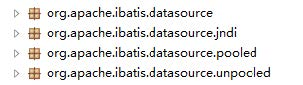

可以看出Mybatis将它自己的数据源分为三类：

| 连接池技术 |      使用的数据源      |
| :--------: | :--------------------: |
|  UNPOOLED  | `不使用`连接池的数据源 |
|   POOLED   |  `使用`连接池的数据源  |
|    JNDI    | 使用`JNDI`实现的数据源 |

具体结构如下：

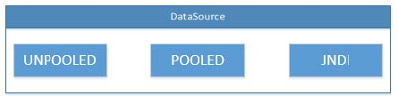

相应地，MyBatis内部分别定义了实现了`java.sql.DataSource接口`的UnpooledDataSource，PooledDataSource类来表示UNPOOLED、POOLED`类`型的数据源。

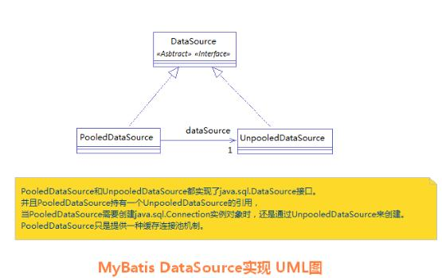

MyBatis在初始化时，根据`<dataSource>`的type属性来创建相应类型的的数据源DataSource，即：

1. type=”POOLED”：MyBatis会创建PooledDataSource实例
2. type=”UNPOOLED” ： MyBatis会创建UnpooledDataSource实例
3. type=”JNDI”：MyBatis会从`JNDI服务上`查找DataSource实例，然后返回使用

MyBatis是通过`工厂模式`来创建数据源DataSource对象的，MyBatis定义了抽象的工厂接口:org.apache.ibatis.datasource.DataSourceFactory,通过其`getDataSource()`方法返回数据源DataSource

在这三种数据源中，我们一般采用的是POOLED数据源（很多时候我们所说的数据源就是为了`更好的管理数据库连接`，也就是我们所说的连接池技术）。

我们在实际开发中都会使用连接池。因为它可以减少我们获取连接所消耗的时间。

### 1.1 过程分析

当我们需要创建SqlSession对象`并需要执行SQL语句时`，这时候MyBatis`才会去调用dataSource对象来创建java.sql.Connection对象`。也就是说，java.sql.Connection对象的创建一直延迟到执行SQL语句的时候。

通过源码可以发现，真正连接打开的时间点，只是在我们执行SQL语句时，才会进行。其实这样做我们也可以进一步发现，`数据库连接是我们最为宝贵的资源，只有在要用到的时候，才去获取并打开连接，当我们用完了就再立即将数据库连接归还到连接池中。`

连接池调用的过程：

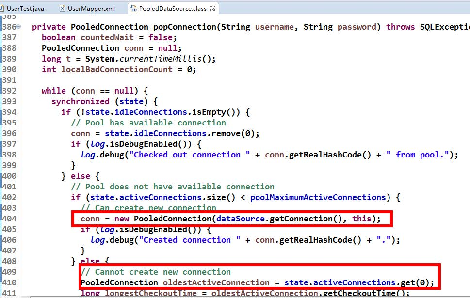

### 1.2 比对--UnpooledDataSource，PooledDataSource

**日志比对：**

POOLED连接池：

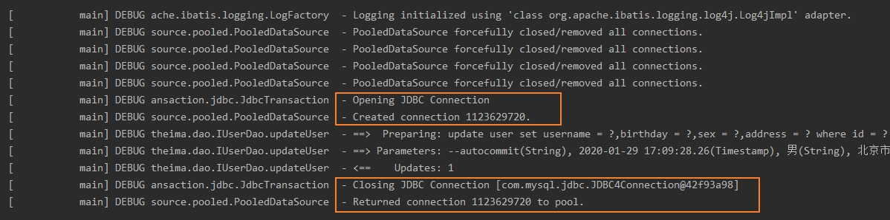

UNPOOLED连接池：

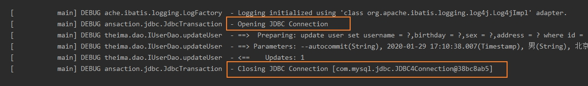

**源码比对：**

[连接池源码分析,点击跳转](https://www.jianshu.com/p/21cf094cb97b)

## 2. SQLxml更灵活用法

### 2.1 if、where、foreach标签

```java
<select id="selectUserInIds"parameterType="com.itheima.domain.QueryVo"resultMap="userMap">
    select * from user
    <where>
        <if test="userIds != null and userIds.size() > 0">
            <foreach collection="userIds" item="userId"  open="and id in (" separator="," close=")">
                #{userId}
            </foreach>
        </if>
    </where>
</select>
```

分析：

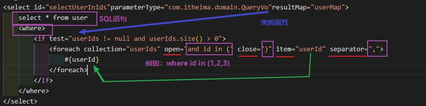

SQL 语句： `select * from user where id in (?)`

1. `<foreach>`标签用于遍历集合，它的属性：  
2. collection:代表要遍历的`集合`元素，注意编写时不要写#{}
3. open:代表语句的开始部分
4. close:代表结束部分
5. item:代表遍历集合的`每个元素`，生成的变量名
6. sperator:代表分隔符

### 2.2 动态SQL

```xml
    <sql id="defaultSelectFromUser">
        select * from user
    </sql>

    <select id="selectAll" resultMap="userMap">
        <include refid="defaultSelectFromUser"/>
    </select>
```

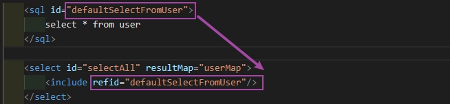

其中`<include>`标签的 refid 属性的值就是`<sql>` 标签定义 id的取值。

注意：如果`引用其它 mapper.xml 的 sql 片段`，则在引用时需要加上 namespace，如下：  
`<include refid="namespace.sql 片段”/>`

当然，上面介绍的标签可以合在一起使用：

```java
    <select id="selectUserInIds" parameterType="com.itheima.domain.QueryVo" resultMap="userMap">
        <include refid="defaultSelectFromUser"/>
        <where>
            <if test="userIds != null and userIds.size() > 0">
                <foreach collection="userIds" open="and id in (" close=")" item="userId" separator=",">
                    #{userId}
                </foreach>
            </if>
        </where>
    </select>
```

## 3. 多表查询【xml】

先向数据库添加新的数据：

```sql
DROP TABLE IF EXISTS `account`;

CREATE TABLE `account` (
  `ID` int(11) NOT NULL COMMENT '编号',
  `UID` int(11) default NULL COMMENT '用户编号',
  `MONEY` double default NULL COMMENT '金额',
  PRIMARY KEY  (`ID`),
  KEY `FK_Reference_8` (`UID`),
  CONSTRAINT `FK_Reference_8` FOREIGN KEY (`UID`) REFERENCES `user` (`id`)
) ENGINE=InnoDB DEFAULT CHARSET=utf8;


insert  into `account`(`ID`,`UID`,`MONEY`) values (1,46,1000),(2,45,1000),(3,46,2000);


DROP TABLE IF EXISTS `role`;

CREATE TABLE `role` (
  `ID` int(11) NOT NULL COMMENT '编号',
  `ROLE_NAME` varchar(30) default NULL COMMENT '角色名称',
  `ROLE_DESC` varchar(60) default NULL COMMENT '角色描述',
  PRIMARY KEY  (`ID`)
) ENGINE=InnoDB DEFAULT CHARSET=utf8;


insert  into `role`(`ID`,`ROLE_NAME`,`ROLE_DESC`) values (1,'院长','管理整个学院'),(2,'总裁','管理整个公司'),(3,'校长','管理整个学校');


DROP TABLE IF EXISTS `user_role`;

CREATE TABLE `user_role` (
  `UID` int(11) NOT NULL COMMENT '用户编号',
  `RID` int(11) NOT NULL COMMENT '角色编号',
  PRIMARY KEY  (`UID`,`RID`),
  KEY `FK_Reference_10` (`RID`),
  CONSTRAINT `FK_Reference_10` FOREIGN KEY (`RID`) REFERENCES `role` (`ID`),
  CONSTRAINT `FK_Reference_9` FOREIGN KEY (`UID`) REFERENCES `user` (`id`)
) ENGINE=InnoDB DEFAULT CHARSET=utf8;

insert  into `user_role`(`UID`,`RID`) values (41,1),(45,1),(41,2);
```

### 3.1 一对一

**查询所有账户，同时还要获取到当前账户的所属用户信息:**

分析这个需求，一个账户只能有一个用户信息

这涉及到的SQL语句为：

```sql
select u.*,a.id as aid,a.uid,a.money
    from account a,user u
    where a.uid =u.id;
```

写SQL要注意一下：`where aid = u.id`是会报错的。【原因还不是很清楚】，那为什么还是要写 `a.id as aid`呢.

这是因为，`在建表的时候，user有id,account有id`,到时候查出的数据对`对象`封装赋值时，需要区分user.id 和account.id，这个时候aid就派上用场了。详细代码和解释在下面会有写。

查询出来的结果为

```text
+----+----------+---------------------+------+------------+-----+------+-------+
| id | username | birthday            | sex  | address    | aid | uid  | money |
+----+----------+---------------------+------+------------+-----+------+-------+
| 41 | 老王     | 2018-02-27 17:47:08 | 男   | 北京       |   1 |   41 |  1000 |
| 45 | 传智播客 | 2018-03-04 12:04:06 | 男    | 北京金燕龙 |   2 |   45 |  1000 |
| 41 | 老王     | 2018-02-27 17:47:08 | 男   | 北京       |   3 |   41 |  2000 |
+----+----------+---------------------+------+------------+-----+------+-------+
```

那怎么用mybatis实现呢？

创建account类后，让AccountUser继承Account。

```java
public class AccountUser extends Account{

    private User user;
```

IUserDao接口添加方法

```java
List<AccountUser> findAccountLinkUser();
```

SqlMappingConfig映射文件：

```xml
    <typeAliases>
        <package name="com.itheima.domain"/>
    </typeAliases>

    <mappers>
        <package name="com.itheima.dao" />
    </mappers>
```

typeAliases--package是使用别名，这样子使用`type = User`的时候，就`不用使用全限定类名`了。

mapper--package是：`解析`SqlMappingConfig时，`会解析package下所有的xml`，这样子就不用一个一个xml文件写了。

```xml
<mapper namespace="com.itheima.dao.IAccountDao">

    <resultMap id="accountMap" type="AccountUser" >
        <id property="accountId" column="aid"/>
        <result property="userId" column="uid"/>
        <result property="money" column="money"/>
        <association property="user" javaType="User">
            <id property="userId" column="id"/>
            <result property="userName" column="username"/>
            <result property="userBirthday" column="birthday"/>
            <result property="userSex" column="sex"/>
            <result property="userAddress" column="address"/>
        </association>
    </resultMap>

    <select id="findAccountLinkUser" resultMap="accountMap" >
        select u.*,a.id as aid,a.uid,a.money from account a,user u where a.uid =u.id;
    </select>
```

解析：

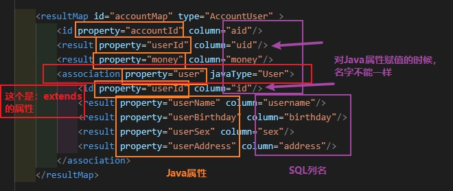

最后，再写相应的测试类，结果如下：

```text
Account{accountId=1, userId=41, money=1000.0}          AccountUser{user=User{userId=41, userName='老王', userAddress='北京', userSex='男', userBirthday=Tue Feb 27 17:47:08 CST 2018}}
Account{accountId=2, userId=45, money=1000.0}          AccountUser{user=User{userId=45, userName='传智播客', userAddress='北京金燕龙', userSex='男', userBirthday=Sun Mar 04 12:04:06 CST 2018}}
Account{accountId=3, userId=41, money=2000.0}          AccountUser{user=User{userId=41, userName='老王', userAddress='北京', userSex='男', userBirthday=Tue Feb 27 17:47:08 CST 2018}}
```

### 3.2 一对多

**查询所有用户，同时获取到用户下所有账户的信息：**

分析需求，一个用户可以有多个账号，所以可以在User类下使用`List<Account> accounts`。

```java
public class User {
    private Integer userId;
    private String userName;
    private String userAddress;
    private String userSex;
    private Date userBirthday;

    private List<Account> accounts;
```

xml的mapper：

```xml
    <resultMap id="userMap" type="User">
        <!-- 主键字段的对应 -->
        <id property="userId" column="id"/>
        <!-- 非主键字段的对应 -->
        <result property="userName" column="username"/>
        <result property="userSex" column="sex"/>
        <result property="userAddress" column="address"/>
        <result property="userBirthday" column="birthday"/>
        <collection property="accounts" ofType="Account">
            <id property="accountId" column="aid"/>
            <result property="userId" column="uid"/>
            <result property="money" column="money"/>
        </collection>
    </resultMap>

    <select id="selectUserAndAccount" resultMap="userMap">
            select user.*,account.id as aid,account.uid,account.money
                from user left outer join account on user.id = uid;
    </select>
```

这里可以看到，和前面不用，List使用了：

```xml
<collection property="accounts" ofType="Account">
```

collection是List的，ofType是accounts【Java属性】的类型

写测试类:

```java
    @Test
    public void testSelectUserAndAccount(){
        List<User> users = userDao.selectUserAndAccount();
        for (User user : users) {
            System.out.println(user);
            System.out.println(user.getAccounts());
        }
    }
```

结果为：

```text
User{userId=41, userName='老王', userAddress='北京', userSex='男', userBirthday=Tue Feb 27 17:47:08 CST 2018}
[Account{accountId=1, userId=41, money=1000.0}, Account{accountId=3, userId=41, money=2000.0}]
User{userId=45, userName='传智播客', userAddress='北京金燕龙', userSex='男', userBirthday=Sun Mar 04 12:04:06 CST 2018}
[Account{accountId=2, userId=45, money=1000.0}]
User{userId=42, userName='小二王', userAddress='北京金燕龙', userSex='女', userBirthday=Fri Mar 02 15:09:37 CST 2018}
[]
User{userId=43, userName='小二王', userAddress='北京金燕龙', userSex='女', userBirthday=Sun Mar 04 11:34:34 CST 2018}
[]
```

可以看到，同一个用户下有多个账户【老王有多张卡】，mybatis已经帮我们把多条结果合在一起了。

这里对于print也多说一下。

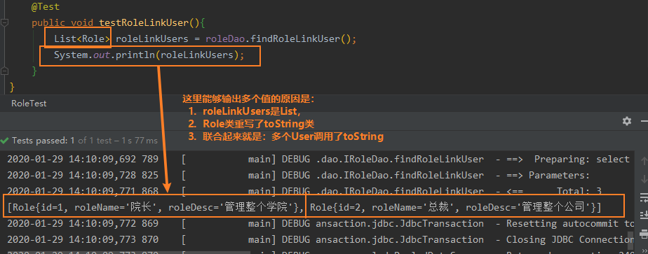

### 3.3 多对多

**查询所有角色，并查询角色所有拥有的用户：**

一个用户有多个角色，一个角色可以被多个用户拥有。

要在类的属性下添加List，同样，也是用collection。

User类添加`List<Role>`

```java
public class User {
    private Integer userId;
    private String userName;
    private String userAddress;
    private String userSex;
    private Date userBirthday;

    private List<Account> accounts;

    private List<Role> roles;
}
```

xml:

```xml

    <resultMap id="userLinkRoleMap" type="user" >
        <id property="userId" column="id"/>
        <result property="userBirthday" column="birthday"/>
        <result property="userAddress" column="address"/>
        <result property="userSex" column="sex"/>
        <result property="userName" column="username"/>
        <collection property="roles" ofType="Role">
            <id property="roleId" column="roleid"/>
            <result property="roleDesc" column="role_desc"/>
            <result property="roleName" column="role_name"/>
        </collection>
    </resultMap>

    <select id="selectUserLinkRole" resultMap="userLinkRoleMap" >
        select user.*,role.id as roleid,role_desc,role_name from user
            left outer join user_role on user.id = user_role.uid
            left outer join role on user_role.rid = role.id
    </select>
```

结果：

```text
User{userId=41, userName='老王', userAddress='北京', userSex='男', userBirthday=Tue Feb 27 17:47:08 CST 2018}
[Role{id=1, roleName='院长', roleDesc='管理整个学院'}, Role{id=2, roleName='总裁', roleDesc='管理整个公司'}]
User{userId=45, userName='传智播客', userAddress='北京金燕龙', userSex='男', userBirthday=Sun Mar 04 12:04:06 CST 2018}
[Role{id=1, roleName='院长', roleDesc='管理整个学院'}]
User{userId=42, userName='小二王', userAddress='北京金燕龙', userSex='女', userBirthday=Fri Mar 02 15:09:37 CST 2018}
[]
User{userId=43, userName='小二王', userAddress='北京金燕龙', userSex='女', userBirthday=Sun Mar 04 11:34:34 CST 2018}
[]
```

同样的，在Role类下，也要添加`List<User>`.道理一样，不再赘述。

## 4. 延迟加载

**什么是延迟加载：**

就是在需要用到数据时才进行加载，不需要用到数据时就不加载数据。延迟加载也称懒加载.

- 好处：先从单表查询，需要时再从关联表去关联查询，大大提高数据库性能，因为查询单表要比关联查询多张表速度要快。
- 坏处： 因为只有当需要用到数据时，才会进行数据库查询，这样在大批量数据查询时，因为查询工作也要消耗时间，所以可能造成用户等待时间变长，造成用户体验下降。

**什么是立即加载：**

不管用不用，只要一调用方法，马上发起查询。

在对应的四种表关系中：一对多，多对一，一对一，多对多

一对多，多`对多`：通常情况下我们都是采用`延迟加载`。  
多对一，一`对一`：通常情况下我们都是采用`立即加载`。

**在SqlMapConfig.xml主配置文件中添加延迟加载相关设置：**

```xml
<configuration>

    <settings>
        <setting name="lazyLoadingEnabled" value="true"/>
        <setting name="aggressiveLazyLoading" value="false"/>
    </settings>

</configuration>
```

## 5. 缓存

**什么是缓存？**

缓存是存在于内存中的临时数据。

**为什么使用缓存？**

减少和数据库的交互次数，提高执行效率

**什么样的数据能使用缓存，什么样的数据不能使用？**

适用于缓存：

1. 经常查询并且不经常改变的
2. 数据的正确与否对最终结果影响不大

不适用缓存：

1. 经常改变的数据
2. 数据的正确与否对最终结果影响很大的，比如商品的库存，银行的汇率，股市的牌价等

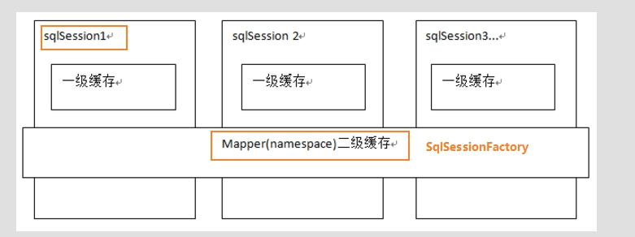

### 5.1 一级缓存

它指的是Mybatis中SqlSession`对象`的缓存。对象，注意是对象缓存。`一级缓存默认存在的，不像二级缓存需要手动开启。`

当我们执行查询之后，查询的结果会同时存入到SqlSession为我们提供一块区域中。

该区域的结构是一个Map。当我们再次查询同样的数据，mybatis会先去sqlsession中查询是否有，有的话直接拿出来用。

当SqlSession对象消失时，mybatis的一级缓存也就消失了。

```java
    @Test
    public void testFirstLevelCache(){
        IRoleDao iRoleDao1 = session.getMapper(IRoleDao.class);
        List<Role> roleLinkUsers1 = iRoleDao1.findRoleLinkUser();
        System.out.println(iRoleDao1);
        System.out.println(roleLinkUsers1);

        System.out.println("-----");

        IRoleDao iRoleDao2 = session.getMapper(IRoleDao.class);
        List<Role> roleLinkUsers2 = iRoleDao1.findRoleLinkUser();
        System.out.println(iRoleDao2);
        System.out.println(roleLinkUsers2);
    }
}
```

结果为

```text
org.apache.ibatis.binding.MapperProxy@13eb8acf
[com.itheima.domain.Role@51c8530f, com.itheima.domain.Role@7403c468, com.itheima.domain.Role@43738a82]
-----
org.apache.ibatis.binding.MapperProxy@c81cdd1
[com.itheima.domain.Role@51c8530f, com.itheima.domain.Role@7403c468, com.itheima.domain.Role@43738a82]
```

可以发现`List<Role> roleLinkUsers1`和`List<Role> roleLinkUsers2`指向的都是同一个对象。

同时，要有一点要注意：一级缓存是 SqlSession 范围的缓存，当调用 `SqlSession 的修改，添加，删除，commit()，close()等方法时`，就会`清空`一级缓存。

### 5.2 二级缓存

二级缓存：它指的是Mybatis中`SqlSessionFactory对象`的缓存。由同一个SqlSessionFactory对象创建的SqlSession共享其缓存。

`二级缓存默认不使用，需要手动开启。`

**二级缓存使用步骤:**

一：让Mybatis框架打开二级缓存开关（在SqlMapConfig.xml中配置）

```xml
<configuration>

    <settings>
        <setting name="cacheEnabled" value="true">
    </settings>

</configuration>
```

二：让当前的映射文件支持二级缓存（在IUserDao.xml中配置）

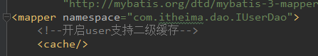

三：让当前的操作支持二级缓存（在select标签中配置）

```xml
<select id="findId" parameterType="INT" resultType="user" useCache="true">
    select * from user where id = #{uid}
</select>
```