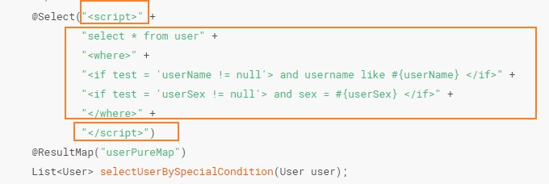
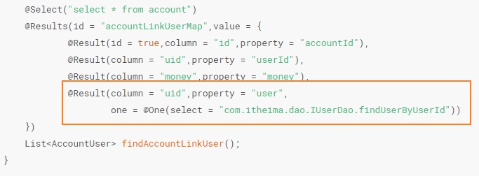
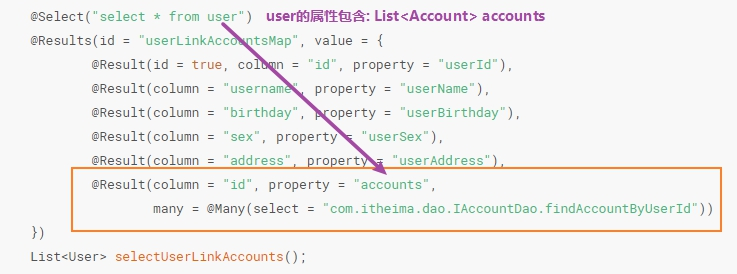
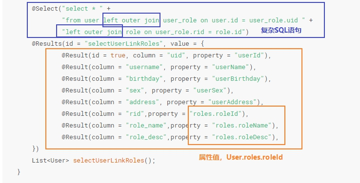

## 1. 注解

注解，直接写在Dao层上，这样子就不用再创建对应Dao层的xml文件了。当然，也不能创建，`如果同时存在Dao层的xml文件，也存在注解，那么会报错`，这一点首先引起注意。

### 1.1 代码

首先，先在全局配置文件（SqlMapConfig）中配置解析路径:

```xml
<configuration>
    <mappers>
        <package name="com.itheima.dao" />
    </mappers>
</configuration>
```

**对应的Dao层：**

IUserDao层：

```java
public interface IUserDao {

    /**
     * 列出所有数据
     *
     * @return
     */
    @Select("select * from user")
    @Results(id = "userPureMap", value = {
            @Result(id = true, column = "id", property = "userId"),
            @Result(column = "username", property = "userName"),
            @Result(column = "birthday", property = "userBirthday"),
            @Result(column = "sex", property = "userSex"),
            @Result(column = "address", property = "userAddress"),
    })
    List<User> findAllUser();

    /**
     * 根据userid查询数据库
     *
     * @param userId
     * @return
     */
    @Select("select * from user where id = #{userId}")
    @ResultMap(value = {"userPureMap"})
    User findUserByUserId(Integer userId);

    /**
     * 根据用户名模糊查询
     *
     * @param userName
     * @return
     */
    @Select("select * from user where username like #{userName}")
    @ResultMap("userPureMap")
    List<User> selectUserByUserName(String userName);

    /**
     * 查询总条数
     *
     * @return
     */
    @Select("select count(*) from user")
    Integer selectUserAmount();

    /**
     * 根据不同的user从数据库查询出数据，
     * 比如，传入的user有userName，则根据userName查询数据；
     * 如果传入的数据有userName,userSex，则根据两者查询出数据
     *
     * @param user
     * @return
     */
    @Select("<script>" +
            "select * from user" +
            "<where>" +
            "<if test = 'userName != null'> and username like #{userName} </if>" +
            "<if test = 'userSex != null'> and sex = #{userSex} </if>" +
            "</where>" +
            "</script>")
    @ResultMap("userPureMap")
    List<User> selectUserBySpecialCondition(User user);

    /**
     * 查询用户和账户信息
     *
     * @return
     */
    @Select("select * from user")
    @Results(id = "userLinkAccountsMap", value = {
            @Result(id = true, column = "id", property = "userId"),
            @Result(column = "username", property = "userName"),
            @Result(column = "birthday", property = "userBirthday"),
            @Result(column = "sex", property = "userSex"),
            @Result(column = "address", property = "userAddress"),
            @Result(column = "id", property = "accounts",
                    many = @Many(select = "com.itheima.dao.IAccountDao.findAccountByUserId"))
    })
    List<User> selectUserLinkAccounts();

    /**
     * 查询用户信息和角色信息
     *
     * @return
     */
    @Select("select * " +
            "from user left outer join user_role on user.id = user_role.uid " +
            "left outer join role on user_role.rid = role.id")
    @Results(id = "selectUserLinkRoles", value = {
            @Result(id = true, column = "uid", property = "userId"),
            @Result(column = "username", property = "userName"),
            @Result(column = "birthday", property = "userBirthday"),
            @Result(column = "sex", property = "userSex"),
            @Result(column = "address", property = "userAddress"),
            @Result(column = "rid",property = "roles.roleId"),
            @Result(column = "role_name",property = "roles.roleName"),
            @Result(column = "role_desc",property = "roles.roleDesc"),
    })
    List<User> selectUserLinkRoles();
}
```

IAccountDao层：

```java
public interface IAccountDao {

    /**
     * account的单表查询
     * @return
     */
    @Select("select * from account")
    @ResultMap("accountPureMap")
    List<Account> findAllAccount();

    /**
     * 根据用户的id返回account
     * @param userId
     * @return
     */
    @Select("select * from account where uid = #{userId}")
    @Results(id = "accountPureMap", value = {
            @Result(id = true,column = "id",property = "accountId"),
            @Result(column = "uid",property = "userId"),
            @Result(column = "money",property = "money")
            })
    List<Account> findAccountByUserId(Integer userId);

    /**
     * 查询账户信息，并且包括用户信息
     * @return
     */
    @Select("select * from account")
    @Results(id = "accountLinkUserMap",value = {
            @Result(id = true,column = "id",property = "accountId"),
            @Result(column = "uid",property = "userId"),
            @Result(column = "money",property = "money"),
            @Result(column = "uid",property = "user",
                    one = @One(select = "com.itheima.dao.IUserDao.findUserByUserId"))
    })
    List<AccountUser> findAccountLinkUser();
}
```

其中几点可以注意：

### 1.2 动态SQL



动态SQL可以使用`<script>`标签，剩下的写法和xml一样。

### 1.3 多表查询--一对一



这里解释一下一对一，我们写的SQL语句其实只有“select * from account”，但是，每一条记录，都会`调用【像函数调用】`另一条SQL语句【findUserByUserId】的语句，并且`参数是每一条SQL语句的uid`。这样，我们看似只写了一条简单的SQL语句，但是，我们却执行了两条SQL语句，并且，`相应的结果也会赋值到Account.user这个属性里面`。

✨`这样子使用@One、@Many能够发挥出延迟加载的优势。`

### 1.4 多表查询--一对多




多对多同样，结果会保存到User的属性里面【`包括User.accounts`】

### 1.5 多表查询--多对多



多对多有一个重要的特点是，`会有一个中间表(如user_role表）把两个表（user表和role表）联系起来。要使用@One和@Many其实不方便，我们可以这样子写。`

✨`这样子写就没有延迟加载了。`

### 1.6 缓存

一级缓存默认存在，不用手动开启。`二级缓存需要手动开启才能用。`

**二级缓存的使用：**

一：让Mybatis框架打开二级缓存开关（在SqlMapConfig.xml中配置）

```xml
<configuration>

    <settings>
        <setting name="cacheEnabled" value="true">
    </settings>

</configuration>
```

二：在接口中添加一个注解开始二级缓存

```java
@CacheNamespace(blocking = true)
public interface IUserDao{

}
```