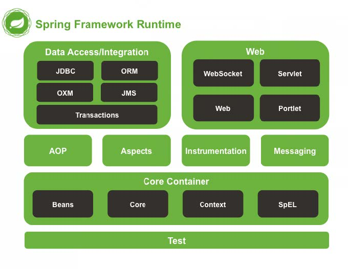
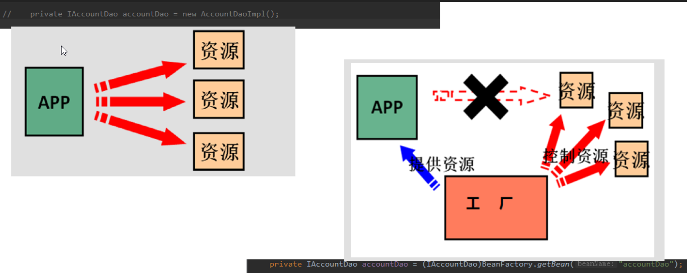
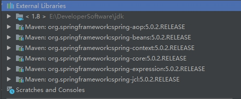
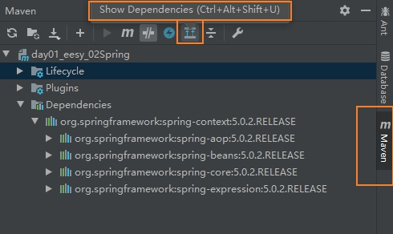
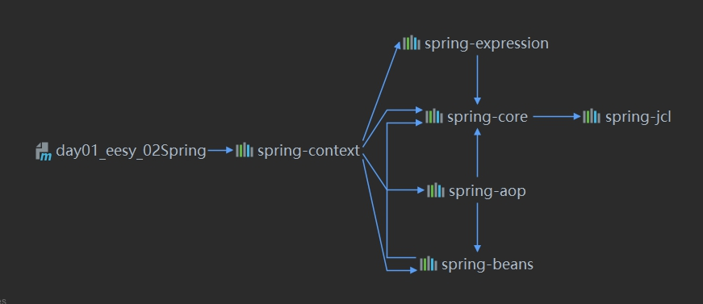
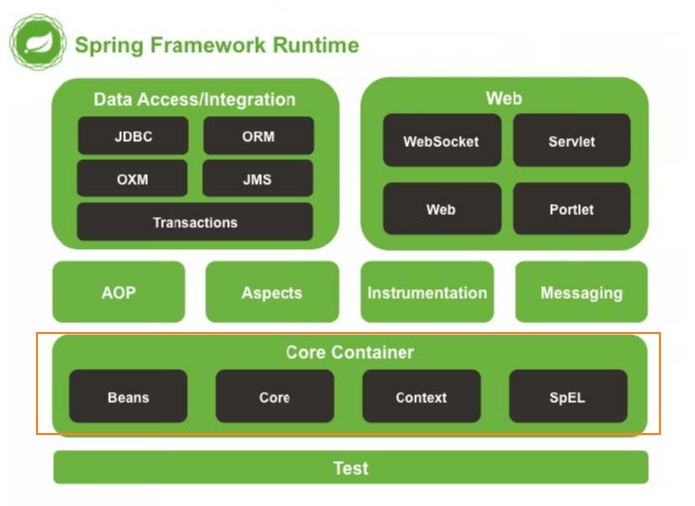
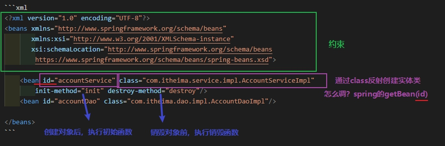
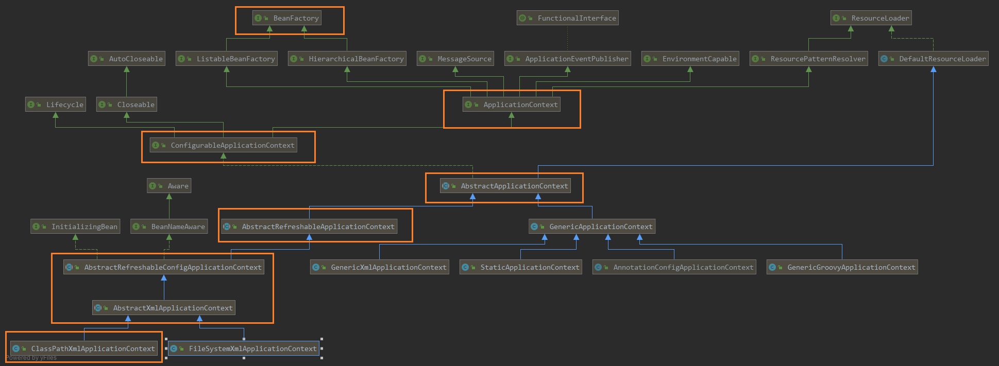
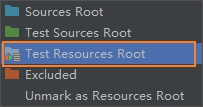
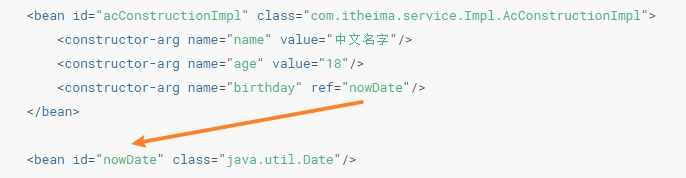

## 1. Spring介绍

**spring是什么？**

Spring是分层的Java SE/EE应用 `full-stack轻量级开源框架`，以`IoC（Inverse Of Control：反转控制）`和`AOP（Aspect Oriented Programming：面向切面编程）`为内核，提供了`展现层Spring MVC`和`持久层Spring JDBC`以及业务层事务管理等众多的企业级应用技术，还能整合开源世界众多著名的第三方框架和类库，逐渐成为使用最多的Java EE企业应用开源框架。

**spring的优势？**

方便解耦，简化开发

通过Spring提供的IoC容器，可以将对象间的依赖关系交由Spring进行控制，避免硬编码所造成的过度程序耦合。用户也不必再为单例模式类、属性文件解析等这些很底层的需求编写代码，可以更专注于上层的应用。

AOP编程的支持

通过Spring的AOP功能，方便进行面向切面的编程，许多不容易用传统OOP实现的功能可以通过AOP轻松应付。

声明式事务的支持

可以将我们从单调烦闷的事务管理代码中解脱出来，通过声明式方式灵活的进行事务的管理，提高开发效率和质量。

方便程序的测试

可以用非容器依赖的编程方式进行几乎所有的测试工作，测试不再是昂贵的操作，而是随手可做的事情。

方便集成各种优秀框架

Spring可以降低各种框架的使用难度，提供了对各种优秀框架（Struts、Hibernate、Hessian、Quartz等）的直接支持。

降低JavaEE API的使用难度

Spring对JavaEE API（如JDBC、JavaMail、远程调用等）进行了薄薄的封装层，使这些API的使用难度大为降低。

Java源码是经典学习范例

Spring的源代码设计精妙、结构清晰、匠心独用，处处体现着大师对Java设计模式灵活运用以及对Java技术的高深造诣。它的源代码无意是Java技术的最佳实践的范例。

**spring体系结构：**



## 2. IoC

### 2.1 程序的耦合

耦合性存在于各个领域，而非软件设计中独有的，但是我们只讨论软件工程中的耦合。 `在软件工程中，耦合指的就是就是对象之间的依赖性，模块间关联程度。`

模块之间的关闭有：控制关系、调用关系、数据传递关系。模块间联系越多，其耦合性越强，同时表明其独立性越差( 降低耦合性，可以提高其独立性)。耦合有：

（1） 内容耦合。当一个模块直接修改或操作另一个模块的数据时，或一个模块不通过正常入口而转入另一个模块时，这样的耦合被称为内容耦合。内容耦合是`最高程度的耦合，应该避免使用之`。  
（2） 公共耦合。两个或两个以上的模块共同引用一个全局数据项，这种耦合被称为公共耦合。在具有大量公共耦合的结构中，确定究竟是哪个模块给全局变量赋了一个特定的值是十分困难的。  
（3） 外部耦合 。一组模块都访问同一全局简单变量而不是同一全局数据结构，而且不是通过参数表传递该全局变量的信息，则称之为外部耦合。  
（4） 控制耦合 。一个模块通过接口向另一个模块传递一个控制信号，接受信号的模块根据信号值而进行适当的动作，这种耦合被称为控制耦合。  
（5） 标记耦合 。若一个模块A通过接口向两个模块B和C传递一个公共参数，那么称模块B和C之间存在一个标记耦合。  
（6） 数据耦合。模块之间通过参数来传递数据，那么被称为数据耦合。`数据耦合是最低的一种耦合形式，系统中一般都存在这种类型的耦合`，因为为了完成一些有意义的功能，往往需要将某些模块的输出数据作为另一些模块的输入数据。  
（7） 非直接耦合 。两个模块之间没有直接关系，它们之间的联系完全是通过主模块的控制和调用来实现的。  

总结： 耦合是影响软件复杂程度和设计质量的一个重要因素，在设计上我们应采用以下原则：`如果模块间必须存在耦合，就尽量使用数据耦合，少用控制耦合，限制公共耦合的范围，尽量避免使用内容耦合`。

与耦合对应的是内聚，内聚标志一个模块内各个元素彼此结合的紧密程度，一个好的内聚模块应当恰好做一件事。

软件工程中应该做到“高内聚、低耦合”。

### 2.2 IoC解决高耦合

现在我们看一下高耦合（不好）代码，也是我们之前经常写的代码：

```java
public class AccountServiceImpl implements IAccountService {
    public void saveAccount() {
        IAccountDao accountDao = new IAccountDaoImpl;
        accountDao.saveAccount();
    }
}
```

我们看到，“IAccountDao accountDao = `new` IAccountDaoImpl”这一句，`IAccountDao是直接new出来的`。

现在，我们想象一个场景：IAccountDao.java文件因为意外被删除了，但是IAccountDao.java文件其实不是很重要，没有核心代码。但是，现在因为没有.java文件，所以`编译的时候编译器就会报错`，导致整个程序运行不了。这里，耦合度就比较高了。

那能怎么做呢？

我们可以`动态代理`创建IAccountDao对象，这样，即使没有IAccountDao.java文件，但是`在编译器是可以通过的`，这样，当我们运行到这里的代码时，`只会报错而不会终止程序`。

这里可以用`工厂模式`，创建`动态代理对象`。

```java
/**
 * 一个创建bean对象的工厂
 * <p>
 * bean：在计算机英语中，有可重用软件组件的含义
 * <p>
 * JavaBean：用Java语言编写的可重用软件组件
 * JavaBean > 实体类
 * <p>
 * 它就是创建我们的service 和 dao 对象的。
 * <p>
 * 第一个：需要一个配置文件来配置我们的service和dao
 * 配置的内容：唯一表示=全限定类名（key=value）
 * 第二个：通过读取配置文件中配置的内容，反射创建对象
 * <p>
 * 我们配置文件可以是xml也可以是properties
 *
 * @Author: Zzl
 * @Date: 15:48 2020/1/31
 * @Version 1.0
 **/
public class BeanFactory {
    private static Properties props;
    private static Map<String,Object> beans;

    static {
        try {
            //实例化对象
            props = new Properties();
            //获取properties文件的流对象
            InputStream inputStream = BeanFactory.class.getClassLoader().getResourceAsStream("bean.properties");
            props.load(inputStream);
            }
        }catch (Exception e){
            throw new ExceptionInInitializerError("初始化错误");
        }
    }

public static Object getBean(String beanName) {
        Object bean = null;
        try {
            String beanPath = props.getProperty(beanName);
            System.out.println(beanPath);
            //每次都会调用默认构造函数创建对象
            bean = Class.forName(beanPath).newInstance();
        }catch (Exception e){
            e.printStackTrace();
        }
        return bean;
    }

    public static void setProps(Properties props) {
        BeanFactory.props = props;
    }
```

properties配置文件

```properties
accountService=com.itheima.service.impl.AccountServiceImpl
accountDao=com.itheima.dao.impl.AccountDaoImpl
```

这样子，我们就可以在运行时动态创建代理对象了。即使AccountServiceImpl.java文件删除了，也不会在编译期间报错，只会在运行时报Exception（这是肯定会报的，毕竟AccountServiceImpl.java文件都删除了），但是`不会影响其他类的运行`！

`这就是为什么要解耦，只有解耦，错误才只会局限于一个类里面。`

但是，我们上面写的代码其实还是有问题的，现在我们想一想，如果要创建很多个AccountServiceImpl对象，那AccountServiceImpl会被创建很多个，但是，创建这么多个有意义吗?

我们回顾一下代码，无论创建多少个，调用的都只有那个方法，既然只调用一个方法，`为什么不只创建一个对象就可以了呢?`（事实上，我们实际项目中也是这样子，有一个对象创建出来，里面的方法就可以被大家共用）

那这要怎么解决呢？我们创建该对象A出来，就用一个容器保存该对象A，如果需要使用对象A的方法，就`用一个指针指向该对象A`，就可以调用A的方法了。

单例模式可以让我们创建只一个对象。

现在改进一下代码：

```java
public class BeanFactory {
    private static Properties props;
    private static Map<String,Object> beans;

    static {
        try {
            //实例化对象
            props = new Properties();
            //获取properties文件的流对象
            InputStream inputStream = BeanFactory.class.getClassLoader().getResourceAsStream("bean.properties");
            props.load(inputStream);
            //实例化Map beans
            beans = new HashMap<String, Object>();
            //将properties里的bean路径实例化成Object，并放入到Map中
            //用keys获取properties文件的所有key
            Enumeration<Object> keys = props.keys();
            while (keys.hasMoreElements()){
                //取出每个key
                String key = keys.nextElement().toString();
                //取出每个value
                String beanPath = props.getProperty(key);
                //创建实例对象
                Object object = Class.forName(beanPath).newInstance();
                beans.put(key,object);
            }
        }catch (Exception e){
            throw new ExceptionInInitializerError("初始化错误");
        }
    }
}
```

这样子，我们就能通过工厂模式创建单例了！

而我们我们的做法，其实是spring的“`控制反转`”,即`IoC（Inversion of Control）`



对于控制反转这个含义再解释一下：把创建对象的权力交给框架，而不是我们写代码的我们。`控制反转包括依赖注入（Dependency Injection，DI）和依赖查找（Dependency Lookup）`。

我们在开发中，有些依赖关系是必须的，有些依赖关系可以通过优化代码来解除的。

## 3. 第一个spring程序

### 3.1 前期准备

官网：<http://spring.io/>

下载地址：<http://repo.springsource.org/libs-release-local/org/springframework/spring>

解压:(Spring 目录结构:)

* docs :API 和开发规范.
* libs :jar 包和源码.
* schema :约束.

下面使用的spring版本是spring5.0.2

特别说明：spring5版本是用 jdk8编写的，所以要求我们的 jdk 版本是 8及以上。同时 tomcat的版本要求8.5及以上。

### 3.2 第一个spring程序

继续使用maven工程，导入依赖

```xml
    <packaging>jar</packaging>

    <dependencies>
        <dependency>
            <groupId>org.springframework</groupId>
            <artifactId>spring-context</artifactId>
            <version>5.0.2.RELEASE</version>
        </dependency>
    </dependencies>
```

maven为我们导进的jar包：



我们再看一下show dependencies





对比spring核心图，你能看到什么？



先创建Dao类和Service类

Service类

```java
public class AccountServiceImpl implements IAccountService {

    public AccountServiceImpl() {
        System.out.println("AccountService被创建了");
    }

    public void init(){
        System.out.println("init AccountService");
    }

    public void destroy(){
        System.out.println("destroy AccountService");
    }

    public void saveAccount() {
        IAccountDao accountDao = (IAccountDao) BeanFactory.getBean("accountDao");
        accountDao.saveAccount();
    }
}
```

Dao类

```java
public class AccountDaoImpl implements IAccountDao {
    public void saveAccount() {
        System.out.println("向数据库保存了账户");
    }
}
```

创建bean.xml类，通过以下的配置，spring就能够为我们`创建代理对象，并封装在函数内`，只要我们去调用spring的函数就可以。

```xml
<?xml version="1.0" encoding="UTF-8"?>
<beans xmlns="http://www.springframework.org/schema/beans"
       xmlns:xsi="http://www.w3.org/2001/XMLSchema-instance"
       xsi:schemaLocation="http://www.springframework.org/schema/beans
        https://www.springframework.org/schema/beans/spring-beans.xsd">

    <bean id="accountService" class="com.itheima.service.impl.AccountServiceImpl"
        init-method="init" destroy-method="destroy"/>
    <bean id="accountDao" class="com.itheima.dao.impl.AccountDaoImpl"/>

</beans>
```

我们对上面的xml进行解析：

`这里的id,class也可以理解为键值对，在容器中以class创建代理对象，id是指向该代理对象【同时还有一些其他属性】`



main函数，看看我们怎么调用：

```java
public static void main(String[] args) {
    //1.获取核心容器
    ClassPathXmlApplicationContext applicationContext = new ClassPathXmlApplicationContext("bean.xml");
    //2.根据ID获取bean对象
    IAccountService accountService = (IAccountService) applicationContext.getBean("accountService");
    IAccountService accountService1 = (IAccountService) applicationContext.getBean("accountService");
    IAccountDao accountDao = (IAccountDao) applicationContext.getBean("accountDao");
    IAccountDao accountDao1 = (IAccountDao) applicationContext.getBean("accountDao");
    System.out.println(accountService);
    System.out.println(accountService1);
    System.out.println(accountDao);
    System.out.println(accountDao1);
    accountDao.saveAccount();

    applicationContext.close();
}
```

执行结果：

```text
AccountService被创建了
init AccountService
com.itheima.service.impl.AccountServiceImpl@64c87930
com.itheima.service.impl.AccountServiceImpl@64c87930
com.itheima.dao.impl.AccountDaoImpl@400cff1a
com.itheima.dao.impl.AccountDaoImpl@400cff1a
向数据库保存了账户
destroy AccountService
```

从上面的结果我们可以看到，我们用了`ClassPathXmlApplicationContext applicationContext = new ClassPathXmlApplicationContext("bean.xml")`这行代码为我们创建`封装代理对象的容器`，用`applicationContext.getBean("accountDao")`为什么`从容器中获取代理对象`【这里的accountDao为我们之前写的id】

现在我们来看一下ClassPathXmlApplicationContext的类图：



**ApplicationContext的三个常用实现类：**

`ClassPathXmlApplicationContext`：它是从类的根路径下加载配置文件【根路径为下图的Resources文件】(`推荐使用这种`)



`FileSystemXmlApplicationContext`：它是从磁盘路径上加载配置文件，配置文件可以放在磁盘上的任何位置(必须有访问权限，`不推荐使用，因为不同的操作系统路径有可能不一样`）

AnnotationConfigApplicationContext：它是用于读取`注解`创建容器的，下面会再讲。

?> 但其实上面的这三个实现类都可以用注解实现。且注解更为方便：`@ContextConfiguration(locations = "classpath:bean.xml")`

**BeanFactory 和 和 ApplicationContext  的区别：**

BeanFactory 才是 Spring 容器中的顶层接口。

ApplicationContext 是它的子接口。

**BeanFactory 和 ApplicationContext 的区别：**

创建对象的时间点不一样。

ApplicationContext：只要一读取配置文件，默认情况下就会创建对象（`立即加载`）。

BeanFactory：什么时候使用就什么时候创建对象（`延迟加载`）。

## 4. 加强--静态工厂创建对象、实例工厂创建对象

现在，我们创建函数的要求没有那么简单了，现在要求用静态工厂创建对象

```java
public class StaticFactory {
    /**
     * 模拟jar包中的类，用静态方法创建实例化对象
     * @return
     */
    public static AccountDaoImpl createAccountDaoImpl(){
        return new AccountDaoImpl();
    }
}
```

```xml
    <bean id="accountDaoByStaticFactory" class="com.itheima.factory.StaticFactory"
            factory-method="createAccountDaoImpl" scope="prototype"/>
```

现在还要求实例工厂创建对象【`不是static方法`】

```java
public class InstanceFactory {

    /**
     * 模拟jar包中的类，用方法实例化一个对象
     * @return
     */
    public AccountDaoImpl createAccountDaoImpl(){
        return new AccountDaoImpl();
    }
}
```

```xml
    <bean id="accountDaoBeanFactory" class="com.itheima.factory.InstanceFactory"/>
    <bean id="accountDaoByBeanFactoryMethod" factory-bean="accountDaoBeanFactory"
          factory-method="createAccountDaoImpl"/>
```

## 5. spring的bean的细节

### 5.1 范围

上面我们有看到scope这么一个属性：


属性：scope：指定对象的范围。它有6个属性。

[官方文档-详细解释](https://docs.spring.io/spring-framework/docs/current/spring-framework-reference/core.html#beans-factory-scopes)

* singleton :默认值，单例的.
* prototype :多例的.
* request  :WEB 项目中,Spring 创建一个 Bean 的对象,将对象存入到 `request` 域中.
* session  :WEB 项目中,Spring 创建一个 Bean 的对象,将对象存入到 `session` 域中.
* application  :WEB 项目中,作用范围为`ServletContext`
* Websocket ： WRB项目中，作用范围为`Websocket`

### 5.2 生命周期

bean对象的生命周期

单例对象

* 出生：当容器创建时对象出生
* 活着：只要容器还在，对象一直活着
* 死亡：容器销毁，对象消亡
* 总结：单例对象的生命周期`和容器(ApplicationContext)相同`

多例对象

* 出生：当我们使用对象时spring框架为我们创建
* 活着：对象只要是在使用过程中就一直活着。
* 死亡：当对象长时间不用，且没有别的对象引用时，`由Java的垃圾回收器回收`

## 6. 依赖注入

现在，我们已经初步了解了spring怎么通过反射创建对象。

但实际上项目中，`一个类里面会有很多属性。我们怎么给类中的属性赋值呢`？一般给属性赋值的方式有“带参构造函数赋值”，“set方法赋值”，那我们来看看spring的xml怎么写。

带参构造函数赋值：

```java
public class AcConstructionImpl implements AccountService {

    //如果是经常变化的数据，并不适用于注入的方式
    //这里假设下面的数据是不经常变化的，注重关注数据的类型，而不是数据的名字

    private String name;
    private String age;
    private Date birthday;

    public AcConstructionImpl(String name, String age, Date birthday) {
        this.name = name;
        this.age = age;
        this.birthday = birthday;
    }

    @Override
    public String toString() {
        return "AccountServiceImpl{" +
                "name='" + name + '\'' +
                ", age='" + age + '\'' +
                ", birthday=" + birthday +
                '}';
    }
}
```

用getter、setter方法为属性赋值：

```java
public class AcSetImpl implements AccountService {

    //如果是经常变化的数据，并不适用于注入的方式
    //这里假设下面的数据是不经常变化的，注重关注数据的类型，而不是数据的名字

    private String name;
    private String age;
    private Date birthday;
    private String[] acStrs;
    private List<String> acList;
    private Set<String> acSet;
    private Map<String,String> acMap;
    private Properties acProps;

    //这里需要创建getter和setter函数，这里为了节省篇幅，省略。

    @Override
    public String toString() {
        return "AcSetImpl{" +
                "name='" + name + '\'' +
                ", age='" + age + '\'' +
                ", birthday=" + birthday +
                ", acStrs=" + Arrays.toString(acStrs) +
                ", acList=" + acList +
                ", acSet=" + acSet +
                ", acMap=" + acMap +
                ", acProps=" + acProps +
                '}';
    }
}
```

对应的xml文件：

```xml
<?xml version="1.0" encoding="UTF-8"?>
<beans xmlns="http://www.springframework.org/schema/beans"
       xmlns:xsi="http://www.w3.org/2001/XMLSchema-instance"
       xsi:schemaLocation="http://www.springframework.org/schema/beans
        https://www.springframework.org/schema/beans/spring-beans.xsd">
    <!--  spring中的依赖注入
            依赖注入：
                能注入的数据，有三类：
                    基本类型和String
                    其他bean类型（在配置文件中或者注解配置过的bean）
                    复杂类型//集合类型
                注入的方式：有三种
                    第一种：使用构造函数提供
                    第二种：使用set方法提供
                    第三种：使用注解提供
      -->

    <!--  构造函数注入：
            使用的标签：constructor-arg
            标签出现的位置：bean标签的内部
            标签中的属性：
                ======给哪个参数赋值======
                type:【一般不用】用于指定要注入的数据类型（赋值），该数据类型是“构造函数中某个或某些参数的类型”
                index：【一般不用】给构造函数中“指定索引位置的参数”赋值（注入数据），索引的位置从0开始
                name：【 √ 】给构造函数中“指定名称的参数”赋值
                ======赋什么值======
                value：用于提供基本类型和String类型的数据
                ref：引用其他数据类型，指定其他的bean类型数据（在spring的IoC核心容器中出现过的bean对象）。
            -->
    <bean id="acConstructionImpl" class="com.itheima.service.Impl.AcConstructionImpl">
        <constructor-arg name="name" value="中文名字"/>
        <constructor-arg name="age" value="18"/>
        <constructor-arg name="birthday" ref="nowDate"/>
    </bean>

    <bean id="nowDate" class="java.util.Date"/>

    <!--  【更常用方法】set方法注入
            设计的标签：property
            出现的位置：bean标签的内部
            标签的属性：
                name：依赖注入（赋值），调用的set方法名称
                value：用于提供基本类型数据和String数据
                ref：指定的其他的bean类型数据。它指的是在spring的IoC核心容器中出现过的bean对象
            优势：
                创建对象时没有明确的限制，可以直接使用"默认构造函数"
            弊端：
                如果有某个成员必须有值，则获取对象有可能set方法没有执行
                
            复杂类型的注入/集合类型的注入
            用于给List结构集合注入的标签：
                list array set
            用于给map结构结合注入的标签
                map props
            结构相同，标签可以互换
      -->

    <bean id="acSetImpl" class="com.itheima.service.Impl.AcSetImpl">
        <property name="name" value="中文名字"/>
        <property name="age" value="18"/>
        <property name="birthday" ref="nowDate"/>
        <property name="acStrs">
            <list>
                <value>str[]AAA</value>
                <value>str[]BBB</value>
                <value>str[]CCC</value>
            </list>
        </property>
        <property name="acList">
            <list>
                <value>listAAA</value>
                <value>listBBB</value>
            </list>
        </property>
        <property name="acSet">
            <set>
                <value>setAAA</value>
                <value>setBBB</value>
                <value>setCCC</value>
            </set>
        </property>
        <property name="acMap">
            <map>
                <entry key="Map-1-key" value="Map-2-value"/>
                <entry key="Map-2-key" value="Map-2-value"/>
            </map>
        </property>
        <property name="acProps">
            <props>
                <prop key="propesAAA">AAA</prop>
                <prop key="propesBBB">BBB</prop>
            </props>
        </property>
    </bean>

</beans>
```

这里解释一下依赖注入的概念：

依赖注入：`Dependency Injection`。它是 spring 框架核心 ioc 具体实现。

我们的程序在编写时，通过控制反转，把对象的创建交给了 spring，但是代码中不可能出现没有依赖的情况。因为ioc 解耦只是降低他们的依赖关系，但不会消除

在当前类`需要用到其他类的对象`，由spring为我们提供，`我们只需要在配置文件中说明"它们的依赖关系"，实现的方式交给spring，成为依赖注入`。

就如我们上面的例子使用日期类型注入方式



还有一种不常见的`使用p:propertyName来注入数据`,其本质上还是使用set方法注入数据

```xml
<bean id="accountService" class="com.itheima.service.impl.AccountServiceImpl4"
        p:name="test" p:age="21" p:birthday-ref="now"/>
</beans>
```