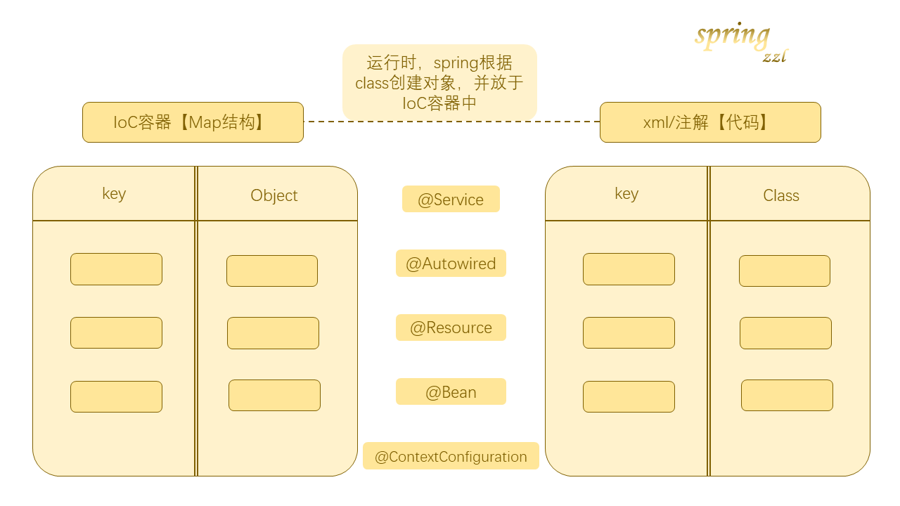

注解配置和 xml 配置要实现的`功能都是一样`的，都是要将创建对象的权力交给spring，降低程序间的耦合。

注解和xml只是`配置的形式不一样`。

这里也先说明一下，在实际开发中，以开发公司的开发习惯（使用注解或xml）为主，但一般的情况是：`自己写的类用注解，使用jar包的类用xml【jar包的类不能修改】`

## 1. 用注解修改第一个spring程序

我们将前面的代码用注解的方式，再实现一遍

Dao类

```java
@Repository("accountDaoImpl")
public class AccountDaoImpl1 implements AccountDao {
    public void saveAccount() {
        System.out.println("Impl：  向数据库保存数据");
    }
}
```

Service类

```java
@Service("accountService")
@Scope(value = "singleton")
public class AccountServiceImpl implements AccountService {

    //第一种方式 Autowired先匹配类，如果该类有多个实例对象，那么则再匹配名字
//    @Autowired
//    AccountDao accountDaoImpl1;

    //第二种方式 Autowired先匹配类，如果该类有多个实例对象，那么根据Qualifier匹配名字
//    @Autowired
//    @Qualifier("accountDaoImpl2")
//    AccountDao accountDao;

    //第三种方式 Resource 直接找名字匹配
    @Resource(name = "accountDaoImpl")
    AccountDao accountDao;

    @PostConstruct
    void init(){
        System.out.println("初始化");
    }

    @PreDestroy
    void destroy(){
        System.out.println("销毁");
    }

    public void saveAccount() {
        accountDao.saveAccount();
    }
}
```

主配置文件

```xml
<?xml version="1.0" encoding="UTF-8"?>
<beans xmlns="http://www.springframework.org/schema/beans"
       xmlns:xsi="http://www.w3.org/2001/XMLSchema-instance"
       xmlns:context="http://www.springframework.org/schema/context"
       xsi:schemaLocation="http://www.springframework.org/schema/beans
        https://www.springframework.org/schema/beans/spring-beans.xsd
        http://www.springframework.org/schema/context
        https://www.springframework.org/schema/context/spring-context.xsd">

    <!--  告知spring在创建容器时要扫描的包，在context这个标签下配置  -->
    <context:component-scan base-package="com.itheima"/>

</beans>
```

main函数：

```java
public class Client {
    public static void main(String[] args) {
        ClassPathXmlApplicationContext applicationContext = new ClassPathXmlApplicationContext("bean.xml");

        AccountServiceImpl accountService = (AccountServiceImpl) applicationContext.getBean("accountService");
        accountService.saveAccount();

        applicationContext.close();
    }
}
```

结果:

```text
初始化
Impl：  向数据库保存数据
销毁
```

### 1.1 @Repositoy @Service

上面我们看到，Dao类和Service类上面加了注解@Repository和@Service。

```java
@Repository("accountDaoImpl")

@Service("accountService")
```

这两个注解的作用是：`spring执行时，创建当前类对象，并将当前类对象存入spring容器中`。

**@Repository：**一般用在持久层

**@Service：**一般用在业务层

**属性（两者一样的）：**

value：`用于指定bean的id`。当我们不写时，它的默认值是当前类名，且首字母改成小写

在xml的写法为：

```xml
 <bean id="accountDao" class="com.itheima.dao.impl.AccountDaoImpl"/>
```

### 1.2 @Controller @Component

@Controller和@Component这两个注解的作用同@Repository和@Service一样，都是创建类并将类置于spring容器。

只是：

@Controller：一般用于表现层

@Component：可用于除这三层外的其他层。

使用@Controller，@Service，@Repository为我们`提供明确的三层使用的注解，使我们三层对象更加清晰。`

### 1.3 @Autowired @Qualifier @Resource

上面有用到@Autowired @Qualifier @Resource这三个注解。

```java
    @Autowired
    AccountDao accountDaoImpl1;

    @Autowired
    @Qualifier("accountDaoImpl2")
    AccountDao accountDao;

    @Resource(name = "accountDaoImpl")
```

这三个注解的作用也都是一样的：`用于注入数据`。

**Autowired:**

**作用:**`自动按照类型注入`。只要容器中有唯一的一个bean对象类型和要注入的变量类型匹配，就可以注入成功。但是，如果IoC容器中没有任何bean的类型和要注入的变量类型匹配，则报错。

出现的位置：可以是变量上，也可以是方法上。

`细节：在使用注解注入时，set方法就不是必须的了。`



**Qualifier:**

**作用：**在按照`类`中注入的基础之上`再按照名称注入`。它在给类成员注入时不能单独使用，但是在给方法参数注入时可以。

**Resource：**

**作用：**直接`按照bean的id`注入。它可以独立使用。

他们的作用和在xml配置文件中的bean标签中写一个`<property>`的标签的作用是一样的。xml写法：

```xml
<property name="birthday" ref="nowDate"/>
```

### 1.3 @value

但是，@Autowired @Qualifier @Resource只能注入其他bean类型的数据，而基本类型和string类型需要使用value注解注入。

value可以注入基本类型和String类型的数据。也可以使用spring的SpEL(`Spirng的el表达式`)

```java
@name("${jdbc.driver}")
private String dirver;
```

集合类型的注入只能通过xml来实现。

### 1.4 @Scope @PostConstruct @PreDestroy

@Scope

**作用：**改变作用范围的，和xml中`<scope>`实现的功能是一样的.

常用属性：`singleton prototype`【注意`是小写`】

@PostConstruct

**作用：**用于指定初始化方法，和xml标签`<init-method>`一样

@PreDestroy

**作用：**用于指定销毁方法,和xml标签`<destroy-nethode>`的作用一样

## 2. 用配置类完全代替IoC的xml

SpringConfig类

```java
@Configuration
@ComponentScan("com.itheima")
@Import(JdbcConfig.class)
public class SpringConfig {

}
```

jdbcConfig类

```java
@Configuration
@PropertySource("classpath:jdbc/jdbc.properties")
public class JdbcConfig {
    @Value("${jdbc.driver}")
    private String driver;

    @Value("${jdbc.url}")
    private String url;

    @Value("${jdbc.username}")
    private String userName;

    @Value("${jdbc.password}")
    private String password;

    //这里一定要很注意，prototype不要写错，不要写成protoType!

    @Bean(name = "runner")
    @Scope("prototype")
    QueryRunner createRunner(@Qualifier("dataSource") DataSource dataSource) {
        return new QueryRunner(dataSource);
    }

    @Bean(name = "dataSource")
    DataSource createDataSource() {
        ComboPooledDataSource comboPooledDataSource = new ComboPooledDataSource();
        try {
            comboPooledDataSource.setDriverClass(driver);
            comboPooledDataSource.setJdbcUrl(url);
            comboPooledDataSource.setUser(userName);
            comboPooledDataSource.setPassword(password);
        } catch (PropertyVetoException e) {
            e.printStackTrace();
        }
        return comboPooledDataSource;

    }
}
```

jdbc.properties

```properties
jdbc.driver=com.mysql.jdbc.Driver
jdbc.url=jdbc:mysql://localhost:3306/myproject_textdb?characterEncoding=utf8
jdbc.username=root
jdbc.password=root
```

### 2.1 @Configuration @ComponentScan

**创建：**SpringConfig.java该类是一个配置类，它的作用和bean.xml是一样的

@Configuration

**作用：**指定当前类是一个配置类
**细节：**当配置类作为AnnotationConfigApplicationContext对象创建的参数时，该注解可以不写【但是，最好还是写上】

@ComponentScan("com.itheima")

**作用：**用于通过注解指定spring在创建容器时要扫描的包
**属性：** value：它和basePackages的作用是一样的，都是用于指定创建容器时要扫描的包。我们使用此注解就等同于在xml中配置：

```xml
 <context:component-scan base-package="com.itheima"></context:component-scan>
```

### 2.2 @Bean

@Bean

**作用：**用于把`当前方法的返回值`作为`bean对象`存入spring的`IoC容器`中

**属性：**name:用于指定bean的id。但不写时，默认值是当前方法的名称

**细节：**当我们使用注解配置方法时，如果方法有参数，spring框架会去容器中查找有没有可用的bean对象。查找的方法和Autowired注解的作用是一样的

### 2.3 @Import

@import

**作用：**用于指定其他配置类的字节码

当我们使用import的注解之后，有import注解的类就是父配置类，而导入的都是子配置类。

### 2.4 @PropertySource

**作用:**用于指定properties的文件

**属性：**value：指定文件的名称和路径。

**关键字：**classpath,表示类路径下

### 2.5 ApplicationContext

当spring没有和单元测试集成时，要测试spring的方法，就需要使用ApplicationContext

```java
ApplicationContext ac = new AnnotationConfigApplicationContext(SpringConfig.class);
````

## 3. spring集成单元测试

1、应用程序的入口

main方法

2、junit单元测试中，没有main方法也能执行

- junit集成了一个main方法
- 该方法就会判断当前测试类中哪些方法有 @Test注解
- junit就让有Test注解的方法执行

3、junit不会管我们是否采用spring框架

- 在执行测试方法时，junit根本不知道我们是不是使用了spring框架
- 所以也就不会为我们读取配置文件/配置类创建spring核心容器

4、由以上三点可知

当测试方法执行时，没有Ioc容器，就算写了Autowired注解，也无法实现注入

**那spring如何集成junit呢？**

`导入spring整合junit的jar（坐标）`，pom.xml文件引入spring-test

```xml
        <dependency>
            <groupId>org.springframework</groupId>
            <artifactId>spring-test</artifactId>
            <version>5.0.2.RELEASE</version>
        </dependency>
```

使junit把原有的`main方法`替换了，用@Runwith替换成spring提供的main方法。并且告知spring的运行期，spring和IoC创建是`基于xml还是注解`，并且说明位置。

@ContextConfiguration

- `locations`:指定`xml文件的位置`，加上`classpath`关键字，表示在类路径下
- `classes`:指定`注解类`所在的位置

写成的test类：

```java
@RunWith(SpringJUnit4ClassRunner.class)
@ContextConfiguration(locations = "classpath:bean.xml")
public class AccountServiceTest {

    @Autowired
    private IAccountService as;

    @Test
    public void testFindAll(){
        ****
    }
}
```

`特别注意：当我们使用spring 5.x版本的时候，要求junit的jar必须是4.12及以上`

最后，我们再强调一点，测试类不配置到xml中。

这是因为，测试类的目的是为了测试，`测试类并不参与程序逻辑`，很多时候我们测试成功后就不再使用了。但是，如果将测试类配置于bean.xml中，那么，运行该项目测试类就会被创建，导致`浪费资源`。
