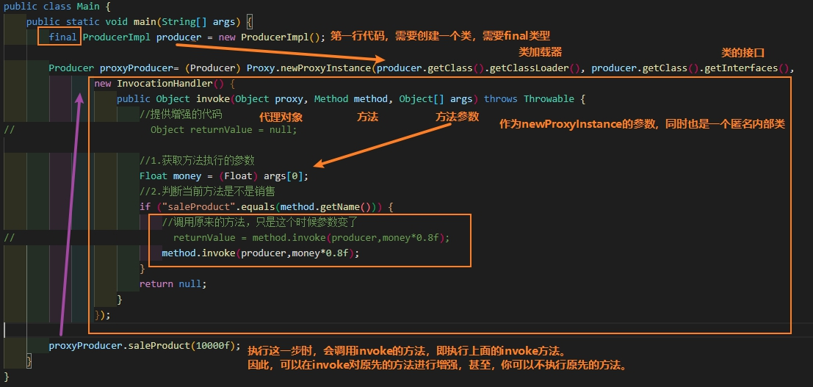

## 1. 动态代理

动态代理代码：

Producer接口：

```java
public interface Producer {
    void saleProduct(float money);
}

```

ProducerImpl类（继承Producer接口）

```java
public class ProducerImpl implements Producer {
    public void saleProduct(float money) {
        System.out.println("卖了" + money);
    }
}
```

Main类

```java
public class Main {
    public static void main(String[] args) {
        final ProducerImpl producer = new ProducerImpl();

        Producer proxyProducer= (Producer) Proxy.newProxyInstance(producer.getClass().getClassLoader(), producer.getClass().getInterfaces(),
                new InvocationHandler() {
                    public Object invoke(Object proxy, Method method, Object[] args) throws Throwable {
                        //提供增强的代码
//                        Object returnValue = null;

                        //1.获取方法执行的参数
                        Float money = (Float) args[0];
                        //2.判断当前方法是不是销售
                        if ("saleProduct".equals(method.getName())) {
                            //调用原来的方法，只是这个时候参数变了
//                            returnValue = method.invoke(producer,money*0.8f);
                            method.invoke(producer,money*0.8f);
                        }
                        return null;
                    }
                });

        proxyProducer.saleProduct(10000f);
    }
}
```

Main函数只有三行代码，我们来解析一下：



同时上面，对上面的代码有更加详细的解释：

动态代理：

- 特点：字节码谁用谁创建，谁用谁加载
- 作用：不修改源码的基础上对方法增强
- 分类：
     - 基于接口的动态代理
     - 基于子类的动态代理
- 基于接口的动态代理：
    - 涉及的类：proxy
    - 提供方：JDK官方
- 如何创建代理对象
    - 使用Proxy类中的newProxyInstance方法
- 创建代理对象的要求：
    - 被代理类最少实现一个接口，如果没有则不能使用
    - newProxyInstance方法的参数：
        - ClassLoader：类加载器
        - 它是用于创建对象字节码的。和被代理对象使用相同的类加载器。固定写法。
    - Class[]：字节码数组
        - 它是用于让代理对象和被代理对象有相同的方法。固定写法。
    - InvocationHandler:用于提供增强的代码
        - 它是让我们写如何代理。我们一般都是写一个该接口的实现类，通常情况下都是匿名内部类，但不是必须的。
        - 此接口的实现类都是谁用谁写

上面介绍的是基于接口的动态代理，还有一种动态代理是基于子类的动态代理。

需要引入新的jar包

```xml
    <dependencies>
        <dependency>
            <groupId>cglib</groupId>
            <artifactId>cglib</artifactId>
            <version>2.2.2</version>
        </dependency>
    </dependencies>
```

```java
public class Main {
    public static void main(final String[] args) {
        final ProducerImpl producer = new ProducerImpl();

        Producer cglibProducer = (Producer) Enhancer.create(producer.getClass(), new MethodInterceptor() {
            /**
             * 执行代理对象的任何方法都会经过该方法
             * @param o 和动态代理对象invoke()的参数proxy一样
             * @param method 和动态代理invoke()的参数method一样
             * @param objects 和动态代理invoke()的参数args一样
             * @param methodProxy 当前执行方法的代理对象
             * @return
             * @throws Throwable
             */
            public Object intercept(Object o, Method method, Object[] objects, MethodProxy methodProxy) throws Throwable {
                //提供增强的代码
                Object returnValue = null;

                //1.获取方法的执行参数
                Float money = (Float) objects[0];
                //2.判断当前方法是不是销售
                if ("saleProduct".equals(method.getName())){
                    returnValue = method.invoke(producer,money*0.8f);
                }
                return returnValue;
            }
        });

        cglibProducer.saleProduct(1000f);
    }
}
```

同样也是三行代码。

- 基于子类的动态代理：
    - 涉及的类：Enhancer
    - 提供方：第三方库
- 如何创建代理对象
    - 使用Enhancer类中的create方法
- 创建代理对象的要求：
    - 被代理类不能是最终类
- create方法的参数：
    - Class：字节码
        - 它是用于指定被代理对象的字节码
    - Callback:用于提供增强的代码
        - 它是让我们写如何代理。我们一般都是写一个该接口的实现类，通常情况下都是匿名内部类，但不是必须的。
        - 此接口的实现类都是谁用谁写
        - 我们一般写的都是该接口的子接口实现类：MethodInterceptor

## 2. AOP

AOP全称是`Aspect Oriented Programming`，即：`面向切面编程【切面+切入点】`。

`把我们程序重复的代码抽取出去，在需要执行的时候，使用动态代理的技术，在不修改源码的基础上，对我们已有方法进行增强。`

AoP的作用及好处：

作用：在程序运行期间，不修改源码对已有方法进行增强。

优势：

- 减少重复代码
- 提高开发效率
- 维护方便

AOP的实现方式：使用动态代理技术

### 2.1 AOP相关术语

Joinpoint（连接点）：指那些被拦截到的点。在spring中，这些点指的是方法。例：下面代码中AccountService的`全部`方法

Pointcut（切入点）：指对哪些Joinpoint进行拦截。例：AccountService中`需要被增强的代码`。

Advice（通知/增强）：拦截到Joinpoint之后要做的事情。通知的类型：前置通知、后置通知、异常通知、最终通知、环绕通知。

Introduction（引介）：是一种在不修改代码的前提下，introduction在动态运行期间为类动态地添加一些方法或属性

Target（目标对象）：代理地目标对象

Weaving( 织入):是指把增强应用到目标对象来创建新的代理对象的过程。

spring 采用动态代理织入，而 AspectJ 采用编译期织入和类装载期织入。

Proxy（代理）:一个类被 AOP 织入增强后，就产生一个结果代理类。

Aspect( 切面):是切入点和通知（引介）的结合。例：下面代码中的Logger类。

**学习 spring中的aop要明确的事：**

a. 开发阶段（我们做的）

编写核心业务代码（开发主线），然后把公用代码抽取出来，制作成通知。在配置文件中，声明切入点与通知间的关系，即切面。

b. 运行阶段（Spring  框架完成的）

Spring 框架监控切入点方法的执行。一旦监控到切入点方法被运行，使用代理机制，动态创建目标对象的代理对象，根据通知类别，在代理对象的对应位置，将通知对应的功能织入，完成完整的代码逻辑运行。

### 2.2 AOP代码

Pom.xml文件导入坐标:

```xml

    <dependencies>
        <dependency>
            <groupId>org.springframework</groupId>
            <artifactId>spring-context</artifactId>
            <version>5.0.2.RELEASE</version>
        </dependency>

        <dependency>
            <groupId>org.aspectj</groupId>
            <artifactId>aspectjweaver</artifactId>
            <version>1.8.7</version>
        </dependency>
    </dependencies>

```

AccountService接口

```java
public interface AccountService {
    void savaAccount();

    void updateAccount(int i);

    int deleteAccount();
}
```

AccountServiceImpl类。即`Joinpoint`

```java
public class AccountServiceImpl implements AccountService {

    //这里不要在意类的名字，而是注意void,int这些返回类型，有无参数它们的AOP怎么写。
    public void savaAccount() {
        System.out.println("保存");
    }

    public void updateAccount(int i) {
        System.out.println("更新" + i);
    }

    public int deleteAccount() {
        System.out.println("删除");
        return 0;
    }
}
```

记录日志的工具类。即`aspect，切面`

```java
public class Logger {
    public void beforePrintLog(){
        System.out.println("前置通知-----Logger类中printLog方法开始记录日志");
    }

    public void afterReturningPrintLog(){
        System.out.println("后置通知Logger类中printLog方法开始记录日志");
    }

    public void afterThrowingPrintLog(){
        System.out.println("异常通知-----Logger类中printLog方法开始记录日志");
    }

    public void afterPrintLog(){
        System.out.println("最终通知-----Logger类中printLog方法开始记录日志");
    }

    public Object aroundPrintLog(ProceedingJoinPoint proceedingJoinPoint){
        try {
            Object returnValue = null;
            //得到方法执行的参数
            Object[] args = proceedingJoinPoint.getArgs();

            System.out.println("Logger类中printLog方法开始记录日志===环绕方法之===前置方法");

            //明确业务层方法（切入点方法）
            returnValue = proceedingJoinPoint.proceed(args);

            System.out.println("Logger类中printLog方法开始记录日志===环绕方法之===后置方法");
            return returnValue;

        } catch (Throwable throwable) {
            System.out.println("Logger类中printLog方法开始记录日志===环绕方法之===异常通知");
            throwable.printStackTrace();
            throw new RuntimeException(throwable);
        }finally {
            System.out.println("Logger类中printLog方法开始记录日志===环绕方法之===最终通知");
        }

    }
}
```

AOP配置。bean.xml

```xml
<?xml version="1.0" encoding="UTF-8"?>
<beans xmlns="http://www.springframework.org/schema/beans"
       xmlns:xsi="http://www.w3.org/2001/XMLSchema-instance"
       xmlns:aop="http://www.springframework.org/schema/aop"
       xsi:schemaLocation="http://www.springframework.org/schema/beans
        https://www.springframework.org/schema/beans/spring-beans.xsd
        http://www.springframework.org/schema/aop
        https://www.springframework.org/schema/aop/spring-aop.xsd">

    <bean id="logger" class="com.itheima.log.Logger"/>

    <bean id="accountService" class="com.itheima.service.Impl.AccountServiceImpl"/>

    <aop:config>
        <!--   配置切入点表达式，id属性用于指定表达式的唯一标识，expression属性用于指定表达式的内容
             此标签在aop:aspect标签内部只能当且切面使用
             它还可以写在aop:aspect外面，此时变成了所有切面都可以用
             ！！有位置要求，必须写在aop:aspect标签上面-->
        <aop:pointcut id="accountServicePointCut" expression="execution(* com.itheima.service.Impl.*.*(..))"/>

        <aop:aspect id="logAdvice" ref="logger">
<!--            <aop:before method="beforePrintLog"-->
<!--                        pointcut="execution(* com.itheima.service.Impl.AccountServiceImpl.*(..))"/>-->
<!--            <aop:after-returning method="afterReturningPrintLog"-->
<!--                                 pointcut="execution(* com.itheima.service.Impl.*.*(..))"/>-->
<!--            <aop:after-throwing method="afterThrowingPrintLog"-->
<!--                                pointcut="execution(* com.itheima.service.Impl.*.*(..))"/>-->
<!--            <aop:after method="afterPrintLog" pointcut="execution(* com.itheima.service.Impl.*.*(..))"/>-->

            <!--使用<aop:pointcut>标签后，可以将上面的pointcut改成下面的pointcut-ref-->
            <aop:before method="beforePrintLog" pointcut-ref="accountServicePointCut"/>
            <aop:after-returning method="afterReturningPrintLog" pointcut-ref="accountServicePointCut"/>
            <aop:after-throwing method="afterThrowingPrintLog" pointcut-ref="accountServicePointCut"/>
            <aop:after method="afterPrintLog" pointcut-ref="accountServicePointCut"/>

            <aop:around method="aroundPrintLog" pointcut-ref="accountServicePointCut"/>
        </aop:aspect>
    </aop:config>

</beans>
```

一般来说，开发中，你选择环绕通知后，就不用`“前置、后置通知”那些`，如果你选择`了“前置、后置通知”那些通知`，就不用环绕通知，`二者取其一`。这里把它们都写上，只是为了演示。

这里介绍一下spring中基于XML的AOP配置步骤：

#### 2.2.1 切入点

<aop:pointcut>标签，用`切入点表达式`表示`切入点`

或者使用pointcut属性：用于指定切入点表达式，该表达式的含义指的是对业务层中哪些方法增强。

#### 2.2.2 切面

使用aop:aspect标签表明配置切面

- id属性：是给切面提供一个唯一标识
- ref属性：是指定通知类bean的Id。

在aop:aspect标签的内部使用对应标签来配置通知的类型

- aop:before：表示配置前置通知
- aop:after-returning：标识配置后置通知
- aop:after-throwing：标识配置异常通知
- aop:after：标识配置最终通知
- method属性：用于指定Logger类中哪个方法是前置通知

用pointcut属性，或者<aop:pointcut>表示切入点。

#### 2.2.3 切入点表达式

关键字：execution(表达式)

表达式：访问修饰符  返回值  包名.包名.包名...类名.方法名(参数列表)

标准的表达式写法：

`public void com.itheima.service.impl.AccountServiceImpl.saveAccount()`

访问修饰符可以省略：

`void com.itheima.service.impl.AccountServiceImpl.saveAccount()`

返回值可以使用通配符，表示任意返回值

`* com.itheima.service.impl.AccountServiceImpl.saveAccount()`

包名可以使用通配符，表示任意包。但是有几级包，就需要写几个*.

`* *.*.*.*.AccountServiceImpl.saveAccount())`

包名可以使用..表示当前包及其子包

`* *..AccountServiceImpl.saveAccount()`

类名和方法名都可以使用*来实现通配

`* *..*.*()`

参数列表：

可以直接写数据类型：

- 基本类型直接写名称   int
- 引用类型写包名.类名的方式   java.lang.String
- 可以使用通配符表示任意类型，但是必须有参数
- 可以使用..表示有无参数均可，有参数可以是任意类型

全通配写法：

`* *..*.*(..)`

**实际开发中切入点表达式的通常写法：**

切到业务层实现类下的所有方法  
`* com.itheima.service.impl.*.*(..)`

---

测试类

```java
public class AOPTest {
    public static void main(String[] args) {
        ApplicationContext applicationContext = new ClassPathXmlApplicationContext("bean.xml");
        AccountService accountService = (AccountService) applicationContext.getBean("accountService");

        accountService.savaAccount();
        System.out.println();
        accountService.updateAccount(1);
        System.out.println();
        accountService.deleteAccount();
    }
}
```

结果

```text
前置通知-----Logger类中printLog方法开始记录日志
Logger类中printLog方法开始记录日志===环绕方法之===前置方法
保存
Logger类中printLog方法开始记录日志===环绕方法之===后置方法
Logger类中printLog方法开始记录日志===环绕方法之===最终通知
最终通知-----Logger类中printLog方法开始记录日志
后置通知Logger类中printLog方法开始记录日志

前置通知-----Logger类中printLog方法开始记录日志
Logger类中printLog方法开始记录日志===环绕方法之===前置方法
更新1
Logger类中printLog方法开始记录日志===环绕方法之===后置方法
Logger类中printLog方法开始记录日志===环绕方法之===最终通知
最终通知-----Logger类中printLog方法开始记录日志
后置通知Logger类中printLog方法开始记录日志

前置通知-----Logger类中printLog方法开始记录日志
Logger类中printLog方法开始记录日志===环绕方法之===前置方法
删除
Logger类中printLog方法开始记录日志===环绕方法之===后置方法
Logger类中printLog方法开始记录日志===环绕方法之===最终通知
最终通知-----Logger类中printLog方法开始记录日志
后置通知Logger类中printLog方法开始记录日志
```

### 2.3 AOP注解

导入约束，`既要导入context注解约束，也要导入aop面向切面编程约束`。spring官网没有这两者一起写，我们可以根据context约束照猫画虎写出aop约束，也可以根据aop照猫画虎写出context约束。

```xml
<?xml version="1.0" encoding="UTF-8"?>
<beans xmlns="http://www.springframework.org/schema/beans"
       xmlns:xsi="http://www.w3.org/2001/XMLSchema-instance"
       xmlns:aop="http://www.springframework.org/schema/aop"
       xmlns:context="http://www.springframework.org/schema/context"
       xsi:schemaLocation="http://www.springframework.org/schema/beans
        https://www.springframework.org/schema/beans/spring-beans.xsd
        http://www.springframework.org/schema/aop
        https://www.springframework.org/schema/aop/spring-aop.xsd
        http://www.springframework.org/schema/context
        https://www.springframework.org/schema/context/spring-context.xsd">

    <context:component-scan base-package="com.itheima"/>

    <!--配置spring开启注解的支持，必须写上-->
    <aop:aspectj-autoproxy/>
</beans>

```

修改后的logger.java类

```java
@Component("logger")
//@Aspect("logger")  这样子写会出现“Per-clause not recognized: logger”这个错误
@Aspect
public class Logger {

    @Pointcut("execution(* com.itheima.service.Impl.*.*(..))")
    private void pointCut(){}

    @Before("pointCut()")
    public void beforePrintLog(){
        System.out.println("前置通知-----Logger类中printLog方法开始记录日志");
    }

    @AfterReturning("pointCut()")
    public void afterReturningPrintLog(){
        System.out.println("后置通知Logger类中printLog方法开始记录日志");
    }

    @AfterThrowing("pointCut()")
    public void afterThrowingPrintLog(){
        System.out.println("异常通知-----Logger类中printLog方法开始记录日志");
    }

    @After("pointCut()")
    public void afterPrintLog(){
        System.out.println("最终通知-----Logger类中printLog方法开始记录日志");
    }

    @Around("pointCut()")
    public Object aroundPrintLog(ProceedingJoinPoint proceedingJoinPoint){
        try {
            Object returnValue = null;
            //得到方法执行的参数
            Object[] args = proceedingJoinPoint.getArgs();

            System.out.println("Logger类中printLog方法开始记录日志===环绕方法之===前置方法");

            //明确业务层方法（切入点方法）
            returnValue = proceedingJoinPoint.proceed(args);

            System.out.println("Logger类中printLog方法开始记录日志===环绕方法之===后置方法");
            return returnValue;

        } catch (Throwable throwable) {
            System.out.println("Logger类中printLog方法开始记录日志===环绕方法之===异常通知");
            throwable.printStackTrace();
            throw new RuntimeException(throwable);
        }finally {
            System.out.println("Logger类中printLog方法开始记录日志===环绕方法之===最终通知");
        }

    }
}
```

test一样，在AccountService类前添加@Service("accountService")，结果为：

```text
Logger类中printLog方法开始记录日志===环绕方法之===前置方法
前置通知-----Logger类中printLog方法开始记录日志
保存
Logger类中printLog方法开始记录日志===环绕方法之===后置方法
Logger类中printLog方法开始记录日志===环绕方法之===最终通知
最终通知-----Logger类中printLog方法开始记录日志
后置通知Logger类中printLog方法开始记录日志

Logger类中printLog方法开始记录日志===环绕方法之===前置方法
前置通知-----Logger类中printLog方法开始记录日志
更新1
Logger类中printLog方法开始记录日志===环绕方法之===后置方法
Logger类中printLog方法开始记录日志===环绕方法之===最终通知
最终通知-----Logger类中printLog方法开始记录日志
后置通知Logger类中printLog方法开始记录日志

Logger类中printLog方法开始记录日志===环绕方法之===前置方法
前置通知-----Logger类中printLog方法开始记录日志
删除
Logger类中printLog方法开始记录日志===环绕方法之===后置方法
Logger类中printLog方法开始记录日志===环绕方法之===最终通知
最终通知-----Logger类中printLog方法开始记录日志
后置通知Logger类中printLog方法开始记录日志
```

**使用环绕通知的注解：**

Spring框架为我们提供了一个接口：ProceedingJoinPoint。该接口有一个方法proceed()，此方法就相当于明确调用切入点方法。

而且观察上面`最终通知和后置通知`的注解的，其结果是有误的。

```text
最终通知-----Logger类中printLog方法开始记录日志
后置通知Logger类中printLog方法开始记录日志
```

因此我们一般不用`最终通知和后置通知`的注解，而用xml配置

-----------------------------------

通过对业务层改造，已经可以实现事务控制了，但是由于我们添加了事务控制，也产生了一个新的问题：
业务层方法变得臃肿了，里面充斥着很多重复代码。并且业务层方法和事务控制方法耦合了。
试想一下，如果我们此时提交，回滚，释放资源中任何一个方法名变更，都需要修改业务层的代码，况且这还
只是一个业务层实现类，而实际的项目中这种业务层实现类可能有十几个甚至几十个。
思考：
这个问题能不能解决呢？
答案是肯定的，使用下一小节中提到的技术
