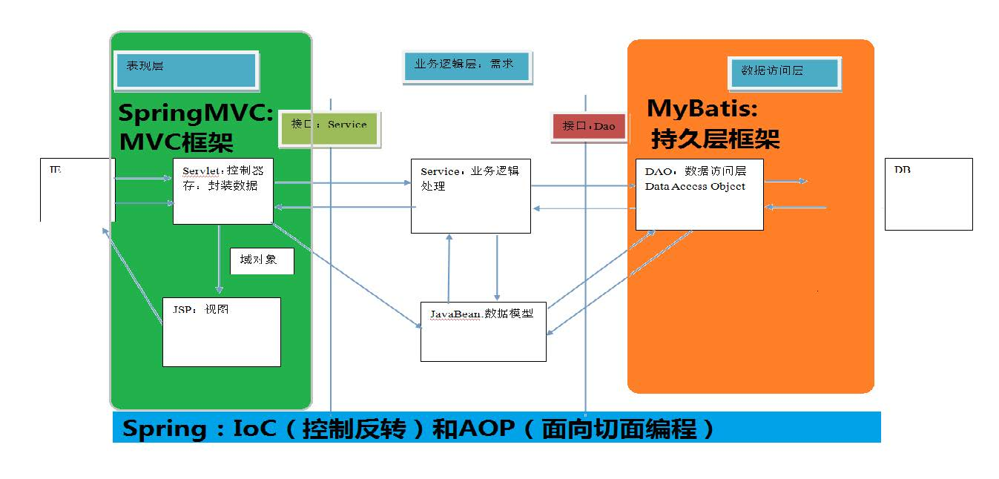
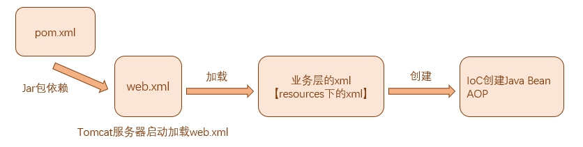
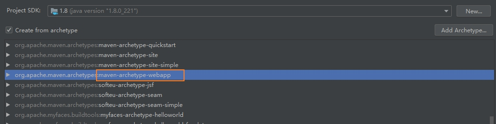
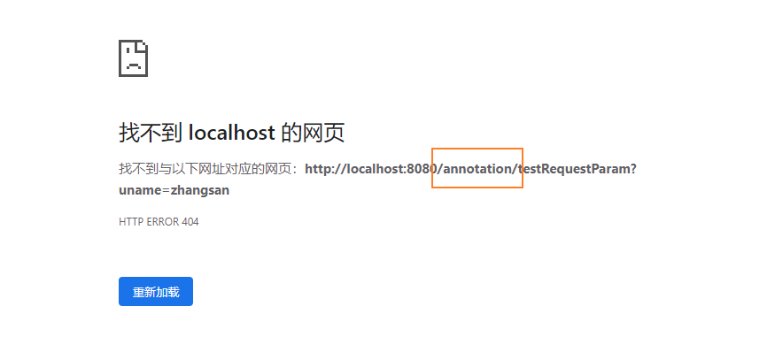
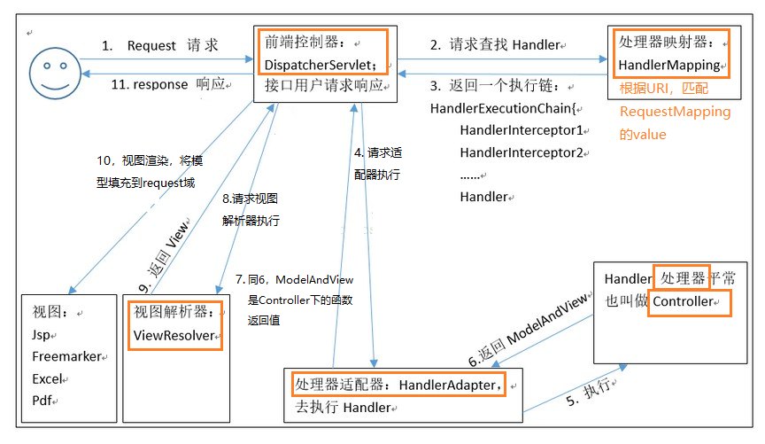
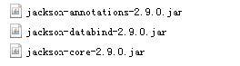

## 1. 三层架构和MVC

### 1.1 三层架构

我们的开发架构一般都是基于两种形式，一种是`C/S架构`，也就是`客户端/服务器`，另一种`是B/S架构`，也就是`浏览器服务器`。在JavaEE开发中，几乎全都是基于B/S架构的开发。那么在B/S架构中，`系统标准的三层架构包括：表现层、业务层、持久层`。三层架构在我们的实际开发中使用的非常多。

三层架构中，每一层各司其职，接下来我们就说说每层都负责哪些方面：

**表现层：**

表现层也就是我们常说的`web层`。它负责`接收客户端请求，向客户端响应结果`，通常客户端使用`http协议`请求web层，web需要接收http请求，完成http响应。

表现层`依赖业务层【需要调用业务层的处理方法】`，接收到客户端请求一般会调用业务层进行业务处理，并将处理结果响应给客户端。

`表现层的设计一般都使用MVC模型`。（MVC是表现层的设计模型，和其他层没有关系）

**业务层：**

业务层也就是我们常说的`service层`。它负责`业务逻辑处理`，和我们开发项目的需求息息相关。web层依赖业务层，但是业务层不依赖web层。

业务层在业务处理时`可能会依赖持久层【可能需要调用持久层的处理方法】`，如果要对数据持久化需要保证事务一致性。（也就是我们说的，`事务应该放到业务层来控制`）

**持久层：**

持久层也就是我们是常说的`dao层`。负责数据持久化。通俗的讲，`持久层就是和数据库交互，对数据库表进行曾删改查的`

### 1.2 MVC模型

MVC全名是Model View Controller，是模型(model)－视图(view)－控制器(controller)的缩写，是一种`设计模型`，用于设计创建 Web应用程序的表现层。

MVC中每个部分各司其职：

**Model（模型）：**

通常指的就是我们的`数据模型`。作用一般情况下用于封装数据。

**View（视图）：**

通常指的就是我们的`jsp或者html`。作用一般就是展示数据的。 通常视图是依据模型数据创建的。

**Controller（控制器）：**

是应用程序中`处理`用户交互的部分。作用一般就是处理程序逻辑的。 它相对于前两个不是很好理解，这里举个例子：

例如：我们要保存一个用户的信息，该用户信息中包含了姓名，性别，年龄等等。 这时候表单输入要求年龄必须是1~100之间的整数。姓名和性别不能为空。并且把数据填充到模型之中。 此时除了js的校验之外，服务器端也应该有数据准确性的校验，那么`校验就是控制器的该做的。` 当校验失败后，由控制器负责把错误页面展示给使用者。 如果校验成功，也是控制器负责把数据填充到模型，并且`调用业务层实现完整的业务需求`。

【`前端数据正确性的最后一道保障，并且调用业务层`】

### 1.3 SpringMVC

SpringMVC是一种基于Java的实现MVC设计模型的`请求驱动`类型的轻量级Web框架，属于Spring FrameWork 的后续产品，已经融合在Spring Web Flow里面。

SpringMVC已经成为目前最主流的 MVC 框架之一，并且随着Spring3.0的发布，全面超越 Struts2，成为最优秀的 MVC 框架。 它`通过一套注解`，让一个简单的Java类成为处理请求的控制器，而无须实现任何接口。同时它还`支持RESTful编程风格`的请求。

例如：RESTful前端发送的URI：`"AnnotationControl/testRequestPathVariable/100"`;后端对接收数据的处理：`@RequestPathVariable(path = "AnnotationControl/testRequestPathVariavle/{id}")`；前端的{id}可以`多个`，后端处理的函数是`同一个`

**SpringMVC在三层架构的位置:**



**SpringMVC和Struts的优略分析：**

- 共同点：

它们都是`表现层框架`，都是基于`MVC模型编写的`。 它们的底层都离不开`原始ServletAPI`。 它们处理请求的机制都是一个核心控制器。

- 区别：
  
Spring MVC 的入口是 Servlet, 而 Struts2 是 Filter  Spring MVC 是基于方法设计的，而Struts2是基于类，struts2每次执行都会创建一个动作类。所以Spring MVC 会稍微比 Struts2 快些。  

Spring MVC 使用更加简洁,同时还支持 JSR303, 处理 ajax 的请求更方便 (JSR303 是一套JavaBean参数校验的标准，它定义了很多常用的校验注解，我们可以直接将这些注解加在我们JavaBean的属性上面，就可以在需要校验的时候进行校验了。)  

Struts2 的OGNL 表达式使页面的开发效率相比Spring MVC 更高些，但执行效率并没有比JSTL提升，尤其是struts2的表单标签，远没有html执行效率高。

## 2. SpringMVC的入门

### 2.1 环境搭建



IDEA选择maven创建



pom.xml 引入jar包

```xml
<!-- 可以将maven.compiler.source和target【编译版本】改为1.8 -->
<properties>
  <project.build.sourceEncoding>UTF-8</project.build.sourceEncoding>
  <maven.compiler.source>1.8</maven.compiler.source>
  <maven.compiler.target>1.8</maven.compiler.target>
  <spring.version>5.0.2.RELEASE</spring.version>
</properties>

<!-- 版本锁定 -->
<properties>
<spring.version>5.0.2.RELEASE</spring.version>
</properties>

<dependencies>
    <dependency>
      <groupId>junit</groupId>
      <artifactId>junit</artifactId>
      <version>4.11</version>
      <scope>test</scope>
    </dependency>

    <dependency>
      <groupId>org.springframework</groupId>
      <artifactId>spring-context</artifactId>
      <version>${spring.version}</version>
    </dependency>
    <dependency>
      <groupId>org.springframework</groupId>
      <artifactId>spring-web</artifactId>
      <version>${spring.version}</version>
    </dependency>
    <dependency>
      <groupId>org.springframework</groupId>
      <artifactId>spring-webmvc</artifactId>
      <version>${spring.version}</version>
    </dependency>

    <dependency>
      <groupId>javax.servlet</groupId>
      <artifactId>servlet-api</artifactId>
      <version>2.5</version>
      <scope>provided</scope>
    </dependency>

    <dependency>
      <groupId>javax.servlet.jsp</groupId>
      <artifactId>jsp-api</artifactId>
      <version>2.0</version>
      <scope>provided</scope>
    </dependency>
  </dependencies>
```

web.xml配置

```xml
<!DOCTYPE web-app PUBLIC
 "-//Sun Microsystems, Inc.//DTD Web Application 2.3//EN"
 "http://java.sun.com/dtd/web-app_2_3.dtd" >

<web-app>
  <display-name>Archetype Created Web Application</display-name>

  <!--SpringMVC的核心控制器-->
  <servlet>
    <servlet-name>dispatcherServlet</servlet-name>
    <servlet-class>org.springframework.web.servlet.DispatcherServlet</servlet-class>
    <!--配置Servlet的初始化参数，读取spring的配置文件，创建spring容器-->
    <init-param>
      <param-name>contextConfigLocation</param-name>
      <param-value>classpath:springmvc.xml</param-value>
    </init-param>
    <!--配置servlet启动时加载对象-->
    <load-on-startup>1</load-on-startup>
  </servlet>
  <servlet-mapping>
    <servlet-name>dispatcherServlet</servlet-name>
    <url-pattern>/</url-pattern>
  </servlet-mapping>

  <!--配置解决中文乱码的过滤器-->
  <filter>
    <filter-name>characterEncodingFilter</filter-name>
    <filter-class>org.springframework.web.filter.CharacterEncodingFilter</filter-class>
<!--    CharacterEncodingFilter属性encoding初始化-->
    <init-param>
      <param-name>encoding</param-name>
      <param-value>UTF-8</param-value>
    </init-param>
    <!-- 启动过滤器 -->
    <init-param>
      <param-name>forceEncoding</param-name> <param-value>true</param-value>
    </init-param>
  </filter>
  <filter-mapping>
    <filter-name>characterEncodingFilter</filter-name>
    <url-pattern>/*</url-pattern>
  </filter-mapping>

</web-app>
```

dispatcherServlet是`servlet的封装`。封装了对request和response的处理。

且在init-pattern`加载业务层的xml`.

关于过滤器，还可以加上一下配置

```xml
在springmvc的配置文件中可以配置，静态资源不过滤：
 <!-- location表示路径，mapping表示文件，**表示该目录下的文件以及子目录的文件 -->
  <mvc:resources location="/css/" mapping="/css/**"/>
  <mvc:resources location="/images/" mapping="/images/**"/>
  <mvc:resources location="/scripts/" mapping="/javascript/**"/>

  get请求方式： tomacat对GET和POST请求处理方式是不同的，GET请求的编码问题，要改tomcat的server.xml配置文件，如下：
  <Connector connectionTimeout="20000" port="8080" protocol="HTTP/1.1" redirectPort="8443"/>
  改为： <Connector connectionTimeout="20000" port="8080" protocol="HTTP/1.1" redirectPort="8443" useBodyEncodingForURI="true"/>

  如果遇到ajax请求仍然乱码，请把： useBodyEncodingForURI="true"改为URIEncoding="UTF-8" 即可。
```

业务层的xml: springmvc.xml

```xml
<?xml version="1.0" encoding="UTF-8"?>
<beans xmlns="http://www.springframework.org/schema/beans"
       xmlns:mvc="http://www.springframework.org/schema/mvc"
       xmlns:context="http://www.springframework.org/schema/context"
       xmlns:xsi="http://www.w3.org/2001/XMLSchema-instance"
       xsi:schemaLocation="
       http://www.springframework.org/schema/beans
       http://www.springframework.org/schema/beans/spring-beans.xsd
       http://www.springframework.org/schema/mvc
       http://www.springframework.org/schema/mvc/spring-mvc.xsd
       http://www.springframework.org/schema/context
       http://www.springframework.org/schema/context/spring-context.xsd">

    <!--配置spring创建容器要扫描的包-->
    <context:component-scan base-package="com.zzl"/>

<!--    配置视图解析器-->
    <bean id="viewResolver" class="org.springframework.web.servlet.view.InternalResourceViewResolver">
        <property name="prefix" value="/WEB-INF/pages/"/>
        <property name="suffix" value=".jsp"/>
    </bean>

<!--    配置spring开启mvc的支持-->
    <mvc:annotation-driven />

</beans>
```

### 2.2 view层

编写index.jsp

```jsp
<%@ page contentType="text/html;charset=UTF-8" language="java" %>
<html>
<body>
<h2>Hello World!</h2>
<h3>第一个mvc用例</h3>

<a href="hello">路径缺少一级路径，404 Not Found</a><br>

<a href="HelloControl/hello">正确二级路径，跳转成功</a><br>

<a href="HelloControl/requestMappingTest">请求头、请求行判断不过，400 Bad Request</a><br>

<a href="HelloControl/requestMappingTest?username">后台username固定值，但是前端username没有赋值, 400 Bad Request</a><br>

<a href="HelloControl/requestMappingTest?username=heihei">前端和后端username一样赋值一样 跳转成功</a><br>
</body>
</html>
```

### 2.3 Controller

对应的Controller

```java
@Controller
@RequestMapping(path = "HelloControl")
public class HelloControl {

    @RequestMapping("hello")
    public String successReturn(){
        System.out.println("控制器HelloControl执行");
        return "success";
    }

    @RequestMapping(path = "requestMappingTest",params = {"username=heihei"},method = RequestMethod.GET,
            headers = {"Accept"})
    public String requestMappingTest(){
        System.out.println("测试RequestMapping注解。。。");
        return "success";
    }
}

```

### 2.4 解析

**@Controller：**

`控制类必须加上该注解`，否则`spring IoC`没有创建该控制类对象，那么前端的URI就不能获取到处理函数，就会报`404 Not Found错误`

**404 Not Found:**

当出现404 Not Found要怎么分析呢？404 Not Found是资源没有找到，什么情况下资源会找不到？

- `资源本身就不存在：没有创建处理函数（请求处理）、没有返回页面（响应处理）`
- `资源创建了，但是路径不对导致找不到：请求路径不正确（写错，多了“/”），响应返回的路径写错`

多了“/”导致404的例子：

<div>
    
</div>

正确的路径应该为：

```java
http://localhost:8080/day01_01start/AnnotationControl/testRequestParam?uname=zhangsan
```

`请求的路径少了项目名（tomcat下的项目名）：day01_01start。`

导致这个的原因为：前端的请求写成“`/`AnnotationControl/testRequestBody”,而实际上应该为“AnnotationControl”

**@ReqestMapping属性值解析：**

- path/value: `根据请求的URI确定 控制器的某个函数`
- params: `限制`发起请求的URI`必须有相应的值`，否则就会报`400 Bad Requset错误`
- method: `限制`发起请求的URI必须`以对应的请求方式`，否则就会报`400 Bad Requset错误`

**入门案例执行过程：**

- Tomcat开启时：

Tomcat会加载web.xml文件。servlet是url请求访问时才加载。但是如果配置`load-on-startup`标签，就会在Tomcat启动时加载。因此`DispatcherServlet对象就会在启动时创建`。

同时init-pattern标签也让tomcat加载业务层的xml。上面的例子时springmvc.xml。

springmvc.xml中的scan扫描包，IoC创建控制类等单例对象。

- 当请求到来时：



## 3. 请求参数的绑定【赋值】

我们都知道，`前端表单`中请求参数都是基于key=value。SpringMVC绑定请求参数的过程是通过把`表单提交请求参数`，作为控制器中`方法参数`进行绑定的

总结一句话：`参数类型唯一，可以成功绑定，参数类型不唯一；名字一样，可以成功绑定；类型、名字都不一样，可以通过注解@`。更详细解析如下。

**支持的数据类型：**

基本类型参数：基本类型和String类型

POJO类型参数：包括实体类，以及关联的实体类

数组和集合类型参数：包括List结构和Map结构的集合（包括数组） SpringMVC绑定请求参数是`自动实现`的，但是要想使用，必须遵循使用要求。

**使用要求：**

如果是基本类型或者String类型： 要求我们的参数名称必须和控制器中方法的形参`名称保持一致。(严格区分大小写)`

如果是POJO类型，或者它的关联对象： 要求表单中参数名称和POJO类的属性`名称保持一致`。并且控制器方法的`参数类型是POJO类型`。

如果是`集合`类型,有两种方式：

第一种： 要求集合类型的请求参数必须在POJO中。在表单中请求参数名称要和POJO中集合属性`名称相同`。 给`List集合`中的元素赋值，`使用下标`。 给`Map集合`中的元素赋值，`使用键值对`。

第二种： 接收的请求参数是json格式数据。需要借助一个注解实现。

注意: 它还可以实现一些数据类型自动转换。`内置转换器`全都在： `org.springframework.core.convert.support`包下。有：

```java
java.lang.Boolean -> java.lang.String : ObjectToStringConverter
java.lang.Character -> java.lang.Number : CharacterToNumberFactory
java.lang.Character -> java.lang.String : ObjectToStringConverter
java.lang.Enum -> java.lang.String : EnumToStringConverter
java.lang.Number -> java.lang.Character : NumberToCharacterConverter
java.lang.Number -> java.lang.Number : NumberToNumberConverterFactory
java.lang.Number -> java.lang.String : ObjectToStringConverter
java.lang.String -> java.lang.Boolean : StringToBooleanConverter
java.lang.String -> java.lang.Character : StringToCharacterConverter
java.lang.String -> java.lang.Enum : StringToEnumConverterFactory
java.lang.String -> java.lang.Number : StringToNumberConverterFactory
java.lang.String -> java.util.Locale : StringToLocaleConverter
java.lang.String -> java.util.Properties : StringToPropertiesConverter
java.lang.String -> java.util.UUID : StringToUUIDConverter
java.util.Locale -> java.lang.String : ObjectToStringConverter
java.util.Properties -> java.lang.String : PropertiesToStringConverter
java.util.UUID -> java.lang.String : ObjectToStringConverter
......
```

`如遇特殊类型转换要求，需要我们自己编写自定义类型转换器`。

### 3.2 代码

Model / domain: Account类

```java
public class Account {
    private String username;
    private String password;
    private Integer money;

    private User user;
    private User userCopy;

    private List<User> userList;
    private Map<String,User> userMap;

    private Date birthday;

    //getter、setter、toString因为篇幅略写
}
```

Model / domain: User类

```java
public class User {
    private String uname;
    private Integer age;
}
```

前端：param.jsp

```jsp
<%@ page contentType="text/html;charset=UTF-8" language="java" %>
<html>
<head>
    <title>Title</title>
</head>
<body>
<h3>Account下有另一个Bean：User</h3><br>

<form action="paramsControl/saveAccount" method="get">
    姓名：<input type="text" name="username" /><br/>
    密码：<input type="text" name="password" /><br/>
    金额：<input type="text" name="money" /><br/>

    User姓名：<input type="text" name="user.uname" /><br/>
    User年龄：<input type="text" name="user.age" /><br/>
    <input type="submit" value="提交" />
</form><br><br>

<%--注意这里一定不能写/parmsControl······因为
    如果写成/parmsControl····，其结果为：http://localhost:8080/paramsControl/
    saveAccount?username=heihei
    如果写成parmsControl····，其结果为：http://localhost:8080/day01_01start/
    paramsControl/saveAccount?username=heihei
--%>
<h3>Map、List</h3><br>

<form action="paramsControl/testListAndMap" method="get">
    姓名：<input type="text" name="username" /><br/>
    密码：<input type="text" name="password" /><br/>
    金额：<input type="text" name="money" /><br/>

    UserList姓名：<input type="text" name="userList[0].uname" /><br/>
    UserList年龄：<input type="text" name="userList[0].age" /><br/>

    UserMap姓名：<input type="text" name="userMap['one'].uname" /><br/>
    UserMap年龄：<input type="text" name="userMap['one'].age" /><br/>
    <input type="submit" value="提交" />
</form><br><br>

<h3>一个Userl类有多个对象，但是名字有相同</h3><br>

<form action="paramsControl/testMulti" method="get">
    User姓名：<input type="text" name="user.uname" /><br/>
    User年龄：<input type="text" name="user.age" /><br/>
    <input type="submit" value="提交" />
</form><br><br>

<h3>一个Userl类有多个对象，名字没有相同;出现404错误</h3><br>

<form action="paramsControl/testMulti" method="get">
    User姓名：<input type="text" name="userNull.uname" /><br/>
    User年龄：<input type="text" name="userNull.age" /><br/>
    <input type="submit" value="提交" />
</form><br><br>

<h3>测试日期，和日期的格式转换</h3><br>

<form action="paramsControl/testDate" method="get">
    出生日期：<input type="text" name="birthday"/><br>
    <input type="submit" value="提交" />
</form><br><br>

<a href="paramsControl/testAPI">servletAPI</a>
</body>
</html>
```

控制类：paramController

```java
@Controller
@RequestMapping("paramsControl")
public class ParamsControl {

    //必须得加上@Controller才能被jsp识别

    //根据前端传过来的数据，进行自动格式转换并且封装成Java对象【挺强的】，先看类型

    @RequestMapping(value = "saveAccount")
    public String saveAccount(Account account) {
        System.out.println("接收到前端的数值" + account);
        return "success";
    }

    @RequestMapping(value = "testListAndMap")
    public String testListAndMap(Account account){
        System.out.println("testListAndMap"+ account);
        return "success";
    }

    @RequestMapping(value = "testMulti")
    public String testMulti(Account account){
        System.out.println("testMulti"+ account);
        return "success";
    }

    @RequestMapping(value = "testDate")
    public String testDate(Account account){
        System.out.println("testDate"+ account);
        return "success";
    }

    //Java原生API：要使用HttpServletRequset和HttpServletResponse，直接在参数上写出来就能用了
    @RequestMapping(value = "testAPI")
    public String testServlet(HttpServletRequest request, HttpServletResponse response){
        System.out.println("执行了...");
        System.out.println(request);

        HttpSession session = request.getSession();
        System.out.println(session);

        ServletContext servletContext = session.getServletContext();
        System.out.println(servletContext);

        System.out.println(response);
        return "success";
    }

```

这里解释一下类型转换器，spring配置类型转换器的机制是：将自定义的转换器`注册到`类型转换服务中去。步骤如下

日期转化的配置类

```java
public class StringToDateConverter implements Converter<String,Date> {

    @Override
    public Date convert(String source){
        //判断
        if (source == null){
            throw new RuntimeException("请您传入数据");
        }
        DateFormat dateFormat = new SimpleDateFormat("yyyy-MM-dd");

        try {
            return dateFormat.parse(source);
        } catch (ParseException e) {
            throw new RuntimeException("数据类型转化出现错误");
        }
    }
}
```

同时要在业务层的springmvc.xml配置成Java Bean,以便能IoC自动创建Java Bean，最后在annotation-driven标签中配置事务的转换服务。

```xml
<!--    配置自定义类型转换器-->
    <bean id="conversionServiceDate" class="org.springframework.context.support.ConversionServiceFactoryBean">
        <property name="converters">
            <set>
                <bean class="com.zzl.utils.StringToDateConverter"/>
            </set>
        </property>
    </bean>

    <!--    配置spring开启mvc的支持-->
    <mvc:annotation-driven conversion-service="conversionServiceDate"/>
```

## 4. 常用注解

Jsp

```jsp
<%@ page contentType="text/html;charset=UTF-8" language="java" %>
<html>
<head>
    <title>Title</title>
</head>
<body>

<h3>@RequestParam</h3><br>
<form action="AnnotationControl/testRequestParam" method="get">
    姓名：<input type="text" name="uname" /><br/>
    <input type="submit" value="提交" />
</form><br><br>

<h3>@RequestBody</h3><br>
<form action="AnnotationControl/testRequestBody" method="post">
    姓名：<input type="text" name="username" /><br/>
    密码：<input type="text" name="password" /><br/>
    金额：<input type="text" name="money" /><br/>

    UserList姓名：<input type="text" name="userList[0].uname" /><br/>
    UserList年龄：<input type="text" name="userList[0].age" /><br/>

    UserMap姓名：<input type="text" name="userMap['one'].uname" /><br/>
    UserMap年龄：<input type="text" name="userMap['one'].age" /><br/>
    <input type="submit" value="提交" />
</form><br><br>

<h3>@RequestPathVariable</h3><br>
<form action="AnnotationControl/testRequestPathVariable/100" method="get">
    姓名：<input type="text" name="uname" /><br/>
    <input type="submit" value="提交" />
</form><br><br>

<h3>@RequestHeader</h3><br>
<form action="AnnotationControl/testRequestHeader" method="get">
    姓名：<input type="text" name="uname" /><br/>
    <input type="submit" value="提交" />
</form><br><br>

<h3>@CookieValue</h3><br>
<form action="AnnotationControl/testCookieValue" method="get">
    姓名：<input type="text" name="uname" /><br/>
    <input type="submit" value="提交" />
</form><br><br>

<h3>@ModelAttribute</h3><br>
<form action="AnnotationControl/testModelAttribute" method="get">
    姓名：<input type="text" name="uname" /><br/>
    <input type="submit" value="提交" />
</form><br><br>

<h3>@ModelAttributeParameter</h3><br>
<form action="AnnotationControl/testModelAttributeParameter" method="get" >
    姓名：<input type="text" name="uname" /><br/>
    <input type="submit" value="提交" />
</form><br><br>

<a href="AnnotationControl/testModelAttributeSave">testModelAttributeSave</a><br>
<a href="AnnotationControl/testModelAttributeGet">testModelAttributeGet</a><br>
<a href="AnnotationControl/testModelAttributeDel">testModelAttributeDel</a><br>

</body>
</html>
```

Controller

```java
@Controller
@RequestMapping("AnnotationControl")
@SessionAttributes(value = {"modelAttributeUserName", "modelAttributeAge"}, types =
        {String.class, Integer.class}) // 把数据存入到session域对象中
public class AnnotationControl {

    @RequestMapping("testRequestParam")
    public String testRequestParam(@RequestParam(value = "uname") String name) {
        System.out.println(name);
        return "success";
    }

    @RequestMapping("testRequestBody")
    public String testRequestBody(@RequestBody String body) {
        System.out.println(body);
        return "success";
    }

    @RequestMapping("testRequestPathVariable/{id}")
    public String testRequestPathVariable(@PathVariable(value = "id") String id) {
        System.out.println(id);
        return "success";
    }

    @RequestMapping("testRequestHeader")
    public String testRequestHeader(@RequestHeader(value = "Accept") String header) {
        System.out.println(header);
        return "success";
    }

    @RequestMapping("testCookieValue")
    public String testCookieValue(@CookieValue(value = "JSESSIONID") String cookieValue) {
        System.out.println(cookieValue);
        return "success";
    }

    @RequestMapping("testModelAttribute")
    public String testModelAttribute(Account account) {
        System.out.println(account);
        return "success";
    }

    @ModelAttribute
    public Account initAccount(String name) {
        Account account = new Account();
        account.setUsername(name);
        account.setBirthday(new Date());
        account.setMoney(100000000);
        return account;
    }

    @RequestMapping("testModelAttributeParameter")
    public String testModelAttributeParameter(@ModelAttribute("zzlParameter") Account account) {
        System.out.println(account);
        return "success";
    }

    @ModelAttribute
    public void initAccountParameter(String name, Map<String, Account> map) {
        Account account = new Account();
        account.setUsername(name + "Parameter");
        System.out.println("initAccount:" + account.getUsername());
        account.setBirthday(new Date());
        account.setMoney(1);
        map.put("zzlParameter", account);
    }


    @RequestMapping("testModelAttributeSave")
    public String testModelAttributeSave(Model model) {
        model.addAttribute("modelAttributeUserName", "zzlModelAttribute");
        model.addAttribute("modelAttributeAge", "22ModelAttribute");
        return "success";
    }

    @RequestMapping("testModelAttributeGet")
    public String testModelAttributeGet(ModelMap map) {
        System.out.println("modelAttributeUserName:" + map.get("zzlModelAttribute"));
        System.out.println("modelAttributeAge:" + map.get("ageModelAttribute"));
        return "success";
    }

    @RequestMapping("testModelAttributeDel")
    public String testModelAttributeDel(SessionStatus status) {
        status.setComplete();
        return "success";
    }

}
```

### @RequestParam

`【留意：如果注解有多个属性，但是属性不写，直接写给赋值：@**{"xxx"}，则默认为@**{value = "xxx"}】`

**属性：**

把前端请求的指定名称的参数给控制器中的形参`赋值`。

- value：请求参数中的名称。
- required：请求参数中是否必须提供此参数。默认值：true。表示必须提供，如果不提供将报错。

### @RequestBody

**属性：**

用于获取`请求体`内容。直接使用得到是key=value&key=value...结构的数据。

`一般用于post`

- required：是否必须有请求体。默认值是:true。当取值为true时,get请求方式会报错。如果取值为false，get请求得到是null。

### @PathVariable

**属性：**

用于绑定url中的`占位符`。例如：请求url中 /delete/{id}，这个{id}就是url占位符。 url支持占位符是spring3.0之后加入的。`是springmvc支持rest风格（representational state transfer表现层状态转换）URL的一个重要标志`。

- value：用于指定url中占位符名称。
- required：是否必须提供占位符。

### @RequestHeader

**属性：**

用于获取请求消息头。【在实际开发中一般不怎么用。】

- value：提供消息头名称
- required：是否必须有此消息头

### @CookieValue

**属性：**

于把指定cookie名称的值传入控制器方法参数。

- value：指定cookie的名称。
- required：是否必须有此cookie

### @ModelAttribute

**属性：**

该注解是SpringMVC4.3版本以后新加入的。它可以用于`修饰方法和参数`。

出现在`方法`上，表示`当前方法`会在控制器的方法执行之前`先执行`。它可以修饰没有返回值的方法，也可以修饰有具体返回值的方法。

出现在参数上，获取指定的数据给参数`赋值`。

- value：用于获取数据的key。key可以是POJO的`属性名称`，也可以是map结构的`key`。

**应用场景：**

当表单提交数据不是完整的实体类数据时，保证没有提交数据的字段使用数据库对象原来的数据。

例如： 我们在编辑一个用户时，用户有一个创建信息字段，该字段的值是不允许被修改的。在提交表单数据是肯定没有此字段的内容，一旦更新会把该字段内容置为null，此时就可以使用此注解解决问题。

### @SessionAttribute

**属性：**

用于多次执行控制器方法间的参数共享。

- value：用于指定存入的属性名称
- type：用于指定存入的数据类型。

## 5. 响应数据和结果视图

### 5.1 返回值分类

**字符串：**

controller方法返回`字符串`可以`指定逻辑视图名`，通过`视图解析器`解析为物理视图地址。

```java
@Controller
@RequestMapping("Response")
public class ResponseControl {

    @RequestMapping("testReturnString")
    public String testReturnString() {
        System.out.println("Response:ReturnString");
        return "success";
    }
}
```

**void:**

会自动寻找请求路径的jsp。下面返回的页面为:`localhost:8080/项目名/Response/ReturnVoid.jsp`，找不到则报404错误

```java
@Controller
@RequestMapping("Response")
public class ResponseControl {

    @RequestMapping("ReturnVoid")
    public void testReturnVoid(){
        System.out.println("Response:ReturnVoid");
    }
}
```

**void:利用Service原始API：**

```java
    @RequestMapping("testRequestDispatcher")
    public void testRequestDispatcher(HttpServletRequest request,HttpServletResponse response) throws ServletException, IOException {
        System.out.println("Response:RequestDispatcher");

        //请求转发不用项目名，但是此时视图解析器不起作用，需要完成路径
        request.getRequestDispatcher("/WEB-INF/pages/success.jsp").forward(request,response);
    }

    @RequestMapping("testSendRedirect")
    public void testSendRedirect(HttpServletResponse response,HttpServletRequest request) throws IOException {
        System.out.println("Response:SendDispatcher");

        //重定向需要知道项目名；request.getContextPath() 为当前的项目名
        response.sendRedirect(request.getContextPath() + "/index.jsp");
    }

    @RequestMapping("testWrite")
    public void testWrite(HttpServletResponse response) throws IOException {
        System.out.println("Response:Write");

        //需要设置编码格式
        response.setContentType("text/html;charset=utf-8");
        response.getWriter().println("您好");
    }
```

**ModelAndView：**

ModelAndView是SpringMVC为我们提供的一个对象，该对象也可以用作控制器方法的返回值。

```java
    @RequestMapping("testModelView")
    public ModelAndView testModelAndView(){
        //创建ModelAndView对象
        ModelAndView modelAndView = new ModelAndView();
        //跳转到页面
        modelAndView.setViewName("success");
        return modelAndView;
    }
```

**forward转发：**

controller方法在提供String类型的返回值之后，默认就是`请求转发`，我们也可以写成下面。

需要注意的是，如果用了forward，则路径必须写成实际试图URL，不能写逻辑视图。它相当于`request.getRequestDispatcher("url").forward(request,response)`。使用请求转发，既可以转发到jsp，也可以转发到其他的控制方法。

```java
    @RequestMapping("testStringForward")
    public String testStringForward(){
        return "forward:/WEB-INF/pages/success.jsp";
    }
```

Redirect重定向。

下面的写法相当于`response.redirect(url)`。主要注意的是，`WEB-INF目录是保护目录`，如果是重定向到jsp页面，jsp页面不能写在web—INF下，否则无法找到。

```java
    @RequestMapping("testStringRedirect")
    public String testStringRedirect(){
        System.out.println("\"redirect:/index.jsp\"");
        return "redirect:/index.jsp";
    }
```

## 6. ResponseBody响应json数据

`@ResponseBody`：将`controller方法返回对象`转换为`json`响应给客户端。

Springmvc默认用MappingJacksonHttpMessageConverter对json数据进行转换，需要加入jackson的包。



注意：2.7.0以下的版本用不了

```xml
    <dependency>
      <groupId>com.fasterxml.jackson.core</groupId>
      <artifactId>jackson-databind</artifactId>
      <version>2.9.0</version>
    </dependency>
    <dependency>
      <groupId>com.fasterxml.jackson.core</groupId>
      <artifactId>jackson-core</artifactId>
      <version>2.9.0</version>
    </dependency>
    <dependency>
      <groupId>com.fasterxml.jackson.core</groupId>
      <artifactId>jackson-annotations</artifactId>
      <version>2.9.0</version>
    </dependency>
```

```java
    @RequestMapping("testAjax")
    @ResponseBody
    public User testAjax( User user){
        System.out.println("testAjax");
        System.out.println(user);
        System.out.println(user.getAge());
        System.out.println(user.getUname());
        user.setUname("zzl");
        return user;
    }
```

前端

```jsp
<html>
<head>
    <title>Title</title>
    <script src="https://cdn.staticfile.org/jquery/3.2.1/jquery.min.js"></script>
    <script src="js/jquery.min.js"></script>

    <script type="text/javascript">
        $(function () {
            $("#btn").click(function () {
                alert("ajax launch");
                //发送Ajax请求
                $.ajax('Response/testAjax',{
                    // 编写json格式，设置属性和值
                    // url:"Response/testAjax",
                    // contentType:"application/json;charset=UTF-8",
                    data:{
                        'uname':'hehe',
                        'age':'30'
                    },
                    dataType:'json',
                    type:'get',
                    success:function(data){
                        // data服务器端响应的json的数据，进行解析
                        console.log("1111");
                        console.log(data.uname);
                        console.log(data.age);
                        alert(data);
                        alert(data.uname);
                        alert(data.age);
                    },
                    error:function(xhr,type,errorThrown){
                        console.log(xhr.valueOf())
                        console.log(type);
                        console.log(errorThrown);
                        alert("fail to ajax");
                    }
                });
                alert("ajax end")
            })
        })
    </script>
</head>
<body>

<button id="btn">测试Ajax</button>

</body>
</html>
```
