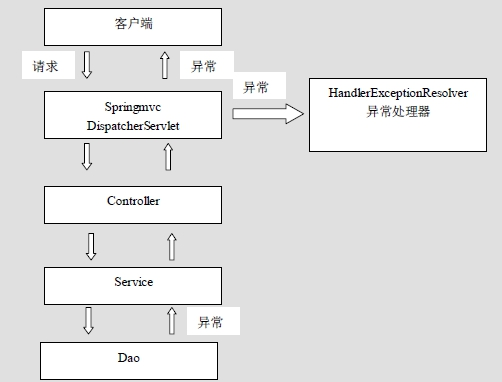
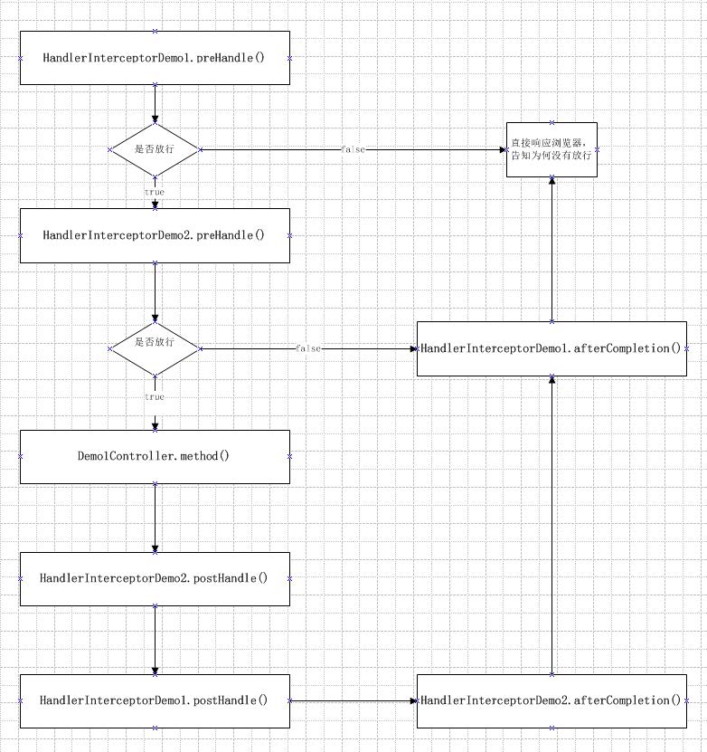

## 1. SpringMVC实现文件上传

**文件上传的必要前提：**

- form表单的enctype取值必须是：multipart/form-data (默认值是:application/x-www-form-urlencoded)
- enctype:是表单请求正文的类型 B method属性取值必须是Post
- 提供一个文件选择域 `<input type=”file” />`

**文件上传的原理分析：**

当form表单的enctype取值不是默认值后，request.getParameter()将失效。 

enctype=“application/x-www-form-urlencoded”时，form表单的正文内容是： key=value&key=value&key=value 当form表单的enctype取值为`Mutilpart/form-data`时，请求正文内容就变成： 每一部分都是MIME类型描述的正文 

-----------------------------7de1a433602ac 分界符  
Content-Disposition: form-data; name="userName" 协议头  
aaa 协议的正文  
-----------------------------7de1a433602ac  
Content-Disposition: form-data; name="file"; filename="C:\Users\zhy\Desktop\fileupload_demofile\b.txt"  
Content-Type: text/plain 协议的类型（MIME类型）  
bbbbbbbbbbbbbbbbbbbbbbbbbbbbbbbb  
-----------------------------7de1a433602ac--

**Springmvc跨服务器方式的文件上传：**

```java
@RequestMapping("SpringMVC")
    public String springMvcUpload(HttpServletRequest request, @RequestParam(value = "upload") MultipartFile multipartFile) throws IOException {
        System.out.println("SpringMVC上传");

        //服务器收到文件后，文件存放的位置
        String serverFilePath = request.getSession().getServletContext().getRealPath("/fileUploads");
        System.out.println(serverFilePath);
        //对该路径进行判断
        File file = new File(serverFilePath);
        //如果文件夹不存在，创建文件夹
        if (!file.exists()) {
            System.out.println("文件夹不存在，创造文件夹");
            file.mkdirs();
        }

        //说明上传项
        //获取上传文件名称
        String fileName = multipartFile.getOriginalFilename();
        System.out.println("上传文件名字为：" + fileName);
        //把文件的名称设置唯一值，uuid
        String uuid = UUID.randomUUID().toString().replace("-","");
        fileName = uuid + "_" + fileName;
        //完成文件上传
        multipartFile.transferTo(new File(serverFilePath,fileName));

        return "success";
    }
```

在springMVC中，设置文件上传处理器

```xml
<!--配置spring创建容器要扫描的包-->
    <context:component-scan base-package="com.zzl"/>

    <!--    配置视图解析器-->
    <bean id="viewResolver" class="org.springframework.web.servlet.view.InternalResourceViewResolver">
        <property name="prefix" value="/WEB-INF/pages/"/>
        <property name="suffix" value=".jsp"/>
    </bean>

    <!--    配置spring开启mvc的支持-->
    <mvc:annotation-driven/>

    <!--        前端控制器，不拦截发到前端的静态资源-->
    <mvc:resources location="/css/" mapping="/css/**"/>
    <mvc:resources location="/images/" mapping="/images/**"/>
    <mvc:resources location="/js/" mapping="/js/**"/>

    <!-- 文件上传 -->
    <bean id="multipartResolver"
          class="org.springframework.web.multipart.commons.CommonsMultipartResolver">
        <!-- 设置上传文件的最大尺寸为5MB -->
        <property name="maxUploadSize" value="5242880"/>
    </bean>
```

前端：

```jsp
<h3>传统方法：上传文件到服务器</h3>

<form action="FileUpload/Traditional" method="post" enctype="multipart/form-data">
    上传文件：<input type="file" name="upload"/><br>
    <input type="submit" value="上传"/>
</form>
```

## 2. 自定义异常处理器

系统的dao、service、controller出现都通过throws Exception向上抛出，最后由springmvc前端控制器交由异常处理器进行异常处理【如果没有异常处理器就再抛给浏览器客户端，异常在浏览器打印出结果】，如下图：



自定义异常

```java
public class MineException extends Exception {
    private String exceptionMessage;

    public MineException(String exceptionMessage){
        this.exceptionMessage = exceptionMessage;
    }

    public String getExceptionMessage(){
        return exceptionMessage;
    }
}

```

模拟控制器出现错误

```java
@Controller
@RequestMapping("ErrorControl")
public class ErrorControl {

    @RequestMapping("testError")
    public String testError() throws MineException {

        try {
            int i = 10/0;
        }catch (Exception e){
            e.printStackTrace();
            throw new MineException("除数不能为0");
        }

        return "success";
    }
}

```

处理异常解析器

```java
public class MineExceptionResolver implements HandlerExceptionResolver {
    @Override
    public ModelAndView resolveException(HttpServletRequest request, HttpServletResponse response, Object handler, Exception ex) {
        ex.printStackTrace();
        MineException mineException = null;
        //获取到异常对象
        if (ex instanceof MineException) {
            mineException = (MineException) ex;
            System.out.println("==mineException:"+mineException.getExceptionMessage());
        }else {
            mineException = new MineException("请联系管理员");
            System.out.println("==mineException:"+mineException.getExceptionMessage());
        }
        ModelAndView modelAndView = new ModelAndView();
        //存入错误信息
        modelAndView.addObject("exceptionMessage",mineException.getExceptionMessage());
//        System.out.println("modelAndVier==:" + modelAndView.);
        //跳转的jsp页面
        modelAndView.setViewName("error");
        return modelAndView;
    }
}

```

在springmvc.xml下添加处理异常解析器

```xml
<!--    配置异常处理器-->
    <bean id="mineExceptionResolver" class="com.zzl.exception.MineExceptionResolver"/>
```

## 3. 拦截器

Spring MVC 的处理器拦截器类似于Servlet开发中的过滤器Filter，用于对`处理器进行预处理和后处理`。

用户可以自己定义一些拦截器来实现特定的功能。

谈到拦截器，还要向大家提一个词——`拦截器链（Interceptor Chain）`。拦截器链就是将拦截器按一定的顺序联结成一条链。在访问被拦截的方法或字段时，拦截器链中的拦截器就会按其之前定义的顺序被调用。 说到这里，可能大家脑海中有了一个疑问，这不是我们之前学的过滤器吗？是的它和过滤器是有几分相似，但是也有区别，接下来我们就来说说他们的区别：

`过滤器`是`servlet`规范中的一部分，`任何java web工程`都可以使用。`拦截器`是`SpringMVC`框架自己的，`只有使用了SpringMVC框架的工程才能用`。

过滤器在url-pattern中配置了/*之后，可以对`所有`要访问的资源拦截。 `拦截器它是只会拦截访问的控制器方法`，如果访问的是jsp，html,css,image或者js是不会进行拦截的。 它也是`AOP思想【织入】`的具体应用。 我们要想自定义拦截器， 要求必须实现：HandlerInterceptor接口。

编写一个普通类实现HandlerInterceptor接口

```java
public class HandlerInterceptorDemo1 implements HandlerInterceptor {
    @Override
    public boolean preHandle(HttpServletRequest request, HttpServletResponse response, Object handler) throws Exception {
        System.out.println("1 Demo1：preHandle 织入的位置：在调用controller前调用=");
        //返回true代表放行，返回false，代表不放行
        return true;
    }

    @Override
    public void postHandle(HttpServletRequest request, HttpServletResponse response, Object handler, ModelAndView modelAndView) throws Exception {
        System.out.println("5 Demo1：postHandle " +
                "在controller执行完，返回（return）之前调用，可用重定向，使得不返回代码return的界面");
    }

    @Override
    public void afterCompletion(HttpServletRequest request, HttpServletResponse response, Object handler, Exception ex) throws Exception {
        System.out.println("8 Demo1:afterCompletion " +
                "在return“完”之后调用，一般用于执行关闭的程序");
    }
}
```

另一个拦截器，可以在xml中配置，构成拦截器链。

```java
public class HandlerInterceptorDemo2 implements HandlerInterceptor {
    @Override
    public boolean preHandle(HttpServletRequest request, HttpServletResponse response, Object handler) throws Exception {
        System.out.println("2 Demo2：preHandle Demo2后执行");
        //返回true代表放行，返回false，代表不放行
        return true;
    }

    @Override
    public void postHandle(HttpServletRequest request, HttpServletResponse response, Object handler, ModelAndView modelAndView) throws Exception {
        System.out.println("4 Demo2:postHandle Demo2先执行");
    }

    @Override
    public void afterCompletion(HttpServletRequest request, HttpServletResponse response, Object handler, Exception ex) throws Exception {
        System.out.println("7 Demo2:afterCompletion Demo2先执行");
    }
}
```

控制类

```java
@Controller
@RequestMapping("InterceptorController")
public class InterceptorController {

    @RequestMapping("testInterceptor")
    public String testInterceptor(){
        System.out.println("3 InterceptorController--testInterceptor  控制器");
        return "success";
    }
}
```

拦截器在springmvc中的配置

```xml
<!--    配置拦截器-->
    <mvc:interceptors>
        <mvc:interceptor>
            <!--用于指定拦截url-->
            <mvc:mapping path="/**"/>
            <!--排除拦截的url-->
            <!--            <mvc:exclude-mapping path=""/>-->
            <bean id="handlerInterceptorDemo1" class="com.zzl.interceptor.HandlerInterceptorDemo1"/>
        </mvc:interceptor>

        <mvc:interceptor>
<!--            拦截器拦截的是请求~从根目录"/"开始写起,"**"代表全部文件-->
            <mvc:mapping path="/InterceptorController/**"/>
            <bean id="handlerInterceptorDemo2" class="com.zzl.interceptor.HandlerInterceptorDemo2"/>
        </mvc:interceptor>
    </mvc:interceptors>

```

结果为：

```text
1 Demo1：preHandle 织入的位置：在调用controller前调用=
2 Demo2：preHandle Demo2后执行
3 InterceptorController--testInterceptor  控制器
4 Demo2:postHandle Demo2先执行
5 Demo1：postHandle 在controller执行完，返回（return）之前调用，可用重定向，使得不返回代码return的界面
6 success.jsp  控制器执行结束，返回的页面
7 Demo2:afterCompletion Demo2先执行
8 Demo1:afterCompletion 在return“完”之后调用，一般用于执行关闭的程序
```



### 拦截器简单案例：验证用户是否登录

**实现思路：**

1. 有一个登录页面，需要写一个controller访问页面
2. 登录页面有一提交表单的动作。需要在controller中处理。  
    2.1. 判断用户名密码是否正确  
    2.2. 如果正确 向session中写入用户信息  
    2.3. 返回登录成功。  
3. 拦截用户请求，判断用户是否登录  
    3.1. 如果用户已经登录。放行  
    3.2. 如果用户未登录，跳转到登录页面  

**控制器代码：**

```java
//登陆页面
@RequestMapping("/login")
public String login(Model model)throws Exception{
    return "login";
}

//登陆提交
//userid：用户账号，pwd：密码
@RequestMapping("/loginsubmit")
public String loginsubmit(HttpSession session,String userid,String pwd)throws Exception{
    //向session记录用户身份信息
    session.setAttribute("activeUser", userid); return "redirect:/main.jsp";
}

//退出
@RequestMapping("/logout")
public String logout(HttpSession session)throws Exception{
    //session过期
    session.invalidate();
    return "redirect:index.jsp";
}
```

**拦截器代码：**

```java
public class LoginInterceptor implements HandlerInterceptor{
    @Override Public boolean preHandle(HttpServletRequest request,
            HttpServletResponse response,Object handler) throws Exception {
        //如果是登录页面则放行
        if(request.getRequestURI().indexOf("login.action")>=0){
            return true;
        }
        HttpSession session = request.getSession();
        //如果用户已登录也放行
        if(session.getAttribute("user")!=null){
            return true;
        }
        //用户没有登录挑战到登录页面
        request.getRequestDispatcher("/WEB-INF/jsp/login.jsp").forward(request, response);
        return false;
    }
}
```
