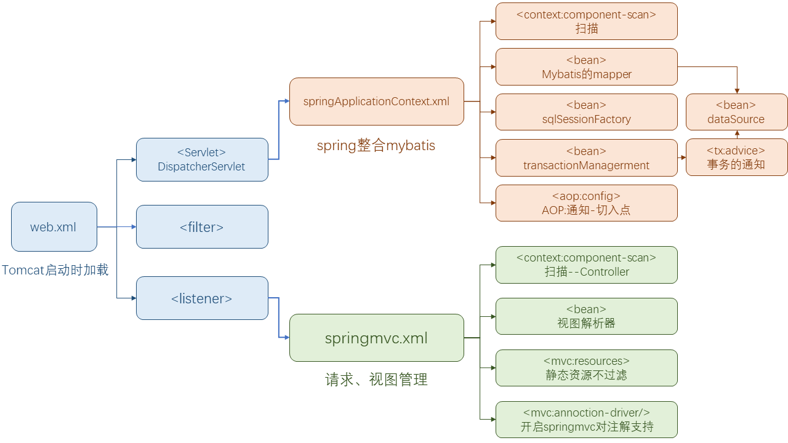
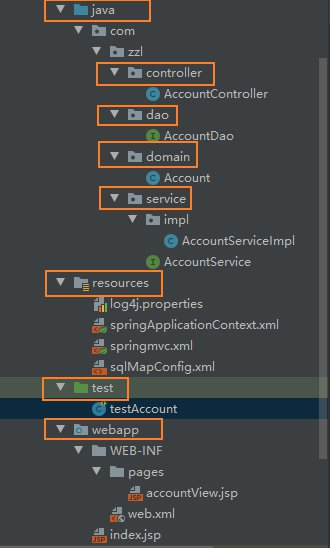
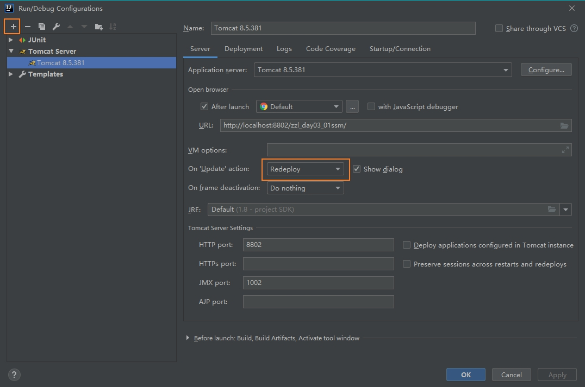

### 数据库
```sql
create table account(
    id int primary key auto_increment,
    name varchar(100),
    money int
);
```

### 创建maven工程

pom.xml文件导入坐标

```xml
<properties>
    <spring.version>5.0.2.RELEASE</spring.version>
    <slf4j.version>1.6.6</slf4j.version>
    <log4j.version>1.2.12</log4j.version>
    <shiro.version>1.2.3</shiro.version>
    <mysql.version>5.1.6</mysql.version>
    <mybatis.version>3.4.5</mybatis.version>
</properties>

<dependencies>
    <dependency>
        <groupId>junit</groupId>
        <artifactId>junit</artifactId>
        <version>4.11</version>
        <scope>test</scope>
    </dependency>
    <dependency>
        <groupId>org.aspectj</groupId>
        <artifactId>aspectjweaver</artifactId>
        <version>1.6.8</version>
    </dependency>
    <dependency>
        <groupId>org.springframework</groupId>
        <artifactId>spring-aop</artifactId>
        <version>${spring.version}</version>
    </dependency>
    <dependency>
        <groupId>org.springframework</groupId>
        <artifactId>spring-context</artifactId>
        <version>${spring.version}</version>
    </dependency>
    <dependency>
        <groupId>org.springframework</groupId>
        <artifactId>spring-context-support<artifactId>
        <version>${spring.version}</version>
    </dependency>
    <dependency>
        <groupId>org.springframework</groupId>
        <artifactId>spring-web</artifactId>
        <version>${spring.version}</version>
    </dependency>
    <dependency>
        <groupId>org.springframework</groupId>
        <artifactId>spring-orm</artifactId>
        <version>${spring.version}</version>
    </dependency>
    <dependency>
        <groupId>org.springframework</groupId>
        <artifactId>spring-beans</artifactId>
        <version>${spring.version}</version>
    </dependency>
    <dependency>
        <groupId>org.springframework</groupId>
        <artifactId>spring-core</artifactId>
        <version>${spring.version}</version>
    </dependency>
    <dependency>
        <groupId>org.springframework</groupId>
        <artifactId>spring-test</artifactId>
        <version>${spring.version}</version>
    </dependency>
    <dependency>
        <groupId>org.springframework</groupId>
        <artifactId>spring-webmvc</artifactId>
        <version>${spring.version}</version>
    </dependency>
    <dependency>
        <groupId>org.springframework</groupId>
        <artifactId>spring-tx</artifactId>
        <version>${spring.version}</version>
    </dependency>
    <dependency>
        <groupId>junit</groupId>
        <artifactId>junit</artifactId>
        <version>4.12</version>
        <scope>test</scope>
    </dependency>
    <dependency>
        <groupId>mysql</groupId>
        <artifactId>mysql-connector-java<artifactId>
        <version>${mysql.version}</version>
    </dependency>
    <dependency>
        <groupId>javax.servlet</groupId>
        <artifactId>servlet-api</artifactId>
        <version>2.5</version>
        <scope>provided</scope>
    </dependency>
    <dependency>
        <groupId>javax.servlet.jsp</groupId>
        <artifactId>jsp-api</artifactId>
        <version>2.0</version>
        <scope>provided</scope>
    </dependency>
    <dependency>
        <groupId>jstl</groupId>
        <artifactId>jstl</artifactId>
        <version>1.2</version>
    </dependency>
    <!-- log start -->
    <dependency>
        <groupId>log4j</groupId>
        <artifactId>log4j</artifactId>
        <version>${log4j.version}</version>
    </dependency>
    <dependency>
        <groupId>org.slf4j</groupId>
        <artifactId>slf4j-api</artifactId>
        <version>${slf4j.version}</version>
    </dependency>
    <dependency>
        <groupId>org.slf4j</groupId>
        <artifactId>slf4j-log4j12</artifactId>
        <version>${slf4j.version}</version>
    </dependency>
    <!-- log end -->
    <dependency>
        <groupId>org.mybatis</groupId>
        <artifactId>mybatis</artifactId>
        <version>${mybatis.version}</version>
    </dependency>
    <dependency>
        <groupId>org.mybatis</groupId>
        <artifactId>mybatis-spring</artifactId>
        <version>1.3.0</version>
    </dependency>
    <dependency>
        <groupId>c3p0</groupId>
        <artifactId>c3p0</artifactId>
        <version>0.9.1.2</version>
        <type>jar</type>
        <scope>compile</scope>
    </dependency>
</dependencies>
```

### 配置tomcat服务器




### web.xml

- web.xml
    - 控制器DispatcherServlet（读取springmvc.xml [Controller]）
    - 过滤器Filter（字符集编码）
    - 监听器Listener（读取springApplicationContext.xml [IoC AOP Mybatis SpringFrameWork]）

```xml
    <servlet>
        <servlet-name>springmvcDispatcherServlet</servlet-name>
        <servlet-class>org.springframework.web.servlet.DispatcherServlet</servlet-class>
        <!-- 配置初始化参数，用于读取springmvc的配置文件 -->
        <init-param>
            <param-name>contextConfigLocation</param-name>
            <param-value>classpath:springmvc.xml</param-value>
        </init-param>
        <!-- 配置servlet的对象的创建时间点：应用加载时创建。取值只能是非0正整数，表示启动顺序 -->
        <load-on-startup>1</load-on-startup>
    </servlet>
    <servlet-mapping>
        <servlet-name>springmvcDispatcherServlet</servlet-name>
        <url-pattern>/</url-pattern>
    </servlet-mapping>

    <!-- 配置springMVC编码过滤器 -->
    <filter>
        <filter-name>CharacterEncodingFilter</filter-name>
        <filter-class>org.springframework.web.filter.CharacterEncodingFilter</filter-class>
        <!-- 设置过滤器中的属性值 -->
        <init-param>
            <param-name>encoding</param-name>
            <param-value>UTF-8</param-value>
        </init-param>
        <!-- 启动过滤器 -->
        <init-param>
            <param-name>forceEncoding</param-name>
            <param-value>true</param-value>
        </init-param>
    </filter>
    <!-- 过滤所有请求 -->
    <filter-mapping>
        <filter-name>CharacterEncodingFilter</filter-name>
        <url-pattern>/*</url-pattern>
    </filter-mapping>

    <!--监听器-->
    <listener>
        <listener-class>org.springframework.web.context.ContextLoaderListener</listener-class>
    </listener>
    <!--配置加载类路径的配置文件-->
    <context-param>
        <param-name>contextConfigLocation</param-name>
        <param-value>classpath:springApplicationContext.xml</param-value>
    </context-param>

```

### springmvc.xml

- springmvc.xml
    - 扫描控制器
    - 解析视图、不过滤静态资源
    - 开启springMVC注解的支持

```xml
<?xml version="1.0" encoding="UTF-8"?>
<beans xmlns="http://www.springframework.org/schema/beans"
       xmlns:mvc="http://www.springframework.org/schema/mvc"
       xmlns:context="http://www.springframework.org/schema/context"
       xmlns:xsi="http://www.w3.org/2001/XMLSchema-instance"
       xsi:schemaLocation="
       http://www.springframework.org/schema/beans
       http://www.springframework.org/schema/beans/spring-beans.xsd
       http://www.springframework.org/schema/mvc
       http://www.springframework.org/schema/mvc/spring-mvc.xsd
       http://www.springframework.org/schema/context
       http://www.springframework.org/schema/context/spring-context.xsd">

    <!--控制器-->

    <!-- 扫描controller的注解，别的不扫描 -->
    <context:component-scan base-package="com.zzl">
        <context:include-filter type="annotation" expression="org.springframework.stereotype.Controller"/>
    </context:component-scan>

    <!--视图-->

    <!-- 配置视图解析器 -->
    <bean id="viewResolver"
          class="org.springframework.web.servlet.view.InternalResourceViewResolver">
        <!-- JSP文件所在的目录 -->
        <property name="prefix" value="/WEB-INF/pages/"/>
        <!-- 文件的后缀名 -->
        <property name="suffix" value=".jsp"/>
    </bean>

    <!-- 设置静态资源不过滤 -->
    <mvc:resources location="/css/" mapping="/css/**"/>
    <mvc:resources location="/images/" mapping="/images/**"/>
    <mvc:resources location="/js/" mapping="/js/**"/>

    <!-- 开启对SpringMVC注解的支持 -->
    <mvc:annotation-driven/>
</beans>
```

### springApplicationContext.xml

- springApplicationContext.xml
    - 注解扫描
    - mybatis
        - dataSource
        - <bean>SqlSessionFactory
        - 扫描Dao层
    - 事务tx
        - dataSource(上面写了不用重复写)
        - TransactionManagerment
        - 事务的通知txAdvice
        - AOP织入

```xml
<?xml version="1.0" encoding="UTF-8"?>
<beans xmlns="http://www.springframework.org/schema/beans"
       xmlns:xsi="http://www.w3.org/2001/XMLSchema-instance"
       xmlns:context="http://www.springframework.org/schema/context"
       xmlns:aop="http://www.springframework.org/schema/aop"
       xmlns:tx="http://www.springframework.org/schema/tx"
       xsi:schemaLocation="http://www.springframework.org/schema/beans
        http://www.springframework.org/schema/beans/spring-beans.xsd
        http://www.springframework.org/schema/context
        http://www.springframework.org/schema/context/spring-context.xsd
        http://www.springframework.org/schema/aop
        http://www.springframework.org/schema/aop/spring-aop.xsd
        http://www.springframework.org/schema/tx
        http://www.springframework.org/schema/tx/spring-tx.xsd">

    <!-- 开启注解扫描，要扫描的是service和dao层的注解，要忽略web层注解，因为web层让SpringMVC框架
    去管理 -->
    <context:component-scan base-package="com.zzl">
        <!-- 配置要忽略的注解 -->
        <context:exclude-filter type="annotation" expression="org.springframework.stereotype.Controller"/>
    </context:component-scan>

    <!--这里的配置是要完全代替mybatis的配置-->
    <!--配置C3P0的连接池对象-->
    <bean id="dataSource" class="org.springframework.jdbc.datasource.DriverManagerDataSource">
        <property name="driverClassName" value="com.mysql.jdbc.Driver"/>
        <property name="url" value="jdbc:mysql://localhost:3306/myproject_textdb?characterEncoding=utf-8"/>
        <property name="username" value="root"/>
        <property name="password" value="uber"/>
    </bean>

    <!--配置SqlSession的工厂-->
    <bean id="sqlSessionFactory" class="org.mybatis.spring.SqlSessionFactoryBean">
        <property name="dataSource" ref="dataSource"/>
    </bean>

    <!--配置扫描dao的包-->
    <bean id="mapperScanner" class="org.mybatis.spring.mapper.MapperScannerConfigurer">
        <property name="basePackage" value="com.zzl"/>
    </bean>

    <!--配置事务管理器-->
    <bean id="transactionManager" class="org.springframework.jdbc.datasource.DataSourceTransactionManager">
        <property name="dataSource" ref="dataSource"/>
    </bean>

    <!--配置事务的通知-->
    <tx:advice id="txAdvice" transaction-manager="transactionManager">
        <tx:attributes>
            <tx:method name="*" propagation="REQUIRED" read-only="false"/>
            <tx:method name="find*" propagation="SUPPORTS" read-only="true"/>
        </tx:attributes>
    </tx:advice>

    <!--配置aop-->
    <aop:config>
        <!--配置切入点表达式-->
        <aop:pointcut id="pt1" expression="execution(* com.zzl.service.impl.*.*(..))"/>
        <!--建立通知和切入点表达式的关系-->
        <aop:advisor advice-ref="txAdvice" pointcut-ref="pt1"/>
    </aop:config>

</beans>
```

### doMain层

Account.java

```java
public class Account implements Serializable {
    private String accountId;
    private String accountName;
    private Integer accountMoney;

    public String getAccountId() {
        return accountId;
    }

    public void setAccountId(String accountId) {
        this.accountId = accountId;
    }

    public String getAccountName() {
        return accountName;
    }

    public void setAccountName(String accountName) {
        this.accountName = accountName;
    }

    public Integer getAccountMoney() {
        return accountMoney;
    }

    public void setAccountMoney(int accountMoney) {
        this.accountMoney = accountMoney;
    }

    @Override
    public String toString() {
        return "Account{" +
                "accountId='" + accountId + '\'' +
                ", accountName='" + accountName + '\'' +
                ", accountMoney='" + accountMoney + '\'' +
                '}';
    }
}
```

### dao层

AccountDao.java

接口，不用实例化，mybatis会利用反射解决实例化的问题

```java
@Repository("AccountDao")
public interface AccountDao {

    @Select("select * from account_spring")
    @Results(id = "accountMap",value = {
            @Result(id = true,column = "id",property = "accountId"),
            @Result(column = "money",property = "accountMoney"),
            @Result(column = "name",property = "accountName")
    })
    public List<Account> findAll();

    @Update("insert into account_spring(name,money) values(#{accountName},#{accountMoney})")
    public void saveAccount(Account account);
}

```

### service层

AccountService.java

```java
public interface AccountService {

    public List<Account> findAll();

    public void saveAccount(Account account);
}
```

AccountServiceImpl.java

```java
@Service("AccountService")
public class AccountServiceImpl implements AccountService {

    @Resource(name = "AccountDao")
    AccountDao accountDao;

    @Override
    public List<Account> findAll() {
        System.out.println("AccountServiceImpl --> findAll()");
        return accountDao.findAll();
    }

    @Override
    public void saveAccount(Account account) {
        System.out.println("AccountServiceImpl --> findAll()");
        accountDao.saveAccount(account);
    }
}
```

### test

至此，我们实现`了dao层、service层的编写`，并用`springApplicationContext实现了mybatis类的创建【mybatis和spring的整合】`，我们可以用test检测我们的代码

```java
public class testAccount {

    @Test
    public void testFindAll() throws IOException {
//        BasicConfigurator.configure();
        InputStream inputStream = Resources.getResourceAsStream("sqlMapConfig.xml");
        SqlSessionFactory sqlSessionFactory = new SqlSessionFactoryBuilder().build(inputStream);
        SqlSession sqlSession = sqlSessionFactory.openSession();
        AccountDao dao = sqlSession.getMapper(AccountDao.class);

        Account updateAccount = new Account();
        updateAccount.setAccountMoney(0);
        updateAccount.setAccountName("23:46");
        dao.saveAccount(updateAccount);
        sqlSession.commit();

        List<Account> accounts = dao.findAll();
        for (Account account : accounts) {
            System.out.println(account);
        }
    }
}
```

### 前端

接下来是实现springMVC,并用spring整合springMVC

index.jsp。简单点

```jsp
<%@ page contentType="text/html;charset=UTF-8" language="java" %>
<html>
<body>
<h2>Hello World!</h2>
</body>

<a href="accountController/testAccountFindAll">查询所有信息</a>

<form action="accountController/testAccountSaveAccount" method="post">
    账户名称：<input type="text" name="accountName"/><br/>
    账户金额：<input type="text" name="accountMoney"><br/>
    <input type="submit" value="保存"/></form>
</html>

```

### Controller

springMVC.xml已经由web.xml读取

```java
@Controller
@RequestMapping("accountController")
public class AccountController {

    @Autowired
    private AccountServiceImpl accountService;

    @RequestMapping("testAccountFindAll")
    public ModelAndView testAccountFindAll(){
        List<Account> accounts = accountService.findAll();
        ModelAndView modelAndView = new ModelAndView();
        modelAndView.addObject("accounts",accounts);
        modelAndView.setViewName("accountView");
        return modelAndView;
    }

    @RequestMapping("testAccountSaveAccount")
    public void testAccountSaveAccount(HttpServletRequest request,HttpServletResponse response,Account account) throws ServletException, IOException {
        System.out.println("controller --> saveAccount:" +account);
        accountService.saveAccount(account);

        request.getRequestDispatcher("accountView.jsp").forward(request,response);
    }

}
```

返回的页面accountView.jsp

```jsp
<%@ page contentType="text/html;charset=UTF-8" language="java" isELIgnored="false" %>
<html>
<head>
    <title>Title</title>
</head>
<body>
${accounts}
</table>
</body>
</html>
```