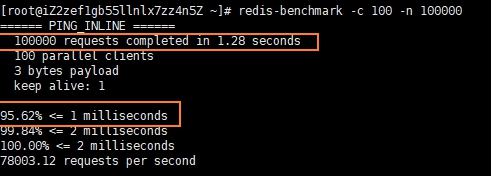
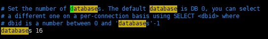

# Redis

学了Spring，你能写一个网站出来，这就足够了吗。

先不说别的，以人为鉴，看一下淘宝网是怎么做的，我们自己用Spring写的跟淘宝网，差很多吗？

我们尝试打开淘宝网的一件件商品，再打开另外10多件商品，不知道你有没有发现，每次打开的商品，全程丝滑，没有任何一点卡顿。

再想想自己写的网站，自己写的看似有模有样，但是，你打开一个页面，需要等多久。而且，你页面加载的东西有多少，淘宝网一个页面加载的图片、文字有多少？仔细想想，从用户体验来看，真的是一个天上，一个地下，如果自己写的网站，有10个人来访问，会不会直接卡成狗？

没错。面对`互联网的三高：高并发、高可用、高性能`，我们之前是完全没有涉及到的，但是，这又是一个重中之重的环节，现在我们尝试地去学习，如何处理互联网地三高。

首先我们来看一下，淘宝的一件商品：


如果是给你设计，弹出这个页面，你会怎么设计？直接从MySQL读出所有的数据？噢，这真的太慢了。

我们看一下这个页面是由什么组成，然后其他公司是怎么用技术去解决的。

1. `商品的基本信息`：包括名称、价格、商家信息；我们使用关系型数据库MySQL等就可以解决。淘宝网内部也是使用MySQL，但是淘宝网内部使用的MySQL跟大家用的MySQL是完全不一样的，淘宝网自己定制MySQL，以便更好的为业务服务。
2. `商品的描述、评论（文字比较多）`：使用MongoDB文档型数据库
3. `图片`：使用分布式文件系统 FastDFS，淘宝自己的TFS，Google的GFS，Hadoop的HDFS，阿里云的oss
4. `商品的关键字（搜索）`：搜索引擎solr、elasticsearch、ISearch
5. `商品热门的波段信息`：使用Redis、Memache等内存数据库
6. `商品的交易，外部的支付接口`：三方应用
7. 等等等等

路漫漫其修远兮，要学的还有很多很多，现在我们从Redis开始学习。

## 1. Redis概述

Redis是NoSQL数据库，什么叫NoSQL呢？

NoSQL泛指`非关系型数据库`，这么命名，是为了表示NoSQL跟MySQL等关系型数据库不一样，NoSQL`没有`关系型数据库的`ACID特性，数据之间没有任何关系`。这么做，带来的好处是非常容易拓展，这很好理解，数据之间没有任何关系嘛，同时还具有大数据量、高性能等特性。

既然讲到Redis属于NoSQL，那再拓展一下吧，看看除了Redis，还有什么其他大名鼎鼎的NoSQL

| 分类                      | 特点                                                                                     | 代表    |
| :------------------------ | :--------------------------------------------------------------------------------------- | :------ |
| 键值(key-value)存储数据库 | 这一类数据库会使用到一个哈希表。Key/Value模型对于IT系统来说的优势在于简单、易部署。      | Redis   |
| 列存储数据库              | 这部分数据库通常用来应对分布式存储的海量数据。键仍然存在，但是他们的特点是指向了多个列。 | HBase   |
| 文档型数据库              | 该类型的数据库模型是版本化的文档，半结构化的文档以特定的格式存储，比如JSON               | MongoDB |
| 图形（Graph）数据库       | 图形数据库使用的是灵活的图形模型，并且能够拓展到多个服务器上                             | Neo4J   |

不知道你发现了没有，上面我们分析的淘宝网的时候，很多是用到NoSQL。OK，闲话我们就说到这里，下面我们开始正式进入Redis。

> [Redis官网](http://www.redis.io/)  
> [Redis中文官网](http://www.redis.cn/)

Redis 是一个开源（BSD许可）的，内存中的数据结构存储系统，它可以用作数据库、缓存和消息中间件。 它支持多种类型的数据结构，如 字符串（strings）， 散列（hashes）， 列表（lists）， 集合（sets）， 有序集合（sorted sets） 与范围查询， bitmaps， hyperloglogs 和 地理空间（geospatial） 索引半径查询。 Redis 内置了 复制（replication），LUA脚本（Lua scripting）， LRU驱动事件（LRU eviction），事务（transactions） 和不同级别的 磁盘持久化（persistence）， 并通过 Redis哨兵（Sentinel）和自动 分区（Cluster）提供高可用性（high availability）。

## 2. Redis的安装

Redis是应用于服务器比较多，所以我们学习Redis也是基于Linux。

> 官方文档关于下载：<https://redis.io/download>

安装、配置、测试等步骤：

```bash
# 安装基本环境，Redis是用C写的
yum install gcc-c++

wget http://download.redis.io/releases/redis-5.0.8.tar.gz

tar xzf redis-5.0.8.tar.gz 

# 将 redis放到/user/local/redis的位置上
mv redis-5.0.8.tar.gz /usr/local/redis   

# make让多核CPU同时make
make -j 2  

# 将编译好的添加到系统的可执行目录里面
make install  

# 查看redis的路径
whereis redis 

# 修改redis的配置： bind 0.0.0.0, 允许后台运行 daemonize yes 密码 requirepass root等
vim redis.conf 

# 以指定配置文件打开
redis-server ./redis.conf 

# 查看进程
ps -ef | grep redis 

# 客户端 进行set get
redis-cli 
    shutdown save # 重启

ps -ef | grep redis

redis-server ./redis/conf

redis-cli

cd utils/
./install_server.sh # 设置为系统进程
    6379
    /usr/local/redis/redis.conf  # 放在同一个文件夹下面，方便管理
    /usr/local/redis/redis.log
    /usr/local/redis/data

chkconfig --list redis  

# 检查服务有没有开启，2 3 4 5应该是要打开的
chkconfig --list | grep redis 

systemctl status redis_6379

systemctl stop redis_6379

systemctl start redis_6379

ps -ef | grep redis

vim /etc/init.d/redis_6379 
    EXEC
    CLIEXEC等
```

都说Redis速度很快，口说无凭！Redis早就想好了，内置的 redis-benchmark 是一个压力测试工具，我们可以用它来测试一下。

> [Redis-benchmark的参数](https://www.runoob.com/redis/redis-benchmarks.html)

```bash
# 测试： 100个并发连接 100000个请求
redis-benchmark -h localhost -p 6369 -c 10- -n 100000
```



这，真的很快。

## 3. 基础知识

Redis默认有16个数据库，默认使用的是第0个

- 

```bash
# 切换数据库
select 3

# 查看DB大小
dbsize

# 查看数据库所有的key
keys *

# 清除当前数据库
flushdb

# 清除全部数据库的内容
flushall
```

## 4. 五大数据类型

### 4.1 Key-Value

```bash

set name zzl

get name

# 查看所有的key
keys *

# 追加字符串
append name hello

# 获取字符串的长度
strlen name

# 判断当前的key是否存在
exists name

# 查看当前key的一个类型
type name

# 获取字符串指定范围
getrange name 0 2

# 获取全部的字符串
getrange name 0 -1

# 替换
setrange name 3 YYYYYYYYYYYYYYYY

# 设置key的过期实践，单位是秒
expire name 10

# 查看当前key的剩余时间
ttl name

# setex(set with expire)设置过期时间
setex k1 30 hello

ttl k1

# setnx(set if not exist)
setnx k2 MongoDB

# 将当前的key移到database 1
move k2 1

set views 0

# 自增1
incr views 

# 自减1
decr views

# 可以设置步长，指定增量
incrby views 10

# 同时设置多个值
mset k1 v1 k2 v2 k3 v3

# 同时获取多个值
mget k1 k2 k3

# msetnx 是一个原子操作
msetnx k1 v1 k9 v9  [失败]

# 对象，值为json
set user:1 {name:zhangsan, age:3}

# 这里的key还可以这么设计
mset user:1:name zhangsan user:1:age 2

mget user:1:name user:1:age

# 先get然后再set
getset db redis

get db

getset db mongodb

get db

```

### 4.2 List

跟LinkedList差不多

```bash
# 将一个值或者多个值往列表的左边插入
lpush list one two three four five six

# 获取list中的值
lrange list 0 -1

lrange list 0 1

# 将一个值或者多个值往列表的右边插入
rpush list zero

# 移除list的第一个元素
lpop list

# 移除list的最后一个元素
rpop list

# 通过下标获得list中的某一个值
lindex list 1

# 返回列表的长度
llen list

# 移除list集合中指定个数的value，精确匹配
lrem list 1 one

# 通过下标截取指定的长度，这个list已经被改变了，截断了只剩下的元素
ltrim list 1 2

# 移除列表的最后一个元素，将他移动到新的列表中
rpoplpush list newlist

lrange list 0 -1

lrange newlist 0 -1

# 判断这个列表是否存在
exists list three

# 如果存在，更新当前下标的值
lset list 0 item

# 将某个具体的value插入到列表中某个元素的前面或者后面
linsert list before item after
```

### 4.3 set

```bash
# set集合中添加元素
sadd set one two three four five

# 查看set集合中所有的值
smembers set

# 判断某一个值是不是在set集合中
sismember set one

# 获取set集合中的内容的元素个数
scard set

# 移除set集合中的指定元素
srem set five

# 随机抽取一个元素
srandmember set

# 随机抽取多个元素
srandmember set 2

# 随机删除set集合中的元素
spop set

sadd set one

# 将一个指定的值，移动到另一个set集合
smove set set2 one

sadd set2 four three ten eleven

sadd set two three

# 差集
sdiff set set1

# 交集
sinter set set1

# 并集
sunion set set1
```

### 4.4 hash

相当于HashMap，适合用来存储对象

```bash
# hset 一个或多个具体的 key-value
hset hash one 1 two 2 three 3 name zz age 20

# 获取一个字段值
hget hash one

# 获取全部的数据
hgetall hash

# 获取键
hkeys hash

# 获取值
hvals hash

# 删除hash指定的key字段
hdel hash one

# 获取hash表的字段数量
hlen hash

# 判断hash中指定的字段是否存在
hexists hash two

# 更改值
hset hash two 222

# 自增
hincrby hash two 10

hincrby hash tow -1000

# 如果不存在则可以设置
hsetnx hash two 2

hget hash two

hsetnx hash hundred 100

```

### 4.5 zset

有序集合

```bash
# 添加一个或多个值
zadd zset 1 one 1 one2 1 one3 2 two 3 three

# 查看所有的值
zrange zset 0 -1

# 指定范围内[-无穷, +无穷]，显示所有的用户 
zrangebyscore zset -inf +inf 

# 显示全部的用户并且附带值
zrangebyscore zset -inf +inf withscores

zrangebyscore zset -inf 1 withscores

# 从大到小进行排序
zrevrange zset 0 -1

# 移除有序集合中指定元素
zrem zset one

# 获取有序集合中的个数
zcard zset

# 获取指定区间的成员变量
zcount zset 1 2

```

## 5. 三种特殊基本类型

### 5.1 

### 5.2

### 5.3

## 6. 事务

### 6.1 事务

Redis事务本质：`一组命令的集合`！一个事务中所有的命令都会被序列化，`放入一个队列`，在事务执行过程中，会按照顺序执行！

`Redis事务没有隔离级别的概念`。不存在说这一组命令完全执行还是不完全执行。

所有的命令入队，并没有被执行，只有发起执行命令的时候`Exec`才被执行。

**执行一个事务：**

```bash
# 开启事务
multi

# 命令入队
set k1 v1

set k2 v2

# 执行事务
exec
```

**取消一个事务：**

```bash
# 开启事务
multi

# 命令入队
set k3 v3

set k4 v4

# 取消事务
discard

# 事务队列中的命令不会被执行
get k4
```

编译型异常（代码有问题！命令有错）事务中所有的命令都不会被执行

```bash
multi

set k5 v5

set k6 v6

# 错误的命令
getset k7
(error) ERR wrong number of arguments for 'getset' command

set k8 v8

# 执行事务报错
exec
(error) EXECABORT Transaction discarded because of previous errors.

# 不会被执行
get k5
```

运行时异常（I/O），如果事务队列中存在语法性，那么其他命令是可以正常执行的，错误命令抛出异常！

`原子性（要么全执行，要么都不执行）不成立的例子`

```bash
multi

set k1 v11

# 不会报错，但是字符串不能自增，事务执行时这条命令会执行失败
incr k1

set k2 v22

exec
1) OK
2) (error) ERR value is not an integer or out of range
3) OK

# 虽然事务的第一条命令报错了，但是依旧正常执行
get k2
```

### 6.2 锁

**悲观锁：**

很悲观，认为什么时候都会出问题，无论做什么都会加锁！

效率及其低下，开发时大概率不会用。

**乐观锁：**

很乐观，认为什么时候都不会出现问题，所以不会上锁！

原理：CAS，在更新数据前获取一个version，并且使version++，更新数据的时候去判断一下version == 旧的version + 1，如果有变化，则说明数据被别人改过了，不能再更新，如果没有变化，说明数据没有改过，更新数据.

Redis使用 `Watch` 监控

```bash
set money 100

set out 0

# 监视money对象
watch money

multi

decrby money 20

incrby out 20

### 期间另一个进程执行
incrby money 100
###

# 修改失败
exec

# 放弃监控
unwatch
```

### Jedis

Jedis是Redis官方推荐的Java开发连接工具。

在[mvnrepository](https://mvnrepository.com/)查找依赖并导入依赖

```java
    <dependencies>
        <!-- https://mvnrepository.com/artifact/redis.clients/jedis -->
        <dependency>
            <groupId>redis.clients</groupId>
            <artifactId>jedis</artifactId>
            <version>3.2.0</version>
        </dependency>
        <!-- https://mvnrepository.com/artifact/com.alibaba/fastjson -->
        <dependency>
            <groupId>com.alibaba</groupId>
            <artifactId>fastjson</artifactId>
            <version>1.2.68</version>
        </dependency>
```

Jedis的命令跟Redis的一模一样

```java
public class JRedisTest {

    public static void main(String[] args) {
        Jedis jedis = new Jedis("182.92.163.202", 6379);
        jedis.auth("密码");

        //监听
        jedis.watch("money");

        JSONObject jsonObject = new JSONObject();
        jsonObject.put("hello", "world");
        jsonObject.put("name","zzl");

        //开启事务
        Transaction multi = jedis.multi();
        try {
            multi.set("user", jsonObject.toJSONString());
            //代码抛出异常事务，执行失败
            int i = 10 / 0;
            //执行事务
            multi.exec();
        }catch (Exception ex){
            ex.printStackTrace();
            //放弃事务
            multi.discard();
        }finally {
            System.out.println(jedis.get("user"));
            //关闭连接
            multi.close();
            jedis.close();
        }

    }
}

```