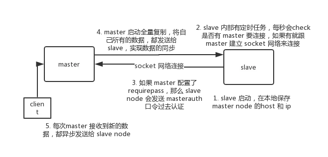

### redis的过期策略都有哪些？内存淘汰机制都有哪些？手写一下LRU代码实现

如果假设你设置一个一批key只能存活1个小时，那么接下来1小时后，redis是怎么对这批key进行删除的？

`定期删除+惰性删除。`

为什么这么做呢？

假设redis里放了10万个key，都设置了过期时间，你每隔几百毫秒，`就检查10万个key`，那redis基本上就死了，cpu负载会很高的，消耗在你的检查过期key上了。redis是每隔100ms`随机抽取一些key`来检查和删除的。【[隔多少时间扫描是通过Hz参数设定的](https://www.cnblogs.com/chenpingzhao/p/5022467.html?utm_source=tuicool&utm_medium=referral)】

并不是key到时间就被删除掉，`而是你查询这个key的时候，redis再懒惰的检查一下`

但是实际上这还是有问题的，如果定期删除漏掉了很多过期key，然后你也没及时去查，也就没走惰性删除，此时会怎么样？如果大量过期key堆积在内存里，导致redis内存块耗尽了，咋整？

答案是：`走内存淘汰机制`。

1）noeviction：当内存不足以容纳新写入数据时，新写入操作`会报错【只是报错而已】`，这个一般没人用吧，实在是太恶心了
2）allkeys-lru：当内存不足以容纳新写入数据时，在键空间中，移除最近最少使用的key（这个是最常用的）
3）allkeys-random：当内存不足以容纳新写入数据时，在键空间中，随机移除某个key，这个一般没人用吧，为啥要随机，肯定是把最近最少使用的key给干掉啊
4）volatile-lru：当内存不足以容纳新写入数据时，在`设置了过期时间的键空间中`，移除最近最少使用的key（这个一般不太合适）
5）volatile-random：当内存不足以容纳新写入数据时，在`设置了过期时间的键空间中`，随机移除某个key
6）volatile-ttl：当内存不足以容纳新写入数据时，在设置了过期时间的键空间中，有更早过期时间的key优先移除

> [leetcode -- LRU算法](https://floatlig.github.io/JavaLearning/#/_source/%E7%AE%97%E6%B3%95/146.LRU%E7%BC%93%E5%AD%98%E6%9C%BA%E5%88%B6)

```java
class LRUCache extends LinkedHashMap<Integer, Integer>{

    private final int capacity;

    //这里就是传递进来的最多能缓存多少数据
    public LRUCache(int capacity) {
        //这块就是设置一个hashmap的初始大小，loadFactor是负载因子，同时最后一个true指按照访问顺序进行排序，
        //最近访问的放在头，最老访问的放在尾
        super(capacity, 0.75f, true);
        this.capacity = capacity;
    }

    @Override
    protected boolean removeEldestEntry(Map.Entry<Integer, Integer> eldest) {
        //这个意思就是说：当map中的数据量大于缓存的这个数，就自动删除最老的数据
        return size() > capacity;
    }
}
```

### Redis如何保证高并发和高可用

- 首先要明白`Redis高并发`跟`整个系统的高并发`之间的关系：

如果要搞高并发的话，作为缓存功能的Redis一定要搞好，使用`主从复制、读写分离横向拓展Redis,提高QPS，使用哨兵模式，提高Redis的可用性，还是可以使用集群`。

但是真正的高并发的话，除了Redis，MySQL也要进行相应的处理，使用`分库分表`，使用多级缓存架构、热点缓存。

---

- Redis不能支撑高并发的瓶颈在哪里？

一般来说，`单机的Redis` QPS几乎不太可能超过10W+，单机的Redis QPS一般在 1w ~ 几万之间。要达到10W+只有在特殊情况下才能达到，比如说：机器性能特别好，配置特别高，物理机维护做的特别好，而且你的整体操作不是太复杂。

所以，使用主从复制、读写分离用来提高QPS。【大量的请求都是读的，少量请求才是写的】

---

- Redis的Replication的流程

> <https://juejin.im/post/5cb003e51d456e2b15f5da#heading-0>



1. 一个Master节点可以配置多个Slave node, Slave node也可以连接其他的Slave node
2. slave node启动，仅仅保留master node的信息（这些信息在配置文件中 slaveof 说明了），包括master node的IP，host，密码
3. slave node内部有一个定时任务，每秒检查是否有新的master node要连接和复制，如果发现，就跟master node建立socket网络连接
4. slave node发送ping命令给master node
5. 口令认证，如果master设置了requirepass，那么salve node必须发送masterauth的口令过去进行认证
6. 如果这个slave node是第一次连接到master node，那么就会触发一次full resynchronization。
7. 【full resynchronization的底层实现】开始full synchronization的时候，`master会启动一个后台线程`，开始生成一份`RDB快照文件(这个RDB快照文件是在内存中的)`，同时还会将从客户端收到的`所有写命令 (新接收到的写命令) 缓存在内存中`。RDB文件生成完毕之后，master会将这个RDB文件发送给slave，`slave会写入本地磁盘，然后再从本地磁盘加载到内存中`。然后master会将内存中的写命令发送给slave，slave也会同步这些数据。slave node如果跟master node有网络故障，断开了连接，会自动重连。master如果发现有多个slave node都来重新连接，仅仅会启动一个rdb save 操作，用一份数据服务所有的slave node。
8. Redis采用异步方式复制数据到Slave节点，从Redis2.8开始，Slave node会周期性的向Master确认自己每次复制的数据量
9. Slave做复制的时候，是不会block master node的正常工作，也不会block对自己的查询工作，它会用旧的数据来提供服务；但是复制完成的时候，需要删除旧数据集，加载新数据集，这个时候就会暂停对外服务
10. Slave node主要用来进行横向扩容，做读写分离，扩容的Slave node可以提高吞吐量。Slave对于高可用有很大的关系。

---

- 主从复制的断点续传

从Redis2.8开始，就支持主从复制的断点续传，如果主从复制过程中，网络断掉了，那么可以接着上次复制的地方，继续复制下去，而不是从头开始复制一份。

master node会在内存中保存一个backlog，master和slave都会保存一个replica offset，还有一个master id，offset就是保存在backlog中。如果master和slave网络连接断掉了，slave会让master从上一次的offset开始复制。

但是如果没有找到对应的offset，那么会执行下一次recynchronization.

---

- 无磁盘化复制

```bash
repl-diskless-sync yes  # 默认为no，master在内存中直接创建rdb，然后发送给slave，不会在自己本地落地磁盘
repl-diskless-sync-delay 5 # 等待一定时长再开始复制，因为要等更多slave重新连接过来
```

---

- master持久化对于主从结构的安全保障和意义：

  1. 如果开启了主从架构，那么建议开启master node持久化，不建议用slave node作为master node的数据热备。如果你关掉master的持久化，可能在master宕机重启的时候是空的，那再经过一次主从复制，slave的数据也丢了。
  2. 详细说明一下，slave数据丢的过程：首先，master的RDB跟AOF都关闭了，就将数据全部存在内存中，那么这个时候，假设master宕机，然后又快速重启，master就没有本地数据可以恢复，mastet就会以为数据是空的，master就会将空的数据同步到slave上面去，这样子所有的slave数据就都被清掉了，造成100%数据丢失。所以master必须做持久化。即使采用哨兵模式，如果sentinal没有检测到master failture，master node就重启了，还是会导致100%数据丢失。
  3. 除此之外，slave node也会做`本地备份`，以防万一，本地数据也丢了

---

- 过期键的处理

slave不会过期键，只会等待master过期key.如果master过期了一个key，或者通过LRU淘汰了一个key，那么会模拟一个del命令发送给slave。

---

- 数据同步的核心机制：

在第一次slave连接master的时候，执行的是全量复制，那个过程里面需要注意的细节。

1. master和slave都会维护一个offset。master会在自身不断累加offset，slave也会在自身不断累加offset。slave每秒都会上报自己的offset给master，同时master也会保存每个slave的offset。【通过这个offset，就能够知道master和slave的数据会不会不一样。当然offset不仅仅用于全量复制】

3. backlog：

master node会有一个backlog[积压，相当于缓冲]，默认是1MB大小。master node给slave node复制数据的时候，也会将数据在backlog中同步写一份。backlog主要是用来做全量复制意外中断，使用增量复制继续完成全量复制没有完成的部分。

3. master run id

通过命令`info server`，可以看到master run id。

### Redis如何做到99.99%的高可用

首先解释一下，什么叫99.99%的高可用。你的系统，在这一年中99.99%的时间都能对外提供服务，这就叫做高可用。

影响高可用性有很多种情况，以下情况可能会导致你的系统不能对外提供服务，比如：

1. 机器死了，宕机了
2. jvm进程oom了，挂了
3. 机器CPU打满了，不能工作了，hang死了
4. 磁盘突然满了，系统IO报错了，不工作了

Redis在什么情况下会影响高可用？

当Redis使用主从复制时，有一个slave宕机了，是不用影响可用性的，因为这个时候还有其他slave可以顶。

但是如果master宕机了，而且master短时间内恢复不了，这个时候大量的写请求过来，不会打到缓存上，而是直接打到MySQL上，MySQL宕机就完了，不可用了。

所以，当master宕机了，必须能够在短时间内出现另一个master，用来接收写请求。sentinal node哨兵模式，就是用来做这种事的。当一个master宕机了，sentinal会通过选举，将一个slave选举为master，这个过程叫做故障转移（failover，主备切换）

---

- 经典的三节点哨兵模式

一台服务器上运行一个Redis + 哨兵

```
       +----+
       | M1 |
       | S1 |
       +----+
          |
+----+    |    +----+
| R2 |----+----| R3 |
| S2 |         | S3 |
+----+         +----+
```

为什么redis哨兵集群只有1个或2个节点无法正常工作？

如果是一个的话，哨兵down了,如果master 再down了，就完了呀。这不是高可用

如果是两个的话，如果一个服务器宕机了，上面的redis和master都down了，只剩下一台服务器，虽然quorum=1满足，但是majority不满足，也不能主备切换。（2的majority=2，3的majority=2，4的majority=2，5的majority=3）