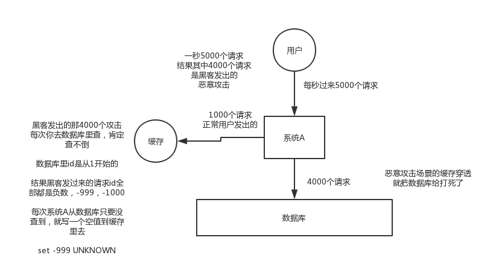

### Redis的应用

1. 对文章排序

文章的存放信息用 hash。

- article:92617
  - title:
  - link:
  - poster: user:83271
  - time
  - votes

时间排序用 zset

- time:
  - atricle:100408   -> 对应的分数： 时间+点赞数量加分

得分排序用 zset

- score:
  - atricle:100408   -> 对应的分数： 时间+点赞数量加分

- voted:100408
    - user:234487


2. 发布并获取文章

文章的id通过对一个全局的 计数器 incr， 创建上面的数据结构

3. 对文章进行分组

对应的分组用 set表示，将对应的文件放入到这个分组里。

后续可以用 交集子类的操作，还可以将 set 作为 有序集合的输入

该分组的set 和 得分排序 zset 进行交集运算，就可以得到新的 排序。


4. 用户信息：hash

- user:1399014
  - login
  - id
  - name
  - followers
  - following
  - posts：发布文章数量
  - signup:注册日期

5. 状态信息

- status:2424218
  - message: 个性签名
  - posted:
  - id
  - uid
  - login

6. 主页时间线

- home:4342379224
  - 文章id

7. 关注着列表

- followers:4342
  - 用户id -> 关注的时间

8. 我关注的列表

9. 发送消息

向关注着发送消息。

### 在项目中缓存是如何使用的

秒杀系统里面有：商品信息、用户token，id、订单、中间变量（判断秒杀是不是已经结束）

> [Redis配置文件详解](https://www.jianshu.com/p/41f393f594e8)

### 为啥在项目里要用缓存呢


高性能和高并发。

高性能：不用每次都查数据库，数据库的复杂查询时间也很慢。

### 用了缓存之后会有啥不良的后果

1. 缓存与数据库双写不一致
1. 缓存雪崩
1. 缓存穿透
1. 缓存并发竞争

### redis和memcached有什么区别

1. redis的数据结构比memcached要多
2. redis可以支持集群

### Redis线程模型

Redis基于Reactor模式开发了`文件事件处理器`

文件事件处理器是由四个部分组成的，他们分别是：套接字、I/O多路复用程序，文件事件分派器，以及事件处理器。

每当一个套接字准备好执行连接应答(accept)、写入、读取、关闭等操作时，就会产生一个文件事件（AE_READABLE, AE_WRITABLE事件）。

I/O多路复用程序负责监听多个套接字，将这些文件事件放到一个队列中去。

文件事件分派器，就从队列中取出这些事件，并交给对应的事件处理器进行处理。（这些处理器是一个个函数）


1. 文件事件：Redis服务器通过`套接字`同客户端进行连接，对套接字`操作`的抽象就是文件事件。服务器通过`监听并处理`这些事件来完成一系列的网络通信操作。
2. 时间事件：Redis服务器中的一些操作需要`在指定时间内完成`，时间事件就是服务器对这类定时`操作的抽象`。
3. IO多路复用程序：是封装 select、epoll、evport、kqueue 这些 IO多路复用程序来实现的。Redis会自动选择性能最高的 IO多路复用程序来作为 Redis的底层实现
4. 事件的类型：
   1. 当套接字可读的时候（客户端对套接字 执行 write， close, accept） 或者 有新的套接字出现的时候（connect），套接字产生 AE_READABLE事件（READ对于服务端来说）。
   2. 当套接字可写的时候（客户端对套接字 执行 read 操作），套接字产生 AE_WRITABLE 事件。
   3. 当一个套接字可写又可读的时候，先执行`读套接字`，再执行`写套接字`
5. 文件事件处理器
   1. 连接应答处理器（AE_READABLE事件）
   2. 命令请求处理器（AE_READABLE事件），
   3. 命令回复处理器（AE_WRITEABLE事件），
   4. 复制处理器

**一次完整的客户端与服务器连接事件实例：**

说的时候，Redis的内存模型 + 事件-对应的事件处理器

1. 假设一个Redis服务器正在运行，那么这个服务器的监听套接字的AE_READABLE事件会与连接应答处理器相关联。
2. 如果说这个时候有一个Redis客户端向服务器发起连接，那么监听套接字将会产生 AE_READABLE事件，IO多路复用程序监听到这个事件，并把它放到队列中，文件事件分派器就会将这个事件交给连接应答处理器进行处理。
3. 连接应答处理器会对用户的连接进行应答，然后创建客户端套接字，将客户端套接字的AE_READABLE事件同命令请求处理器进行关联。
4. 当客户端发送一个请求之后，那么客户端套接字将会产生 AE_READABLE事件，引发命令请求处理器进行处理。
5. 命令请求处理器会读取客户端命令的内容，然后传给相关的程序进行处理。同时的话，将客户端的AE_WRITEABLE事件同命令回复处理器关联起来，当客户端尝试读取命令的时候，触发命令回复处理器执行，当命令回复处理器将命令回复全部写入到套接字之后，服务器就会接触客户端套接字的AE_WRITEABLE事件与命令回复处理器之间的关联。

---

IO多路复用程序：操作系统底层使用select/poll/epoll/kqueue之类的系统调用函数来使用

> 链接：https://www.zhihu.com/question/28594409/answer/52835876

下面举一个例子，模拟一个tcp服务器处理30个客户socket。假设你是一个老师，让30个学生解答一道题目，然后检查学生做的是否正确，你有下面几个选择：1. 第一种选择：按顺序逐个检查，先检查A，然后是B，之后是C、D。。。这中间如果有一个学生卡主，全班都会被耽误。这种模式就好比，你用循环挨个处理socket，根本不具有并发能力。2. 第二种选择：你创建30个分身，每个分身检查一个学生的答案是否正确。 这种类似于为每一个用户创建一个进程或者线程处理连接。3. 第三种选择，你站在讲台上等，谁解答完谁举手。这时C、D举手，表示他们解答问题完毕，你下去依次检查C、D的答案，然后继续回到讲台上等。此时E、A又举手，然后去处理E和A。。。 这种就是IO复用模型，Linux下的select、poll和epoll就是干这个的。将用户socket对应的fd注册进epoll，然后epoll帮你监听哪些socket上有消息到达，这样就避免了大量的无用操作。此时的socket应该采用非阻塞模式。这样，整个过程只在调用select、poll、epoll这些调用的时候才会阻塞，收发客户消息是不会阻塞的，整个进程或者线程就被充分利用起来，这就是事件驱动，所谓的reactor模式。

### 为啥redis单线程模型也能效率这么高

1）`纯内存`操作【相对于MySQL】

2）核心是基于非阻塞的IO多路复用机制

3）单线程反而避免了多线程的频繁上下文切换问题【相对于memcache】

### redis都有哪些数据类型？分别在哪些场景下使用比较合适

1. key-value
2. List：队列、栈
3. Set：交集差集并集
4. Map：对象
5. zSet：排序

### redis的过期策略都有哪些？内存淘汰机制都有哪些？手写一下LRU代码实现

> 定性删除、惰性删除、内存淘汰机制

如果假设你设置一个一批key只能存活1个小时，那么接下来1小时后，redis是怎么对这批key进行删除的？

`定期删除+惰性删除。`

为什么这么做呢？

假设redis里放了10万个key，都设置了过期时间，你每隔几百毫秒，`就检查10万个key`，那redis基本上就死了，cpu负载会很高的，消耗在你的检查过期key上了。redis是每隔100ms`随机抽取一些key`来检查和删除的。【[隔多少时间扫描是通过Hz参数设定的](https://www.cnblogs.com/chenpingzhao/p/5022467.html?utm_source=tuicool&utm_medium=referral)】

并不是key到时间就被删除掉，`而是你查询这个key的时候，redis再懒惰的检查一下`

但是实际上这还是有问题的，如果定期删除漏掉了很多过期key，然后你也没及时去查，也就没走惰性删除，此时会怎么样？如果大量过期key堆积在内存里，导致redis内存块耗尽了，咋整？

答案是：`走内存淘汰机制`。

volatile-lru	从已设置过期时间的数据集中挑选最近最少使用的数据淘汰  
volatile-ttl	从已设置过期时间的数据集中挑选将要过期的数据淘汰  
volatile-random	从已设置过期时间的数据集中任意选择数据淘汰  
allkeys-lru	从所有数据集中挑选最近最少使用的数据淘汰（默认）  
allkeys-random	从所有数据集中任意选择数据进行淘汰  
noeviction	禁止驱逐数据  

> 当使用volatile-lru、volatile-random、volatile-ttl这三种策略时，如果没有key可以被淘汰，则和noeviction一样返回错误

> [leetcode -- LRU算法](https://floatlig.github.io/JavaLearning/#/_source/%E7%AE%97%E6%B3%95/146.LRU%E7%BC%93%E5%AD%98%E6%9C%BA%E5%88%B6)

```java
class LRUCache extends LinkedHashMap<Integer, Integer>{

    private final int capacity;

    //这里就是传递进来的最多能缓存多少数据
    public LRUCache(int capacity) {
        //这块就是设置一个hashmap的初始大小，loadFactor是负载因子，同时最后一个true指按照访问顺序进行排序，
        //最近访问的放在头，最老访问的放在尾
        super(capacity, 0.75f, true);
        this.capacity = capacity;
    }

    @Override
    protected boolean removeEldestEntry(Map.Entry<Integer, Integer> eldest) {
        //这个意思就是说：当map中的数据量大于缓存的这个数，就自动删除最老的数据
        return size() > capacity;
    }
}
```

### Redis如何保证高并发和高可用

> 主从复制 读写分离 + 哨兵

- 首先要明白`Redis高并发`跟`整个系统的高并发`之间的关系：

如果要搞高并发的话，作为缓存功能的Redis一定要搞好，使用`主从复制、读写分离横向拓展Redis,提高QPS，使用哨兵模式，提高Redis的可用性，还是可以使用集群`。

但是真正的高并发的话，除了Redis，MySQL也要进行相应的处理，使用`分库分表`，使用多级缓存架构、热点缓存。

---

- Redis不能支撑高并发的瓶颈在哪里？

一般来说，`单机的Redis` QPS几乎不太可能超过10W+，单机的Redis QPS一般在 1w ~ 几万之间。要达到10W+只有在特殊情况下才能达到，比如说：机器性能特别好，配置特别高，物理机维护做的特别好，而且你的整体操作不是太复杂。

所以，使用主从复制、读写分离用来提高QPS。【大量的请求都是读的，少量请求才是写的】

---

- Redis的Replication的流程

1. 当我们向从服务器发送 `slaveof IP 端口` 命令时，从服务器会先保存这两个值，然后向我们返回OK。接下来进行异步的的复制操作。
2. 建立连向主服务器的套接字。如果能成功连上主服务器的话，那么就会有一个文件事件处理器和这个套接字关联，来处理后续的复制工作。
3. 从服务器向主服务器发送ping命令，如果主服务器响应pong的话，那么就网络正常说明正常，继续工作。
4. 如果从服务器设置了 masterauth选项，那么就进行身份验证。
5. 如果验证通过之后，就进行真正的同步。
6. 从服务器向主服务器发送 PSYNC命令，执行同步操作。
7. 如果说这是从服务器第一次复制，或者从服务器的偏移量没有在复制积压缓存区里面，那么就进行完整同步操作。主服务器会在后台生成一个RDB文件，并使用一个缓冲区记录从现在开始的执行命令。当主服务器将RDB文件发给从服务器后，从服务器根据这个RDB文件进行数据回复。主服务器再将缓存区里的所有写命令再发给从服务器。
8. 接下来就是命令传播状态。主服务器将更新的命令发给从服务器
9. 如果说从服务器的偏移量在复制积压缓冲区里面，那么进行部分同步操作。将还没发送的数据发给从服务器就可以了

主服务器和从服务器都会有一个复制偏移量。
复制积压缓冲区时一个先进先出的队列。默认大小为1MB
在命令传播阶段，每隔一秒会有一个心跳检测。


> <https://juejin.im/post/5cb003e51d456e2b15f5da#heading-0>


---

- 无磁盘化复制

```bash
repl-diskless-sync yes  # 默认为no，master在内存中直接创建rdb，然后发送给slave，不会在自己本地落地磁盘
repl-diskless-sync-delay 5 # 等待一定时长再开始复制，因为要等更多slave重新连接过来
```

---

- master持久化对于主从结构的安全保障和意义：

  1. 如果开启了主从架构，那么建议开启master node持久化，不建议用slave node作为master node的数据热备。如果你关掉master的持久化，可能在master宕机重启的时候是空的，那再经过一次主从复制，slave的数据也丢了。
  2. 详细说明一下，slave数据丢的过程：首先，master的RDB跟AOF都关闭了，就将数据全部存在内存中，那么这个时候，假设master宕机，然后又快速重启，master就没有本地数据可以恢复，mastet就会以为数据是空的，master就会将空的数据同步到slave上面去，这样子所有的slave数据就都被清掉了，造成100%数据丢失。所以master必须做持久化。即使采用哨兵模式，如果sentinal没有检测到master failture，master node就重启了，还是会导致100%数据丢失。
  3. 除此之外，slave node也会做`本地备份`，以防万一，本地数据也丢了

---

- 过期键的处理

slave不会过期键，只会等待master过期key.如果master过期了一个key，或者通过LRU淘汰了一个key，那么会模拟一个del命令发送给slave。

### Redis如何做到99.99%的高可用

首先解释一下，什么叫99.99%的高可用。你的系统，在这一年中99.99%的时间都能对外提供服务，这就叫做高可用。

影响高可用性有很多种情况，以下情况可能会导致你的系统不能对外提供服务，比如：

1. 机器死了，宕机了
2. jvm进程oom了，挂了
3. 机器CPU打满了，不能工作了，hang死了
4. 磁盘突然满了，系统IO报错了，不工作了

Redis在什么情况下会影响高可用？

当Redis使用主从复制时，有一个slave宕机了，是不用影响可用性的，因为这个时候还有其他slave可以顶。

但是如果master宕机了，而且master短时间内恢复不了，这个时候大量的写请求过来，不会打到缓存上，而是直接打到MySQL上，MySQL宕机就完了，不可用了。

所以，当master宕机了，必须能够在短时间内出现另一个master，用来接收写请求。sentinal node哨兵模式，就是用来做这种事的。当一个master宕机了，sentinal会通过选举，将一个slave选举为master，这个过程叫做故障转移（failover，主备切换）

---

- 经典的三节点哨兵模式

一台服务器上运行一个Redis + 哨兵

```
       +----+
       | M1 |
       | S1 |
       +----+
          |
+----+    |    +----+
| R2 |----+----| R3 |
| S2 |         | S3 |
+----+         +----+
```

为什么redis哨兵集群只有1个或2个节点无法正常工作？

如果是一个的话，哨兵down了,如果master 再down了，就完了呀。这不是高可用

如果是两个的话，如果一个服务器宕机了，上面的redis和master都down了，只剩下一台服务器，虽然quorum=1满足，但是majority不满足，也不能主备切换。（2的majority=2，3的majority=2，4的majority=2，5的majority=3）

---

1、两种数据丢失的情况

主备切换的过程，可能会导致数据丢失

（1）异步复制导致的数据丢失

因为master -> slave的复制是异步的，所以可能有部分数据还没复制到slave，master就宕机了，此时这些部分数据就丢失了

（2）脑裂导致的数据丢失

脑裂，也就是说，某个master所在机器突然脱离了正常的网络，跟其他slave机器不能连接，但是实际上master还运行着

此时哨兵可能就会认为master宕机了，然后开启选举，将其他slave切换成了master

这个时候，集群里就会有两个master，也就是所谓的脑裂

此时虽然某个slave被切换成了master，但是可能client还没来得及切换到新的master，还继续写向旧master的数据可能也丢失了

因此旧master再次恢复的时候，会被作为一个slave挂到新的master上去，自己的数据会清空，重新从新的master复制数据

2、解决异步复制和脑裂导致的数据丢失

```bash
min-replicas-to-write 3
min-replicas-max-lag 10
```

要求至少有1个slave，数据复制和同步的延迟不能超过10秒

如果说一旦所有的slave，数据复制和同步的延迟都超过了10秒钟，那么这个时候，master就不会再接收任何请求了

上面两个配置可以减少异步复制和脑裂导致的数据丢失

（1）减少异步复制的数据丢失

有了min-slaves-max-lag这个配置，就可以确保说，一旦slave复制数据和ack延时太长，就认为可能master宕机后损失的数据太多了，那么就拒绝写请求，这样可以把master宕机时由于部分数据未同步到slave导致的数据丢失降低的可控范围内

（2）减少脑裂的数据丢失

如果一个master出现了脑裂，跟其他slave丢了连接，那么上面两个配置可以确保说，如果不能继续给指定数量的slave发送数据，而且slave超过10秒没有给自己ack消息，那么就直接拒绝客户端的写请求

这样脑裂后的旧master就不会接受client的新数据，也就避免了数据丢失

上面的配置就确保了，如果跟任何一个slave丢了连接，在10秒后发现没有slave给自己ack，那么就拒绝新的写请求

因此在脑裂场景下，最多就丢失10秒的数据

如果有大量数据涌进来怎么办？

一般来说，会在client做`降级`，写到本地磁盘里面，在client对外接收请求的请求，再做降级，`做限流`，减慢请求涌入的速度。或者client可能会采取将数据临时`灌入一个Kafka消息队列`，每个10分钟去队列里面取一次，尝试重新发挥master。

1、sdown和odown转换机制

sdown和odown两种失败状态

sdown是主观宕机，就一个哨兵如果自己觉得一个master宕机了，那么就是主观宕机

odown是客观宕机，如果quorum数量的哨兵都觉得一个master宕机了，那么就是客观宕机

sdown达成的条件很简单，如果一个哨兵ping一个master，超过了is-master-down-after-milliseconds指定的毫秒数之后，就主观认为master宕机

sdown到odown转换的条件很简单，如果一个哨兵在指定时间内，收到了quorum指定数量的其他哨兵也认为那个master是sdown了，那么就认为是odown了，客观认为master宕机

2、哨兵集群的自动发现机制

哨兵互相之间的发现，是通过redis的pub/sub系统实现的，每个哨兵都会往__sentinel__:hello这个channel里发送一个消息，这时候所有其他哨兵都可以消费到这个消息，并感知到其他的哨兵的存在

每隔两秒钟，每个哨兵都会往自己监控的某个master+slaves对应的__sentinel__:hello channel里发送一个消息，内容是自己的host、ip和runid还有对这个master的监控配置

每个哨兵也会去监听自己监控的每个master+slaves对应的__sentinel__:hello channel，然后去感知到同样在监听这个master+slaves的其他哨兵的存在

每个哨兵还会跟其他哨兵交换对master的监控配置，互相进行监控配置的同步

3、slave配置的自动纠正

哨兵会负责自动纠正slave的一些配置，比如slave如果要成为潜在的master候选人，哨兵会确保slave在复制现有master的数据; 如果slave连接到了一个错误的master上，比如故障转移之后，那么哨兵会确保它们连接到正确的master上

4、slave->master选举算法

如果一个master被认为odown了，而且majority哨兵都允许了主备切换，那么某个哨兵就会执行主备切换操作，此时首先要选举一个slave来

会考虑slave的一些信息

（1）跟master断开连接的时长
（2）slave优先级
（3）复制offset
（4）run id

如果一个slave跟master断开连接已经超过了down-after-milliseconds的10倍，外加master宕机的时长，那么slave就被认为不适合选举为master

(down-after-milliseconds * 10) + milliseconds_since_master_is_in_SDOWN_state

接下来会对slave进行排序

（1）按照slave优先级进行排序，slave priority越低，优先级就越高
（2）如果slave priority相同，那么看replica offset，哪个slave复制了越多的数据，offset越靠后，优先级就越高
（3）如果上面两个条件都相同，那么选择一个run id比较小的那个slave

5、quorum和majority

每次一个哨兵要做主备切换，首先需要quorum数量的哨兵认为odown，然后选举出一个哨兵来做切换，这个哨兵还得得到majority哨兵的授权，才能正式执行切换

如果quorum < majority，比如5个哨兵，majority就是3，quorum设置为2，那么就3个哨兵授权就可以执行切换

但是如果quorum >= majority，那么必须quorum数量的哨兵都授权，比如5个哨兵，quorum是5，那么必须5个哨兵都同意授权，才能执行切换

6、configuration epoch

哨兵会对一套redis master+slave进行监控，有相应的监控的配置

执行切换的那个哨兵，会从要切换到的新master（salve->master）那里得到一个configuration epoch，这就是一个version号，每次切换的version号都必须是唯一的

如果第一个选举出的哨兵切换失败了，那么其他哨兵，会等待failover-timeout时间，然后接替继续执行切换，此时会重新获取一个新的configuration epoch，作为新的version号

7、configuraiton传播

哨兵完成切换之后，会在自己本地更新生成最新的master配置，然后同步给其他的哨兵，就是通过之前说的pub/sub消息机制

这里之前的version号就很重要了，因为各种消息都是通过一个channel去发布和监听的，所以一个哨兵完成一次新的切换之后，新的master配置是跟着新的version号的

其他的哨兵都是根据版本号的大小来更新自己的master配置的

### Redis持久化的意义

redis持久化的意义，在于`故障恢复`。如果通过持久化将数据搞一份儿在磁盘上去，然后定期比如说同步和备份到`一些云存储服务上去`，那么就可以保证数据不丢失全部，还是可以恢复一部分数据回来的

AOF,RDB持久化：

如果我们想要redis仅仅作为`纯内存的缓存`来用，那么可以禁止RDB和AOF所有的持久化机制

通过RDB或AOF，都可以将redis内存中的数据给`持久化到磁盘上面来`，然后可以将这些数据备份到别的地方去，比如说阿`里云，云服务`

如果redis挂了，服务器上的内存和磁盘上的数据都丢了，可以从云服务上拷贝回来之前的数据，放到指定的目录中，然后重新启动redis，redis就会自动根据持久化数据文件中的数据，去恢复内存中的数据，继续对外提供服务

如果同时使用`RDB和AOF两种持久化机制，那么在redis重启的时候，会使用AOF来重新构建数据，因为AOF中的数据更加完整`

2、RDB持久化机制的优点

（1）RDB对redis对外提供的读写服务，影响非常小，`可以让redis保持高性能`，因为redis主进程只需要fork一个子进程，让子进程执行磁盘IO操作来进行RDB持久化即可

（2）RDB会生成多个数据文件，每个数据文件都代表了某一个时刻中redis的数据，这种多个数据文件的方式，非常适合`做冷备`，可以将这种完整的数据文件发送到一些远程的安全存储上去，比如说Amazon的S3`云服务`上去，在国内可以是阿里云的ODPS分布式存储上，以预定好的备份策略来定期备份redis中的数据

（3）相对于AOF持久化机制来说，直接基于`RDB数据文件来重启和恢复redis进程，更加快速`

3、缺点

可能会造成太多的数据丢失。RDB数据备份的时间：

```text
save 900 1
save 300 10
save 60 10000
```

4、AOF的优点

AOF可以更好的保护数据不丢失，一般AOF会每隔1秒，通过一个后台线程执行一次`fsync操作`，最多丢失1秒钟的数据

5、AOF的缺点

1. 对于同一份数据来说，AOF日志文件通常比RDB数据`快照文件更大`
2. AOF开启后，支持的写QPS会比RDB支持的写QPS低

AOF的rewrite：如果AOF的文件过大，会再次根据Redis内存中的数据，在生成新的AOF文件。

6、总和选择

用AOF来保证数据不丢失，作为数据恢复的第一选择; 用RDB来做不同程度的冷备，在AOF文件都丢失或损坏不可用的时候，还可以使用RDB来进行快速的数据恢复

### 了解什么是redis的雪崩和穿透，如何解决

雪崩就是某些情况下Redis全部失效，大量的数据打在数据库上。

穿透是恶意用户攻击数据库，使用大量数据库没有的key，绕过redis，查询数据库

**缓存雪崩的事前事中事后的解决方案：**

1. Redis一定要做高可用，使用主从复制、读写分离，再加上哨兵模式
2. Redis要做持久化，以便在Redis挂掉之后可以快速的恢复
3. 系统层面，可以使用ehcache小缓存，同时使用hystrix限流


**穿透的解决方案：**

1. 查询数据库，查询不到数据也在缓存中设置空值
2. 布隆过滤器



### 布隆过滤器

**布隆过滤器：**


布隆过滤器的本质上是“位(bit)数组”。当一个元素加入布隆过滤器的时候，会进行如下操作：

1. 使用布隆过滤器中的哈希函数对元素值进行计算，得到哈希值（有几个哈希函数就有几个哈希值）。假设元素经过布隆过滤器计算后的值为10
2. 假设布隆过滤器的位数组为bf[], 根据得到的哈希值10，将`bf[10]`置为1

当我们需要判断一个元素是否存在于布隆过滤器的时候，会进行如下操作：

1. 对给定元素再次进行相同的哈希计算
2. 得到值之后判断位数组中的每个元素是否都为1，如果都为1，那么说明这个值可能在布隆过滤器中，运行通过。如果为0，说明这个元素一定不在布隆过滤器中，不允许通过。

> <https://github.com/Snailclimb/JavaGuide/blob/master/docs/dataStructures-algorithms/data-structure/bloom-filter.md>

使用Google

```java

        <dependency>
            <groupId>com.google.guava</groupId>
            <artifactId>guava</artifactId>
            <version>28.0-jre</version>
        </dependency>
```
```java
        // 创建布隆过滤器对象
        BloomFilter<Integer> filter = BloomFilter.create(
                Funnels.integerFunnel(),
                1500,
                0.01);
        // 判断指定元素是否存在
        System.out.println(filter.mightContain(1));
        System.out.println(filter.mightContain(2));
        // 将元素添加进布隆过滤器
        filter.put(1);
        filter.put(2);
        System.out.println(filter.mightContain(1));
        System.out.println(filter.mightContain(2));
```

Redis中

```bash
127.0.0.1:6379> BF.ADD myFilter java
(integer) 1
127.0.0.1:6379> BF.ADD myFilter javaguide
(integer) 1
127.0.0.1:6379> BF.EXISTS myFilter java
(integer) 1
127.0.0.1:6379> BF.EXISTS myFilter javaguide
(integer) 1
127.0.0.1:6379> BF.EXISTS myFilter github
(integer) 0
```

### 数据库缓存不一致

我们设计任何架构方案，都要围绕着业务，如果业务能够接受可以不解决；其实很多互联网产品都有短时间的数据不一致问题。如：58同城，美团，贴吧等。

我感觉秒杀系统，没有严格要求数据库跟缓存的数据要绝对一致，在Redis中超卖几个应该没有问题。因为后面还有`一个MQ`，同时数据库SQL在更新的时候，也会加上`> 0`。如果加锁的话，效率会降低。

### Redis并发竞争如何解决呢

Redis的分布式锁虽然可以用，但是zookeeper更常用。 + 时间戳


### 其他

但是如果你掌握好了这套东西的回答，那么你在面试的时候，如果面试官没有全都问到，你可以自己主动合盘脱出。比如你可以说，我们线上的缓存，做了啥啥机制，防止雪崩、防止穿透、保证双写时的数据一致性、保证并发竞争时的数据一致性，我们线上咋部署的，啥架构，怎么玩儿的。这套东西你可以自己说出来，展示一下你对缓存这块的掌握。

