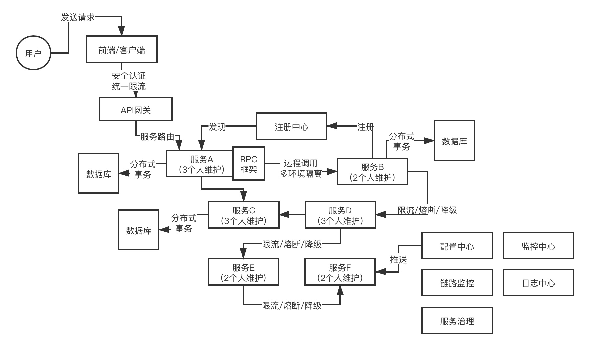
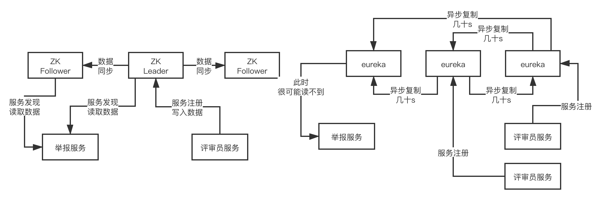
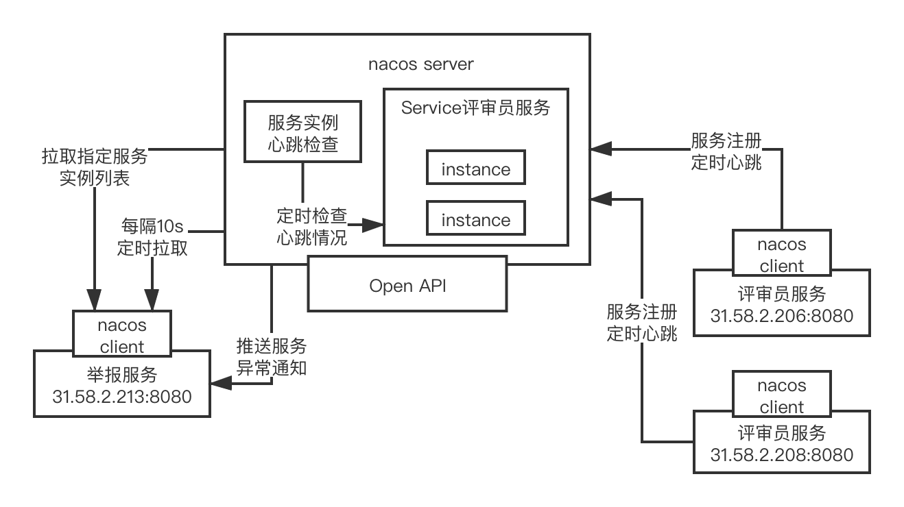
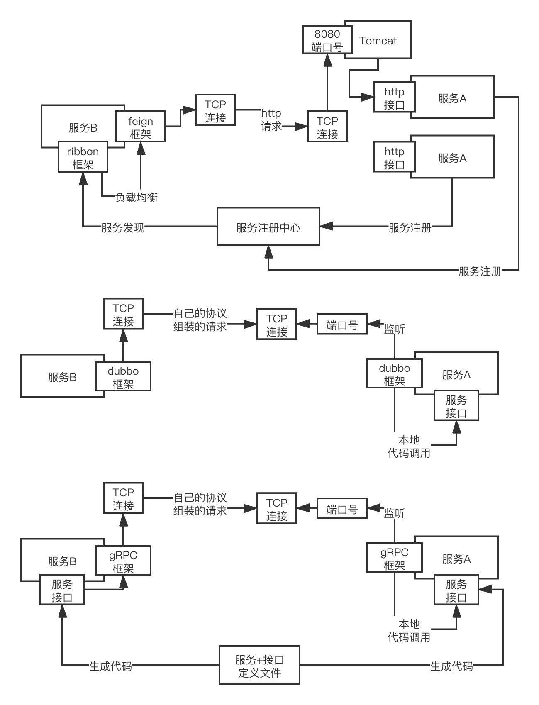

### 初识微服务

在没有出现微服务之前，项目都是单块系统。单块系统有一些痛点：一个大型的项目需要多人进行协作，在协作中难免会有代码冲突、需要多次回归测试，这些无生产价值的步骤在项目上线前显得尤其致命，使得项目的迭代很慢。

在微服务初期，国内的公司都自研了一些组件，将大型的项目拆成多个服务，降低项目的耦合度。

国外的公司的公司也是有自研一些组件，但是后来有一个 netflix 的公司，将这些组件开源出来，在国外的影响力很大，也被整合到 Spring 社区。

早期的微服务 Spring Cloud Netflix 组件，是以eureka、feign+ribbon、zuul、hystrix，用zipkin和sleuth做链路监控，stream做消息中间件集成，contract做契约测试支持，当然gateway也可以做网关，consul也是一种注册中心，还有跟spring security配合的安全认证，跟k8s配合的容器支持。

两三年前，阿里开源的 dubbo 社区不怎么维护，加上 Spring Cloud 完善的技术冲击进来，国内大部分中小型公司都开始拥抱 Spring Cloud Netflix。

但是在一年前，阿里的 Dubbo 社区开始活跃，同时把自己的微服务技术融入 Spring，形成了 Spring Cloud Aalibaba，也就是以nacos、dubbo、seata、sentinal、rocketmq等技术为核心的一套技术体系。

国内前天互联网公司也开源了不少优秀的项目，比如说携程开源的apollo（spring cloud config），大众点评开源的CAT（zipkin、slueth），加上其他国外的优秀开源项目，比如Prometheus，ELK，Spring Cloud Gateway，等等，可以组成一套全新的以国内开源技术为核心的微服务体系。

与此同时，Spring Cloud Netflix 社区渐渐的也不怎么活跃。

于是中小公司开始进行分化，有部分公司还是spring cloud netflix为主的一套技术栈，有少部分公司开始尝试推行spring cloud alibaba技术栈+国内开源的组件（apollo、CAT）+ Prometheus + ELK + Spring Cloud Gateway（Nginx+lua、Kong、Zuul、API网关自研）

---

但是无论如何，微服务的模块是类似的，微服务几个重要的模块为：

    

1. 注册中心：ZooKeeper、Consul、Eureka和Nacos
2. RPC框架
3. API网关
4. 限流/熔断/降级
5. 配置中心
6. 监控中心
7. 链路监控
8. 日志中心
9. 服务治理
10. 分布式事务
11. 自动化部署
12. 多隔离环境

### 服务注册中心选型对比

常见的服务注册中心有：zookeeper、eureka、consul、nacos

之前用的比较多的是zookeeper和eureka，consul用的没那么多，现在nacos用的越来越多，以后也会是一个大的趋势，但是现在可能还没那么的普及。

    

zookeeper的原理，leader+follower，leader写，同步到follower，follower可以读，保证顺序一致性，就是基本尽量保证到数据一致的，主动推送，典型的CP，leader崩溃的时候，为了保证数据一致性，尽量不要读到不一致的数据，此时要重新选举leader以及做数据同步，此时集群会短暂的不可用，CP

服务注册中心选型对比的时候，其他的分布式系统选型的时候，CP，AP

P简单来说就是任何分布式系统一般都会满足，他就是分区容错性；CP，C，一致性，尽可能的去保证你读取到的数据是一致的，牺牲掉一个A，可用性，一旦leader崩溃，zk可能会有一个短时间内，几十s有可能，集群不可用，此时需要重新选举一个leader，然后再做数据同步，保证数据一致性之后再开放让你来读取 

consistency，availability

eureka的原理，peer-to-peer，大家都能写也都能读，每个节点都要同步给其他节点，但是是异步复制的，所以随时读任何一个节点，可能读到的数据都不一样，任何一个节点宕机，其他节点正常工作，可用性超高，但是数据一致性不行，AP

Consul也是基于raft算法的CP模型

Nacos也是基于raft算法的CP模型，同时也支持配置成类似eureka的AP

其实CP或者AP也都行，CP就是偶尔可能短时间不可用，AP就是可能数据不一致，两个都有问题，但是在生产环境下，无论CP还是AP其实都用的很多

其实说白了，zk作为注册中心是早期dubbo时代的标配；后续spring cloud进入国内市场，大家就都用eureka了，但是spring cloud也推荐了consul，所以consul也有不少人在用，zk、eureka、consul，其实都有人用

但是未来还是建议大家用nacos，因为nacos的功能最为完善，包括了雪崩保护、自动注销实例、监听支持、多数据中心、跨注册中心同步、spring cloud集成、dubbo集成、k8s集成，这些都支持，其他的几个技术基本都支持部分罢了。

### Nacos注册中心架构原理

    

服务通过nacos server内部的open api进行服务注册，nacos server内部有一个sevice服务的概念，里面有多个instance实例的概念，同时对不同的service服务可以划归到不同的namespace命名空间下去

namespace可以是一个技术团队，比如说一个技术团队，业务A的技术团队所有的服务都放在一个namespace命名空间下面，业务B的技术团队所有的服务都放在另外一个namespace命名空间

其实说白了，注册的时候就是在注册表里维护好每个服务的每个实例的服务器地址，包括ip地址和端口号，这是最为关键的

而且一旦注册成功之后，服务就会跟nacos server进行定时的心跳，保持心跳是很关键的，nacos server会定时检查服务各个实例的心跳，如果一定时间没心跳，就认为这个服务实例宕机了，就从注册表里摘除了

其他服务会从nacos server通过open api查询要调用的服务实例列表，而且nacos客户端会启动一个定时任务，每隔10s就重新拉取一次服务实例列表，这样如果调用的服务有上线或者下线，就能很快感知到了

此外还可以对要调用的服务进行监听，如果有异常变动会由nacos server反向通知他

nacos本身的话，其实是完全可以脱离spring cloud自己独立运作的，但是他目前是集成到spring cloud alibaba里去的，也就是在spring cloud的标准之下实现了一些东西，spring cloud自己是有一个接口，叫做ServiceRegistry，也就是服务注册中心的概念

他是一个接口，nacos是实现了一个实现类的，也就是NacosServiceRegistry，实现了register、deregister、close、setStatus、getStatus之类的方法

自动装配是一个spring boot的一个概念，如果大家不理解的话，可以自行搜索一些资料去查阅，用最最简单的话来说，自动装配的意思，其实就是说系统启动的时候，自动装配机制会运行，实现一些系统的初始化、自动做一些事儿

比如说spring cloud alibaba，假设用dubbo开发服务，本质上是有一个自动装配类的，这个自动装配类会监听spring的ApplicationStartedEvent这个事件，其实简单理解就是服务启动的时候通过spring的一些动作，监听到某个事件就自动运行了

自动运行，就是去调用NacosServiceRegistry的register方法去进行服务注册

而且除了注册之外，还会通过schedule线程池去提交一个定时调度任务，源码如下：

this.exeutorService.schedule(new BeatReactor.BeatTask(beatInfo), beatInfo.getPeriod(), TimeUnit.MILLISECONDS)，这就是一个心跳机制，定时发送心跳给nacos server

接着会进行注册，注册的话是访问nacos server的open api，其实就是http接口，他有一个接口：<http://31.208.59.24:8848/nacos/v1/ns/instance?serviceName=xx&ip=xx&port=xx>，这么一个东西，也没什么特别的，这里就是访问注册接口罢了

nacos server那里是基于一个ConcurrentHashMap作为注册表来放服务信息的，直接会构造一个Service放到map里，然后对Service去addInstance添加一个实例，本质里面就是在维护信息，同时还会建立定时检查实例心跳的机制

最后还会基于一致性协议，比如说raft协议，去把注册同步给其他节点

服务发现的本质其实也是一个http接口，就是：
<http://31.208.59.24:8848/nacos/v1/ns/instance/list?serviceName=xx>，就这么一个接口，其实也没特别的东西，然后就会启动定时任务，每隔10s拉取一次最新的实例列表，然后服务端还会监听他监听服务的状态，有异常就会基于UDP协议反向通知客户端这次服务异常变动

### RPC框架选型对比

Feign+Ribbon、Dubbo、gRPC的选型对比

    

feign+ribbon，是属于spring cloud netflix技术栈。RPC调用，用的就是feign框架+ribbon做负载均衡，暴露出来的服务接口，就是最最稀松平常的基于spring mvc写的controller暴露出来的一些http接口，定义一个http的url地址

通过feign框架进行RPC调用：String result = serviceA.hello(name)，会按照http协议来组装你的请求数据，数据格式都是按照**http协议**里的请求来做的，http请求还还必须做一个序列化，序列化成二进制的字节流，通过底层的tcp连接发送过去

本质上服务A的部署是基于tomcat去进行部署的，tomcat会监听你指定的端口号，当别人要发送http请求给你的时候，首先必须跟tomcat建立tcp网络连接，发送http请求给tomcat，tomcat收到之后，解析出来这个http请求，交给你的spring mvc写的controller来进行处理

dubbo自己使用的一套协议，自定义协议，也可以是别的协议，肯定不是http协议，去组装请求数据，然后做一个序列化，二进制字节数组或者是字节流，都可以，通过底层的网络连接把请求数据发送过去就可以了

ServiceA这个类，调用他里面的hello()这个方法，传入name这个参数，获取result这个返回值，然后通过网络连接把响应数据按照自己的协议封装，序列化，通过网络连接发送给服务B就可以了

**dubbo的工作原理：**

第一层：service层，接口层，给服务提供者和消费者来实现  
第二层：config层，配置层，主要是对 dubbo 进行各种配置的  
第三层：proxy层，服务代理层，透明生成客户端的 stub 和服务单的 skeleton  
第四层：registry层，服务注册层，负责服务的注册与发现  
第五层：cluster层，集群层，封装多个服务提供者的路由以及负载均衡，将多个实例组合成一个服务  
第六层：monitor层，监控层，对 RPC 接口的调用次数和调用时间进行监控  
第七层：protocol层，远程调用层，封装 RPC 调用  
第八层：exchange层，信息交换层，封装请求响应模式，同步转异步  
第九层：transport层，网络传输层，抽象 mina 和 netty 为统一接口  
第十层：serialize层，数据序列化层  

工作流程：

1. 第一步：provider 向注册中心去注册
2. 第二步：consumer 从注册中心订阅服务，注册中心会通信 consumer 注册号服务
3. 第三步：consumer 调用 provider
4. 第四步：consumer 和 provider 都异步的通知监控中心

注册中心挂了，可以继续通信吗？

可以，因为注册中心初始化的时候，消费者会将提供者的地址等信息拉去到本地缓存，所以注册中心挂了可以继续通信

### Dubbo架构原理

**dubbo 支持什么序列化协议:**

1. dubbo 协议

默认就是走 dubbo 协议的，单一长连接， NIO 异步通信，基于 hessian 作为序列化协议。

适用的场景就是：传输数据量小（每次请求在100KB 以内），但是并发量很高

2. rmi协议

走java二进制序列化，多个短连接，适合消费者和提供者数量差不多，适用于文件的传输，一般较少用

3. hessian协议

走hessian序列化协议，多个短连接，适用于提供者数量比消费者数量还多，适用于文件的传输，一般较少用

4. http协议

走json序列化

5. webservice

走SOAP文本序列化

**dubbo负载均衡策略:**

1）random loadbalance

默认情况下，dubbo是random load balance随机调用实现负载均衡，可以对provider不同实例设置不同的权重，会按照权重来负载均衡，权重越大分配流量越高，一般就用这个默认的就可以了。

2）roundrobin loadbalance

还有roundrobin loadbalance，这个的话默认就是均匀地将流量打到各个机器上去，但是如果各个机器的性能不一样，容易导致性能差的机器负载过高。所以此时需要调整权重，让性能差的机器承载权重小一些，流量少一些。

跟运维同学申请机器，有的时候，我们运气，正好公司资源比较充足，刚刚有一批热气腾腾，刚刚做好的一批虚拟机新鲜出炉，配置都比较高。8核+16g，机器，2台。过了一段时间，我感觉2台机器有点不太够，我去找运维同学，哥儿们，你能不能再给我1台机器，4核+8G的机器。我还是得要。

3）leastactive loadbalance

这个就是自动感知一下，如果某个机器性能越差，那么接收的请求越少，越不活跃，此时就会给不活跃的性能差的机器更少的请求

4）consistanthash loadbalance

一致性Hash算法，相同参数的请求一定分发到一个provider上去，provider挂掉的时候，会基于虚拟节点均匀分配剩余的流量，抖动不会太大。如果你需要的不是随机负载均衡，是要一类请求都到一个节点，那就走这个一致性hash策略。

（2）dubbo集群容错策略

1）failover cluster模式

失败自动切换，自动重试其他机器，默认就是这个，常见于读操作

2）failfast cluster模式
一次调用失败就立即失败，常见于写操作

3）failsafe cluster模式

出现异常时忽略掉，常用于不重要的接口调用，比如记录日志

4）failbackc cluster模式

失败了后台自动记录请求，然后定时重发，比较适合于写消息队列这种

5）forking cluster

并行调用多个provider，只要一个成功就立即返回

6）broadcacst cluster

逐个调用所有的provider

