## 一.项目介绍

### 1.项目背景

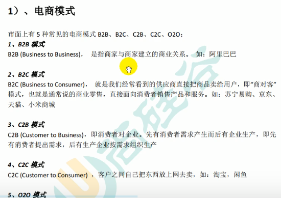


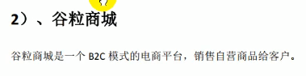

### 2.项目架构图

#### 1.项目微服务架构图


#### 2.微服务划分图

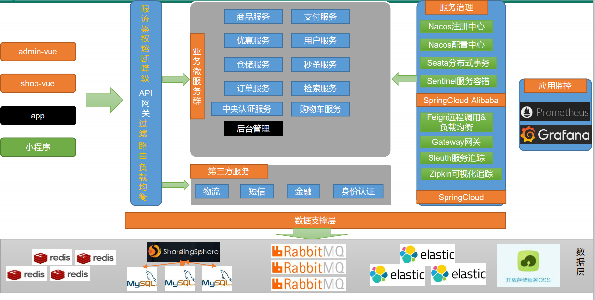

### 3.项目技术特色

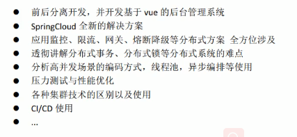

### 4.项目前置要求

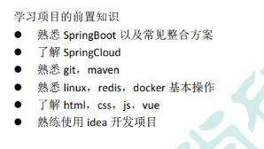

## 二.分布式基础概念

### 1.微服务


### 2.集群&分布式&节点

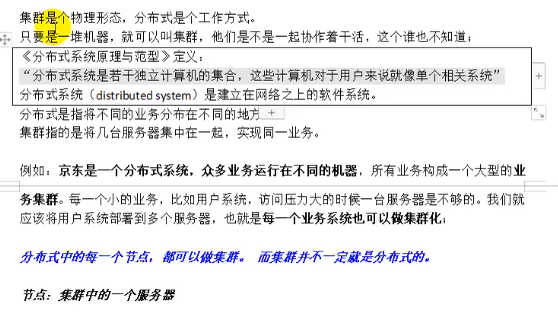

### 3.远程调用

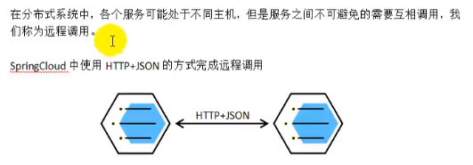

### 4.负载均衡

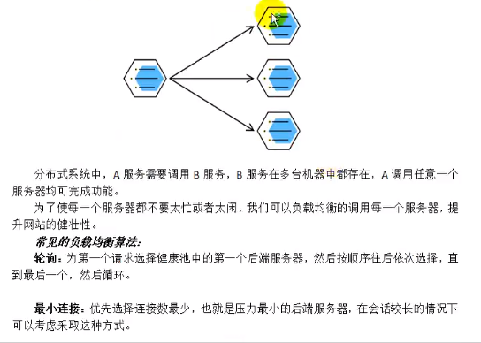


### 5.服务注册/发现&注册中心

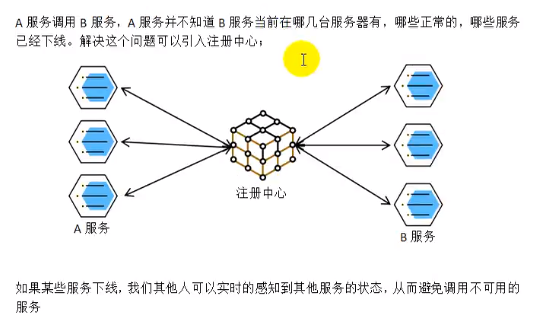

### 6.配置中心

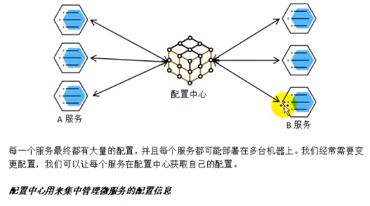

### 7.服务熔断&服务降级

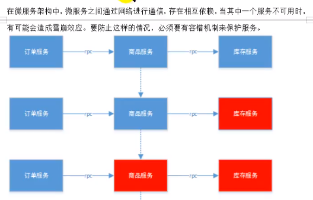

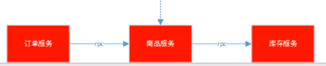

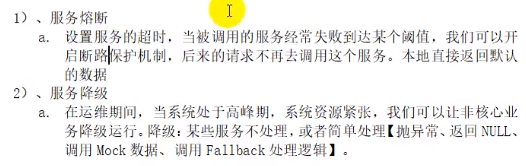

### 8.API网关

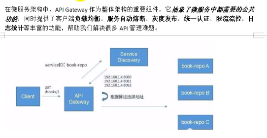

## 三.环境搭建

### 1.安装linux虚拟机

#### Virtualbox

<https://download.virtualbox.org/virtualbox/6.0.12/VirtualBox-6.0.12-133076-Win.exe>

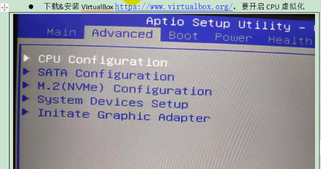


#### Vagrant

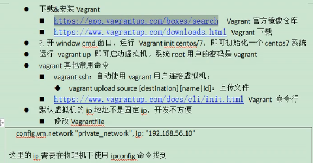

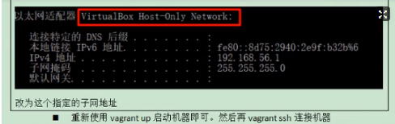

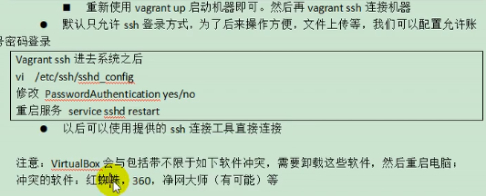

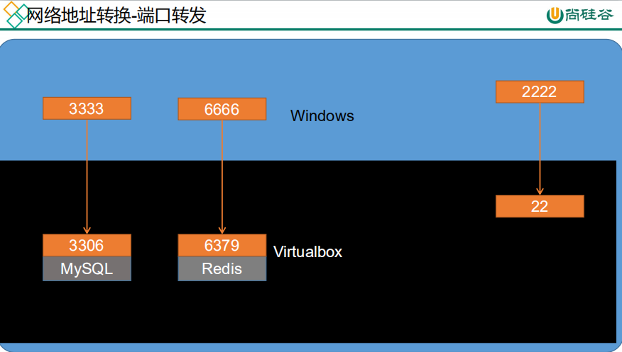

扒拉都的关于vagrant  <https://blog.csdn.net/yjk13703623757/article/details/70040797>

```shell
## 在cmd中操作
## 在我电脑上vagrant实际操作响应速度很慢,shit
## 使用vagrant reload 修改完ip 就启用vagrant了


vagrant
##快速安装centOS7  不过只是先创建了一个配置文件
vagrant init centos/7
##启动; 如果没有安装会先安装
##这一步可能因为防火长城下载极慢,扒拉了一下
##参考了 https://blog.csdn.net/yjk13703623757/article/details/70040797 找到如下快速方案
##根据安装时的log,实际是去 
## https://vagrantcloud.com/centos/boxes/7/versions/2004.01/providers/virtualbox.box
##下载文件了,用迅雷p2p加速很快就下好了,然后使用 vagrant box add {title虚拟机名} {url本地文件路径}
##导入box即可 例如 vagrant box add centos/7 C:\Users\MoMing\Desktop\CentOS-7-x86_64-Vagrant-2004_01.VirtualBox.box
##然后在 init ; up  就好了
vagrant up

!!! ==>> 启动后出现default folder:/cygdrive/c/User/… =>/vagrant。然后ctrl+c退出

##默认创建两个用户 root 和 vagrant, 密码都是vagrant
vagrant ssh
whoami
```

不过他使用的网络方式是**网络地址转换NAT（端口转发）**，如果其他主机要访问虚拟机，必须由windows端口如3333断发给虚拟机端口如3306。这样每在linux里安一个软件都要进行端口映射，不方便，（也可以在virualBox里挨个设置）。我们想要给虚拟机一个固定的ip地址，windows和虚拟机可以互相ping通。方式1是在虚拟机中配置静态ip。也可以更改Vagrantfile更改虚拟机ip，修改其中的`config.vm.network "private_network",ip:"192.168.56.10"`，这个ip需要在windows的ipconfig中查到vitualbox的网卡ip，然后更改下最后一个数字就行（不能是1）。配置完后重启虚拟机。在虚拟机中`ip addr`就可以查看到地址了。互相ping也能ping通。

!> 或许我可以使用桥接模式？


```shell
##网络配置
##修改C:\Users\MoMing\Vagrantfile; 这里的ip要在物理机下用 ipconfig查看 VirtualBox Host-Only Network 的在一个网段
## 假设在Windows上看到Virtual Box的IP地址为 192.168.56.1
## 那么在 Vagrantfile文件中， 前24位要相同，即“192.168.56”要相同。config.vm.network "private_network", ip:"192.168.56.10"
## 重启让ip生效
vagrant reload

##默认只能在cmd下ssh登录,可以配置ssh使得可以远程登录
sudo vi /etc/ssh/sshd_config
## 按照上边文档上是修改 PasswordAuthentication yes/no
## 实际操作应该是
## 修改 PasswordAuthentication yes 去掉#注释
## 修改 PermitRootLogin yes 去掉#注释
service sshd restart
## 这个是centos7之前的重启服务命令,应该是装了什么工具让它在7上也能运行,7开始的命令应该是 systemctl restart sshd

##教程里用的xshell,我更推荐用MobaXterm 工具用着合规舒服就成
```


### 2.安装docker

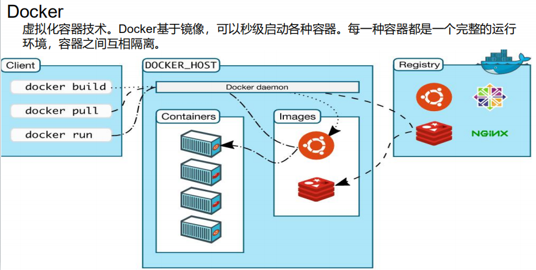


Docker 安装文档:  <https://docs.docker.com/engine/install/centos/>  

配置Docker 阿里云镜像加速： <https://cr.console.aliyun.com/cn-hangzhou/instances/mirrors>

**
**

**docker run -d:**

**->** -d 以后台方式运行


跟着官网教程走,和视频里略不一样


1.卸载系统之前的docker

```shell
## ----------------------------------docker安装--------------------------------------

## Uninstall old versions 卸载旧版本
sudo yum remove docker \
                  docker-client \
                  docker-client-latest \
                  docker-common \
                  docker-latest \
                  docker-latest-logrotate \
                  docker-logrotate \
                  docker-engine

## 安装需要的工具
sudo yum install -y yum-utils
## SET UP THE REPOSITORY 设置仓库
sudo yum-config-manager \
    --add-repo \
    https://download.docker.com/linux/centos/docker-ce.repo

## INSTALL DOCKER ENGINE 安装docker
sudo yum install docker-ce docker-ce-cli containerd.io

## start docker 启动docker服务
sudo systemctl start docker
## HelloWorld 确认docker正确安装运行
sudo docker run hello-world

## 设置docker开机自启动
sudo systemctl enable docker

## ----配置阿里云镜像; 需要登录阿里云搜索 容器镜像服务-镜像加速器 免费开通
sudo mkdir -p /etc/docker
sudo tee /etc/docker/daemon.json <<-'EOF'
{
    "registry-mirrors": ["https://每个人不同.mirror.aliyuncs.com"]
}
EOF
## 重启后台线程
sudo systemctl daemon-reload
## 重启docker
sudo systemctl restart docker
## ----配置阿里云镜像结束


## -----------------------------docker使用---------------------------------
docker -v
docker images
docker info
##查看运行中(所有)容器
docker ps
docker ps -a
##启动/停止/重启/自启 容器
docker start xx
docker stop xx
docker restart xx
docker update xx --restart=always
```

**本机 MySQL 连接 不通虚拟机的  MySQL:**

1. 尝试从全局角度出发，看看能不能解决问题。 

   1. vagrant 类似于 xshell + virtual box (vagrantfile 可以进行硬件，比如网络的配置)
   2. virtual box 提供虚拟机， virtual box 中的 docker 也类似于 虚拟机的作用

2. 通过 terminal ping virtual box虚拟机的MySQL发现 ping 不通， 同时在 virtual box 和 win 下查看 虚拟机的IP地址，发现两者的IP地址不一样，**说明IP地址经过转换（或者是DHCP变化**），所以在　win 下ping 不通，因为没有找到真正的IP地址。
3. 解决方式1，修改 vagrantfile，并且通过 vagrant重新启动（注意，一定要重新启动）， 解决方式2，在virtual box中配置静态IP地址

### 3.docker安装mysql


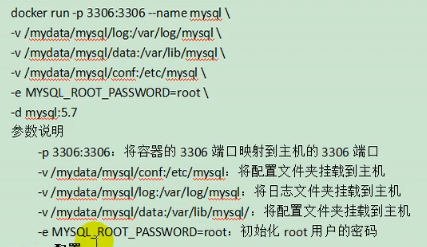

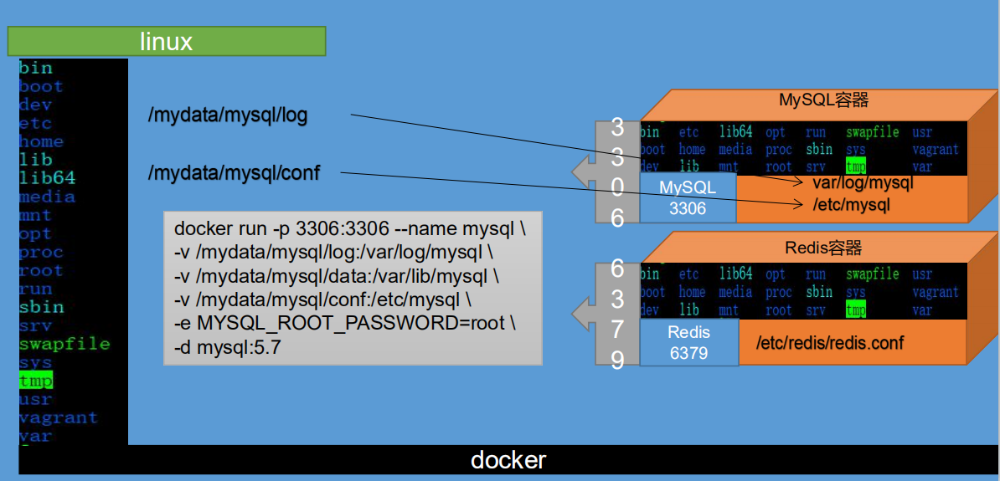

```shell
## --------------------------------MySQL安装-------------------------

## 下载镜像文件
sudo docker pull mysql:5.7
sudo docker images

##vagrant的root用户密码也是vagrant
su root

## 创建实例并安装
## Docker run 命令详解 https://www.cnblogs.com/yfalcon/p/9044246.html
docker run -p 3306:3306 --name mysql \
-v /mydata/mysql/log:/var/log/mysql \
-v /mydata/mysql/data:/var/lib/mysql \
-v /mydata/mysql/conf:/etc/mysql \
-e MYSQL_ROOT_PASSWORD=root \
-d mysql:5.7

##查看运行中容器
docker ps

## 容器内部
docker exec -it mysql /bin/bash
whereis mysql
exit

## -------------------------MySQL配置--------------------------
## mysql配置;创建并编辑
vi /mydata/mysql/conf/my.cnf

## 插入以下内容并保存

[client]
default-character-set=utf8

[mysql]
default-character-set=utf8

[mysqld]
init_connect='SET collation_connection = utf8_unicode_ci'
init_connect='SET NAMES utf8'
character-set-server=utf8
collation-server=utf8_unicode_ci
skip-character-set-client-handshake
skip-name-resolve

## 插入内容结束
## 重启mysql;然后可以使用SQLyog之类外部连接
docker restart mysql


## 查看在docker容器中，新增加的配置文件在不在
docker exec -it mysql /bin/bash
whereis mysql
cd /etc/mysql
cat myconf
```


### 4.docker安装redis

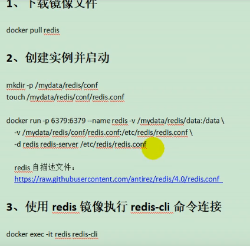


```shell
## ----------------------安装redis------------------------------

##拉取镜像
docker pull redis

## 预先创建文件
mkdir -p /mydata/redis/conf
touch /mydata/redis/conf/redis.conf

docker run -p 6379:6379 --name redis \
-v /mydata/redis/data:/data \
-v /mydata/redis/conf/redis.conf:/etc/redis/redis.conf \
-d redis redis-server /etc/redis/redis.conf
## [最后的-d是指：读取redis.conf配置文件的方式启动redis-server]

docker ps

## -------------------------连接redis--------------
## 使用redis镜像执行redis -cli 命令连接
docker exec -it redis redis-cli

exit

## -----------配置redis---------------------
## 配置持久化redis
vi /mydata/redis/conf/redis.conf

##插入下面这行内容
appendonly yes

docker restart redis
docker ps
```


### 5.开发环境统一


#### 1.Maven

[Maven之阿里云镜像仓库配置](https://yq.aliyun.com/articles/695269)


```xml
<!-- 配置阿里云 镜像 -->
<mirrors>
    <mirror>
      <id>nexus-aliyun</id>
      <mirrorOf>central</mirrorOf>
      <name>Nexus aliyun</name>
      <url>http://maven.aliyun.com/nexus/content/groups/public</url>
    </mirror>
</mirrors>

<!-- 配置jdk1.8编译项目 https://www.cnblogs.com/yw0219/p/10230238.html -->
<profiles>
    <profile>
      <id>jdk1.8</id>
      <activation>
        <activeByDefault>true</activeByDefault>
        <jdk>1.8</jdk>
      </activation>
      <properties>
        <maven.compiler.source>1.8</maven.compiler.source>
        <maven.compiler.target>1.8</maven.compiler.target>
        <maven.compiler.compilerVersion>1.8</maven.compiler.compilerVersion>
      </properties>
    </profile>
  </profiles>
```


#### 2.Idea & VSCode


idea中配置Maven


idea中安装插件: lombok  MyBatisX  


VSCode中安装插件: 

```
Auto Close Tag

Chinese (Simplified) Language Pack for VS Code

ESLint

HTML CSS Support

JavaScript (ES6) snippets

Live Server

Open in Browser

Vetur
```


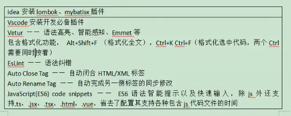

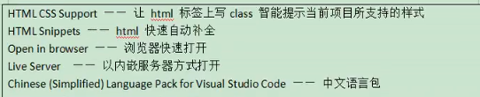

#### 3.安装配置Git

Git这里感觉按自己习惯来


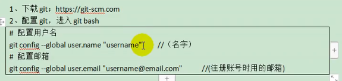

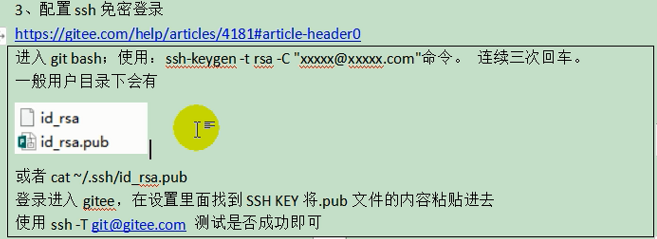

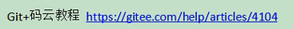

#### 4.逆向工程使用


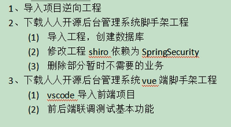


### 6.创建项目微服务


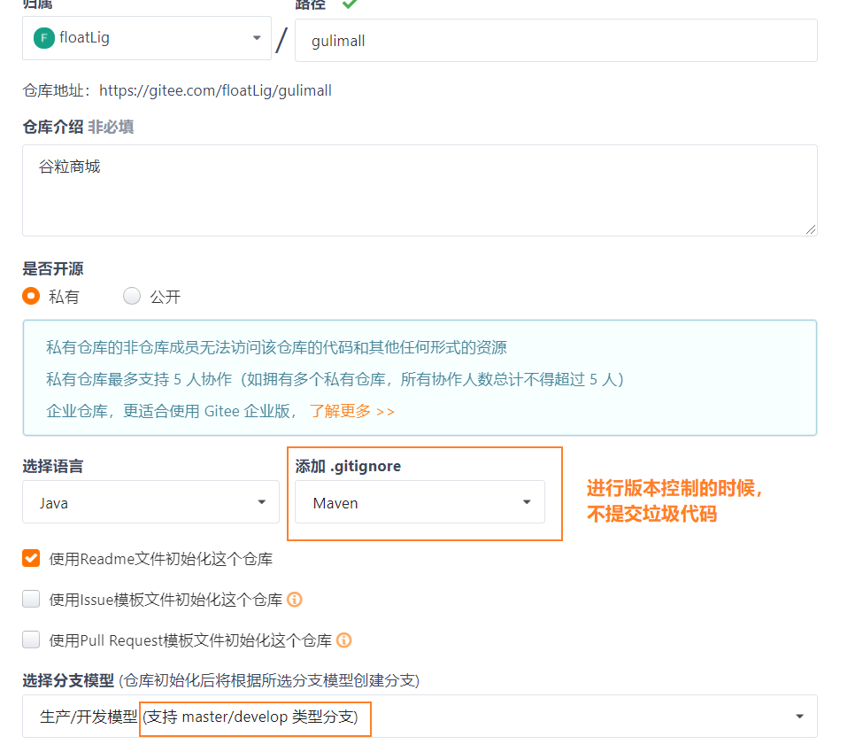

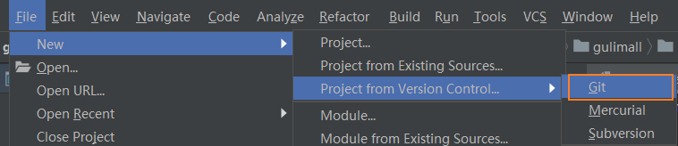


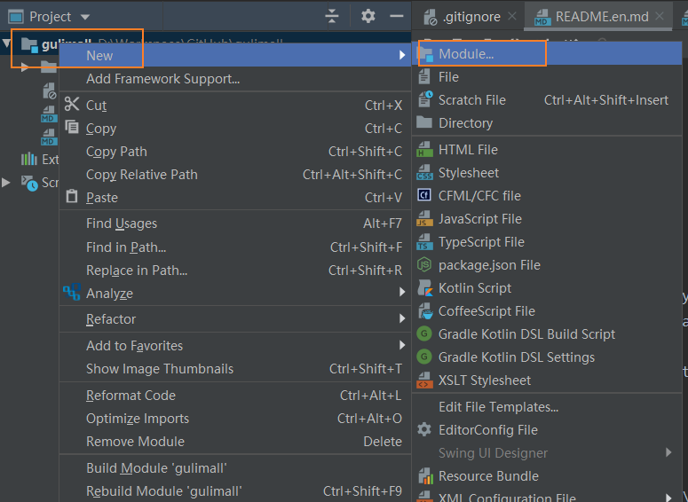

这些配置都可以在pom中进行修改

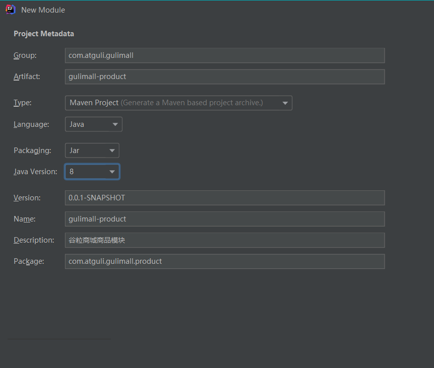


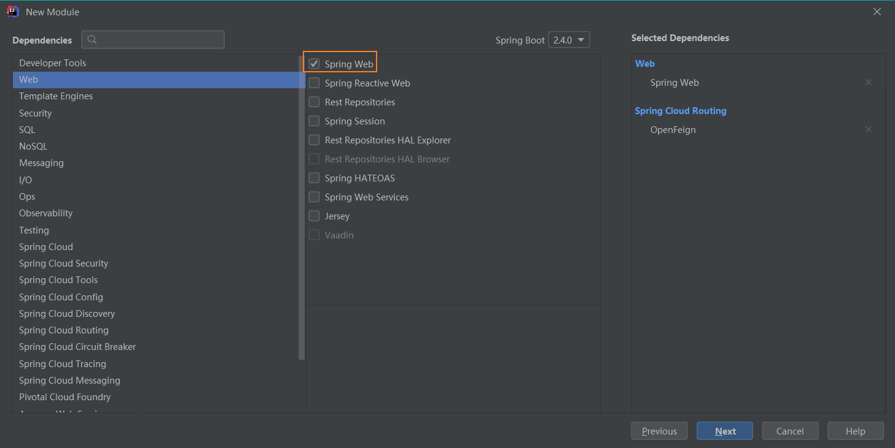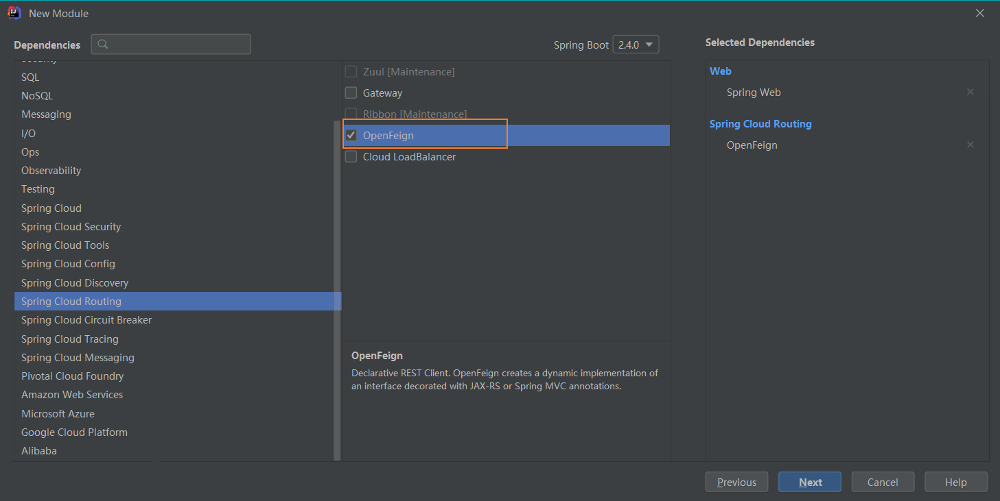


添加聚合服务

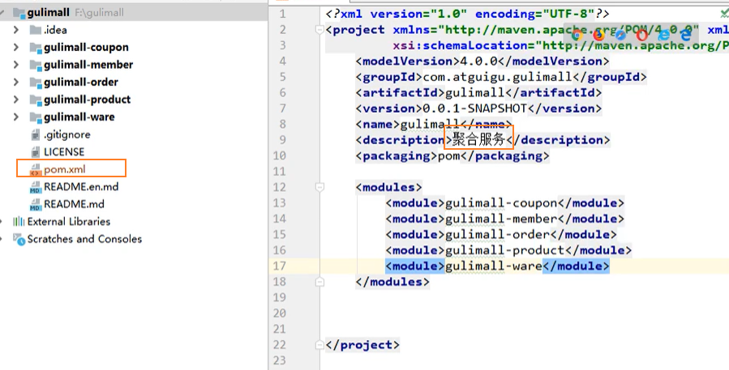

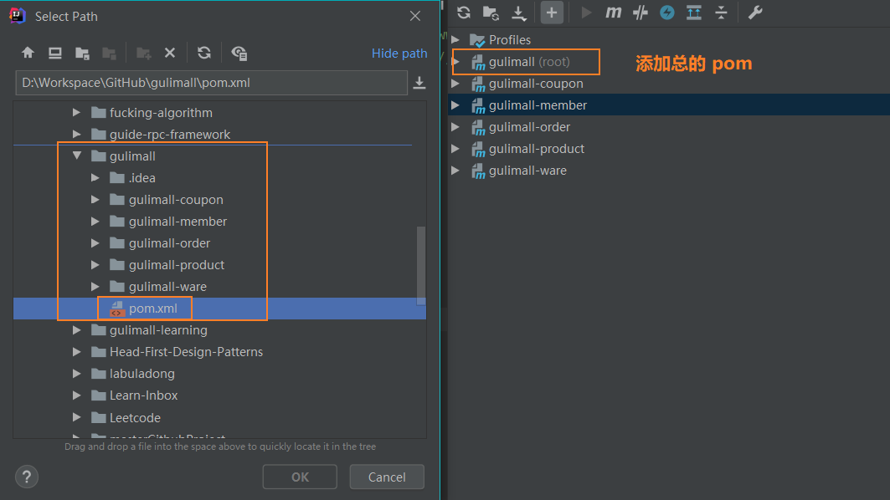


对一些无关的文件，不进行版本提交

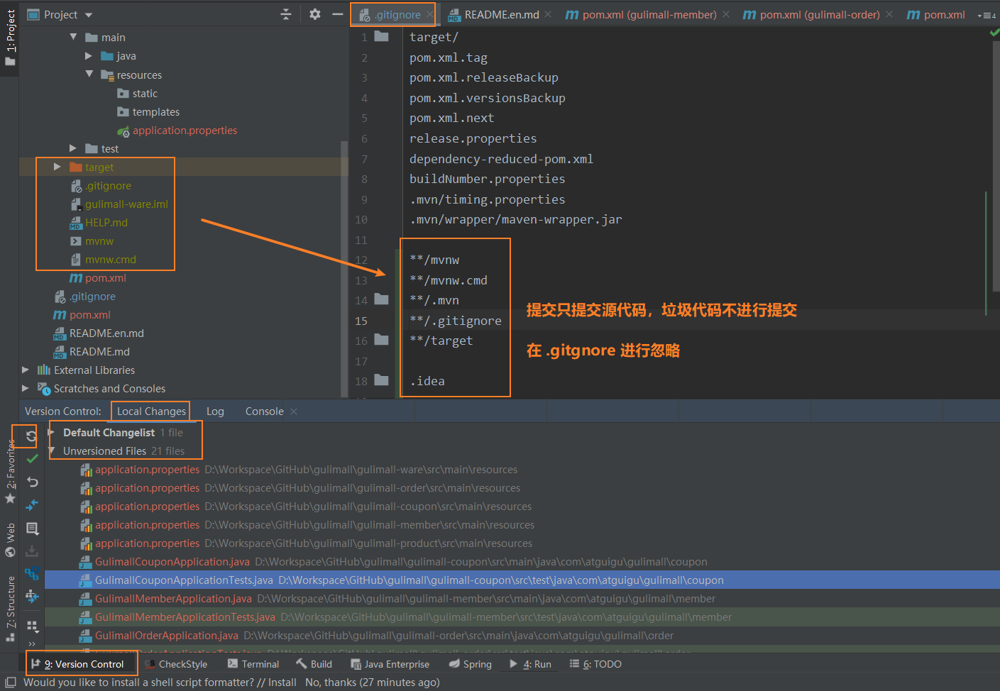


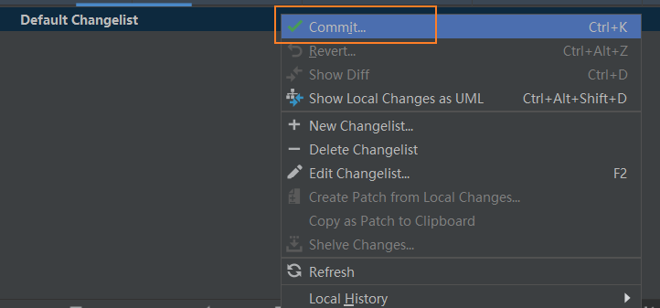


商品服务  仓储服务  订单服务  优惠券服务  用户服务


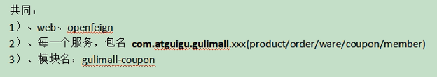


#### maven

在settins中配置阿里云镜像，配置jdk1.8。安装插件lombok，mybatisX。

#### vsCode

下载vsCode用于前端管理系统。在vsCode里安装插件。

- Auto Close Tag
- Auto Rename Tag
- Chinese
- ESlint
- HTML CSS Support
- HTML Snippets
- JavaScript ES6
- Live Server
- open in brower
- Vetur

#### 安装git

下载git客户端，右键桌面Git GUI/bash Here。去bash，

```shell
## 配置用户名
git config --global user.name "username"  //(名字，随意写)
## 配置邮箱
git config --global user.email "55333@qq.com" // 注册账号时使用的邮箱
## 配置ssh免密登录
ssh-keygen -t rsa -C "55333@qq.com"
三次回车后生成了密钥
cat ~/.ssh/id_rsa.pub
也可以查看密钥
浏览器登录码云后，个人头像上点设置、然后点ssh公钥、随便填个标题，然后赋值
ssh-rsa AAAAB3NzaC1yc2EAAAADAQABAAABAQC6MWhGXSKdRxr1mGPZysDrcwABMTrxc8Va2IWZyIMMRHH9Qn/wy3PN2I9144UUqg65W0CDE/thxbOdn78MygFFsIG4j0wdT9sdjmSfzQikLHFsJ02yr58V6J2zwXcW9AhIlaGr+XIlGKDUy5mXb4OF+6UMXM6HKF7rY9FYh9wL6bun9f1jV4Ydlxftb/xtV8oQXXNJbI6OoqkogPKBYcNdWzMbjJdmbq2bSQugGaPVnHEqAD74Qgkw1G7SIDTXnY55gBlFPVzjLWUu74OWFCx4pFHH6LRZOCLlMaJ9haTwT2DB/sFzOG/Js+cEExx/arJ2rvvdmTMwlv/T+6xhrMS3 553736044@qq.com
## 测试
ssh -T git@gitee.com
测试成功
```

#### 码云

在码云新建仓库，仓库名gulimall，选择语言java，在.gitignore选中maven，许可证选Apache-2.0，开发模型选生成/开发模型，开发时在dev分支，发布时在master分支，创建。

在IDEA中New–Project from version control–git–复制刚才项目的地址，如`https://gitee.com/hanferm/gulimall.git`

然后New Module–Spring Initializer–com.atguigu.gulimall ， Artifact填 gulimall-product。Next—选择web，springcloud routin里选中openFeign。

依次创建出以下服务

- 商品服务product
- 存储服务ware
- 订单服务order
- 优惠券服务coupon
- 用户服务member

共同点：

- 导入web和openFeign
- group：com.atguigu.gulimall
- Artifact：gulimall-XXX
- 每一个服务，包名com.atguigu.gulimall.XXX{product/order/ware/coupon/member}
- 模块名：gulimall-XXX

然后右下角显示了springboot的service选项，选择他

从某个项目粘贴个pom.xml粘贴到项目目录，修改他

```xml
<?xml version="1.0" encoding="UTF-8"?>
<project xmlns="http://maven.apache.org/POM/4.0.0" xmlns:xsi="http://www.w3.org/2001/XMLSchema-instance"
    xsi:schemaLocation="http://maven.apache.org/POM/4.0.0 https://maven.apache.org/xsd/maven-4.0.0.xsd">
    <modelVersion>4.0.0</modelVersion>
    <groupId>com.atguigu.gulimall</groupId>
    <artifactId>gulimall</artifactId>
    <version>0.0.1-SNAPSHOT</version>
    <name>gulimall</name>
    <description>聚合服务</description>
    <packaging>pom</packaging>
    <modules>
        <module>gulimall-coupon</module>
        <module>gulimall-member</module>
        <module>gulimall-order</module>
        <module>gulimall-product</module>
        <module>gulimall-ware</module>
    </modules>
</project>
```

在maven窗口刷新，并点击+号，找到刚才的pom.xml添加进来，发现多了个root。这样比如运行root的clean命令，其他项目也一起clean了。

修改总项目的.gitignore，把小项目里的垃圾文件在提交的时候忽略掉，比如HTLP.md。。。


> 如果文件已经添加到git的暂存区，则git中的 .gitignore则会不起作用。
>
> 解决方式：将已经添加到暂存区的文件reset，.gitignore文件则能起作用


在version control/local Changes，点击刷新看Unversioned Files，可以看到变化。

全选最后剩下21个文件，选择右键、Add to VCS。

在IDEA中安装插件：gitee，重启IDEA。

在D额fault changelist右键点击commit，去掉右面的勾选Perform code analysis、CHECK TODO，然后点击COMMIT，有个下拉列表，点击commit and push才会提交到云端。此时就可以在浏览器中看到了。

#### 数据库

因为已经有人贡献sql文件了，所以我们不理会下面引用部分的内容了

> 安装powerDesigner软件。<http://forspeed.onlinedown.net/down/powerdesigner1029.zip>
>
> 其他软件：
>
> <https://www.lanzous.com/b015ag33e>
>
> 密码:2wre
>

所有的数据库数据再复杂也不建立外键，因为在电商系统里，数据量大，做外键关联很耗性能。

name是给我们看的，code才是数据库里真正的信息。

选择primary和identity作为主键。然后点preview就可以看到生成这张表的语句。

点击菜单栏database–generate database—点击确定


找到评论区的sql文件，打开sqlyog软件，链接192.168.56.10，账号密码root。

> 注意重启虚拟机和docker后里面的容器就关了。

```shell
sudo docker ps
sudo docker ps -a
## 这两个命令的差别就是后者会显示  【已创建但没有启动的容器】
## 我们接下来设置我们要用的容器每次都是自动启动
sudo docker update redis --restart=always
sudo docker update mysql --restart=always
## 如果不配置上面的内容的话，我们也可以选择手动启动
sudo docker start mysql
sudo docker start redis
## 如果要进入已启动的容器
sudo docker exec -it mysql /bin/bash
```

然后接着去sqlyog直接我们的操作，在左侧root上右键建立数据库：字符集选utf8mb4，他能兼容utf8且能解决一些乱码的问题。分别建立了下面数据库

```
gulimall-oms
gulimall-pms
gulimall-sms
gulimall-ums
gulimall-wms
```

然后打开对应的sql在对应的数据库中执行

（<https://github.com/1046762075/mall/tree/master/%E7%AC%94%E8%AE%B0%E3%80%81RabbitMQ%E9%98%9F%E5%88%97%E4%BF%A1%E6%81%AF%E3%80%81nginx%E9%85%8D%E7%BD%AE%E3%80%81SQL%E3%80%81%E9%9D%99%E6%80%81%E8%B5%84%E6%BA%90%E3%80%81%E5%9F%9F%E5%90%8D%E8%A7%A3%E5%86%B3%E6%96%B9%E6%A1%88/SQL>）

依次执行。(注意sql文件里没有建库语句)


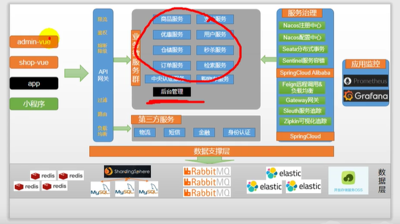


#### VSCode准备

点击执行sql脚本，依次选择评论区给的压缩包里的sql语句


### 后台管理系统使用人人开源脚手架

#### 人人

在码云上搜索人人开源，我们使用renren-fast，renren-fast-vue项目。

<https://gitee.com/renrenio>

```shell
git clone https://gitee.com/renrenio/renren-fast.git
git clone https://gitee.com/renrenio/renren-fast-vue.git
```

下载到了桌面，我们把renren-fast移动到我们的项目文件夹（删掉.git文件），而renren-vue是用VSCode打开的（后面再弄）

在项目里的pom.xml添加一个

```xml
<modules>
    <module>gulimall-coupon</module>
    <module>gulimall-member</module>
    <module>gulimall-order</module>
    <module>gulimall-product</module>
    <module>gulimall-ware</module>
    <module>renren-fast</module>
</modules>
```

然后打开renren-fast/db/mysql.sql，复制全部，在sqlyog中创建库gulimall-admin，粘贴刚才的内容执行。

然后修改项目里renren-fast中的application.yml，**修改application-dev.yml中的数库库的url，通常把localhost修改为192.168.56.10即可。**

```yml
url: jdbc:mysql://192.168.56.10:3306/gulimall-admin?useUnicode=true&characterEncoding=UTF-8&serverTimezone=Asia/Shanghai
username: root
password: root
```

然后执行java下的RenrenApplication

浏览器输入http://localhost:8080/renren-fast/ 得到{“msg”:“invalid token”,“code”:401}就代表无误

##### 人人vue

用VSCode打开renren-fast-vue

安装node：http://nodejs.cn/download/ 选择windows下载。下载完安装。

NPM是随同NodeJS一起安装的包管理工具，如JavaScript-NPM，java-Maven。

命令行输入`node -v` 检查配置好了，配置npm的镜像仓库地址，再执

```shell
node -v
npm config set registry http://registry.npm.taobao.org/
```

根据官方的命令：<https://github.com/renrenio/renren-fast-vue/wiki/Getting-started>

```shell
# 克隆项目
git clone https://github.com/daxiongYang/renren-fast-vue.git

# 安装依赖
# 1
npm install -g cnpm --registry=https://registry.npm.taobao.org
# 2
cnpm install

# 启动服务
npm run dev
```


package.json类似maven的pom.xml；下载后的依赖会出现在node_modules


然后取VScode的终端中输入 npm install，会报错，然后进行如下操作：

> 关于新谷粒P16的前	端项目使用npm install报错的问题，首先确保安装了python3.0以上版本，并配置全局变量
>
> 其次大部分错误是报node-sass4.9.0安装失败。
>
> 执行以下步骤可以完美解决
>
> 首先把项目文件夹下的package.json里面的node-sass4.9.0改成4.9.2（不改可能也没关系，不过我改了，防止踩坑）
>
> 然后项目文件夹下打开cmd命令窗口（和Visual Studio Code的终端命令是一样的）（我在VScode中不成功，还是用cmd吧，在cmd中注意切换到renren-fast-vue项目目录）
>
> 执行：
>
> npm i node-sass --sass_binary_site=https://npm.taobao.org/mirrors/node-sass/
>
> 等待挺长时间，执行成功看看有没有报错，如果没报错执行下面命令
>
> npm install ，
>
> 没报错就是安装成功，然后在下面目录下使用npm run dev （运行项目）就ok了
>
> 注：这么做得原理就是先单独从淘宝镜像吧nod-sass下载下来，然后再进行编译，因为这句命令好像是不成功的，（npm config set registry http://registry.npm.taobao.org/），默认从github下载，导致报错的
>
> 如果之前安装失败的。先清理 缓存
>
> 清理缓存：npm rebuild node-sass
>
> npm uninstall node-sass
>
> 另一个人的评论：
>
> 先把node_modules全部删除，然后再npm install chromedriver --chromedriver_cdnurl=http://cdn.npm.taobao.org/dist/chromedriver，最后npm install。

浏览器输入localhost:8001 就可以看到内容了，登录admin admin

#### IDEA项目准备

##### 逆向工程搭建

```shell
git clone https://gitee.com/renrenio/renren-generator.git
```

下载到桌面后，同样把里面的.git文件删除，然后移动到我们IDEA项目目录中，同样配置好pom.xml

```xml
<modules>
        <module>gulimall-coupon</module>
        <module>gulimall-member</module>
        <module>gulimall-order</module>
        <module>gulimall-product</module>
        <module>gulimall-ware</module>
        <module>renren-fast</module>
        <module>renren-generator</module>
    </modules>
```

在maven中刷新一下，让项目名变粗体，稍等下面进度条完成。

修改application.yml

```yml
url: jdbc:mysql://192.168.56.10:3306/gulimall-pms?useUnicode=true&characterEncoding=UTF-8&useSSL=false&serverTimezone=Asia/Shanghai
username: root
password: root
```

然后修改generator.properties（这里乱码的百度IDEA设置properties编码）

```properties
## 主目录
mainPath=com.atguigu
##包名
package=com.atguigu.gulimall
##模块名
moduleName=product
##作者
author=hh
##email
email=55333@qq.com
##表前缀(类名不会包含表前缀) # 我们的pms数据库中的表的前缀都pms
## 如果写了表前缀，每一张表对于的javaBean就不会添加前缀了
tablePrefix=pms_
```

运行RenrenApplication。如果启动不成功，修改application中是port为801。访问http://localhost:801/

在网页上下方点击每页显示50个（pms库中的表），以让全部都显示，然后点击全部，点击生成代码。下载了压缩包

解压压缩包，把main放到gulimall-product的同级目录下。

然后在项目上右击（在项目上右击很重要）new modules— maven—然后在name上输入gulimall-common。

在pom.xml中也自动添加了`<module>gulimall-common</module>`

在common项目的pom.xml中添加

```xml
<!-- mybatisPLUS-->
<dependency>
    <groupId>com.baomidou</groupId>
    <artifactId>mybatis-plus-boot-starter</artifactId>
    <version>3.3.2</version>
</dependency>
<!--简化实体类，用@Data代替getset方法-->
<dependency>
    <groupId>org.projectlombok</groupId>
    <artifactId>lombok</artifactId>
    <version>1.18.8</version>
</dependency>
<!-- httpcomponent包https://mvnrepository.com/artifact/org.apache.httpcomponents/httpcore -->
<dependency>
    <groupId>org.apache.httpcomponents</groupId>
    <artifactId>httpcore</artifactId>
    <version>4.4.13</version>
</dependency>
<dependency>
    <groupId>commons-lang</groupId>
    <artifactId>commons-lang</artifactId>
    <version>2.6</version>
</dependency>
```

我们把每个微服务里公共的类和依赖放到common里。

> tips: shift+F6修改项目名

然后在product项目中的pom.xml中加入下面内容

```xml
<dependency>
    <groupId>com.atguigu.gulimall</groupId>
    <artifactId>gulimall-common</artifactId>
    <version>0.0.1-SNAPSHOT</version>
</dependency>
```

复制

- renren-fast----utils包下的Query和PageUtils、R、Constant复制到common项目的java/com.atguigu.common.utils下
- 把@RequiresPermissions这些注解掉，因为是shiro的
- 复制renren-fast中的xss包粘贴到common的com.atguigu.common目录下。

> 还复制了exception文件夹，对应的位置关系自己观察一下就行

- 注释掉product项目下类中的`//import org.apache.shiro.authz.annotation.RequiresPermissions;`，他是shiro的东西
#- 注释renren-generator\src\main\resources\template/Controller中所有的@RequiresPermissions。`## import org.apache.shiro.authz.annotation.RequiresPermissions;`

总之什么报错就去fast里面找。重启逆向工程。重新在页面上得到压缩包。重新解压出来，不过只把里面的controller复制粘贴到product项目对应的目录就行。

##### 测试

测试与整合商品服务里的mybatisplus

#https://mp.baomidou.com/guide/quick-start.html#配置

在common的pom.xml中导入

```xml
<!-- 数据库驱动 https://mvnrepository.com/artifact/mysql/mysql-connector-java -->
<dependency>
    <groupId>mysql</groupId>
    <artifactId>mysql-connector-java</artifactId>
    <version>8.0.17</version>
</dependency>
<!--tomcat里一般都带-->
<dependency>
    <groupId>javax.servlet</groupId>
    <artifactId>servlet-api</artifactId>
    <version>2.5</version>
    <scope>provided</scope>
</dependency>
```

删掉common里xss/xssfiler和XssHttpServletRequestWrapper

在product项目的resources目录下新建application.yml

```yml
spring:
  datasource:
    username: root
    password: root
    url: jdbc:mysql://192.168.56.10:3306/gulimall-pms
    driver-class-name: com.mysql.jdbc.Driver
## MapperScan
## sql映射文件位置
mybatis-plus:
  mapper-locations: classpath:/mapper/**/*.xml
  global-config:
    db-config:
      id-type: auto
```

> classpath 和 classpath* 区别：
>
> classpath：只会到你的class路径中查找找文件;
>
> classpath*：不仅包含class路径，还包括jar文件中(class路径)进行查找
>
> `classpath*`的使用：当项目中有多个classpath路径，并同时加载多个classpath路径下（此种情况多数不会遇到）的文件，`*`就发挥了作用，如果不加`*`，则表示仅仅加载第一个classpath路径。

然而执行后能通过，但是数据库中文显示乱码，所以我模仿逆向工程，把上面的配置url改为

```
url: jdbc:mysql://192.168.56.10:3306/gulimall-pms?useUnicode=true&characterEncoding=UTF-8&useSSL=false&serverTimezone=Asia/Shanghai
• 1
```

正常了。

然后在主启动类上加上注解@MapperScan()

```
@MapperScan("com.atguigu.gulimall.product.dao")
@SpringBootApplication
public class gulimallProductApplication {
    public static void main(String[] args) {
        SpringApplication.run(gulimallProductApplication.class, args);
    }
}
```

然后去测试，先通过下面方法给数据库添加内容

```
@SpringBootTest
class gulimallProductApplicationTests {
    @Autowired
    BrandService brandService;
    @Test
    void contextLoads() {
        BrandEntity brandEntity = new BrandEntity();
        brandEntity.setDescript("哈哈1哈");
        brandEntity.setName("华为");
        brandService.save(brandEntity);
        System.out.println("保存成功");
    }
}
• 1
• 2
• 3
• 4
• 5
• 6
• 7
• 8
• 9
• 10
• 11
• 12
• 13
• 14
```

在数据库中就能看到新增数据了

```
@SpringBootTest
class gulimallProductApplicationTests {
    @Autowired
    BrandService brandService;
    @Test
    void contextLoads() {
        BrandEntity brandEntity = new BrandEntity();
        brandEntity.setBrandId(1L);
        brandEntity.setDescript("修改");
        brandService.updateById(brandEntity);
    }
}
• 1
• 2
• 3
• 4
• 5
• 6
• 7
• 8
• 9
• 10
• 11
• 12
• 13
```

##### coupon

重新打开generator逆向工程，修改generator.properties

```
## 主目录
mainPath=com.atguigu
##包名
package=com.atguigu.gulimall
##模块名
moduleName=coupon
##作者
autho=hh
##email
email=55333@qq.com
##表前缀(类名不会包含表前缀) # 我们的pms数据库中的表的前缀都pms
## 如果写了表前缀，每一张表对于的javaBean就不会添加前缀了
tablePrefix=sms_
• 1
• 2
• 3
• 4
• 5
• 6
• 7
• 8
• 9
• 10
• 11
• 12
• 13
```

修改yml数据库信息

```
spring:
  datasource:
    username: root
    password: root
    url: jdbc:mysql://192.168.56.10:3306/gulimall-sms?useUnicode=true&characterEncoding=UTF-8&useSSL=false&serverTimezone=Asia/Shanghai
    driver-class-name: com.mysql.cj.jdbc.Driver
mybatis-plus:
  mapper-locations: classpath:/mapper/**/*.xml
  global-config:
    db-config:
      id-type: auto
      logic-delete-value: 1
      logic-not-delete-value: 0
server:
  port: 7000
• 1
• 2
• 3
• 4
• 5
• 6
• 7
• 8
• 9
• 10
• 11
• 12
• 13
• 14
• 15
• 16
• 17
• 18
```

端口号后面会设置，这里提前设置好了

启动生成RenrenApplication.java，运行后去浏览器80端口查看，同样让他一页全显示后选择全部后生成。生成后解压复制到coupon项目对应目录下。

让coupon也依赖于common，修改pom.xml

```
<dependency>
    <groupId>com.atguigu.gulimall</groupId>
    <artifactId>gulimall-common</artifactId>
    <version>0.0.1-SNAPSHOT</version>
</dependency>
• 1
• 2
• 3
• 4
• 5
```

resources下src包先删除

添加application.yml

```
spring:
  datasource:
    username: root
    password: root
    url: jdbc:mysql://192.168.56.10:3306/gulimall-sms?useUnicode=true&characterEncoding=UTF-8&useSSL=false&serverTimezone=Asia/Shanghai
    driver-class-name: com.mysql.cj.jdbc.Driver
mybatis-plus:
  mapper-locations: classpath:/mapper/**/*.xml
  global-config:
    db-config:
      id-type: auto
      logic-delete-value: 1
      logic-not-delete-value: 0
• 1
• 2
• 3
• 4
• 5
• 6
• 7
• 8
• 9
• 10
• 11
• 12
• 13
• 14
• 15
• 16
• 17
```

运行gulimallCouponApplication.java

http://localhost:8080/coupon/coupon/list

```
{"msg":"success","code":0,"page":{"totalCount":0,"pageSize":10,"totalPage":0,"currPage":1,"list":[]}}
• 1
```

##### member

重新使用代码生成器生成ums

模仿上面修改下面两个配置

代码生成器里：

```
url: jdbc:mysql://192.168.56.10:3306/gulimall-ums?useUnicode=true&characterEncoding=UTF-8&useSSL=false&serverTimezone=Asia/Shanghai
• 1
## 主目录
mainPath=com.atguigu
##包名
package=com.atguigu.gulimall
##模块名
moduleName=member
##作者
author=hh
##email
email=55333@qq.com
##表前缀(类名不会包含表前缀) # 我们的pms数据库中的表的前缀都pms
## 如果写了表前缀，每一张表对于的javaBean就不会添加前缀了
tablePrefix=ums_
• 1
• 2
• 3
• 4
• 5
• 6
• 7
• 8
• 9
• 10
• 11
• 12
• 13
```

重启RenrenApplication.java，然后同样去浏览器获取压缩包解压到对应member项目目录

member也导入依赖

```
<dependency>
    <groupId>com.atguigu.gulimall</groupId>
    <artifactId>gulimall-common</artifactId>
    <version>0.0.1-SNAPSHOT</version>
</dependency>
• 1
• 2
• 3
• 4
• 5
```

同样新建application.yml

```
spring:
  datasource:
    username: root
    password: root
    url: jdbc:mysql://192.168.56.10:3306/gulimall-ums?useUnicode=true&characterEncoding=UTF-8&useSSL=false&serverTimezone=Asia/Shanghai
    driver-class-name: com.mysql.cj.jdbc.Driver
mybatis-plus:
  mapper-locations: classpath:/mapper/**/*.xml
  global-config:
    db-config:
      id-type: auto
      logic-delete-value: 1
      logic-not-delete-value: 0
server:
  port: 8000
• 1
• 2
• 3
• 4
• 5
• 6
• 7
• 8
• 9
• 10
• 11
• 12
• 13
• 14
• 15
• 16
• 17
• 18
```

order端口是9000，product是10000，ware是11000。

以后比如order系统要复制多份，他的端口计算9001、9002。。。

重启web后，http://localhost:8000/member/growthchangehistory/list

```
{"msg":"success","code":0,"page":{"totalCount":0,"pageSize":10,"totalPage":0,"currPage":1,"list":[]}}
• 1
```

##### order

修改代码生成器

```
url: jdbc:mysql://192.168.56.10:3306/gulimall-oms?useUnicode=true&characterEncoding=UTF-8&useSSL=false&serverTimezone=Asia/Shanghai
• 1
• 2
##代码生成器，配置信息
## 主目录
mainPath=com.atguigu
##包名
package=com.atguigu.gulimall
##模块名
moduleName=order
##作者
author=hh
##email
email=55333@qq.com
##表前缀(类名不会包含表前缀) # 我们的pms数据库中的表的前缀都pms
## 如果写了表前缀，每一张表对于的javaBean就不会添加前缀了
tablePrefix=oms_
• 1
• 2
• 3
• 4
• 5
• 6
• 7
• 8
• 9
• 10
• 11
• 12
• 13
• 14
• 15
```

运行RenrenApplication.java重新生成后去下载解压放置。

application.yml

```
spring:
  datasource:
    username: root
    password: root
    url: jdbc:mysql://192.168.56.10:3306/gulimall-oms?useUnicode=true&characterEncoding=UTF-8&useSSL=false&serverTimezone=Asia/Shanghai
    driver-class-name: com.mysql.cj.jdbc.Driver
mybatis-plus:
  mapper-locations: classpath:/mapper/**/*.xml
  global-config:
    db-config:
      id-type: auto
      logic-delete-value: 1
      logic-not-delete-value: 0
      
server:
  port: 9000
• 1
• 2
• 3
• 4
• 5
• 6
• 7
• 8
• 9
• 10
• 11
• 12
• 13
• 14
• 15
• 16
• 17
• 18
```

POMxml

```
<dependency>
    <groupId>com.atguigu.gulimall</groupId>
    <artifactId>gulimall-common</artifactId>
    <version>0.0.1-SNAPSHOT</version>
</dependency>
• 1
• 2
• 3
• 4
• 5
```

启动gulimallOrderApplication.java

http://localhost:9000/order/order/list

```
{"msg":"success","code":0,"page":{"totalCount":0,"pageSize":10,"totalPage":0,"currPage":1,"list":[]}}
• 1
```

##### ware

修改代码生成器

```
url: jdbc:mysql://192.168.56.10:3306/gulimall-wms?useUnicode=true&characterEncoding=UTF-8&useSSL=false&serverTimezone=Asia/Shanghai
• 1
• 2
##代码生成器，配置信息
## 主目录
mainPath=com.atguigu
##包名
package=com.atguigu.gulimall
##模块名
moduleName=ware
##作者
author=hh
##email
email=55333@qq.com
##表前缀(类名不会包含表前缀) # 我们的pms数据库中的表的前缀都pms
## 如果写了表前缀，每一张表对于的javaBean就不会添加前缀了
tablePrefix=wms_
• 1
• 2
• 3
• 4
• 5
• 6
• 7
• 8
• 9
• 10
• 11
• 12
• 13
• 14
• 15
```

运行RenrenApplication.java重新生成后去下载解压放置。

application.yml

```
spring:
  datasource:
    username: root
    password: root
    url: jdbc:mysql://192.168.56.10:3306/gulimall-wms?useUnicode=true&characterEncoding=UTF-8&useSSL=false&serverTimezone=Asia/Shanghai
    driver-class-name: com.mysql.cj.jdbc.Driver
mybatis-plus:
  mapper-locations: classpath:/mapper/**/*.xml
  global-config:
    db-config:
      id-type: auto
      logic-delete-value: 1
      logic-not-delete-value: 0
      
server:
  port: 11000
• 1
• 2
• 3
• 4
• 5
• 6
• 7
• 8
• 9
• 10
• 11
• 12
• 13
• 14
• 15
• 16
• 17
• 18
```

POMxml

```
<dependency>
    <groupId>com.atguigu.gulimall</groupId>
    <artifactId>gulimall-common</artifactId>
    <version>0.0.1-SNAPSHOT</version>
</dependency>
• 1
• 2
• 3
• 4
• 5
```

启动gulimallWareApplication.java

http://localhost:11000/ware/wareinfo/list

```
{"msg":"success","code":0,"page":{"totalCount":0,"pageSize":10,"totalPage":0,"currPage":1,"list":[]}}
• 1
```

#### SpringCloud Alibaba简介

阿里18年开发的微服务一站式解决方案。https://github.com/alibaba/spring-cloud-alibaba/blob/master/README-zh.md

- 注册中心：
- 配置中心：
- 网关：

netflix把feign闭源了，spring cloud开了个open feign

在common的pom.xml中加入

```
<dependencyManagement>
    <dependencies>
        <dependency>
            <groupId>com.alibaba.cloud</groupId>
            <artifactId>spring-cloud-alibaba-dependencies</artifactId>
            <version>2.2.0.RELEASE</version>
            <type>pom</type>
            <scope>import</scope>
        </dependency>
    </dependencies>
</dependencyManagement>
• 1
• 2
• 3
• 4
• 5
• 6
• 7
• 8
• 9
• 10
• 11
```

上面是依赖管理，相当于以后再dependencies里引spring cloud alibaba就不用写版本号， 全用dependencyManagement进行管理

##### Nacos

一个更易于构建云原生应用的动态服务发现、配置管理和服务管理平台。

作为我们的注册中心和配置中心。

注册中心文档：https://github.com/alibaba/spring-cloud-alibaba/tree/master/spring-cloud-alibaba-examples/nacos-example/nacos-discovery-example

其他文档在该项目上层即可找到，下面读一读官网给的介绍就会用了。流程：下载–解压–/bin/startup.cmd—在某个项目里properties里写`spring.cloud.nacos.discovery.server-addr=127.0.0.1:8848`（yaml同理）。

> **如何接入：**
>
> 在启动示例进行演示之前，我们先了解一下 Spring Cloud 应用如何接入 Nacos Discovery。 **注意 本章节只是为了便于您理解接入方式，本示例代码中已经完成接入工作，您无需再进行修改。**
>
> 1. 首先，修改 pom.xml 文件，引入 Nacos Discovery Starter。

```
<dependency>
    <groupId>com.alibaba.cloud</groupId>
    <artifactId>spring-cloud-starter-alibaba-nacos-discovery</artifactId>
</dependency>
• 1
• 2
• 3
• 4
```

> 1. 放到common里
> 2. 在应用的 /src/main/resources/application.properties 配置文件中配置 Nacos Server 地址（或在yaml中按格式配置）

```
spring.cloud.nacos.discovery.server-addr=127.0.0.1:8848
• 1
```

> 1. 我们要配置nacos服务器的地址，也就是注册中心地址，但是我们还没有nacos服务器，所以我们先在下面按照"启动nacos server"创建nacos服务器
> 2. 使用 @EnableDiscoveryClient 注解开启服务注册与发现功能

```
@SpringBootApplication
 @EnableDiscoveryClient
 public class ProviderApplication {
    public static void main(String[] args) {
        SpringApplication.run(Application.class, args);
    }
    @RestController
    class EchoController {
        @GetMapping(value = "/echo/{string}")
        public String echo(@PathVariable String string) {
                return string;
        }
    }
 }
• 1
• 2
• 3
• 4
• 5
• 6
• 7
• 8
• 9
• 10
• 11
• 12
• 13
• 14
• 15
• 16
```

> **启动 Nacos Server：**
>
> 1. 首先需要获取 Nacos Server，支持直接下载和源码构建两种方式。
>
> 1. 1. 直接下载：[Nacos Server 下载页](https://github.com/alibaba/nacos/releases)。解压zip，双击bin里的startup.cmd就启动了。
>    2. 源码构建：进入 Nacos [Github 项目页面](https://github.com/alibaba/nacos)，将代码 git clone 到本地自行编译打包，[参考此文档](https://nacos.io/zh-cn/docs/quick-start.html)。**推荐使用源码构建方式以获取最新版本**
>
> 1. 启动 Server，进入解压后文件夹或编译打包好的文件夹，找到如下相对文件夹 nacos/bin，并对照操作系统实际情况之下如下命令。
>
> 1. 1. Linux/Unix/Mac 操作系统，执行命令 `sh startup.sh -m standalone`
>    2. Windows 操作系统，执行命令 `cmd startup.cmd`
>
#> ### 应用启动
>
> 1. 增加配置，在 nacos-discovery-provider-example 项目的 /src/main/resources/application.properties 中添加基本配置信息

```
spring.application.name=service-provider
 server.port=18082
• 1
• 2
```

> 1. 启动应用，支持 IDE 直接启动和编译打包后启动。
>
> 1. 1. IDE直接启动：找到 nacos-discovery-provider-example 项目的主类 `ProviderApplication`，执行 main 方法启动应用。
>    2. 打包编译后启动：在 nacos-discovery-provider-example 项目中执行 `mvn clean package` 将工程编译打包，然后执行 `java -jar nacos-discovery-provider-example.jar`启动应用。
>
#> ### 验证
>
#> #### 查询服务
>
> 在浏览器输入此地址 `http://127.0.0.1:8848/nacos/v1/ns/catalog/instances?serviceName=service-provider&clusterName=DEFAULT&pageSize=10&pageNo=1&namespaceId=`，并点击跳转，可以看到服务节点已经成功注册到 Nacos Server。

在coupon的gulimallCouponApplication.java加上@EnableDiscoveryClient，导入包，然后重开项目。

http://127.0.0.1:8848/nacos/ 账号面nacos

最后application.yml内容，配置了服务中心名和当前模块名字

```
spring:
  datasource:
    username: root
    password: root
    url: jdbc:mysql://192.168.56.10:3306/gulimall-sms?useUnicode=true&characterEncoding=UTF-8&useSSL=false&serverTimezone=Asia/Shanghai
    driver-class-name: com.mysql.cj.jdbc.Driver
  cloud:
    nacos:
      discovery:
        server-addr: 127.0.0.1:8848
  application:
    name: gulimall-coupon
mybatis-plus:
  mapper-locations: classpath:/mapper/**/*.xml
  global-config:
    db-config:
      id-type: auto
      logic-delete-value: 1
      logic-not-delete-value: 0
server:
  port: 7000
• 1
• 2
• 3
• 4
• 5
• 6
• 7
• 8
• 9
• 10
• 11
• 12
• 13
• 14
• 15
• 16
• 17
• 18
• 19
• 20
• 21
• 22
• 23
• 24
```

然后依次给member、配置上面的yaml，改下name就行。再给每个项目配置类上加上注解@EnableDiscoveryClient

**测试member和coupon的远程调用**

想要获取当前会员领取到的所有优惠券。先去注册中心找优惠券服务，注册中心调一台优惠券服务器给会员，会员服务器发送请求给这台优惠券服务器，然后对方响应。

###### Feign与注册中心

spring cloud feign

声明式远程调用

feign是一个声明式的HTTP客户端，他的目的就是让远程调用更加简单。给远程服务发的是HTTP请求。

会员服务想要远程调用优惠券服务，只需要给会员服务里引入openfeign依赖，他就有了远程调用其他服务的能力。

```
<dependency>
    <groupId>org.springframework.cloud</groupId>
    <artifactId>spring-cloud-starter-openfeign</artifactId>
</dependency>
• 1
• 2
• 3
• 4
```

我们之前在member的pom.xml已经引用过了（微服务）。

在coupon中修改如下的内容

```
@RequestMapping("coupon/coupon")
public class CouponController {
    @Autowired
    private CouponService couponService;
    @RequestMapping("/member/list")
    public R membercoupons(){    //全系统的所有返回都返回R
        // 应该去数据库查用户对于的优惠券，但这个我们简化了，不去数据库查了，构造了一个优惠券给他返回
        CouponEntity couponEntity = new CouponEntity();
        couponEntity.setCouponName("满100-10");//优惠券的名字
        return R.ok().put("coupons",Arrays.asList(couponEntity));
    }
• 1
• 2
• 3
• 4
• 5
• 6
• 7
• 8
• 9
• 10
• 11
• 12
```

这样我们准备好了优惠券的调用内容

在member的配置类上加注解@EnableDiscoveryClient，告诉member是一个远程调用客户端，member要调用东西的

```
package com.atguigu.gulimall.member;
import org.springframework.boot.SpringApplication;
import org.springframework.boot.autoconfigure.SpringBootApplication;
import org.springframework.cloud.client.discovery.EnableDiscoveryClient;
import org.springframework.cloud.openfeign.EnableFeignClients;
/*
* 想要远程调用的步骤：
* 1 引入openfeign
* 2 编写一个接口，接口告诉springcloud这个接口需要调用远程服务
*   2.1 在接口里声明@FeignClient("gulimall-coupon")他是一个远程调用客户端且要调用coupon服务
*   2.2 要调用coupon服务的/coupon/coupon/member/list方法
* 3 开启远程调用功能 @EnableFeignClients，要指定远程调用功能放的基础包
* */
@EnableFeignClients(basePackages="com.atguigu.gulimall.member.feign")
@EnableDiscoveryClient
@SpringBootApplication
public class gulimallMemberApplication {
    public static void main(String[] args) {
        SpringApplication.run(gulimallMemberApplication.class, args);
    }
}
• 1
• 2
• 3
• 4
• 5
• 6
• 7
• 8
• 9
• 10
• 11
• 12
• 13
• 14
• 15
• 16
• 17
• 18
• 19
• 20
• 21
• 22
• 23
• 24
```

那么要调用什么东西呢？就是我们刚才写的优惠券的功能，复制函数部分，在member的com.atguigu.gulimall.member.feign包下新建类：

```
package com.atguigu.gulimall.member.feign;
import com.atguigu.common.utils.R;
import org.springframework.cloud.openfeign.FeignClient;
import org.springframework.web.bind.annotation.RequestMapping;
@FeignClient("gulimall-coupon") //告诉spring cloud这个接口是一个远程客户端，要调用coupon服务，再去调用coupon服务/coupon/coupon/member/list对应的方法
public interface CouponFeignService {
    @RequestMapping("/coupon/coupon/member/list")//注意写全优惠券类上还有映射//注意我们这个地方不熟控制层，所以这个请求映射请求的不是我们服务器上的东西，而是nacos注册中心的
    public R membercoupons();//得到一个R对象
}
• 1
• 2
• 3
• 4
• 5
• 6
• 7
• 8
• 9
• 10
• 11
```

然后我们在member的控制层写一个测试请求

```
@RestController
@RequestMapping("member/member")
public class MemberController {
    @Autowired
    private MemberService memberService;
    @Autowired
    CouponFeignService couponFeignService;
    @RequestMapping("/coupons")
    public R test(){
        MemberEntity memberEntity = new MemberEntity();
        memberEntity.setNickname("会员昵称张三");
        R membercoupons = couponFeignService.membercoupons();//假设张三去数据库查了后返回了张三的优惠券信息
        //打印会员和优惠券信息
        return R.ok().put("member",memberEntity).put("coupons",membercoupons.get("coupons"));
    }
• 1
• 2
• 3
• 4
• 5
• 6
• 7
• 8
• 9
• 10
• 11
• 12
• 13
• 14
• 15
• 16
• 17
• 18
```

重新启动服务

http://localhost:8000/member/member/coupons

```
{"msg":"success","code":0,"coupons":[{"id":null,"couponType":null,"couponImg":null,"couponName":"满100-10","num":null,"amount":null,"perLimit":null,"minPoint":null,"startTime":null,"endTime":null,"useType":null,"note":null,"publishCount":null,"useCount":null,"receiveCount":null,"enableStartTime":null,"enableEndTime":null,"code":null,"memberLevel":null,"publish":null}],"member":{"id":null,"levelId":null,"username":null,"password":null,"nickname":"会员昵称张三","mobile":null,"email":null,"header":null,"gender":null,"birth":null,"city":null,"job":null,"sign":null,"sourceType":null,"integration":null,"growth":null,"status":null,"createTime":null}}
• 1
```

上面内容很重要，我们停留5分钟体会一下。

coupon里的R.ok()是什么

```
public class R extends HashMap<String, Object> {//R继承了HashMap
    // ok是个静态方法，new了一个R对象，并且
    public static R ok(String msg) {
        R r = new R();
        r.put("msg", msg);//调用了super.put(key, value);，即hashmap的put
        return r;
    }
}
• 1
• 2
• 3
• 4
• 5
• 6
• 7
• 8
```

coupon里的控制层就是new了个couponEntity然后放到hashmap（R）里而已。

###### 配置中心

我们还可以用nacos作为配置中心。配置中心的意思是不在application.properties等文件中配置了，而是放到nacos配置中心公用，这样无需每台机器都改。

官方教程：https://github.com/alibaba/spring-cloud-alibaba/blob/master/spring-cloud-alibaba-examples/nacos-example/nacos-config-example/readme-zh.md

引入配置中心依赖，放到common中

```
<dependency>
     <groupId>com.alibaba.cloud</groupId>
     <artifactId>spring-cloud-starter-alibaba-nacos-config</artifactId>
 </dependency>
• 1
• 2
• 3
• 4
```

在coupons项目中创建/src/main/resources/bootstrap.properties ，这个文件是springboot里规定的，他优先级别application.properties高

```
## 改名字，对应nacos里的配置文件名
spring.application.name=gulimall-coupon
spring.cloud.nacos.config.server-addr=127.0.0.1:8848
• 1
• 2
• 3
```

原来的方式：

```
@RestController
@RequestMapping("coupon/coupon")
public class CouponController {
    @Autowired
    private CouponService couponService;
    @Value("${coupon.user.name}")//从application.properties中获取//不要写user.name，他是环境里的变量
    private String name;
    @Value("${coupon.user.age}")
    private Integer age;
    @RequestMapping("/test")
    public R test(){
        return R.ok().put("name",name).put("age",age);
    }
• 1
• 2
• 3
• 4
• 5
• 6
• 7
• 8
• 9
• 10
• 11
• 12
• 13
• 14
• 15
```

浏览器去nacos里的配置列表，点击＋号，data ID：`gulimall-coupon.properties`，配置

```
## gulimall-coupon.properties
coupon.user.name="配置中心"      
coupon.user.age=12
• 1
• 2
• 3
```

然后点击发布。重启coupon，http://localhost:7000/coupon/coupon/test

```
{"msg":"success","code":0,"name":"配置中心","age":12}
• 1
```

但是修改肿么办？实际生产中不能重启应用。在coupon的控制层上加@RefreshScope

```
@RefreshScope
@RestController
@RequestMapping("coupon/coupon")
public class CouponController {
    @Autowired
    private CouponService couponService;
    @Value("${coupon.user.name}")//从application.properties中获取//不要写user.name，他是环境里的变量
    private String name;
    @Value("${coupon.user.age}")
    private Integer age;
    @RequestMapping("/test")
    public R test(){
        return R.ok().put("name",name).put("age",age);
    }
• 1
• 2
• 3
• 4
• 5
• 6
• 7
• 8
• 9
• 10
• 11
• 12
• 13
• 14
• 15
• 16
```

重启后，在nacos浏览器里修改配置，修改就可以观察到能动态修改了

nacos的配置内容优先于项目本地的配置内容。

**配置中心进阶**

在nacos浏览器中还可以配置：

- 命名空间：用作配置隔离。（一般每个微服务一个命名空间）

- - 默认public。默认新增的配置都在public空间下
  - 开发、测试、开发可以用命名空间分割。properties每个空间有一份。
  - 在bootstrap.properties里配置（测试完去掉，学习不需要）

```
## 可以选择对应的命名空间 # 写上对应环境的命名空间ID
spring.cloud.nacos.config.namespace=b176a68a-6800-4648-833b-be10be8bab00
• 1
• 2
```

- - 也可以为每个微服务配置一个命名空间，微服务互相隔离

- 配置集：一组相关或不相关配置项的集合。
- 配置集ID：类似于配置文件名，即Data ID
- 配置分组：默认所有的配置集都属于DEFAULT_GROUP。双十一，618，双十二

```
## 更改配置分组
spring.cloud.nacos.config.group=DEFAULT_GROUP
• 1
• 2
```

最终方案：每个微服务创建自己的命名空间，然后使用配置分组区分环境（dev/test/prod）

**加载多配置集**

我们要把原来application.yml里的内容都分文件抽离出去。我们在nacos里创建好后，在coupons里指定要导入的配置即可。

bootstrap.properties

```
spring.application.name=gulimall-coupon
spring.cloud.nacos.config.server-addr=127.0.0.1:8848
## 可以选择对应的命名空间 # 写上对应环境的命名空间ID
spring.cloud.nacos.config.namespace=b176a68a-6800-4648-833b-be10be8bab00
## 更改配置分组
spring.cloud.nacos.config.group=dev
##新版本不建议用下面的了
##spring.cloud.nacos.config.ext-config[0].data-id=datasource.yml
##spring.cloud.nacos.config.ext-config[0].group=dev
##spring.cloud.nacos.config.ext-config[0].refresh=true
##spring.cloud.nacos.config.ext-config[1].data-id=mybatis.yml
##spring.cloud.nacos.config.ext-config[1].group=dev
##spring.cloud.nacos.config.ext-config[1].refresh=true
##spring.cloud.nacos.config.ext-config[2].data-id=other.yml
##spring.cloud.nacos.config.ext-config[2].group=dev
##spring.cloud.nacos.config.ext-config[2].refresh=true
spring.cloud.nacos.config.extension-configs[0].data-id=datasource.yml
spring.cloud.nacos.config.extension-configs[0].group=dev
spring.cloud.nacos.config.extension-configs[0].refresh=true
spring.cloud.nacos.config.extension-configs[1].data-id=mybatis.yml
spring.cloud.nacos.config.extension-configs[1].group=dev
spring.cloud.nacos.config.extension-configs[1].refresh=true
spring.cloud.nacos.config.extension-configs[2].data-id=other.yml
spring.cloud.nacos.config.extension-configs[2].group=dev
spring.cloud.nacos.config.extension-configs[2].refresh=true
• 1
• 2
• 3
• 4
• 5
• 6
• 7
• 8
• 9
• 10
• 11
• 12
• 13
• 14
• 15
• 16
• 17
• 18
• 19
• 20
• 21
• 22
• 23
• 24
• 25
• 26
• 27
• 28
• 29
• 30
```

输出内容有

```
2020-06-25 00:04:13.677  WARN 17936 --- [           main] c.a.c.n.c.NacosPropertySourceBuilder     : Ignore the empty nacos configuration and get it based on dataId[gulimall-coupon] & group[dev]
2020-06-25 00:04:13.681  INFO 17936 --- [           main] b.c.PropertySourceBootstrapConfiguration :
Located property source: [
BootstrapPropertySource {name='bootstrapProperties-gulimall-coupon.properties,dev'}, 
BootstrapPropertySource {name='bootstrapProperties-gulimall-coupon,dev'}, 
BootstrapPropertySource {name='bootstrapProperties-other.yml,dev'}, 
BootstrapPropertySource {name='bootstrapProperties-mybatis.yml,dev'}, 
BootstrapPropertySource {name='bootstrapProperties-datasource.yml,dev'}]
• 1
• 2
• 3
• 4
• 5
• 6
• 7
• 8
• 9
```

###### 网关

发送请求需要知道商品服务的地址，如果商品服务器有123服务器，1号掉线后，还得改，所以需要网关动态地管理，他能从注册中心中实时地感知某个服务上线还是下线。

请求也要加上询问权限，看用户有没有权限访问这个请求，也需要网关。

所以我们使用spring cloud的gateway组件做网关功能。

网关是请求浏览的入口，常用功能包括路由转发，权限校验，限流控制等。springcloud gateway取到了zuul网关。

https://spring.io/projects/spring-cloud-gateway

参考手册：https://cloud.spring.io/spring-cloud-gateway/2.2.x/reference/html/

三大核心概念：

- **Route**: The basic building block of the gateway. It is defined by an ID, a destination URI, a collection of predicates断言, and a collection of filters. A route is matched if the aggregate predicate is true.发一个请求给网关，网关要将请求路由到指定的服务。路由有id，目的地uri，断言的集合，匹配了断言就能到达指定位置，
- **Predicate**断言: This is a [Java 8 Function Predicate](https://docs.oracle.com/javase/8/docs/api/java/util/function/Predicate.html). The input type is a [Spring Framework `ServerWebExchange`](https://docs.spring.io/spring/docs/5.0.x/javadoc-api/org/springframework/web/server/ServerWebExchange.html). This lets you match on anything from the HTTP request, such as headers or parameters.就是java里的断言函数，匹配请求里的任何信息，包括请求头等
- **Filter**: These are instances of [Spring Framework `GatewayFilter`](https://docs.spring.io/spring/docs/5.0.x/javadoc-api/org/springframework/web/server/GatewayFilter.html) that have been constructed with a specific factory. Here, you can modify requests and responses before or after sending the downstream request.过滤器请求和响应都可以被修改。

客户端发请求给服务端。中间有网关。先交给映射器，如果能处理就交给handler处理，然后交给一系列filer，然后给指定的服务，再返回回来给客户端。


有很多断言。

```
spring:
  cloud:
    gateway:
      routes:
      - id: after_route
        uri: https://example.org
        predicates:
        - Cookie=mycookie,mycookievalue
• 1
• 2
• 3
• 4
• 5
• 6
• 7
• 8
```

代表数组。只有断言成功了，才路由到指定的地址。

```
spring:
  cloud:
    gateway:
      routes:
      - id: after_route
        uri: https://example.org
        predicates:
        - name: Cookie
          args:
            name: mycookie
            regexp: mycookievalue
• 1
• 2
• 3
• 4
• 5
• 6
• 7
• 8
• 9
• 10
• 11
```

创建，使用initilizer，Group：com.atguigu.gulimall，Artifact： gulimall-gateway，package：com.atguigu.gulimall.gateway。 搜索gateway选中。

pom.xml里加上common依赖， 修改jdk版本，

开启注册服务发现@EnableDiscoveryClient

配置nacos注册中心地址applicaion.properties

```
spring.cloud.nacos.discovery.server-addr=127.0.0.1:8848
spring.application.name=gulimall-gateway
server.port=88
• 1
• 2
• 3
```

bootstrap.properties 填写配置中心地址

```
spring.application.name=gulimall-gateway
spring.cloud.nacos.config.server-addr=127.0.0.1:8848
spring.cloud.nacos.config.namespace=bfa85f10-1a9a-460c-a7dc-efa961b45cc1
• 1
• 2
• 3
• 4
```

nacos里创建命名空间gateway，然后在命名空间里创建文件guilmall-gateway.yml

```
spring:
    application:
        name: gulimall-gateway
• 1
• 2
• 3
```

在项目里创建application.yml

```
spring:
  cloud:
    gateway:
      routes:
        - id: test_route
          uri: https://www.baidu.com
          predicates:
            - Query=url,baidu
        - id: qq_route
          uri: https://www.qq.com
          predicates:
            - Query=url,qq
        - id: product_route
          uri: lb://gulimall-product
          predicates:
            - Path=/api/product/**
          filters:
            - RewritePath=/api/(?<segment>.*),/$\{segment}
        - id: third_party_route
          uri: lb://gulimall-third-party
          predicates:
            - Path=/api/thirdparty/**
          filters:
            - RewritePath=/api/thirdparty/(?<segment>.*),/$\{segment}
        - id: member_route
          uri: lb://gulimall-member
          predicates:
            - Path=/api/member/**
          filters:
            - RewritePath=/api/(?<segment>.*),/$\{segment}
        - id: ware_route
          uri: lb://gulimall-ware
          predicates:
            - Path=/api/ware/**
          filters:
            - RewritePath=/api/(?<segment>.*),/$\{segment}
        - id: admin_route
          uri: lb://renren-fast
          predicates:
            - Path=/api/**
          filters:
            - RewritePath=/api/(?<segment>.*),/renren-fast/$\{segment}
  ### 前端项目，/api
### http://localhost:88/api/captcha.jpg   http://localhost:8080/renren-fast/captcha.jpg
### http://localhost:88/api/product/category/list/tree http://localhost:10000/product/category/list/tree
• 1
• 2
• 3
• 4
• 5
• 6
• 7
• 8
• 9
• 10
• 11
• 12
• 13
• 14
• 15
• 16
• 17
• 18
• 19
• 20
• 21
• 22
• 23
• 24
• 25
• 26
• 27
• 28
• 29
• 30
• 31
• 32
• 33
• 34
• 35
• 36
• 37
• 38
• 39
• 40
• 41
• 42
• 43
• 44
• 45
• 46
• 47
• 48
• 49
• 50
• 51
• 52
• 53
• 54
• 55
```

测试 localhost:8080/hello?url=baidu

### 前端

前后端对比

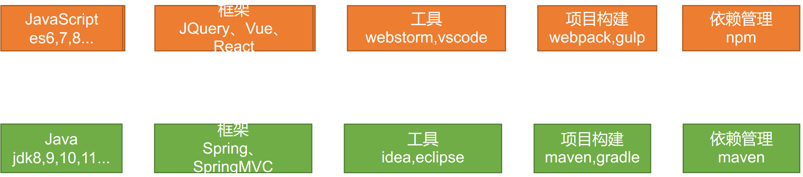

#### ES6

ECMAScript6.0（以下简称ES6，ECMAScript是一种由Ecma国际通过ECMA-262标准化的脚本），是JavaScript语言的下一代标准，2015年6月正式发布，从ES6开始的版本号采用年号，如ES2015，就是ES6。ES2016就是ES7。

ECMAScript是规范，JS的规范的具体实现。

打开VSCode—打开文件夹—新建es6文件夹—新建文件1、let.html—shift+!+Enter生成模板。填入下面内容后，右键open with live server

```
<!DOCTYPE html>
<html lang="en">
<head>
    <meta charset="UTF-8">
    <meta name="viewport" content="width=device-width, initial-scale=1.0">
    <meta http-equiv="X-UA-Compatible" content="ie=edge">
    <title>Document</title>
</head>
<body>
    
    <script>
       // var 声明的变量往往会越域
       // let 声明的变量有严格局部作用域
//         {
//             var a = 1;
//             let b = 2;
//         }
//         console.log(a);  // 1
//         console.log(b);  // ReferenceError: b is not defined
    // var 可以声明多次
            // let 只能声明一次
//         var m = 1
//         var m = 2
//         let n = 3
// //         let n = 4
//         console.log(m)  // 2
//         console.log(n)  // Identifier 'n' has already been declared
        // var 会变量提升
        // let 不存在变量提升
//         console.log(x);  // undefined
//         var x = 10;
//         console.log(y);   //ReferenceError: y is not defined
//         let y = 20;
        // let
        // 1. const声明之后不允许改变
                // 2. 一但声明必须初始化，否则会报错
        const a = 1;
        a = 3; //Uncaught TypeError: Assignment to constant variable.
    
    </script>
</body>
</html>
• 1
• 2
• 3
• 4
• 5
• 6
• 7
• 8
• 9
• 10
• 11
• 12
• 13
• 14
• 15
• 16
• 17
• 18
• 19
• 20
• 21
• 22
• 23
• 24
• 25
• 26
• 27
• 28
• 29
• 30
• 31
• 32
• 33
• 34
• 35
• 36
• 37
• 38
• 39
• 40
• 41
• 42
• 43
• 44
• 45
• 46
• 47
```

- var在{}之外也起作用
- let在{}不起作用
- var多次声明同一变量不会报错，let多次声明会报错，只能声明一次。
- var 会变量提升（打印和定义可以顺序反）。let 不存在变量提升（顺序不能反）
- let的const声明之后不允许改变

2、解构表达式.html

```
<!DOCTYPE html>
<html lang="en">
<head>
    <meta charset="UTF-8">
    <meta name="viewport" content="width=device-width, initial-scale=1.0">
    <meta http-equiv="X-UA-Compatible" content="ie=edge">
    <title>Document</title>
</head>
<body>
    <script>
        //数组解构
        // let arr = [1,2,3];
        // // let a = arr[0];
        // // let b = arr[1];
        // // let c = arr[2];
        // let [a,b,c] = arr;
        // console.log(a,b,c)
        const person = {
            name: "jack",
            age: 21,
            language: ['java', 'js', 'css']
        }
        //         const name = person.name;
        //         const age = person.age;
        //         const language = person.language;
        //对象解构
        const { name: abc, age, language } = person;
        console.log(abc, age, language)
        //4、字符串扩展
        let str = "hello.vue";
        console.log(str.startsWith("hello"));//true
        console.log(str.endsWith(".vue"));//true
        console.log(str.includes("e"));//true
        console.log(str.includes("hello"));//true
        //字符串模板
        let ss = `<div>
                    <span>hello world<span>
                </div>`;
        console.log(ss);
        //  // 2、字符串插入变量和表达式。变量名写在 ${} 中，${} 中可以放入 JavaScript 表达式。
        function fun() {
            return "这是一个函数"
        }
        let info = `我是${abc}，今年${age + 10}了, 我想说： ${fun()}`;
        console.log(info);
    </script>
</body>
</html>
• 1
• 2
• 3
• 4
• 5
• 6
• 7
• 8
• 9
• 10
• 11
• 12
• 13
• 14
• 15
• 16
• 17
• 18
• 19
• 20
• 21
• 22
• 23
• 24
• 25
• 26
• 27
• 28
• 29
• 30
• 31
• 32
• 33
• 34
• 35
• 36
• 37
• 38
• 39
• 40
• 41
• 42
• 43
• 44
• 45
• 46
• 47
• 48
• 49
• 50
• 51
• 52
• 53
• 54
• 55
• 56
• 57
• 58
```

- 支持`let arr = [1,2,3]; let [a,b,c] = arr;`这种语法
- 支持对象解析：`const { name: abc, age, language } = person;` 冒号代表改名
- 字符串函数
- 支持一个字符串为多行
- 占位符功能 ${}

3、函数优化.html

```
<!DOCTYPE html>
<html lang="en">
<head>
    <meta charset="UTF-8">
    <meta name="viewport" content="width=device-width, initial-scale=1.0">
    <meta http-equiv="X-UA-Compatible" content="ie=edge">
    <title>Document</title>
</head>
<body>
    <script>
        //在ES6以前，我们无法给一个函数参数设置默认值，只能采用变通写法：
        function add(a, b) {
            // 判断b是否为空，为空就给默认值1
            b = b || 1;
            return a + b;
        }
        // 传一个参数
        console.log(add(10));
        //现在可以这么写：直接给参数写上默认值，没传就会自动使用默认值
        function add2(a, b = 1) {
            return a + b;
        }
        console.log(add2(20));
        //2）、不定参数
        function fun(...values) {
            console.log(values.length)
        }
        fun(1, 2)      //2
        fun(1, 2, 3, 4)  //4
        //3）、箭头函数
        //以前声明一个方法
        // var print = function (obj) {
        //     console.log(obj);
        // }
        var print = obj => console.log(obj);
        print("hello");
        var sum = function (a, b) {
            c = a + b;
            return a + c;
        }
        var sum2 = (a, b) => a + b;
        console.log(sum2(11, 12));
        var sum3 = (a, b) => {
            c = a + b;
            return a + c;
        }
        console.log(sum3(10, 20))
        const person = {
            name: "jack",
            age: 21,
            language: ['java', 'js', 'css']
        }
        function hello(person) {
            console.log("hello," + person.name)
        }
        //箭头函数+解构
        var hello2 = ({name}) => console.log("hello," +name);
        hello2(person);
    </script>
</body>
</html>
• 1
• 2
• 3
• 4
• 5
• 6
• 7
• 8
• 9
• 10
• 11
• 12
• 13
• 14
• 15
• 16
• 17
• 18
• 19
• 20
• 21
• 22
• 23
• 24
• 25
• 26
• 27
• 28
• 29
• 30
• 31
• 32
• 33
• 34
• 35
• 36
• 37
• 38
• 39
• 40
• 41
• 42
• 43
• 44
• 45
• 46
• 47
• 48
• 49
• 50
• 51
• 52
• 53
• 54
• 55
• 56
• 57
• 58
• 59
• 60
• 61
• 62
• 63
• 64
• 65
• 66
• 67
• 68
• 69
• 70
• 71
• 72
• 73
• 74
• 75
• 76
```

- 原来想要函数默认值得这么写`b = b || 1;` 现在可以直接写了`function add2(a, b = 1) {`
- 函数不定参数`function fun(...values) {`
- 支持箭头函数（lambda表达式），还支持使用{}结构传入对象的成员

4、对象优化.html

```
<!DOCTYPE html>
<html lang="en">
<head>
    <meta charset="UTF-8">
    <meta name="viewport" content="width=device-width, initial-scale=1.0">
    <meta http-equiv="X-UA-Compatible" content="ie=edge">
    <title>Document</title>
</head>
<body>
    <script>
        const person = {
            name: "jack",
            age: 21,
            language: ['java', 'js', 'css']
        }
        console.log(Object.keys(person));//["name", "age", "language"]
        console.log(Object.values(person));//["jack", 21, Array(3)]
        console.log(Object.entries(person));//[Array(2), Array(2), Array(2)]
        const target = { a: 1 };
        const source1 = { b: 2 };
        const source2 = { c: 3 };
        //{a:1,b:2,c:3}
        Object.assign(target, source1, source2);
        console.log(target);//["name", "age", "language"]
        //2）、声明对象简写
        const age = 23
        const name = "张三"
        const person1 = { age: age, name: name }
        const person2 = { age, name }//声明对象简写
        console.log(person2);
        //3）、对象的函数属性简写
        let person3 = {
            name: "jack",
            // 以前：
            eat: function (food) {
                console.log(this.name + "在吃" + food);
            },
            //箭头函数this不能使用，对象.属性
            eat2: food => console.log(person3.name + "在吃" + food),
            eat3(food) {
                console.log(this.name + "在吃" + food);
            }
        }
        person3.eat("香蕉");
        person3.eat2("苹果")
        person3.eat3("橘子");
        //4）、对象拓展运算符
        // 1、拷贝对象（深拷贝）
        let p1 = { name: "Amy", age: 15 }
        let someone = { ...p1 }
        console.log(someone)  //{name: "Amy", age: 15}
        // 2、合并对象
        let age1 = { age: 15 }
        let name1 = { name: "Amy" }
        let p2 = {name:"zhangsan"}
        p2 = { ...age1, ...name1 } 
        console.log(p2)
    </script>
</body>
</html>
• 1
• 2
• 3
• 4
• 5
• 6
• 7
• 8
• 9
• 10
• 11
• 12
• 13
• 14
• 15
• 16
• 17
• 18
• 19
• 20
• 21
• 22
• 23
• 24
• 25
• 26
• 27
• 28
• 29
• 30
• 31
• 32
• 33
• 34
• 35
• 36
• 37
• 38
• 39
• 40
• 41
• 42
• 43
• 44
• 45
• 46
• 47
• 48
• 49
• 50
• 51
• 52
• 53
• 54
• 55
• 56
• 57
• 58
• 59
• 60
• 61
• 62
• 63
• 64
• 65
• 66
• 67
• 68
• 69
• 70
• 71
• 72
```

- 可以获取map的键值对等`Object.keys()`、values、entries
- Object.assgn(target,source1,source2) 合并
- const person2 = { age, name }//声明对象简写
- …代表取出该对象所有属性拷贝到当前对象。let someone = { …p1 }

5、map和reduce.html

```
<!DOCTYPE html>
<html lang="en">
<head>
    <meta charset="UTF-8">
    <meta name="viewport" content="width=device-width, initial-scale=1.0">
    <meta http-equiv="X-UA-Compatible" content="ie=edge">
    <title>Document</title>
</head>
<body>
    
    <script>
        //数组中新增了map和reduce方法。
        //map()：接收一个函数，将原数组中的所有元素用这个函数处理后放入新数组返回。
         let arr = ['1', '20', '-5', '3'];
         
        //  arr = arr.map((item)=>{
        //     return item*2
        //  });
         arr = arr.map(item=> item*2);
        
         console.log(arr);
        //reduce() 为数组中的每一个元素依次执行回调函数，不包括数组中被删除或从未被赋值的元素，
        //[2, 40, -10, 6]
        //arr.reduce(callback,[initialValue])
        /**
         1、previousValue （上一次调用回调返回的值，或者是提供的初始值（initialValue））
    2、currentValue （数组中当前被处理的元素）
    3、index （当前元素在数组中的索引）
    4、array （调用 reduce 的数组）*/
        let result = arr.reduce((a,b)=>{
            console.log("上一次处理后："+a);
            console.log("当前正在处理："+b);
            return a + b;
        },100);
        console.log(result)
    
    </script>
</body>
</html>
• 1
• 2
• 3
• 4
• 5
• 6
• 7
• 8
• 9
• 10
• 11
• 12
• 13
• 14
• 15
• 16
• 17
• 18
• 19
• 20
• 21
• 22
• 23
• 24
• 25
• 26
• 27
• 28
• 29
• 30
• 31
• 32
• 33
• 34
• 35
• 36
• 37
• 38
• 39
• 40
• 41
• 42
```

- map处理，arr = arr.map(item=> item*2);
- reduce。arr.reduce((原来的值,处理后的值即return的值)=>{

6、promise.html

优化异步操作

```
<!DOCTYPE html>
<html lang="en">
<head>
    <meta charset="UTF-8">
    <meta name="viewport" content="width=device-width, initial-scale=1.0">
    <meta http-equiv="X-UA-Compatible" content="ie=edge">
    <title>Document</title>
    <script src="https://cdn.bootcss.com/jquery/3.4.1/jquery.min.js"></script>
</head>
<body>
    <script>
        //1、查出当前用户信息
        //2、按照当前用户的id查出他的课程
        //3、按照当前课程id查出分数
        // $.ajax({
        //     url: "mock/user.json",
        //     success(data) {
        //         console.log("查询用户：", data);
        //         $.ajax({
        //             url: `mock/user_corse_${data.id}.json`,
        //             success(data) {
        //                 console.log("查询到课程：", data);
        //                 $.ajax({
        //                     url: `mock/corse_score_${data.id}.json`,
        //                     success(data) {
        //                         console.log("查询到分数：", data);
        //                     },
        //                     error(error) {
        //                         console.log("出现异常了：" + error);
        //                     }
        //                 });
        //             },
        //             error(error) {
        //                 console.log("出现异常了：" + error);
        //             }
        //         });
        //     },
        //     error(error) {
        //         console.log("出现异常了：" + error);
        //     }
        // });
        //1、Promise可以封装异步操作
        // let p = new Promise((resolve, reject) => { //传入成功解析，失败拒绝
        //     //1、异步操作
        //     $.ajax({
        //         url: "mock/user.json",
        //         success: function (data) {
        //             console.log("查询用户成功:", data)
        //             resolve(data);
        //         },
        //         error: function (err) {
        //             reject(err);
        //         }
        //     });
        // });
        // p.then((obj) => { //成功以后做什么
        //     return new Promise((resolve, reject) => {
        //         $.ajax({
        //             url: `mock/user_corse_${obj.id}.json`,
        //             success: function (data) {
        //                 console.log("查询用户课程成功:", data)
        //                 resolve(data);
        //             },
        //             error: function (err) {
        //                 reject(err)
        //             }
        //         });
        //     })
        // }).then((data) => { //成功以后干什么
        //     console.log("上一步的结果", data)
        //     $.ajax({
        //         url: `mock/corse_score_${data.id}.json`,
        //         success: function (data) {
        //             console.log("查询课程得分成功:", data)
        //         },
        //         error: function (err) {
        //         }
        //     });
        // })
        function get(url, data) { //自己定义一个方法整合一下
            return new Promise((resolve, reject) => {
                $.ajax({
                    url: url,
                    data: data,
                    success: function (data) {
                        resolve(data);
                    },
                    error: function (err) {
                        reject(err)
                    }
                })
            });
        }
        get("mock/user.json")
            .then((data) => {
                console.log("用户查询成功~~~:", data)
                return get(`mock/user_corse_${data.id}.json`);
            })
            .then((data) => {
                console.log("课程查询成功~~~:", data)
                return get(`mock/corse_score_${data.id}.json`);
            })
            .then((data)=>{
                console.log("课程成绩查询成功~~~:", data)
            })
            .catch((err)=>{ //失败的话catch
                console.log("出现异常",err)
            });
    </script>
</body>
</html>
• 1
• 2
• 3
• 4
• 5
• 6
• 7
• 8
• 9
• 10
• 11
• 12
• 13
• 14
• 15
• 16
• 17
• 18
• 19
• 20
• 21
• 22
• 23
• 24
• 25
• 26
• 27
• 28
• 29
• 30
• 31
• 32
• 33
• 34
• 35
• 36
• 37
• 38
• 39
• 40
• 41
• 42
• 43
• 44
• 45
• 46
• 47
• 48
• 49
• 50
• 51
• 52
• 53
• 54
• 55
• 56
• 57
• 58
• 59
• 60
• 61
• 62
• 63
• 64
• 65
• 66
• 67
• 68
• 69
• 70
• 71
• 72
• 73
• 74
• 75
• 76
• 77
• 78
• 79
• 80
• 81
• 82
• 83
• 84
• 85
• 86
• 87
• 88
• 89
• 90
• 91
• 92
• 93
• 94
• 95
• 96
• 97
• 98
• 99
• 100
• 101
• 102
• 103
• 104
• 105
• 106
• 107
• 108
• 109
• 110
• 111
• 112
• 113
• 114
• 115
• 116
• 117
• 118
```

corse_score_10.json 得分

```
{
    "id": 100,
    "score": 90
}
• 1
• 2
• 3
• 4
```

user.json 用户

```
{
    "id": 1,
    "name": "zhangsan",
    "password": "123456"
}
• 1
• 2
• 3
• 4
• 5
```

user_corse_1.json 课程

```
{
    "id": 10,
    "name": "chinese"
}
• 1
• 2
• 3
• 4
```

以前嵌套ajax的时候很繁琐。

- 把Ajax封装到Promise中，赋值给let p
- 在Ajax中成功使用resolve(data)，失败使用reject(err)
- p.then().catch()

**模块化**

模块化就是把代码进行拆分，方便重复利用。类似于java中的导包，而JS换了个概念，是导模块。

模块功能主要有两个命令构成 export 和import

- export用于规定模块的对外接口
- import用于导入其他模块提供的功能

user.js

```
var name = "jack"
var age = 21
function add(a,b){
    return a + b;
}
export {name,age,add}
• 1
• 2
• 3
• 4
• 5
• 6
• 7
```

hello.js

```
// export const util = {
//     sum(a, b) {
//         return a + b;
//     }
// }
export default {
    sum(a, b) {
        return a + b;
    }
}
// export {util}
//`export`不仅可以导出对象，一切JS变量都可以导出。比如：基本类型变量、函数、数组、对象。
• 1
• 2
• 3
• 4
• 5
• 6
• 7
• 8
• 9
• 10
• 11
• 12
• 13
• 14
```

main.js

```
import abc from "./hello.js"
import {name,add} from "./user.js"
abc.sum(1,2);
console.log(name);
add(1,3);
• 1
• 2
• 3
• 4
• 5
• 6
```

#### Vue

因为这是前端的内容，代码多比较占用页面，所以另写到CSDN上。

https://blog.csdn.net/hancoder/article/details/107007605

MVVM思想

- M：module 包括数据和一些基本操作
- V：view 视图，页面渲染结果
- VM：View-module，模型与视图间的双向操作（无需开发人员干涉）

视图和数据通过VM绑定起来，模型里有变化会自动地通过Directives填写到视图中，视图表单中添加了内容也会自动地通过DOM Listeners保存到模型中。

教程：https://cn.vuejs.org/v2/guide/

安装：

- 直接下载并用 `<script>` 标签引入
- 或者在VScode控制台使用npm install vue导入。

- - 先np init -y初始化项目，生成了一个package.json文件，说明他是一个npm管理的项目
  - npm install vue，安装后在项目node_modules里既有vue

测试

index.html

```
<!DOCTYPE html>
<html lang="en">
<head>
    <meta charset="UTF-8">
    <meta name="viewport" content="width=device-width, initial-scale=1.0">
    <meta http-equiv="X-UA-Compatible" content="ie=edge">
    <title>Document</title>
</head>
<body>
    <div id="app">
        <input type="text" v-model="num">
        <button v-on:click="num++">点赞</button>
        <button v-on:click="cancle">取消</button>
        <h1> {{name}} ,非常帅，有{{num}}个人为他点赞{{hello()}}</h1>
    </div>
    <!-- 导入依赖 -->
    <script src="./node_modules/vue/dist/vue.js"></script>
    <script>
        //1、vue声明式渲染
        let vm = new Vue({ //生成vue对象
            #el: "#app",//绑定元素 div id="app"
            data: {  //封装数据
                name: "张三",  // 也可以使用{} //表单中可以取出
                num: 1
            },
            methods:{  //封装方法
                cancle(){
                    this.num -- ;
                },
                hello(){
                    return "1"
                }
            }
        });
        //2、双向绑定,模型变化，视图变化。反之亦然。
        //3、事件处理
        //v-xx：指令
        //1、创建vue实例，关联页面的模板，将自己的数据（data）渲染到关联的模板，响应式的
        //2、指令来简化对dom的一些操作。
        //3、声明方法来做更复杂的操作。methods里面可以封装方法。
    </script>
</body>
</html>
• 1
• 2
• 3
• 4
• 5
• 6
• 7
• 8
• 9
• 10
• 11
• 12
• 13
• 14
• 15
• 16
• 17
• 18
• 19
• 20
• 21
• 22
• 23
• 24
• 25
• 26
• 27
• 28
• 29
• 30
• 31
• 32
• 33
• 34
• 35
• 36
• 37
• 38
• 39
• 40
• 41
• 42
• 43
• 44
• 45
• 46
• 47
• 48
• 49
• 50
• 51
• 52
• 53
• 54
```

在VSCode中安装vue 2 snippets插件，在谷歌浏览器中安装

1、v-text、v-html.html

```
<!DOCTYPE html>
<html lang="en">
<head>
    <meta charset="UTF-8">
    <meta name="viewport" content="width=device-width, initial-scale=1.0">
    <meta http-equiv="X-UA-Compatible" content="ie=edge">
    <title>Document</title>
</head>
<body>
   
    <div id="app">
        {{msg}}  {{1+1}}  {{hello()}}<br/>
        <span v-html="msg"></span>
        <br/>
        <span v-text="msg"></span>
        
    </div>
   
    <script src="../node_modules/vue/dist/vue.js"></script>
    <script>
        new Vue({
            #el:"#app",
            data:{
                msg:"<h1>Hello</h1>",
                link:"http://www.baidu.com"
            },
            methods:{
                hello(){
                    return "World"
                }
            }
        })
    </script>
    
</body>
</html>
• 1
• 2
• 3
• 4
• 5
• 6
• 7
• 8
• 9
• 10
• 11
• 12
• 13
• 14
• 15
• 16
• 17
• 18
• 19
• 20
• 21
• 22
• 23
• 24
• 25
• 26
• 27
• 28
• 29
• 30
• 31
• 32
• 33
• 34
• 35
• 36
• 37
• 38
```

插值表达式

花括号：只能写在标签体力（<>这里</>）

插值闪烁

2、v-bind.html

```
<!DOCTYPE html>
<html lang="en">
<head>
    <meta charset="UTF-8">
    <meta name="viewport" content="width=device-width, initial-scale=1.0">
    <meta http-equiv="X-UA-Compatible" content="ie=edge">
    <title>Document</title>
</head>
<body>
    <!-- 给html标签的属性绑定 -->
    <div id="app"> 
        <a v-bind:href="link">gogogo</a>
        <!-- class,style  {class名：加上？}-->
        <span v-bind:class="{active:isActive,'text-danger':hasError}"
          :style="{color: color1,fontSize: size}">你好</span>
    </div>
    <script src="../node_modules/vue/dist/vue.js"></script>
    <script>
        let vm = new Vue({
            #el:"#app",
            data:{
                link: "http://www.baidu.com",
                isActive:true,
                hasError:true,
                color1:'red',
                size:'36px'
            }
        })
    </script>
</body>
</html>
• 1
• 2
• 3
• 4
• 5
• 6
• 7
• 8
• 9
• 10
• 11
• 12
• 13
• 14
• 15
• 16
• 17
• 18
• 19
• 20
• 21
• 22
• 23
• 24
• 25
• 26
• 27
• 28
• 29
• 30
• 31
• 32
• 33
• 34
• 35
• 36
• 37
• 38
• 39
```

3、v-model.html

双向绑定

```
<!DOCTYPE html>
<html lang="en">
<head>
    <meta charset="UTF-8">
    <meta name="viewport" content="width=device-width, initial-scale=1.0">
    <meta http-equiv="X-UA-Compatible" content="ie=edge">
    <title>Document</title>
</head>
<body>
    <!-- 表单项，自定义组件 -->
    <div id="app">
        精通的语言：
            <input type="checkbox" v-model="language" value="Java"> java<br/>
            <input type="checkbox" v-model="language" value="PHP"> PHP<br/>
            <input type="checkbox" v-model="language" value="Python"> Python<br/>
        选中了 {{language.join(",")}}
    </div>
    
    <script src="../node_modules/vue/dist/vue.js"></script>
    <script>
        let vm = new Vue({
            #el:"#app",
            data:{
                language: []
            }
        })
    </script>
</body>
</html>
• 1
• 2
• 3
• 4
• 5
• 6
• 7
• 8
• 9
• 10
• 11
• 12
• 13
• 14
• 15
• 16
• 17
• 18
• 19
• 20
• 21
• 22
• 23
• 24
• 25
• 26
• 27
• 28
• 29
• 30
• 31
• 32
• 33
```

4、v-on.html

```
<!DOCTYPE html>
<html lang="en">
<head>
    <meta charset="UTF-8">
    <meta name="viewport" content="width=device-width, initial-scale=1.0">
    <meta http-equiv="X-UA-Compatible" content="ie=edge">
    <title>Document</title>
</head>
<body>
    <div id="app">
                
        <!--事件中直接写js片段-->
        <button v-on:click="num++">点赞</button>
        <!--事件指定一个回调函数，必须是Vue实例中定义的函数-->
        <button @click="cancle">取消</button>
        <!--  -->
        <h1>有{{num}}个赞</h1>
        <!-- 事件修饰符 -->
        <div style="border: 1px solid red;padding: 20px;" v-on:click.once="hello">
            大div
            <div style="border: 1px solid blue;padding: 20px;" @click.stop="hello">
                小div <br />
                <a href="http://www.baidu.com" @click.prevent.stop="hello">去百度</a>
            </div>
        </div>
        <!-- 按键修饰符： -->
        <input type="text" v-model="num" v-on:keyup.up="num+=2" @keyup.down="num-=2" @click.ctrl="num=10"><br />
        提示：
    </div>
    <script src="../node_modules/vue/dist/vue.js"></script>
    <script>
        new Vue({
            #el:"#app",
            data:{
                num: 1
            },
            methods:{
                cancle(){
                    this.num--;
                },
                hello(){
                    alert("点击了")
                }
            }
        })
    </script>
</body>
</html>
• 1
• 2
• 3
• 4
• 5
• 6
• 7
• 8
• 9
• 10
• 11
• 12
• 13
• 14
• 15
• 16
• 17
• 18
• 19
• 20
• 21
• 22
• 23
• 24
• 25
• 26
• 27
• 28
• 29
• 30
• 31
• 32
• 33
• 34
• 35
• 36
• 37
• 38
• 39
• 40
• 41
• 42
• 43
• 44
• 45
• 46
• 47
• 48
• 49
• 50
• 51
• 52
• 53
• 54
• 55
• 56
• 57
• 58
• 59
```

5、v-for.html

```
<!DOCTYPE html>
<html lang="en">
<head>
    <meta charset="UTF-8">
    <meta name="viewport" content="width=device-width, initial-scale=1.0">
    <meta http-equiv="X-UA-Compatible" content="ie=edge">
    <title>Document</title>
</head>
<body>
    <div id="app">
        <ul>
            <li v-for="(user,index) in users" :key="user.name" v-if="user.gender == '女'">
                <!-- 1、显示user信息：v-for="item in items" -->
               当前索引：{{index}} ==> {{user.name}}  ==>   {{user.gender}} ==>{{user.age}} <br>
                <!-- 2、获取数组下标：v-for="(item,index) in items" -->
                <!-- 3、遍历对象：
                        v-for="value in object"
                        v-for="(value,key) in object"
                        v-for="(value,key,index) in object" 
                -->
                对象信息：
                <span v-for="(v,k,i) in user">{{k}}=={{v}}=={{i}}；</span>
                <!-- 4、遍历的时候都加上:key来区分不同数据，提高vue渲染效率 -->
            </li>
            
        </ul>
        <ul>
            <li v-for="(num,index) in nums" :key="index"></li>
        </ul>
    </div>
    <script src="../node_modules/vue/dist/vue.js"></script>
    <script>         
        let app = new Vue({
            #el: "#app",
            data: {
                users: [{ name: '柳岩', gender: '女', age: 21 },
                { name: '张三', gender: '男', age: 18 },
                { name: '范冰冰', gender: '女', age: 24 },
                { name: '刘亦菲', gender: '女', age: 18 },
                { name: '古力娜扎', gender: '女', age: 25 }],
                nums: [1,2,3,4,4]
            },
        })
    </script>
</body>
</html>
• 1
• 2
• 3
• 4
• 5
• 6
• 7
• 8
• 9
• 10
• 11
• 12
• 13
• 14
• 15
• 16
• 17
• 18
• 19
• 20
• 21
• 22
• 23
• 24
• 25
• 26
• 27
• 28
• 29
• 30
• 31
• 32
• 33
• 34
• 35
• 36
• 37
• 38
• 39
• 40
• 41
• 42
• 43
• 44
• 45
• 46
• 47
• 48
• 49
• 50
• 51
• 52
```

6、v-if和v-show.html

```
<!DOCTYPE html>
<html lang="en">
<head>
    <meta charset="UTF-8">
    <meta name="viewport" content="width=device-width, initial-scale=1.0">
    <meta http-equiv="X-UA-Compatible" content="ie=edge">
    <title>Document</title>
</head>
<body>
    <!-- 
        v-if，顾名思义，条件判断。当得到结果为true时，所在的元素才会被渲染。
        v-show，当得到结果为true时，所在的元素才会被显示。 
    -->
    <div id="app">
        <button v-on:click="show = !show">点我呀</button>
        <!-- 1、使用v-if显示 -->
        <h1 v-if="show">if=看到我....</h1>
        <!-- 2、使用v-show显示 -->
        <h1 v-show="show">show=看到我</h1>
    </div>
    <script src="../node_modules/vue/dist/vue.js"></script>
        
    <script>
        let app = new Vue({
            #el: "#app",
            data: {
                show: true
            }
        })
    </script>
</body>
</html>
• 1
• 2
• 3
• 4
• 5
• 6
• 7
• 8
• 9
• 10
• 11
• 12
• 13
• 14
• 15
• 16
• 17
• 18
• 19
• 20
• 21
• 22
• 23
• 24
• 25
• 26
• 27
• 28
• 29
• 30
• 31
• 32
• 33
• 34
• 35
• 36
• 37
```

7、v-else和v-else-if.html

```
<!DOCTYPE html>
<html lang="en">
<head>
    <meta charset="UTF-8">
    <meta name="viewport" content="width=device-width, initial-scale=1.0">
    <meta http-equiv="X-UA-Compatible" content="ie=edge">
    <title>Document</title>
</head>
<body>
    <div id="app">
        <button v-on:click="random=Math.random()">点我呀</button>
        <span>{{random}}</span>
        <h1 v-if="random>=0.75">
            看到我啦？！ &gt;= 0.75
        </h1>
        <h1 v-else-if="random>=0.5">
            看到我啦？！ &gt;= 0.5
        </h1>
        <h1 v-else-if="random>=0.2">
            看到我啦？！ &gt;= 0.2
        </h1>
        <h1 v-else>
            看到我啦？！ &lt; 0.2
        </h1>
    </div>
    <script src="../node_modules/vue/dist/vue.js"></script>
        
    <script>         
        let app = new Vue({
            #el: "#app",
            data: { random: 1 }
        })     
    </script>
</body>
</html>
• 1
• 2
• 3
• 4
• 5
• 6
• 7
• 8
• 9
• 10
• 11
• 12
• 13
• 14
• 15
• 16
• 17
• 18
• 19
• 20
• 21
• 22
• 23
• 24
• 25
• 26
• 27
• 28
• 29
• 30
• 31
• 32
• 33
• 34
• 35
• 36
• 37
• 38
• 39
• 40
• 41
• 42
• 43
• 44
• 45
```

###### 2、计算属性和侦听器

1、计算属性和侦听器.html

```
<!DOCTYPE html>
<html lang="en">
<head>
    <meta charset="UTF-8">
    <meta name="viewport" content="width=device-width, initial-scale=1.0">
    <meta http-equiv="X-UA-Compatible" content="ie=edge">
    <title>Document</title>
</head>
<body>
    <div id="app">
        <!-- 某些结果是基于之前数据实时计算出来的，我们可以利用计算属性。来完成 -->
        <ul>
            <li>西游记； 价格：{{xyjPrice}}，数量：<input type="number" v-model="xyjNum"> </li>
            <li>水浒传； 价格：{{shzPrice}}，数量：<input type="number" v-model="shzNum"> </li>
            <li>总价：{{totalPrice}}</li>
            {{msg}}
        </ul>
    </div>
    <script src="../node_modules/vue/dist/vue.js"></script>
    <script>
        //watch可以让我们监控一个值的变化。从而做出相应的反应。
        new Vue({
            #el: "#app",
            data: {
                xyjPrice: 99.98,
                shzPrice: 98.00,
                xyjNum: 1,
                shzNum: 1,
                msg: ""
            },
            computed: {
                totalPrice(){
                    return this.xyjPrice*this.xyjNum + this.shzPrice*this.shzNum
                }
            },
            watch: {
                xyjNum(newVal,oldVal){
                    if(newVal>=3){
                        this.msg = "库存超出限制";
                        this.xyjNum = 3
                    }else{
                        this.msg = "";
                    }
                }
            },
        })
    </script>
</body>
</html>
• 1
• 2
• 3
• 4
• 5
• 6
• 7
• 8
• 9
• 10
• 11
• 12
• 13
• 14
• 15
• 16
• 17
• 18
• 19
• 20
• 21
• 22
• 23
• 24
• 25
• 26
• 27
• 28
• 29
• 30
• 31
• 32
• 33
• 34
• 35
• 36
• 37
• 38
• 39
• 40
• 41
• 42
• 43
• 44
• 45
• 46
• 47
• 48
• 49
• 50
• 51
• 52
• 53
• 54
```

2、过滤器.html

```
<!DOCTYPE html>
<html lang="en">
<head>
    <meta charset="UTF-8">
    <meta name="viewport" content="width=device-width, initial-scale=1.0">
    <meta http-equiv="X-UA-Compatible" content="ie=edge">
    <title>Document</title>
</head>
<body>
    <!-- 过滤器常用来处理文本格式化的操作。过滤器可以用在两个地方：双花括号插值和 v-bind 表达式 -->
    <div id="app">
        <ul>
            <li v-for="user in userList">
                {{user.id}} ==> {{user.name}} ==> {{user.gender == 1?"男":"女"}} ==>
                {{user.gender | genderFilter}} ==> {{user.gender | gFilter}}
            </li>
        </ul>
    </div>
    <script src="../node_modules/vue/dist/vue.js"></script>
    <script>
        Vue.filter("gFilter", function (val) {
            if (val == 1) {
                return "男~~~";
            } else {
                return "女~~~";
            }
        })
        let vm = new Vue({
            #el: "#app",
            data: {
                userList: [
                    { id: 1, name: 'jacky', gender: 1 },
                    { id: 2, name: 'peter', gender: 0 }
                ]
            },
            filters: {
                 filters 定义局部过滤器，只可以在当前vue实例中使用
                genderFilter(val) {
                    if (val == 1) {
                        return "男";
                    } else {
                        return "女";
                    }
                }
            }
        })
    </script>
</body>
</html>
• 1
• 2
• 3
• 4
• 5
• 6
• 7
• 8
• 9
• 10
• 11
• 12
• 13
• 14
• 15
• 16
• 17
• 18
• 19
• 20
• 21
• 22
• 23
• 24
• 25
• 26
• 27
• 28
• 29
• 30
• 31
• 32
• 33
• 34
• 35
• 36
• 37
• 38
• 39
• 40
• 41
• 42
• 43
• 44
• 45
• 46
• 47
• 48
• 49
• 50
• 51
• 52
• 53
• 54
• 55
```

###### 3、组件化

```
<!DOCTYPE html>
<html lang="en">
<head>
    <meta charset="UTF-8">
    <meta name="viewport" content="width=device-width, initial-scale=1.0">
    <meta http-equiv="X-UA-Compatible" content="ie=edge">
    <title>Document</title>
</head>
<body>
    <div id="app">
        <button v-on:click="count++">我被点击了 {{count}} 次</button>
        <counter></counter>
        <counter></counter>
        <counter></counter>
        <counter></counter>
        <counter></counter>
        <button-counter></button-counter>
    </div>
    <script src="../node_modules/vue/dist/vue.js"></script>
    <script>
        //1、全局声明注册一个组件
        Vue.component("counter", {
            template: `<button v-on:click="count++">我被点击了 {{count}} 次</button>`,
            data() {
                return {
                    count: 1
                }
            }
        });
        //2、局部声明一个组件
        const buttonCounter = {
            template: `<button v-on:click="count++">我被点击了 {{count}} 次~~~</button>`,
            data() {
                return {
                    count: 1
                }
            }
        };
        new Vue({
            #el: "#app",
            data: {
                count: 1
            },
            components: {
                'button-counter': buttonCounter
            }
        })
    </script>
</body>
</html>
• 1
• 2
• 3
• 4
• 5
• 6
• 7
• 8
• 9
• 10
• 11
• 12
• 13
• 14
• 15
• 16
• 17
• 18
• 19
• 20
• 21
• 22
• 23
• 24
• 25
• 26
• 27
• 28
• 29
• 30
• 31
• 32
• 33
• 34
• 35
• 36
• 37
• 38
• 39
• 40
• 41
• 42
• 43
• 44
• 45
• 46
• 47
• 48
• 49
• 50
• 51
• 52
• 53
• 54
• 55
• 56
• 57
• 58
• 59
• 60
```

######  

#### 4、生命周期钩子函数

```
<!DOCTYPE html>
<html lang="en">
<head>
    <meta charset="UTF-8">
    <meta name="viewport" content="width=device-width, initial-scale=1.0">
    <meta http-equiv="X-UA-Compatible" content="ie=edge">
    <title>Document</title>
</head>
<body>
    <div id="app">
        <span id="num">{{num}}</span>
        <button @click="num++">赞！</button>
        <h2>{{name}}，有{{num}}个人点赞</h2>
    </div>
    <script src="../node_modules/vue/dist/vue.js"></script>
    
    <script>
        let app = new Vue({
            #el: "#app",
            data: {
                name: "张三",
                num: 100
            },
            methods: {
                show() {
                    return this.name;
                },
                add() {
                    this.num++;
                }
            },
            beforeCreate() {
                console.log("=========beforeCreate=============");
                console.log("数据模型未加载：" + this.name, this.num);
                console.log("方法未加载：" + this.show());
                console.log("html模板未加载：" + document.getElementById("num"));
            },
            created: function () {
                console.log("=========created=============");
                console.log("数据模型已加载：" + this.name, this.num);
                console.log("方法已加载：" + this.show());
                console.log("html模板已加载：" + document.getElementById("num"));
                console.log("html模板未渲染：" + document.getElementById("num").innerText);
            },
            beforeMount() {
                console.log("=========beforeMount=============");
                console.log("html模板未渲染：" + document.getElementById("num").innerText);
            },
            mounted() {
                console.log("=========mounted=============");
                console.log("html模板已渲染：" + document.getElementById("num").innerText);
            },
            beforeUpdate() {
                console.log("=========beforeUpdate=============");
                console.log("数据模型已更新：" + this.num);
                console.log("html模板未更新：" + document.getElementById("num").innerText);
            },
            updated() {
                console.log("=========updated=============");
                console.log("数据模型已更新：" + this.num);
                console.log("html模板已更新：" + document.getElementById("num").innerText);
            }
        });
    </script>
</body>
</html>
```

最近在忙，后面的还没更新整理。下面的笔记可能是官方的

- 个人笔记（很细节）：https://blog.csdn.net/hancoder/article/details/106922139
- 官方笔记-基础篇：https://blog.csdn.net/hancoder/article/details/107612619
- 官方笔记-高级篇：https://blog.csdn.net/hancoder/article/details/107612746
- 官方笔记-集群篇：https://blog.csdn.net/hancoder/article/details/107612802
- 官方笔记下载地址：https://download.csdn.net/download/hancoder/12665396