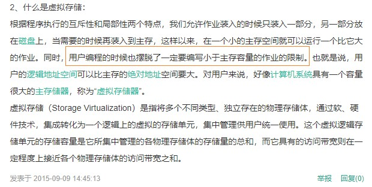

看一下微信自己（答疑）和群的聊天记录，别的班的重点

- 下面临界区概念论述正确的是(      )  
A.临界区是指进程中用于实现进程互斥的那段程序代码  
B.临界区是指进程中用于实现进程同步的那段程序代码  
C.临界区是指进程中用于实现进程通信的那段程序代码  
D.临界区是指并发进程中与共享变量有关的程序段  

> 答案：D
> 

- 解决碎片问题，以及使程序可浮动的最好的办法是采用（）技术。  
A.静态重定位  
B.动态重定位  
C.内存静态分配  
D.内存动态分配  

> 正确答案：B
> 

- 实现虚拟存储器的目的是(      )
A.实现存储保护  
B.实现程序浮动  
C.扩充辅存容量  
D.扩充主存容量
  
> 正确答案：D  
> 程序浮动则可以用分页来解决，但是虚拟存储器不一定能分页，虚拟存储器必须使用分页，不然装不进内存
> 

- 同一文件在不同的存储介质上______的组织形式。(      )  
A.应该有相同  
B.可以有不同  
C.必定用不同  
D.无所谓

> 正确答案：B  
> 存储介质：如U盘（闪存的一种）、光盘等  
> 基本的文件物理组织形式有：连续文件（`块是连续的`）、链接文件、索引文件和多重索引文件。  
> 连续文件（又称作顺序文件）是基于`磁带`设备的最简单的物理文件结构．它是把一个逻辑上连续的文件信息存放在连续编号的物理块（或物理记录）中。  
> 然后好像记得Linux可以把不是Ext2的文件看成是Ext2的文件。  
> Linux的物理组织形式是多重索引文件，tar后备到磁带上是连续文件

- 在下列存储管理方案中，能实现虚存的有(          )  
A.固定分区分配  
B.可变分区  
C.分页存储管理  
D.分段存储管理  
E.段页式存储管理  

> 正确答案：C D E  
> 为什么分段式存储管理也能实现虚拟存储呢？  
> 

- ______必定会引起进程切换。(          )  
A.一个进程被创建后进入就绪态  
B.一个进程从运行态变成等待态  
C.一个进程从运行态变成就绪态  
D.一个进程从等待态变成就绪态  
E.一个进程从就绪态变成运行态  

> 答案：B C E

> 文件的物理组织形式有：连续文件、链接文件、索引文件、连续索引文件；  
> 连续文件有一个致命的缺点是：要求文件在创建时就要指定大小，如果后面因为数据过多而导致需要增加磁盘块，很可能需要“大搬家”  
> 拓展：文件的逻辑组织形式有：有结构文件（记录型文件）、无结构文件（流式文件，即字节流文件）

> D选项: 输入输出完成后，会向系统发起中断，（这个时候，处理器能进行页面调度，但是处理器要不要页面调度，是处理器自己的事）

- 主存管理中，把逻辑地址转换为绝对地址称为`重定位`或`地址转换`。

- 目前常用的空闲磁盘空间管理技术，主要包括`空闲空间表法`、`空闲块链接法`、`位示图法`和`空闲块成组链接法`。

- 什么是操作系统（OS）？它的主要功能是什么？

> 答：操作系统是控制和管理计算机系统内各种硬件和软件资源、`有效地组织多道程序运行的系统软件（或程序集合）`，是用户与计算机之间的接口。  
> 操作系统应具备的五大基本功能，即存储管理、进程和处理机管理、文件管理、设备管理、`用户接口`。

> 操作系统中以缓冲方式实现设备的输入/输出操作主要足缓解`处理机与设备`之间速度不匹配的矛盾，并减少对CPU的I/O中断次数从而提高资源利用率和系统效率，解决CPU与外部设备之间速度的不匹配。

- 产生死锁的`根本原因`是资源有限且进程推进速度不当
- 操作系统为用户提供两个接口：`命令接口和系统调用(程序接口)`

- `通道和DMA都是硬件`，它们都能实现IO设备和内存之间建立数据直传通路；但是DMA只能实现固定的数据传送控制，而通道有自己的指令和程序，具有更强的独立处理数据输入和输出的能力。

- 信号量要写的详细点：

> 

> 区分好最`佳`适应算法和最`先`适应算法

> 设置一些重要的数据，只能在内核态下设置；如果是读取数据，可以在用户态下设置。[详细参考链接](https://blog.csdn.net/frozenshore/article/details/48739009)

> 
> 

- 16进制写法：125C（H）

> 答案：A
> 地址转换就是由`硬件`完成的。页表是由`操作系统`建立的。不要再选择什么地址转换程序，地址转换机构了·····

> 答案：C  
> 有结构文件：  
> 