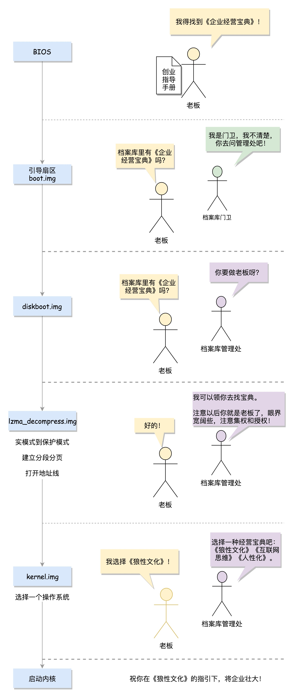

> 参考资料：<https://time.geekbang.org/column/article/89739>  
> 前言：计算机要正常工作，要CPU、内存、磁盘/BIOS相互配合才行

x86有两种模式:

- 一种模式是实模式，只能寻址1M，每个段最多64k。在我们摁下开机键就是处于这种模式。
- 另一种模式是保护模式，对于32位系统，能够寻址4G（32位架构下，可用地址线是36个，即2^32B）,保护模式由实模式引导。

### BIOS时期

当你轻轻按下计算机的启动按钮时，你的主板就加上电了。

在这个时候，没有操作系统，内存也是空的，CPU该怎么办呢？

在主板上，有一个东西叫ROM（Read Only Menory,只读存储器），在ROM上面固化了一些初始化的程序，也就是BIOS（Basic I/0 System,基本输入输出系统），CPU就执行上面的程序。

在开头我们讲到，在实模式下只有1M(1^20B,用16进制表示为5位)的内存地址空间。


在x86系统中，将1M空间上面的的0xF0000到0xFFFFF这64K（2^16B）映射给ROM，也就是说，到这部分地址访问的时候，会访问ROM。

当电脑刚加电的时候，会做一些重置工作，将CS（code segment,代码段寄存器）设置为0xFFFF,将IP设置为0x0000，所以第一条指令指向0xFFFF0(0xFFFF向左偏移4位，再加上IP的0x0000,[详细解释](https://time.geekbang.org/column/article/89417))，正是在ROM的范围内。在这里，有一个JMP命令会跳到ROM中做初始化工作的代码，于是，BIOS开始进行初始化工作。

- 初始化工作1：BIOS检查系统的硬件是不是都好着。
- 初始化工作2：BIOS要建立中断向量表和中断服务程序，用来接收鼠标和键盘产生的中断（因为在BIOS界面，我们可以用鼠标和键盘更改BIOS的选项）。  
  （这个时期如果用户进行了某些操作，会在内存空间映射到显存空间，在显示器上显示一些字符）

### bootloader时期

BIOS能够将初始化工作加载到内存中，但是要启动什么系统，这就要看用户的选择了（用户能启动什么系统）。

操作系统安装在哪里呢？一般都会安装在硬盘上。在BIOS的界面上，你会看到一个启动盘的选项。  

启动盘有什么特点呢？它一般在第一个扇区，占512字节，而且以0xAA55（1010 1010 0101 0101）结束。这是一个约定，当满足这个条件的时候，就说明这是一个启动盘，在512字节以内会启动相关的代码。

这些代码是谁放在这里的呢？在Linux里面有一个工具，叫Grub2（Grand Unified Bootloader Version 2）。顾名思义，就是搞系统启动的。

可以通过grub2-mkconfig -o /boot/grub2/grub.cfg来配置系统的选项。

```bash
vim grub2-mkconfig -o /boot/grub2/grub.cfg
```

使用`grub2-install /dev/sda`,可以将启动程序安装到相应的位置。

grub2第一个要安装的是boot.img，一共512字节，正式安装到启动盘的第一个扇区MBR（Master Boot Record,主引导记录/扇区）。

BIOS完成任务后，会将boot.img从硬盘加载到内存中运行。

boot.img因为只有512字节，做的做重要的一件事就是加载grub2的另一个镜像 core.img.

core.img的组成如下：


boot.img先加载core.img的第一个扇区，对应的是diskboot.img。

diskboot.img的任务是将core.img的其他部分加载进来，先是解压lzma_decompress.img，再往下是kernel.img，最后是各个模块module对应的映像。

lzma_decompress.img 做了一个重要的决定，就是调用 real_to_prot，切换到保护模式，这样就能在更大的寻址空间里面，加载更多的东西。

### 从实模式到保护模式

切换到保护模式要干很多工作，大部分工作都与内存的访问方式有关。

- 第一项是启用分段（辅助进程管理），就是在内存里面建立段描述符表，将寄存器里面的段寄存器变成段选择子，指向某个段描述符，这样就能实现不同进程的切换了。
- 第二项是启动分页（辅助内存管理）。能够管理的内存变大了，就需要将内存分成相等大小的块，这些我们放到内存那一节详细再讲。
- 保护模式需要做一项工作，那就是打开 Gate A20，也就是第 21 根地址线的控制线。在实模式 8086 下面，一共就 20 个地址线，可访问 1M 的地址空间。如果超过了这个限度怎么办呢？当然是绕回来了。在保护模式下，第 21 根要起作用了，于是我们就需要打开 Gate A20。

kernel.img中会调用 grub_main，这是 grub kernel 的主函数。在这个函数的最后，会显示出让你选择的那个操作系统的列表。

### 总结

主板ROM上有BIOS程序  
BIOS加载到内存中执行  
BIOS检查完硬件后，加载引导Grub2

Grub2切换到保护模式，并选择系统启动  
-->保护模式：分段（辅助进程管理），分页（辅助内存管理）


