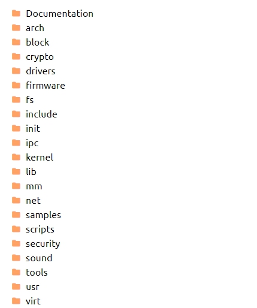

### 从QQ的启动和聊天认识Linux操作系统

我们启动QQ，并时候QQ跟别人聊天，这个过程看似简单，但是实际上涵盖了操作系统的所有功能。

#### 双击QQ图标 启动QQ这个过程，发生了什么

操作系统利用`设备管理子系统`管理设备。鼠标作为计算机的`输入设备`，操作系统利用`输入设备驱动程序`连接硬件和操作系统。当我们的鼠标点击QQ图标后，输入设备驱动程序就发起一个`中断`，请求进行`系统调用`。

操作系统根据中断的类型，得知是要打开QQ。这个时候，操作系统就应该为QQ`创建一个进程`。那怎么样才能创建这个进程呢？

QQ如何执行都已经作为程序逻辑写在`程序`里面了，并且已经编译成`二进制文件`。这些二进制文件存放在`硬盘`上。硬盘是个物理设备，要按照规定`格式化成文件系统`，才能存放这些文件。操作系统利用`文件管理子系统`进行文件的管理。

所以，为了创建QQ这个进程，操作系统需要利用文件管理子系统找到QQ的二进制文件，找到后就能创建QQ的进程了。

创建QQ的进程后，操作系统能够利用`进程管理子系统`，为QQ的进程分配CUP时间片，同时，利用`内存管理子系统`管理和分配内存。

QQ 启动之后，有一部分代码会在显示器上画一个对话框，并且将键盘的焦点放在了输入框里面。CPU 根据这些指令，就会告知`显卡驱动程序`，将这个对话框画出来。

#### 回车发送消息这个过程，发生了什么

当我们想要跟别人聊天时，我们会通过键盘打字。键盘也是`输入设备`，也会`触发中断`，通知相应的`输入设备驱动程序`。

操作系统知道，这个事件是给这个QQ进程的。QQ 的代码里面肯定有遇到这种事件如何处理的代码，就会执行。一般是记录下客户的输入，并且告知`显卡驱动程序`，在那个地方画一个“a”。显卡画完了，客户看到了，就觉得自己的输入成功了。

当用户输入完毕之后，回车一下，还是会通过`键盘驱动程序`告诉操作系统，操作系统还是会找到 QQ，QQ 会将用户的输入发送到网络上。QQ 进程是不能直接发送网络包的，需要调用`系统调用`，内核使用`网卡驱动程序`进行发送。

#### 操作系统内核体系结构

从上面可以看到，启动QQ其实是一件很麻烦的事，操作系统将很多复杂的东西管理起来，从而呈现出简单的东西，让父母都会使用。

所以说，哪有什么岁月静好，只不过有人替你负重前行。而操作系统就扮演了这样一个负重前行的角色。

#### Linux源码

Linux源码是开源的，学习Linux的源码是很有必要的。我们可以从以下几个途径查看Linux源码

- [Github: Linux源码](https://github.com/torvalds/linux)
- [在线代码](https://elixir.bootlin.com/linux/v4.0/source)
- [官网](https://www.kernel.org/)

Linux源码有很多东西，一开始看会很容易让人摸不清楚头脑。我们可以从Linux的大概框架入手：

| 功能        | 所在的文件夹                                           |
| :---------- | :----------------------------------------------------- |
| 系统调用    | kernel/                                                |
| 进程管理    | kernel/, arch/某种架构/kernel/                         |
| 内存管理    | mm/ (memory manage),arch/某种架构/mm/                  |
| 文件管理    | fs/                                                    |
| 设备管理    | drivers/char/（字符型设备）, drivers/block/ （块设备） |
| 网络管理    | net/                                                   |
| 进程间通信  | ipc/                                                   |
| Linux初始化 | init/                                                  |
