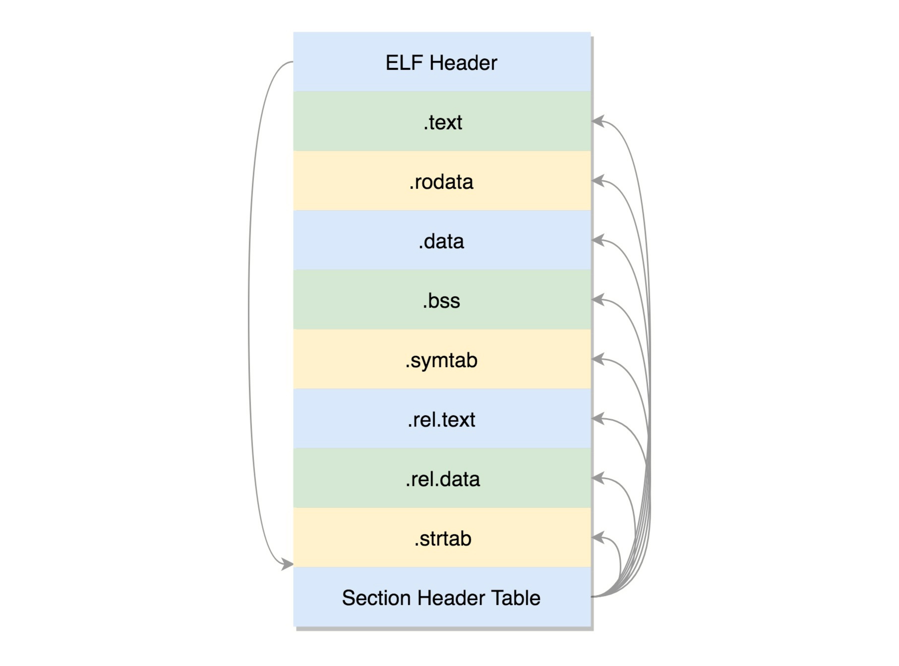
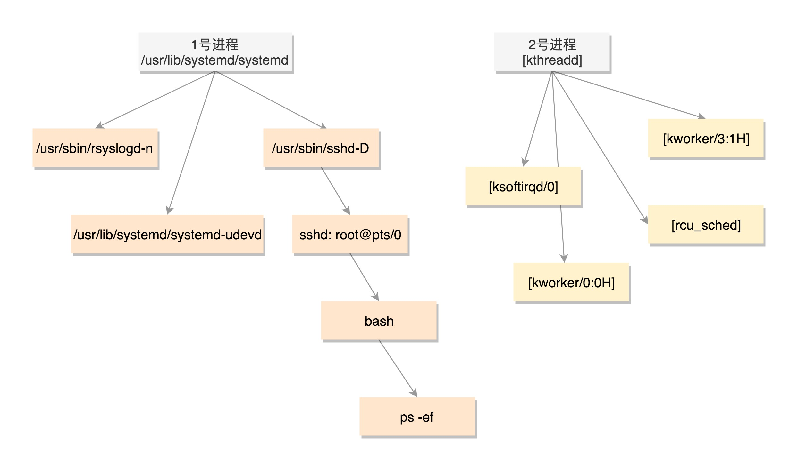

## 从代码到进程

在 Linux 下面，二进制的程序也要有严格的格式，这个格式我们称为 `ELF`（Executeable and Linkable Format，`可执行与可链接格式`）。这个格式可以根据编译的结果不同，分为不同的格式。

接下来我们看一下，如何从文本文件编译成二进制格式。


在编译的时候，先做预处理工作，例如`将头文件嵌入到正文中，将定义的宏展开`，然后就是真正的编译过程，最终编译成为`.o 文件`，这就是 ELF 的`第一种类型`，`可重定位文件`（Relocatable File）。

这个文件的格式是这样的：



- .text：放编译好的二进制可执行代码
- .rodata：只读数据，例如字符串常量、const 的变量
- .data：已经初始化好的全局变量
- .bss：未初始化全局变量，运行时会置 0
- .symtab：符号表，记录的则是函数和变量
- .strtab：字符串表、字符串常量和变量名

为啥这里只有全局变量呢？其实前面我们讲函数栈的时候说过，`局部变量是放在栈里面的`，是程序运行过程中随时分配空间，随时释放的，现在我们讨论的是二进制文件，还没启动呢，所以只需要讨论在哪里保存全局变量。

现在这个时候，还是.o 文件，不是一个可以直接运行的程序，这里面只是部分代码片段。要能够运行，还需要链接其他程序。

链接后形成的二进制文件叫`可执行文件`，是 ELF 的第二种格式，格式如下：


但是，链接的话，又分为静态链接和动态链接。

程序一旦和`静态链接库`链接，代码和变量的section都合并了，因为程序运行的时候，就`不依赖于`这个库是否存在。但是这样有一个缺点，就是相同的代码段，如果被多个程序同时使用的话，在内存中就有很多份，而且一旦静态链接库更新了，如果二进制执行文件不重新编译，也不随着更新。

因而出现了另一种，`动态链接库`，不仅仅是一组对象文件的简单归档，而是多个对象文件的重新组合，`可被多个程序共享`。

当一个动态链接库被链接到一个程序文件中的时候，最后的程序文件并`不包括动态链接库中的代码`，而仅仅包括对动态链接库的`引用`，并且不保存动态链接库的`全路径`，仅仅保存`动态链接库的名称`。

当运行这个程序的时候，首先`寻找动态链接库，然后加载它`。默认情况下，系统在 `/lib` 和 `/usr/lib` 文件夹下`寻找动态链接库`。如果找不到就会报错，我们可以设定 LD_LIBRARY_PATH `环境变量`，程序运行时会在此环境变量指定的文件夹下寻找动态链接库。

动态链接库，就是 ELF 的第三种类型，共享对象文件（Shared Object）。

### 运行程序为进程

知道了 ELF 这个格式，这个时候它还是个程序，那怎么把这个文件加载到内存里面呢？

在内核中，有这样一个数据结构，用来定义加载二进制文件的方法。

```c
struct linux_binfmt {
        struct list_head lh;
        struct module *module;
        int (*load_binary)(struct linux_binprm *);
        int (*load_shlib)(struct file *);
        int (*core_dump)(struct coredump_params *cprm);
        unsigned long min_coredump;     /* minimal dump size */
} __randomize_layout;
```

对于 ELF 文件格式，有对应的实现。

```c
static struct linux_binfmt elf_format = {
        .module         = THIS_MODULE,
        .load_binary    = load_elf_binary,
        .load_shlib     = load_elf_library,
        .core_dump      = elf_core_dump,
        .min_coredump   = ELF_EXEC_PAGESIZE,
};
```

其中load_elf_binary，使用`exec`底层是调用这个，`加载内核镜像`也是调用这个方法。

### 进程树

既然所有的进程都是从父进程 fork 过来的，那总归有一个祖宗进程，这就是咱们系统启动的 init 进程。



### 总结

这一节我们讲了一个进程从代码到二进制到运行时的一个过程，我们用一个图总结一下。

我们首先通过图右边的文件编译过程，生成 so 文件和可执行文件，放在硬盘上。下图左边的用户态的进程 A 执行 fork，创建进程 B，在进程 B 的处理逻辑中，执行 exec 系列系统调用。这个系统调用会通过 load_elf_binary 方法，将刚才生成的可执行文件，加载到进程 B 的内存中执行。


### 参考资料

[10 | 进程：公司接这么多项目，如何管？](https://time.geekbang.org/column/article/90855)