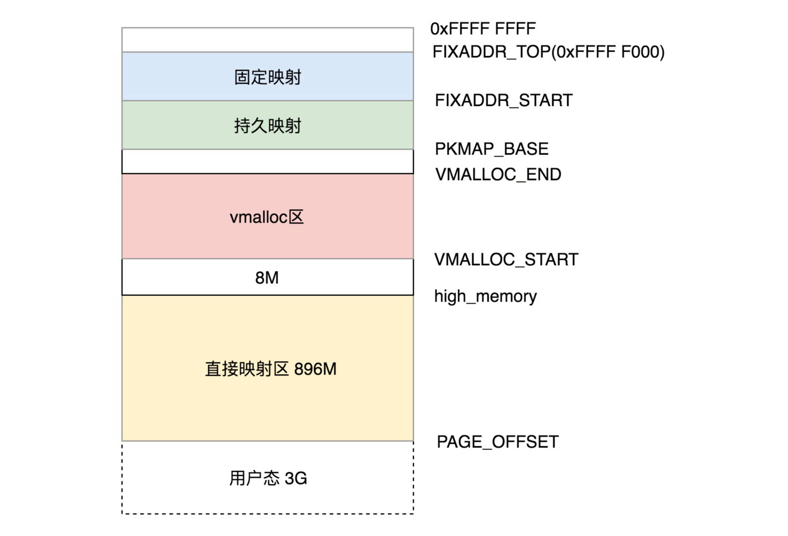

## 内存管理

### 内存管理

操作系统的内存管理，至少包括以下三个方面：

1. `虚拟内存管理`，`每个进程看到的用户空间都是自己的，看到的内核空间是一样的`
2. `物理内存管理`，只有内存管理模块才能使用
3. `内存映射`，需要将物理内存和虚拟内存联系起来

进程的将自己的用户空间划分多个Segment:

- Text Segment：用来存放二进制可执行代码
- Data Segment：存放静态常量
- BSS Segment：存放未初始化的静态常量 【上面三个结构的数据是从ELF得到的】
- Heap堆：堆是高地址增长的，用来动态分配内存区域
- Memory Mapping Segment：这块区域用来把文件映射进内存，如果二进制执行文件依赖某个动态链接库，就是在这个区域将so文件映射进来
- Stack栈：主线程的函数调用栈就是在这里

内核也是有Text Segment, Data Segment, BSS Segment，因为内核代码也是ELF格式的。


### 分段

分段机制下的虚拟地址由两部分组成，`段选择子`和`段内偏移量`。段选择子保存在段寄存器里。段选择子里面最重要的是段号，用作段表的索引。

段表（Linux中也叫段描述符）里面保存的是这个段的基地址、段的界限和特权等级。

在Linux中，`段表`又称`段描述符表`，放在全局描述符表GDT中。  

在Linux中，定义了四个段：`内核代码段、内核数据段、用户代码段、用户数据段`。但是这四个段的起始地址都是0。所以也可以说，Linux没有分段，因为都视作一个段。Linux分段是因为要考虑从架构上考虑的，x86规定了要分段。

Linux分段还是有作用的，作为`权限审核`。例如用户态DPL是3，内核态DPL是0.


### 分页

`Linux更倾向于分页`。

物理内存分块，用户内存分页，页的大小一般为4kB。

物理内存分为两部分，页号和页内偏移。页号作为页表的索引。

Linux采用的是四级页表


### 进程空间管理

task_struct中有一个 struct mm_struct 结构来管理内存。

```c
struct mm_struct    *mm;
```

在 struct mm_struct 里面，有这样一个成员变量用来记录用户空间的大小

```c
unsigned long task_size;    /* size of task vm space */
```


### 用户态布局

之前我们讲了用户态虚拟空间里面有几类数据，例如代码、全局变量、堆、栈、内存映射区等。在 struct mm_struct 里面，有下面这些变量定义了这些区域的统计信息和位置。

```c
unsigned long mmap_base;  /* base of mmap area */
unsigned long total_vm;    /* Total pages mapped */
unsigned long locked_vm;  /* Pages that have PG_mlocked set */
unsigned long pinned_vm;  /* Refcount permanently increased */
unsigned long data_vm;    /* VM_WRITE & ~VM_SHARED & ~VM_STACK */
unsigned long exec_vm;    /* VM_EXEC & ~VM_WRITE & ~VM_STACK */
unsigned long stack_vm;    /* VM_STACK */
unsigned long start_code, end_code, start_data, end_data;
unsigned long start_brk, brk, start_stack;
unsigned long arg_start, arg_end, env_start, env_end;
```


除了位置信息之外，struct mm_struct 里面还专门有一个结构 `vm_area_struct`，来描述这些`区域的属性`。


### 内核态的布局

内核态的虚拟空间和某一个进程没有关系，`所有进程通过系统调用进入到内核之后，看到的虚拟地址空间都是一样的`。

这里强调一下，千万别以为到了内核里面，咱们就会直接使用物理内存地址了，想当然地认为下面讨论的都是物理内存地址，不是的，这里讨论的`还是虚拟内存地址`，但是由于内核总是涉及管理物理内存，因而总是隐隐约约发生关系，所以这里必须思路清晰，分清楚物理内存地址和虚拟内存地址。

我们来看 32 位的内核态的布局。



32位的内核虚拟空间一共就4G，占绝大部分的前896M，我们称为`直接映射区`。

直接映射区映射到物理内存也是需要通过页表的。只不过直接映射区和物理内存是`线性关系`。

这896M还需要仔细分解。在系统启动的时候，物理内存的前1M已经被占用了，从这`1M后`开始加载`内核代码段`，然后就是`内核的全局变量BSS(ELF里面涵盖)`。具体的物理内存布局可以查看/proc/iomem

如果有新的线程创建，新创建的task_struct和内核栈也会放在 3G至3G+896M的虚拟空间中。当然，相应的页表也会被创建。

896M 这个值在内核中被定义为 high_memory，在此之上常称为“高端内存”。

在896M 到 VMALLOC_START 之间有8M的空间。

`VMALLOC_START` 到 `VMALLOC_END` 之间称为`内核动态映射空间`，也即内核也想 像用户态进程一样malloc申请空间，在内核里可以vmalloc。

PKMAP_BASE到FIXADDR_START 的空间成为持久内核映射。使用alloc_pages()函数的时候，在物理内存的高端内存得到struct page结构，可以调用kmap将其映射到这个区域。

FIXADDR_START 到FIXADDR_TOP（0xFFFF F000）的空间，称为固定映射区域，主要用于满足特殊需求


### 参考链接

[内存管理（上）](https://time.geekbang.org/column/article/94926)
[22 | 进程空间管理](https://time.geekbang.org/column/article/95715)