## 3.1 调度的作用和级别

标题作为处理机调度，这里先说一下处理机，`处理机包括：CPU，主存储器和输入输出接口`。处理机再加外围设备就构成完整的计算机系统。

调度是资源管理的一个重要问题。因为CPU也是资源。

调度，是指对有限的`资源`按照一定的算法进行合理的`分配`使用。

在操作系统中，处理机调度的`主要目的`就是分配处理机。具体讲，处理机分配由调度和分派两个功能组成。

1. 调度：组织和维护就绪队列，包括确定调度算法，按调度算法组织和维护就绪进程队列。
2. 分派：指当处理机空闲时，就从就绪队列首中移出一个PCB，并将该进程投入运行。

大家习惯上述两种功能成为`进程调度`（即刚刚说的`分配处理机`）

除此之外，处理机调度还有`磁盘调度、打印机调度`等。

同时，注意一点，进程切换是要付出代价的：保留进程的运行环境、恢复另一个进程的运行环境、使高速缓存失效、强迫缓存从内存中重新动态装入两次（进入内核两次、退出内核两次）

**调度的级别：**

`高级调度（作业调度）`：根据一定的算法，从输入的一批作业中选出若干个作业，分配`内存、外设等资源`；为他们建立相应的用户作业进程和其服务的系统进程，把他们的程序和数据调入内存，等待处理的调度，并在作业完成后进行善后处理工作。

`中级调度`：把某些进程从内存中移到外存上，应用在采用`虚拟存储技术`的系统或`分时系统`中。采用中级调度是为了提高内存的利用率和系统吞吐量（可以运行更多的进程）

`低级调度（进程调度）`：分配CPU

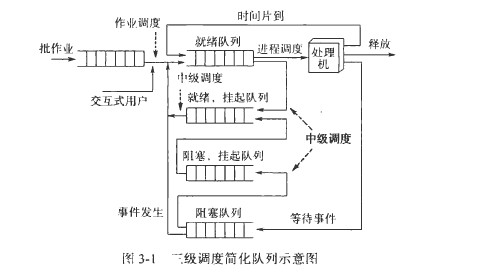

## 3.2 作业调度

作业状态分为四种：提交、后备、执行和完成。

1. 提交状态（作业交给调度程序了嘛）：向用户系统提交一个作业
2. 后备状态：等待进入内存的状态
3. 执行状态：分配到所需的资源，即调入内存，并能在CPU上执行。
4. 完成状态：回收资源

### 作业管理和调度

首先说明：`Linux系统中没有作业调度`。

在多道批处理系统中，有上百个作业收容在输出井（磁盘）中。为了管理和调度作业，系统为每个作业设置了JCB（作业控制块）。

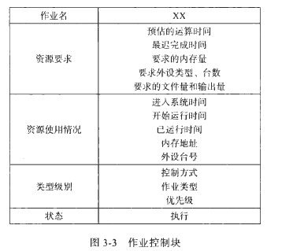

**作业调度的功能：**

如上所述．作业调度的主要任务是完成作业从`后备状态到执行状态`和从`执行状态到完成状态`的转换。通常来说，需要完成以下功能：

1. 记录系统中各个作业的情况。要当好指挥，必须对所管对象心中有数。
2. 按照某种调度算法从后备作业队列中`挑选作业`，即决定接纳多少个作业进入内存和挑选哪些作业进入内存。
3. 为选中的作业`分配内存和外设等资源`。
4. 为选中的作业建立相应的`进程`，并把该进程放入就绪队列中。
5. 作业结束后进行善后处理工作。

## 3.3 进程调度

### 进程调度的功能和时机

进程只有在得到CPU后才能真正活动起来。进程调度负责动态地把处理器分配给进程，故又称为处理器调度或低级调度。

进程调度程序是操作系统中实现进程调度的程序，它完成进程状态从就绪态到运行态的转化。实际上，`进程调度程序完成一台物理的CPU 转变成多台虚拟（或逻辑）的CPU 的工作。`

**进程调度的主要功能：**

1. 保存现场：`将程序计数器PC、通用寄存器的内容`保存在进程的PCB的现场信息区中
2. 挑选进程：根据调度算法，从`就绪队列`中选出一个进程来，并把它的状态改为`运行态`，准备把CPU 分配给它。
3. 恢复现场：为选中的进程恢复现场信息，并把CPU 的控制权交给该进程，从而使它接着上次间断的地方继续运行。

**进程调度的时机：**

1. 任务完成：`主动释放CPU`
2. 等待资源：`不得不放弃CPU`
3. 运行到时：`时钟中断`【在当前的时间内，当前的进程是最有资格运行的，因为它得有资格才会被分到CPU时间片呀，所以得等到时钟中断才进行进程调度】
4. 发现标志：核心处理完`中断或陷入`事件后，发现系统中`“重新调度”标志被置上`【比如唤醒其他进程】，表示有比当前进程更适宜运行的进程，则执行进程调度【而如果处理完中断/陷入，重新调度标志没有被置上，则还是原来的进程继续运行】。

进程调度是操作系统的真正核心，它直接负责CPU的分配。有些微程序设计把这个程序装入只读存储器（ROM），从而提高CPU的调度效率。

### 两级调度模型

作业调度和进程调度是CPU 主要的两级调度，二者的关系如图3-4 所示。从图中可以看出，`作业调度是宏观调度`，它所选择的作业只是具有获得处理机的`资格`，但尚未占有处理机，不能立即在其上实际运行。而`进程调度是微观调度`，它根据一定的算法，动态地把处理机实际地分配给所选择的进程，使之真正活动起来。

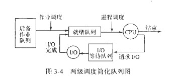

在某些系统中没有作业调度程序，或者即使有也很小。例如，在分时系统中往往没有作业调度程序．而是简单地把每个新进程装入内存，供进程调度程序使用。

### 三级调度模型

中级调度把在内存中`驻留时间较长的进程对换到磁盘上`，PCB从就绪队列或阻塞队列转到`就绪/挂起队列`或`阻塞/挂起队列`。

## 3.4 线程调度

在多线程系统中提供了进程和线程两级并行机制。由于线程的实现分为用户级和核心级，所以在多线程系统中，调度算法主要依据线程的实现而不同。

**1. 用户级线程：**

由于线程是在用户级实现的，核心并不知道线程的存在，所以核心不负责线程的调度。核心只为进程提供服务，即从就绪队列中挑选一个进程(如A), 为它分配一个时间片，然后由进程A 内部的线程调度程序决定让A 的哪一个线程（如A 1) 运行.

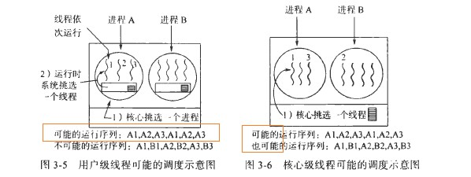

`用户级线程不受时钟中断的影响(但是进程受时钟中断的影响).`

用户级线程的调度算法可以是后面3.6节所讲的任何一种算法。实际上，最常用的是`轮转法`和`优先级法`，唯一的限制是时钟中断对运行线程不起作用。

**2. 核心级线程：**

用户级线程和核心级线程的主要区别如下：

1. 性能：用户级线程切换可使用少量的机器指令，速度快；而核心线程切换需要完成的上下文切换，修改内存映像等，因而速度慢
2. 挂起：在核心线程下，一个线程因等待I/O而阻塞不会挂起整个进程，而用户级线程方式却会挂起整个进程。
3. 调度：用户级线程可以使用专门为应用程序定制的线程调度程序，从本进程的线程池中选出合适的线程投入运行，使得并行度最大化；而核心级线程中，调度程序是共用的，内核从不了解每个线程的作用。

## 3.5 调度性能的评价

### 调度策略的选择

在实际系统中，往往采取“统筹兼顾`”的方法，既保证主要目标的实现，又不使相关的指标变得太差。

### 性能评价指标

**CPU利用率：**

CPU是昂贵的资源。在实际的系统中，一般CPU 的利用率为40% (轻负荷系统） ~90%
（重负荷系统） 。

**吞吐率：**

它`表示单位时间内CPU完成作业的数量`。对长作业来说，吞吐量可能是每小时一个作业；而对于短作业处理．它可以达到每秒钟10 个作业。

**周转时间：**

从特定的一个作业出发，最重要的准则就是完成这个作业要花费多长时间。`从作业提交到作业完成的时间间隔就是周转时间。`周转时间是作业等待进入内存、进程在就绪队列中等待、进程在CPU 上执行和完成1/0 操作所花费时间的总和。

利用平均周转时间可衡量不同调度算法对`相同作业流`的调度性能。

为了考虑到长短作业的差别，又定义了另一个衡量标准：`带权周转时间W，即 W = T / R，其中T为周转时间，R为实际运行时间。`

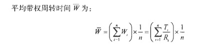

利用平均带权周转时间可比较某种调度算法对不同作业流的调度性能。

**就绪等待时间：**

每个作业在就绪队列中等待的时间

**响应时间：**

在交互系统中，周转时间不可能是最好的评价准则。响应时间是：`从提交第一个请求到产生第一个响应所用的时间`。它是开始`响应`的时间，而不是用于输出响应的时间。`周转时间通常受到输出设备速度的限制`。

## 3.6 常用的调度算法

### 1. 先来先服务

实现思想是“排队买票”。

对于进程调度算法来说．按照先来先服务法，就是每次调度从`就绪队列`中选择一个最先进人该队列的进程，把CPU 分给它，令其投入运行该进程一直运行下去、直至完成或者由于某些原因而阻塞，才放弃CPU 。这样，当一个进程进入就绪队列时,它的PCB 就链入就绪队列的`末尾`,每次进程调度时就把`队头`进程从该队列中＂摘“下，分配CPU, 使它运行.

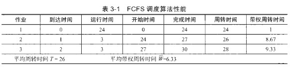

FCFS调度算法对`CPU繁忙型作业`（指需要大量CPU时间进行计算的作业）`较有利`，而不利于I/O繁忙型作业（指需要频繁请求I/O作业）。因为`在执行I/0 操作`，往往该作业（进程） 要`放弃对CPU 的占有`。当1/0 完成后要进人就绪队列`排队`，可能要等待相当长一段时间才得到较短时间的CPU 服务，从而使这种作业的周转时间和带权周转时间都很长。

对长作业有利，对短作业不利。

### 2. 短作业优先SJF

Shortest Job First,主要用于作业调度，也被用于批处理系统。其实现思想是：从作业的后备队列中挑选那些需要`运行时间（估计值）最短`的作业放入内存。这是一种非抢占的策略。

但该算法对长作业很不利，并且不能保证紧迫性作业会被及时处理。

### 3. 最短剩余时间优先SRTF

Shortest Remaining Time First,是`短作业优先法的变型`，它采用`抢占式策略`，也常用于批处理系统。也就是说，当新进程加人就绪队列时．如果它需要的运行时间比当前运行的进程所需的剩余时间还短，则运行进程被强行剥夺CPU 的控制权，由该新进程调度运行。

但是实现这种算法要预先知道其运行所需时间，增加系统的开销
（如保存进程断点现场、统计进程剩余时间等） 。

### 4. 时间片轮转法RR

Round-Robin,主要用于分时系统调度。

为了实现轮转调度，系统把所有就绪进程按先入先出的原则排成一个队列，新来的进程加到就绪队列末尾。每当执行进程调度时，进程调度程序总是选出就绪队列的队首进程，让它在CPU上运行一个时间片的时间。时间片是一个小的时间单位，通常为10~100ms数量级。当进程用完分给它的时间片后，系统的计时器发出`时钟中断`(只有这种算法才有时钟中断)，调度程序便停止该进程的运行，并把它放入就绪队列的末尾；然后，再把CPU分给就绪队列的队首进程，同样也让它运行一个时间片如此往复。

这种算法是最经典、最简单、最公平且广泛使用的一种调度算法。

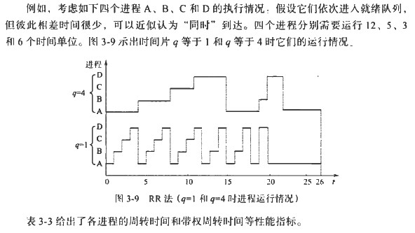
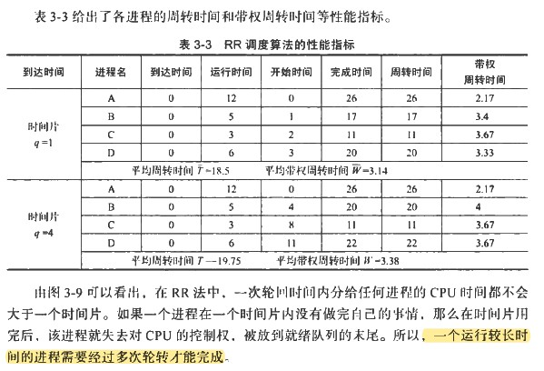

因此，时间片的长度是一个很重要的因素。时间片的长度通常由以下四个因素确定：

1. 系统的响应时间：在进程数目一定时，时间片的长短直接真比于系统对响应时间的要求
2. 就绪队列进程的数目：当系统要求的响应时间一定时，时间片的大小反比于就绪队列中的进程数
3. 进程的转化时间：若执行进程调度时的转化时间为t，时间片为q，为保证系统开销不大于某个标准，应使比值t/q不大于某一数值，如1/10
4. CPU运行指令速度：CPU数据越快，时间片可以短些，反之，应该长些

### 5. 优先级法

- 非抢占式优先级法

当前占用CPU 的进程一直运行下去，直到完成任务或者因等待某事件而主动让出CPU 时，系统才让另一个优先级高的进程占用CPU 。

- `抢占式优先级法`

当前进程在运行过程中．一旦有另一个优先级更高的进程出现在就绪队列中．进程调度程序就停止当前进程的运行，强行将CPU 分给那个进程。

那优先级如何确定呢？一般来说，进程优先级可由系统内部定义或由外部指定。

进程的优先级是“一定终身”还是“随机应变”，即静态方式还是动态方式呢？

（Linux中，优先数越小，优先级越高）

静态优先级很容易出现"饥饿"现象，为了解决这个问题，`动态优先级`可以采用“`论年头`”的方法，即等待CPU很长时间的进程逐渐提升其优先级。

### 6. 多级队列法

Multievel Queue,调度算法是根据作业的某些特性，如占用内存大小和作业类型等，永久地`把作业分别链入不同地队列，每个队列都由自己地调度算法`【统筹兼顾】。

### 7. 多级反馈队列法

Multilevel Feedback Queue,即在多级队列地基础上加进“反馈措施”。

其思想思想是：系统中设置`多个就绪队列`，每个队列对应一个优先级，第一个队列的优先级最高，第二个队列次之，以下各个队列的优先级逐个降低；各就绪队列中进程的运行时间片不同，`高优先级队列的时间片小，低优先级队列的时间片大，`如从高到低依次加倍；新进程进入系统后，先放入第一队列的未尾，各队列按`FCFS` 方式排队；如某个进程在相应时间片内没有完成工作，则把它转到下一级队列的未尾；系统先运行第一队列中的进程，第一队列为空后才运行第二队列中的进程，以此类推， 最后一个队列（最低级）中的进程采用`时间片轮转`的方式进行调度。

多级反馈队列法虽然比较复杂一些，但具有较好的性能，在UNIX 系统、WindowsNT 和OS/2 中都采用了类似的调度算法。

### 8. 高响应比

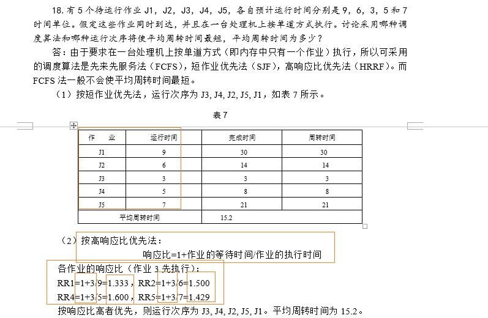

从相应比的公式看出：

1. 若作业等待时间相同，则要求服务时间越短，优先级越高，有利于短作业
2. 要求服务时间相同时，作业等待时间越长，优先级越高，是先来先服务算法
3. 长作业的优先级也随着等待时间增加而提高，也能获得处理机

高响应比是一种比较好的算法，它既能照顾到短作业（进程），有考虑到了长作业（进程）。其缺点是调度之前需要计算进程的相应比，从而增加系统的开销。另外，对于实时进程无法做出及时反应。

## 3.7 实时调度

### 实时任务调度

有一些任务对时间有着严格地要求（一般与一个特点的截止时间相关联）。截止时间分为开始时间和完成时间。根据对截止时间的要求，实时任务可以分为硬实时任务（Hard Real-time Task）和软实时任务（Soft Real-time Task）。硬实时任务要求一定要在截止时间前完成，否则会造成很严重的后果，软实时任务则对截止时间不是绝对要求的，即使超出任务的截至时间，仍然可以调度完成。

按照任务执行是否呈现周期性规律来分，实时任务可以分为周期性任务和非周期性任务。

### 实时调度算法

实时调度算法分为静态和动态两种方式。

**1. 优先级随速率单调的调度算法:**

Rate Monotonic Scheduling,RMS,是针对可抢占的周期性进程采用的经典静态实时调度算法.其思想是：RMS 为每个进程分配一个固定的优先级，它等于触发事件发生的频度。例如，一个进程每30ms 必须运行一次（即33 次／秒），其优先级就为33; 若它必须每40 ms 运行一次（即25 次／秒）．其优先级则为25 。即进程的优先级与其速率呈线性关系，因而该调度算法称为优先级随速率单曲的调度法。在运行时．调度程序总是运行优先级最高的进程。如果需要的话，抢占当前正在运行的进程。

**2. 最早截止时间优先调度算法：**

Earliest Deadline First,EDF是流行的动态实时调度算法。它不要求被调度进程具有周期性．也不要求每次占用CPU 运行的时间相同。其思想是：每当一个进程需要占用CPU 时．它要`表明自己的存在和截止时间等信息`。调度程序把所有可以运行的进程按照其截止时间先后顺序放在一个表格中。执行调度时．就选择该表中的第一个进程它的截止时间最近。每当一个新进程就绪，系统就查看它的截止时间是否在当前运行进程之前。如果更近，新进程就抢占当前运行进程。

 <!-- TODO: linux进程调度方式 -->

## 3.8 Linux系统中的进程调度

**3. 调度时机：**

核心进行进程调度的时机有以下5种情况：

1. 当前进程调用系统调用nanosleep()或者pause(),使自己进入睡眠状态，主动让出一段时间的CPU的使用权。
2. 进程终止，永久地放弃对CPU的使用
3. 在时钟中断处理程序执行过程中，发现当前进程连续运行的时间过长。
4. 当唤醒一个睡眠进程时，发现被唤醒的进程比当前进程更有资格运行。
5. 一个进程通过执行系统调用来改变调度策略或者降低本身的优先级（如nice命令），从而引起立即调度。

## 3.9 中断处理和系统调用

### 中断处理的一般过程

**1. 中断的概念:**

中断对于操作系统非常重要，他就好像机器中的齿轮、驱动各部件的动作。所以，很多人称操作系统是由“中断驱动”的。

中断：是指CPU对系统发生的某个事件做出的一种反应，它使CPU暂停执行的程序，保留现场后自动执行相应的处理程序，处理该事件后，`如被中断进程的优先级最高`，则返回断点继续执行被“打断”的程序。

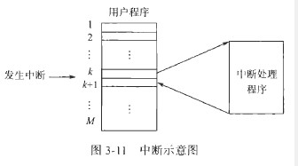

引起中断的事件或发出中断请求的来源称为`中断源`。中断源向CPU提出的处理请求称为`中断请求`。发生中断时，被打断程序的暂停点称为`断点`。

中断最初是作为`通道（或设备）与CPU之间进行通信的工具`。通道和CPU并行工作，各自负责自己的任务。当通道`完成`某项预定的I/O请求或数据传输过程中`发生故障`时，就用中断方式向CPU“报告情况”，请求处理。

中断的概念后来得到进一步扩展。在现代计算机系统中，不仅通道和设备控制器可以向CPU发送中断请求，其他部件也可以造成中断。如：程序在CPU上运行时出现运算溢出、取数时奇偶错、电源故障、时钟计数到时等，都可称为中断源【`本进程`】。

中断概念的另一个发展是`系统调用`（访管指令）的使用。用户程序使用操作系统对外界提供的系统调用，得到系统内部服务。`当用户程序执行到系统调用时`，进程的状态就从用户态变成了内核态，核心根据`系统调用的编号`，转去执行相应的处理程序，如对文件的读写，对进程的控制等。【本程序】【`对文件、对设备等资源管理`】

硬件保证用户态下运行的程序，不得访问内核态的数据，从而保证了操作系统。【有点像Java里的`封装`】

可见，中断的发生和处理`涉及两个地址空间`：中断发生时，用户程序运行在用户空间，该进程处于`用户态`；中断处理由操作系统完成．在核心空间实现．该进程处于`核心态`。中断处理完成后，`再返回用户空间`。

**2. 中断的类型：**

按中断事件来源来划分：

1. 中断：它是由`CPU以外`的事件引起的，如I/O中断，时钟中断、控制台中断等。中断是异步的，从逻辑上讲，中断的产生和当前正在执行的程序没有关系。
2. 异常（Exception）：它是来自`CPU的内部事件`或程序执行中的事件引起的。如CPU`本身故障`（电源电压低于105V，频率在47~63Hz范围之外），程序故障（非法操作码、地址越界、浮点溢出）,`断点调试`和请求系统服务的指令（`系统调用`）。可见，异常包括很多方面，异常是同步的，因为它们是由于执行引起的。

> CPU怎么知道有中断呢？  
电脑上有个硬件设备叫做中断控制器，而CPU上若干个引脚，中断控制器的输出引脚会和CPU的输入引脚链接起来，如果发生中断，对应引脚会收到信号。CPU在`执行完一个指令后`就会去检查引脚上是否有信号来，如果有就去处理信号（也就是中断函数）。中断函数是提前准备好的（系统启动时），cpu收到信号就去执行。这些流程都是硬件完成的，我们只需要遵循规则就可以了。  
作者：yglah  
链接：<https://www.zhihu.com/question/320636133/answer/671247662>  
来源：知乎

**3. 中断的处理过程：**

中断的处理一般分为中断响应和中断处理。中断响应一般由硬件实施，中断处理一般由软件实施。

- `中断响应`

由硬件对中断请求做出响应，称为中断响应。中断响应一般有三个动作：【CPU硬件】

1. 中止当前程序的执行
2. 保存原程序的断点信息（主要是程序计数器PC和程序状态字寄存器PS等内容）
3. 转到响应的处理程序

> 程序状态寄存器PSW是计算机系统的核心部件——运算器的一部分，PSW用来存放两类信息：一类是体现当前指令执行结果的各种状态信息，如有无进位（CY位），有无溢出（OV位），结果正负（SF位），结果是否为零（ZF位），奇偶标志位（P位）等；另一类是存放控制信息，如允许中断(IF位)，跟踪标志（TF位）等。有些机器中将PSW称为标志寄存器FR（Flag Register）。

通常CPU在执行完一条指令后，立即检查有无中断请求。如有，而且，`“中断允许”的触发器为1`（表示CPU可以响应中断请求），则立即做出响应。

- `中断处理`

中断响应后，通常由软件（中断处理程序）进行相应处理。中断处理大致分为4个过程：

1. 保存中断程序的现场：除了硬件保存的`PC`和`PS`的值，还有一些状态环境信息需要保存，如各`通用寄存器的值`。对现场信息的保存方式也是多样化的，`有集中式保存和分散式保存`
2. 分析中断原因：
3. 转入相应处理程序进行处理：根据中断控制器的中断向量表，找到相应处理程序的入口
4. 恢复被中断程序的现场（即中断返回）：执行完中断处理程序后，要退出中断。从时间顺序上讲，先恢复环境信息（各通用寄存器内容，再恢复控制信息PS、PC的内容）

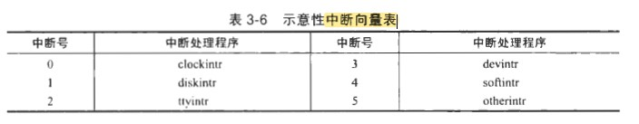

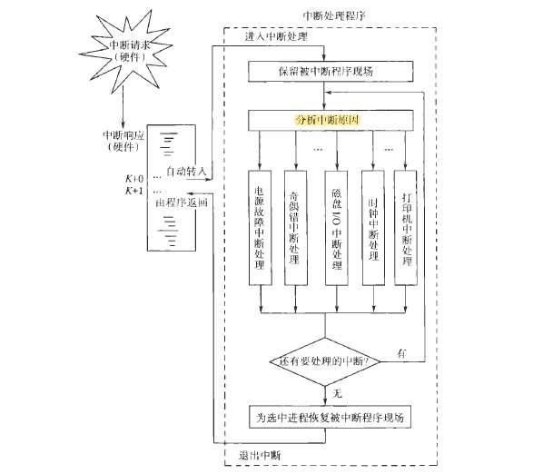

**4. 中断优先级和中断屏蔽：**

- 中断优先级

硬件设计时，一般把紧迫程度大致相一致的中断源并为一组，称为一个中断级。

与某种中断相关的优先权称为它的`中断优先级`。`级别高的中断一般有打断级别低的中断处理程序的权力`。通常也不允许后来的中断打断同级中断的处理过程。

- 中断屏蔽

`中断屏蔽是指在提出中断请求后，CPU(暂时)不予响应的状态`。它常常用来处理某个中断时防止同一级别的干扰、或在处理一段不可分割的、必须连续执行的程序时要防止意外事件把它打断。

中断禁止：在可引起中断的事件发生时`不接受`中断信号，因而就是不可能提出中断请求而导致中断。如按模取余运算，算术运算中强制忽略某些中断，如定点溢出、运算溢出中断等。

中断屏蔽和中断禁止是不同的。前者表明了接受了中断，但是暂时不能响应，要延迟一段时间；而后者，硬件不准许事件提出中断请求，从而使中断禁止。

在Unix中，通常采用提高处理机执行优先级的方式屏蔽中断。即在程序状态寄存器(PS) 中设窅处理机当前的执行优先级， 当它的值（比如6) 大于或等于后来中断事件的优先级（比如4) 时．该中断就被屏蔽了。

- 多重中断

对于多重中断，有`顺序处理方式`和`嵌套处理方式`。

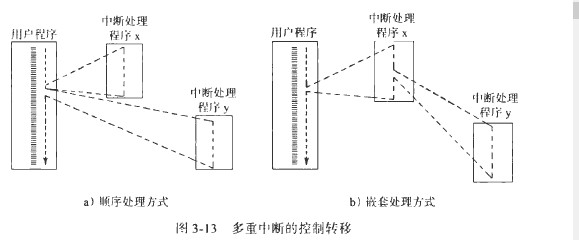

顺序处理方式不能考虑到中断的相对优先级或时间的紧迫程度。  
嵌套中断往往会给程序设计带来困难。  
`在Linux系统中，当响应中断并进入中断处理程序时，CPU会自动将中断关闭。`

### 系统调用处理

**1. 陷入事件的处理方式：**

在Unix/Linux中，对异常的处理称为陷入。

1. 自陷，自愿陷入，如系统调用，断电跟踪
2. 捕俘，由于程序运行过程中出现软、硬件故障或错误，如转化无效、访问违章、非法指令等。

各种陷入经断点现场保存等简单处理后，统一进入`陷入处理子程序（trap）`,陷入子程序对所有陷入事件按以下四种方式处理：

1. 请求系统人员干预
2. 按用户规定的方式进行处理
3. 用户栈自动扩充
4. 系统调用处理

**2. 系统调用的处理方式：**

通过一个系统调用的过程，说明操作系统是如何动态协调工作的。

设用户进程A在运行中要向已打开的文件（用fd表示）写一批数据，为此在用户C源代码程序中可用如下系统调用语句：

rw=write(fd,buf,count);

这条语句经编译以后形成的汇编指令形式如下：

trap 4  
参数1  
参数2  
参数3  
k1:··  

其中，参数1、2、3分别对应该文件的文件描述符fd,用户信息所在的内存地址buf,传送字节数count.这个系统调用的执行过程主要有如下7步：

1. CPU`执行到trap4指令`时，产生陷入事件，硬件做出`中断响应`；保留进程A的PSW和PC的值，取中断向量并`放入`寄存器（PSW和PC）中；程序控制转向一段核心代码，将进程状态改为核心态；进一步`保留现场信息`（各通用寄存器的值等），然后进入统一处理程序trap。trap程序根据系统调用号4号查找`系统调用入口表`，得到相应`处理子程序的入口地址write`。
2. 转入文件系统管理。根据文件描述字fd找到该文件的控制结构---i结点，进行权限验证等操作后，如果都合法，则调用相应的核心程序将文件的逻辑地址`映射到物理块号`；再申请和分配`缓存区`，将进程A内存区buf中的信息传送到所分配的缓冲区中。然后，经由内部控制结构（即`块设备转接表`）进入`设备驱动程序`。
3. 启动设备驱动程序（即磁盘磁盘驱动程序），将缓冲区中的信息写到相应的盘块上，在进行IO工作时，进程A要等待IO完成，所以进程A`让出CPU`，处于睡眠状态，
4. 执行进程调度工作。进程调度程序从就绪队列中选出一个合适的进程，如B，为它恢复现场，使其在CPU上运行。此时CPU在进程B的用户空间运行。
5. 当写盘工作完成后（即缓冲区中的信息都传送到磁盘块上），磁盘控制器发出`IO中断信息`。该信号中止进程B的继续运行，硬件做出中断响应，然后转入磁盘中断处理程序。
6. 磁盘中断处理程序运行。它验证中断来源，如传输无错，则唤醒因等待磁盘IO而睡眠的进程A
7. 假设进程A比进程B的优先级更高，则中断处理完成后，执行进程调度程序 ，选中进程A，为进程A恢复现场，然后进程A的程序接下去执行。

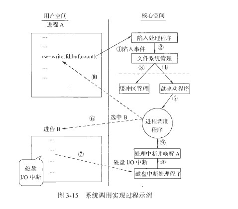

## 3.10 shell基本工作原理

Linux系统提供给用户最重要的系统调用是shell命令解释程序。它在用户态方式运行。执行过程如下：

1. 读取用户由键盘输入的命令行
2. 分析命令`，以命令名作为文件名`，其他参数改造为系统调用execve()内部处理所要求的形式
3. 终端进程调用fork()建立一个子进程
4. 终端进程本身`用系统调用wait4()来等待子进程完成（如果是后台命令，则不等待）`。当子进程运行时调用execve()【不用父进程的上下文】，子进程根据`文件名(即命令名)到目录中查找有关文件`（这是命令解释程序构成的文件），调入内存，执行这个程序（即执行这条命令）。
5. 如果命令末尾有"&"号（后台命令符号），则终端进程不用执行程序调用wait4(),而是立即发提示符，让用户输入下一条命令，转步骤1.如果命令末尾有“&”号，则终端进程要一直等待，当子进程（即运行命令的进程）完成工作后要终止，向父进程（终端进程）报告【子进程执行完，唤醒父进程】，此时父进程终端醒来，在做必要的判别等工作后，终端进程发提示符，让用户输入新的命令，重复上述处理过程。

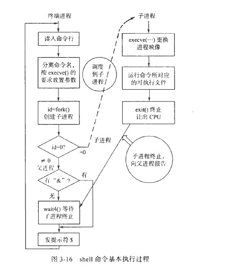
