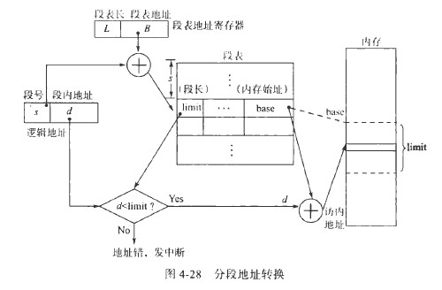
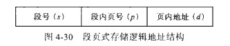
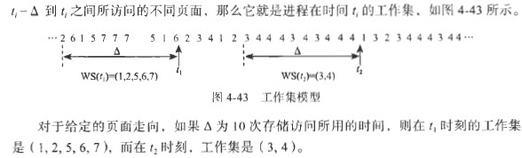

## 4.1 地址空间与重定位

内存（Main Memory,Primary Memory 或 Real Memory），也称主存，是指CPU能直接存取指令和数据的`存储器`。内存是计算机系统进行操作的`中心`。内存是一个大型的、由字或字节构成的`一维数组`，每个单元都有自己的地址。对内存的访问是通过一系列对指定地址单元进行读或写实现的。

硬盘、光盘和磁带等存储器一般称为`外存`或辅存（secondary storage）

一条典型指令的执行周期是：首先从内存取出指令，计算操作数据的有效地址，并映射为物理地址，按照该地址对内存进行存取，然后对数据实施指定的操作。

### 用户程序的地址空间

**1. 存储器的层次：**

- cache缓存:

我们现在电脑里用的机械硬盘就是磁盘，而固态硬盘则不是磁盘（构造不一样，没有磁头）

**2. 用户程序的主要处理过程：**

从用户源程序进入系统到相应程序在机器上运行，要历经：`编辑、编译、连接、装入和运行`。

**3. 程序装入方式：**

程序必须装入内存才能运行。

目标程序经编译之后的每个目标模块都以0为基地址顺序编址，这种地址称为`相对地址``或逻辑地址`。内存中各物理存储单元的地址是从统一的基地址开始顺序编址的，这种称为`绝对地址`或`物理地址`。

程序装入内存的方式有三种：

1. 绝对装入方式
2. 可重定位装入方式:由`转入程序`根据内存的使用情况，决定将装入模块放在内存的什么地方。
3. 动态运行装入方式:为了使内存的利用率最大，装入内存的程序可以换出到磁盘上，以后再换入到内存中，但对换前后在内存中的位置可能不同。（需要硬件支持）

### 重定位概念

逻辑空间：逻辑地址空间，由程序中逻辑地址组成的地址范围。

物理空间：绝对空间，内存空间，由内存中一系列存储单元所限定的地址范围。物理空间就像数组一样，是一维空间，你插入两条内存条也是一样的。

**1. 静态重定位：**

静态重定位是在目标程序装入内存时，由`装入程序`对目标程序中的`指令和数据`的地址进行修改，即把程序的逻辑地址都改成实际的内存地址.

这种地址变换只是在装入时一次完成，在程序运行期间不再进行重定位。

**2.动态重定位：**

动态重定位是在程序执行期间，每次访问内存之前都要进行重定位。这种变化是靠硬件`实现`的。目标程序的逻辑地址加上 重定位寄存器(基址寄存器)，得到物理地址，再查看页表，看看用不用进行页面置换.

在动态重定位中，除了基址寄存器，还需要使用限长寄存器，因为需要表示这个用户程序的逻辑地址的最大范围。通常，系统中的基址/限长寄存器只有一对。每当一个程序运行时，就要为他们设置这对寄存器的值。

### 覆盖技术

覆盖技术是为了希望能在较小的空间运行较大的程序。

覆盖的基本原理是：将内存空间划分成一个固定区和多个覆盖区；把程序划分为若干`功能上相对独立`的程序段，按照自身的逻辑结构使那些`不会同时运行的程序段`共享一块内存区域。

覆盖技术的缺点是编程时必须划分程序模块和确定程序模块之间的覆盖关系，增加了用户负担；从外存装入覆盖文件，通过延长作业的周转时间来达到节省内存空间的目的。

现在的操作系统用`对换技术`来解决在`小的内存空间运行大作业`的问题。

### 对换技术

在多道程序环境中，当内存空闲空间不足以容纳要求进入内存的进程或低千某个预定限度时，系统就把内存中`暂时不能运行`【没有CPU时间片】的进程（包括程序和数据）换出到外存上、腾出内存空间，把具备运行条件的进程从外存换到内存中。

与覆盖技术相比，对换不要求程序员给出程序段之间的覆盖技术，主要在进程或作业之间进行。

## 4.2 分区管理技术【×现代计算机不是这么用了】

把供用户使用的内存空间划分成几个区，每个区容纳一个进程。可分为`固定分区法`和`动态分区法`。

### 固定分区法

固定分区就是内存中分区的个数固定不变，各个分区的大小也固定不变，每个分区只可装入一个进程。

固定分区又可分为：等分方式和差分方式。

### 动态分区法

由于进程的大小不可能预先规定，所以可以把分区的大小和个数设置成可变的。这就是动态分区法。

操作系统掌握一个表格，登记每个空闲区和已分配区，指出其大小、位置和各个区的存取限制。

为了实现分区分配，系统要设置相应的数据结构来记录内存的使用情况。常用的数据结构有：

**1. 空闲分区表：**

但是，因为分区的个数也具有不确定性，所以该表的大小也具有不确定性。

**2. 空闲分区链：**

空闲分区链是使用链指针把所有的空闲分区链接成一条链。

但是每次查找都要从头依次搜索，因而效率低。

**3. 分配算法：**

当把一个进程装入内存或者换入内存时，若有多个容扯满足要求的空闲内存区，操作系统必须决定分配哪个分区。

- 最先适应算法First-fit

- 最佳适应算法Best-fit

这种算法的空闲表是以空闲区的大小为序、按增量形式排列的，即小区在前，大区在后。

这种算法在满足需要的前提下，尽量分配空间最小的空闲区。

但是，它不便于释放内存时与邻接区的合并，也同样会出现很多难以利用的小空闲区

- 循环适应算法Next-fit

也叫下次适配算法，是最先适应算法的变种。

当每次找到合适的空闲区时，就同时记下当时的位置；下次查找空闲区时，不从空闲表的开头查找，而从所记位置的下一个空闲分区开始查找。

该算法能使内存中的空闲区分布的更加均匀、`减少查找空闲空间的开销。`

- 最坏适应算法Worst-fit

这种算法是最佳适应算法的＂逆＂，即空闲表仍以空闲区的大小为序，但大区在前、小区在后。这样．总是先分配最大的空闲区，使得划分后剩余的分区仍然比较大，可以进一步得到利用。

但是，这种算法，不好用。

**4. 硬件支持：**

采用分区技术需要有`硬件保护机制`。通常用一对寄存器分别表示用户进程在内存空间的`上界地址值`和`下界地址值`。当用户进程运行时．所产生的每个访问内存的地址都要作合法性检查。也就是说，生成的地址必须是大于或等于下界地址值，同时小于上界地址值，否则就是地址越界，从而导致中断（有的系统中将存放上界地址值的寄存器改为`限长寄存器`，其中存放用户程序的最大长度.

这对寄存器是所有用户进程`共用`的。`当前哪个进程在运行．这对寄存器就装人`该进程在内存的上、下界地址值，， 当执行进程调度时，就更换寄存器的值。

但是，现在也不是这么用了。

**5. 碎片：**

更加碎片的位置，可以分为`内部碎片`和`外部碎片`。

在一个分区内部出现的碎片（即被浪费的空间）称为内部碎片，如固定分区法会产生内部碎片。

在所有分区之外新增的碎片称为外部碎片，如在动态分区法实施过程中出现越来越小的小空闲块，由于他们太小，无法装入一个小进程，因而被浪费掉。

**6. 动态分区分配的优缺点：**

动态分区分配的主要优点是：有利于多道程序设计，所需硬件支持很少，不产生内部碎片．管理算法简单，易于实现。

动态分区分配也存在很多缺点，主要有：会产生外部碎片问题，影响内存利用率；为解决碎片问题而采用的紧缩办法会占用大量处理机时间；不利于大作业运行，作业大小受内存总量限制。

### 可重定位分区的紧缩

出现碎片怎么办呢？最简单的办法是定时或在分配内存时把所有的碎片合并为一个连续区。实现的方法是移动某些已分配区的内容，使所有进程的分区紧凑挨在一起。这种称为`紧凑`（需使用`重定位分区法`）

使用紧凑法，需要对分区中的大量信息进行传送，需要花费大量的CPU时间。可以对紧凑的方向加以改进。程序装入内存时，不是从上至下依次放置，而是采用“`占两头、空中间`”的方法。

## 4.3 分页技术

为了`解决碎片`，除了紧凑法，还可以使用分页管理。【有点类似数据结构里面：需要一个大的时间移动时，可以将大的时间平摊到每一次小的时间上】

### 分页的基本概念

分页存储管理的基本方法如下：

- `逻辑空间分页`
  
将一个逻辑空间划分成若干个大小相等的部分。每个部分称为页面或页。每页都有一个编号，称为页号。大小由硬件决定，一般为`4k`.

- `内存空间分块`

将内存空间划分成于页面大小的若干存储块，称为内存块或页框。大小由硬件决定，一般为4k.

- `逻辑地址表示`：它有两部分组成，前一部分表示该地址所在页面的`页号p`;后一部分表示页内位移d,即页内地址。其中，0-11位为`页内地址d`，即`每页的大小为4kB`,12-31位为页号，表示地址最大能容纳`2^20个`页面.

应注意，有些是64位。一般来说，如果地址字长为m位，而页面大小为2^n字节，那么页号占m-n位（高位），而低n位表示页内地址（64位也用0-11表示页内地址，也即一个页大小为4k）

`举例`：例如，设某系统的页面大小为1 KB, A=3456, 则p=INT (3456/1024) =3, d= (3456)MOD (1024) = 384 。用一个数对(p, d) 来表示就是(3,384)。

- `设立页表`

在分页系统中，允许将进程（虚拟空间）连续的页装入（物理空间）不连续的块中。这时，可以设置`为每个进程`设置`页表`（页面映射表）

- `建立内存块表`

操作系统管理着整个内存，需要知道哪些块已经分配出去了，哪些块还是空的，总共有多少块物理内存等。这些信息必须保存在`内存块表`的数据结构中。

整个系统有一个`内存块表`。每个内存在内存块表中占一项，表明该块当前空闲还是已分出去；如果已分出去，是分给哪个进程的哪个页面。

### 分页系统中的地址映射

**1. 基本地址转换机构：**

通常，页表都放在内存中。当`进程需要访问`某个逻辑地址空间的数时，分页`地址映像硬件`自动按页面大小将CPU得到的有效地址（相对地址，这是运行可执行文件得到的相对地址）分成两部分：页号和页内地址（p,d1）.以页号p为索引检索页表，这种查找由硬件自动进行。`从页表中得到该页的物理块号`，把它装入物理内存寄存器中。这样，就可以从逻辑地址得到物理地址了。

分页技术不会产生外部碎片，但是会产生内部碎片。最坏情况下． 一个进程有n 个整页面加1 字节，为它也得分n+l 个内存块。此时．`最后一块几乎都是内部碎片`，如果进程大小与页面大小无关，那么每个进程·的内部碎片从这点上看，似乎页面越小越好。但是，选择页面大小要综合考虑多种因素，如页面长度、`磁盘1/0` 次数【`页面越大`，发生缺页中断的`次数越少`；页面越小，发生缺页中断的次数越多】，等等。

**2. 具有快表的地址转换机构：**

在内存中放置页表也带来`存取速度下降`的问题。因为存取一个数据（或一条指令）`至少要访问两次内存`：`一次是访问页表`，确定存取对象的物理地址；`另一次是根据这个物理地址存取数据`（或指令） 。显然，这时的存取速度为通常寻址方式速度的l/2. 这种延迟在大多数悄况下是不能容忍的.

这时，可以用专门的、小容量的高速联想存储器---快表（Translation Lookaside Buffer,TLB）。

`快表每项包括键号和值两部分`，`键号`是`当前进程`正在使用的某个`页号`，`值`是该页面所对应的`物理块号`。

当把一个页号交给快表时．它同时和所有的键号进行比较，如果找到该页号，该项中的值就是对应的物理块号，并被立即输出，以便形成访间内存地址。`这种查找是非常快的`，但硬件成本也很贵·这么做的原因是，一个程序在一段时间内总是相对集中在一个有限地址空间的某个区域执行，这就是程序局部化的概念，因此，快表只需要少量的页表项，一般为64-1024项。

下图PTBR表示`页表`基址寄存器，其中存放相应页表的基址。

### 页的共享和保护

**1. 页面共享：**

在多道程序系统中，`数据共享`很重要。尤其在一个大型分时系统中，往往有若干用户同时运行相同的程序(编辑程序、编译程序),如果不共享，就会有很多重复的副本，`造成浪费`。

一般`只读的页面（如程序文件）可以被共享`，而数据页面往往不能共享。

在分页系统中，由于`操作系统不知道`每个页是什么数据，而且一个页可能既存在只读数据，也存在可修改的数据，因此，分页系统实现共享还是`比较困难`的。(共享数据，可以分段、文件系统的链接)

**2. 页面保护：**

为了防止`不同进程`间的非法访问以及`本进程对自己`地址空间中数据的错误操作．必须提供相应的保护措施。分页系统中提供的存储保护方式有以下三种形式。

- 利用页表本身进行保护

`每个进程都有自己的页表，页表的基址信息放在PCB中。`访问内存需要利用页表进行地址变换，这样使得各进程在自己的存储空间内活动。

- 设置存取控制位

通常在页表中设置`存取控制字段`，用于指明对应内存块中的内容允许执行何种操作，从而禁止非法访问。一般设定为`只读(R) 、读写(RW) 、读和执行(RX)`等权限。如果一个进程试图写一个只允许读的内存块，则会引起操作系统的一次中断非法访问性中断，操作系统会拒绝该进程的这种尝试，从而保护该块的内容不被破坏。

- 设置合法标志

一般在页表的每项还设置合法/非法位。当该位设置为“合法”时，表示相应的页在该进程的逻辑地址空间中是合法的页；如果设置为“非法”，则表示该页不在进程的逻辑地址空间内。利用该位可以捕获非法地址。

### 页表的构造

**1. 多级页表：**

大多数现代系统都支持`非常大逻辑地址空间`，如2^32~2^64（64位系统其实寻址只用48位就很足够了）。这种情况下，只用一级页表就会变得非常大。

例如，对于逻辑地址空间用32 位表示的系统，页面大小为4 KB, 那么每个进程的页表中就有高达220 个表项，设每个表项占4 B, 每个进程仅页表就要占用4 MB 的内存空间，而且必须是连续的。

解决此问题的简单方法是把页表分层若干较小的片段，`离散地存放在内存中`，并且只需要`将当前需要的部分表项`调入内存，其余的页表项根据需要`动态地调入内存。`

一种方法是利用两级页表。即把页表本身也分页。

p1是访问外层页表的索引，外层页表中的每一项是相应内层页表的起始地址；p2是访问内层页表的索引，其中的表项是相应页面在内存中的物理块号。

Linux使用4级页表。

**2. 散列页表：**

处理大于32位地址空间的通用方式是使用`散列页表`,以页号作为参数形成散列值。

每个链表由三部分组成：

1. 页号
2. 对应的内存块号
3. 指向链表中的下一元素的地址

**3. 倒置页表：**

64 位虚拟地址空间在处理器上的应用，使物理地址空间显得很小。在这种情况下．如果直接以逻辑页号为索引来构造页表，则页表会大得无法想象。为了避免页表占用过多内存空间．可以采用倒置页表(Inverted Page Table) 。

倒置页表的构造恰好与普通页表相反，它是按内存块号排序的，`每个内存块占有一个表项`。每个表项包括存放在`该内存块中页面的虚拟页号`和`拥有该页面的进程标识符`。这样．系统中只有一个页表．每个内存块对应唯一的表项。在Ultra SPARC 和PowerPC系统上就采用了这种技术。

图4-25 示出利用倒置页表进行地址转换的过程：系统中`每个虚拟地址由进程标识符pid 、虚拟页号p 和页内地址d` 三部分组成，每个倒置贞表的表项由进程标识符pid和虚拟页号p 组成。当需要访问地址时．就用进程标识符和页号检索倒置页表。如果找到与之匹配的表项，则该表项的序号i 就是该页在内存中的块号，`块号i 与逻辑地址中的页内地址d` 拼接起来就构成访问内存的物理地址；如果搜索完整个页表都没有找到相匹配的页表项，则表示发生了非法地址访问一一此页目前尚未凋入内存。对千具有请求调页功能的存储管理系统，应产生请求调页中断；若没有此功能，则表示地址有错。

倒置页表可减少页表占用的内存，却增加了检索页表时所耗费的时间， 或许要查完整个页表才能找到匹配项。为了解决这个问题，`可以使用散列页表，这样子可把搜索工作限定在一个页表项或多个页表项上`。当然，对散列页表的访问也增加了访问内存的次数，一次是访问散列页表，一次是访问倒置页表。`为了改善性能，倒置页表可以和快表一起使用。`

## 分段技术

**1. 分段：**

通常，一个用户程序是由若由相对独立的部分组成的，它们各自完成不同的功能。为了编程和使用方便，`用户希望把自己的程序按照逻辑关系组织，即划分成若干段`，并且按照这些段来分配内存。例如，有主程序段MAIN 、子程序段P 、数据段D和栈段S 等.

用户程序需要进行编译，编译程序自动为输入的程序构造各个段。如Pascal编译程序为如下成分创建单独的段：

1. 全局变量
2. 过程调用栈，用来存放参数和返回地址
3. 每个过程或函数的代码部分
4. 每个过程和函数的局部变量

【可以想想，jvm的模型，应该也是依据不同的功能分段的】

**2. 程序的地址结构：**

<!--  -->

在该地址结构中，允许一个进程最多有64 K,个段，每段的最大长度为64 KB.

**3. 段表和段表地址寄存器：**

每个段在段表中占有一项，段表项中包含`段号、段长和段起始地址`（又称“段基址”）等。段基址包含该段存放在内存中的起始物理地址．而段长指定该段的长度。段表按段号从小到大顺序排列.

**4. 分页和分段的主要区别：**

1. 页是物理单位，页的大小是由系统确定的；段是逻辑单位，段的长度因段而异
2. 分页的进程地址空间是一维的，分段的进程空间是二维的。标识一个地址，除给出段内地址外，还必须给出段名。只有段内地址是不够的。【个人感觉二维是：每一个段都有代码区、数据区等】
3. 分页技术很难实现过程和数据的分离，因此无法对他们实施保护，也不便于在用户间对过程进程共享。分段系统却很容易实现这些功能。

### 分段系统中的地址映射

### 段的共享和保护

**1. 段的共享：**

分段管理的一个优点是提供对代码或数据的有效共享。当不同的进程想要共享某个段时，只需在各个进程的段表中都登记一项，使它们的基地址都指向同一个物理单元。

**2. 段的保护：**

1. 存取控制：在段表的各项中增加几位，用来记录对本段的存取方式，如可读、可写、可执行等。
2. 段表本身可起保护作用
3. 保护环：像Linux那样子，低编号的环具有高优先级，而一般的应用程序（包括用户程序）则在外环上。即每一层次中的分段有一个保护环，环号越小，级别越高。

## 段页式结合系统

`分页存储管理`能够有效地`提高内存利用率`，而`分段存储管理`能够很好地`满足用户需要`。两者结合起来，就是`段页式存储管理系统`。

段页式存储管理的基本原理是：

1. `等分内存`
2. 进程的地址空间`采用分段`方式
3. `段内分页`
4. 逻辑地址结构：由段号s,页号p和页内地址d,记作v=(s,p,d)
5. 以内存块分配内存
6. 段表、页表和段表地址寄存器：为了实现从逻辑地址向物理地址的转换，`系统要为每个进程建立一个段表`，还要为该段表中的每段建立一个页表。这样，进程段表的内容不再是段长和该段在内存中的起始地址，`而是页表长度和页表地址`。为了指出运行进程的段表地址，系统有一个段表地址寄存器，它指出进程的段表长度和段表起始地址。

这样，在段页式存储管理系统中，面向用户的地址空间是段式划分，而面向物理实现的地址空间是页式划分。也就是说，用户程序逻辑上划分为若干段，每段又分为若干页面。内存划分成对应大小的块。进程映像对换是以页为单位进行的，使得逻辑上连续的段存放在分散的内存块中。

## 4.6 虚拟存储管理

### 虚拟存储器的概念

虚拟存储器：用户编写程序时，认为系统拥有的虚拟存储空间。它使用户逻辑空间和物理存储器分离，是操作系统提供给用户的一个比真实空间大的多的地址空间。

使用虚拟存储器带来的两点好处：

1. 用户编写程序时不用考虑容量的大小
2. 由于进程一次性只装入少量、必要的一部分，因而占用的内存空间较少，在一定的容量中就可以装入更多的进程，也相应增加了CPU的利用率和系统的吞吐量。

实现虚拟存储空间的物质基础是：二级存储器结构和动态地址转换机构（DAT）

虚拟存储器的实质是：`把用户的地址空间和实际的存储空间区分开，当作是两个不同的概念。动态地址转化机构在程序运行时把逻辑地址转化成物理地址，实现动态定位。`

虽然虚拟存储空间给用户提供了很大的地址空间，但是实际上并不是无限大，取决于两个方面。第一是指令地址的位数，决定了寻址空间的大小，32位最大的寻址空间只能是4GB，第二是外村的容量，因为用户程序需要放在外存上，而磁盘的容量却不是无限大的。

虚拟存储器分为分页虚拟存储器和分段虚拟存储器，也可以将两者结合起来：段页式虚拟存储器。

### 虚拟存储器的基本特征

1. `虚拟扩充`
2. `部分装入`：当进程执行时，只需要将当前需要运行时的那部分程序和数据装入内存
3. `离散分配`：一个进程在内存中的部分，可能是散布在内存的不同地方，彼此并不连续
4. `多次对换`

## 4.7 请求分页技术

请求分页提供了虚拟存储器。

请求分页的基本思想是：当一个进程的部分页面在内存时就可调度它运行，在运行过程中如果用到的页面不在内存，则把它们动态换入内存。这样就减少了对换时间（进程不用一次性换入内存）和所需的内存数量，允许增加程序的道数。

为了标识进程的页面是否在内存中，在每个页表`增加一个标志位`，值为1代表已在内存，值为0代表不在内存。

当地址转换机构遇到一个具有“0”状态的页表项时，就产生一个`缺页中断`。操作系统`必须处理`这个中断，操作系统装入所需要的页面`并调整相应页表的记录`，然后`再重新执行`这条指令。由于这种页面是`根据请求`而被装入的，所以这种存储管理的方法称为请求分页存储管理.

通常，在进程最初投入运行时，仅把它的少量几页装入内存，其他的页是`按照请求顺序`动态装入的，这样就保证用不到的页面不会被装入内存。

### 硬件支持及缺页处理

需要一定的硬件支持：页表机制、缺页中断机制以及地址转换机构。

**1. 页表机制：**

页表项通常包含5种信息：

1. `内存块号`：这是最重要的数据，页面映射的目的就是为了找到这个值
2. `标志位`：用来标示对应的页面是否已装入内存。1代表装入，0代表还未装入
3. ·：用来规定该页的访问权限。复杂的情况使用三位，分别代表允许对该页读、写、执行
4. `修改位和引用位`：修改位表示有没有修改过，引用则用于页面置换算法的判断
5. `禁止缓存位`：当有内容直接映射到寄存器（硬件）时而设置，这样子就不用在内存中缓存（因为在内存缓存也是为了在硬件上执行/保存）

**2. 缺页中断机构：**

一旦发现页面不在内存中，能立即产生`中断信号`，随后转入缺页中断处理程序进行相应的处理。

**3. 页面置换过程：**

它主要包括以下4 个步骤：

1. 找出所需页面在磁盘上的位置。
2. 找出一个空闲内存块。如果有空闲块，就用它；如果没有空闲块，就用页面置换算法选择一个置换的内存块。把该置换的页写到磁盘上．`并相应地修改页表和内存块表`!【页表和内存块表】
3. 把所需页面读入内存块（刚刚得到的空闲块），修改页表和内存块表。
4. 重新启动该用户进程

可见，如果内存中没有空闲块可用，就要发生两次页面传送（换入和换出），这样使缺页处理时间加倍。这时可以利用页表项中的`修改位`，如果修改没有设置，就不必把内存中的内容写回到磁盘。

### 页面置换算法

**1. 有效存取时间和页面走向：**

对多数系统来说，内存存取时间ma一般为`10~200ns`,只要不出现缺页中断，有效存取时间等于内存存取时间。

缺页中断需要的时间：

1. 处理缺页中断的时间
2. 调入该页的时间
3. 重新启动进程的时间

经过设计1，3可以执行`1~100us`,而第2项则需要“磁盘寻道时间”，“旋转延迟时间”，“数据传输时间”，典型的寻道时间为15ms,旋转延迟时间为8ms,传输时间是1ms,第二项包括硬件和软件处理时间需要`25ms`！而且这还没有考虑到排队等待的时间。

`存储访问序列`叫页面走向。

抖动则是：发生刚被换出的页，很快又被访问，却很快又被换出等，如此频繁更换页面，系统好像很忙，但实际的效率很低。【此时CPU会执行其他进程，但是对于此进程来说，速度很慢】

**2. 常用的页面置换算法：**

- 先进先出法FIFO（First-In First-Out）

- 最佳置换法OPT（Optimal Replacement）

- 最近最久未使用置换法LRU（Least Recently Used）

- 第二次机会置换法SCR（Second Chance Replacement）

- 时钟置换法Clock

- 最少使用置换法LFU（Least Frequently Used）

- 页面缓冲算法（Page Buffering）

维护一个空闲页链表

## 4.8 内存块分配和抖动问题

除了页面置换算法的优劣对缺页率的影响外，缺页率还与进程所分得的内存块数目有密切的相关性。

### 内存块分配

**1. 最少内存块数：**

分给进程的最少内存块必须要保证进程能够正常的运行。

**2. 内存块分配策略：**

- 固定分配策略

分配给内存块的数目是一定的

- 可变分配策略

如果一个进程的缺页率太高，表明该进程的局部化行为不好，需要分给它更多的内存块，以便减少缺页率。如果一个进程的缺页率特别低，就可减少它的内存块，但不要造成缺页率显著增加。

**3. 页面置换的范围：**

可分为全局置换和局部置换。

全局置换允许一个进程从全体存储块的集合中选取淘汰块，尽管该块当前分配给其他进程，还是能强行占用。而局部置换是每个进程只能从分给它的一组内存块里选择淘汰块。

- 局部置换、固定策略

- 局部置换、可变分配策略

- 全局置换只能与可分配策略相结合

**4. 分配算法：**

为每个进程内存块的算法有：等分法、比例法和优先权法

### 抖动问题

如果系统非常频发地进行页面替换，以致于大部分时间都用来进行页面调度上，只有一小部分时间用于进程地实际运算，这种局面称为系统“抖动”(Thrashing).

**1. 产生抖动的原因：**

随着系统中多道程序度的增加， CPU 利用率会得到提升。同时，伴随新进程引入系统中，使得内存空间愈发紧张。由于新进程要从正在运行的进程那里取得一些内存块，导致更多缺页．磁盘设备频繁地进行页面的换入和换出，而CPU 利用率进一步下降，调度程序进一步增加多道程序度。这种恶性循环的结果是，缺页率急剧增加， 内存的有效存取时间加长，系统吞吐量骤减。其实，在此情况下系统巳经不能完成什么任务，因为各个进程都把它们的全部时间花在页面置换上．这就出现了＂抖动” 。

在一定范围内，随着多道程序度的增加，CPU利用率也缓慢增加。但是，当到达最大值以后，如多道程序进一步增加，就会出现抖动，CPU利用率会急剧下降。

**2. 防止抖动的方法：**

1. 采用局部置换策略
2. 利用工作集策略防止抖动
3. 挂起某些进程
4. 采用`缺页频度（Page Fault Frequency,PFF）法`：这里可以规定一个缺页率，依次设置相应的上限和下限。如果实际缺页率超出上限值，就为该进程分配另外的内存块；如果实际缺页率低于下限值，就从该进程的驻留集中取走一个或几个内存块。

### 工作集

工作集是`一个进程`在`某一小段时间`内`访问页面`的`集合`。

**1. 局部性模型：**

虚拟存储系统的有效操作依赖于程序的局部化程度。

局部化分为时间局部化和空间局部化两类。

时间局部化是指一旦某条指令或数据被访问过，它往往很快又再次被访问。这时大多数程序有的性质，如：程序中的循环部分，常用的变量和函数。

空间局部化是指一旦某个位置被访问过，它附近的位置也可能很快被访问过，如程序中:顺序指令串、数组以及存放在一起的常用变量等。

**2. 工作集模型：**

工作集（working set），用于研究和描述局部性。

可以看出，工作集是程序局部性的近似表示。

如果请求值D大于可用内存块的总量m(D > m)，将出现抖动，因为某些进程得不到足够的内存块。

`利用工作集可以防止抖动`。操作系统监督每个进程的工作集，并且给他`分配工作集所需的内存块`。若有足够多的额外块，就可装入`并启动另外的进程`。如果工作集增大，超出可用块的总数，操作系统则要`选择另一个进程挂起`，把它的页面写出去，将它占用的内存块分给别的进程，被挂起的进程将在以后适当的时机重新开始执行。

## 4.9 请求分段技术

补充一下请求分段技术。前面有讲过请求分段技术，在此基础上，再引入虚拟存储器技术，就形成了带虚存的段式存储管理技术，即`请求分段存储管理技术`。

在段式虚存系统中，一个进程的所有分段的副本都保存在外存上。当它运行时，先把当前需要的一段或几段装人内存，其他段仅在调用时才装入。其过程一般是：当所访问的段不在内存时．便产生缺段中断；操作系统接到中断信号后，进行相应处理，按类似于申请分区的方式．在内存中找一块足够大的分区．用于存放所需分段。如果找不到这样的分区，则检查未分配分区的总和，确定是否需要对分区进行紧缩，或者移出（即淘汰）一个或几个分段后再把该分段装入内存。这样，一个进程只有部分分段放在内存，从而允许更多的进程和更大的程序（不受实际内存容僵限制）同时在内存中执行。

## 4.10 Linux系统的存储管理技术

!> TODO: 未完成
