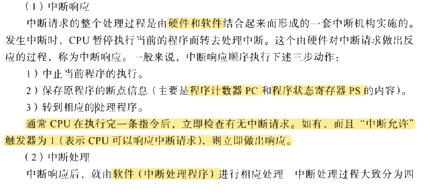

### 进程和CPU

1. 缓冲是buffer,缓存是cache；[详细对比的参考链接](https://blog.csdn.net/stpeace/article/details/69055053)

### 处理机调度

1. 周转时间是从提交到完成的时间；响应时间是从提交到响应的时间

- 
- 

### 存储管理

1. `页表也是需要硬件支持的`。逻辑地址转化为物理地址的过程是【硬件转化过程，这里没有考虑页面调度】：用页号p去检索页表，从页表得到该页的物理块号，把它装入`物理地址寄存器`中。同时，将页内地址d直接送入物理地址寄存器的块内地址字段中。这样，物理地址寄存器中的内容就是由两者拼接成的实际访问内存地址，从而完成了从逻辑地址到物理地址的转换。

### 设备

1. `DMA是硬件`。DMA传送的思想是：用`硬件机构`来实现`中断服务程序`所要完成的功能。

?> 1. 传送控制方式：程序直接控制方式、中断控制方式、DMA控制方式、通道控制方式  
2. 层次结构：程序驱动器、中断处理器、设备控制器、设备  
3. 缓冲：用硬件寄存器或在内存中专门划分出一块内存空间来存放输入输出的数据。  
4. DMA是磁盘->(缓冲区->)内存  
5. SPOOLing是：虚拟设备（独占设备-> 共享设备）  
6. 设备无关性是：用户程序应与实际使用的物理设备无光，由操作系统考虑不同驱动程序之间的问题。  

### 简答

- 什么是进程？它与程序有什么不同？

进程是有独立功能的程序在数据集上的运行活动。进程是分配资源的单位。核心用PCB描述和控制进程。进程是在多道程序设计系统中引进的，目的是为了表述程序的动态性和并行性。程序是静态的概念，进程是动态的概念。一个进程可以顺序执行多个程序，而一个程序可以被多个程序执行。

- 什么是分页存储管理？什么是分段存储管理？二者有何主要区别？

它们都是内存管理的技术。分页存储管理是将内存块分块，用户的地址空间分页，块和页的大小一样。系统以块为单位分配个各个进程，运行进程离散的分配在各个内存块中，并用页表实现物理地址和逻辑地址的转换。  
分段存储管理是将进程按照逻辑分段。以段为单位分配内存，一个进程的不同段可以不相邻。  
页是物理单位，段是逻辑单位。页的大小是由系统确定的，段的大小因用户而定。分页能够有效的减少碎片，但是不利于共享和保护，而分段则能够很好的共享和保护。如果要将两者的优点结合，那么就是段页式存储管理。

- 什么是缓冲？为什么要引入缓冲？

缓冲是用`硬件缓冲器`或在内存中划出一块空间用来存储输入输出的数据。通过引入缓冲，可以消除CPU和外设之间的速度差异，可以减少CPU的中断次数和中断时间，可以提高CPU和外设之间的并行性，提高外设的利用率,`能够解决DMA或通道传输信息速度的瓶颈`。

- 什么是地址静态重定位和动态重定位？各自的优点是什么？

地址的静态重定位是 (目标装入程序所进行的重定位) 进程加载进内存时，装入程序会将地址的逻辑地址转化为内存的物理地址，但是，这种地址的转化只有1次。而动态重定位是指进程每次访问内存，都会重新确定地址。`（？）`静态重定位可以解决

- 什么是死锁?造成死锁的必要条件是什么？

死锁是一个进程集中所有的进程都在等待其他的进程释放资源而造成的无限僵持下去的情景。死锁是资源不足且进程的推进速度引起的。造成死锁，必须满足以下条件：互斥、不可抢占资源、占有且申请、构成环

- 什么是作业调度，什么是进程调度？有什么区别?

作业调度是按照一定的算法，从提交的作业中挑选出进程放入内存，建立进程和分配资资源，建立PCB和将PCU加入就绪队列。进程调度是按照一定的算法，从就绪队列中挑选出进程，将CPU分配给该进程。但进程的任务完成后，作业调度会处理进程，释放资源。