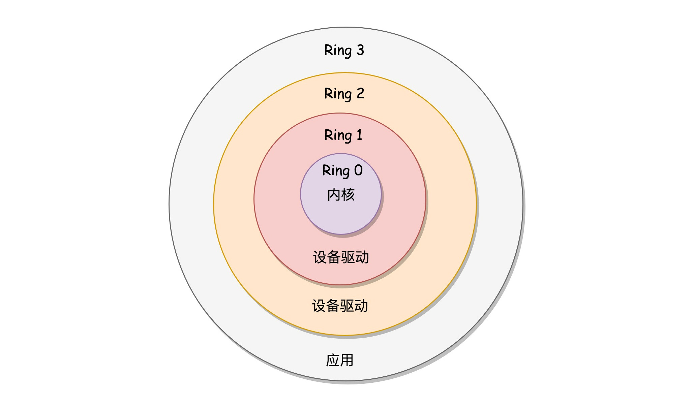

有了操作系统这个最基本的系统软件，他就能把计算机系统中的各种资源管理得井井有条，并且提供友好得人机界面。

操作系统应具备的主要功能如下：

#### 存储管理

`用户程序在运行之前都要装入内存`。内存就是所有运行程序共享的资源。

存储管理的主要功能包括：内存分配、地址映射、内存保护和内存扩充

- 内存分配

内存分配的主要任务是为每道程序分配一定的内存空间。为此，操作系统必须记录整个内存的使用情况。

- 地址映射（需要硬件支持）

我们在编写程序的时候并不考虑程序和数据要放在内存的什么位置。

源程序经过编译之后，会形成若干个目标程序，各自的起始地址都是"0"。为此，操作系统需要把目标程序的相对地址（或称为逻辑地址）转化为内存的物理地址。

- 内存保护

不能让本程序修改别的程序的内存空间的内容，所以必须建立内存保护机制。

例如，设置两个界限寄存器，分别存放正在执行的程序在内存中的上界地址值和下界地址值；当访问的内存的地址超出该地址值时，则属于地址越界，系统会产生中断并进行相应的处理。

- 内存扩充

用`虚拟存储技术`在逻辑上扩充内存。

把一个程序当前正在使用的部分（不是全体）放在内存中，而将其他部分放在磁盘上。


### 进程和处理机管理（进程都在内存上执行）

- 作业和进程调度

用户的计算任务称为作业。程序的执行过程称为进程，它是分配和运行处理机的基本的单位。

`一个作业通常要经过两级调度才能在CPU上执行`。首先是`作业调度`，它把选中的一批作业`放入内存`，并分配其他必要资源，为这些作业建立相应的进程。然后是`进程调度`，它按一定的算法从就绪进程中选出一个合适的进程，使之`在CPU上运行`。

- 进程控制

进程是系统活动的实体。进程控制包括创建进程、封锁进程、唤醒进程等。

- 进程通信

必须设置同步机制，包括同步方式和互斥方式。

相互合作的进程之间往往`需要交换信息`，为此系统提供通信机制。

### 文件管理

- 文件存储空间管理

分配存储空间，回收释放存储空间

- 文件操作的一般管理

`增删改`

- 目录管理

`查`

- 文件的读写管理和存取控制

文件的`权限`

### 设备管理

- `缓冲区`管理

解决CPU和外设速度不匹配的矛盾。

- 设备分配

通道：一个独立于CPU的`专门I/O控制`的处理机，控制设备与内存直接进行数据交换。

根据用户的I/O请求和相应的分配策略，为该用户分配外部设备、通道、控制器等。

- 设备驱动

实现CPU与通道和外设之间的通信。由CPU向通道发出I/O指令，后者驱动相应设备进行I/O操作。当I/O任务完成后，通道向 CPU发中断信号，由相应的中断处理程序处理。

- 设备无关性

在很多系统中将设备抽象成特殊文件，`按普通文件的使用方式进行统一管理。`

### 用户接口

`用户处于Ring 3`

- 程序接口

程序接口也称为系统调用接口【办事大厅】。在UNIX/Linux系统中，系统调用以C函数的形式出现。

```c
fd = open("file.c",2);
```

其中，open是系统调用的名字，其功能是根据模式值2（允许读、写）打开文件file.c



- 命令行接口

在Unix/Linux中为shell,命令解释程序接收并解释用户输入的命令，然后把它们传递给操作系统内部的程序（使用相应的系统调用），执行相应的功能。

即：`用户（包括root用户）不能调用内核态的代码，但是可以通过shell，让操作系统调用内核态的代码，来完成你的目的。`【系统调用类似Java中的接口/函数】

- 图形用户接口（GUI）
