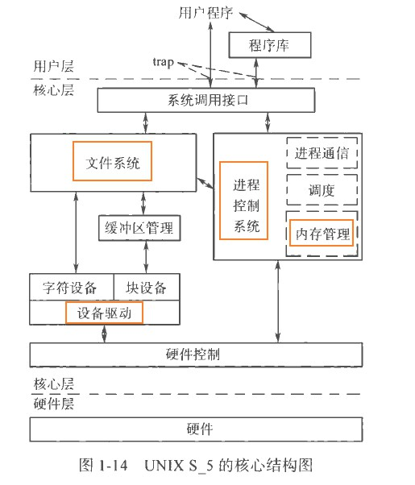
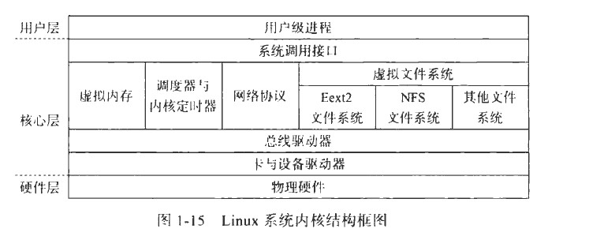
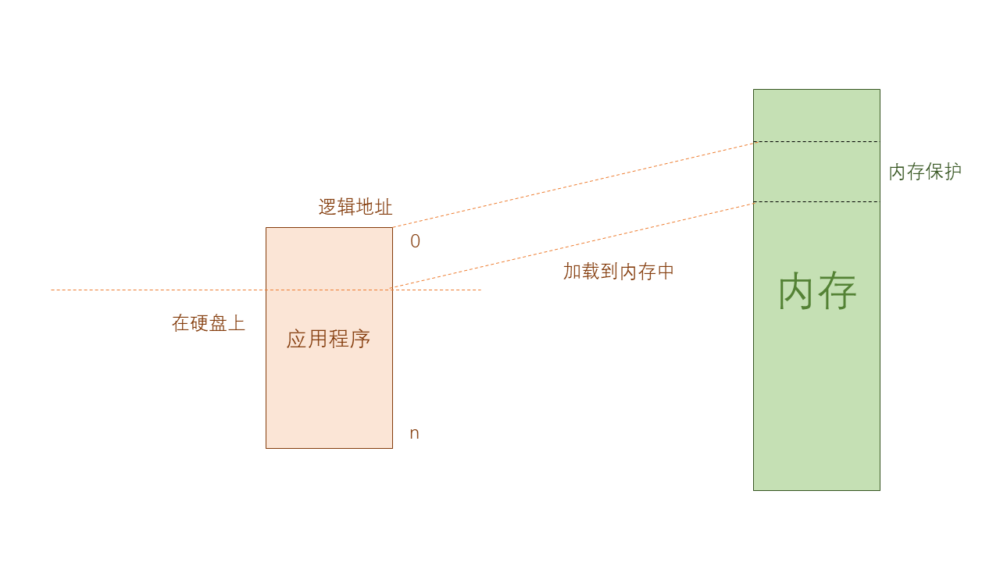

## 一、操作系统的概念

一个完整的计算机系统是由硬件和软件两大部分组成的。

在所有的软件中，`操作系统（Operating System）`占有特殊的地位，它是配置在计算机硬件上的第一层软件，它能控制硬件的工作，管理计算机系统的各种资源，并为系统中各个程序的运行提供服务。`(承上启下)`

### 1.1.1 计算机硬件结构

**特权指令和CPU工作模式:**

`指令`是控制计算机执行某种操作（如加、减、传送、转移等）的命令。一台计算机所能执行的全部的指令的集合称为`指令系统`或`指令集`。不同型号的CPU有着`不同的指令集`，也就是说，指令集与计算机系统密切相关，没有可移植性。(即：不同型号的CPU处理器架构不一样，`处理器架构是用硬件电路实现的指令集`)

在指令集中，有一类指令称为`特权指令`，主要用于系统资源的分配和管理，包括改变系统的工作方式，检测用户的访问权限，控制I/O设备动作等。（`root用户也不能使用特权指令`）

多数CPU都提供两种运行模式：`内核态`（又称核心态、系统态、`管态`）和`用户态`（又称`目态`）。这是为了保护操作系统程序（特别是内核部分）免受用户程序的干扰和损害。在`用户程序`在机器上运行时（`root用户`和非root用户），`CPU处于用户态`，权限比较低，只能执行非特权指令。当发生中断或系统调用时，CPU状态转为内核态，这样子就可以执行全部指令(包括特权指令)。

### 1.1.2 系统初启一般过程

打开操作系统后，计算机就开始初启过程，初启的目的是：`将操作系统的副本读入内存，建立正常的运行环境。`

对于Intel i386系类来说，初启过程分为以下步骤：

1. 硬件检测
2. 加载引导程序
3. 初始化内核
4. 实现用户登陆

### 1.1.3 什么是操作系统

操作系统没有统一的定义，你可以认为操作系统`承硬件启软件`,以下的要点可以帮助你更加理清操作系统是什么。

- 操作系统作为拓展机器  
  
通常把`裸机`（只有硬件的计算机）之上`覆盖各种软件`，从而形成功能更强的计算机称为`拓展机器`或`虚拟机`。操作系统能让`应用程序和用户`不用和硬件打交道。

- 操作系统作为资源管理器  
  
操作系统管理各种资源，并为上层的软件提供这些资源。

### 1.1.4 操作系统软件分类

**软件分类**：

按照所起的作用和需要的运行环境，软件通常可以分为三大类：系统软件、应用软件和支撑软件。

`系统软件`对计算机的`资源进行控制和管理`，并为用户和其他程序提供服务。

- 系统软件包括：
  - 操作系统（Windows、Linux）
  - 编译程序（C/C++、Java）
  - 汇编程序（Intel 8080、8086）
  - 连接装配程序（Loader）
  - 数据库管理系统（SQL 2000、Oracle）
  - 网络软件（IE、软性杀毒软件）

应用软件是为了解决某一特定的问题而设计的软件。

- 应用软件包括：
  - 图形软件（PS）
  - 软件包（rpm）

支撑软件是辅助软件技术人员从事`软件开发工作`的软件。

- 支撑软件
  - IDEA


### ✔😊1.1.5 操作系统的特征和服务

**操作系统的特征：**

- 并发性

并发性是指两个或多个进程在用一给定的时间间隔中进行（发）。  
【拓展：并行是同一时间要同时运行（行）】

- 共享性

被共享的程序必须是纯码（是指在执行过程中，本身不作变化的代码，通常是由指令和参数组成）

- 异步性

【拓展：同步异步、阻塞非阻塞参考资料：<https://www.zhihu.com/question/19732473>】  
【同步异步对于回答消息方(`对方`)而言，阻塞非阻塞相对本身进程（`本身`）而言】

- ✔😊抽象性

抽象性是把复杂事情简单化的有效方式。操作系统对硬件和软件资源进行了高度抽象话，`如CPU到进程的抽象、物理内存到地址空间（虚拟内存）的抽象以及磁盘到文件的抽象等`。


**操作系统提供的服务：**

操作系统提供两种基本的服务：系统调用和系统程序。

- 系统调用

系统调用使用户态转变为内核态。


- 系统程序

系统程序`不是`操作系统的组成部分。

最重要的系统程序是`命令解释器shell`

## 二、操作系统的发展和基本类型

在计算机发展初期，硬件技术处于起步阶段，此时操作系统并未形成，软件概念还不明确。以后随着硬件技术的发展，促进了`软件概念的形成`，从而也`推动了操作系统的形成和发展`。反过来，软件的发展也促进了硬件的发展。

**1. 手工操作阶段：**

要运行什么程序都是需要人工装入计算机。这个过程需要很多的人工干预，有一个问题是手工操作慢而CPU处理快。造成资源浪费，而且用户操作不便。

**2. 早期批处理阶段【作业自动转化】：**

为解决人工干预的问题，就必须缩短`建立作业（即用户的一个计算任务）和人工操作的时间`。所以有一个好的办法是：从一个作业自动转到下一个作业【使用监督程序来完成，而这种监督程序就是操作系统的雏形】。

早期的批处理分为`联机批处理程序`和`脱机批处理程序`。

（1）早期联机批处理程序

首先说明：`脱机批处理程序是优于联机批处理程序的`。

“联机”的含义是：作业的输入输出（I/O），调入内存等`都是由CPU控制的`，而且这种批处理程序是单道批处理程序（在内存中只保留一道作业）。

这种单道批处理系统虽然能实现作业的自动转换工作．但由千联机操作，影响了CPU 速度的发挥，仍不能很好地利用系统资源。

（2）早期的脱机批处理程序

为了解决早期批处理程序的问题（CPU快而I/O慢），人们引入了卫星机。

卫星机不与主机直接连接，只与外部设备打交道。`卫星机专门负责输入输出工作，主机专门完成快速计算任务，从而两者可以并行操作`。由于`I/O不受主机的直接控制`，所以称为脱机批处理。

**3. 多道批处理程序：**

早期的单道批处理程序只有一道作业在内存，因此资源利用率仍不高。

多道程序设计的基本思想是：`在内存中同时存放多道程序，在管理程序的控制下交替地执行`。这样子，在一段给定的时间内，计算机所能完成的总工作量（称为系统的`吞吐量`）也增加了。

由一道程序执行到两道程序执行产生了“质”的飞跃，而由两道到更多程序的执行却仅仅是“量”的变化。

在多道批处理程序中还必须解决一系列的问题，包括：内存的分配和保护问题、处理机的调度和作业的合理搭配问题、I/O设备的共享和方便使用问题、文件的存放和读写操作及安全性问题等。处理这些问题正是操作系统应具备的基本功能。

在这种操作系统中，用户的计算任务按`“作业”（Job）`进行管理。所谓作业，是用户定义的、由计算机完成的工作单位，它通常是一组计算机程序、文件和对操作系统的控制语句。

多道批处理系统有两个特点： 一是多道，二是成批。“多道”是指内存中`存放多个作业`，并在外存上存放大扯的后备作业。。而“成批＂的特点是在系统运行过程中`不允许用户和机器之间发生交互作用`。

**4. 分时系统：**

多道批处理系统缺少人机交互能力，为了处理这个缺点，人们开发出了`分时系统`。例如Linux。

所谓分时，主要是对`CPU时间的共享`。人们为了提高资源的利用率，采取了并行操作的技术，如CPU和通道并行操作、通道与通道并行操作、通道与I/O并行操作。

分时的时间单位称为`时间片`，它往往是很短的，如几十毫秒。这种分时系统的实现，需要有中断机构和时钟系统的支持。

使用分时系统，CPU可在用户操作时，抽出时间去完成其他进程的服务。但是由于分时的时间很短（只有几十毫秒），从而让用户认为整个系统都是只为他自己而服务，而并未感受CPU处理了其他的内容。

实时系统为用户提供了友好的接口，即用户能方便地与系统进行人机对话，用户能在较短时间内得到响应。

**5. 实时系统：**

有些领域对`实时`（表示“及时”或“即使”）处理的需求，比如`卫星发射自动装置`、工业生产自动控制、订票系统，人们开发出了`实时系统`。实时系统具有`专用性`,与分时系统相比，实时系统要求`有更高的可靠性和更严格的及时性`。

实时系统有三种典型应用形式，分别为：`过程控制系统`（用于工业生产地自动控制）、`信息查询系统`（特点时配置有大型文件系统或数据库）和`事物处理系统`（用户和系统需要频繁地进行交互作用）。

**6. 操作系统的发展:**

除此之外，还有分布式操作系统、嵌入式操作系统、秒杀操作系统、多处理器操作系统、网络操作系统、个人机操作系统等。

### 操作系统的主要结构

一个大的操作系统，是按照什么方式集合在一起？一般来讲，操作系统主要有以下体系结构，即：单体结构、层次结构、虚拟机结构、微服务结构、客户-服务器结构。

**1. 单体结构：**

单体结构实际上是`没有结构`。


操作系统上有大量的模块。所谓`模块就是完成一定功能的子系统，它是构成软件的基本单位。`单体结构的操作系统就如同我们通常编写的程序那样，各个模块之间直接调用，不分层次。

这样子有明显的缺点：`牵一发而动全身`，可靠性降低。

**2. 层次结构：**

层次操作系统的设计思想是：按照操作系统`各模块的功能和相互依存关系`，把系统中的模块分成若干层。


实际使用的操作系统多数是采用层次结构，如`UNIX`。

一个操作系统应划分多少层、各层处于什么位置、相互间如何联系等并无固定的模式。一般的原则是：`接近用户应用的模块在上层，贴近硬件的驱动程序模块在下层`。

`处于下层的程序模块`也称为操作系统的`内核`，这一部分模块包括中断处理程序、各种常用设备的驱动程序，以及运行频率较高的模块（如时钟管理程序、进程调度、内存管理模块程序）等。为了提高操作系统的执行效率和便于实时特殊保护，`它们一般常驻内存`。

**3. 虚拟机结构：**

虚拟机结构的核心部分是虚拟机监控程序（Virtual Machine Monitor，VMM）。虚拟机`能够共享物理机资源来实现`。

现代虚拟机设计有两种类型。一种是底层为一个虚拟机管理程序(有些电脑需要在BIOS开启，比如联想)，其上是两个或多个不同的操作系统（如Windows和Linux）。另一种是以VMware工作站为代表的，虚拟机管理程序作为一个应用程序运行在宿主操作系统之上。

使用虚拟机的另一个领域是Java虚拟机（Java Virtual Machine，JVM）

- [拓展-虚拟化](https://www.vmware.com/cn/solutions/virtualization.html)
- [拓展-服务器虚拟化](https://www.youtube.com/watch?v=HxjzYPzc67s)
- [拓展-云计算1](https://www.youtube.com/watch?v=2QWz2FwBAxU)
- [拓展-云计算2](https://www.youtube.com/watch?v=3o_KKYfx8-o)

**4. 微内核结构：**

传统上把操作系统的所有程序都放在内核中，现在的操作系统有一种发展趋势，就是`把实现扩展机器功能的这部分代码向上移入更高层次，从而尽可能使操作系统保持最小的核心，称为微内核`。

微内核运行在核心态下，微内核实现所有操作系统都应具备的最基本的功能，包括中断处理、进程管理、处理机调度和进程间通信。

**5. 客户-服务器结构：**

客户-服务器结构`适用于分布式系统`。

客户通过消息传递与服务器通信，它不需要知道该消息是在本地机器上处理，还是通过网络发送到服务器，然后在服务器上处理。这样，`客户只要关心两件事：发送请求和接收应答`。

以上，操作系统有很多，设计者首先要清楚地知道它们要得到什么，也就是`设计目标是什么`。

### UNIX和Linux系统的核心结构

UNXI是当代最著名的`多用户、多进程、多任务分时操作系统`。

它的特点如下：可移植性好；有良好的用户界面；树形分级结构的文件系统；字符流式文件；丰富的核外系统进程；提供管道机制。

UNIX系统可分为三层：靠近硬件的底层是内核，即UNIX操作系统常驻内存部分；核心外的中间层是shell层；最高层是应用层。

内核是UNIX操作系统的主要部分，它实现进程管理、存储管理、文件系统和设备管理等功能，从而为核外的所有程序提供运行环境。



UNIX 核心基本上采用层次结构。它可视为左、右两大部分。`左边是文件系统部分，右边是进程控制系统部分`。

文件系统部分涉及操作系统中各种信息的保存，通常都是以文件形式存放的，它相当于核心的`“静态”部分`。进程控制系统部分涉及操作系统中各种活动的调度和管理，通常以进程形式展现其生命活力，它相当于核心的`“动态”部分`。这两部分存在密切联系。

Linux操作系统采用`单体结构`，即所有的内核系统功能都包含在一个大型的内核软件之中。当然，Linux系统也支持可动态装载和卸载的模块结构。利用这些模块，可以方便地在内核中添加新的组件或卸载不需要使用的内核组件。Linux系统内核结构框图如下：



`Linux主要应用于服务器系统和嵌入式系统。`

## 三、操作系统的主要功能

有了操作系统这个最基本的系统软件，他就能把计算机系统中的各种资源管理得井井有条，并且提供友好得人机界面。

操作系统应具备的主要功能如下：

### 存储管理

`用户程序在运行之前都要装入内存`。内存就是所有运行程序共享的资源。

存储管理的主要功能包括：内存分配、地址映射、内存保护和内存扩充

- 内存分配

内存分配的主要任务是为每道程序分配一定的内存空间。为此，操作系统必须记录整个内存的使用情况。

- 地址映射（需要硬件支持）

我们在编写程序的时候并不考虑程序和数据要放在内存的什么位置。

源程序经过编译之后，会形成若干个目标程序，各自的起始地址都是"0"。为此，操作系统需要把目标程序的相对地址（或称为逻辑地址）转化为内存的物理地址。

- 内存保护

不能让本程序修改别的程序的内存空间的内容，所以必须建立内存保护机制。

例如，设置两个界限寄存器，分别存放正在执行的程序在内存中的上界地址值和下界地址值；当访问的内存的地址超出该地址值时，则属于地址越界，系统会产生中断并进行相应的处理。

- 内存扩充

用`虚拟存储技术`在逻辑上扩充内存。

把一个程序当前正在使用的部分（不是全体）放在内存中，而将其他部分放在磁盘上。



### 进程和处理机管理（进程都在内存上执行）

- 作业和进程调度

用户的计算任务称为作业。程序的执行过程称为进程，它是分配和运行处理机的基本的单位。

`一个作业通常要经过两级调度才能在CPU上执行`。首先是`作业调度`，它把选中的一批作业`放入内存`，并分配其他必要资源，为这些作业建立相应的进程。然后是`进程调度`，它按一定的算法从就绪进程中选出一个合适的进程，使之`在CPU上运行`。

- 进程控制

进程是系统活动的实体。进程控制包括创建进程、封锁进程、唤醒进程等。

- 进程通信

必须设置同步机制，包括同步方式和互斥方式。

相互合作的进程之间往往`需要交换信息`，为此系统提供通信机制。

### 文件管理

- 文件存储空间管理

分配存储空间，回收释放存储空间

- 文件操作的一般管理

`增删改`

- 目录管理

`查`

- 文件的读写管理和存取控制

文件的`权限`

### 设备管理

- `缓冲区`管理

解决CPU和外设速度不匹配的矛盾。

- 设备分配

通道：一个独立于CPU的`专门I/O控制`的处理机，控制设备与内存直接进行数据交换。

根据用户的I/O请求和相应的分配策略，为该用户分配外部设备、通道、控制器等。

- 设备驱动

实现CPU与通道和外设之间的通信。由CPU向通道发出I/O指令，后者驱动相应设备进行I/O操作。当I/O任务完成后，通道向 CPU发中断信号，由相应的中断处理程序处理。

- 设备无关性

在很多系统中将设备抽象成特殊文件，`按普通文件的使用方式进行统一管理。`

### 用户接口

`用户处于Ring 3`

- 程序接口

程序接口也称为系统调用接口【办事大厅】。在UNIX/Linux系统中，系统调用以C函数的形式出现。

```c
fd = open("file.c",2);
```

其中，open是系统调用的名字，其功能是根据模式值2（允许读、写）打开文件file.c


- 命令行接口

在Unix/Linux中为shell,命令解释程序接收并解释用户输入的命令，然后把它们传递给操作系统内部的程序（使用相应的系统调用），执行相应的功能。

即：`用户（包括root用户）不能调用内核态的代码，但是可以通过shell，让操作系统调用内核态的代码，来完成你的目的。`【系统调用类似Java中的接口/函数】

- 图形用户接口（GUI）
