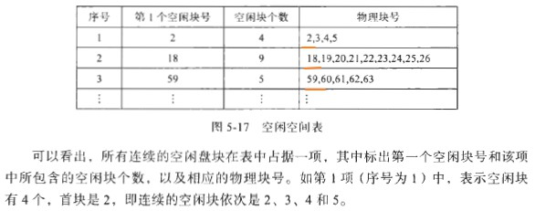

## 5.1 文件系统概述

实现大量信息的长期方便共享，系统中绝大部分信息都放在外存。

### 文件及其分类

**1. 文件：**

文件是`从存储设备抽象出来`的`被命名的相关信息的集合体`。它通常存放在外存上，可以作为一个独立单位存放和进行相关的操作（如打开、关闭、读、写等）

举例：编译后形成的目标文件，目标文件是组成模块的字节序列。系统连接程序知道这些模块的作用；可执行文件是由一系列代码段组成的，装入程序可以把它们装入内存，然后运行。

**2. 文件类型：**

- 在Linux/MS-DOS系统中，按文件的内部构造和处理方式

1. 普通文件：包括用户的一些文件，也包括系统文件和库文件，包括ASCII文件和二进制文件。
2. 目录文件
3. 特殊文件：特指各种外部设备。操作系统把所有的IO设备都看作是文件。在目录查找、存取权限验证和普通文件相似，而在读、写则要特殊对待。又可分为`字符特殊文件`（输入输出设备，如打印机、终端、网络、鼠标等）和`块特殊文件`（如硬盘等）

- 按存取权限分类

1. 只读文件
2. 读写文件
3. 可执行文件

- 按用途分类

1. 系统文件：对用户不开放，只能通过操作系统提供的系统调用为用户服务。
2. 库文件：由标准子程序和常用的用户程序组成的文件。允许用户使用，但不允许用户修改。
3. 用户文件：源程序、目标程序、原始数据、计算结果等。允许用户修改

- 按文件中的数据形式分类

1. 源程序：ASCII码和汉字
2. 目标文件：经过编译，二进制文件
3. 可执行文件：经过编译、连接后形成的可执行的目标文件

- 按保存时间分类

1. 临时文件：用户在一次解题过程中建立的“中间文件”
2. 永久文件

二进制文件所包含的每个字节都有256（2^8）种值，是一种更有效的表达信息的方式。二进制通常是可执行文件，它的内部结构如下：


`存档文件`是二进制文件的另一种实例：在Linux中，它是`编译过`但是`未连接库过程`（模块）`集合`的组成 。

**3. 文件命名：**

用户对文件是“按名存取”的。很多操作系统的文件名由两部分组成：“文件名、拓展名”，如prog.c。拓展名用于区分文件的属性即其作用。常见文件扩展名及其含义：

|          扩展名          |    文件类型    |                      含义                      |
| :----------------------: | :------------: | :--------------------------------------------: |
| c, cc, java, pas, asm, a |     源文件     |             用各种语言编写的源代码             |
|     lib, a. so ,dll      |     库文件     |              供程序员使用的例程库              |
|          obj, o          |   `目标文件`   |        编译过的、尚未连接的机器语言程序        |
|      exe, com, bin       |   可执行文件   |             可以运行的机器语言程序             |
|      arc , zip, tar      |   `存档文件`   | 相关文件组成一个文件（有时压缩）进行存档或存储 |
|         bat, sh          |     批文件     |            由命令解释程序处理的命令            |
|         txt, doc         |    文本文件    |                 文本数据、文档                 |
|    wp, tex, rrf, doc     |   字处理文档   |           文件各种字处理器格式的文件           |
|       ps, pdf, jpg       | 打印或视图文件 | 以打印或可视格式保存的ASCII 码文件或二进制文件 |
|      rnpeg, mov, rm      |   多媒体文件   |         包含声音或AN 信息的二进制文件          |

### 文件系统的功能

`文件管理系统`，简称`文件系统`，是操作系统中负责操纵和管理文件的一整套设施。

文件系统应具备以下功能：

1. 文件管理
2. 目录管理
3. 文件存储空间的管理：包括对文件存储空间的分配与回收，并为文件的`逻辑结构`和磁盘上的`物理地址建立映射关系`。
4. 文件的共享和保护
5. 提供方便的接口：使用户“按名存取”

## 5.2 文件的逻辑组织和物理组织

从用户的观点看，是文件的逻辑组织；用系统设计人员的观点看，是文件的物理组织。物理组织需要考虑：在存储设备中如何放置、如何组织、如何实现等细节。

### 文件的逻辑组织

用户可以通过两种方式构造文件。

**1. 无结构文件：**

文件内部不再划分记录，由一组相关信息组成的有序字符流。

`把文件看作字符流`，为操作系统带来了灵活性。在Unix和Windows中，`所有的文件都被看成是流式文件`。

**2. 有结构文件：**

有结构文件又称为记录式文件。每个记录是一组相关的数据集合，用于描述一个对象某方面的属性，如年龄、姓名、职务、工资等。

根据长度是否相同，又可分为定长记录文件（用于数据处理）和边长记录文件（早期的穿孔机）。


### 用户对文件的存取方式

文件的基本作用是存储信息。

**1. 顺序存取方式：**

【有点像链表】可以根据文件`指针`自动地向前推进。

**2. 随机存取方式：**

【有点像数组】随机存取也称为直接存取，它是基于磁盘的文件存取模式。随机存取方式主要用于`对大批信息的立即访问`，如`对大型数据库`的访问。当接收到访问请求时，系统计算出信息所在块的位置，然后直接读取其中的信息。

进行随机存取时，先要设置读写指针的当前位置，可用专门的操作seek实现。然后从这个位置开始读取文件内容。

随机方式下读写文件的操作都是以`块号`为参数的。用户提供的操作系统的块号通常是`相对块号`。用户对文件的存取是逻辑操作，由操作系统将逻辑地址转化为设备的物理地址，然后驱动设备进行相应的操作。

**3. 其他存取方式：**

其他存取方法是建立在随机存取方法之上的。包括对文件的索引构造（对于大型文件，用二级索引+二分查找）。


### 文件的物理组织

**1. 连续文件：**

连续文件（又称顺序文件）是基于磁带设备的最简单的物理文件结构。它是把一个`逻辑上连续的文件信息`存放在`连续编号的物理块`（或物理记录）中。

连续分配的优点是在`顺序存取(逻辑文件信息时)`时速度较快，一次可以存取多个盘块，改进了IO性能。所以，它常用于存放系统文件，如操作系统文件、编译程序文件和其他由系统提供的实用程序文件，因为这类文件往往是从头至尾依次存取。

连续分配也存在如下缺点：

1. 要求建立文件时就确定它的长度，依次来分配相应的存储空间。
2. 它不便于文件的动态扩充：在实际的计算中，作为输出结果的文件往往随执行过程而不断增加新内容。当输出结果太多时，就得寻找其他足够大的空间，进行“大搬家”
3. 可能出现外部碎片。

当创建一个文件时，实现连续盘块分配的策略`类似于内存的动态分配`算法，可以采用`最先适应算法`和`最佳适应算法`。

**2. 链接文件：**


这种链接分配不会产生磁盘的外部碎片。这种物理结构形成的文件称为`链接文件`和`串连文件`。

但是，这又带来新的问题：

1. 一般仅适于对信息的顺序访问，而不利于对文件的随机存取
2. 每个物理块上增加一个链接字，为信息管理添加了一些麻烦。
3. 可靠性：如果因指针丢失或受损出现故障，则会出现问题。可以采用双链表，但是会造成更大的开销

使用改进的`文件分配表`是很好的方法。文件分配表出现在每个磁盘分区开头的扇区中。每个盘块在表中占一项，表的序号是物理盘块号，每个表项存在链接下一盘的指针。

**3. 索引文件：**

索引分配是实现非连续分配的另一种方案。

这种方案类似于分页。


索引文件具备链接文件的优点，同时还能进行随机存取。但是这种组织形式需要增加索引表带来的空间开销。

**4. 多重索引文件：**


这种结构中采用间接索引方式，即由最初索引项中得到某个盘块号，该块中存放的信息是另一组盘块号；而后者每一块中又可以存放下一组盘块号（或者是文件本身信息），这样间接几级（通常为1~3级），最末尾的盘块中存放的信息一定是文件内容。


Linux和Unix就采用多重索引的方式。采用多重索引存在着间接索引需要多次访盘而影响速度的缺点，但是Linux分时环境中的文件都比较小，这就减弱了其缺点。

## 5.3 目录文件--i节点

同PCB一样，对于文件也需要有相应的控制结构。文件系统通常同目录或文件夹来记载系统中文件的信息。在很多系统中，目录本身也是文件。

### 文件控制块和文件目录

**1. 文件控制块：**

文件系统中为每个文件都设立了一个`文件控制块`，这种结构通常由以下信息组成：

1. 文件类型：-、d、特殊文件等
1. 保护信息：对文件读、写以及执行等操作的控制权限标志
1. 大小：当前文件的大小（以字节、字或块为单位）和允许的最大1值
1. 时间：反映有关创建、最后修改、最后使用等情况，可用于对文件实时保护和监控
1. 文件名：file5、m1.c等
1. `位置`：指针，它指向存放该文件的设备和该文件在设备上的位置
1. 使用计数：有多少个进程使用（打开了该文件）


核心利用这种结构对文件实施各种管理。例如，按名存取文件时，先要找到对应的控制块，验证权限；仅当存在合法时，才能取得存放文件信息的盘块地址。

**2. UNIX文件系统的i节点：**

在UNIX/Linux系统中，对`文件进行控制和管理`的数据结构称为`i节点（index-node）`。`每个文件都有自己的i节点，每个i节点有唯一的i节点号`。i节点有静态和动态两种形式，`静态形式`存放在`磁盘`的专设的i节点区中，而`动态形式`又称为活动i节点，它存放在系统专门开设的活动i节点区（如内存）中。

每一个文件对应唯一的盘i节点（即静态形式），此外，每个打开的文件都有一个对应的活动i节点。

盘i节点是一种数据结构：

```java
struct dinode
{
    ushort di_mode;        /*文件属性和类型*/
    short di_nlink;        /*文件连接计数*/
    ushort di_uid;          /*文件主标号*/
    ushort di_gid;          /*同组用户标号*/
    off_t di_size;          /*文件字节数*/
    char di_addr[40];       /*盘块地址*/
    time_t di_atime;        /*最近存取时间*/
    time_t di_mtime;        /*最近修改时间*/
    time_t di_ctime;        /*创建时间*/
} ;
```

活动i节点除了具备盘i节点的主要信息外，还增添了下列反映该活动状态的项目：

1. 散列链指针（i_forw和i_back）和自由链指针（av_forw和av_back），构成两个队列。利用散列量可以加快检索i节点的速度。散列值利用i节点号和其所在的逻辑设备号求得
2. 状态标志（i_flag），表示该i节点是否被封锁，有无进程等待它解除封锁，是否被修改过，是否是安装文件系统的节点等。
3. 访问计数（i_count），表示在某一时刻该文件被打开以后进行访问的次数。当它为0时，该i节点放到自由链中，表示它是空闲的。
4. i节点所在设备的逻辑号（i_dev），表明文件系统可有多台逻辑设备构成
5. i节点号（i_number），它是对应的盘i节点在盘区中的顺序号

另外还有指针项，分别指向安装设备i节点，相关数据流，多文件映像盘块号。

**3. 文件目录：**

为了加快对文件的检索，以便获取文件的属性信息，往往将`文件控制块集中在一起进行管理`。这种文件控制块的有序集合称为文件目录。`文件控制块就是其中的目录项`。完全由目录项构成的文件称为目录文件，简称`目录`。

文件目录具有将`文件名`转化成该文件在`外存的物理位置`的功能，它实现文件名与存放盘块之间的映射,这是文件目录所提供的最基本的功能。

UNIX系统的目录项非常简单，它只有文件名和i节点号组成。有关文件的类型、大小、时间、文件主和磁盘块等信息都包含在i 节点中。UNIX 系统中`所有目录文件都由这种目录项组成`。按照给定路径名的层次结构，一级一级地向下找。由文件名找到对应的）节点号．再从1 节点中找到文件的控制信息和盘块号。


主要的目录操作有如下几种：

1. 查找。通过查找一个目录结构，找到特定文件所对应的项，实现按名查找。
2. 建立文件。建立新文件，把相应控制块加到目录中。
3. 删除文件。当一个文件不再需要时，把它从目录中抹掉
4. 列出目录清单。显示目录内容和该消单中每个文件目录项的值。
5. 后备。为了保证可靠性，需要定期备份文件系统。通常的办法是把全部文件复制到磁盘上。这样，在系统失效需要重新恢复运行时．能够提供后备副本。目录文件经常要存档或转储。

### 目录结构

目录的基本组织方式包含单级目录、二级目录、树形目录和非循环图目录。

**1. 单级目录：**

单级目录存在以下缺点：

1. 查找速度慢
2. 不允许重名，即使是不同的用户
3. 不便于共享

**2. 二级目录：**

二级目录是为每个用户单独建立一个目录。


但是也不利于共享

**3. 树形目录：**

每个目录的直接上一级目录称作该目录的父目录，而它的直接下一级目录称作子目录。除根目录外，每个目录都有父目录。


在Linux中，不以分隔符（“/”或“\”）开头的文件路径名就表示相对路径名。

**4. 非循环图目录：**

在树形目录中增加链接（Link）.


对文件共享是通过两种链接方式实现的：一种是允许目录项链接到任一表示`文件目录`的节点上，另一种是只允许链接到表示`普通文件`的叶节点上。

但是链接到目录上，很容易使用不当而造成环路链接。

因此，Unix系统基本上采取第2种链接方式，即只允许对单个普通文件链接。

因此，Unix是带链接的树形结构。

## 5.4 文件存储空间--空闲块（超级块）

当我们使用编辑命令创建一个新文件时，在编辑工作的末尾`要执行写盘操作`，就是把编辑缓冲区中的内容写到磁盘的盘块上。

目前常用的磁盘空闲空间管理技术，主要包括空闲空间表法、空闲块链接法、位示图法和空闲块成组链接法。

**1. 空闲空间表法：**



但是，当存储空间有大量的小空闲区时，空闲表会变得很大，使检索效率降低。而且，同内存的动态分区分配一样，随着文件的不断创建和删除，会使磁盘空间分隔成许多小块，如果说，在磁盘中使用紧凑的方法，那消耗的时间无疑是巨大的。

**2. 空闲块链接法：**


每当在链上增加或移走空闲块时都需要执行大量的I/O操作

**3. 位示图法：**

它利用一串二进制位值反映磁盘空间的分配情况，也称位向量（Bit Vector）法。如果空闲块空闲，对应位是1；如果盘块已分出去，则对应位是0（有些系统标志方式与此相反）


位示图法的主要优点是在寻找第l 个空闲块或几个连续的空闲块时相对简单和有效.

**4. 空闲块成组链接法：**

用空闲块链接法可以节省内存，但实现效率低。一种改进办法是把所有空闲盘块按固定数量分组，如每50 个空闲块为一组，组中的第1 块为`”组长”块`. 第1 组的50 个空闲块块号放在第2 组的组长块中，而第2 组的其余49 块是完全空闲的。第2 组的50块号又放在第3 组的组长块中。以此类推．`组与组之间形成链接关系`。最后一组的块号（可能不足50 ）通常放在内存的`一个专用栈`（即文件系统`超级块`中的空闲块号栈）结构中。这样，平常对盘块的`分配和释放在栈中`（或构成新的一组）进行.UNIX系统中就采用这种方法。


- 空闲块分配

当需要为新建文件分配空闲盘块时，总是先把超级块中表示栈深（即栈中有效元素的个数）的数值减1, 如图5-19 中所示情况： 40（栈深，以1开始）-1=39 。以39 作为检索超级块中空闲块号栈的索引．得到盘块号1ll, 它就是当前分出去的第1 个空闲块。如果需要分配20 个盘块，则上述操作就重复执行20 次。

如果当前栈深的值是1（只剩下组长块了）, 需要分配2 个空闲盘块．那么．栈深值(1) 减1, 结果为0, 此时系统进行特殊处理：以0 作为索引下标，得到盘块号150, 它是第78 组的组长；然后，把150 号盘块中的内容一下一组（即第77 组）所有空闲盘块的数量(50)和各个盘块的块号一一分别放入`超级块的栈深和空闲块号栈`中,超级块的栈中记载了第77 组盘块的情况；`最后把150 号盘块分配出去`【本身也会被分配出去】。至此，分出去l 个空闲盘块。接着再分配1 个盘块，此时工作简单多了，即50-1=49, 以49 为索引得到第77 组的151号块。

- 空闲块释放

在图5-19 所示的情况下，若要删除一个文件，它占用3 个盘块，块号分别是69、75 和87 。首先释放69 号块，其操作过程是：把块号69 放在栈深40 所对应的元素中．然后`栈深值`加1 , 变为41 。接着分别释放75 号块和87 号块。最后，超级块中栈深的值为43. 空闲块号栈中新加入的3 个盘块出现的次序是69 、75 、87 。【这里的块只是空闲的块，栈中连续的块物理上不一定连续】。如果栈深的值是50, 表示该栈已满，此时还要释放一个盘块89 号，则进行特殊处理：先将该栈中的内容（包括栈深值和各空闲块块号）写到需要释放的新盘块（即89 号，`刚刚要释放的盘块`）中；将栈深及栈中盘块号清O; 以栈深值0 为索引，将新盘块号89 写入相应的栈单元。然后栈深值加1，`栈深值变为l` 。这样，盘块89 号就成为新组的组长块。

图5-19 中第1 组只有49 块，它们的块号存于第二组的组长块3950 号中。该块中记录第1 组的总块数为50, 而首块块号标志为0.这是什么意思？原来这个"O" 并不表示物理块号，而是分配`警戒位`，作为空闲盘块链的结束标志。如果盘块分配用到这个标志，说明磁盘上所有空闲块都用光了，系统要发告警信号，必须进行特殊处理。

空闲块成组链接法是`UNIX系统`中采用的空闲块管理技术，它兼具空闲块表法和空闲块链接发的优点，克服了其中表（或链）太长的缺点。当然，空闲块成组链接法在管理上复杂一些，尤其当盘块分配出现栈空，盘块释放遇到栈满时，要进行特殊处理。

## 5.5 文件系统的可靠性

### 坏块管理

磁盘经常有坏块，有的坏块是磁盘从生产线下来时就存在的（如硬盘），有的是在使用中出现的。

解决坏块有硬件和软件两种方案。

硬件方案是在磁盘的`一个扇区上记载坏块清单`。当控制器第一次进行初始化时，它会读取坏块清单，并且挑选多余的块（或磁道）取代有缺陷的块，在坏块清单中记下这种`映像`。以后用到坏块时就由对应的多余块代替。

软件方案需要`用户或文件系统仔细地构造一个文件`，它包含全部坏块。这样`把这些坏块从自由链中清除`，使之不出现在数据文件中。只要不对坏块文件进行读写，就不会出现问题。但是，在磁盘后备时要格外小心（因为是用软件地方法解决的），避免读这些文件。

### 文件的备份和恢复

**1. 备份策略：**

- 完全备份

- 增量备份

- 更新备份

增量备份和更新不同在于：增量备份是备份当天更改的数据，而更新备份是备份上次进行完全备份后`至今更改的全部数据文件`。

`更新备份的缺点是，每次进行小备份工作的任务比增量备份的工作量要大。但其好处是，增量备份每天都要保存当天的备份数据，需要过多的存储量；而更新备份要顺序进行多次备份的恢复，而更新备份只需要恢复两次【git模式】。因此，更新备份的恢复工作相对简单。`

更新不是很频繁的话，可以选择更新备份。更新很频繁的话，就备份时间而言，更新备份太久了（需要和前面的进行比较），不经济，这时可以考虑增量备份，以便缩短备份周期。

**2. 备份时机：**

按备份进行的时间来看，有“定期备份”和“不定期备份”

**3. 备份文件的恢复：**

Linux中的tar -xp 或 cpio -im

### 文件系统的一致性

系统崩溃后，很容易导致文件系统处于不一致状态。

在Unix系统中要检查两类一致性：盘块一致性和文件一致性。

**1. 盘块一致性检查：**

检查程序建立两个表格，即`使用表和空闲表`。每个盘块在两个表中各对应一项，其实，各表项就是一个计数器。使用表记载各个盘块在`文件中出现的次数`，而空闲表记录各个盘块在`自由链`（或空闲块位示图）中出现的次数。所有表项的初值都为0 。检查程序读取全部i 节点，从而建立相应文件所用盘块号的清单。每读到一个盘块号，使用表中对应项加1 。把所有i 节点处理完之后，检查空闲链或位示图，找出所有未用盘块；每找到一个，空闲表对应项就加1 。

【`在用块为1表示：一个数据块在一个文件中出现；空闲块为0表示在数据块没有被文件使用`】

检查之后，如果文件系统是一致的，那么`每个盘块在两个表中对应项的值加在一起是1 , 即每个盘块或者在文件中使用，或者处于空闲`，如图5-20a 所示。如果系统失败，会造成盘块丢失现象，如图5-20b 所示，其中盘块4 在两个表中都未出现。解决办法很简单：把丢失的盘块添加到空闲链中。

还可能出现如图5-20c 所示情况，即盘块9 在空闲链中出现两次。其解决办法是重建空闲链。

最麻烦的情况是同一数据块在两个或更多文件中出现，如图5-20d 所示，盘块7 在使用表中计数值为2 。如果删除其中一个文件，则该块就同时出现在两个表中；如果删除这两个文件，则它在空闲表中的计数就是2 。对此，可让系统分配一个空闲块K, 把盘块7 的内容复制到该块中，并且把盘块K 添加到一个文件中。

如果一个盘块既在使用表中，又在空闲表中，就把它从空闲链中去掉。


**2. 文件一致性检查：**

【文件是逻辑的；i节点会指向盘块，这里可以认为是是物理的】

系统检查程序查看目录系统，也使用计数器表，`每个文件对应一个计数器`。从根目录开始，沿目录树递归向下查找。`对于每个目录中的每个文件，其i 节点对应的计数器值加1`【这里主要是检查文件的`链接`】 。当检查完毕后，得到一个以1 节点号为下标的列表，说明`每个文件包含在多少个目录中`。然后，把这些数目与存放在1 节点中的链接计数进行比较。如果文件系统保持一致性，那么两个值相同；否则，出现两种错误，即1 节点中的链接计数太大或太小。如果i 节点中的链接计数大于目录项个数【i节点指向了无效的目录】，即使所有文件都从全部目录中删除，该计数也不会等于0, 从而无法释放i 节点。该问题并不太严重，只是浪费了磁盘空间。对此可把该计数置为正确值，如正确值为0, 则应删除该文件。

如果该计数太小，比如有两个目录项链接到一个文件，但i 节点链接计数却是1, 只要其中有一个目录项删除， i 节点链接计数就变为0 。此时，文件系统标记它不可使用（该文件不能用），并释放其全部盘块。`结果导致还有一个目录指向不可用的i 节点，它的盘块可能分给另外的文件，这就造成了严重的后果`。解决办法是，使i 节点链接计数等于实际的目录项数。

通常，可把检查盘块和检查文件这两种操作放在一起进行。

## 5.6 文件共享和保护

### 文件共享

