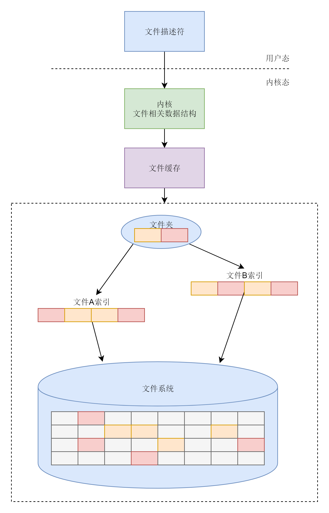

## 文件系统

### Linux文件系统

- 文件系统中，需要维护文件系统的严格的格式。
- 每一个硬盘上保护的文件都要有一个索引，来维护这个文件上的数据块都保存在哪里。
- 文件通过文件夹组织起来，可以方便用户使用。
- 为了能够更快读取文件，内存里会分配一块空间作为缓存，让一些数据块放在缓存里
- 在内核中，要有一整套数据结构来表示打开的文件
- 在用户态，每个打开的文件都有一个文件描述符，可以通过各种文件相关的系统调用，操作这个文件描述符。



### inode与块的存储

Linux最主流的文件系统格式为`ext`系列的文件系统

`硬盘也是分成大小相同的单元，称为块（Bolck）`，默认大小是`4K`。这个值在格式话的时候是可以设定的。

`inode（index node）是索引`。inode存放的信息为：文件分成多少块，每一块在哪里，同时，还包含文件的元数据，例如名字、权限等（ls -l 的信息就是inode的信息）。

inode里面还有几个与文件相关的时间。i_atime 是 access time，是最近一次访问文件的时间；i_ctime 是 change time，是最近一次更改 inode 的时间；i_mtime 是 modify time，是最近一次更改文件的时间。

这里你需要注意区分几个地方。首先，访问了，不代表修改了，也可能只是打开看看，就会改变 access time。其次，修改 inode，有可能修改的是用户和权限，没有修改数据部分，就会改变 change time。只有数据也修改了，才改变 modify time。

我们刚才说的“某个文件分成几块、每一块在哪里”，这些在 inode 里面，应该保存在 `i_block` 里面。

在 ext2 和 ext3 中，其中前 12 项直接保存了块的位置，也就是说，我们可以通过 `i_block[0-11]`，直接得到保存文件内容的块。

但是，如果一个文件比较大，12 块放不下。当我们用到 i_block[12]的时候，就不能直接放数据块的位置了，要不然 i_block 很快就会用完了。这该怎么办呢？我们需要想个办法。我们可以让 i_block[12]指向一个块，这个块里面不放数据块，而是放数据块的位置，这个块我们称为间接块。也就是说，我们在 i_block[12]里面放间接块的位置，通过 i_block[12]找到间接块后，间接块里面放数据块的位置，通过间接块可以找到数据块。


但是通过这种方式的话，访问大文件的话，会很慢，因为需要多个磁盘访问。

ext4 做了一定的改变。它引入了一个新的概念，叫做 `Extents`。

我们来解释一下 Extents。比方说，一个文件大小为 128M，如果使用 4k 大小的块进行存储，需要 32k 个块。如果按照 ext2 或者 ext3 那样散着放，数量太大了。但是 Extents 可以用于存放连续的块，也就是说，我们可以把 128M 放在一个 Extents 里面。这样的话，对大文件的读写性能提高了，文件碎片也减少了。


### inode 位图和块位图

我们知道了，硬盘上肯定有一系列的 inode 和一系列的块排列起来。那怎么找到inode和这些块位图呢？

所以在文件系统里面，我们专门弄了一个块来保存 `inode 的位图`。在这 4k 里面，每一位对应一个 inode。如果是 1，表示这个 inode 已经被用了；如果是 0，则表示没被用。同样，我们也弄了一个块保存`block 的位图`。

### 目录的存储格式


### 软链接和硬链接的存储格式

还有一种特殊的文件格式，硬链接（Hard Link）和软链接（Symbolic Link）。

```bash
# 硬链接，可以指向目录
ln -s /path softlinkname

# 软链接，只能指向目录
ln /a.txt hardlinkname
```


`硬链接`与原始文件`共用一个inode`，同时硬链接只能`指向一个具体的文件`，而不能是目录。

同时inode是不跨文件系统的，每个文件系统都有自己的inode列表，因而硬链接是没办法跨文件系统的。

而`软链接`不同，`软链接相当于创建了一个文件`。这个文件也有独立的inode，只不过打开这个文件里面内容的时候，`内容指向了另一个文件`。所以这个就能灵活了，我们可以跨文件系统，甚至目标文件也被删除了，链接文件还是在的，只不过找不到文件了而已。

### 总结


我们平时用的最多的是inode和数据块。

无论是文件夹还是文件，都有一个inode。inode里面会指向数据块，对于文件夹的数据块，里面是一个表，是下一层的文件名和inode的对应关系。而文件夹的数据块是存放真正的数据。