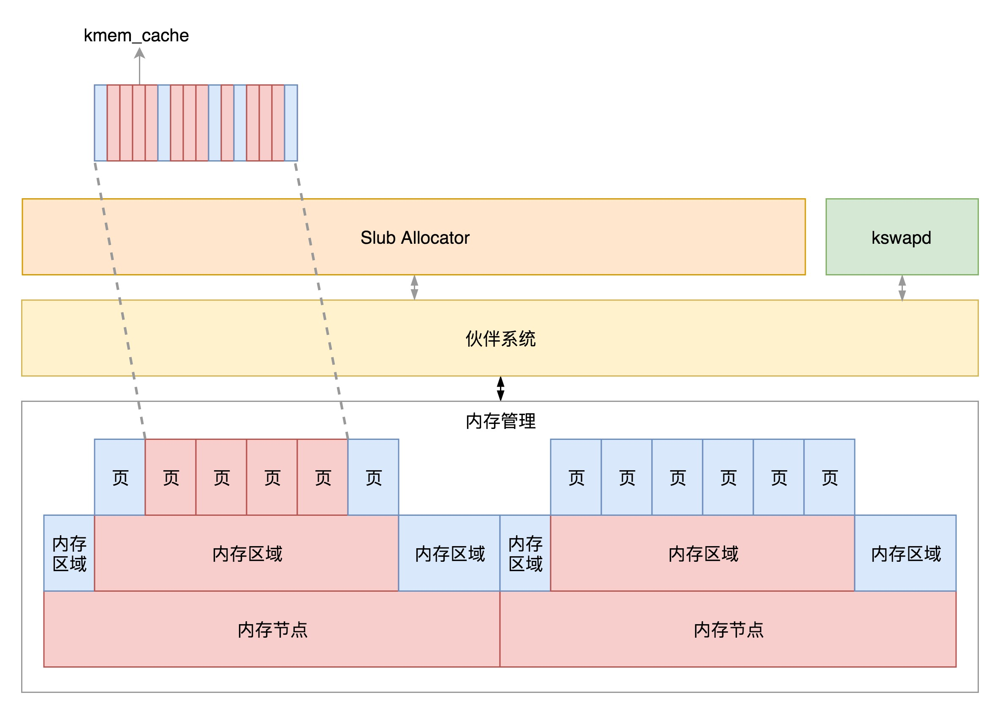

## 物理内存管理

### 物理内存模式

**平坦内存模型：**

物理内存是连续，是由连续的一页一页的块组成。我们可以从开始对块编号，这样子每一个块都有一个页号。

**SMP，对称多处理器：**

CPU通过总线去访问内存。

在这种模式下，CPU 也会有多个，在总线的一侧。所有的内存条组成一大片内存，在总线的另一侧，所有的 CPU 访问内存都要过总线，而且距离都是一样的，这种模式称为 SMP（Symmetric multiprocessing），即对称多处理器。当然，它也有一个显著的缺点，就是总线会成为瓶颈，因为数据都要走它。

**NUMA（Non-uniform memory access），非一致内存访问：**

每个CPU都有自己本地的内存，CPU访问本地内存不用过总线，因而速度会快很多，每个CPU和内存连在一次，称为NUMA节点。但是，在本地内存不足的情况下，每个 CPU 都可以去另外的 NUMA 节点申请内存，这个时候访问延时就会比较长。

这样，内存被分成了多个节点，每个节点再被分成一个一个的页面。由于页需要全局唯一定位，页还是需要有全局唯一的页号的。但是由于物理内存不是连起来的了，页号也就不再连续了。于是内存模型就变成了非连续内存模型，管理起来就复杂一些。

### 物理内存分配

内核线程 `kswapd`，在系统初始化的时候就被创建。这样它会进入一个无限循环，直到系统停止。在这个循环中，如果内存使用没有那么紧张，那它就可以放心睡大觉；如果内存紧张了，就需要去检查一下内存。通过`LRU`，看看是否需要换出一些内存页。

- 物理内存分 NUMA 节点，分别进行管理；
- 每个 NUMA 节点分成多个内存区域；
- 每个内存区域分成多个物理页面；`伙伴系统将多个连续的页面作为一个大的内存块分配给上层`；
- kswapd 负责物理页面的换入换出；
- Slub Allocator 将从伙伴系统申请的大内存块切成小块，分配给其他系统。

