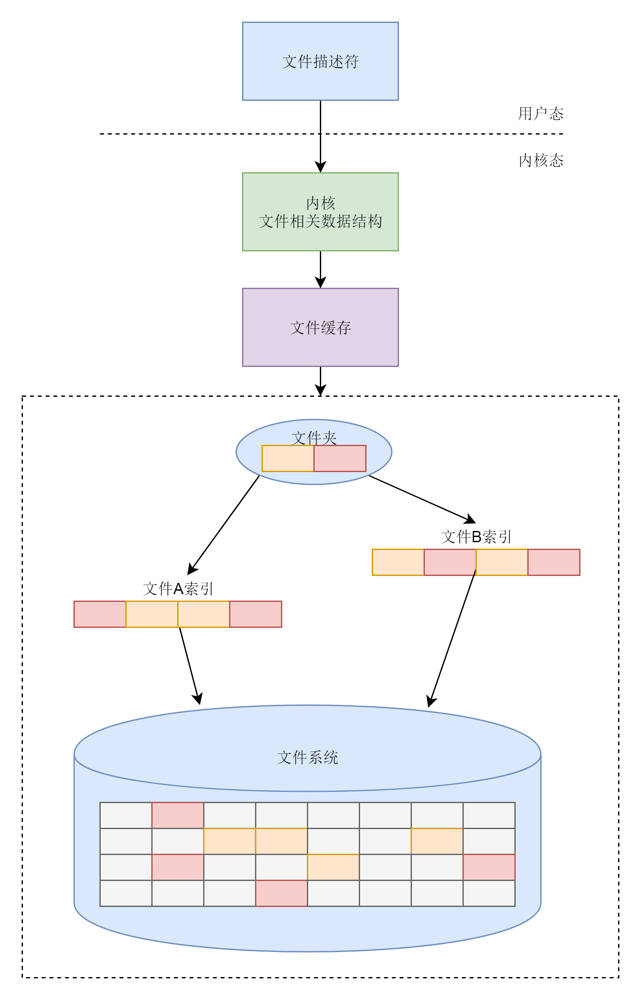
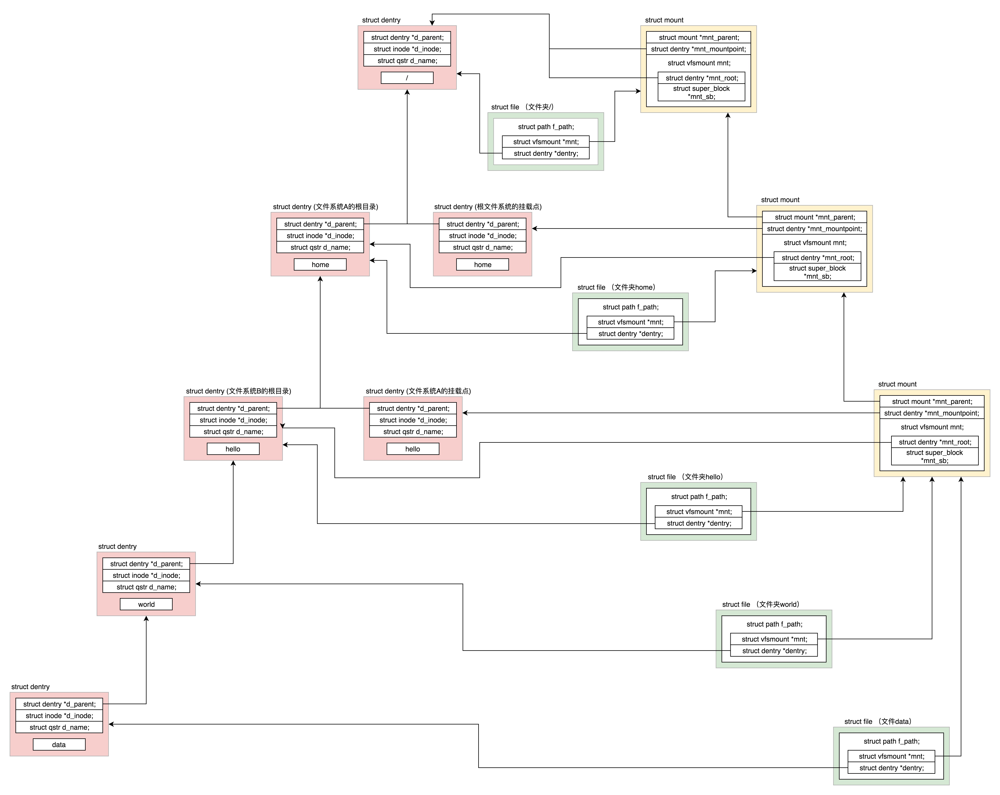

## 虚拟文件系统

Linux想要往文件系统里面读写数据，需要很多层一起合作。

- 在用户空间，应用层，通过`系统调用`：sys_open, sys_read, sys_write。
- 在内核，`每个进程都需要为打开的文件`，维护一定的`数据结构`file。
- 在内核，整个系统打开的文件，也需要维护一定的数据结构
- Linux可以支持多达数十种不同的文件系统。它们实现各不相同。因此Linux内核向用户空间提供了`虚拟文件系统`个统一的接口，来对文件系统进行操作。提供了常见的`文件系统对象模型`，如：`inode, driectory entry, mount`等，以及操作这些对象的方法，例如inode operations, directory operations, file operations等。
- 然后对接的才是`真正的文件系统`，例如ext4

### 虚拟文件系统

我们假设根文件系统下面有一个`目录 home`，有另外一个`文件系统 A 挂载在这个目录 home 下面`。

在文件系统 A 的根目录下面有另外一个`文件夹 hello`。由于文件系统 A 已经挂载到了目录 home 下面，所以我们就有了目录 /home/hello，然后有`另外一个文件系统 B 挂载在 /home/hello 下面`。

在文件系统 B 的根目录下面有另外一个`文件夹 world`，在 world 下面有个`文件夹 data`。由于文件系统 B 已经挂载到了 /home/hello 下面，所以我们就有了目录 /home/hello/world/data。为了维护这些关系，操作系统创建了这一系列数据结构。具体你可以看下面的图

【每一层代表一个文件夹】

`每个【打开的文件】都有一个 【file 结构】，它里面有两个变量，一个指向相应的 【mount】，一个指向相应的 【dentry】。`

`每一个【文件和文件夹】都有 dentry，用于和 【inode】 关联。`

mount是挂载的子系统。

我们从最上面往下看。

`根目录 /` 对应一个 `dentry`，根目录是在`根文件系统`上的，根文件系统是系统启动的时候挂载的，`因而有一个 mount 结构`。这个 mount 结构的 mount point 指针和 mount root 指针都是指向根目录的 dentry。根目录对应的 file 的两个指针，一个指向根目录的 dentry，一个指向根目录的挂载结构 mount。

我们再来看第二层。下一层目录 `home 对应了两个 dentry`，而且它们的 parent 都指向第一层的 dentry。这是为什么呢？这是因为`文件系统 A 挂载到了这个目录下`。这使得这个目录有两个用处。一方面，home 是根文件系统的一个挂载点；另一方面，home 是文件系统 A 的根目录。因为还有一次挂载，因而又有了一个 mount 结构。这个 mount 结构的 `mount point 指针指向作为挂载点的那个 dentry`。`mount root 指针指向作为根目录的那个 dentry`，同时 parent 指针指向第一层的 mount 结构。home 对应的 file 的两个指针，一个指向文件系统 A 根目录的 dentry，一个指向文件系统 A 的挂载结构 mount。

我们再来看第三层。`目录 hello 又挂载了一个文件系统 B`，所以第三层的结构和第二层几乎一样。

接下来是第四层。目录 world 就是一个`普通的目录`。只要它的 dentry 的 parent 指针指向上一层就可以了。我们来看 world 对应的 file 结构。由于挂载点不变，还是指向第三层的 mount 结构。接下来是第五层。

对于文件 data，`是一个普通的文件`，它的 dentry 的 parent 指向第四层的 dentry。对于 data 对应的 file 结构，由于挂载点不变，还是指向第三层的 mount 结构。

### 总结时刻

这里我带你简单做一个梳理，帮助你理解记忆它。

对于每一个进程，打开的文件都有一个`文件描述符`，在 files_struct 里面会有`文件描述符数组`。每个一个文件描述符是这个数组的下标，里面的内容指向一个 `file` 结构，表示打开的文件。

这个结构里面有这个文件对应的 `inode`，最重要的是这个文件对应的操作 file_operation。如果操作这个文件，就看这个 file_operation 里面的定义了。

对于每一个打开的文件，都有一个 `dentry` 对应，虽然叫作 directory entry，`但是不仅仅表示文件夹，也表示文件`。它最重要的作用就是指向这个文件对应的 inode。

如果说 file 结构是一个文件打开以后才创建的，dentry 是放在一个 dentry cache 里面的，`文件关闭了，他依然存在`，因而他可以更长期地维护内存中的文件的表示和硬盘上文件的表示之间的关系。

inode 结构就表示硬盘上的 inode，包括块设备号等。几乎每一种结构都有自己对应的 operation 结构，里面都是一些方法，因而当后面遇到对于某种结构进行处理的时候，如果不容易找到相应的处理函数，就先找这个 operation 结构，就清楚了。