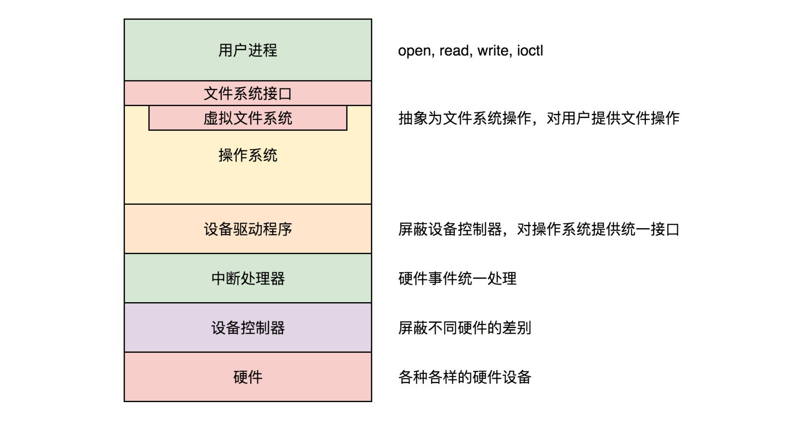

## 输入与输出

### 设备控制器

CPU 并不直接和设备打交道，它们中间有一个叫作`设备控制器`（Device Control Unit）的组件，例如硬盘有磁盘控制器、USB 有 USB 控制器、显示器有视频控制器等。这些控制器就像代理商一样，它们知道如何应对硬盘、鼠标、键盘、显示器的行为。

`控制器`其实有点儿像一台`小电脑`。它有它的`芯片`，类似小 CPU，执行自己的逻辑。它也有它的`寄存器`。这样 CPU 就可以通过写这些寄存器，对控制器下发指令，通过读这些寄存器，查看控制器对于设备的操作状态。

### 块设备和字符设备

输入输出设备我们大致可以分为两类：`块设备（Block Device）和字符设备（Character Device）`。

- 块设备将信息存储在固定大小的块中，每个块都有自己的地址。`硬盘就是常见的块设备`。
- 字符设备发送或接收的是字节流。而不用考虑任何块结构，没有办法寻址。`鼠标就是常见的字符设备`。

`设备控制器`就是可以通过`中断`的方式，`通知`操作系统输入输出操作已经完成。

### 中断控制器和系统调用

为了响应中断，我们一般会有一个硬件的`中断控制器`，当设备完成任务后触发中断到中断控制器，中断控制器就通知 CPU，一个中断产生了，CPU 需要停下当前手里的事情来处理中断。

中断通知谁呢？ `系统调用`！ 还记得 32 位系统调用是通过 INT 产生软中断触发的么？这就统一起来了，中断有两种，一种`软中断`，例如`代码`调用 INT 指令触发，一种是`硬件中断`，就是硬件通过`中断控制器`触发的。

### DMA

有的设备需要读取或者写入大量数据。如果所有过程都让 CPU 协调的话，就需要占用 CPU 大量的时间，比方说，磁盘就是这样的。这种类型的设备需要支持 `DMA` 功能，也就是说，允许设备在 CPU 不参与的情况下，能够自行完成对内存的读写。

还记得咱们讲内存的时候，有个 `DMA 区域`，就是用来存在这里的数据。

### 用驱动程序屏蔽设备控制器差异

设备控制器不属于操作系统的一部分，但是`设备驱动程序属于操作系统的一部分`。操作系统的内核代码可以`像调用本地代码一样`调用驱动程序的代码，而驱动程序的代码需要发出`特殊的面向设备控制器的指令`，才能操作设备控制器。

设备驱动程序中是一些面向特殊设备控制器的代码。不同的设备不同。但是对于操作系统其它部分的代码而言，`设备驱动程序应该有统一的接口。`

那操作系统就需要有一个地方处理这个中断，既然设备驱动程序是用来对接设备控制器的，`中断处理也应该在设备驱动里面完成`。

然而中断的触发最终会到达 CPU，会中断操作系统当前运行的程序，所以操作系统也要有`一个统一的流程来处理中断`，使得不同设备的中断使用统一的流程。

一般的流程是，一个`设备驱动程序初始化`的时候，要先`注册一个该设备的中断处理函数`。咱们讲进程切换的时候说过，`中断返回的那一刻是进程切换的时机`。不知道你还记不记得，中断的时候，触发的函数是 do_IRQ。这个函数是中断处理的统一入口。在这个函数里面，我们可以找到设备驱动程序注册的中断处理函数 Handler，然后执行它进行中断处理。


另外，对于块设备来讲，在驱动程序之上，文件系统之下，还需要一层通用设备层。

### 用文件系统接口屏蔽驱动程序的差异

虽然我们操作设备，都是基于文件系统的接口，也要有一个统一的标准。

首先要统一的是`设备名称`。所有设备都在 /dev/ 文件夹下面创建一个特殊的设备文件。这个设备特殊文件也有 `inode`，但是它`不关联到硬盘或任何其他存储介质上的数据，而是建立了与某个设备驱动程序的连接`。

这里我们只关心设备文件，当我们用 ls -l 在 /dev 下面执行的时候，就会有这样的结果。

```c
# ls -l
crw------- 1 root root      5,   1 Dec 14 19:53 console
crw-r----- 1 root kmem      1,   1 Dec 14 19:53 mem
crw-rw-rw- 1 root root      1,   3 Dec 14 19:53 null
crw-r----- 1 root kmem      1,   4 Dec 14 19:53 port
crw-rw-rw- 1 root root      1,   8 Dec 14 19:53 random
crw--w---- 1 root tty       4,   0 Dec 14 19:53 tty0
crw--w---- 1 root tty       4,   1 Dec 14 19:53 tty1
crw-rw-rw- 1 root root      1,   9 Dec 14 19:53 urandom
brw-rw---- 1 root disk    253,   0 Dec 31 19:18 vda
brw-rw---- 1 root disk    253,   1 Dec 31 19:19 vda1
brw-rw---- 1 root disk    253,  16 Dec 14 19:53 vdb
brw-rw---- 1 root disk    253,  32 Jan  2 11:24 vdc
crw-rw-rw- 1 root root      1,   5 Dec 14 19:53 zero
```

首先是第一位字符。如果是`字符设备文件`，则以 `c` 开头，如果是`块设备文件`，则以 `b` 开头。其次是这里面的两个号，`一个是主设备号，一个是次设备号`。`主设备号定位设备驱动程序，次设备号作为参数传给启动程序，选择相应的单元`。

从上面的列表我们可以看出来，mem、null、random、urandom、zero 都是用同样的主设备号 1，也就是它们使用同样的字符设备驱动，而 vda、vda1、vdb、vdc 也是同样的主设备号，也就是它们使用同样的块设备驱动。

如果 Linux 操作系统`新添加了一个设备`，应该做哪些事情呢？就像咱们使用 Windows 的时候，如果新添加了一种设备，首先要看这个设备有没有相应的`驱动`。如果没有就需要安装一个驱动，等驱动安装好了，设备就在 Windows 的设备列表中显示出来了。

在 Linux 上面，如果一个新的设备从来没有加载过驱动，也需要安装驱动。Linux 的驱动程序已经被写成和操作系统有标准接口的代码，可以看成一个标准的内核模块。`在 Linux 里面，安装驱动程序，其实就是加载一个内核模块`。

### 总结



### 参考链接

[输入与输出](https://time.geekbang.org/column/article/99553)