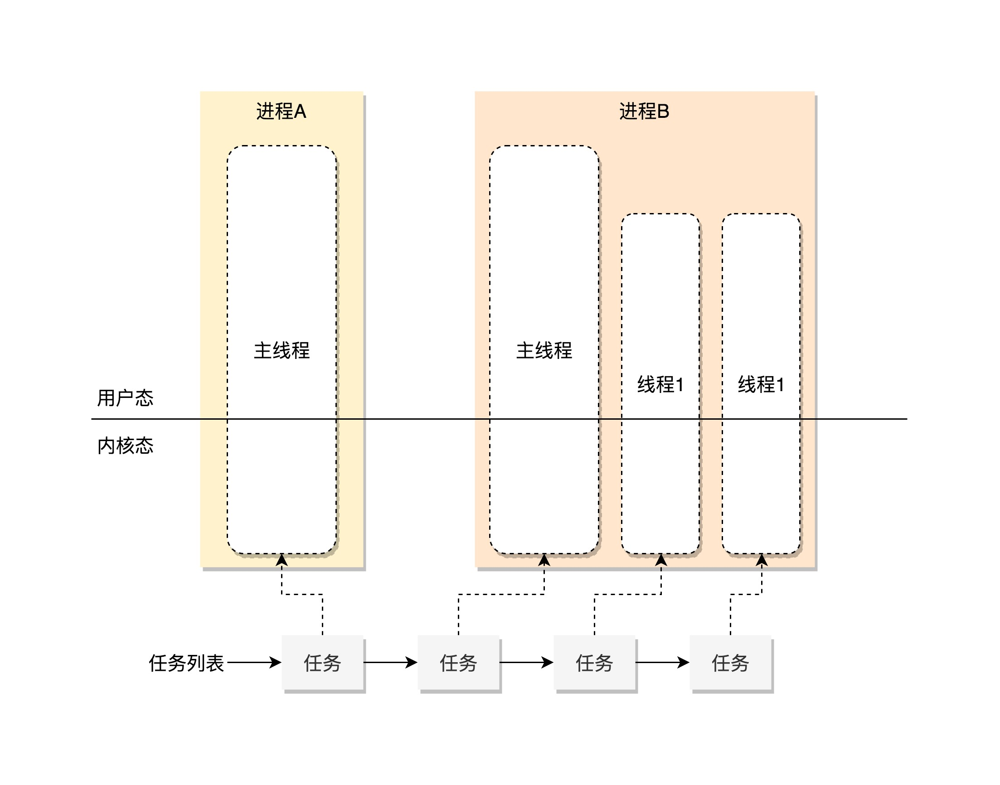
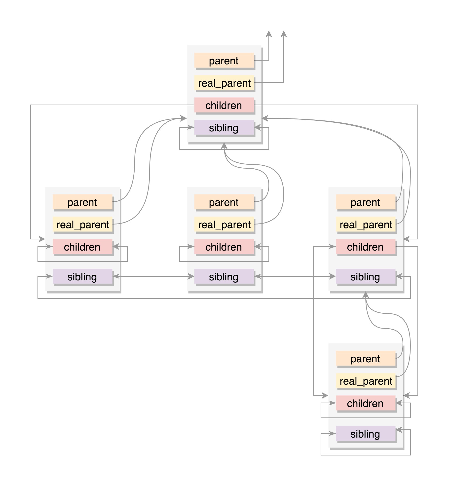
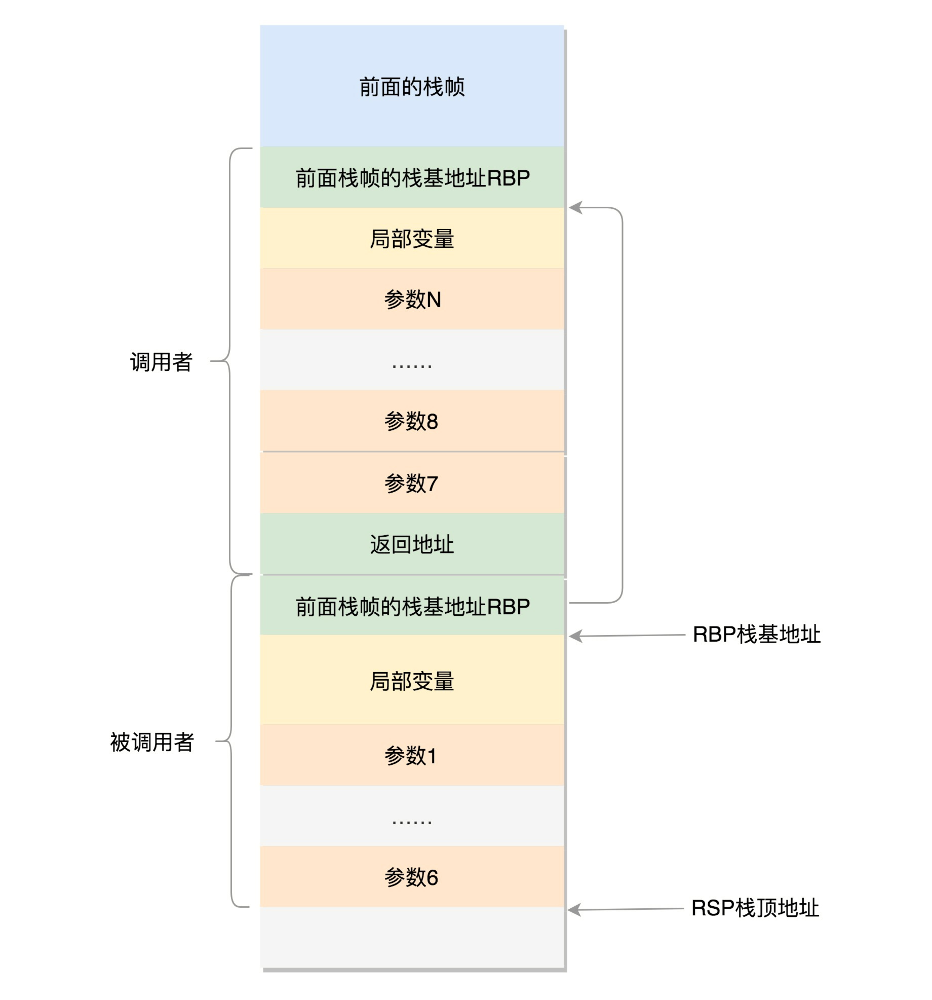

## 进程数据结构

在 Linux 里面，`无论是进程，还是线程`，到了内核里面，我们`统一都叫任务（Task）`，由一个统一的结构 `task_struct` 进行管理。当然，这个结构也非常复杂。



那Linux 的任务管理都应该干些啥？

首先，Linux 内核会先弄一个`链表`，将所有的 task_struct 串起来。

```c
struct list_head    tasks;
```

接下来，我们来看每一个任务都应该包含哪些字段。

### 任务 ID

```c
pid_t pid;
pid_t tgid;
struct task_struct *group_leader; 
```

因为线程、进程在内核中都是以task的形式存在，所以需要区分这个task是线程还是进程。

其中，pid 是 process id，tgid 是 thread group ID。

任何一个进程，如果只有主线程，那 pid 是自己，tgid 是自己，group_leader 指向的还是自己。

但是，如果一个进程`创建了其他线程`，那就会有所变化了。`线程有自己的 pid，tgid 就是进程的主线程的 pid，group_leader 指向的就是进程的主线程。`

### 信号处理

```c
/* Signal handlers: */
struct signal_struct    *signal;
struct sighand_struct    *sighand;
sigset_t      blocked;
sigset_t      real_blocked;
sigset_t      saved_sigmask;
struct sigpending    pending;
unsigned long      sas_ss_sp;
size_t        sas_ss_size;
unsigned int      sas_ss_flags;
```

这里定义了哪些信号被阻塞暂不处理（blocked），哪些信号尚等待处理（pending），哪些信号正在通过信号处理函数进行处理（sighand）。处理的结果可以是忽略，可以是结束进程等等。

`信号处理函数`默认使用`用户态的函数栈`，当然也可以开辟新的栈专门用于信号处理，这就是 sas_ss_xxx 这三个变量的作用。

task_struct 里面有一个 struct sigpending pending。如果我们进入 struct signal_struct *signal 去看的话，还有一个 struct sigpending shared_pending。它们一个是本任务的，一个是线程组共享的。

### 任务状态

```c
 volatile long state;    /* -1 unrunnable, 0 runnable, >0 stopped */
 int exit_state;
 unsigned int flags;
```

state（状态）可以取的值定义在 include/linux/sched.h 头文件中。

```c
/* Used in tsk->state: */
#define TASK_RUNNING                    0
#define TASK_INTERRUPTIBLE              1
#define TASK_UNINTERRUPTIBLE            2
#define __TASK_STOPPED                  4
#define __TASK_TRACED                   8
/* Used in tsk->exit_state: */
#define EXIT_DEAD                       16
#define EXIT_ZOMBIE                     32
#define EXIT_TRACE                      (EXIT_ZOMBIE | EXIT_DEAD)
/* Used in tsk->state again: */
#define TASK_DEAD                       64
#define TASK_WAKEKILL                   128
#define TASK_WAKING                     256
#define TASK_PARKED                     512
#define TASK_NOLOAD                     1024
#define TASK_NEW                        2048
#define TASK_STATE_MAX                  4096
```

在 Linux 中，有两种睡眠状态。一种是 `TASK_INTERRUPTIBLE`，`可中断的睡眠状态`。这是一种`浅睡眠`的状态，也就是说，虽然在睡眠，等待 I/O 完成，但是这个时候一个信号来的时候，进程还是要被唤醒。只不过唤醒后，不是继续刚才的操作，而是进行信号处理。当然程序员可以根据自己的意愿，来写信号处理函数，例如收到某些信号，就放弃等待这个 I/O 操作完成，直接退出；或者收到某些信息，继续等待。

另一种睡眠是 `TASK_UNINTERRUPTIBLE`，`不可中断的睡眠状态`。这是一种`深度睡眠状态`，不可被信号唤醒，只能死等 I/O 操作完成。一旦 I/O 操作因为特殊原因不能完成，这个时候，谁也叫不醒这个进程了。你可能会说，我 kill 它呢？别忘了，kill 本身也是一个信号，既然这个状态不可被信号唤醒，kill 信号也被忽略了。除非重启电脑，没有其他办法。因此，`这其实是一个比较危险的事情`，除非程序员极其有把握，不然还是不要设置成 TASK_UNINTERRUPTIBLE。

于是，我们就有了一种新的进程睡眠状态，`TASK_KILLABLE`，可以终止的新睡眠状态。进程处于这种状态中，它的运行原理类似 TASK_UNINTERRUPTIBLE，`只不过可以响应致命信号`。从定义可以看出，TASK_WAKEKILL 用于在接收到致命信号时唤醒进程，而 TASK_KILLABLE 相当于这两位都设置了。

### 进程调度

```c
//是否在运行队列上
int        on_rq;
//优先级
int        prio;
int        static_prio;
int        normal_prio;
unsigned int      rt_priority;
//调度器类
const struct sched_class  *sched_class;
//调度实体
struct sched_entity    se;
struct sched_rt_entity    rt;
struct sched_dl_entity    dl;
//调度策略
unsigned int      policy;
//可以使用哪些CPU
int        nr_cpus_allowed;
cpumask_t      cpus_allowed;
struct sched_info    sched_info;
```

### 运行统计信息

在进程的运行过程中，会有一些统计量，具体你可以看下面的列表。这里面有进程在用户态和内核态消耗的时间、上下文切换的次数等等。

```c
u64        utime;//用户态消耗的CPU时间
u64        stime;//内核态消耗的CPU时间
unsigned long      nvcsw;//自愿(voluntary)上下文切换计数
unsigned long      nivcsw;//非自愿(involuntary)上下文切换计数
u64        start_time;//进程启动时间，不包含睡眠时间
u64        real_start_time;//进程启动时间，包含睡眠时间
```

### 进程亲缘关系

```c
struct task_struct __rcu *real_parent; /* real parent process */
struct task_struct __rcu *parent; /* recipient of SIGCHLD, wait4() reports */
struct list_head children;      /* list of my children */
struct list_head sibling;       /* linkage in my parent's children list */
```

- parent 指向其父进程。当它终止时，必须向它的父进程发送信号。
- children 表示链表的头部。链表中的所有元素都是它的子进程。
- sibling 用于把当前进程插入到兄弟链表中。



通常情况下，real_parent 和 parent 是一样的，但是也会有另外的情况存在。例如，bash 创建一个进程，那进程的 parent 和 real_parent 就都是 bash。如果在 bash 上使用 GDB 来 debug 一个进程，这个时候 GDB 是 parent，bash 是这个进程的 real_parent。

### 进程权限

```c
/* Objective and real subjective task credentials (COW): */
const struct cred __rcu         *real_cred;
/* Effective (overridable) subjective task credentials (COW): */
const struct cred __rcu         *cred;
```

### 内存管理

每个进程都有自己独立的虚拟内存空间，这需要有一个数据结构来表示，就是 mm_struct。

```c
struct mm_struct                *mm;
struct mm_struct                *active_mm;
```

### 文件与文件系统

```c
/* Filesystem information: */
struct fs_struct                *fs;
/* Open file information: */
struct files_struct             *files;
```

### 内核栈

在程序执行过程中，一旦调用到系统调用，就需要进入内核继续执行。那如何将用户态的执行和内核态的执行串起来呢？

```c
struct thread_info    thread_info;
void  *stack;
```

#### 用户态函数栈

用户态的函数栈都在进程的内存空间里面进行的。



#### 内核态函数栈

内核栈是一个非常特殊的结构，如下图所示：


这段空间的最低位置，是一个 thread_info 结构。这个结构是对 task_struct 结构的补充。因为 task_struct 结构庞大但是通用，不同的体系结构就需要保存不同的东西，所以往往与体系结构有关的，都放在 thread_info 里面。

在内核代码里面有这样一个 union，将 thread_info 和 stack 放在一起，在 include/linux/sched.h 文件中就有。

```c
union thread_union {
#ifndef CONFIG_THREAD_INFO_IN_TASK
  struct thread_info thread_info;
#endif
  unsigned long stack[THREAD_SIZE/sizeof(long)];
};
```


### 总结


### 参考链接

- [进程数据结构（上）](https://time.geekbang.org/column/article/9155)
- [进程数据结构（中）](https://time.geekbang.org/column/article/92151)
- [进程数据结构（下）](https://time.geekbang.org/column/article/93014)