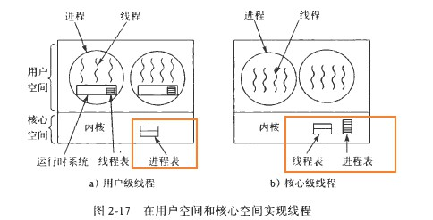

## 2.0 概述 :id=overview

程序是静态的，进程是动态的。进程有不同的状态，在一定条件下会发生`状态变迁`。

进程是操作系统中最重要的概念之一。为了描述进程的特征，操作系统为每个进程都设立了`唯一的进程控制块（PCB）`。`PCB是进程存在的唯一标志`。

进程是并发活动的，在其生存过程中，会出现种种`制约关系`--互斥和同步。为了保证各个进程之间正确地`实施通信`，系统内部设置了`通信原语`，如`锁机制`和`信号量`以`P、V操作原语`等。

系统中有些资源每次只能由一个进程使用(`临界资源)`，多个进程必须互斥地使用这些临界资源。当若干个进程竞争有限资源，又推进顺序不恰当，就会造成`死锁`。

在现代操作系统中，`进程是资源分配单位，线程是调度运行单位`，这样子可以提高系统的效率，改善系统的性能。

## 2.1 进程概念 :id=process-concept

### 程序顺序执行及其特征

在早期地`单道程序`工作环境中，内存只有一个作业的程序。作业只能一个一个进入内存，机器也只能严格按顺序方式进行。这种程序设计方式叫做`顺序程序设计`。

顺序程序设计具有`顺序性`(每个动作都是上个动作结束后才开始)、`封闭性`(只有程序本身才能改变程序的运行环境)、`可在现性`(执行结果和程序运行的速度无关)。

### 程序并发执行及其特征

很显然，上述单道程序系统具有资源浪费、`效率低`、作业平均周转时间长等明显缺点。现代的计算机可忍受不了这些致命的缺点，因此，现代计算机系统广发采用“`多道程序设计技术`”。

多道程序设计采用`并发执行（concurrent）`,即在多道程序环境下，逻辑上互相独立的多个程序在一段时间内（`宏观上`）`同时运行`，而在每一时刻`（微观上）却只有一道程序执行`。在单CPU中，这些程序分时地交替运行，而多CPU下，实现并行（parallet）执行。

**程序并发执行的特征：**

1. 失去封闭性：有共享资源，不同并发的程序相互制约
2. 程序和进程不再一一对应：一个共享程序可以被多个用于作业调用，从而形成多个“进程”。
3. 并发程序在执行期间互相制约：有共享资源，不同并发程序相互制约

多道程序设计技术能够`提高作业吞吐量`（作业吞吐量指给定时间完成作业的数量(吞和吐) ）

人们引入“`进程`”（process）这一概念来描述程序动态执行过程的性质。`进程是对正在运行的程序的一个抽象`。更为具体的定义是：进程是具有独立功能的程序关于在某个数据集合上的一次运行活动，是系统进行资源分配和调度的一个独立单位【以内存中的进程映像去理解】。

进程最基本的属性是`动态性`（有不同的状态）和`并发性`（进程需要使用CPU时间片）。

除了动态性和并发性，进程的特征还有调度性（有不同的状态）、异步性（各个进程向前推进的速度是不可预知的，失去再现性）和结构性（进程有一定的结构，它由程序段、数据段、堆、栈和控制结构等组成）。

**用户态的进程内存映像：**


**内核态下的PCB的属性：**


### 进程状态描述及组织方式😀

?> 【静态结构】

进程也是有`生存期`的，其动态性质是由其状态及转换决定的。

进程至少要有三种最基本状态，即进程控制状态。这三种基本状态是`运行状态、就绪状态和阻塞状态（等待状态）`。

1. 运行状态(running)：运行状态是指当前进程已分配到CPU。
2. 就绪状态(ready)：指进程已具备运行条件，等待CPU时间片分给他
3. 阻塞状态(block)：指进程因等待某种事件发生（例如等待某一输入、输出操作完成、等待其他进程发来的消息）而暂时不能运行的状态。也就是说，处于阻塞状态的进程尚不具备运行条件，即使CPU空闲，它也无法运行。


除了这三种基本的状态，也应该还有以下的状态：

1. `新建状态（new）`：指进程刚被创建，尚未放入就绪队列时的状态。处于这种状态的进程还不是完全的，（分配一个进程块、分配内存空间、对进程控制块初始化的工作还未完成）
2. `终止状态（terminated）`:指进程完成自己的任务而正常终止时或在运行期间由于出现某些错误和故障而被迫终止（非正常终止）所处的状态。处于终止状态的进程不能再被调度执行，下一步必然的结局是被系统撤销，进而从系统永久消失。


有些系统还引入了`挂起状态`。所谓挂起，是使`处于基本状态（就绪、运行、阻塞）的进程` 处于`静止（非终止）状态`，此时系统`回收这些进程占用的内存资源`，将其实体`复制到外存`的进程交换区。挂起不等于撤销，可通过解挂重新分配内存。

被挂起的进程处于静止状态，并且不能直接被处理机调度。


添加挂起状态的原因为以下4种情况：

1. 终端用户的请求
2. 父进程的请求
3. 负荷调节的需要
4. 操作系统的需要【`页面调度`】

#### 进程的组成

进程有一个很重要的结构：`进程控制块（process control block，PCB）`。【更加详细的结构看之前的图】

进程控制块有时也称为`进程描述块`（process descriptor），含有进程的`描述信息`和`控制信息`，使进程动态特性的集中反映，`使系统对进程施行识别和控制的依据`。

它应该包含以下的内容：

1. 进程名：唯一标识
2. 特征信息：包括是系统进程还是用户进程、进程实体还是是否常驻内存等信息
3. 进程状态信息：运行态、就绪态还是阻塞态
4. 调度优先权
5. 通信信息
6. 现场保护区：失去CPU时间片后，需要现场保护，以便在获得CPu后能恢复正常运行，通常需要保存的信息有：程序计数器、程序状态字、各工作寄存器的内容等
7. 资源需求、分配和控制方面的信息：所需要或占用的I/O设备、磁盘空间、数据区等
8. 进程实体信息
9. 族系关系
10. 其他信息：文件信息、工作单元等

如上所述，进程控制块是进程映像中最关键的组成部分，每个进程有唯一的进程控制块。

操作系统根据PCB对进程实施控制和管理。（调度优先级、保留现场信息、恢复现场信息、通信、资源分配等）。进程的动态、并发等特征是利用PCB表现出来的。

当系统创建了一个新进程时，就为它建立了一个PCB；当进程终止后系统就回收其PCB，该进程在系统中就不存在了。所以，`PCB是进程存在的唯一标志`。

#### 进程组织方式

为了对所有进程进行有效的管理，会将各进程的PCB用适当的方式组织起来。一般来说，有以下几种组织方式：`线性方式、链接方式和索引方式`。

- 线性方式：操作系统预先确定整个系统中同时存在的进程的最大数目；但是，有很多用户上机时，`会造成无法为用户创建新进程的情况`，更严重的是，在执行CPU调度时，经常要`扫描全表`选择合理的进程投入运行，降低了调度效率。

- 链接方式：链接方式是经常采用的方式；如下图，`不同的阻塞队列代表不同的阻塞原因`；根据不同的优先级也往往会设置`多个就绪队列`，具有同一优先级的进程的PCB排在一个队列上。


- 索引方式：索引方式是利用索引表记载相应状态进程的PCB地址。有专门的指针指向索引表在内存中的初始地址。【类似页表】


## 2.3 进程管理和有关命令😀

?> 【动态组织】

进程是有生命周期的动态过程，核心能对它们实施管理，这主要包括：创建进程、撤销进程、恢复进程、改变进程优先级、唤醒进程、调度进程等。【以`进程的状态图`去理解】

### 进程图和进程管理

- 进程图（process graph）

`子进程只能由父进程创建`。在开机后，首先引导操作系统，把它装入内存。之后生成第一个进程（UNIX中称为0#进程），由它创建1#进程及其他核心进程；然后`1#进程又为每个终端创建命令解释进程（shell进程）`；用户输入命令后又在这个终端下创建若干进程。这样就形成了一棵树。


- 进程创建

引发父进程创建子进程的事件通常是：调度新的批作业、交互式用户登录、操作系统提供服务和现有进程派生新进程。

创建新进程需要使用系统调用，如fork(),主要过程有4步：

1. 申请一个空闲的`PCB`：从空闲表中找出一个空闲的PCB项，并指定唯一的进程标识号PID
2. 为新进程`分配资源`：内存空间等
3. 将新进程的PCB进行初始化：根据调用者提供的参数，初始化PCB包括父进程标识符、处理机初始状态、进程优先级、本进程开始地址等。一般将新进程设置为就绪状态。
4. 将新进程加入到`就绪序列中`：这里有两种可能的执行方式，①父进程和子进程同时（并发）执行 ②父进程等待子进程或全部子进程运行完（父进成wait(),可能等待子进程的返回值，或者创建子进程是有更紧急的任务）

Linux创建fork()子进程的方法为：父进程将自己的内存地址空间制作成一个副本，其中包括user结构、正文段、数据段、用户栈和系统栈全部复制给子进程。这种方式使得父进程很容易与子进程通信。

父进程和子进程的差别为：父进程得到的fork()返回值为子进程的pid（父进程要知道子进程是谁呀，知道子进程的pid后就知道子进程）,子进程得到fork()的返回为0（子进程肯定知道自己的pid嘛），而fork()的返回值为-1时，代表fork()调用出错。

子进程被创建后，一般使用execlp系统调用，用一个新的程序（可执行文件）取代原来内存空间的内容，然后开始执行。

而父进程也可以使用wait()系统调用，把自己`阻塞`(睡眠),等待子进程的终止。

- 进程的终止

终止有3种：

1. 正常终止：当一个进程完成自己的任务后要终止自己
2. 非正常终止：在运行期间由于出现某些错误而被迫终止
3. 也可应外界的请求（如父进程的请求）

进程终止使用终止原语。终止进程的主要操作过程是：

1. 从系统的PCB表找到指定进程的`PCB`，若它处于运行态，则立即终止该进程的运行
2. 回收该进程所占用的`全部资源`
3. 若该进程还有子进程，则还要`终止其所有的子孙进程`，回收它们所占用的全部资源
4. 释放被终止进程的PCB，并从原来`队列`中摘走

- 进程阻塞

正在运行的进程因服务请求未被操作系统立即满足，或者所需的数据尚未到达等，只能转变为阻塞态，等待相应事件出现后再把它唤醒。

进程可以用sleep()，主动地把自己阻塞。阻塞地过程如下：

1. 立即停止当前进程的执行
2. 将现行进程的`CPU现场`送到`该进程的PCB现场保护区`中保存起来
3. 把进程`PCB`的现行状态由“运行”改为“阻塞”
4. 然后转到进程调度程序，重新从就绪队列中挑选一个合适的进程

- 进程唤醒

当阻塞进程所等待的事件出现时（如所数据已到达、或者等待的I/O操作已经完成），则由另外的、与阻塞进程相关的进程调用唤醒原语（如wakeup）。可见，阻塞进程不能唤醒自己。

过程如下：

1. 首先把阻塞进程从相应的`阻塞队列`中摘下
2. 将现行状态改为就绪态，然后把该进程插入`就绪队列`中
3. 如果被唤醒的进程比运行进程有更高的优先级，则设置重新调度标志

阻塞原语和唤醒原语恰好是一对相反的原语。有阻塞原语，必须有唤醒原语，否则，进程就要“长眠”了

- 进程映像的更改

进程映像是`进程执行的上下文`，包括处理机中`各个通用寄存器的值，进程的内存映像，打开文件的状态和进程占用资源`等信息。

子进程更该自己的进程映像的过程如下：

1. 释放子进程原来的程序和数据所占用的内存空间
2. 从磁盘找出子进程所要执行的程序和数据（通常以文件的形式存放）
3. 分配内存空间、装入新的程序和数据
4. 为子进程建立初始的运行环境：主要是对各个寄存器初始化，返回用户态，运行该进程的程序。

### Linux进程管理

- Linux 进程状态

在Linux 系统中，进程有下述5 种状态：

1. 运行态（TASK_RUNNING）：此时，进程`正在运行`（即系统的当前进程）或`准备运行（即就绪态）`。当前进程由运行指针所指向。
2. 可中断等待态（TASK_INTERUPTIBLE）：处于`“浅度“睡眠`等待一个事件的发生或某种系统资源，它能够`被信号或中断唤醒`。当所`等待的资源得到满足时，它也被唤醒`。
3. 不可中断等待态（TASK_UNINTERUPTIBLE）:进程处于`“深度”睡眠`的等待队列中，不能被信号或中断唤醒，`只有所等待的资源得到满足时才能被唤醒`
4. 停止态（TASK_STOPPED）:通常由于`接收一个信号`，致使进程停止。正在调试的进程可能处于停止态。
5. 僵死态（TASK_ZOMBLE）：由于某些原因，进程被终止了，但是该进程的控制结构task_struct `仍然保留着`。


- 进程的运行模式和类型

在Linux 系统中，进程的运行模式划分为用户模式和内核模式。在内存空间也有划分相应的用户态和内核态。

如果当前运行的是`用户程序`、应用程序或者内核之外的系统程序，那么对应进程就在`用户模式`下运行；如果在用户程序执行过程中出现`系统调用或者发生中断事件`，就要运行操作系统（即核心）程序．进程模式就变成`内核模式`。在内核模式下运行的进程可以执行机器的特权指令，而且，此时该进程的运行不受用户的干预，即使是`root 用户也不能干预内核模式下进程的运行`。

进程既可在用户模式下运行，又可在内核模式下运行，内核模式的权限高于用户模式的权限。因此当进程在用户模式下运行时，不管它是否自愿，核心在一定条件下（如该进程的时间片用完或等待I/O）可以暂时中止其运行，而调度其他进程运行。`一旦进程切换到内核模式下运行时，就不受以上限制`，而一直运行下去，所以当进程时间片用完但仍处于内核态时，可以继续运行，仅在重新回到用户模式之前才会发生进程调度。


- Linux 进程结构

**task_struct结构：**

task_struct相当于PCB，其简要定义如下：

```c
struct task_struct {
    volatile long state;                //进程的运行时状态
    unsigned int flags;                 //进程当前的状态标志
    unsigned int rt_priority;           //进程的运行优先级
    struct mm_struct *mm;               //mm_struct 结构体记录了进程内存使用情况
    pid_t pid;                          //进程号
    pid_t tgid；                        //进程组号
    struct task_struct *parent;         //该进程现在的父进程
    struct list_head children;          //该进程孩子的链表
    struct list_head sibling;           //该进程兄弟的链表
    cputime_t utime, stime;             //该进程使用CPU 时间的信息
    struct timespec start_time;         //启动时间
    int link count, total link count;   //文件系统信息计数
    struct thread_struct thread;        //该进程在特定CPU 下的状态（线程）
    struct fs_struct *fs;               //指向该进程与文件系统相关信息结构体的指针
    struct files_struct *files;         //指向该进程打开文件的相关信息结构体的指针
    struct signal_struct *signal;       //信号相关信息的句柄
};
```

从上述定义中可以看出，task_struct结构包含下列信息：

1. `进程状态`。
2. `凋度信息`。调度算法利用这个信息来决定系统中的哪一个进程需要执行。【优先级】
3. `标识符`。系统中每个进程都有唯一的一个进程标识符(`PID`) 。PlD 并不是指向进程向量的索引，仅仅是一个数字而已。每个进程还包括`用户标识符(UlD)` 和`用户组标识符(GID)`, 用来确定进程对系统中文件和设备的存取权限。
4. `内部进程通信`。Linux 系统支持信号、管道、信号量等内部进程通信机制。
5. `链接信息`。在Linux 系统中，每个进程都与其他进程存在联系。除初始化进程外,每个进程都有父进程。该链接信息包括指向父进程、兄弟进程和子进程的指针。
6. `时间和计时器`。内核要记录进程的创建时间和进程运行所占用的CPU 时间。Linux 系统支持进程的时间`间隔`计时器。
7. `文件系统`。进程在运行时可以打开和关闭文件。task_struct 结构中包括指向每个打开文件的文件描述符的指针，并且包括两个指向`VFS (虚拟文件系统）索引节点`的指针。第一个索引节点是进程的`根目录`，第二个节点是当前的`工作目录`。两个VFS 索引节点都有一个计数字段、该计数字段记录访问该节点的进程数。
8. `虚拟内存`。大多数进程都使用虚拟内存空间。Linux 系统必须了解如何将虚拟内存映射到系统的物理内存。
9. `处理器信息`。每个进程运行时都要使用处理器的寄存器及堆栈等资源。当一个进程`挂起`时，所有`有关处理器的内容都要保存`到进程的task_struct 中。当进程恢复运行时，所有保存的内容再装入处理器中。

- 进程系统堆栈

在Linux中，每个进程都有一个系统堆栈，用来保存`中断现场信息`和进程进入内核模式后执行子程序（函数）嵌套调用的返回现场信息。每个进程的系统堆栈和task_struct数据结构之间存在着紧密联系，因而两者物理存储空间也连在一起。


由图2-14 可以看出．内核在为每个进程分配task_struct 结构的内存空间时．实际上是`一次分配两个连续的内存页面（共8KB)`【一页为4k】, 其底部`约1KB` 的空间用于存放`task_struct`结构，而上面的约7KB 的空间用于存放`进程核心空间堆栈`。

另外，核心空间堆栈的大小是静态确定的，而用户空间堆栈可以在运行时动态拓展。

!> 待完成：操作系统书 P51 - P58

## 2.4 线程概念

在很多现代操作系统中，`进程只作为资源拥有者`，负责申请和占有所需的全部资源（除CPU 外）；而`参与调度和运行`的职责赋予新的实体---`线程(Thread)` 。

### 什么是线程

**线程的概念：**

线程是执行处理机调度的基本单位。如果把进程理解为在逻辑上操作系统所完成的`任务`，那么线程表示完成该任务的许多可能的`子任务之一`。例如，word算是一个进程，word统计字数是一个线程，word录入又是另一个线程。这两个子任务是相互独立的，各自可以被单独调度、执行，于是就创建了两个线程，各对应一个子任务。

在`多处理器系统`中，各个线程可以在`单独的CPU上`运行，从而大大提高了系统的效率。

引入线程的原因有：

1. 使并行实体获得`共享同一地址空间`和`所有可用数据`的能力。这样子可以使程序设计变得更简单
2. `易于切换，代价低`。线程具有少量私有资源（如thread结构、程序计数器、堆栈），不具有单独的地址空间，所有又把线程称为轻载进程（LWP）。这样，线程的创建、撤销等操作就比进程快得多。在许多系统中，创建一个线程比一个进程快10~100倍
3. 可以改善系统的性能。如果存在`大量的计算和I/O处理`，采用多线程机制就允许这些`活动彼此重叠进行`，从而会加快应用程序的执行速度。【迅雷多线程下载】

**线程的组成：**

每个线程都有一个thread结构，即线程控制块，用于保存自己私有的信息，其主要有以下4个基本部分：

1. 一个唯一的`线程标识符`
2. `描述处理器工作情况的一组寄存器`（如程序计数器、状态寄存器、通用寄存器等）的内容
3. 每个thread结构有`两个指针`。`一个指向核心栈，另一个指向用户栈`。当用户线程转变到核心态方式下运行时，就使用核心栈；当线程在用户态下执行时，就使用自己的用户栈。
4. 一个`私有存储区`，存放现场保护信息和其他与该线程相关的统计信息等。


`线程必须在某个进程内执行。`它所需要的其他资源，如代码段、数据段、打开的文件和信号等，都由它所属的进程拥有，即操作系统分配这些资源时以进程为单位。

传统的进程是只有一个线程的进程。

**线程的状态：**

1. 运行状态
2. 就绪状态
3. 阻塞状态
4. 终止状态

线程是一个动态过程。它的状态转化是在一定的条件下实现的。通常，当一个新进程创建时，该进程的一个线程也被创建。以后，这个`线程`还可以在它所属的进程内部`创建另外的线程`,为新线程提供指令和参数，同时为新线程提供私有的寄存器内容和栈空间，并且放入就绪序列中。

**线程和进程的关系:**

1. 一个进程可以有多个线程，但至少要有一个线程；而一个线程只能在一个进程的
地址空间内活动。
1. 资源分配给进程，同一进程的所有线程共享该进程的所有资源。
1. CPU 分派给线程，即真正在CPU 上运行的是线程。
1. 线程在执行过程中需要协作同步。不同进程的线程间要利用消息通信的办法实现同步。

### 线程的实现方式

在很多系统中巳经实现线程，如Solaris 2 、Windows 2000 、Linux 及Java 语言等。但是，它们实现的方式并不完全相同，主要有在`用户空间实现`和在`核心空间实现`两种实现方式。

**用户级线程：**

在这种方式下，整个管理线程的线程库放在用户空间，管理线程的工作全部由应用程序完成，`核心对线程一无所知`，只对常规进程实施管理。常见的用户线程库包括POSlX Pthreads 、Mach C-threads 和Solaris 2 Ul-threads 。

用户级线程方式的优点有：

1. `线程切换速度很快`，无须进行系统调度。这比使用系统调用并陷入到核心去处理要快得多。
2. 调度算法可以是应用程序专用的。允许不同的应用程序采用适合自己要求的不同的训度算法，并且不千扰底层操作系统的调度程序。
3. 用户级线程可以运行`在任何操作系统上`，包括不支持线程机制的操作系统。线程库是一组应用级的实用程序，所有应用程序都可共享。

用户级线程方式的主要缺点包括：

1. 当一个线程执行系统调用时，不仅它自已被阻塞，而且在同一个进程内的所有线程都被阻塞。
2. 在单纯用户级线程方式中，多线程应用程序不具有多处理摇的优点。因为核心只为每个进程一次分配一个处理器，每次只有该进程的一个线程得以执行，在该线程自愿放弃CPU 之前，该进程内的其他线程不会执行。

**核心级线程：**

在这种方式下，核心知道线程存在，并对它们实施管理。线程表在核心空间中。线程表中记载系统所有线程的情况，当一个线程想创建一个新线程或者删除一个现有线程时，必须执行系统调用。

核心空间除保存一个线程表外，还保存一个传统的进程表，其中记载系统中所有进程的信息。

核心级线程的优点如下：

1. 在多处理器系统中，核心可以同时调度同一进程的多个线程，真正实现并行操作
2. 如果一个进程的某个线程阻塞了，核心可以调度同一个进程的另一个线程
3. 核心线程本身也可以是多线程的

核心级线程的缺点如下：

1. 控制转移开销大。在同一个进程中，从一个线程切换到另一个线程时，须将运行模式`切换到核心态`。统计表明，在单CPU 系统中，针对线程的创建、调度、执行直至完成的时间以及线程间同步开销的时间，核`心级线程方式都比用户级线程方式高一个数量级`。
2. 调度算法由核心确定，应用进程无法影响线程的切换



## 2.5 进程间的同步与互斥

进程间的相互关系主要分为如下三种形式：

1. 互斥
2. 同步
3. 通信

### 进程间的关系

**同步：**

逻辑上相关的两个或多个进程为完成一项任务，通过协调活动来`使用同一资源`，而产生的执行`时序的约束关系`，称为`同步`。

就像接力赛跑中，前一棒运动员把棒交给下面的运动。

**互斥：**

互斥就是进程竞争一个共用的事物。

### 竞争条件和临界区

`共享`内存、共享文件以及共享任何资源都有可能因为多个进程同时操作而造成错误。使用这些资源时，必须互斥（`一次仅允许一个进程使用`）的执行。我们把这类资源称为"临界资源(Critical Resource)"，简称CS区。

进程互斥进入临界区都要遵循一种通用模式：进入前要申请，获准后方可进入；执行后要退出，然后才可以执行其他代码。


### 进程同步机制

#### 实现互斥方式

为了解决互斥进入临界区，可以从硬件和软件两个方面思考。

#### 软件方式

可以为每个临界区设置一把锁。锁可以用boolean或者int表示。

然而，用软件解决效果很不理想。

#### 利用硬件方法解决进程互斥问题

禁止中断和设置专用机器指令是两种常见的方式。

`禁止中断`是使每个进程在`进入临界区之后立即关闭所有的中断`，在它离开临界区之前才重新开放中断。由千禁止中断，则时钟中断也被禁止，就`不会把CPU 切换到另外的进程`。

这种把关闭中断的权利`交给用户进程`(其实交给系统是可以的，比如PV原语)的方法存在很大弊病：一旦某个进程关闭中断后．如果它不再开放中断，那么`系统可能会因此而终止`。

另一种方法是`设置专用机器指令`。很多计算机（特别是多处理器计算机）都有一条名为`TSL (Test and Set Lock, 即测试并上锁）的指令`： TSL RX , LOCK 。它把内存字LOCK 的内容读到寄存器RX 中，然后在该地址单元中存入一个非0 值。读数和存数的操作是不可分割的．即在这条指令完成之前．其他进程不能访问该单元。

利用TSL 指令解决进程互斥进入临界区问题，可能导致＂`忙式等待`”。如果前面已有一个进程进入临界区，则后者就不断利用TSL 指令进行测试并等待前者开锁。【忙式等待会浪费CPU的资源】

#### 原语操作😊

原语算是综合屏蔽中断和设置机器指令而成。

`原语(primitive)是机器指令的延伸`，往往是为完成某些特定的功能而编制的一段`系统程序`。执行原语操作时`要屏蔽中断`，以保证其操作的不可分割性。原语操作也称作“`原子操作`”。

**信号量及P、V操作原语：**

信号量（semapore）有时称为信号灯，在`进程间发送信号`，用来保证两个或多个进程的关键代码段不被并发调用。

- `整型信号量`（最初，将信号量定义为一个特殊的、可共享的整型量）

信号量一般初始值为一个非负值，比如mutex = 1; P(mutex)对mutex-1,V(mutex)对mutex-1。

P的伪代码如下：

```c
P(mutex){
    while(mutex <= 0) //忙式等待！注意啦，0是临界值，小于等于处于忙式等待
        ;
    mutex--;
}
```

V的伪代码如下：

```c
V(mutex){
    mutex++;
}
```

有了P、V后，进入临界区一般写成：

```c
do{
    P(mutex);
    临界区
    V(mutex);
    其他的代码
}while(1);
```

- 记录型信号量😊

我们先说一下“`忙式等待`”：进程申请到CPU时间片后，可是发现这个进程“被锁住了”，无法继续运行，这样子，`即使分配到CPU时间片，但是却什么都没做，造成浪费`。

现在讲回整型信号量，利用上述整型信号量和相应操作可以解决多个进程的互斥和同步问题，但在实现上这种方法的主要缺点仍是忙式等待间题：当一个进程处于临界区时，其他试图进入临界区的进程必须在入口处持续进行测试。

所以，为了`克服“忙式等待”的缺点`，人们就想，如果一个进程申请不到资源，那就让他`block()`，让他阻塞，这样子它就申请不到CPU时间片了；而当有新的资源时，就让他`wakeup()`,让它醒来；同时，为了能让进程正确的醒来，可以设置`一个链表`，总是让第一个进程先醒来，这样子资源足够，就能够全部都醒来了，不会造成“长眠”。

人们对信号量和P 、V 操作的定义进行改进，一般是由`两个成员`组成的`数据结构`：一个成员是`整型变量`，表示该信号量的值；另一个是`指向PCB 的指针`。当多个进程都等待同一信号量时，它们就排成一个队列．由信号量的指针项指出该队列的头，而PCB 队列是通过PCB 本身所包含的指针项进行链接的。最后一个PCB (即队尾）的链接指针为0 。这种信号储也称作结构型信号量，用C 语言描述如下所示：

```c
typedef struct{
    int value;
    struct PCB *list;
}semephore
```

信号量的`值`是与相应资源的使用情况有关的。当它的值`大于0 时，则表示当前可用资源的数量`；当它的值`小于 0 时，则其绝对值表示等待使用该资源的进程个数`,即在该信号对队列上排队的PCB 的个数。


应强调的是．对信号量的操作有如下严格限制：

1. 信号员可以赋初值．且初值为非负数。信号队的初值可由系统根据资源悄况和使用量要来确定。在初始条件下，估号址的`指针项`可以置为0. 表示队列为空。
2. 在使用过程中，信号量的值可以修改．但`只能由P和V`操作来访问，不允许通过其他方式来查看或操纵信号员量。

记录型信号址的P 、V 操作的定义形式分别如下所示：

```c
void P(semaphore S){
    S.value--;
    if(S.value < 0){
        把这个进程加到S.list队列；
        block();
    }
}

void V(semaphore S){
    S.value++;
    if(S.value <= 0){
        从S.list队列上移走进程Q；
        wakeup(Q);
    }
}
```

实际应用中的信号量都是这种记录型信号量．所以简称为信号量。在`单CPU`系统中通常是在`封锁中断的条件下`执行P 、V 操作。【？ P70】

由于`信号量`本身是系统中若干进程的`共享变量`．所以P 、V 操作本身就是临界区.对它的互斥进入可借助于更低级的`硬件同步工具`来实现，如关锁、开锁操作等。

### 信号量的一般应用

在一般应用中的信号量都属于`计数信号量`。【同上面说的记录型信号量】

注意：下面为了`简化代码`，下面都是采用`整型信号量`。

#### 1. 打印机

```c
进程P1
    ···
    P(mutex);
    临界区
    V(mutex);
    ···

进程P2
    ···
    P(mutex);
    临界区
    V(mutex);
    ···
```

其中，mutex用于互斥，初值为1。

使用P、V操作实现互斥时应注意两点：

1. P(mutex)和V(mutex)要成对出现，即先做P，进入临界区，后做V，退出临界区
2. 互斥信号量mutex的初值一般为1

#### 2. 简单供者和用者


可以看出，供者和用者间要交换两个消息：`缓冲区空`和`缓冲区满`的状态。当缓冲区为空时，供者进程才能把信息存入缓冲区中；当缓冲区满时，表示其中有可供加工的信息，用者进程才能从中取出信息。 用者不能超前供者，即缓冲区中未存人信息时不能从中取
出信息；若供者巳把缓冲区写满，但用者尚未取走信息时，供者不能又往其中写信息，避免冲掉前面写人的信息。

【对于供者来说，empty代表是有资源；对于用者来说，full代表有资源】

所以，设置两个信号量：

empty表示缓存区是否空（1代表空，0代表不空）  
full表示缓存区是否满（1代表满，0代表不满）

```c
供者进程
L1:
    P(empty);
    启动读卡机
    ···
    收到输入结束中断
    V(full);
    goto L1;        //循环

用者进程
L2:
    P(full);
    从缓存区读出信息
    V(empty);
    加工并且存盘
    goto L2;
```

## 2.6 经典进程同步问题

### 1. 生产者-消费者问题


设置三个信号量：full、empty和mutex

full: 表示放有产品的缓冲区数，其初值为0 `【同步】`  
empty: 表示可供使用的缓冲区数．其初值为N  `【同步】`  
mutex: 互斥信号量，初值为1。 表示各进程互斥进入临界区，**保证任何时候只有一个进程使用缓冲区**  `【互斥】`

```c
生产者
void producer(void){
    P(empty);                   //同步
    P(mutex);                   //互斥，因为缓冲区是共享资源
    生产的产品送往buffer(in);
    in = (in + 1) mod N         //以 N 为模
    V(mutex);
    V(full);
}

消费者
void consumer(void){
    while(TRUE){
        P(full);                //同步
        P(mutex);               //互斥，因为缓冲区是共享资源
        从buffer(out)中取出产品;
        out = (out + 1) mod N   //以N为模
        V(mutex);
        V(empty);
    }
}
```

在生产者-消费者问题中应注意以下三点：

1. 【互斥】在每个程序中必须先做P(mutex)，后座V(mutex),两者要成对出现，夹在二者中间的代码就是该进程的临界区
2. 【同步】对同步信号量full和empty的P、V也要成对出现，但它们分别位于不同的程序中
3. 【互斥和同步】无论在生产者进程中还是在消费者进程中，两个P操作的次序不能颠倒：应先执行同步信号量的P操作，然后执行互斥信号量的P操作，否则可能造成进程死锁。


### 2. 读者-写者问题(多个读者、写者)

一个航班预订系统有一个大型数据库，很多竞争进程要对它进行读、写。允许多个进程同时读该数据库，但是在任何时候如果有一个进程写（即修改）数据库．那么就不允许其他进程访问它一既不允许写，也不允许读。

设置两个信号量：读互斥信号量rmutex和写互斥信号量wmutex。另外设立一个读计数器readcount，它是一个整型变量，初值为0。

rmutex：用于读者互斥地访问readcount，初值为1  
wmutex：用于保证一个写者与其他读者/写者互斥地访问共享资源，初值为1

读者的优先级高于写者的算法：

```c
void reader(void){
    P(rmutex);
    readcount = readcount + 1;      //readcount是临界资源，所以要在P(rmutex)和V(rmutex)内
    if(readcount == 1){
        P(wmutex);                  //如果有程序在读，则想写的进程不能写
    }
    V(rmutex);

    执行读操作                      //读操作不是临界资源

    P(rmutex);
    readcount = readcount - 1;      //readcount是临界资源，所以要在P(rmutex)和V(rmutex)内
    if(readcount == 0){
        V(wmutex);                  //如果没有读者了，则可以写进程可以开始写了
    }
    V(rmutex);

    使用读取的数据

}

void writer(void){
    while(TRUE){
        P(wmutex);

        执行写操作

        V(wmutex);
    }
}
```

写者的优先级高于读者【自己写的，不确定对不对】

```c
void reader(void){
    P(rMutex);
    执行读操作
    V(vMutex);
}

void writer(void){
    P(wmutex);
    writecount = writecount + 1;
    if(writecount == 1){
        P(rMutex);
    }
    V(wmutex);

    P(fileMutex);
    执行写操作
    V(fileMutex);

    P(wmutex);
    writecount = writecount - 1;
    if(writecount == 0){
        V(rMutex);
    }
    V(wmutex);

}
```

### 3. 哲学家进餐问题


该问题描述如下：五位哲学家围坐在一张圆桌旁进餐，每人面前有一只碗，各碗之间分别有一根筷子。每位哲学家在用两根筷子夹面条吃饭前独自进行思考，感到饥饿时便试图`占用其左、右`最靠近他的筷子，但他可能一根也拿不到。他不能强行从邻座手中拿过筷子，而且必须用两根筷子进餐；餐毕．要把筷子放回原处并继续思考问题.

这里有一个问题，如果每个哲学家都占用左边的筷子，则会发生死锁。如果设置最多只能有4个哲学家占用左边的筷子(设置信号量count,初始值为4)，则可以避免死锁。

```c
while(true){
    think();                        //哲学家在思考问题
    P(count);                       //count的最大数量为4，保证了最大只能有4个哲学家企图占有左边的筷子，那么至少有一个哲学家可以占用右边的筷子
    P(chopstick[i]);                //试图拿左边的筷子
    P(chopstick[(i + 1) mod 5]);    //试图拿右边的筷子
    吃饭
    V(chopstick[(i + 1 )mod 5)];    //右边的筷子返回原处
    V(chopstick[i]);                //左边的筷子返回远处
    V(count);
}
```

### 4. 打瞌睡的理发师

理发师问题是另一个经典的IPC (进程间通信）问题。故事是这样的：理发店有一名理发师，还有一把理发椅和几把座椅，等待理发者可坐在上面。如果没有顾客到来，理发师就坐在理发椅上打吨。当顾客到来时，就唤醒理发师。如果顾客到来时理发师正在理发．该顾客就坐在椅子上排队；如果满座了．他就离开这个理发店，到别处去理发．


设立三个信号量：

1. customers：用来记录等候理发的顾客数（不包括正在理发的顾客），`初值为0`
2. barbers：等候顾客的理发师数，`初值为0`
3. mutex：用于对waiting变量的互斥操作，初值为1

```c
理发师：
void barber(void){
    while(true){
        P(customers);       //如果没有顾客，理发师打瞌睡（阻塞）
        P(mutex);
        waiting--;          //减少临界资源等待的人数
        V(barbers);         //理发师准备去理发
        V(mutex);           //退出临界区
        cut_hair();         //理发（在临界区外）
    }
}

顾客：
void customer(void){
    P(mutex);
    if(waiting < chairs){
        waiting++;          //在椅子等待是临界资源，需要mutex
        V(customers);       //一开始的顾客数是0，所以需要V
        V(mutex);
        P(barbers);         //占用理发师这个资源，如果理发师忙着，顾客打瞌睡
        get_haircut();
    }else{
        V(mutex);           //店里人满了，不等了
    }
}
```

因为customer和barbers初值都为0，所以需要先V,才能执行。


### 使用信号量的几点提示

1. 根据问题给出的条件，确定`进程有几个或几类`
2. 确定进程间的制约关系`是互斥还是同步，确定信号量种类`。对于每一个共享资源都要设立信号量；互斥时对一个共享资源设立一个信号量；同步时对一个共享资源可能设立两个或多个信号量，要视由几个进程来使用共享变量而定
3. 各相关进程间通过什么信号量实现彼此的制约，标明信号量的含义和初值。信号量的初值与相应资源的数量有关，也与P、V操作在程序代码中出现的位置有关。
4. 编写相应进程的代码段【可以先编写代码，再对临界资源加锁】。应先确定该进程要完成的工作是什么，做该事前后用到什么共享资源，用相应信号量的P、V操作保证任务的正常进行。
5. 同一信号量的P、V操作要“成对”出现，P、V操作的位置一定要正确。`一般同步的P、V操作在外，互斥的P、V操作在内`。

## 2.7 进程通信

P、V信号量传递的信号量是非常有限的，为了解决进程间消息通信问题，人们研究和设计了高级的通信机构。

### 高级进程通信方式

进程通信是指进程间的信息交换。

高级进程通信方便高效地交换大量信息的通信方式。高级进程通信有：共享存储器、管道文件和消息传递。

1. 共享存储器：`在内存中`分配一片空间作为共享存储区，需要进行通信的各个进程把共享存储区`附加到自己的地址空间中`，然后就像正常操作一样对共享区中的数据进程读或写。如果用户不需要某个共享存储区，可以把它取消。通过对共享存储区的访间，相关进程间就可以传输大量数据了。
2. 管道文件：也称为`管道线`,它是连接两个命令的一个打开文件。一个命令向该文件中写入数据，称为`写者`；另一个命令该文件中读出数据，称为`读者`。管道中的各个命令是系统中已有的应用程序。用户使用时只要进行适当的组合，用管道符号"|" 把它们连接起来就可以了。(who | wc -l;通过系统调用pipe建立无名管道文件，它是临时文件；用系统调用mknod创建有名管道文件，它是长久性文件；进程可以用read、write等系统调用对管道文件进行操作)
3. 消息传递：消息传递`以消息（message）`为单位在进程间进行数据交换。其中`直接通信方式`，发送进程直接将消息挂在接收进程的消息缓冲队列上，接收进程从消息缓冲队列中得到消息。`间接通信方式`，发送进程将消息送到称作信箱的中间设施中，接收进程从`信箱`取得消息。这种通信方式称作信箱通信方式。

### 消息缓冲通信

消息缓冲通信方法的设计思想是：由系统管理`一组缓冲区`,其中`每个缓冲区可以存放一个消息`（即一组信息） 。当进程要发送消息时，先要向系统申请一缓冲区．然后把消息写进去，接着把该缓冲区连到接收进程的一个`消息队列`中，并用V 操作通知接收者．接收进程可以在适当的时候从消息队列中取出消息，并释放该缓冲区。


消息缓冲区一般包含下列几种信息：[数据报的头差不多]  
• name: 发送消息的进程名或标志号。  
• size: 消息长度。  
• text: 消息正文。  
• next: 下一个缓冲区的地址。  

PCB一般包含下列项目：

1. mutex : 消息队列操作`互斥`信号灯。消息队列是临界资源，不允许两个或两个以上进程对它同时进行访问。
2. Sm: 表示接收消息计数和`同步`的信号灯．用于接收消息进程与发送消息进程进行同步，`其值表示消息队列中的消息数目`。
3. Pm: 指向该进程的消息队列中第一个缓冲区的`指针`。


发送进程在发送消息之前，要先在自己的内存空间设置`一消息发送区`，把准备发送的`消息正文`以及`接收消息的进程名`（或标志号）和`消息长度`填入其中，、完成上述准备工作之后， 调用发送消息的程厅send (addr),其中参数addr 是消息发送的起始地址。send 程序的流程如图2-27 所示，图中mutex 是接收进程PCB 中的互斥估号量， Sm 是接收进程PCB 中的同步信号量。

接收进程在读取消息之前．先在自己占用的内存空间中指定一个接收消息区，然后调用接收消息程序receive (ptr). 其中参数ptr 是指向消息接收区的指针receive。 程序的流程如图2-28 所示。


这种通信方式的好处是扩大了信息传递能力，但系统也要花费一定的代价，主要反映在： PCB 中多了两个信号灯和一个指针，使其规模变大；系统开设多个缓冲,占用内存空间；增加了对缓冲区的管理程序；对于缓冲区和消息队列的管理要涉及复杂的同步关系，给系统增加了复杂性和调度负担。

### 信箱通信

信箱是实现进程通信的中间实体，可以存放一定数量的消息。发送进程将消息送入信箱，接收进程从信箱中取出发给自己的消息。

信箱是一种数据结构，在逻辑上可分为两个部分：`信箱头`包括信箱名字、信箱属性（公用、私用或者共享）、信箱格状态等；`信箱体`用来存放消息的多个信箱格，消息在信箱中存放受到安全保护，得到核准的用户（进程）可以随时读取消息，而其他用户被拒绝访问信箱.

信箱可以动态创建和撤销。进程可以利用`信箱创建原语`来创建一个新信箱，创建时应给出信箱名字及其属性等．以及谁可以共享此信箱（对共享信箱）。不再使用信箱时，可用`信箱撤销原语`删除它。

信箱可以分为三类：

1. 公用信箱：它由操作系统创建，系统中所有核准进程都可使用它既可把消息送到该信箱中，又可从中取出发给自己的消息。
2. 共享信箱：它由某个进程创建，对它要指明共享属性以及共享进程的名字。`信箱的创建者和共享者都可以从中取走发给自己的消息`。
3. 私有信箱：用户进程为自己创建的信箱。创建者有权从中读取消息，而`其他进程（用户）只能把消息发送到该信箱中`。

!> TODO:P82 - P87 linux进程通信、管程

### 2.10 死锁

在计算机系统中有很多一次只能由一个进程使用的资源，如打印机、磁带机、一个文件的i 节点等。如果若干进程竞争有限资源，又加上推进顺序不当，从而构成无限期循环等待的局面，这种状态就是死锁。

死锁的更详细定义是：一个进程集合中的每个进程都在等待仅由该集合中的其他进程才能引发的事件而无限期地僵持下去地局面。

资源死锁是最常见的死锁。

**产生死锁的必要条件：**

1. 互斥条件【资源属性】
2. 占有且申请条件【进程】
3. 不可抢占条件【进程的资源】
4. 环路等待条件

死锁的发生，上述四个条件一定同时满足的。【如果都满足四个条件，死锁也可能不发生，只能说，可能会发生死锁】如果其中任何一个条件不成立，死锁就不会发生。

看一下资源分配图，其中P是进程；r是资源；申请边P -> r表示P申请r资源，但当前P在等待该资源；赋给边r -> P,表示有一个单位的r资源已分配给进程P.


**对待死锁的策略：**

1. 忽略死锁问题
2. 死锁预防：排除死锁的静态策略
3. 死锁避免：排除死锁的动态策略
4. 死锁的检测和恢复：系统设有专门的机构，检测并外力破坏死锁发生的必要条件，从而使并发进程从死锁状态中恢复出来

### 死锁的预防【静态】

从破坏死锁必须具备的四个条件入手：

- 破坏互斥条件：好像不行

- 破坏占有且等待

1. 预分资源策略，即规定所有进程在开始执行之前就申请所需的全部资源。
2. “空手”申请资源，每个进程仅在不占有资源才可以申请资源。

但是，在许多情况下，一个进程在执行之前不可能知道它所需要的全部资源。因此不可行。

- 破坏非抢占条件

可采用隐式抢占方式：如果一个进程占有某些资源，还要申请被其他进程占有的资源，它就处于`等待状态`。这时，`该进程当前所占有的全部资源可被抢占`。也就是说，这些资源被隐式地释放了。在该进程的资源申请表中须加上刚被剥夺的资源。仅当该进程获得它被剥夺的资源和新申请的资源时，它才能重新启动。

这种方法常用于`资源状态易于保留和恢复的环境`中，如`CPU寄存器和内存空间`，但`一般不用于打印机或磁带机之类的资源`。

- 破坏环路等待条件

为了不出现环路等待条件，可以实行资界有序分配策略，即把全部资源事先按类编号，然后依序分配，使进程巾请、占用资源时不会形成环路。

但是，对资源编号是件难事，也不是很可行。

### 死锁的避免【动态】

死锁的避免最著名的算法是“银行家算法”。

!> TODO:银行家算法

### 死锁的检测与恢复

- 对单体资源类的死锁检测

如果系统中所有类型的资源都只有一个实体，可以采用一种较快的死锁检测算法：`等待图`（资源分配图的变形，将资源分配图中表示资源类的结点去掉，且把相应边折叠一起得到的）如下图：


- 对多体资源类的死锁检测

可以采用像银行家算法那样的算法，检测有没有发生死锁。

使用这种算法，是需要进行很多操作的，如何调用算法呢？取决于两个因素：一是死锁出现的频繁程度；二是有多少个进程受到死锁的影响。

- 从死锁中恢复

既可以通知管理员，也可以让系统自动从死锁中恢复。

系统自动从死锁中恢复，有三种方式：

1. 通过抢占`资源`
2. 杀死`进程`实现恢复
3. `回退`执行

### 饥饿和活锁

饥饿（饿死）：在可以预计的时间内，某个或某些进程`永远得不到完成工作的机会`，因为它们所需要的`资源总是被别的进程占有或抢占`。

活锁：一个或多个进程在`轮询地等待某个不可能为真`，导致一直重复尝试、失败、尝试、失败这样的过程，但始终无法完成。处于活锁状态的进程没有被阻塞，可以`被调度运行`，因而会导致耗尽CPU资源，使系统效能大大下降。

## 2.11 习题

- 什么是进程？进程的根本属性有？

进程是操作系统资源分配的基本单位。进程影响为：PCB、数据区、代码区、栈。
进程的根本属性有：并发性和动态性。

- 什么是程序？程序和进程有哪些联系和区别？

程序是已经写好的文件。
程序是静态的、进程是动态的。

- 进程有哪些基本状态？状态之间是如何转换的？触发的条件有哪些？（注意和中断相结合）

进程的基本状态有：运行态、就绪态、阻塞态。
运行态->就绪态：时间片到；运行态->阻塞态：缺乏所需要的资源，比如IO资源等；就绪态->运行态：该进程被调度算法选中，获得CPU时间片；阻塞态->就绪态：获得所需要的资源。

- 什么是PCB？

PCB，process control block，程序控制块。包含着对进程的控制和管理的信息。是进程存在的唯一标识。

- 了解进程的创建步骤是怎么样的？了解进程的终止步骤是怎么样的？

创建步骤：

1. 内核找到空闲的PCB块，将它分给进程
2. 分配所需要的资源，比如内存资源等
3. 就PCB块加入就绪队列

终止步骤

- 了解进程的阻塞步骤是怎么样的？了解进程的唤醒步骤是怎么样的？
- 什么是线程？线程的状态？线程与进程的基本关系？
- 什么是互斥、同步、通信？
- 什么是竞争条件、临界区？进程进入临界区的调度原则是什么？
- 信号量和PV操作原语，P、V的含义？
- 使用信号量机制PV原语解决互斥、同步问题 （结合2.8经典进程同步问题）
- 什么是管程？
- 高级进程通信有哪些方式？
- 什么是死锁？
- 死锁的根本原因是什么？
- 死锁的必要条件是哪4个？
- 对待死锁的策略有哪几种？（静态预防，动态避免-银行家算法，检测与恢复）
- 什么是饥饿？
