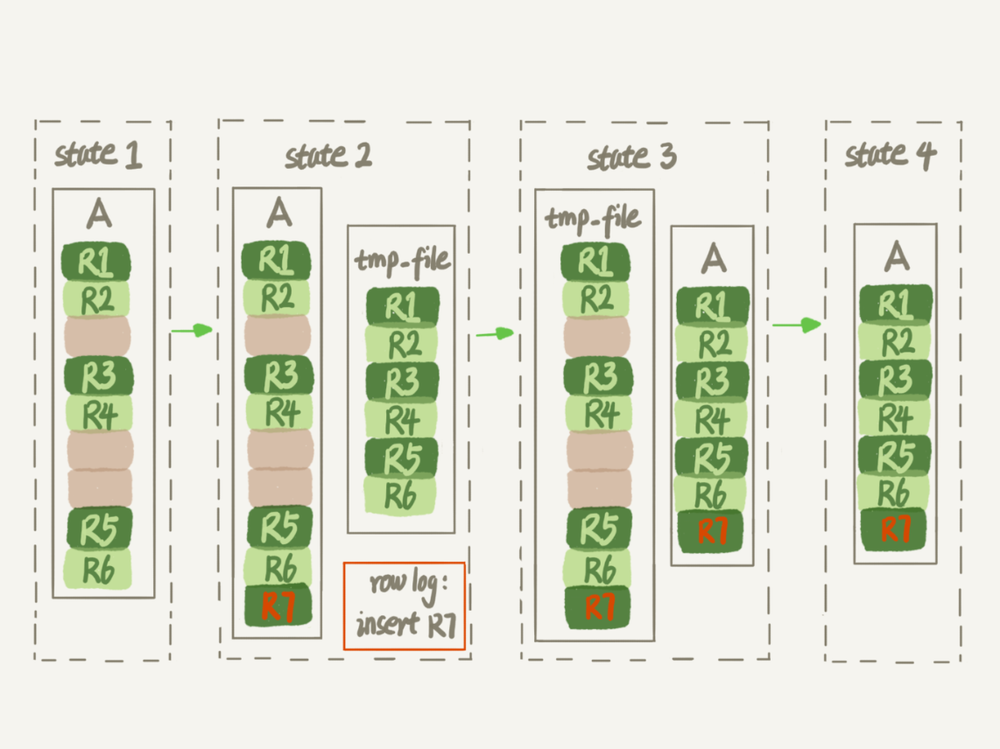
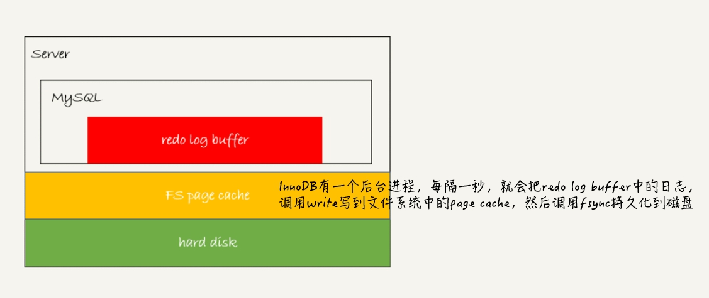

### 思维导图


### 索引下推

旨在 在“仅能利用最左前缀索的场景”下（而不是能利用全部联合索引），对不在最左前缀索引中的其他联合索引字段加以利用——在遍历索引时，就用这些其他字段进行过滤(where条件里的匹配)。

### 普通索引和唯一索引如何选择

首先我们先看一下底层更新数据的流程，（列上有加了索引）：

那么数据库会根据B+树，根据索引查找对应的主键，

接下来会判断该主键对应的数据行有没有在内存中，如果在内存中，那么就直接读取对应的数据行的值；

如果对应的数据行没有在内存中，那么这个时候，就需要看看该索引是唯一索引还是普通索引。如果是唯一索引的话，因为是更新数据，所以需要将对应的数据从磁盘加载到内存中，判断符不符合唯一性，然后再进行更新。

如果是普通索引的话，这时候的更新数据可以使用change buffer，先将更改的数据放在change buffer中，这个时候就不用将数据从磁盘读到内存。

change buffer 如何保证数据的正确性呢？change buffer 会将数据合并到原始的数据上，这个过程叫做 merge。访问数据页，数据页加载到内存中，会触发merge，系统后台会定期merge，数据库正常关闭的时候，也会merge。


现在我们再来看看普通索引和唯一索引如何选择。

对于查询数据，普通索引和唯一索引的效率没有太大差异。如果说是更新数据，普通索引能够利用change buffer，性能更加。

具体来说，对于写多读少的场景，唯一索引能够使用change buffer，性能可以得到提升。如果硬盘是机械硬盘，提升就更大了。当如果写某一行数据，该数据马上就会查到，那么就建议关闭 change buffer，因为下一次还是会将数据页读到磁盘，change buffer的用处不大，当存在维护change buffer的开销。


redo log 和 change buffer的区别

redo log 主要节省随机写磁盘的数据消耗，变成顺序写。 change buffer 主要节省随机读磁盘的数据消耗。

### 为什么数据库会选错索引？

数据库的索引选择是由“优化器”决定的，优化器选择索引的选择标准是 “以最小的代价执行SQL语句”。

那怎么判断“最小代价”呢？ 优化器会从三个方面入手，执行的行数，是否用到临时表，是否排序。

其中执行的行数，首先需要统计对应的数据的基数。（基数是指某一列不同元素的个数。）

基数是一个大概值，统计基数的步骤为：

1. 统计N个数据页的不同元素的个数，然后取平均值。将这个平均值 乘以 页数，就能得到对应的统计基数值。

执行的行数除了统计基数，还需要统计这条SQL语句会执行多少行。如果需要回表查询，回表的次数也是会加上的。如果MySQL认为回表的开销比使用索引的开销小，那么就不会使用索引，但是MySQL做的不一定准确。

如何避免MySQL选错索引呢？

MySQL选错索引的概率不会很大，但是如果MySQL选错了索引，那么解决方式可以为：

1. 使用 force index 强制使用索引
2. 重新写SQL语句
3. 删除不必要的索引


### 怎么给字符串加索引？

现在有一个业务是根据邮箱登录，那么怎么给邮箱加索引呢？

1. 普通的索引：如果给邮箱加普通的索引，那么就有可能导致索引占用的空间过大。
2. 前缀索引：前缀索引的话，需要判断取前多少个字符合适，可以通过下面这条SQL语句进行判断
   ```sql
        select 
            count(distinct left(email, 4)) as L4,
            count(distinct left(email, 5)) as L5,
            count(distinct left(email, 6)) as L6,
            count(distinct left(email, 7)) as L7,
        from SUser
    ```
    使用前缀索引很有可能会丢失区分度，所以需要确定可以受损的比例，比如5%，那么需要在L4~L7中，找到不小于 L * 95%的最小值。  
    但是使用了前缀索引，那么就一定得进行回表查询（因为前缀索引只是列的前一部分）。同时的话，也无法使用覆盖索引。这也是使用前缀索引需要考虑的因素。

如果是身份证这种，且为一个中学的学生的身份证加索引，那么怎么加呢？ （一个中学的学生大多是同一个地方的人，身份证前面的值是相同的）

1. 倒序存储。存储身份证的时候，进行倒数存储，(还可以再加上前缀索引)。
    那么查询的语句为：
    ```sql
    select field_list from t where id_card = reverse('input_id_card_string');
    ```
    但是这么做的话，会造成CPU额外的消耗，因为需要执行函数 reverse，同时，也无法进行范围查询。
2. 使用hash。原来的表上除了身份证这一列。再加上一列存储身份证的哈希值，用来进行校验，为这列加上索引。
    ```sql
    <!-- 添加id_card_crc这一列，并加上索引 -->
    alter table t add id_card_crc int unsigned, add index(id_card_crc);

    <!-- 插入语句 -->
    select field_list from t where id_card_crc = crc32('input_id_string') and id_card = 'input_id_card_string';
    ```
    这样，索引的长度就变短了，但是需要额外的列，也没有达到节省空间的作用。CPU同样会造成额外的消耗，且哈希计算CPU消耗比反转（reverse）更大。从查询来看，哈希造成的冲突会少一点，但是相对的，无法使用范围查询。   


当然，上面的四种做法，需要从业务量和收益进行估计。如果数据量不大，节省的空间没多少，那么就直接使用全字段索引。


### 为什么我的MySQL会“抖”一下

这里设计到的存储结构为：磁盘，redo log(顺序写的磁盘)， 内存

1. 当redo log写满了之后，必须将redo log的数据持久到磁盘
2. 内存缓冲池（buffer pool）里的页满了，执行内存淘汰机制，但是淘汰的页是“脏页”，脏页需要写回到磁盘。当一条SQL语句涉及到多个脏页写回到磁盘，那么需要的时间就更久。
    - 为什么缓冲池的页进行内存淘汰后，需要写回到磁盘？如果不写回到磁盘，下次需要这个数据的时候，从磁盘读取，并加上redo log里的值不就行了吗？ 这其实是从性能考虑的。如果刷脏页一定会写盘，就能保证每个数据页有两种状态，一种是在内存里的，内存里的数据一定是正确的数据，直接返回； 另一个是内存没有的数据，那么磁盘里的数据一定是正确的结果，读入内存直接返回。这样效率更好。
    - 为了保证每次读写不每次都和磁盘交互，需要保证change buffer 的脏页率，一般不要让它接近75%

### 为什么表数据删掉一半，表文件大小不变？

数据库里面的数据可以分为表结构定义和数据。

在MySQL8.0后，表结构定义放在了系统数据表里面。系统数据表里面一般存在表结构定义、数据字典，undo log等文件

数据的话，可以存放在共享表空间，或者单独的文件里。推荐放在单独的文件里，如果使用drop table，就可以直接删除。innodb_file_per_table设置为on，就是将数据放在单独文件里。

删除一条数据的流程：

1. 将这条数据的位置标记为删除，以后可以复用这个位置（所以表的空间大小不会减小）
2. 如果整个数据页都可以复用，那么这个页可以插入到任何位置
3. 如果说相邻两个数据页的利用率很小，那么两个数据页会合并，一个页成为可以复用的页

通过重建表来进行压缩表空间 （Online DDL的流程）

1. 创建一个临时文件，将原来的表的b+树进行复制 到这个临时文件中
2. 如果在这个过程中，出现对原来的表的操作，那么就将这些操作记录到 row log 里面
3. 将日志文件应用到临时文件中
4. 用临时文件替换原来的表




### 日志和索引相关的问题

redo log 和 bin log?

MySQL利用 redo log 和 bin log 进行两段提交。事务提交的时候，redo log 先处于 prepare 状态，当 bin log 提交后， redo log 再进行 commit。


<!-- <div>
    
<div> -->


1. 如果说在 redo log 处于 prepare 之前崩溃的，那么数据会进行回滚，仍然能够保证一致性。
2. 如果说在 时刻A 崩溃，由于 bin log 未进行 commit，redo log 也未进行 commit，所以 redo log 会进行回滚，仍然能够保证一致性。
3. 如果说在 时刻B 崩溃的，bin log 已经进行 commit， 那么就能提交。redo log在恢复之后能够执行 commit

**redo log 的 WAL技术：**

WAL全称为 Write-Ahead-Logging ，它的关键点是先写日志，再写磁盘

**上面的第三点需要额外说一下，MySQL怎么知道 bin log 已经写完整了呢？**  

bin log 有两种格式，一种是 statement，如果 bin log 写完整了，那么会有一个 commit 的标识。如果是 row，那么会有一个 XID 的标识。同时的话， bin log 在MySQL 5.6之后，有 binlog-checksum 参数，用来判断 bin log 的完整性。

**怎么利用 bin log 使 redo log 提交？**

如果碰到 只有prepare，没有 commit的redo log，那么就会拿着XID去找bin log。  

**只使用redo log可不可以？只使用bin log可不可以？为什么要两段提交？**

首先，必须使用 redo log 的原因是，MySQL目前之前利用 redo log 进行崩溃后的恢复。因为 redo log 是写在磁盘的，且两段提交的时候它首先处于prepare状态。

必须使用bin log的原因，从库，其他下游数据的恢复都需要通过redo log。

如果不使用两段提交，先提交 redo log，再提交 bin log会发生什么事？在redo log提交之后崩溃的情况下，因为redo log 可以保证持久化，所以本机的MySQL的数据不会丢失，但是因为没有写bin log，从库的数据就会出现不一致的现象。同时，redo log

如果先写bin log，再写redo log。bin log 没有能力恢复"数据页"的。

**正常运行的实例，数据写入后的最终落盘，是从redo log更新，还是从buffer pool更新过来？**

是从buffer pool更新。

如果是正常运行的实例的话，数据页被修改以后，跟磁盘的数据页不一致，称为脏页。最终数据落盘，就是把内存中的数据页写盘。这个过程，甚至与 redo log 毫无关系。在崩溃恢复场景中，InnoDB 如果判断到一个数据页可能在崩溃恢复的时候丢失了更新，就会将它读到内存，然后让 redo log 更新内存内容。更新完成后，内存页变成脏页，就回到了第一种情况的状态。


### count(*) 这么慢，该怎么办？

由于 InnoDB 有 MVCC，所以统计 count(*) 的时候，需要遍历所有的行。 （show table status 可以查看各个表的行数，但是这个值是不准确的，所以不能直接用）

统计表的行数，除了 count(*) 之外，还可以将对应的值存在Redis中，并对Redis进行更新。但是因为Redis和MySQL是不同的存储系统，且不支持分布式事务，所以使用Redis也会导致返回数据表的总行数不准确。

用数据库保存计数。我们将表的行数放在一个数据库表中，利用MySQL的事务保证结果的正确性。


在上图中，由于事务A未提交，所以事务B统计的结果是不会包含事务A的值的，数据正确。

额外补充：在现实场景下，“插入新的数据行”最好写在“更新行数”的前面。 因为 “更新行数”需要加锁

**不同count的用法，count(*), count(1), count(id), count(字段值)的性能？**

性能上， count(*) ≈ count(1) > count(id) > count(字段值)。

count(\*) 是统计所有的行数，所以不用把数据提取出来，count(\*)直接统计行数。

count(1) 向server层返回每一行，并放入一个“1”进去，并累加。

count(id) 向server返回每行的id，id也不会为0，但是需要提取id的数据。

count(字段) 向server返回每行的字段值，如果这个字段的值没有定义为 not null，则需要提取该字段的值，并判断是否为null，如果为null，就不统计。


### order by 是如何工作的

```sql
    select city, name, age
    from t
    where city = "杭州"
    order by name
    limit 1000;
```

MySQL会为排序的线程分配一个 sort_buffer，用于排序。排序有两种形式，一种是全字段排序，另一种是rowid 排序

如果说 sort_buffer 内存大小过小，无法放下需要排序内容，那么需要利用外部文件进行归并排序。

进行全字段排序时，需要加上索引<city>，如果有正确联合索引<city, name>，覆盖索引<city, name, age>，能够大大提升查询效率。

rowid排序，排序的字段是<order by的字段, id>


**显示随机的数据行：**

`limit N, 1`：跳过前N行，选择下一行

### 为什么我查一条数据也很慢？

通过命令`show processlist`进行排查

等待 MDL 锁 -> 等 flush -> 等行锁 -> 一致性视图，需要redo log 回滚很多值（使用 lock in share mode 变成当前读，能立即返回最新的数据）


### MySQL加锁

基本原理：

1. 加锁的基本单位是 next-key-lock，next-key-lock是前开后闭的区间
2. 查找过程中访问的对象才会加锁。（如果查的是普通索引，且存在覆盖索引，且用的是lock in share mode，则不会加主键索引的锁）
3. 若是等值查询，给唯一索引加锁，next-key-lock退化为行锁
4. 如果等值查询，给普通索引加锁，向右遍历时且最后一个值不满足条件的时候，next-key-lock退化为间隙锁
5. 唯一索引上的范围查询会访问到不满足条件的第一个值为止。
6. lock in share mode 读锁，当前读，如果存在覆盖索引，则不会锁主键索引。 for update 写锁，一定会锁主键索引


### MySQL有哪些“饮鸩止渴”的方法？


### MySQL怎么保证数据不不丢失

<div>
    
<div>




**redo log buffer中，有三种状态，分别是：**

1. 存在 redo log buffer 中，物理上是在MySQL进程内存中，就是图中的红色部分
2. 写在磁盘（write，实际上是物理内存，但是这个内存不由MySQL的内存，是文件系统的内存），但是没有进程持久化（fsync），物理上是文件系统中的page cache里面，也就是图中的黄色部分
3. 持久化到磁盘，对应的是 hard disk，也就是图中的绿色部分

**双1配置：**

通常我们说的“双1”配置，指的是sync_binlog 和 innodb_flush_log_at_trx_commit 都设置成1。也就是说，一个事务在完整提交之前，需要等待两次刷盘，一次是 redo log（prepare阶段），一次是binlog。

如果出现IO瓶颈的场景里，将 sync_binlog设置成一个比较大的值，可以提升性能。在实际的业务场景中，考虑到丢失日志的可控性，一般不建议将这个参数设为0，比较常见的是将其设置为 100 ~ 1000 中的某个数值。

**数据库的 crash-safe保证的是：**

1. 如果客户端收到事务成功的消息，事务就一定进行持久化了
2. 如果客户端收到事务失败的（比如主键冲突、回滚等）的消息，事务就一定失败了
3. 如果客户端收到“执行异常”的消息，应用需要重连后通过查询当前的状态来继续后序的逻辑。此时数据库只需要保证内部（数据和日志之间，主库和备库之间）一致就可以了。、

### 如何保证数据的高可用性


在网络正常的情况下，主备延迟主要来源是备库接受完binlog和执行这个事务之间的时间差。

**主备延迟的来源有：**

1. 备库所在机器的性能比主库所在机器的性能要差
2. 备库的压力大，备库有很多查询，消耗了很多的CPU资源
3. 在执行大事务

**可靠性优先策略和可用性优先策略：**

SBM：（seconds_behind_master）主备之间延迟了多少时间


### 误删除数据后怎么办


当然，我们不止要说误删数据的事后处理方法，更重要的是事前预防。

1. 如果是业务开发同学，你可以用 show grants 命令来查看账户的权限，如果权限过大，可以建议 DBA 同学给你分配权限低一点的账户
2. 把 sql_safe_updates 参数设置为 on。这样一来，如果我们忘记在delete 或者 update 语句中写 where 条件，就会报错
3. 代码上线前，必须经过 SQL 审计
4. 评估业务的重要性，和DBA同学商量备份的周期、是否有必要创建延迟复制的备库等

### 为什么还有kill不掉的语句


### 我查那么多的数据，会不会把内存打爆？

不会，MySQL是边读边发的


### 到底可不可以用 join


### 什么时候使用内部临时表

sort_buffer，内存临时表，join_buffer都是用来存放语句执行过程的中间数据。

**什么时候会使用内存临时表呢？**

1. 使用union的时候，如果有重复的数据，只能出现一次。内存临时表就是用主键的唯一性来实现去重的目的。（当然，如果使用 union all 的话，不需要去重，那么就不需要内存临时表了）
2. 使用 `group by` + `count(*)` 的时候：使用内存临时表统计数据。同时，一般group by后面会接`sort_buffer`进行排序。  
   如果不希望group by后面接 sort_buffer，那么在SQL语句的后面接上 `order by null`    
   （当然，如果group by + 索引，那么就不需要使用临时表了，因为顺序读就能够之后 count(*)的值了）

如果内存临时表放不下的话，就会转成磁盘的临时表。

**小结：**

1. 如果对 group by 语句的结果没有排序要求，要在语句后面加上 order by null
2. 尽量让 group by 过程用上表的索引，确认方法是 explain 结果里没有 Using temporary 和 Using filesort
3. 如果 group by 需要统计的数据量不大，尽量只使用内存临时表；也可以通过适当调大tmp_table_size 参数，来避免用来磁盘临时表
4. 如果数据量实在是过大，使用SQL_BIG_RESULT这个提示，来告诉优化器直接使用排序算法来得到 group by 的结果