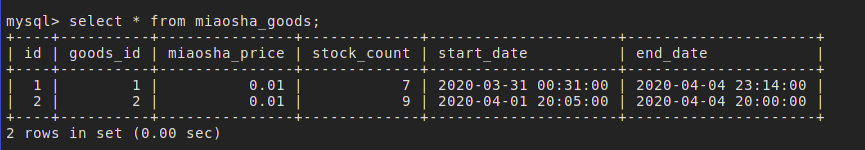
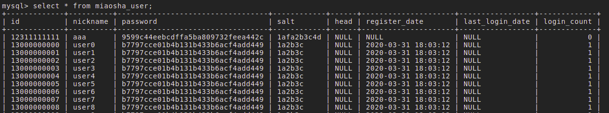
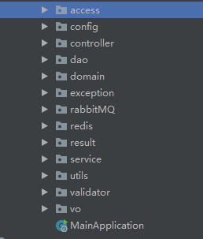
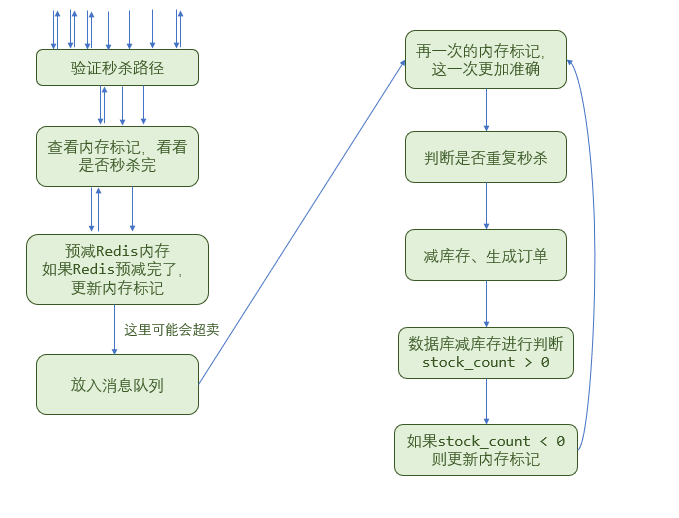
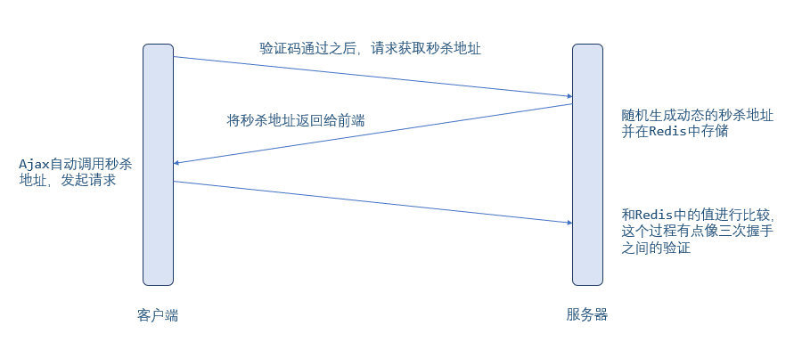
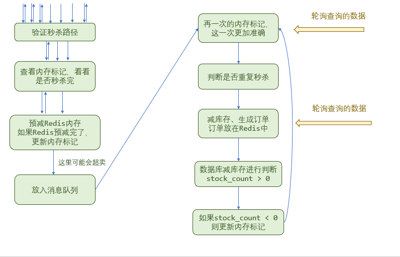

## 数据库设计

数据库的设计必须满足三大范式：

- 第一范式：属性的原子性
- 第二范式：不能有部分依赖，非主键必须完成依赖主键
- 第三范式：不能有传递依赖，任何字段不能由非主键推出

### 秒杀系统中用到的表主要有：

```bash
mysql> show databases;
+--------------------+
| Database           |
+--------------------+
| information_schema |
| mysql              |
| performance_schema |
| seckill            |
+--------------------+
4 rows in set (0.00 sec)

mysql> use seckill
Database changed

mysql> show tables;
+-------------------+
| Tables_in_seckill |
+-------------------+
| goods             |
| miaosha_goods     |
| miaosha_order     |
| miaosha_user      |
| order_info        |
| user              |
+-------------------+
6 rows in set (0.00 sec)
```






```sql
-- Linux中进入MySQL
mysql -uroot -p
```

秒杀系统，有一个非常重要的特点：在短时间内并发量很大。

在谈论如何解决短时间内超高的并发量这个问题，我们先来看看整体的一个架构。

1. 在浏览器端，为了避免在秒杀系统前，大量用户的点击造成服务器压力过大，我们可以采用页面静态化，使得前后端分离。动态数据通过Ajax异步发起请求。
2. 在秒杀开始时，有大量的用户抢购商品，势必会造成短时间内网络带宽过多，针对网络层面，我们需要使用CDN
3. 使用Nginx横向扩展
4. 使用Redis存储热点数据
5. 使用RabbitMQ削峰
6. 客户端轮询查询结果

## maven

需要引入的依赖：

| artifactId                          | 名称                                     |
| ----------------------------------- | ---------------------------------------- |
| spring-boot-starter-web             |                                          |
| spring-boot-configuration-processor | 注解@ConfigurationProperties需要引用的包 |
| spring-boot-starter-thymeleaf       | 静态模板                                 |
| mybatis-spring-boot-starter         | mybatis                                  |
| fastjson                            | 将对象转换成JSON，用于redis的key         |
| jedis                               | redis                                    |
| mysql-connector-java                | MySQL                                    |
| druid                               | MySQL连接池                              |
| junit                               | 单元测试                                 |

```java
@SpringBootApplication
SpringApplication.run(MainApplication.class, args);
```



domain, vo： 有可能需要用到注解来验证而已。


为秒杀的商品添加单独的表：是为了快速找到商品，而且可能多了一些字段，秒杀开始时间等。为了防止说其他表的不断更改，所以创建新的秒杀表

### 自定义注解约束器

在属性上使用注解，添加约束 @IsMobile  【模仿@NotNull】

- 使用注解

- 注解上使用@Constraint约束器
- 在约束器中，使用正则表达式判断格式

```java
@Target({ElementType.FIELD})
@Retention(RetentionPolicy.RUNTIME)
@Constraint(validatedBy = {IsMobileValidator.class})
public @interface IsMobile {
    String message() default "手机号码格式错误";
    Class<?>[] groups() default { };
    Class<? extends Payload>[] payload() default {};
    boolean required() default true;
}
```

```java
public class IsMobileValidator implements ConstraintValidator<IsMobile, String>{
    @Override
    public void initialize(IsMobile constraintAnnotation) {
        
    }

    @Override
    public boolean isValid(String value, ConstraintValidatorContext context) {
        
    }
}
```


@Controller

@RequestMapping

没有RequestMapping的话，就是返回页面

```
@Autowired
@Responsity
@Service
@Controller


```

登录信息是mobile 和 passowrd

MiaoshaUserService需要判断用户是否存在，密码是否正确


从redis取数据，取不到从MySQL中取，取完写入到redis中，什么数据都可以在redis中存一下

【缓存不一致的问题】


cookie也写到缓存中


```java
@Update("update miaosha_user set password = #{password} where id = #{id}")
```

### Resis

Jedis 封装redis的方法

- 从JedisPoll中获取Jedis线程
- 加上prefix获取redis真正的key （对象存在Redis当中是JSON格式）
- 相关的get、set等操作
- 用完之后放回jedis池中去就可以


```java
@Service
public class RedisService {

    @Autowired
    JedisPool jedisPool;

    public<T> T get(PrefixKey prefix, String key, Class<T> clazz){
        Jedis jedis = null;
        try {
            //连接池信息
            jedis = jedisPool.getResource();
            //生成真正的key
            String realKey = prefix.getPrefix() + key;
            //从redis中查到realKey的值
            String str = jedis.get(realKey);
            //可以fastJson中的方法：JSON.toJavaObject(JSON.parseObject(str), clazz);
            T t = stringToBean(str, clazz);
            return t;
        } finally {
            returnToPool(jedis);
        }
    }
}
```


JedisPool的配置


```properties
# 连接池配置：https://yq.aliyun.com/articles/236383?spm=a2c4e.11153940.0.0.48786f98VxXj5R

redis.host=182.92.163.202
redis.port=6379
redis.timeout=300
redis.password=root
redis.poolMaxTotal=1000
redis.poolMaxIdle=1000
redis.poolMaxWait=300
```


使用ConfigurationProperties注解来获取配置文件（application.properties）中前缀为redis的值。

```java
@Component
@ConfigurationProperties(prefix = "redis")
public class RedisConfig {
    private String host;
    private int port;
    private int timeout;
    private String password;
    private int poolMaxTotal;
    private int getPoolMaxIdle;
    private int poolMaxWait;
}
```


- poolConfig -> 是@ConfigurationProperties 从application.properties中获取数据

```java
@Service
public class RedisPollFactory {

    @Autowired
    RedisConfig redisConfig;

    @Bean
    public JedisPool jedisPoolFactory(){
        JedisPoolConfig poolConfig = new JedisPoolConfig();
        poolConfig.setMaxIdle(redisConfig.getGetPoolMaxIdle());
        poolConfig.setMaxTotal(redisConfig.getPoolMaxTotal());
        poolConfig.setMaxWaitMillis(redisConfig.getPoolMaxWait() * 1000);
        
        JedisPool jp = new JedisPool(poolConfig, redisConfig.getHost(), redisConfig.getPort(),
                redisConfig.getTimeout() * 1000, redisConfig.getPassword(), 0);
        return jp;
    }
}
```


@Bean是在配置类中使用的。可以说是配置类中的@Component：<https://blog.csdn.net/qq_38534144/article/details/82414201>


### Result

- CodeMsg：

```java
public class CodeMsg {
    private int code;
    private String msg;
}
```

```java
public class Result<T> {
    private int code;
    private String msg;
    private T data;
}

/**
* 访问级别设置为private，只能通过静态方法调用构造函数，
* 而不希望直接被外界调用。
* data为要返回给前端的数据
*/
private Result(T data) {
    this.code = 0;
    this.msg = "success";
    this.data = data;
}

/**
* Result的code,msg会被赋值
*/
private Result(CodeMsg cm){
    if(cm == null){
        return;
    }
    this.code = cm.getCode();
    this.msg = cm.getMsg();
}

/**
* 静态方法，向前端返回数据时调用，Result的data赋值为要返回的数据
*/
public static <T> Result<T> success(T data){
    return new Result<T>(data);
}

/**
 * 静态方法，出现逻辑逻辑上，或者代码上的错误时返回给前端。
 * Code, msg被赋值
 */
public static <T> Result<T> error(CodeMsg cm){
    return new Result<T>(cm);
}
```


### 全局异常处理器  

- GlobalException全局异常，CodeMsg为内部属性
- `GlobalExceptionHandler全局异常处理器，针对不同的异常，向前台返回不同的异常msg`

`全局异常处理器主要用到两个注解`：

- @ControllerAdvice：注解定义全局异常处理类
- @ExceptionHandler：注解声明异常处理方法


```java
public class GlobalException extends RuntimeException {

    private static final long serialVersionUID = 1L;

    private CodeMsg cm;

    public GlobalException(CodeMsg cm){
        super(cm.toString());
        this.cm = cm;
    }

    public CodeMsg getCm(){
        return cm;
    }
}
```

```java
@ControllerAdvice
@ResponseBody
public class GlobalExceptionHandler {
    @ExceptionHandler(value=Exception.class)
    public Result<String> exceptionHandler(HttpServletRequest request, Exception e){
        //TODO： 异常处理器的原理
        e.printStackTrace();
        if(e instanceof GlobalException) {
            GlobalException ex = (GlobalException)e;
            return Result.error(ex.getCm());
        }else if(e instanceof BindException) {
            BindException ex = (BindException)e;
            List<ObjectError> errors = ex.getAllErrors();
            ObjectError error = errors.get(0);
            System.out.println(error);
            String msg = error.getDefaultMessage();
            //这里需要注意，fillArgs是使用String的format方法
            return Result.error(CodeMsg.BIND_ERROR.fillArgs(msg));
        }else {
            return Result.error(CodeMsg.SERVER_ERROR);
        }
    }
}
```

```java
public static CodeMsg BIND_ERROR = new CodeMsg(500101, "参数校验异常：%s");

public CodeMsg fillArgs(Object...args){
    int code = this.code;
    //关于String.format的详细用法：https://blog.csdn.net/lonely_fireworks/article/details/7962171
    String message = String.format(this.msg, args);
    return new CodeMsg(code, message);
}
```

### MD5加密

- 前端用户输入的表单密码 + 固定的salt --> 第一次MD5加密
- 后端接收到第一次加密后的密码 + 用户数据库中的salt --> 第二次MD5加密

### 注解

#### @Valid

接收到数据之后会自动将数据绑定到 Java 对象上去。系统会使用`HttpMessageConverter`或者自定义的`HttpMessageConverter`将请求的 body 中的 json 字符串转换为 java 对象。

```java
public Result<String> doLogin(HttpServletResponse response, @Valid LoginVo loginVo){
    ····
}
```

### 逻辑

#### 1. 登录逻辑

- `@Valid LoginVo loginVo`，使用@valid将json数据封装成对象

- LoginVo对象里，加了`属性验证`，用来判断属性值格式是否符合条件

- 根据手机号(类似id)，从数据库查找出用户`User对象`，判断该手机号的用户是否存在

- 根据密码，看看密码对不对（需要两次MD5）

- 同时生成cookie（在Redis中也需要存放cookie）

  ```java
      public String login(HttpServletResponse response, LoginVo loginVo) {
          if (loginVo == null) {
              throw new GlobalException(CodeMsg.LOGIN_USER_ERROR);
          }
  
          //获取登录的信息
          String mobile = loginVo.getMobile();
          String formPasswd = loginVo.getPassword();
          //判断用户是否存在
          MiaoshaUser user = getById(Long.parseLong(mobile));
          if (user == null) {
              throw new GlobalException(CodeMsg.MOBILE_NOT_EXIST);
          }
          String dbPasswd = user.getPassword();
          //验证密码
          String saltDb = user.getSalt();
          String calcPass = MD5Util.formPasswdToDbPasswd(formPasswd, saltDb);
          if (!calcPass.equals(dbPasswd)) {
              throw new GlobalException(CodeMsg.PASSWORD_ERROR);
          }
          System.out.println("登录成功, 账号为：" + mobile);
          //生成cookie
          String token = UUIDUtil.uuid();
          System.out.println("token为：" + token);
          addCookie(response, token, user);
          return token;
      }
  ```

  ```java
      private void addCookie(HttpServletResponse response, String token, MiaoshaUser user) {
          //存放到redis
          redisService.set(MiaoshaUserKey.tokenPrefixKey, token, user);
          //cookie
          Cookie cookie = new Cookie(COOKIE_NAME_TOKEN, token);
          cookie.setMaxAge(MiaoshaUserKey.tokenPrefixKey.expireSeconds());
          cookie.setPath("/");
          response.addCookie(cookie);
      }
  ```

  

#### 2. 获取商品页详情

> [程序羊--看完这篇，别人的开源项目结构应该能看懂了](https://mp.weixin.qq.com/s?src=11&timestamp=1589385247&ver=2336&signature=KVZ7uVB73iGCEOZa-TS*3FNpNxNrJyV3Yb1zJ5qjWqOyKZL53uazQFoLMULzmh2pim6fp-b9xECN2zRVKooWh4LMnblrAe2nKTGSKBdmGxwPEnBhto8ci4eY0NulL5Vm&new=1)

- 使用Ajax获取数据

- ```java
  // REST风格，使用@PathVariable获取 {goodsId}的值
  
  @RequestMapping(value = "/to_detail_redis/{goodsId}", produces = "text/html")
  @ResponseBody
  public Result<GoodsDetailVo> detailRedis(@PathVariable("goodsId") long goodsId){
      	// 商品信息GoodsVo先预热，存进缓存中
     		····
          // 封装后返回GoodsDeatilVo
          GoodsDetailVo vo = new GoodsDetailVo();
          vo.setGoods(goods);
          vo.setUser(user);
          vo.setRemainSecond(remainSeconds);
          vo.setMiaoshaStatus(miaoshaStatus);
          return Result.success(vo);
  }
  ```

- Controller -> Service -> Dao

  

#### 3. 秒杀



- 根据请求秒杀的路，和Redis中的秒杀路径进行比较，看看路径对不对。

  ```java
  		//验证path
          boolean check = miaoshaService.checkSecKillPath(user, goodsId, path);
          if (!check){
              return Result.error(CodeMsg.REQUEST_ILLEAGAL);
          }
  ```

- 如果路径正确了，就根据内存标记，看看是否已经秒杀完了

  ```java
          //内存标记，减少redis的访问，挡住商品秒杀完，才进来的用户
          boolean over = goodsIsOverMap.get(goodsId);
  		if (over){
              return Result.error(CodeMsg.MIAOSHA_OVER);
          }
  ```

- 如果还没有秒杀完，就`预减Redis库存`， 并将请求`放入消息队列`

  ```java
  		//预减库存,一开始是10
          long stock = redisService.decr(GoodsKey.goodsStockPrefixKey, "" + goodsId);
          if (stock < 0){
              goodsIsOverMap.put(goodsId, true);
              return Result.error(CodeMsg.MIAOSHA_OVER);
          }
  
  		//消息队列
          MiaoshaMessage mm = new MiaoshaMessage();
          mm.setUser(user);
          mm.setGoodsId(goodsId);
          mqSender.sendMiaoshaMessage(mm);
  ```

- 然后就能直接返回了，客户端轮询查询结果

  ```java
          //排队中
          return Result.success(0);
  ```

- 消息队列发送端发送消息，监听端处理消息

  ```java
  public class MQSender {
      @Autowired
      AmqpTemplate amqpTemplate;
  
      @Autowired
      RedisService redisService;
  
      public void sendMiaoshaMessage(MiaoshaMessage miaoshaMessage){
          String msg = redisService.beanToString(miaoshaMessage);
          amqpTemplate.convertAndSend(MQConfig.MIAOSHA_QUEUE, msg);
      }
  }
  ```

  ```java
      @RabbitListener(queues = MQConfig.MIAOSHA_QUEUE)
      public void receive(String message){
          logger.info("receive message：" + message);
          MiaoshaMessage mm = redisService.stringToBean(message, MiaoshaMessage.class);
          MiaoshaUser user = mm.getUser();
          long goodsId = mm.getGoodsId();
  
          //再一次过滤
          GoodsVo goods = redisService.getGoodsVoByGoodsId(goodsId);
          miaoshaService.getGoodsOver(goods.getId());
          //判断是否已经秒杀成功了，防止重复秒杀
          MiaoshaOrder order = orderService.getMiaoshaOrderByUserIdAndGoodsId(user.getId(),goodsId);
          if (order != null){
              return;
          }
          //减库存 下订单 写入秒杀系统
          miaoshaService.miaosha(user,goods);
      }
  ```

- 减库存，下订单，放入秒杀系统

  ```java
      @Transactional
      public OrderInfo miaosha(MiaoshaUser user, GoodsVo goods) {
          //减库存 下订单 写入秒杀系统
          boolean success = goodsService.reduceStock(goods);
          if (success) {
              return orderService.createOrder(user, goods);
          } else {
              //如果说是返回false，那么就说明库存为0了
              setGoodsOver(goods.getId());
              return null;
          }
      }
  ```

  ```java
      public boolean reduceStock(GoodsVo goods) {
          MiaoshaGoods g = new MiaoshaGoods();
          //获取秒杀对象
          g.setGoodsId(goods.getId());
          //减库存
          int ret = goodsDao.reduceStock(g);
          return ret > 0;
      }
  ```

  ```java
      //防止超卖 stock_count > 0，update返回的是更新的条数
  	@Update("update miaosha_goods set stock_count = stock_count - 1 where goods_id = #{goodsId} and stock_count > 0")
      public int reduceStock(MiaoshaGoods g);
  ```

  

### 秒杀商品预加载到Redis

- `implement InitializingBean`

```java
public class MiaoshaController implements InitializingBean {
    private HashMap<Long, Boolean> goodsIsOverMap = new HashMap<>();

    /**
     * 初始化时加载，将商品信息存在Redis中，将商品是否已秒杀完的变量localOverMap置为false
     *
     * 但是这是一种强耦合
     */
    @Override
    public void afterPropertiesSet() throws Exception {
        List<GoodsVo> goodsVoList = goodsService.listGoodsVo();
        if (goodsVoList == null){
            return;
        }
        for (GoodsVo goodsVo : goodsVoList){
            //把商品放在缓存中
            redisService.set(GoodsKey.goodsStockPrefixKey, "" + goodsVo.getId(), goodsVo.getStockCount());
            //把商品是否秒杀完置为false
            goodsIsOverMap.put(goodsVo.getId(), false);
        }
    }
}
       
```

### 分布式Session

> 注：这里是分布式Session，但是名字在写的时候，写成了token。

一般来说，Session是位于tomcat里，如果说是分布式系统，那么不同的服务器不能获取同一个Session。这个时候，`我们把Session放在Redis，就能实现分布式Session`。

操作：

- 基于Redis的key-value，key为Session ID“`tokenPrefixKey + UUID随机生成的串`”，value为对象（使用`JSON.toJSONString(user)`转化成JSON格式） 

- 将key Session ID（“`tokenPrefixKey + UUID随机生成的串`”）作为cookie发送到浏览器

- 用户进行使用分布式Session登录的时候，根据Session ID，从Redis里面获取数据，并更新过期时间

  ```java
  public MiaoshaUser getByToken(HttpServletResponse response, String token) {
          if (StringUtils.isEmpty(token)){
              return null;
          }
          MiaoshaUser user = redisService.get(MiaoshaUserKey.tokenPrefixKey, token, MiaoshaUser.class);
          //延长有效期
          if (user != null){
               redisService.set(MiaoshaUserKey.tokenPrefixKey, token, user);
          }
          return user;
      }
  ```

### 拦截器

> 拦截器是Spring MVC的一部分。采用的是AOP，动态织入。
>
> 拦截器在Spring2.0+会拦截静态资源
>
> 我们要想自定义拦截器， 要求必须实现：HandlerInterceptor接口。
>
> <https://my.oschina.net/bianxin/blog/2876640?p=1>

#### 一、基于URL实现的拦截器：

- extends HandlerInterceptorAdapter，然后重写preHandle方法
- preHandler方法具体逻辑
  - 根据URL，不拦截`静态资源`，`login`， 【利用正则表达式进行匹配】
  - 对于其他的请求：根据Session ID看看能不能获取Session，如果能获取Session，根据权限看看要不要拦截，如果不能获取Session，进行拦截。

```java
public class LoginInterceptor extends HandlerInterceptorAdapter{
	/**
     * 在请求处理之前进行调用（Controller方法调用之前）
     * 基于URL实现的拦截器
     * @param request
     * @param response
     * @param handler
     * @return
     * @throws Exception
     */
    @Override
    public boolean preHandle(HttpServletRequest request, HttpServletResponse response, Object handler) throws Exception {
        String path = request.getServletPath();
        if (path.matches(Const.NO_INTERCEPTOR_PATH)) {
        	//不需要的拦截直接过
            return true;
        } else {
        	// 这写你拦截需要干的事儿，比如取缓存，SESSION，权限判断等
            System.out.println("====================================");
            return true;
        }
    }
}
```

```java
/**
 * @author 	BianP
 * @explain 常量类
 */
public class Const {

    public static final String SUCCESS = "SUCCESS";
    public static final String ERROR = "ERROR";
    public static final String FIALL = "FIALL";
    /**********************对象和个体****************************/
    public static final String SESSION_USER = "loginedAgent"; // 用户对象
    public static final String SESSION_LOGINID = "sessionLoginID"; // 登录ID
    public static final String SESSION_USERID = "sessionUserID"; // 当前用户对象ID编号

    public static final String SESSION_USERNAME = "sessionUserName"; // 当前用户对象ID编号
    public static final Integer PAGE = 10; // 默认分页数
    public static final String SESSION_URL = "sessionUrl"; // 被记录的url
    public static final String SESSION_SECURITY_CODE = "sessionVerifyCode"; // 登录页验证码
    // 时间 缓存时间
    public static final int TIMEOUT = 1800;// 秒
	public static final String ON_LOGIN = "/logout.htm";
	public static final String LOGIN_OUT = "/toLogout";
    // 不验证URL anon：不验证/authc：受控制的
    public static final String NO_INTERCEPTOR_PATH =".*/((.css)|(.js)|(images)|(login)|(anon)).*";
}
```

#### 二、基于注解的拦截器

- 基于注解的拦截器，可以有更多的定制化。比如根据次数次数进行拦截，限制每秒只能发多少个请求

```java
public class AuthorityInterceptor extends HandlerInterceptorAdapter{
	
	 @Override
	 public boolean preHandle(HttpServletRequest request, HttpServletResponse response, Object handler) throws Exception {
	 	// 如果不是映射到方法直接通过
        if (!(handler instanceof HandlerMethod)) {
            return true;
        }
        // ①:START 方法注解级拦截器
        HandlerMethod handlerMethod = (HandlerMethod) handler;
        Method method = handlerMethod.getMethod();
        // 判断接口是否需要登录
        LoginRequired methodAnnotation = method.getAnnotation(LoginRequired.class);
        // 有 @LoginRequired 注解，需要认证
        if (methodAnnotation != null) {
            // 这写你拦截需要干的事儿，比如取缓存，SESSION，权限判断等
            System.out.println("====================================");
            return true;
        }
        return true;
	}
}
```

#### 三、将拦截器添加到配置类中

一定要加@Configuration 这个注解，在启动的时候在会被加载。

```java
/**
 * 和springmvc的webmvc拦截配置一样
 * @author BIANP
 */
@Configuration
public class WebConfigurer extends HandlerInterceptorAdapter {
	 @Override
	 public void addInterceptors(InterceptorRegistry registry) {
        // 拦截所有请求，通过判断是否有 @LoginRequired 注解 决定是否需要登录
        registry.addInterceptor(LoginInterceptor()).addPathPatterns("/**");
        registry.addInterceptor(AuthorityInterceptor()).addPathPatterns("/**");
	 }
	 
	 @Bean
	 public LoginInterceptor LoginInterceptor() {
		 return new LoginInterceptor();
	 }
	 
	 @Bean
	 public AuthorityInterceptor AuthorityInterceptor() {
		 return new AuthorityInterceptor();
	 }
}
```

### 秒杀地址隐藏

秒杀地址是动态的，只有在秒杀开始后才能动态的获取。获取的大体流程为：


获取秒杀地址的流程为：

- 用户在秒杀前刷新页面，通过Ajax获取商品的信息。同时，会有秒杀倒计时。

- 当秒杀倒计时 == 0时，会出现验证码

  ```javascript
  $("#miaoshaTip").html("秒杀进行中");
              $("#verifyCodeImg").attr("src", "/miaosha/returnVerifyCode?goodsId=" + $("#goodsId").val());
              $("#verifyCodeImg").show();
              $("#verifyCode").show();
  ```

- 当验证码输入正确，会在服务器后端生成动态的秒杀地址。将秒杀地址存在Redis中，并将秒杀地址返回给前端。

  ```javascript
  // 根据验证码获取秒杀地址
  function getSecKillPath() {
          var goodsId = $("#goodsId").val();
          g_showLoading();
          $.ajax({
              url: "/miaosha/path",
              type: "GET",
              data: {
                  goodsId: goodsId,
                  verifyCode: $("#verifyCode").val()
              },
              success: function (data) {
                  //如果获取到秒杀地址，则进行doMiaosha(path)
                  if (data.code === 0) {
                      var path = data.data;
                      doMiaosha(path);
                  } else {
                      layer.msg(data.msg);
                  }
              },
              error: function () {
                  layer.msg("客户端请求有误");
              }
          });
      }
  ```

  ```java
   	/**
       * 只有验证码正确了才能生成秒杀地址
       */
      @AccessLimit(seconds = 5, maxCount = 10, needsLogin = true)
      @RequestMapping(value = "/path", method = RequestMethod.GET)
      @ResponseBody
      public Result<String> getSecKillPath(HttpServletRequest request, MiaoshaUser user,
                                           @RequestParam("goodsId") long goodsId,
                                           @RequestParam(value = "verifyCode", defaultValue = "0") int verifyCode){
          if (user == null){
              return Result.error(CodeMsg.SESSION_ERROR);
          }
          //判断验证码是否正确
          boolean check = miaoshaService.checkVerifyCode(user, goodsId, verifyCode);
          if(!check){
              return Result.error(CodeMsg.VERIFYCODE_IS_NULL);
          }
          //在Redis中写入秒杀接口地址
          String path = miaoshaService.createRealKillPath(user, goodsId);
          return Result.success(path);
      }
  ```

- 为了限制用户发起请求的数量，使用注解`@AccessLimit(seconds = 5, maxCount = 10, needsLogin = true)` 和拦截器，限制用户在5秒内只能发起10次请求。

  - 在Redis中设置count，过期时间为5秒，count最大值时10

### 客户端轮询查询结果



用户如何获取秒杀的结果呢？

用户不是等待后台系统返回结果，而是`客户端主动轮询查询结果`。

后端处理完秒杀请求后，如果秒杀成功，则会在根据用户id和商品id在Redis中创建结果，客户端轮询查看有没有这个结果

- 如果能查得到，说明秒杀成功
- 如果查不到，看看秒杀是否已结束，如果结束，则说明秒杀失败
- 如果未结束，告诉客户端再次轮询

```java
public long judgeSuccessOrNot(Long id, long goodsId) {
        MiaoshaOrder order = orderService.getMiaoshaOrderByUserIdAndGoodsId(id, goodsId);
        if (order != null){
            //秒杀成功
            return order.getGoodsId();
        }else {
            //判断是否秒杀结束
            boolean isOver = getGoodsOver(goodsId);
            if (isOver){
                //秒杀结束，秒杀失败
                return -1;
            } else {
                //让客户端继续轮询
                return 0;
            }
        }
    }
}
```


