|              -               | private | default | protected | public |
| :--------------------------: | :-----: | :-----: | :-------: | :----: |
|             本类             |    √    |    √    |     √     |   √    |
| 同一个包(Package)下的其他类  |    ×    |    √    |     √     |   √    |
| 不同包(Package),但是作为子类 |    ×    |    ×    |     √     |   √    |
|       不同包，不是子类       |    ×    |    ×    |     ×     |   √    |


设计模式的用途和优点，再看一些关键的OO设计原则


## 设计模式之美

面向对象有四大特性：`封装、继承、多态、抽象`。


### 面向对象语言？

如果说，按照严格的定义来说，面向对象语言需要有四大特性。但是按照不严格的定义来说，如果一门语言`以类/对象作为基本单元`，那么就可以认为是面向对象语言，从这个角度来说，现在的大多数语言都是面向对象编程语言，比如Java、go等。

在面向对象过程中，会遇到 is-a的关系（狗是一种动物），所以有了“继承”，但是随着编程语言的不断迭代，人们发现面向继承这种特性容易层次不清，所以一些语言在设计的时候就摒弃了这种特性，如 go。 但是我们不能说，没有继承就不是面向对象编程语言。


### 封装、继承、多态、抽象

**封装**：信息的隐藏或者是数据的保护。

比如说在 虚拟钱包Wallet类 中，并不需要暴露id，createTime这两个属性的任何修改方法，比如set方法。而且，这两个属性的初始值设置，对于Wallet的调用者来说也是透明的，所以，我们在Wallet类的`构造函数内部将其初始化`，而不是通过构造函数的参数进行赋值。

```java
public Wallet() {
    this.id = IdGenerator.getInstance().generate();
    this.creteTime = System.currentTimeMillis();
    ·····
}
```

对于钱包的余额来说，因为余额只有 增加/减少，所以只暴露了 increaseBalance() 和 decreaseBalance() 方法，并没有暴露 set() 方法。

对于封装这个特性，我们需要通过一定的语法机制来支持：`访问权限控制`


**抽象**：让调用者只知道有这个方法，而不需要知道这些功能是如何实现的。封装讲的主要是如何隐藏信息，而抽象讲的是如何隐藏信息的具体实现。

除了抽象类和接口外，函数方法，也算是一种抽象。

很多设计原则都体现了抽象的设计思想：基于接口而非实现编程、开闭原则（对拓展开放，对修改关闭）、代码解耦


**继承**：is-a （猫是哺乳动物）。最大的一个好处就是代码复用。

但是我们也可以通过组合来实现代码复用的问题。

过度使用继承，会导致继承层次过深，可维护性变差。所以有些人觉得继承是一种反模式。尽量少用。“多用组合 少用继承”


**多态**：同一个类型的对象执行相同的行为，在不同的状态下会表现出不同的特性。

子类替换父类，能够做到” 对修改关闭、对拓展开放 “

静态多态：重载，  动态多态：继承、重写、向上转型

除了“继承 + 重写”外，还有其他的实现方法：“接口类方法” ，“duck-typing”

```python
# python的 duck-typing方法
# 不用继承就能实现多态
class Logger:
    def record(self):
        print("I write a log into file.")
        
class DB:
    def record(self):
        print("I insert data into db.")
        
def test(recorder):
    recorder.record()
    
def demo():
    logger = Logger()
    db = DB()
    test(logger)
    test(db)
```

多态也有很多设计模式：策略模式、基于接口而非实现编程、依赖倒置原则、里氏替换原则、利用多态去掉冗长的 if-else 语句。


### 什么是面向过程编程？ 什么是面向过程编程语言？

同面向对象来做比较，面向对象是以 `对象/类` 为基本单元，而面向过程则是以 `过程（方法）`为基本单元。

面向过程最主要的特点是 数据和方法相分离。面向过程语言不支持丰富的面向对象编程特性，比如继承、多态、抽象、封装。


### 面向对象的优势？

面向过程是以方法去实现的，大规模的复杂程序，整个程序的处理流程错综复杂，如果少用面向过程，比较吃力。（Linux是用C写的，C是面向过程语言，但是Linux的设计中，但是其逻辑是面向对象的）

在使用面向对象编程时，我们可以将复杂的流程拆解为一个一个方法，先思考如何给业务建模，如何将需求翻译成类，如何给类之间建立交互关系，之后再进行类的设计。


### 三种违反面向对象编程风格的代码设计：

1. 滥用getter、setter方法

在设计实现类中，除非真的需要，否则尽量不要给属性定义setter方法。除此之外，尽管getter方法相对setter方法要安全点，但是如果返回的时是容器集合，那要防范内部数据被修改。

如果一个属性都定义了getter、setter方法，那么就相当于可以随时随地修改 属性的值，那么就失去了封装性。

如果返回地是List集合容器。外部调用者通过getter获取到这个集合容器后，是可以操控内部数据的。

```java
// main方法
public static void main(String[] args){
 	ShppingCart cart = new ShoppCart();
    ···
        cart.getInstances().clear();// 清除了数据，造成 和ItemCount 和 TotalPice 数据不一致
}

正确的清除数据为
public class ShoppingCart {
 	// 省略其他代码
    public void clear() {
        items.clear();
        imemsCount = 0;
        totalPrice = 0.5
    }
}

如果说，一定要有getter方法：
    public List<ShoppinagCartItem> getItems() {
    return Collection.unmodifableList(list.items);
}
```

2. 滥用全局变量和全局方法

当Constants 类中包含很多常量定义的时候，依赖这个类的代码就会有很多。每次修改Cont ants类，都会导致依赖它的文件重新编译，因此会浪费了很多不必要的编译时间。

对于Constants类、Utils 类的设计问题，我们尽量做到指责单一、定义一些细化的小类，比如RedisConstants、FileUtils，而不是定义一个大而全的Conatants类、Utils类。除此之外，如果能将这些类中的属性和方法，划分归并到其他业务中，那是最好不过的了，能极大提高类的内聚性和代码的可复用性。

3. 基于贫血模型的开发模式

MVC是数据和操作分隔开的，所以是面向过程。


### 接口或抽象类存在的意义？

抽象类是对成员变量和方法的抽象，是一种 is-a 关系，是为了解决代码复用的问题。

接口仅仅是方法的抽象，是一种 behaves like 关系（但是在JDK1.8中，接口可以有静态属性），表示具有某一组行为特性，是为了`解决耦合问题，隔离接口和具体的实现，提高代码的扩展性`。


### 抽象类和接口的应用场景区别？

如果表示的是 is-a，并且是为了解决代码复用的问题，那么就用抽象类；

如果表示的是以一种 behavior like 关系，并且是为了解决抽象而非代码复用问题，那我们就用接口。


### 设计原则：基于抽象而非实现编程：

抽象：接口 / 抽象类。

这个原则可以将 `接口和实现` 分离，`封装不稳定的实现，暴露稳定的接口`。`上游系统`面向接口而非实现编程，不依赖不稳定的实现细节，这样当实现发生变化的时候，上游系统的代码基本不需要做改动，以此来降低耦合性，提高扩展性。

在未来需要变化很大的时候，就不要做太大的改动，在不破化原有代码设计的情况下灵活应对。


在编写代码的时候，要遵从”基于接口而非实现编程“，

1. 函数的命名不能暴露任何细节。比如命名应该为 upload() 而非 uploadToAliyun()
2. 封装具体的实现
3. 为实现类定义抽象接口。具体的实现类依赖统一的接口定义，遵从一致的上传功能协议。`使用者依赖接口，而不是具体的实现类编程`。

```java
ImageStore imageStore = new PrivateImageStore();
```


**是否需要为每个类定义接口？**

这条原则的设计初衷是，将接口和实现相分离，封装不稳定的实现，暴露稳定的接口。在我们的业务中，`某个功能只有一种实现方式，未来也不可能被其他实现方式替换`，那我们就没有必要为其设计接口，直接使用实现类就可以了。

除此之外，我们越是要在代码的扩展性、维护性上下功夫。


### 设计原则：多用组合少用继承

**为什么不推荐使用继承？**

继承有三个作用：表示 is-a 关系，支持多态，代码复用。

但是继承层次过深，会影响到代码的可维护性。这种情况下，我们应该要多用组合，少用继承。

比如，设计一个鸟类，区分会飞的鸟，鸟的叫声： 

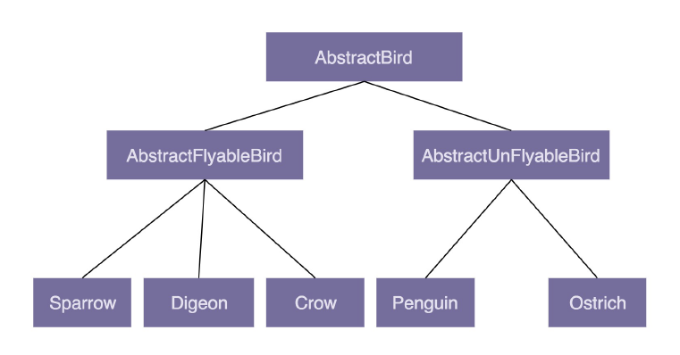

（如果再多添加几个特性，就会导致组合爆炸）


**利用 `接口、组合、委托` 来替代继承？**

1. `组合和接口` 的 behavior like 代替 接口的 is-a
2. 多态特性，用`接口`来实现
3. 代码复用，用 `组合和委托` 的方式实现

```java
public interface Flyable {
    void fly();
}
// 解决代码复用问题
public class FlyAbility implements Flyable {
    @Override
    public void fly() {
        System.out.println("用翅膀飞");
    }
}
// 省略鸟的叫声，是否会下蛋的 接口和实现

// 鸵鸟, Tweetable是鸟的叫声，EggLayable是鸟下单
public class Ostrich implements Tweetable, EggLayable {
    private TweetAbility tweetAbility = new TweetAbility(); // 组合
    private EggLayAbility eggLayAbility = new EggLayAbility(); // 组合
    
    @Override
    public void tweet() {
        tweetAbility.tweet(); // 委托
    }
    @Override
    public void layEgg() {
        eggLayAbility.layEgg(); //委托
    }
}
```


**判断使用组合还是继承？**

组合、继承、委托，意味着更细粒度的拆分，会定义更多的代码，增加代码复杂度和维护成本。

如果继承接口稳定，继承层次比较浅，那么可以使用继承。

但是，系统越不稳定，继承层次很深，继承关系复杂，我们就尽量使用组合来代替继承。


除此之外，一些设计模式会固定使用继承或者组合。

`组合：装饰者模式，策略模式，组合模式等`

`继承：模板模式`


### 贫血模型和充血模型的区别？

MVC是贫血模型，是一种面向过程的开发模式。

与贫血模型相对的，是基于充血模型的领域设计（Domain Driven Design, DDD）开发模式

贫血模型：在MVC的service中，像UserBo这样，只包含数据，不包含业务逻辑的类，就称为贫血模型。

充血模型：数据和业务逻辑被封装到一个类中。跟贫血模型的主要区别在于Service中。DDD的Service包含Service类和Domain类两部分。Domain类就相当于贫血模型的BO。不过Domain中，就包含数据，也包含业务逻辑，而Service类变得很单薄。

总结一下就是，基于贫血模型的传统开发，重Service轻BO，基于充血模型的DDD开发，轻Service重Domain。


如果要基于充血模型的DDD开发模型，我们需要事先理清楚所有的业务，定义领域模型所包含的属性和方法。领域模型相当于可复用的业务中间层。


### 鉴权需求的设计

1. 调用方进行接口请求的时候，`将URL、AppID、密码、时间戳`拼接在一起。通过加密算法生成token，并且将token、AppID、时间戳拼接在URL中，一起发送到微服务端。
2. 微服务端在接收到调用方的接口请求后，从请求中拆解出token、AppID、时间戳。
3. 微服务端首先检查传递过来的`时间戳跟当前时间`，是否在token失效的时间窗口内。如果已经超过失效时间，那就算接口调用鉴权失败，拒绝接口调用请求。
4. 如果token验证没有过期时间，微服务端再从存储中，取出AppID对应的密码，通过同样的token算法，生成另一个token，`与调用方传递过来的token进行匹配`；如果一致，则鉴权成功，允许接口调用，否则就拒绝接口调用。


### 单一职责原则（SRP）？

SOLID原则原则是由5个组成的，分别为 单一职责原则、开闭原则、里氏替换原则、接口隔离原则和依赖反转原则，依次对应SOLID中的S、O、L、I、D。


单一职责原则英文是Siggle Responsibility Principe，缩写为SRP，即`一个类或者一个模块只负责完成一个职责`。

如果说一个类包含了两个或者两个以上业务不相干的功能，我们应该把它拆分成多个功能更加单一、粒度更细的类。


但是，在实际的开发中，一个类是否是职责单一，还是很难拿捏的。

```java
public class UserInfo {
    private long userId;
    private String username;
    private String email;
    private String telephone;
    private long createTime;
    private long lastLoginTime;
    private String provinceOfAddress; //省
    private String cityOfAddress; //市
    private String regionOfAddress; //区
    private String detailedAddress; //详细地址
    ···· // 省略其他
}
```

这个User类是否符合单一职责原则呢？

有一种观点是，在这个类中，地址信息出现的比重比较高，所以应该独立为UserAddress类。

这种观点对吗？ `我们应该结合具体的场景进行分析`。

如果在这个类中，用户的地址信息跟其他的信息一样，都是单纯用来展示的，那UserInfo现在的设计就是合理的。

如果说这个产品开发比较好，添加了电商的功能，用户的地址信息还会在电商物流中使用，那我们最好将地址信息从UserInfo中拆分出来，独立完成用户物流信息。

那如果说这个公司又开发出了很多产品（可以理解为APP），公司希望支持统一的账户，也就是用一个账户可以在公司内部中的所有产品登录。这个时候，我们就需要继续对UserInfo进行拆分，将跟身份认证相关的信息（比如email，telephone等）抽取成独立的类。


所以，在实际的软件开发中，`我们可以先写一个粗粒度的类`，满足业务需求。随着业务的发展，如果粗粒度的类`越来越`庞大，代码越来越多，这个时候，我们就可以将这个粗粒度的类，拆分成几个更细粒度的类，这就是所谓的`持续重构`。

判断类是否职责单一，可以分析以下的几条判断原则：

1. 类中的代码函数、行数或属性过多，会影响代码的可读性和可维护性
2. 类依赖的其他类过多，或者依赖该类的其他类过多
3. 私有方法过多，我们要考虑能否将私有方法独立到新的类中，设计为public方法
4. 比较难给类起一个合适的名字，很难用一个业务名词概括


### 接口隔离原则

接口隔离原则（interface Segregation Principle，ISP），客户端不应该强迫依赖它不需要的接口。

这里的接口有三种不同的解释：

1. 接口可以理解为一组接口集合，可能是某个微服务的接口，也可以是某个类库的接口等。如果`部分接口`只被部分调用者使用，我们就需要`将这部分接口隔离出来`，单独给这个这部分调用者使用。
2. 如果把”接口“理解为单个API接口或函数，部分调用者`只需要函数中的部分功能`，那我们就需要把函数拆分成粒度更细的多个函数
3. 如果把接口理解为面向对象编程语言中的接口语法。那接口的设计要尽量单一，不要让接口的实现类和调用者，依赖不需要的接口函数。


接口隔离原则与单一职责原则的区别？

1. 单一职责原则针对的是模块、类、接口的设计。接口隔离原则更侧重于接口的设计
2. 接口隔离原则从不同的角度进行思考，`通过调用者如何使用接口`来间接判定


### 对扩展开放、对修改关闭？

简称”开闭原则“。这条规则是最有用的设计原则，因为`拓展性`是代码质量最重要的衡量标准之一。


开闭原则（Open Closed Principle，OCP），添加一个新的功能的时候，在已有代码的基础上扩展代码，而非修改代码。


(类似`接口、组合、委托`的写法)

```java
public class Alert {
    private List<AlertHandler> alertHandlers = new ArrayList<>();
    
    public void addAlertHandler(AlertHandler alertHandler) {
        this.alertHandlers.add(alertHandler);
    }
    
    public void check(ApiStatInfo apiStatInfo) {
        for (AlertHandler handler : alertHandlers) {
            handler.check(apiStatInfo);
        }
    }
}

public class ApiStatInfo {
    private String api;
    private long requestCount;
    private long errorCount;
    private long durationOfSeconds;
}

public abstract class AlertHandler {
    protected AlertRule rule;
    protected Notification notification;
    public AlertHandler(AlertRule rule, Notification notification) {
        this.rule = rule;
        this.notification = notification;
    }
    public abstract void check(ApiStatInfo apiStatInfo);
}

public class TpsAlertHandler extends AlertHandler {
    public TpsAlertHandler(AlertRule rule, Notification notification) {
        super(rule, notification);
    }
    
    @Override
    public void check(ApiStatInfo apiStatInfo) {
        long tps = apiStatInfo.getRequestCount() / apiStatInfo.getDurationOfSeconds;
        if (tps > rule.getMatchedRule(apiStatInfo.getApi().getMaxTps()) {
            notification.notify(NotificationEmergencyLevel.URGENCY, "....");
        }
    }
}

```

```java
// ApplicationContext 是一个单例类，负责Alert的创建、组装（ alertRule 和 notification 的依赖注入）、初始化（添加 handlers） 工作
public class ApplicationContext {
    private AlertRule alerRule;
    private Notification notification;
    private Alert alert;
    
    public void initializeBeans() {
        alertRule = new AlertRule(/*参数省略*/);
        notification = new Notification(/*参数省略*/);
        alert = new Alert();
        alert.addAlertHandler(new TpsAlertHandler(alertRule, notification));
        alert.addAlertHanderl(new ErrorAlerHander(alertRule, notification));
    }
    
    public Alert getAlert() {
        return alert;
    }
    
    // 饿汉式单例
    private static final ApplicationContext instance = new Application();
    private ApplicationContext() {
        instance.initializeBeans();
    }
    public static ApplicationContext getInstance() {
        return instance;
    }
}

public class Demo {
    public static void main(String[] args) {
        ApiStatInfo apiStatInfo = new ApiStatInfo();
        // ..省略设置apiStatInfo 数据值的代码
        ApplicationContext.getInstance().getAlert().check(apiStatInfo);
    }
}
```

这样子的代码就算是一个易于拓展的代码。当我们想要添加新的告警规则：如果我们需要添加一个功能，当每秒钟“超时请求个数”，超过某个预先设置的最大值，就触发报警。

```java
public class ApiStatInfo {// 省略 constructor/getter/setter 方法
	private String api;
	private long requestCount;
	private long errorCount;
	private long durationOfSeconds;
	private long timeoutCount; // 改动一：添加新字段
}

public abstract class AlertHandler { // 代码未改动... }

public class TpsAlertHandler extends AlertHandler {// 代码未改动...}

public class ErrorAlertHandler extends AlertHandler {// 代码未改动...}

// 改动二：添加新的 handler
public class TimeoutAlertHandler extends AlertHandler {// 省略代码...}

    public class ApplicationContext {
	private AlertRule alertRule;
	private Notification notification;
	private Alert alert;
	
	public void initializeBeans() {
		alertRule = new AlertRule(/*. 省略参数.*/); // 省略一些初始化代码
		notification = new Notification(/*. 省略参数.*/); // 省略一些初始化代码
		alert = new Alert();
		alert.addAlertHandler(new TpsAlertHandler(alertRule, notification));
		alert.addAlertHandler(new ErrorAlertHandler(alertRule, notification));
		// 改动三：注册 handler
		alert.addAlertHandler(new TimeoutAlertHandler(alertRule, notification));
	}
	//... 省略其他未改动代码...
}
    
public class Demo {
	public static void main(String[] args) {
		ApiStatInfo apiStatInfo = new ApiStatInfo();
		// ... 省略 apiStatInfo 的 set 字段代码
		apiStatInfo.setTimeoutCount(289); // 改动四：设置 tiemoutCount 值
		ApplicationContext.getInstance().getAlert().check(apiStatInfo);
    }
}
```


我们可以看到，改动一：增加新的功能后，在ApiStatInfo类中添加了新的属性 timeoutCount。这有没有违背开闭原则？

我们回到开闭原则的初衷上：只要`没有破化原有代码的正常运行`，`没有破坏原有的单元测试`，我们就可以说，这是一个合格的代码改动。

所以，这个并不会违背开闭原则。


接下来，我们看看改动三和改动四：在ApplicationContext类的 initializeBeans() 方法中，往 alert 对象中注册新的 timeoutAlertHandler；在使用 Alert 类的时候，需要给 check() 函数的入参 apiStatInfo 对象设置 timeoutCount 的值。

这两处修改，是地地道道的”修改“，但是这样子的修改是在所难免的。我们要认识到，添加一个新的功能，不可能任何模块、类、方法的代码都不”修改“，这是做不到的。

`我们要做的是尽量让修改操作更集中、更少、更上层，尽量让最核心、最复杂的那部分逻辑代码满足开闭原则`。


那如何写出拓展性更好的代码呢？

顶层的指导思想是，我们要时刻具备扩展意识、抽象意识、封装意识。这些”潜意识“可能比任何开发技巧都重要。

方法论：常用的方法有，多态、依赖注入、基于接口而非实现编程，以及大部分的设计模式（比如，装饰、策略、模板、职责链、状态等）。

比如，我们代码中通过kafka来发送异步消息。对于这样的功能，我们要学会将其抽象成一组跟具体消息队列（kafka）无关的异步消息接口。

```java
// 这一部分体现了抽象意识
public interface MessageQueue {
    // ....
}
public class KafkaMessageQueue implement MessageQueue {
    // ....
}
public class RocketMQMessageQueu implements MessageQueue {
    // ....
}

public interface MessageFromatter {
    // ....
}
public class JsonMessageFromatter implements MessageFromatter {
    // ....
}
public class ProtoBufMessageFromatter implement MessageFromatter {
    // ....
}

public class Demo {
    private MessageQueu msgQueue; //基于接口编程而非实现编程
    public Demo (MessageQueu msgQueue) { // 依赖注入
        this.masQueue = masQueue;
    }
    
    // msgFromatter: 多态，依赖注入
    public void sendNotification(Notifcation notificaton, MessageFormatter msgFormatter) {
        //...
    }
}
```


### 里氏替换原则？

里氏替换原则（Liskov Substitution Pinciple, LSP），子类对象能够替换程序中父类对象任何能出现的地方，并且保证原来程序的逻辑行为不变及正确性不被破坏。


里氏替换原则利用了多态的特性，但是和多态有一点区别。

多态是面向对象编程的一大特性，也是面向对象编程语言的`一种语法`。它是一种代码实现的思路。而里氏替换原则，是一种`指导思想`，用来指导继承关系中子类该如何设计，子类的设计要保证在替换父类的时候，不改变原有程序的逻辑和不破化原有程序的正确性。

里氏替换原则要求”`按照协议来设计`“，即不能改变父类的行为约定，包括输入、输出、异常，甚至包括注释所罗列的特殊情况。


### 控制反转、依赖反转、依赖注入有什么区别和联系？

SOLID的最后一个原则，依赖反转原则。


**控制反转 IOC：**

”控制“指的是对程序执行流程的控制，反转指的是：流程的控制权从程序员”反转“到了框架。

像测试框架，就是将测试代码的执行权力交给了框架。

```java
public abstract class TestCase {
    public void run() {
        if (doTest()) {
            System.out.println("Test successed.");
        } else {
            System.out.println("Test failed.");
        }
    }
    
    public abstract void doTest();
}

public class JunitApplication {
    private static final List<TestCase> testCases  = new ArrayList<>();
    
    public static void register(TestCase testCase) {
        testCase.add(testCase);
    }
    
    public static final void main(String[] args) {
        for (TestCase case: testCases) {
            case.run();
        }
    }
}

public class UserServiceTest extends TestCsse {
    @Override
    public boolean doTest() {
        // ...
    }
}

// 注册操作可以通过配置方式来实现，不需要程序员显示调用 register()
JunitApplication.register(new UserServiceTest());
```


**依赖注入 DI :**

`不通过new()`的方式在类的内部创建依赖类对象，而是将依赖的类对象在外部创建好后，通过`构造函数`、`函数参数`等方法传递（或注入）给类使用。

```java
public class Notification {
    private MessageSender messageSender;
    
    public Notification(MessageSender messageSender) {
        this.messageSender = messageSender;
    }
    
    public void sendMessage(String cellphone, String message) {
        // 依赖注入
        this.messageSender.send(cellphone, message);
    }
}

public interface MessageSender {
    void send(String cellphone, String message);
}
//短信发送类
public class SmsSender implement MessageSender {
    @Override
    public void send(String cellSender, String message) {
        // ...
    }
}
// 站内信发送类
public class InboxSender implements MessageSender {
    @Override
    public void send(String cellphone, String message) {
        // ...
    }
}

// 使用 Notification 
MessageSender messageSender = new SmsSender();
Notification notification = new Notification(messageSender);
```


**依赖反转原则：**

高层模块不要依赖底层模块。高层模块和底层模块应该通过`抽象`来相互依赖。

除此之外，抽象不要一俩具体细节，具体细节实现依赖抽象。


所谓的高层模块和底层模块，简单来说，在调用链上，调用者属于高层模块，被调用者属于底层模块。

我们拿Tomcat这个Servlet容器举例子：

Tomcat是运行Java web应用程序的容器。我们编写的Web应用程序代码只要部署在Tomcat容器下，便可以被Tomcat容器调用执行。所以，`Tomcat是高层模块`，我们编写的`Web应用程序是底层模块`。`Tomcat和应用程序代码之间并没有直接的联系，两者都依赖于一个"抽象"`，也就是Sevlet规范。Servlet规范不依赖具体的Tomcat容器和应用的实现细节，而Tomcat容器和应用程序依赖Servlet规范。


### KISS、YAGNI原则？

KISS原则的英文版本有好几个，如 "Keep It Simple and Sutpid" , "Keep It Short and Simple", "Keep It Simple and Straightforward"。 但是表示的意思都为，`尽量保持简单`。


那如何写出满足KISS原则的代码呢？

1. `不用使用同事不懂得技术实现代码`
2. `不要重复造轮子`
3. `不要过度优化`
4. `code review`


YAGNI ： You Ain't Gonna Need It。直译就是：你不会需要它。意思为：不要去设计当前用不到的功能；不要去编写当前用不到的代码，即`不要做过度设计`。


KISS原则讲的是“如何做”的问题（尽量保持简单），而YAGNI原则说的是“要不要做”的问题（当前不需要就不要做）


### DRY原则？

DRY， Don't Repeat Yourself，即不要写重复的代码

1. 如果有两个方法 isValiduserName() 判断用户名是否合法， isVaildPassword() 判断密码是否合法 的`代码实现相同`，但是这样子`不会违反DRY原则`。 因为它们的`语义是不同的`。后面有可能会修改 判断原则，那个时候实现就不一定一样了。
2. 如果有两个方法， isValidIp()， checkIfIpValid() `代码实现不同`，但是`语义是相同的`，这样子就`违背了DRY原则`。因为后面改变IP地址的判断原则的时候，需要两个都重写。
3. 代码重复执行也是违反了 DRY原则。比如 email 的检验逻辑被执行了两次。


**提高代码复用：**

1. 减少代码耦合
2. 满足单一职责原则
3. 模块化
4. 业务和非业务逻辑分离
5. 通用代码下层
6. 继承、多态、抽象、封装
7. 应用`模板等设计模式`


**代码复用和 YAGNI 如何权衡？**

第一次编写代码的时候，我们不考虑复用性；第二次遇到复用场景的时候，再进行重构。


### 迪米特法则？

**如何理解 “高内聚、松耦合”？**

所谓高内聚，就是指相近的功能应该放在同一个类中，不想近的代码不要放在同一类中。相近的功能往往会被同时修改，放在同一个类中，修改会比较集中。

所谓松耦合是指，在代码中，类与类之间的依赖关系简单清晰，即使有两个类有依赖关系，一个类的代码改动也不会或很少导致依赖类的代码改动。


**迪米特法则：**

希望类减少类之间的耦合，让类越独立越好。每个类应该少了解系统的其他部分。一旦发生变化，需要了解这一变化的类就会比较少。


有依赖关系的类，尽量只依赖必要的接口。

```java
// 序列化和反序列化
public class Serialization {
    public String serialize(Object object) {
        String serializedResult = ... ;
        // ...
        return serializedResult;
    }
    
    public Object deserialize(String str) {
        Object deserializedResult = ... ;
        // ...
        return deserializedResult;
    }
}
```

如果我们放到一定场景里，就有一定的优化空间。假设我们有些类用到了序列化操作，而另一些类只用到了反序列操作。那基于迪米特法则后半部分，“有依赖关系的类之间，尽量只依赖必要的接口”，只用到序列化的那部分类不应该依赖发序列化接口。

根据这个思路，拆分成更细粒度的类。

```java
public class Serializer {
    public String serializer(Object object) {
        String serializedResult = ... ;
        ...;
        return serializedResult;
    }
}

public class Deserializer {
    public Object deserialize(String str) {
        Object deserializedResult = ...;
        ...;
        return deserializerResult;
    }
}
```

尽管才出来之后，满足了迪米特法则，但是违背了高内聚的设计思想。

高内聚要求相近的功能要放到同一个类中，这样可以方便功能修改的时候，修改的地方不至于过于分散。对于刚刚这个例子来说，如果我们修改了序列化的实现方式，比如从JSON 换成了 XML，那`反序列化的实现逻辑也需要一并修改`。在未拆分的情况下，我们只需要修改一个类即可。在拆分之后，我们需要修改两个类。显然，这种设计思路的代码改动范围变大了。

如果我们既不想违背高内聚的设计思想，也不想违背迪米特法则，那该怎么办？


通过引入两个接口

```java
public interface Serializable {
    String serialize(Object object);
}

public interface Deserializable {
    Object deserialize(String text);
}

public class Serialization implement Serializable, Deserializable {
    @Override
    public String serialize(Object object) {
        String serializedResult = ... ;
        ...;
        return serializedResult;
    }
    
    @Override
    public Object deserialize(String str) {
        Object deserializedResult = ...;
        ...;
        return deserializedResult;
    }
}

public class DemoClass_1 {
    private Serializable serializer;
    
    public Demo(Serializable serializer) {
        this.serializer = serializer;
    }
    // ...
}

public class DemoClass_2 {
    private Deserializable deserializer;
    
    public Demo(Deserializable deserializer) {
        this.deserializer = deserializer;
    }
}
```

尽管我们还是要往 DemoClass_1的构造函数中，传入包含序列化和反序列化的 Serialization 实现类，但是，我们依赖的 Serializable 接口`只包含序列化操作`， DemoClass_1 `无法使用 Serialization 类中的反序列化接口`，对反序列化操作无感知，这也就符合了迪米特法则后半部分所说的 “依赖有限接口” 的要求。


实际上，上面的代码实现思路，也体现了 “基于接口而非实现编程” 的设计原则，结合迪米特法则，我们可以总结出一条新的设计原则，那就是 “基于最小接口而非最大实现编程”。有些同学之前问，新的设计模式和设计原则是怎么创造出来的，实际上，就是在大量的实践中，针对开发痛点总结归纳出来的套路。


## 设计模式的重点


每个设计模式都由两部分组成：第一部分是`应用场景`，即`这个模式可以解决哪类问题`；第二部分是`解决方案`，即`这个模式的设计思路和具体代码实现`。

不过，代码实现并不是设计模式必须包含的。如果你单纯地只关注解决方案这一部分的话，甚至只关心代码实现，就会产生大部分模式看起来都很相似的错觉。


实际上，设计模式之间的主要区别还是在于设计意图，也就是应用场景。单纯地看设计思路或者代码实现，有些模式确实很相似，比如策略模式和工厂模式。


d
## 单例模式

单例模式：一个类只允许创建一个对象（或者实例）


### 1. 应用场景


**处理资源访问冲突：**

我们先看第一个例子。在这个例子中，我们定义了一个往文件中打印日志的Logger类。具体代码如下：

```java
public class Logger {
    private FileWriter writer;
    
    public Logger() {
        File file = new File("/User/zorozheng/log.txt");
        writer = new FileWriter(file, true); // true表示追加
    }
    
    public void log(String message) {
        writer.wirte(message);
    }
}

// Logger类的应用实例
public class UserController {
    private Logger logger = new Logger();
    
    public void login(String username, String password) {
        // 省略业务逻辑代码
        logger.log(username + "logined！");
    }
}

public class OrderController {
	private Logger logger = new Logger();
    
    public void create(OrderVo order) {
        // 省略业务逻辑代码
        logger.log("Create an order: " + order.toString());
    }
}
```

这段代码会有什么问题？所有的日志都是写到一个文件中，在UserController 和 OrderController 中，我们分别创建了两个Logger 对象。在web容器的Servlet多线程环境下，如果两个Sevlet线程同时分别执行 login() 和 create() 两个函数，并且同时写到日志log.txt 中，那么就有可能存在日志互相覆盖的问题。


那么怎么解决呢？ 给Logger加上`类锁（不能为对象锁）`，这样子就能避免不同对象同时调用 log() 函数

```java
// Logger的 log()方法
public void log(String message) {
    synchronized(Logger.class) { // 类级别的锁
        writer.wirte(message);
    }
}
```

处理资源竞争问题的方式有很多，除了`对象锁`外，`分布式锁`，`并发队列`，`单例模式`都可以解决。


单例模式

```java
public class Logger {
    private FileWriter writer;
    private static final Logger instance = new Logger();
    
    private Logger() {
        File file = new File("/Users/zorozheng/log.txt");
        writer = new FileWriter(file, true); // true表示追加写入
    }
    
    public static Logger getInstance() {
        return instance;
    }
    
    public void log(String message) {
        writer.write(message);
    }
}

// Logger类的应用实例
public class UserController {
    public void login(String username, String password) {
        // 省略业务逻辑代码
        Logger.getInstance().log(username + "logined!");
    }
}
```


**表示全局唯一类：**

从业务的概念上，如果有些数据`在系统中只保存一份`，那就比较合适设计为单例类。

比如，配置信息类。在系统中，我们只有一个配置文件，当配置文件被加载到内存之后，以对象的形式存在，那么理所应当也只有一份。

再比如，唯一递增ID号码生成器

```java
public class IdGenerator {
    private AtomicLong id = new AtomicLong(0);
    private static IdGenerator instance = new IdGenerator();

    private IdGenerator() {
    }

    public static IdGenerator getInstance() {
        return instance;
    }
    
    public long getId() {
        return id.incrementAndGet();
    }
}

// IdGenrator使用举例
long id = IdGenerator.getInstance().getId();
```


### 2. 如何实现一个单例

需要注意的点：

1. 考虑是否支持延迟加载
2. 构造函数需要时 private 访问权限的，这样子才能避免通过new 创建实例
3. 考虑对象创建时的线程安全问题
4. 考虑 getInstance() 性能是否高 （是否加锁）


**饿汉式：**

```java
public class IdGenrator {
    private AtomicLong id = new AtomicLong(0);
    private static final IdGenerator instance = new IdGenerator();
    private IdGenrator() {}
    
    public static IdGenerator getInstance() {
        return instance;
    }
    
    public long getId() {
        return id.increasementAndGet();
    }
}
```

有人觉得饿汉式不支持延迟加载，不好？

如果初始化耗时长，那我们最好不要通过正在要使用它的时候，才去执行这个耗时长的初始化操作，这会影响系统的性能。采用饿汉式实现方式，`将耗时的初始化操作，提前到应用程序启动的时候，这样子就能避免在程序运行的时候，再去初始化导致性能问题`。


有人觉得实例占用系统资源多，不好？

按照fail-fast的设计原则（有问题及早暴露），我们也希望那在程序启动时就将这个实例做好，如果资源不够，机会在程序启动的时候触发报错，我们就可以去修复。提高系统可用性。 

【如果说，这个实例用的很少，而且消耗资源过多，我们才不使用饿汉式】


**懒汉式：**

```java
public class IdGenerator {
    private AtomicLong id = new AtomicLong(0);
    private static IdGenerator instance;
    private IdGenerator() {}
    
    pulic static synchronized IdGenrartor getInstance() {
        if (instance == null) {
            instance = new IdGenerator();
        }
        return instance;
    }
    public long getId() {
        return id.incrementAndGet();
    }
}
```

优势为：`支持延迟加载`

劣势为：加了synchronized 这把锁，导致并发度很低。如果说，频繁的用到，那频繁的加锁、释放锁及并发度的问题，会导致性能瓶颈，这种方式就不可取。


**双重检测：**

既支持`延迟加载，又支持高并发的单例实现`

```java
public class IdGenerator {
    private AtomicLong Id;
    private static volatile IdGenerator instance;
    private IdGenerator() {}
    
    public static IdGenerator getInstance() {
        if (instance == null) {
            synchronized(IdGenerator.class) { // 类级别的锁
                if (instance == null) {
                    instance = new IdGenerator();
                }
            }
        }
        return insance;
    }
    public long getId(){
        return id.incrementAndGet();
    }
}
```

为了防止指令重排序的问题 （instance = new IdGenerator()）， 我们需要给 instance成员变量加上 voltile 关键字。  [-> 单例陷阱——双重检查锁中的指令重排问题](https://juejin.im/post/5e41f86b5188254944669a75)

在这种实现方式中，只要 instance 被创建后，即使再调用 getInstance() 函数也不会再进入到加锁的逻辑中。


补充：

有个问题想请教一下，单例的实现中看到过一种实现方式，包括在spring源码中有类似的实现 ，代码如下

```java
public class Singleton {
  private static volatile Singleton instance=null;
  private Singleton() {
  }

  public static Singleton getInstance() {//
    Singleton temp=instance; // 为什么要用局部变量来接收
    if (null == temp) {
      synchronized (Singleton.class) {
        temp=instance;
        if (null == temp) {
          temp=new Singleton();
          instance=temp;
        }
      }
    }
    return instance;
  }
}
```

spring源码 如 ReactiveAdapterRegistry。
JDK 源码 如 AbstractQueuedSynchronizer。
很多地方 都有用 局部变量 来接收 静态的成员变量， 请问下 这么写有什么性能上的优化点吗？
jcu 包下面类似的用法太多。想弄明白为什么要这样写.


--> Using localRef, we are reducing the access of volatile variable to just one for positive usecase. If we do not use localRef, then we would have to access volatile variable twice - once for checking null and then at method return time.
Accessing volatile memory is quite an expensive affair because it involves reaching out to main memory.
参考链接：https://www.javacodemonk.com/threadsafe-singleton-design-pattern-java-806ad7e6


**静态内部类：**

```java
public class IdGenerator {
    private AtomicLong id = new AtomicLong(0);
    private IdGenerator() {}
    private static class SingeletonHolder {
        private static final IdGenerator instance = new IdGenerator();
    }
    
    public static IdGenerator getInstance() {
        return SingletonHolder.instance();
    }
    
    public long getId(){
        return id.increasement();
    }
}
```

SingletonHolder 是一个静态内部类，当外部类 IdGenerator 被加载的时候，并不会创建SingletonHolder 实例对象。只有当调用 getInstance() 方法时，SingletonHolder 才会被加载，这个时候才会创建 instance。insance 的唯一性、创建过程的线程安全性，都由JVM 来保证。所以，这种实现方法既`保证了线程安全，又能做到延迟加`。


**枚举：**

```java
public enum IdGenerator {
    INSTANCE;
    private AtomicLong id = new AtomicLong(0);
    
    public long getId() {
        return id.increasementAndGet();
    }
}
```


### 3. 为什么不推荐单例模式？

大部分情况下，我们项目中使用的单例，都是用来表示一些全局唯一类，比如 配置文件信息、连接此类、ID生成器类。

但是单例模式有点像硬编码，会带来诸多问题。

1. 单例OOP特性不友好。

```java
public class Order {
    public void create() {
        // ...
        long id = IdGenerator.getInstance().getId();
        // ...
    }
}
```

IdGenerator的使用方式违背了`基于接口而非实现`的设计原则，也就违背了广义上的OOP的抽象特性。

如果说未来某一天，我们希望针对不同的业务采用不同的 ID生成算法 。比如，订单ID和用户ID采用不同ID生成器，为了应对这个需求，我们需要修改所有用到IdGenerator类的地方

```java
public void create() {
    long id = IdGenerator.getInstance().getId();
    // 将上面一行的代码替换成下面一行
    long id = OrderIdGenerator.getInstance().getId();
}
```

2. 单例会隐藏类之间的依赖关系

在阅读代码的时候，我们希望一眼就能看出类与类之间的依赖关系，要搞清楚这个类依赖了哪些外部类。

通过构造函数、参数传递等方式声明的类之家的依赖关系，我们很容易识别出来。但是，单例类不需要显示创建、不需要依赖传输传递，在函数中直接调用即可。如果代码比较复杂，这种调用关系就非常隐蔽。

3. 单例对代码的`扩展性`不友好

如果说，我们在代码中不用单例了，需要实现多例，那么代码的改动就非常大了。

事实上，这个需求也比较常见。比如，现在我们要有多个数据连接池实例，处理不同的SQL语句。

4. 单例不支持有参的构造函数

这个我们可以通过外界的配置文件来解决

```java
public class Config {
    public static final int PARAM_A = 123;
    public static final int PARAM_B = 456;
}

publi class Singleton {
    private static Singleton instance = null;
    private final int paramA;
    private final int paramB;
    
    private Singleton() {
        this.paramA = Config.PARAM_A;
        this.paramB = Config.PARAM_B;
    }
    
    public synchronized static Singleton getInstance() {
        if (instance == null) {
            intstace = new Signleton();
        }
        return instance;
    }

}
```


**单例模式有什么替代方案？**

工厂模式、IoC容器（Spring的IoC容器）


### 4. 实现线程的单例、集群环境的单例？

上面我们讲的单例模式，是进程的唯一。


**如何实现线程唯一的单例？**

通过HashMap。`ThreadLocal也是这么实现的`

```java
public class IdGenerator {
    private AtomicLong id = new AtomicLong(0);
    
    private static final ConcurrentHashMap<Long, IdGenerator> instances = new ConcurrentHashMap<>();
    
    private IdGenerator() {}
    
    public static IdGenerator getInstance() {
        Long currentThreadId = Thread.currentThread().getId();
        instances.putIfAbsent(currentThreadId, new IdGenerator());
        return instance.get(currentThreadId);
    }
    
    public long getId() {
        return id.incrementAndGet();
    }
}
```


**如何实现集群环境下的多例？**

我们需要把这个单例对象序列化并存储到`外部共享存储区`（比如文件）。进程在使用这个单例对象的时候，需要先从外部共享存储区中将它读取到内存，并反序列化成对象，然后再使用，使用完成之后还需要再存储回外部共享存储区。为了保证任何时刻在进程间都只有一份对象存在，一个进程在获取到对象之后，需要对对象`加锁`，避免其他进程再将其获取。在进程使用完这个对象之后，需要显式地将对象从内存中删除，并且释放对对象的加锁。

```java
public class IdGenerator {
	private AtomicLong id = new AtomicLong(0);
	private static IdGenerator instance;
	private static SharedObjectStorage storage = FileSharedObjectStorage(/*入参省略*/);
	private static DistributedLock lock = new DistributedLock();
	private IdGenerator() {}
    
	public synchronized static IdGenerator getInstance()
		if (instance == null) {
			lock.lock();
			instance = storage.load(IdGenerator.class);
		}
		return instance;
	}

	public synchroinzed void freeInstance() {
		storage.save(this, IdGeneator.class);
		instance = null; //释放对象
		lock.unlock();
	}

	public long getId() {
		return id.incrementAndGet();
	}
}

// IdGenerator使用举例
IdGenerator idGeneator = IdGenerator.getInstance();
long id = idGenerator.getId();
IdGenerator.freeInstance();
```


**如何实现多例模式？**

还是使用HashMap

```java
public class BackendServer {
	private long serverNo;
	private String serverAddress;
	private static final int SERVER_COUNT = 3;
	private static final Map<Long, BackendServer> serverInstances = new HashMap<>();

    static {
		serverInstances.put(1L, new BackendServer(1L, "192.134.22.138:8080"));
		serverInstances.put(2L, new BackendServer(2L, "192.134.22.139:8080"));
		serverInstances.put(3L, new BackendServer(3L, "192.134.22.140:8080"));
	}
	
    private BackendServer(long serverNo, String serverAddress) {
		this.serverNo = serverNo;
		this.serverAddress = serverAddress;
	}
    
    public BackendServer getInstance(long serverNo) {
		return serverInstances.get(serverNo);
	}
    
	public BackendServer getRandomInstance() {
		Random r = new Random();
		int no = r.nextInt(SERVER_COUNT)+1;
		return serverInstances.get(no);
	}
}
```

这种多例模式有点像工厂模式，也有点像享元模式。


实际上，对于Java语言来说，单例类对象的唯一性的作用范围并非进程，而是类加载器（Class Loader）。

要回答这个课后问题，要理解classloader和JDK8中使用的双亲委派模型。
classloader有两个作用：1. 用于将class文件加载到JVM中；2. 确认每个类应该由哪个类加载器加载，并且也用于判断JVM运行时的两个类是否相等。
双亲委派模型的原理是当一个类加载器接收到类加载请求时，首先会请求其父类加载器加载，每一层都是如此，当父类加载器无法找到这个类时（根据类的全限定名称），子类加载器才会尝试自己去加载。
所以双亲委派模型解决了类重复加载的问题， 比如可以试想没有双亲委派模型时，如果用户自己写了一个全限定名为java.lang.Object的类，并用自己的类加载器去加载，同时BootstrapClassLoader加载了rt.jar包中的JDK本身的java.lang.Object，这样内存中就存在两份Object类了，此时就会出现很多问题，例如根据全限定名无法定位到具体的类。有了双亲委派模型后，所有的类加载操作都会优先委派给父类加载器，这样一来，即使用户自定义了一个java.lang.Object，但由于BootstrapClassLoader已经检测到自己加载了这个类，用户自定义的类加载器就不会再重复加载了。所以，双亲委派模型能够保证类在内存中的唯一性。
联系到课后的问题，所以用户定义了单例类，这样JDK使用双亲委派模型加载一次之后就不会重复加载了，保证了单例类的进程内的唯一性，也可以认为是classloader内的唯一性。当然，如果没有双亲委派模型，那么多个classloader就会有多个实例，无法保证唯一性。


## 工厂模式

```java
public class RuleConfigSource {
    
    public RuleConfig load(String ruleConfigFilePath) {
        String ruleConfigFileExtension = getFileExtention(ruleConfigFilePath);
        IRuleConfigParser parser = null;
        if ("json".equals(ruleConfigFileExtension)) {
            parser = new JsonRuleConfigParser();
        } else if ("xml".equals(ruleConfigFileExtension)) {
            parser = new XmlRuleConfigParser();
        } else if ("yaml".equals(ruleConfigFileExtension)) {
            parser = new YamlRuleConfigParser();
        } else if ("properties".equals(ruleConfigFileExtension)) {
            parser = new PropertiesRuleConfigParser();
        }  else {
            throw new InvalidRuleConfigException();
        }
        
        String configText = "";
        // 从ruleConfigFilePath文件中读取配置文本到ConfigText中
        RuleConfig ruleConfig = parser.parser(configText);
        return ruleConfig;
    }
    
    private String getFileExtention(String filePath) {
        // 解析文件名获取扩展名，比如 rule.json， 返回 json
        return "json";
    }
}
```

为了让代码逻辑更加清晰，可读性更好，我们要parser 创建部分剥离出来，`抽象成createParser()函数`，同时为了让`类的职责更加单一、代码更加清晰，将 createParser()函数 独立成一个类`，负责类的创建。

即：简单工厂


### 1. 简单工厂

```java
public class RuleConfigSource {
    
    public RuleConfig load(String ruleConfigFilePath) {
        String ruleConfigFileExtension = getFileExtention(ruleConfigFilePath);
        IRuleConfigParser parser = RuleConfigParserFactory.createParser(ruleConfigFileExtension);
        if (parser == null) {
            throw new InvalidRuleConfigException();
        }

        String configText = "";
        // 从ruleConfigFilePath文件中读取配置文本到ConfigText中
        RuleConfig ruleConfig = parser.parser(configText);
        return ruleConfig;
    }

    private String getFileExtention(String filePath) {
        // 解析文件名获取扩展名，比如 rule.json， 返回 json
        return "json";
    }
}

public class RuleConfigParserFactory {
    public static IRuleConfigParser createParser(String configFormat) {
        IRuleConfigParser parser = null;
        if ("json".equals(ruleConfigFileExtension)) {
            parser = new JsonRuleConfigParser();
        } else if ("xml".equals(ruleConfigFileExtension)) {
            parser = new XmlRuleConfigParser();
        } else if ("yaml".equals(ruleConfigFileExtension)) {
            parser = new YamlRuleConfigParser();
        } else if ("properties".equals(ruleConfigFileExtension)) {
            parser = new PropertiesRuleConfigParser();
        }  
        return parser;
    }
}
```

工厂模式大多是以 “Factory” 这个单词结尾的，但也不是必须的，比如Java的DateFormat、Calender。

工厂模式创建对象的方法一般都是 create 开头的， 比如代码中 createParser()，但是也有命名为 getInstance()、createInstance()、newInstance()，有的甚至命名为 valueOf()


在上面的代码实现中，我们每次调用 RuleConfigParserFactory 的 createParser() 的时候，都要创建一个新的 parser。实际上，如果 parser 可以复用，为了节省内存和对象创建的时间，我们可以`将 parser 事先创建好缓存起来`。当调用 createParser() 函数的时候，我们从缓存中取出 parser 对象直接使用。


使用 HashMap

```java
public class RuleConfigParserFactory {
    private static final Map<String, RuleConfigParser> cachedParsers = new HashMap<>();
    
    static {
        cachedParsers.put("json", new JsonRuleConfigParser());
        cachedParsers.put("xml", new XmlRuleConfigParser());
        cachedParsers.put("yaml", new YamlRuleConfigParser());
        cachedParsers.put("properties", new PropertiesRuleConfigParser());
    }
    
    public static IRuleConfigParser createParser(String configFormat) {
        if (configFormat == null || configFormat.isEmpty()) {
            return null; // 返回null 还是 IllegalArgumentException 全凭你说了算
        }
        IRuleConfigParser parser = cachedParsers.get(configFormat.toLowerCase());
        return parser;
    }
}
```

对于上面两种简单工厂模式的实现方法，如果我们要添加新的 parser，那势必要改动到RuleConfigParserFactory 的代码，那这是不是违反开闭原则呢？实际上，如果不是需要频繁地添加新的 parser，只是偶尔修改一下 RuleConfigParserFactory 代码，稍微不符合开闭原则，也是完全可以接受的。


### 2. 工厂方法模式

```java
public interface IRuleConfigParserFactory {
    IRuleConfigParser createParser();
}

public class JsonRuleConfigParserFactory implements IRuleConfigParserFacotry {
    @Override
    public IRuleConfigParser createParser() {
        return new JsonRuleConfigParser();
    }
}

public class XmlRuleConfigParserFactory implements IRuleConfigParserFacotry {
    @Override
    public IRuleConfigParser createParser() {
        return new XmlRuleConfigParser();
    }
}

public class RuleConfigSource {
    
	public RuleConfig load(String ruleConfigFilePath) {
		String ruleConfigFileExtension = getFileExtension(ruleConfigFilePath);
        // 简单工厂
		IRuleConfigParserFactory parserFactory = RuleConfigParserFactoryMap.getPars
		if (parserFactory == null) {
			throw new InvalidRuleConfigException();
		}
        // 多态
		IRuleConfigParser parser = parserFactory.createParser();
		
        String configText = "";
		//从ruleConfigFilePath文件中读取配置文本到configText中
		RuleConfig ruleConfig = parser.parse(configText);
		return ruleConfig;
	}
    
	private String getFileExtension(String filePath) {
		//...解析文件名获取扩展名，比如rule.json，返回json
		return "json";
	}
}

//因为工厂类只包含方法，不包含成员变量，完全可以复用，
//不需要每次都创建新的工厂类对象，所以，简单工厂模式的第二种实现思路更加合适。
public class RuleConfigParserFactoryMap { //工厂的工厂
	private static final Map<String, IRuleConfigParserFactory> cachedFactories =
	static {
		cachedFactories.put("json", new JsonRuleConfigParserFactory());
		cachedFactories.put("xml", new XmlRuleConfigParserFactory());
		cachedFactories.put("yaml", new YamlRuleConfigParserFactory());
		cachedFactories.put("properties", new PropertiesRuleConfigParserFactory())
	}
	
    public static IRuleConfigParserFactory getParserFactory(String type) {
		if (type == null || type.isEmpty()) {
			return null;
		}
		IRuleConfigParserFactory parserFactory = cachedFactories.get(type.toLowerCase());
		return parserFactory;
	}
}
```

工厂方法更符合开闭原则


**什么时候使用工厂方法模式，而非简单工厂模式呢？**

我们之所以将某个代码剥离出来，独立为函数或者类，原因是因为这个代码块的逻辑过于复杂，剥离之后能让代码更加清晰，更加可读、可维护。但是，如果代码块本身并不复杂，就几行代码而已，我们完全没有必要将它拆分成单独的函数或类。


基于这个设计思想，当对象的创建逻辑比较复杂，不只简单的new一下就可以，而是`要组合其他类对象`，做各种初始化操作的时候，我们`推荐使用工厂方法模式`，将复杂的创建逻辑拆分后放到多个工厂中，让每个工厂类都不至于过于复杂。而使用简单工厂模式，将所有的创建逻辑都放在一个工厂类中，会导致这个工厂类变得复杂。

除此之外，在某些场景下，如果对象不可复用，那工厂类每次都要返回不同的对象。如果我们使用简单工厂模式来实现，就只能选择第一种包含 if 分支逻辑的实现方式。如果我们还想`避免烦人的 if-else 分支逻辑`，这个时候，我们就推荐使用工厂方法模式。


---

当创建逻辑比较复杂，是一个“大工程”的时候，我们就考虑使用工厂模式，`封装对象的创建过程，将对象的创建和使用相分离`。何谓比较复杂的情况呢？

1. 类似规则配置解析的例子，代码中存在 if-else 分支判断，动态地根据不同地类型创建不同的对象。针对这一种情况，我们就考虑使用工厂模式，将这一大坨 if-else 创建对象的代码抽离出来，放到工厂中。
2. 尽管我们不需要根据不同的类型创建不同的对象。但是，单个对象本身的创建比较复杂，比如需要`组合其他对象`，women 也可以使用工厂模式。


### 3. 实验一个 DI框架

我们来讲一下创建对象的"大工程"，依赖注入框架，或者叫依赖注入容器 （Dependency Injection Container, DI 容器）。


**工厂模式和 DI容器有什么区别？**

实际上，DI容器最基本的设计思路就是来源于工厂模式。 `DI容器相当于一个大的工厂类`，负责在程序启动的时候，`根据配置`（要创建哪些类对象，每个类对象的创建需要依赖哪些其他的类）实现`创建好对象`。

当应用容器需要使用某个类对象的时候，`直接从容器中获取即可`。正是因为它持有一堆对象，所以这个框架才称为“容器”。


同之前讲的工厂模式相比，一个工厂类只负责某个类对象或者一组相关类对象（继承自同一抽象类 或 接口类）的创建，而 DI容器 负责的是整个应用中所有类对象的创建。除此之外，DI容器 还包括配置的解析、对象生命周期的管理等。


DI容器　的核心功能：配置解析、对象创建和对象生命周期的管理。

DI容器要创建什么对象，都写在配置信息里面，DI容器　根据这个配置信息（使用哪个构造函数、对应构造函数的参数是什么），都放在配置文件中。


**典型的Spring配置文件**

```java
public class RateLimiter {
    private RedisCounter redisCounter;
    
    public RateLimiter(RedisCounter redisCounter) {
        this.redisCounter = redisCounter;
    }
    
    public void test() {
        System.out.println("Hello World!");
    }
    //...
}
public class RedisCounter {
    private String ipAddress;
    private int port;
    
    public RedisCounter(String ipAddress, int port) {
        this.ipAddress = ipAddress;
        this.port = port;
    }
    //...
}

配置文件beans.xml：
<beans>
    <bean id="rateLimiter" class="com.xzg.RateLimiter">
        <constructor-arg ref="redisCounter"/>
    </bean>
    
    <bean id="redisCounter" class="com.xzg.redisCounter">
        <constructor-arg type="String" value="127.0.0.1">
        <constructor-arg type="int" value=1234>
    </bean>
</beans>
```

 

**对象的创建：**

所有类对象的创建都放到工厂类中完成就可以，如 BeansFactory。

你可能会说，如果创建的类对象非常多，BeansFactory中的代码不会线性膨胀吗（代码量跟创建对象的个数成正比）？实际上并不会，DI容器通过`发射`，动态地加载类、创建对象


**最后，我们来看看对象的生命周期管理：**

Spring框架中，scope = prototype 表示多例模式， scope=singleton 表示单例模式

lazy-init = true 懒加载， lazy-init = false 对象在启动的时候就加载

init-method 和 destory-method。


**实现一个简单的DI容器：**

1. 最小原型设计

我们只实现一个DI容器的最小原型。在最小原型中，我们只支持下面配置文件中涉及的配置语法。

```java
<beans>
    <bean id="rateLimiter" class="com.xzg.RateLimiter">
        <constructor-arg ref="redisCounter"/>
    </bean>
    
    <bean id="redisCounter" class="com.xzg.redisCounter" scope="singleton"  lazy-init="true">
    <constructor-arg type="String" value="127.0.0.1">
        <constructor-arg type="int" value=1234>
    </bean>
</bean>
```

最小原型的使用方式跟 Spring框架 非常类似。

```java
public class Demo {
    public static void main(String[] args) {
        ApplicationContext applicationContext = new ClassPathXmlApplication("bean.xml");
        // 动态代理
        RateLimiter rateLimiter = (RateLimiter) applicationContext.getBean("rateLimiter");
        rateLimiter.test();
    }
}
```

2. 提供执行入口

前面我们讲到，面向对象设计的最后一步：组装类并提供执行入口。在这里，`执行入口就是暴露给外部使用的接口和类`。

执行入口包括两个部分：ApplicationContext 和 ClassPathXmlApplicationContext。 其中，ApplicationContext是接口，ClassPathXmlApplicationContext是接口的实现类。两个类的具体实现如下：

```java
public interface ApplicationContext {
    Object getBean(String beanId);
}

public class ClassPathXmlApplicationContext implements ApplicationContext {
    private BeanFactory beansFactory;
    private BeanConfigParser beanConfigParser;
    public ClassPathXmlApplicationContext(String configLocation) {
        this.beansFacotry = new BeanFactory();
        this.beanConfigParser = new XmlBeanConfigParser();
        loadBeanDefinitions(configLocation);
    }
    
    private void loadBeanDefinitions(String configLocation) {
        InputStream in = null;
        try {
            in = this.getClass().getResourceAsStream("/" + configLocation);
            if (in == null) {
                throw new RuntimeException();
            }
            List<BeanDefinition> beanDefinitions = beanConfigParser.parser(in);
            beansFactory.addBeanDefinitions(beanDefinitions);
        } finally {
            if (in != null) {
                try {
                    in.close();
                } catch (IOException e) {
                    // TODO: log err
                }
            }
        }
    }
    
    @Override
    public Object getBean(String beanId) {
        return beansFactory.getBean(beanId);
    }
}
```

从上面的代码中可以看出，ClassPathXmlApplicationContext 负责组装 BeansFactory 和 BeanConfigParser 两个类，串联执行流程： 从 classpath 中加载 XML 格式的配置文件，通过 BeanConfigParser 解析为统一的 BeanDefinition 格式，然后， BeanFactory 根据 BeanDefinition 来创建对象。

3. 核心工厂类设计

最后，我们来看一下 BeanFactory 是如何设计和实现的。 这也是我们这个 DI容器 最核心的一个类了。它负责根据`从配置文件解析得到的 BeanDefinition 来创建对象`。


如果对象的 `scope` 属性是 singleton，那对象创建之后就会缓存在 singletonObjects 这样一个 map 中，下次再请求此对象的时候，直接从 map 中取出返回，不需要重新创建。 如果对象的 scope 属性是 prototype，那每次请求对象，BeanFactory 都会创建一个新的对象返回。


实际上，BeanFactory 创建对象用到的技术点就是 Java中的`反射语法`：一种动态加载类和创建对象的机制。

> 如果 isLazyInit() == false && isSingletion() == true

```java
public class BeansFactory {
    private ConcurrentHashMap<String, Object> singletonObjects = new ConcurrentHashMap<>();
    private ConcurrentHashMap<String, BeanDefinition> beanDefinitions = new ConcurrentHashMap<>();

    public void addBeanDefinitions(List<BeanDefinition> beanDefinitionList) {
        for (BeanDefinition beanDefinition : beanDefinitionList) {
            this.beanDefinitions.putIfAbsent(beanDefinition.getId(), beanDefinition);
        }

        for (BeanDefinition beanDefinition : beanDefinitionList) {
            if (beanDefinition.isLazyInit() == false && beanDefinition.isSingleton()) {
                createBean(beanDefinition);
            }
        }
    }

    public Object getBean(String beanId) {
        BeanDefinition beanDefinition = beanDefinitions.get(beanId);
        if (beanDefinition == null) {
            throw new NoSuchBeanDefinitionException("Bean is not defined: " + beanId);
        }
        return createBean(beanDefinition);
    }

    @VisibleForTesting
    protected Object createBean(BeanDefinition beanDefinition) {
        if (beanDefinition.isSingleton() && singletonObjects.contains(beanDefinition.getId())) {
            return singletonObjects.get(beanDefinition.getId());
        }

        Object bean = null;
        try {
            Class beanClass = Class.forName(beanDefinition.getClassName());
            List<BeanDefinition.ConstructorArg> args = beanDefinition.getConstructorArgs();
            if (args.isEmpty()) {
                bean = beanClass.newInstance();
            } else {
                Class[] argClasses = new Class[args.size()];
                Object[] argObjects = new Object[args.size()];
                for (int i = 0; i < args.size(); ++i) {
                    BeanDefinition.ConstructorArg arg = args.get(i);
                    if (!arg.getIsRef()) {
                        argClasses[i] = arg.getType();
                        argObjects[i] = arg.getArg();
                    } else {
                        BeanDefinition refBeanDefinition = beanDefinitions.get(arg.getArg());
                        if (refBeanDefinition == null) {
                            throw new NoSuchBeanDefinitionException("Bean is not defined: " + arg.getArg());
                        }
                        argClasses[i] = Class.forName(refBeanDefinition.getClassName());
                        argObjects[i] = createBean(refBeanDefinition);
                    }
                }
                bean = beanClass.getConstructor(argClasses).newInstance(argObjects);
            }
        } catch (ClassNotFoundException | IllegalAccessException
                | InstantiationException | NoSuchMethodException | InvocationTargetException e) {
            throw new BeanCreationFailureException("", e);
        }

        if (bean != null && beanDefinition.isSingleton()) {
            singletonObjects.putIfAbsent(beanDefinition.getId(), bean);
            return singletonObjects.get(beanDefinition.getId());
        }
        return bean;
    }
}
```


## 策略模式


拓展一些对象的时候，这些对象`没有全用到父类的所有方法`。

将那些`经常变化的代码提取出来`。

然后将这些经常变化的代码，委托给一个接口实现


使用接口的话，重复代码又会有很多，代码无法复用

接口有行为类！


具体的子类，在创建的时候，确定好方法是什么。


设计原则：

提高可维护性和可拓展性。

1. 找出应用中`需要变化之处`，把他们`独立出来`，不要和那些不需要变化的代码混在一起.【`将变化的代码从父类中提取出来`】
2. 针对`接口编程`，而不是针对实现编程。 【接口有行为类，使用多态，针对接口编程】
3. 多用组合，少用继承


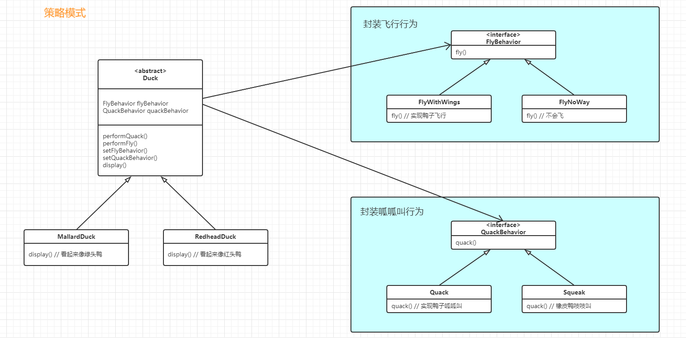

```java
// 抽象类
// 有已经实现的方法 + 抽象未实现的方法 + 经常变化的代码用接口来处理 + 利用多态更改接口的值
public abstract class Duck{
    //抽取出经常变化的代码，用接口去实现它。面向接口编程
    FlyBehavior flyBehavior;
    QuackBehavior quackBehavior;
    
    //因为这个类是抽象类。不同的子类有不同的实现
	public abstract void display();
    
    //经常变化的代码。委托给对象类实现
    public void performFly(){
        flyBehavior.fly();
    }
    public void performQuack(){
        quackBehavior.quack();
    }
    
    //不经常变化的代码
    public void swim(){
        System.out.println("All ducks float, even decoys!");
    }
    
    //因为采用的是多态，所以我们可以动态的修改行为！
    //策略模式能切换的关键
    public void setFlyBehavior(FlyBehavior fb){
        flyBehavior = fb;
    }
    public void setQuackBehavior(QuackBehavior qb){
        quackBehavior = qb;
    }
}
```

```java
//行为接口，所有的飞行类行为类必须实现接口
public interface FlyBehavior{
    public void fly();
}

//飞行行为的实现，给真的会飞的鸭子使用
public class FlyWithWings implements FlyBehavior{
    public void fly{
        System.out.println("I'm flying!");
    }
}
//飞行行为的实现，给不会飞的鸭子使用
public class FlyNoWay implements FlyBehavior{
    public void fly(){
        System.out.println("I can't fly");
    }
}
//我想用火箭去飞
public class FlyRocketPowerd implements FlyBehavior{
    public void fly(){
        System.out.println("I'm flying with a rocket!");
    }
}
```

```java
//行为接口,所有的叫声必须实现这个接口
public interface QuackBehavior{
    public void quack();
}
//呱呱叫
public class Quack implements QuackBehavior{
    public void quack(){
        System.out.println("Quack");
    }
}
//不会叫
public class MuteQuack implements QuackBehavior{
    public void quack(){
        System.out.println("<Silence>");
    }
}
//吱吱叫
public class Squeak implements QuackBehavior{
    public void quack(){
        System.out.println("Squeak");
    }
}
```

```java
//具体的鸭子
public class MallardDuck extends Duck{
    public MallardDuck(){
        //在构造方法中创建具体的对象。
        //但是，我们说面向接口编程，这里仍然是有可以优化的地方
        quackBehavior = new Quack();
        flyBehavoir = new FlyWithWings();
    }
    
    //抽象方法，必须重写。其他的方法，可以直接使用父类的
    public void display(){
        System.out.println("I'm a real Mallard duck");
    }
}
```

```java
// main方法
public class MiniDuckSimulator{
    public static void main(String[] args){
        Duck mallard = new MallardDuck();
        mallard.performQuack();
        
        //改变行为
        Duck changeDuck = new MallardDuck();
        changeDuck.performFly();
        changeDuck.setFlyBehavior(new FlyRocketPowered());
        changeDuck.performFly();
    }
}
```


## 观察者模式


此系统中有三个部分是`气象站`（获取实际气象数据的物理装置）、`weatherData对象`（当气象站数据`一改变`的时候，根据气象站的数据，更新布告板）和`布告板`（显示目前天气给用户看）


当气象站数据变化的时候，weatherData就会自动执行measurementsChanged()方法。

如果说把更新气象站的数据写到measurementsChanged()方法中，那如果说要随时随地删除增加布告板，那么就不方便。

因为气象站和weatherData耦合在了一起。


观察者模式类似于订阅号、微信公众号、微博、报纸和杂志的订阅、猎头和他的程序员名单


主题对象管理某些数据

当主题内的数据变化，就会通知观察者

观察者已经订阅主题以便在主题数据改变时能够收到更新。


观察者模式定义了对象之间的`一对多`依赖，这样一来，`当一个对象改变状态时`，它的`所有依赖者都会收到通知并自动更新`。


实现观察者模式的方法不止一种，但是以包含`Subject与Observer接口`的类设计的做法是最常见的。


并不一定以现实中的情形去做，现实中的情形是为了帮助我们建模，理解。

当数据改变时，主题通知观察者去做改变。其实是主题遍历自己的数据，然后调用观察者的方法。

当要成为观察者的时候，并不用告诉主题怎么做，仅仅是在观察者的内部调用主题的add方法。

这么做，是为了将观察者和主题解耦。不是主题变化，就直接代码告诉所有的观察者，这样子不利于添加删除观察者。

```java
//主题接口，提供通用方法
public interface Subject{
    //注册观察者、移除观察者、通知观察者
    public void registerObserver(Observer o);
    public void removeObserver(Observer o);
    public void notifyObservers();
}

//观察者接口，提供通用方法
public interface Observer{
    //当主题的数据改变时（温度、湿度、压力），观察者做的改变
    public void update(float temp, float humidity, float pressure);
}

//布告板需要显示时，需要调用此方法
public interface DisplayElement{
    public void display();
}

public class WeatherData implements Subject{
    private ArrayList observers;
    //温度
    private float temperature;
    //湿度
    private float humidity;
    //压力
    private float pressure;
    
    //构造函数
    public WeatherData(){
        observers = new ArrayList();
    }
    
    public void registerObserver(Observer o){
        observers.add(o);
    }
    public void removeObserver(Observer o){
        int i = observers.index(o);
        if (i >= 0){
            observers.remove(i);
        }
    }
    public void notifyObservers(){
        for (int i = 0; i < observers.size(); i++){
            observer observer = (Observer) observers.get(i);
            observer.update(temperature, humidity, pressure);
        }
    }
    public void measurementChanged(){
        notifyObservers();
    }
    public void setMeasurements(float temperature, float humidity, flaot pressure){
        this.temperature = temperature;
        this.humidity = humidity;
        this.pressure = pressure;
        measurementsChanged();
    }
}

public class CurrentConditionsDisplay implements Observer, DisplayElement{
    private float temperature;
    private float humidity;
    private float weatherData;
    
    public CurrentConditionsDisplay(Subject weatherData){
        this.weatherData = weatherData;
        weatherData.registerObserver(this);
    }
    
    public void update(float tempertature, float humidity, float pressure){
        this.tmeperature = temperature;
        this.humidity = humidity;
        display();
    }
    
    public void display(){
        System.out.println("Current conditions:" + ·····)
    }
}


public class WeathersStation{
    public static void main(String[] args){
        WeatherData weatherData = new WeatherData();
        
        CurrentConditionsDisplay currentDisplay = new CurrentConditionsDisplay(weatherData);
        weatherData.setMeasurements(80, 65, 30.4f);
    }
}
```


解耦：

主题把数据发给观察者。  --> 将数据发给自己的ArrayList【把数据存成自己使用了】

观察者主题  ---> 自己有观察者的数据，调用观察者的add()方法


Java API有内置的观察者模式：Observer接口和Observable接口【观察者接口和“可观察者接口”】

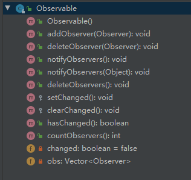

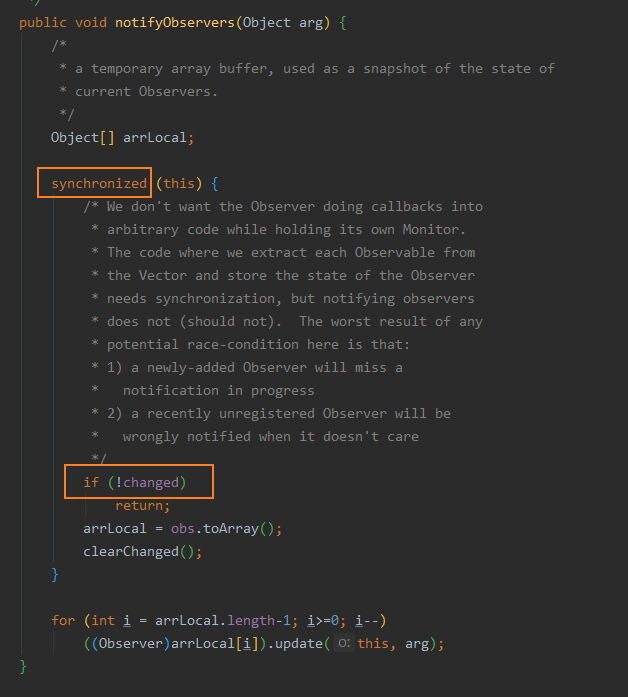

如何把对象变成观察者？

实现观察者接口java.util.Observer，然后就能调用任何Observable对象的addObserver()方法。不想再当观察者时，调用deleteObserver()方法就可以


```java
import java.util.Observable;
import java.util.Observer;

//继承“可观察者对象”
//“可观察者对象”就是我们上面用到的主题
public class WeatherData extends Observable {
    
    //我们不需要再使用ArrayList添加观察者了，也不需要管理注册和删除观察者了（Observable已经帮我们做好了），所以我们把管理注册和删除观察者的代码给删了

    private float temperature;
    private float humidity;
    private float pressure;

    //我们的构造器不再需要使用ArrayList了
    public WeatherData(){}

    //通知观察者们
    public void measurementsChanged(){
        //★必须在调用notifyObservers()前调用setChanged()，可以看一下上面截图出来的代码，if(!change) return;
        setChanged();
        //这里采取的方式是“拉”
        notifyObservers();
    }

    //自己模拟数据改变
    public void setMeasurements(float temperature, float humidity, float pressure){
        this.temperature = temperature;
        this.humidity = humidity;
        this.pressure = pressure;
        measurementsChanged();
    }

    //因为采取的“拉”，所以“拉取”的数据就是通过get方法
    public float getTemperature() {
        return temperature;
    }

    public float getHumidity() {
        return humidity;
    }

    public float getPressure() {
        return pressure;
    }
}
```

```java
//继承观察者接口
class CurrentConditionsDisplay implements Observer{

    //“可观察者对象”，即主题对象
    Observable observable;
    private float temperature;
    private float humidity;

    //向观察者添加自己
    public CurrentConditionsDisplay(Observable observable){
        this.observable = observable;
        observable.addObserver(this);
    }

    //所谓的拉，只是自己主动调用get方法
    //推，就会“可观察者对象”将推的内容放在arg中
    @Override
    public void update(Observable o, Object arg) {
        if (o instanceof WeatherData){
            WeatherData weatherData = (WeatherData)o;
            this.temperature = weatherData.getTemperature();
            this.humidity = weatherData.getHumidity();
            display();
        }
    }

    private void display() {
        System.out.println(temperature + ":" + humidity);
    }
}

```


这里，仍然要注意一下，Observable是一个"类"而不是一个“接口”。这样子就限制了Observable的使用和复用，比如说，如果一个类想要同时继承Observable类和另一个超类的行为，就会陷入两难。


如果你不想使用Observable，你可以自己实现一个Observable接口。


观察者模式在很多地方用到了，比如JavaBeans和Swing中。


要点：

1. 观察者模式定义了对象之间一对多的关系
2. 主题（也就是可观察者）用一个公共的接口来更新观察者(update())
3. 观察者和可观察者之间用松耦合方式结合（loosecoupling），可观察者不知道观察者的细节，只知道观察者实现了观察者接口


## 装饰模式


给爱用继承的人一个全新的设计眼界。


`以对象组合的方式，做到在运行时装饰类。`

`一旦熟悉了装饰技巧，能够在不修改底层代码的情况下，给对象赋予新的职责`


继承威力强大，但是它并不能总是能够实现最好的设计。

不通过继承，如何达到复用呢？利用组合和委托。

`继承在设计子类的时候，是在编译时静态决定的`。而且所有的子类都会继承到相同的行为。然而，如果能够利用组合的做法拓展对象的行为，就可以在运行时`动态的进行拓展`。

可以利用这个技巧把多个职责，甚至是设计超类时还没想到的职责加在对象上。而且，可以不用修改原来的代码。通过组合对象，可以写新的代码添加新的功能，而无需修改现有的代码。

代码应该如同晚霞的莲花一样的关闭（`免于改变`），如同晨曦的莲花一样地开放（`能够拓展`）


我们的目标是允许`类容易拓展`，在`不修改现有代码的情况下`，就可以搭配新的行为。


我如何让设计的每个部分都遵循开放-关闭原则？

我们实在没有闲工夫把设计的每个部分都这么设计（而且，就算做得到，这也是一种浪费）。遵循开放-关闭原则，通常会引入新的抽象层次，增加代码的复杂度。你需要把注意力集中在设计中最优可能改变的地方，然后运用开放=关闭原则。


> 把装饰者对象当成一个”包装者“

1. 装饰者和被装饰者对象有相同的超类型
2. 你可以用一个或多个装饰者包装一个对象            
3. 装饰者可以在所委托被装饰者的行为之前/或之后，加上自己的行为，以达到特殊的目的

装饰者模式：动态地将责任附加到对象之上。若要拓展功能，装饰者提供了比继承更有弹性的替代方案。


装饰者也是继承于超类。虽然用到了继承，但是这么做的重点在于，装饰者和被装饰者必须是一样的类型，也就是有共同的超类，这是相当关键的地方。在这里，我们利用继承达到了”类型匹配“，而不是用继承获得”行为“。

当我们将装饰者与组件组合时，就是在加入新的行为。所得到的新行为，并不是继承自超类，而是由组合对象得来的。

继承Beverage抽象类，是为了有正确的类型，而不是继承他的行为。行为来自装饰者和基础组件，或与其他装饰者之间的组合关系。

如果依赖继承，那么类的行为只能在编译时静态决定。

装饰者模式通常采用抽象类，但是在Java中可以使用接口。


```java
public abstract class Beverage {
    String description = "Unknown Beverage";

    public String getDescription() {
        return description;
    }

    public abstract double cost();
}

//浓缩咖啡
class Espresso extends Beverage {
    // 这是是使用父类的description，而不是子类自己定义一个description。
    //这是因为多态是针对“方法”的多态，属性并没有多态
    public Espresso() {
        description = "Espresso";
    }

    @Override
    public double cost() {
        return 1.99;
    }
}

// 综合咖啡
class HouseBlead extends Beverage {
    public HouseBlead() {
        description = "House Blead Coffee";
    }

    @Override
    public double cost() {
        return .89;
    }
}

```


```java
// 调料装饰
// 继承Beverage必须重写cost()
// 继承CondimentDecorator还必须重写getDescription()
abstract class CondimentDecorator extends Beverage {
    @Override
    public abstract String getDescription();
}

// 摩卡调料，装饰类的具体实现
class Mocha extends CondimentDecorator {

    Beverage beverage;

    public Mocha(Beverage beverage) {
        this.beverage = beverage;
    }

    //委托
    @Override
    public double cost() {
        return .20 + beverage.cost();
    }

    //委托
    @Override
    public String getDescription() {
        return beverage.getDescription() + ", Mocha";
    }
}

//豆浆调料，装饰类的具体实现
class Soy extends CondimentDecorator {
    Beverage beverage;

    public Soy(Beverage beverage) {
        this.beverage = beverage;
    }

    @Override
    public double cost() {
        return .15 + beverage.cost();
    }

    @Override
    public String getDescription() {
        return beverage.getDescription() + ", Soy";
    }
}

// 奶泡调料，装饰类的具体实现
class Whip extends CondimentDecorator {
    Beverage beverage;

    public Whip(Beverage beverage) {
        this.beverage = beverage;
    }

    @Override
    public double cost() {
        return .10 + beverage.cost();
    }

    @Override
    public String getDescription() {
        return beverage.getDescription() + ", whip";
    }
}

```

```java
class StarbuzzCoffee {
    public static void main(String[] args) {
        Beverage beverage = new Espresso();
        System.out.println(beverage.getDescription() + " $" + beverage.cost());

        Beverage beverage2 = new HouseBlead();
        beverage2 = new Soy(beverage2);
        beverage2 = new Mocha(beverage2);
        beverage2 = new Mocha(beverage2);
        beverage2 = new Whip(beverage2);
        System.out.println(beverage2.getDescription() + " $" + beverage2.cost());
    }
}


/*
Espresso $1.99
//委托也是一种递归
House Blead Coffee, Soy, Mocha, Mocha, whip $1.54
*/
```


## 工厂模式


### 1. 代码和UML图

通过不同的条件，使用new 创建不同的对象

虽然我是针对接口编程，但是并没有 对修改关闭。如果说，我频繁的要增加删除实例类，那么就要修改原来的代码。

所以这样子其实是不好的。


我们从设计原则找线索：找出变化的部分，把他们从不变的部分分离出来


把创建对象的细节交给工厂。【我就可以在很多个地方使用这个工厂，去创建我想要的东西】

静态工厂，利用静态方法创建一个工厂。


简单工厂模式：

```java
// 创建pizza的工厂，它只做了一件事，帮它的客户创建pizza
public class SimplePizzaFactory{
    public Pizza createPizza(String type){
        Pizza pizza = null;
        
        if (type.equals("cheese")) {
            pizza = new CheesePizza();
        } else if (type.equals("pepperoni")) {
            pizza = new PepperoniPizza();
        } else if (type.equals("clam")) {
            pizza = new ClamPizza();
        } else if (type.equals("veggie")) {
            pizza = new VeggiePizza();
        }
        return pizza;
    }
}

// 披萨店
public class PizzaStore() {
    SimplePizzaFactory factory;
    
    // 创建PizzaStore的时候，需要知道 由哪个Pizza工厂创建Pizza
    public PizzaStore(SimplePizzaFactory factory) {
        this.factory = factory
    }
    
    public Pizza orderPizza(String type) {
        Pizza pizza;
        // 由工厂创建Pizza
        // 我们把 new 操作符替换成 工厂对象 的创建方法。这里不再使用具体实例化。
        pizza = factory.createPizza(type);
        
        pizza.prepare();
        pizza.back();
        pizza.cut();
        pizza.box();
        return pizza;
    }
}

public static void main(String[] args){
	// 先创建一个工厂
    SimplePizzaFactory factory = new SimplePizzaFactory();
    // 创建Pizza店, 将工厂作为参数传给Pizza店
    PizzaStore store = new PizzaStore(facotory);
    // Pizza店创建 Pizza
    store.orederPizza("cheese");
}
```

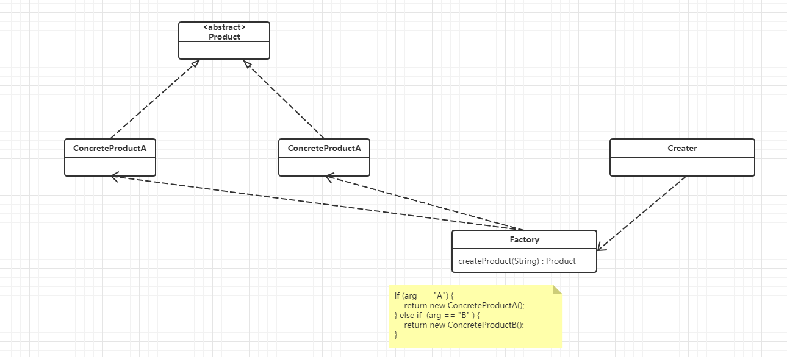


---


如果说，Pizza店想要开加盟店，不同地区的加盟店有自己特色的Pizza。

这个时候的工厂模式可以这么用：`原本是由一个对象（工厂对象）负责所有具体类的实例化，现在通过对PizzaStore做一些小转变，变成由一群子类来负责实例化。`

`工厂模式用来处理对象的创建，并将这样的行为封装在子类中，`。这样，客户程序中关于超类的代码就和子类对象创建代码解耦了。

```java
// 工厂
public abstract class PizzaStore(){
    public Pizza orderPizza(String type) {
        Pizza pizza;
        
        // 现在createPizza()从工厂对象中移回PizzaStore。
        // createPizza（type） 是本类的一个方法
        pizza = createPizza(type);
        
        pizza.prepare();
        pizza.bake();
        pizza.cut();
        pizza.box();
        
        return pizza;
    }
    
    // 工厂方法
    // abstract：工厂方法是抽象的，所以依赖子类来处理对象的创建
    // Pizza(Product)：工厂方法必须返回一个产品。超类中定义的方法，通常使用到工厂方法的返回值
    // createMethod(factoryMethod)：工厂方法将客户（也就是超类中的代码，例如orderPizza()）和 实际创建具体产品的代码 分隔开来。
    protected abstract Pizza createPizza(String type);
}
```

```java
// 纽约风味的Pizza 工厂
public class NYPPizzaStore extends PizzaStore {
    @Override
    protected Pizza createPizza(String item) {
        if (item.equals("chess")) {
            return new NYStyleCheesePizza();
        } else if (item.equals("veggie")) {
            return new NYStyleVeggiePizza();
        } else return null;
    }
}
```

```java
// 别忘了，还有Pizza本身
public abstract class Pizza {
    String name;
    String dough;
    String sauce;
    ArrayList topping = new ArrayList();
    
    void prepare(){
        System.out.println("Prepareing" + name + "\nTossin dough.." + "\nAdding sauce.." + "\nAdding toppings:");
        for (int i = 0;i < toppings.size(); i++) {
            System.out.println(toppings.get(i));
        }
    }
    void bake() {
        
    }
    void cut(){
        
    }
    void box(){
        
    }
    public String getName(){
        
    }
}

// 纽约风味的披萨
public class NYStyleCheesePizza extends Pizza {
    public NYStyleCheesePizza(){
        name = "NY Style Sauce and Cheese Pizza";
        dough = "Thin Crust Dough";
        sause = "Marinara Sauce";
        
        toppings.add("Grated Reggiano Cheese");
    }
}
```


```java
public static void main(String[] args) {
    PizzaStore nyPizzaStore = new NYPizzaStore();
    Pizza pizza = nyStore.orderPizza("cheese");
    System.out.println("Ethan ordered a " + pizza.getName() + "\n");
}
```


工厂方法模式：定义了`一个创建对象的接口`，但由`子类决定要实例化的类是哪一个`。工厂方法让类把实例化推迟到子类。

工厂方法模式能够`封装具体类型的实例化`。


如下图：

抽象的Creator提供了一个创建对象的方法的接口，也称为”`工厂方法`“。 在抽象的Creator中，任何其他实现的方法，都可能使用到这个工厂方法所制造出来的产品。但是只有子类真正实现这个工厂方法并创建产品。

工厂模式能够帮助我们将产品的 ”实现“ 从 ”使用“ 中解耦。如果增加产品或者改变产品的实现，Creater 并不会受到影响。（因为Creater与任何ConcreteProduct 之间都不是紧耦合的）

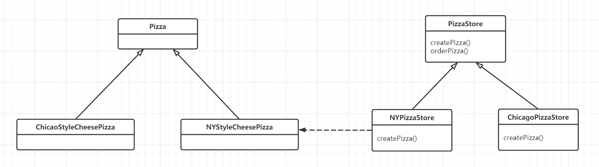

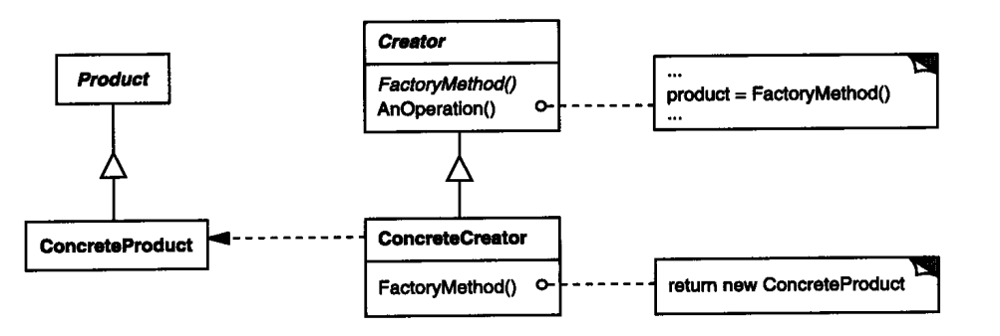


简单工厂和工厂方法之间的差异？它们看起来很像，差别在于，在工厂方法中，返回比萨的类是子类？

子类的确看起来很像简单工厂。`简单工厂把全部的事情，在一个地方处理完了，然而工厂方法却是创建一个框架，让子类决定要如何实现`。

简单工厂的做法，可以将对象的创建封装起来，但是简单工厂`不具备工厂方法的弹性，因为简单工厂不能变更正在创建的产品`。


#### 依赖倒置原则

代码里减少对于具体类的依赖是件好事，这个原则有一个响亮而正式的名称：”依赖倒置原则“。


设计原则：`要依赖抽象，不要依赖具体类`。这个原则说明了，不能让高层组件依赖低层组件，而且，不管高层还是低层组件，”两者“都应该依赖于抽象。

所谓的”高层“组件，是由其他低层组件定义行为的类。例如，PizzaStore是一个高层组件，因为它的行为是由比萨定义的：PizzaStore创建不同的比萨对象，准备，烘烤，切片，装盒；而披萨本身属于低层组件。


PizzaStore是”高层组件“，而披萨实现的是”底层组件“。我们的代码PizzaStore应该依赖于抽象类（Pizza类），而不能是具体的实例类（NYPizzaStore类）。

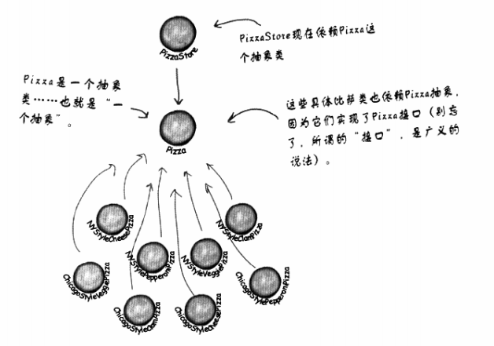


几个指导方针帮助你遵循依赖倒置原则：

1. 变量不可持有具体类的引用。如果使用new，就会持有具体具体类的引用。你可以改用工厂来避开这样的做法。
2. 不要让类派生具体类（应该让具体类继承于抽象类/接口）。如果派生`自`具体类，你就会依赖具体类。请派生自一个抽象（接口或抽象类）
3. 不要覆盖基类（父类）中已实现的方法。如果覆盖基类已实现的方法，那么你的基类就不是一个真正适合被继承的抽象。基类中已实现的方法，应该由所有的子类共享。


但是如果完全遵循这样子的原则，一个简单的程序都要写的很复杂！。所以`我们应该尽量达到这个原则，而不是随时随地要遵循这个原则`。


---


这个时候，为了确保每家加盟店使用的原料都是统一的。你打算建造一家生产原料的工厂，并将原料运送到各加盟店。


开始为工厂定义一个接口，这个接口负责创建所有的原料

```java
// 原料工厂
public interface PizzaIngredientFactory(){
    // 生面团
    public Dough createDough();
    // 酱汁
    public Sauce createSauce();
    // 奶酪
    public Cheese createCheese();
    // 蔬菜
    public Veggies[] createVeggies();
    // 意大利香肠
    public Pepperoni createPepperoni();
    // 蛤
    public Clams createClam();
}
```

接下来要为每个区域创建一个工厂。

来自纽约的原料工厂

```java
// 具体原料工厂必须实现PizzaIngredientFactory这个接口，纽约工厂也不例外
public class NYPizzaIngredientFactory implements PizzaIngredientFactory {
    public Dough createDough() {
        // 薄皮面团
        return new ThinCrustDough();
    }
    
    public Sauce createSauce() {
        // 意大利酱
        return new MarinaraSauce();
    }
    
    public Cheese createCheese() {
        // 雷吉亚诺奶酪
        return new ReggianoCheese();
    }
    
    public Veggies[] createVeggies() {
        // 大蒜， 洋葱， 蘑菇， 红辣椒
        Veggies veggies[] = {new Garlic(), new Onion(), new Mushroom(), new ReadPepper()};
        return veggies;
    }
    
    public Pepperoni createPepperoni() {
        // 切片的意大利香肠
        return new SlicedPepperoni();
    }
    
    public Clams createClam() {
        // 鲜蛤
        return new FreshClams();
    }
}
```

重做披萨，好让它们只使用工厂生产出来的原料。我们从抽象的Pizza开始

```java
public abstract class Pizza() {
    // 每个Pizza都会持有一组在准备时会用到的原料
    String name;
    Dough dough;
    Sauce sauce;
    Veggies veggies[];
    Cheese cheese;
    Pepperoni pepperoni;
    Clams clam;
    
    // 现在把prepare() 方法声明成抽象。在这个方法中，我们需要收集披萨所需的原料，而这些原料当然来自原料工厂
    abstract void prepare();
    
    void bake() {
        System.out.println("Bake for 25 minutes at 350");
    }
    
    void cut() {
        System.out.println("Cutting the pizza into diagonal slices");
    }
    
    void box() {
        System.out.println("Place pizza in oficial PizzaStore box");
    }
    
    void setName(String name) {
        this.name = name;
    }
    
    String getName() {
        return name;
    }
}
```


```java
public class CheesePizza extends Pizza {
    // 要制作比萨，需要工厂提供原料。所以每个披萨类都需要从构造器参数中得到一个工厂，并把这个工厂存储到一个实例变量中
    PizzaIngredientFactory ingredientFactory();
    
    public CheesePizza(PizzaIngredientFatory ingredientFactory) {
        this.ingredientFatory = ingredientFactory;
    }
    
    void prepare() {
        System.out.println("Preparing" + name);
        // 需要的原料，都是跟工厂要
        dough = ingredientFactory.createDough();
        sauce = ingredientFactory.createSause();
        cheese = ingredientFactory.createCheese();
    }
}
```


Pizza的代码利用相关的工厂生产原料。`所生产的原料依赖所使用的工厂`，Pizza类根本不关心这些原料，它只知道如何制作披萨。现在，Pizza和区域原料之间被解耦，无论原料工厂是在落基山脉还是在西北地区，Pizza类都可以轻易地复用，完全没有问题。


回到Pizza店

```java
public class NYPizzaStore extends PizzaStore {
    protected Pizza createPizza(String item) {
        Pizza pizza = null;
        PizzaIngredientFactory ingredientFactory = new NYPizzaIngredientFactory();
    }
    
    if (item.equals("cheese")) {
        pizza = new CheesePizza(ingredientFactory);
        pizza.setName("New York Style Cheese Pizza");
    } else if (item.equals("veggie")) {
        pizza = new VeggiePizza(ingredientFactory);
        pizza.setName("New York Style Veggie Pizza");
    } else if (item.equals("clam")) {
        pizza = new ClamPizza(ingredientFactory);
        pizza.setName("New York Style Clam Pizza");
    } else if (item.equals("pepperoni")) {
        pizza = new PepperoniPizza(ingredientFactory);
        pizza.setName("New York Style Pepperoni Pizza");
    }
    return pizza;
}
```

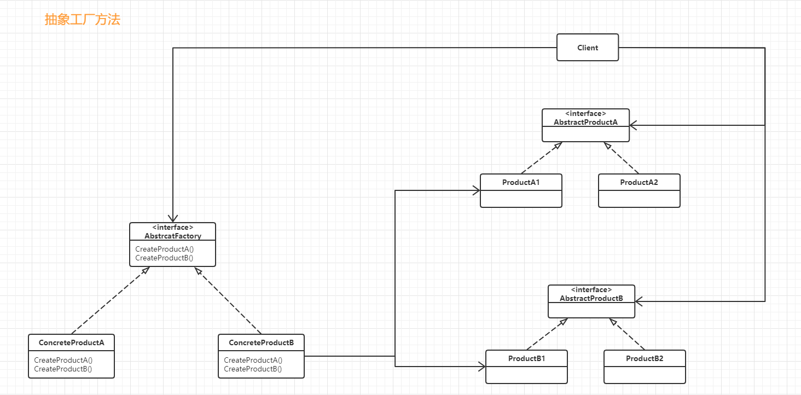


一连串地的代码改变，我们做了什么？

我们引入了新类型的工厂，也就是所谓的抽象工厂，来创建披萨原料家族。

通过抽象工厂所提供的接口，可以创建产品的家族，利用这个接口数写代码，我们的代码从实际工厂中解耦，以便在不同的上下文实现各式各样的工厂。


抽象工厂：这个模式可以创建产品的家族。

抽象工厂模式，提供一个接口，用于创建相关或依赖对象的家族，而不需熬明确指定具体类。


抽象工厂允许客户使用抽象的接口来创建一组相关的产品，而不需要知道（或关心）实际产出的具体产品是什么。这样一来，客户就从具体的产品中被解耦。


---


全部组合起来

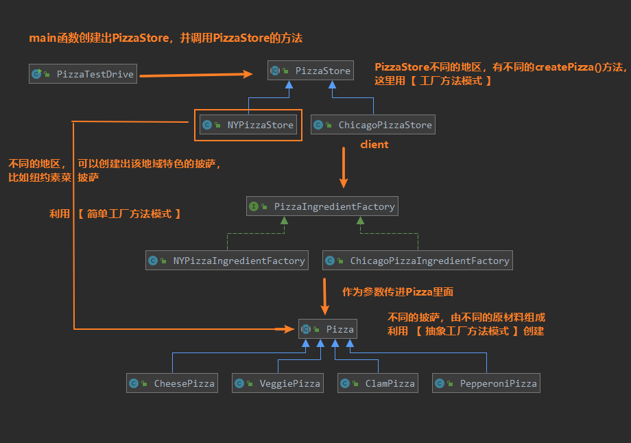

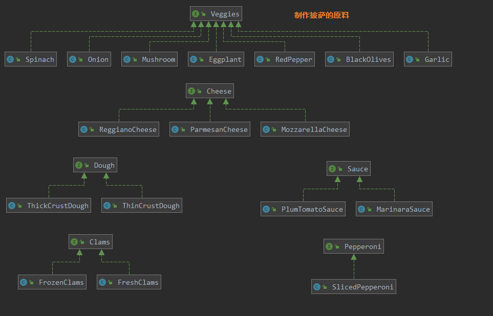

我们可以看到，继承自PizzaStore的NYPizzaStore 和 ChicagoPizzaStore 是大心脏。

根据地域不同，继承自 PizzaStore， 采用了工厂方法模式。

要创建不同的披萨，采用了工厂方法模式（类似于简单工厂方法模式）

要创建具体的披萨，必须使用抽象工厂方法模式，所以NYPizzaStore 和 ChicagoPizzaStore 中也含有 PizzaIngredientFactore属性。


我们再来回顾一下大心脏 NYPizaStore 的写法

```java
public class NYPizzaStore extends PizzaStore {

	// 工厂方法模式
	@Override
	protected Pizza createPizza(String item) {
		Pizza pizza = null;
		PizzaIngredientFactory ingredientFactory = 
			new NYPizzaIngredientFactory();
 
		if (item.equals("cheese")) {
  
			// 将工厂参数传进去，利用 抽象工厂模式 创建披萨
			pizza = new CheesePizza(ingredientFactory);
			pizza.setName("New York Style Cheese Pizza");
  
		} else if (item.equals("veggie")) {
 
			pizza = new VeggiePizza(ingredientFactory);
			pizza.setName("New York Style Veggie Pizza");
 
		} else if (item.equals("clam")) {
 
			pizza = new ClamPizza(ingredientFactory);
			pizza.setName("New York Style Clam Pizza");
 
		} else if (item.equals("pepperoni")) {

			pizza = new PepperoniPizza(ingredientFactory);
			pizza.setName("New York Style Pepperoni Pizza");
 
		} 
		return pizza;
	}
}
```


---

工厂方法：可以把客户的代码从需要实例化的具体类中解耦。或者如何你目前还不知道将来需要实例化哪些具体类时，也可以用工厂方法。使用方式很简单，只要继承父类，并实现父类的工厂方法就可以

抽象工厂：当需要创建产品家族和想让制造的相关产品集合起来时，可以使用抽象工厂。


## 命令模式


### 1. 代码和UML图

让所有的命令对象实现相同的包含一个方法的接口。

```java
public interface Command {
    public void execute();
}
```


实现一个打开电灯的命令

```java
public class LightOnCommand implements Command {
    Light light;
    
    // 构造器。一旦调用这个execute()，就由这个电灯对象称为接收者，负责接收请求
    public LightOnCommand(Light light) {
        this.light = light;
    }
    // 这个 execute() 方法调用接收对象（我们正在控制的电灯）的 on() 方法
    public void execute() {
        light.on();
    }
}
```


使用命令对象

```java
public class SimpleRemoteControl {
    // 有一个插槽持有命令，而这个命令控制着一个装置。
    Command slot;
    
    public SimpleRemoteControl(){}
    
    public void setCommand(Command command) {
        slot = command;
    }
    
    public void buttonWasPressed(){
        slot.execute();
    }
}
```


测试，模拟命令模式的客户

```java
public class RemoteControlTest {
    public static void main(String[] args) {
        // 遥控器就是一个调用者，会传入一个命令对象，可以用来发出请求
        SimpleRemoteControl remote = new SimpleRemoteControl();
        // 现在创建了一个电灯对象，此对象也就是请求的接收者
        Light light = new Light();
        // 在这里创建一个命令，然后将接收者传给他
        LightCommand lightOn = new LightOnCommand(light);
        
        // 把命令传给调用者
        remote.setCommand(lightOn);
        // 摁下按钮
        remote.buttonWasPressed();
    }
}
```


命令模式：将“请求”封装成对象，以便使用不同的请求，队列或者日志来参数化其他对象。命令模式也可以支持撤销的操作。


实现遥控器

```java
public class RemoteControl {
    // 遥控器可以处理7个开与关的命令
    Command[] onCommands;
    Command[] offCommands;
    
    public RemoteControl() {
        onCommands = new Command[7];
        offCommands = new Command[7];
        
        Command noCommand = new NoCommand();
        for (int i = 0; i < 7; i++) {
            onCommands[i] = noCommand;
            offCommand[i] = noCommand;
        }
    }
    
    // setCommand()方法有3个参数，分别是插槽的位置，开的命令，关的命令。这些命令将记录在开关数组中对应的插槽位置，以供稍后使用
    public void setCommand(int slot, Command onCommand, Command offCommand) {
        onCommands[slot] = onCommand;
        offCommands[slot] = offCommand;
    }
    
    public void onButtonWasPushed(int slot) {
        onCommands[slot].execute();
    }
    
    public void offButtonWasPushed(int slot) {
        offCommand[slot].execute();
    }
}
```


NoCommand

```java
public class NoCommand implements Command {
    public void execute(){ }
}
```

NoCommand对象是一个空对象（null object）的例子。当你不想返回一个有意义的对象时，空对象就很有用。客户也可以将处理的null的责任转移给空对象。

举例来说，遥控器不可能一出厂就设置了有意义的命令对象，所以提供了NoCommand对象作为替代品，当用他的execute()方法时，这种对象什么事情都不做。

在许多设计模式中，都会看到空对象。甚至有时候，空对象本身也被视为是一种设计模式。


RemoteLoader， main()方法

```java
public class RemoteLoader {
 
	public static void main(String[] args) {
		RemoteControl remoteControl = new RemoteControl();
 
		Light livingRoomLight = new Light("Living Room");
		Light kitchenLight = new Light("Kitchen");
		CeilingFan ceilingFan= new CeilingFan("Living Room");
		GarageDoor garageDoor = new GarageDoor("");
		Stereo stereo = new Stereo("Living Room");
  
		LightOnCommand livingRoomLightOn = 
				new LightOnCommand(livingRoomLight);
		LightOffCommand livingRoomLightOff = 
				new LightOffCommand(livingRoomLight);
		LightOnCommand kitchenLightOn = 
				new LightOnCommand(kitchenLight);
		LightOffCommand kitchenLightOff = 
				new LightOffCommand(kitchenLight);
  
		CeilingFanOnCommand ceilingFanOn = 
				new CeilingFanOnCommand(ceilingFan);
		CeilingFanOffCommand ceilingFanOff = 
				new CeilingFanOffCommand(ceilingFan);
 
		GarageDoorUpCommand garageDoorUp =
				new GarageDoorUpCommand(garageDoor);
		GarageDoorDownCommand garageDoorDown =
				new GarageDoorDownCommand(garageDoor);
 
		StereoOnWithCDCommand stereoOnWithCD =
				new StereoOnWithCDCommand(stereo);
		StereoOffCommand  stereoOff =
				new StereoOffCommand(stereo);
 
		remoteControl.setCommand(0, livingRoomLightOn, livingRoomLightOff);
		remoteControl.setCommand(1, kitchenLightOn, kitchenLightOff);
		remoteControl.setCommand(2, ceilingFanOn, ceilingFanOff);
		remoteControl.setCommand(3, stereoOnWithCD, stereoOff);
  
		System.out.println(remoteControl);
 
		remoteControl.onButtonWasPushed(0);
		remoteControl.offButtonWasPushed(0);
		remoteControl.onButtonWasPushed(1);
		remoteControl.offButtonWasPushed(1);
		remoteControl.onButtonWasPushed(2);
		remoteControl.offButtonWasPushed(2);
		remoteControl.onButtonWasPushed(3);
		remoteControl.offButtonWasPushed(3);
	}
}
```

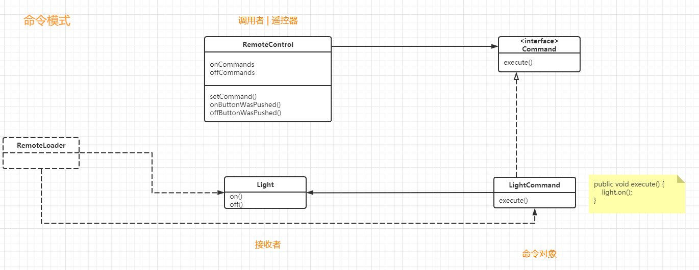


实现undo功能。

修改Command

```java
public interface Command {
    public void execute();
    // 添加 undo 方法
    public void undo();
}
```

修改LightOnCommand

```java
public class LightOnCommand implements Command {
    Light light;
    
    public LightOnCommand(Light light) {
        this.light = light;
    }
    
    public void execute() {
        light.on();
    }
    
 	// 在这里，undo() 把电灯打开！   
    public void undo() {
        light.off();
    }
}
```

遥控器需要保存上一条命令的状态。

```java
public class RemoteControlWithUndo {
    Commands[] onCommands;
    Commands[] offCommands;
    // 前一个命令将会被记录在这里
    Command undoCommand;
    
    public RemoteControlWithUndo() [
        onCommands = new Command[7];
        offCommands = new Command[7];
        
        Command noCommand = new NoCommand();
        for (int i = 0; i < 7; i++) {
            onCommands[i] = noCommand;
            offCommands[i] = noCommand;
        }
        // 初始化
        undoCommand = noCommmand;
    ]
        
    public void setCommand(int slot, Command onCommand, Command offCommand) {
        onCommands[slot] = onCommand;
        offCommands[slot] = offCommand;
    }
    
    public void onButtonWasPushed(int slot) {
		onCommands[slot].execute();
        // 记录下来
        undoCommand = onCommands[slot];
    }
    
    // 当摁下撤销按钮，调用 undoCommand 的 undo() 方法
    public void undoButtonWasPushed() {
        undoCommand.undo();
    }
}
```


控制器具有的Party模式

```java
public class MacroCommand implements Command {
    Command[] commands;
    
    public MacroCommand(Command[] commands) {
        this.commands = commands;
    }
    
    public void execute() {
        for (int i = 0; i < commands.length; i++) {
            comands[i].execute();
        }
    }
}
```

```java 
public static void main(String[] args) {
	Command[] partyOn = {lightOn, stereoOn, tvOn, hottubOn}   ;
    Command[] partyOff = {lightOff, stereoOff, tvOff, hottubOff};
    
    MacroCommand partyOnMacro = new MacroCommand(partyOn);
    MacroCommand partyOffMacro = new MacroCommand(partyOff);
}
```


如何实现多次撤销操作？

使用一个堆栈记录操作过程的每一个命令。

---


### 2. 要点

命令模式：命令模式允许我们`将动作封装成命令对象`，这样一来，就能够随心所欲地存储、传递和调用它们。

将请求封装成对象，这可以让你使用不同的请求、队列、或者是日志请求来参数化其他对象。命令模式也可以支持撤销操作。


要点：

1. 命令模式将 `发出请求的对象` 和 `执行请求的对象` 解耦
2. 在被解耦的两者之间是`通过命令对象进行沟通`的。命令对象封装一组接收者(Light)和一组动作(light.on(), light.off())
3. `调用`者通过调用`命令对象的 execute()`发出请求，这会使得`接收者`的动作被调用。
4. 调用者可以接收命令当作参数，甚至在运行时动态地进行。
5. 命令可以实现撤销，做法是实现一个undo()方法来回到execute() 被执行前地状态。
6. 宏命令是命令的一种简单地延伸，运行调用多个命令。
7. 实际操作中，很常见使用“聪明”命令对象，也就是说，命令对象直接实现了接收者的功能，这样子就不用将工作委托给接收者了。
8. 命令也可以用来实现日志和事务系统。


命令模式的实现，类似于回溯。


### 3. 应用场景

命令模式的主要作用和应用场景，是用来控制命令的执行，比如，异步、延迟、排队执行命令、撤销重做命令、存储命令、给命令记录日志的等等，`这才是命令模式独一无二的地方`。


我们在开发一款《天天酷跑》的手游。

这种游戏的复杂度主要集中在客户端。后端基本上只负责（比如积分、生命值、装备）的更新和查询，所以，后端逻辑相对于客户端来说，要简单很多。

一般来说，同一个游戏场景里的玩家，会被分配到同一台服务器上。这样，一个玩家拉去同一个游戏场景中其他玩家的信息，就不需要跨服务器查找了，实现起来就简单很多。

客户端和服务器之间一般采用长连接的方式来通信。通信的格式有多种，比如Protocol Buffer、JSON、XML，甚至可以自定义格式。不管什么格式，客户端发送给服务器的请求，一般包括两部分内容：`指令和数据`。其中，指令我们可以叫做事件，数据是执行这个执行所需的数据。


常见的一种实现思路是利用`多线程`。一个线程接收请求，接收到请求之后，启动一个新的线程来处理请求。具体点讲，一般是通过一个主线程来接收客户端发来的请求。每当接收到一个请求之后，就从一个专门用来处理请求的线程池中，捞出一个空闲线程来处理。


另一种实现思路是在`一个线程内`轮询接收请求和处理请求。这种处理方式不太常见。尽管无法利用多线程多核处理的优势，但是对于IO密集型的业务来说，它避免了多线程不停切换对性能的损耗，并且克服了多线程编程Bug比较难调试的缺点，也算是手游后端服务器开发中比较常见的架构模式了。


接下来重点讲一下第二种实现方式。


整个手游后端服务器轮询获取客户端发来的请求，获取到`请求`之后，借助命令模式，`把请求包含的数据和处理逻辑封装成命令对象`，并存储在内存队列中。然后，再从队列中取出一定数量的命令来执行。执行完成之后，再重新开始新一轮的轮询。


```java
public class GameApplication {
    private static final int MAX_HANDLED_REG_COUNT_PER_LOOP = 100;
    private Queue<Command> = new LinkedList<>();
    
    public void mainloop() {
        while(true) {
            List<Request> requests = new ArrayList<>();

            // 从 epoll 或者 select 中获取数据，并封装成 Request 的逻辑
            // 注意设置超时时间，如果很长时间没有接收到请求，就继续下面的逻辑处理

            for (Request request : requests) {
                Event event = request.getEvent();
                Command command = null;
                if (event.equals(Event.GOT_START)) {
                    command = new GotStartCommand(“数据”);
                } // 省略一堆 else if 

                queue.add(command);
            }
        }

        int handleCount = 0;
        while (handledCount < MAX_HANDLED_REG_COUNT_PER_LOOG) {
            if (queue.isEmpty()) {
                break;
            }
            Command command = queue.poll();
            command.execute();
        }
    }
}


```


## 自己的思考


如何解耦呢？OO原则

1. `封装变化`：将`经常改变的代码`提取出来，将这些方法放在`接口`里。为了防止`因为接口而导致的代码冗余`，用`类实现接口的方法`，此后，就可以`面向接口编程`，去调用类的方法。
2. 针对接口编程，不针对实现编程：实际意思是，针对`父类编程`，利用`反射`，可以很灵活，大大解耦。
3. 多用组合，少用继承。比如鸭子的行为不是继承来的，而是`和其他行为对象“组合”来的`
4. 为交互对象之间的松耦合设计而努力。怎么将两个对象进行解耦呢？比如在观察者模式中，“可观察者”对象里有“观察者”的列表，“可观察者”只需要调用update()就可以了，不用管有多少个观察者，观察者具体是什么。“观察者”里面有“可观察者”，“观察者”只需要调用“可观察者“的add方法就可以了，也不管”可观察者“是谁，怎么实现
5. 类应该能够扩展开放，对修改关闭


`策略模式`就是说，`在类中有接口对象`，然后调用`接口对象的方法`。利用`反射`，可以调用`不同的方法`，或者`改变接口的实例`（换一个对象），从而实现调用的方法改变。


观察者模式就是说，可观察者对象`先定义自己的方法`（增加、删除、通知观察者），观察者对象先定义自己的方法（收到通知时要怎么做）。【当然，上面的方法也是经常变化的，将这些变化的代码提取出来，放在接口里面】。

然后“可观察者对象”中有多个“观察者对象的实例”（ArrayList / Vector），当“可观察者想要“通知”观察者”的时候，就for循环，调用观察者的update()

“观察者”有“可观察者”对象，当自己想要注册的时候，就调用“可观察者”的add，想要删除的时候，就调用remove。

