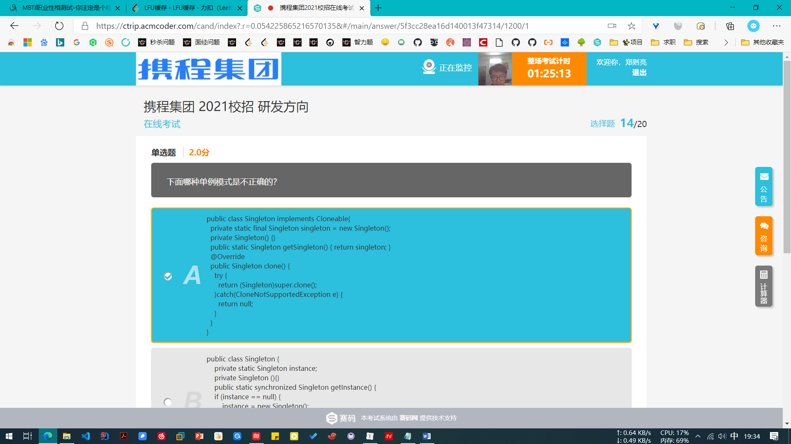
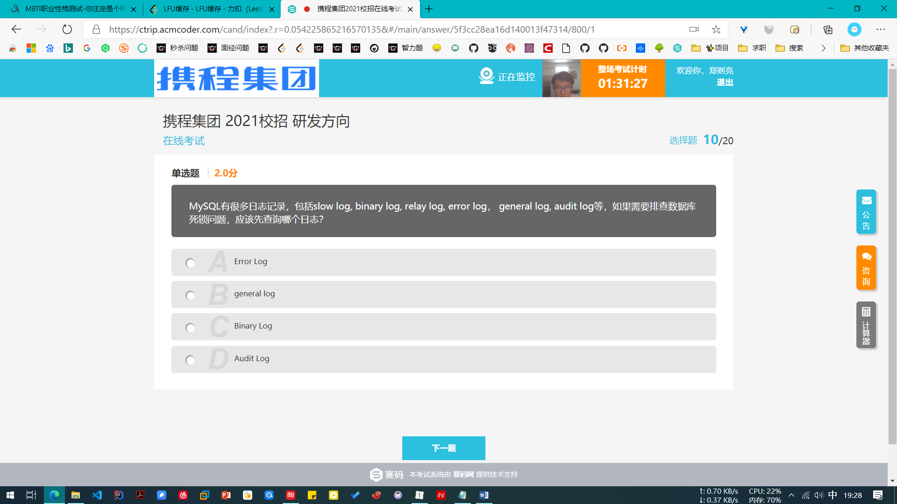
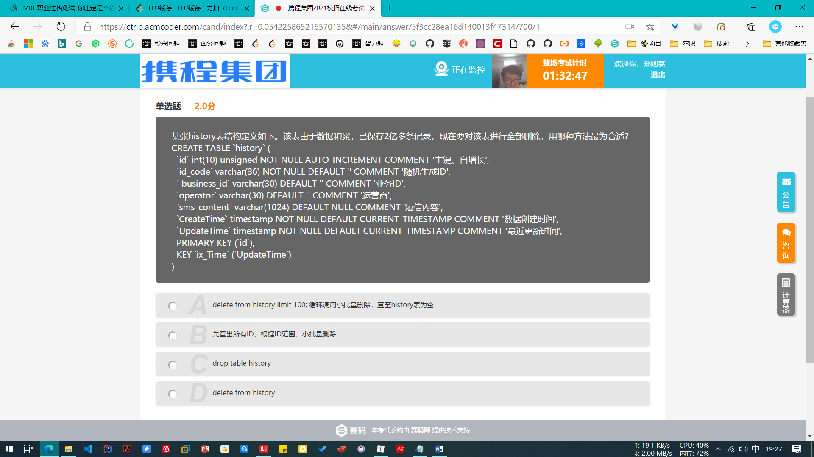
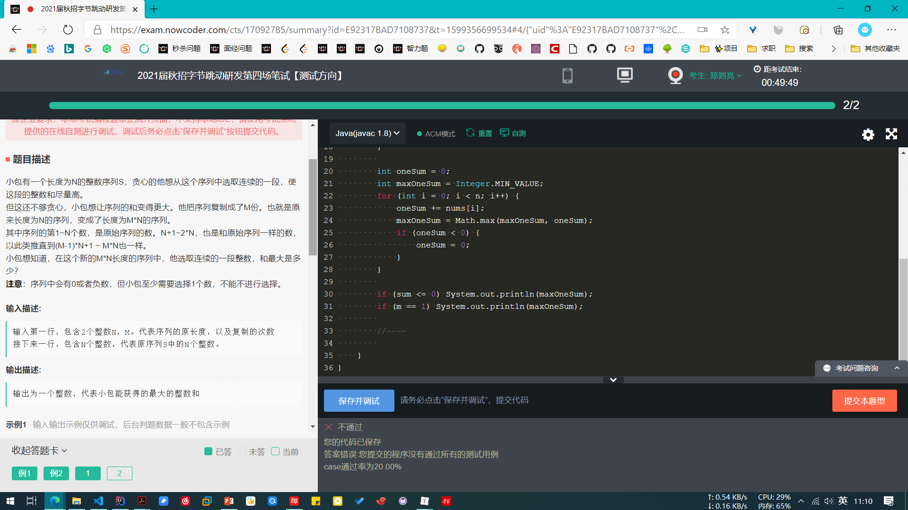
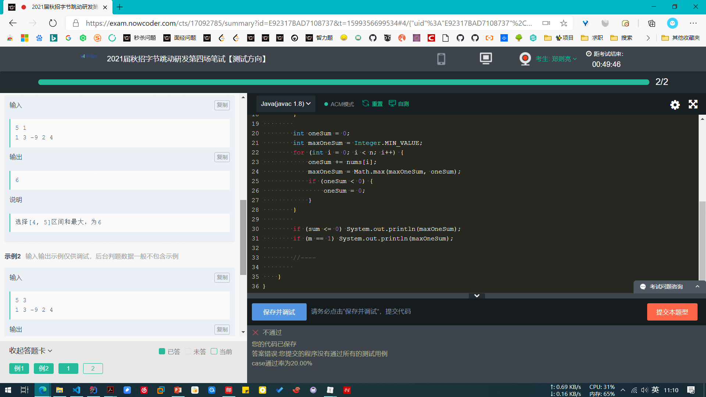
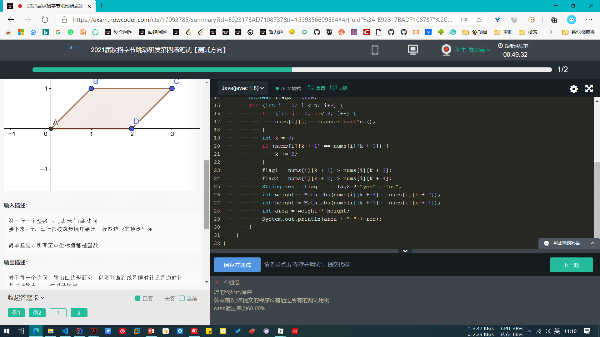
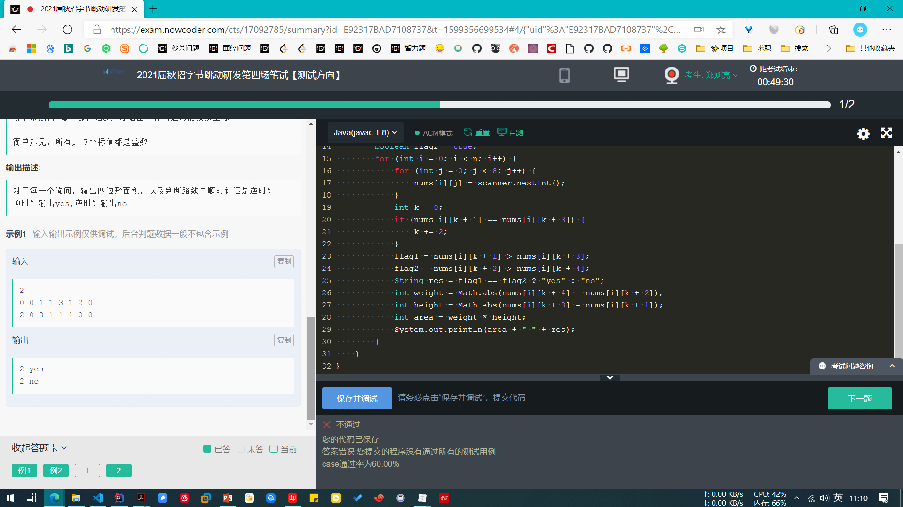

看看牛客的错题集


```java
interface inter {
    // 默认 public static final
    public static final int a = 1;

    // 可以 default, abstract，不能 public static final	
    default void getA() {
        System.out.println(a);
    }
}
```


创建大量动态代理（生成大量Class并加载） 可能会导致方法区溢出








### 神策数据

下面哪些是使用分治法的特征（  ）

A. 该问题可以分解为若干个规模较小的相同问题
B. 子问题的解可以合并为该问题的解
C. 子问题必须是一样的
D. 子问题之间不包含公共的子问题

> 正确答案：A B D


---


>A：Windows使用 ipconfig 获取 MAC地址； Linux使用 ifconfg 获取 MAC地
>
>选择 C D

---


### 练习

---


-1的二进制表示 1111 1111

-2的二进制表示 1111 1110

`~` 取反， ~1 = -2

---


设计文件系统时应尽量减少访问磁盘的次数,以提高文件系统的性能.下列各种措施中,哪些可以减少磁盘服务时间？

- 块高速缓存
- 磁盘驱动调度
- 目录项分解法
- 异步I/O技术

>  正确答案: A B C 
>
> A：利用缓存，直接不访问磁盘
>
> B：减少没有意义的访问
>
> C：将目录做好
>
> https://www.nowcoder.com/test/question/done?tid=35999324&qid=36741#summary

---


管道通信以 `自然字符流` 进行写入和读出，注意，不是 `文件`

> 管道是指用于`连接`一个读进程和一个写进程以实现进程之间通信的一种`共享文件`。向管道提供输入的是发送进程，也称为 写进程，负责向管道输入数据，`数据的格式是字符流`。接受管道 数据的接受进程为读进程。

---


直接,间接,立即三种寻址方式指令的执行速度,由快至慢的排序是____

> 立即寻址就是指令当中自带数据，直接读取，最快；
>
> 直接寻址就是指令中存放的是地址，直接解析这个地址；
>
> 间接寻址就只指令中存放的是地址的地址，或者是存放地址的寄存器，最慢。

---


关于域名和IP描述正确的是?

- 一个域名某一时刻只能对应1个IP
- 一个IP只能对应一个域名
- 域名可以通过DNS转换成IP
- 携程网站可以直接通过IP访问

> ACD
>
> A对，一个域名可以对应多个IP，但一次访问只可以解析一个IP;
>
> B错，一个IP可以对应多个域名；虚拟主机技术可以实现共享IP。
>
> C对，DNS服务器将域名转换成IP地址；
>
> D对，网站可以通过输入IP直接访问。

---


以下哪些是servlet容器

- Apache
- Nginx
- Tomcat
- Jetty


> 待看
>
> https://www.nowcoder.com/test/question/done?tid=35999324&qid=36729#summary

---


表的主键特点中,说法不正确的是()

```
主键的每一列都必须非空
主键的每一列都必须唯一
一个表只能定义一个主键
主键可以定义在表级或列级
```

> 正确答案: D  
>
> B: 不严谨。 多列组合主键。某一列可以重复。

---


OSI模型中，下列哪些协议属于网络层的协议（）

```
IP协议
ARP协议
ICMP协议
RIP协议
```

> 正确答案: A C  你的答案: A B C (错误)
>
> 在TCP/IP中，ARP属于网络层，在OSI中，ARP属于数据链路层
>
> RIP协议是封装在UDP中，属于应用层
>
> OSPF是封装在IP中
>
> BGP是封装在TCP中

---


下列说法正确的是（）

```
ping命令和tracert命令发送均是ICMP协议的数据包
ping是用来检查网络是否通畅或者网络连接速度的命令。当ping不通时，则说明网络一定不连通。
跟踪路由（Tracert）是路由跟踪的实用程序，用于确定IP数据包访问目标所采取的路径
死亡之ping主要是由于单个IP包的长度超过了IP协议规范所规定的包长度。
```

> 正确答案: A C D  你的答案: A C (错误)
>
> B：ping 不通，可能是因为延迟过大
>
> D： 死亡之ping，这种攻击主要是由于单个包的长度超过了IP协议规范所规定的包长度。就是是对方IP内存溢出，达到破坏对方系统的效果
>
> ping 是应用层直接使用网络层的一个例子

---


程序中常采用变量表示数据，变量具有名、地址、值、作用域、生存期等属性。关于变量的叙述，（）是正确的。

```
根据作用域规则，在函数中定义的变量只能在函数中引用
在函数中定义的变量，其生存期为整个程序执行期间
在函数中定义的变量不能与其所在函数的形参同名
在函数中定义的变量，其存储单元在内存的栈区
```

> 正确答案: A C D  你的答案: A C (错误)
>
> D：变量，你可以认为是引用。

---


以下对继承的描述错误的是（）

```
Java中的继承允许一个子类继承多个父类
父类更具有通用性，子类更具体
Java中的继承存在着传递性
当实例化子类时会递归调用父类中的构造方法
```

> 正确答案: A  你的答案: B C D (错误)
>
> D：递归调用。 也即从最高的父类到子类
>
> ```java
> class One {
>     // 构造函数，输出1
> }
> 
> class Two extends One {
>     // 构造函数，输出2
> }
> 
> class Three extends Two {
>     // 构造函数，输出3
> }
> 
> public static void main(String[] args) {
>     // 输出结果为 1 2 3
>     One one = new Three();
> }
> ```

---


java1.8之后，Java接口的修饰符可以为（）

```
private
protected
final
abstract
```

> 正确答案: D  你的答案: C (错误)
>
> abstract 和 default相对
>
> 属性默认为 public static final

---


关于数据库的事务，以下错误的是（）

```
事务具有原子性， 事务是逻辑工作的基本单位
事务具有一致性，事务会中的操作要么全做，要么全不做
事务具有隔离性，所以不会引发死锁
事务具有持续性，一旦提交永久的改变数据库的数据
```

> 正确答案: B C  你的答案: A B C D (错误)

---


下面哪个流类不属于面向字符的流（）

```
BufferedWriter
FileInputStream
ObjectInputStream
InputStreamReader
```

> 正确答案: B C  你的答案: A B D (错误)
>
> 面向字符的都是 Reader 和 Writer 的子类。
>
> 注意区分 字符 和 字节

---


线程之间共享进程获得的数据资源，所以开销小，但不利于资源的管理和保护；而进程执行开销大，但是能够很好的进行资源管理和保护。

---










public classT testArry <【T】>{ 
    private T[] arry ;
    //getArry setArry方法省略    

    public T[] sortAsc(){
        int minIndex ;
        for(int i = 0 ;i < arry.length-1; i++) {
            【minIndex = i】;
            for(int j = i+1; j<arry.length; j++) {
                if(arry[j].doubleValue() < arry[minIndex].doubleValue()) {
                    【minIndex = j】;
                }
            }
            【T temp = arry[i]】;
            arry[i] = arry[minIndex] ;
            arry[minIndex] = tmp ;
        }
        return arry ;
    }
    public static void main(String[] args){
        Long[] a = {1200L,52L,55555L} ;
        【arry = new Long[a.length]】; 
        arry.setArry(a);
        arry.sortAsc() ;
        for(Long item :arry.getArry()){
            System.out.println(item.doubleValue());
        } 
    }
}

import java.util.*;

public class Main {
    
    private ArrayList<ArrayList<Integer>> res = new ArrayList<>();
    
    public static void main(String[] args) {
        new Main().solution();
    }
    
    public void solution() {
        Scanner scanner = new Scanner(System.in);
        int n = scanner.nextInt();
        int[][] grid = new int[n][n];
        int rows = grid.length;
        int cols = grid[0].length;
        for (int i = 0; i < rows; i++) {
            for (int j = 0; j < cols; j++) {
                grid[i][j] = scanner.nextInt();
            }
        }
        int target = scanner.nextInt();
        
        ArrayList<Integer> list = new ArrayList<>();
        list.add(target);
        recur(grid, target, list, new HashSet<>());
        for (int i = 0; i < res.size(); i++) {
            ArrayList<Integer> ele = res.get(i);
            StringBuilder sb = new StringBuilder();
            for (int j = 0; j < ele.size(); j++) {
                sb.append(ele.get(i));
            }
            System.out.println(sb.toString());
        }
    }
    
    private void recur(int[][] grid, int target, ArrayList<Integer> path, HashSet<Integer> set) {
        //if (path.size() > 1 && path.) falg


​        
        int val = path.get(path.size() - 1);
        for (int i = 0; i < grid[val].length; i++) {
            if (grid[val][i] == 1) {
                // 有环路,但是环路的点不是 target
                if (set.contains(i)) {
                    return;
                }
                // 有环路
                if (i == target) {
                    res.add(new ArrayList<>(path));
                } else {
                    path.add(i);
                    set.add(i);
                    recur(grid, target, path, set);
                    path.remove(path.size() - 1) ;
                    set.remove(i);
                }
                
            }
        }
    }
}


    
    import java.util.*;
    
    public class Main {
    private ArrayList<ArrayList<Integer>> res = new ArrayList<>();
    
    public static void main(String[] args) {
        new Main().solution();
    }
    
    public void solution() {
        Scanner scanner = new Scanner(System.in);
        int n = scanner.nextInt();
        int[][] grid = new int[n][n];
        int rows = grid.length;
        int cols = grid[0].length;
        for (int i = 0; i < rows; i++) {
            for (int j = 0; j < cols; j++) {
                grid[i][j] = scanner.nextInt();
            }
        }
        int target = scanner.nextInt();
        
        ArrayList<Integer> list = new ArrayList<>();
        list.add(target);
        recur(grid, target, list, new HashSet<>());
        for (int i = 0; i < res.size(); i++) {
            ArrayList<Integer> ele = res.get(i);
            StringBuilder sb = new StringBuilder();
            for (int j = 0; j < ele.size(); j++) {
                sb.append(ele.get(i));
            }
            System.out.println(sb.toString());
        }
    }
    
    private void recur(int[][] grid, int target, ArrayList<Integer> path, HashSet<Integer> set) {
        //if (path.size() > 1 && path.) falg
        int val = path.get(path.size() - 1);
        for (int i = 0; i < grid[val].length; i++) {
            if (grid[val][i] == 1) {
                // 有环路,但是环路的点不是 target
                if (set.contains(i)) {
                    return;
                }
                // 有环路
                if (i == target) {
                    res.add(new ArrayList<>(path));
                } else {
                    path.add(i);
                    set.add(i);
                    recur(grid, target, path, set);
                    path.remove(path.size() - 1) ;
                    set.remove(i);
                }
                
            }
        }
    }


​        


```java
public class NewTest {
    public static boolean isAdmin(String userId) {
        return userId.toLowerCase() == "admin";
    }
    public static void main(String[] args) {
        //false
        System.out.println(isAdmin("Admin"));
    }
}
```

​    