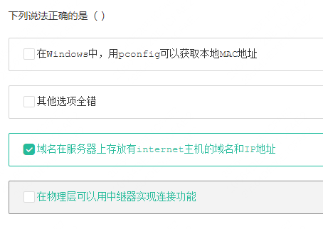

### 神策数据

下面哪些是使用分治法的特征（  ）

A. 该问题可以分解为若干个规模较小的相同问题
B. 子问题的解可以合并为该问题的解
C. 子问题必须是一样的
D. 子问题之间不包含公共的子问题

> 正确答案：A B D

---

>A：Windows使用 ipconfig 获取 MAC地址； Linux使用 ifconfg 获取 MAC地
>
>选择 A C D

---

### 贝壳