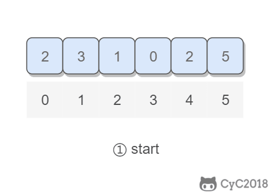

# 3. 数组中重复的数字

## 题目链接

[面试题03\. 数组中重复的数字](https://leetcode-cn.com/problems/shu-zu-zhong-zhong-fu-de-shu-zi-lcof/)

## 题目描述

Difficulty: **简单**

找出数组中重复的数字。

在一个长度为 n 的数组 nums 里的所有数字都在 0～n-1 的范围内。数组中某些数字是重复的，但不知道有几个数字重复了，也不知道每个数字重复了几次。请找出数组中任意一个重复的数字。【一个萝卜一个坑，如果有多个萝卜争夺一个坑，那么就找到了重复的数字】

**示例 1：**

```java
输入：
[2, 3, 1, 0, 2, 5, 3]
输出：2 或 3
```

**限制：**

`2 <= n <= 100000`

## 解题思路

### 排序解法、HashSet解法

**分析：**

从题目可以看到，是为了找到数组中重复的数字。我们很容易想到，可以通过先排序数组、或者通过一个HashSet就能解决。

其中，排序数组的解法时间复杂度为O(N lgN)，空间复杂度为O(1)。

通过HashSet的解法，时间复杂度为O(N),空间复杂度O(N)。

Language: **Java**

**排序解法：**

```java
class Solution {
    public int findRepeatNumber(int[] nums) {

        Arrays.sort(nums);

        for(int i = 0; i < (nums.length -1); i++){
            //这里注意，不用用nums[i],否则会影响语句的循环
            int temp = i;
            // 这里注意，必须写成++temp，不能写成temp++
            if(nums[temp] == nums[++temp]){
                return nums[i];
            }
        }
        return -1;
    }
}
```

**哈希解法：**

```java
class Solution {
    public int findRepeatNumber(int[] nums) {

        HashSet<Integer> hashSet = new HashSet<>();

        for(int num : nums){
            if(hashSet.contains(nums[i])){
                return nums[i];
            }else{
                hashSet.add(nums[i]);
            }
        }

        //return results;
        return -1;
    }
}
```

### 桶的思想

**分析：**

我们仔细看题目，发现题目的数字有限制：`所有数字都在 0～n-1 的范围内`。

那么我们其实可以省去额外开辟空间，将每个位置的数字通过交换映射到对应数组下标的下面，当出现新元素和原来元素相等时，即为重复数字。

这样子，时间复杂度为O(n),空间复杂度为O(1)。

<div align="center">  </div><br>

```java
class Solution {
    public int findRepeatNumber(int[] nums) {

        //遍历该数组是肯定要的
        for(int i = 0; i < nums.length; i++){
            while(i != nums[i]){
                //如果有两个萝卜争夺一个坑，说明找到了重复的元素
                if(nums[i] == nums[nums[i]]){
                    return nums[i];
                }
                //索引为i和索引为nums[i]：交换值
                //一个萝卜一个坑，将萝卜放回对应的萝卜坑
                swap(nums,i,nums[i]);
            }
        }
        //如果没有重复的元素，那么对应的萝卜会进入对应的萝卜坑，返回-1
        return -1;
    }

    private void swap(int[] nums, int index1, int index2){
        int temp;
        temp = nums[index1];
        nums[index1] = nums[index2];
        nums[index2] = temp;
    }
}
```

栈

```java
/**
 * Definition for singly-linked list.
 * public class ListNode {
 *     int val;
 *     ListNode next;
 *     ListNode(int x) { val = x; }
 * }
 */
class Solution {
    public int[] reversePrint(ListNode head) {

        LinkedList<Integer> stack = new LinkedList<>();
        while(head != null){
            stack.push(head.val);
            head = head.next;
        }

        int[] ret = new int[stack.size()];
        int i = 0;
        while(!stack.isEmpty()){
            ret[i] = stack.pop();
            i++;
        }

        return ret;
    }
}
```

递归

```java
/**
 * Definition for singly-linked list.
 * public class ListNode {
 *     int val;
 *     ListNode next;
 *     ListNode(int x) { val = x; }
 * }
 */
class Solution {
    public int[] reversePrint(ListNode head) {

        ArrayList<Integer> array = new ArrayList<>();
        recursive(head, array);
        int[] ret = new int[array.size()];
        
        for(int i = 0; i< ret.length; i++){
            ret[i] = array.get(i);
        }

        return ret;
        
    }

    public void recursive(ListNode head,ArrayList array){
        if(head == null){
            return;
        }
        recursive(head.next,array);

        array.add(head.val);
    }
}
```