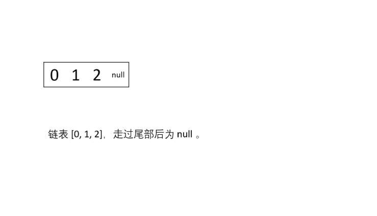
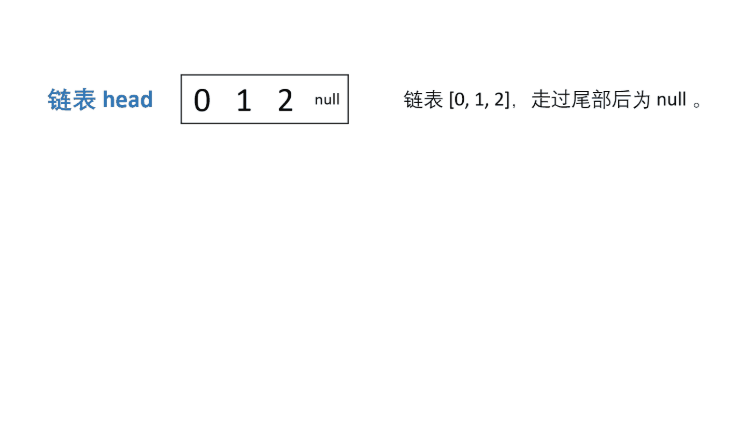

# 06. 从尾到头打印链表

## 题目链接

[面试题06\. 从尾到头打印链表](https://leetcode-cn.com/problems/cong-wei-dao-tou-da-yin-lian-biao-lcof/)

## 题目描述

Difficulty: **简单**

输入一个链表的头节点，从尾到头反过来返回每个节点的值（用数组返回）。

**示例 1：**

```text
输入：head = [1,3,2]
输出：[2,3,1]
```

**限制：**

`0 <= 链表长度 <= 10000`

## Solution

### 常规想法

因为一开始只知道链表的头节点`ListNode head`,不知道链表的长度，故不能直接实例化`int[] results`。

那我们一开始可以创建`ArrayList<Integer> array`,通过push获得链表的所有元素。这样子，知道了长度，就可以实例化`int[] results`了。

那现在就只需要将`results`反转了。可以利用temp，首尾的元素分别交换位置。

时间复杂度O(2 \* n),空间复杂度O(2 \* n)。

但是，本道题的实义并不是这样子做。递归和栈尤其适合处理这样子问题。

Language: **Java**

```java
​/**
 * Definition for singly-linked list.
 * public class ListNode {
 *     int val;
 *     ListNode next;
 *     ListNode(int x) { val = x; }
 * }
 */
class Solution {
    public int[] reversePrint(ListNode head) {

        ArrayList<Integer> array = new ArrayList<>();
        //ListNode p = new ListNode();
        //p = head;

        while(head != null){
            array.add(head.val);
            head = head.next;
        }

        int[] results = new int[array.size()];

        //ArrayList只能通过这种方法转化为数组
        for(int i = 0; i < array.size(); i++){
           results[i] = array.get(array.size() - i -1);
        }

        return results;
    }
}
```

### 递归

<div align="center">  </div><br>

```java
/**
 * Definition for singly-linked list.
 * public class ListNode {
 *     int val;
 *     ListNode next;
 *     ListNode(int x) { val = x; }
 * }
 */
class Solution {
    public int[] reversePrint(ListNode head) {

        ArrayList<Integer> array = new ArrayList<>();
        //递归这一步，就像是进入另一个世界去冒险了
        recursive(head, array);
        int[] ret = new int[array.size()];

        for(int i = 0; i< ret.length; i++){
            ret[i] = array.get(i);
        }

        return ret;

    }

    public void recursive(ListNode head,ArrayList array){
        if(head == null){
            return;
        }
        //不断循环
        recursive(head.next,array);

        //从循环跳出来后执行的动作
        array.add(head.val);
    }
}
```

### 栈

<div align="center">  </div><br>

```java
/**
 * Definition for singly-linked list.
 * public class ListNode {
 *     int val;
 *     ListNode next;
 *     ListNode(int x) { val = x; }
 * }
 */
class Solution {
    public int[] reversePrint(ListNode head) {

        LinkedList<Integer> stack = new LinkedList<>();
        while(head != null){
            stack.push(head.val);
            head = head.next;
        }

        int[] ret = new int[stack.size()];
        int i = 0;
        while(!stack.isEmpty()){
            ret[i] = stack.pop();
            i++;
        }

        return ret;
    }
}
```