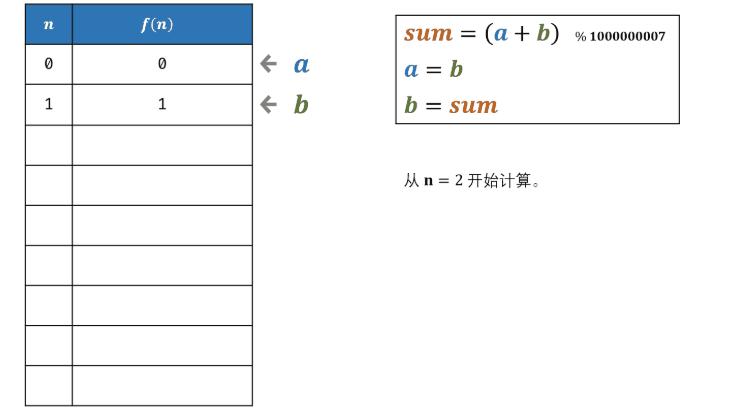

# 10- I. 斐波那契数列

## 题目链接

[面试题10- I. 斐波那契数列](https://leetcode-cn.com/problems/fei-bo-na-qi-shu-lie-lcof/)

## 题目描述

Difficulty: **简单**

写一个函数，输入 `n` ，求斐波那契（Fibonacci）数列的第 `n` 项。斐波那契数列的定义如下：

```text
F(0) = 0,   F(1) = 1
F(N) = F(N - 1) + F(N - 2), 其中 N > 1.
```

斐波那契数列由 0 和 1 开始，之后的斐波那契数就是由之前的两数相加而得出。

答案需要取模 1e9+7（1000000007），如计算初始结果为：1000000008，请返回 1。

**示例 1：**

```text
输入：n = 2
输出：1
```

**示例 2：**

```text
输入：n = 5
输出：5
```

**提示：**

* `0 <= n <= 100`

注意：本题与主站 509 题相同：

## Solution



### 动态规划

Language: **Java**

```java
​class Solution {
    public int fib(int n) {
        if(n < 0){
            return 0;
        }
        if(n == 1 || n == 0){
            return n;
        }

        int num1;
        int num2 = 0;
        int ret = 1;
        for(int i = 2; i <= n; i++){
            num1 = num2;
            num2 = ret;
            ret = (num1 + num2) % 1000000007;
        }
        return ret;
    
}
```

## 变种

题目描述
我们可以用2\*1的小矩形横着或者竖着去覆盖更大的矩形。请问用n个2\*1的小矩形无重叠地覆盖一个2\* n的大矩形，总共有多少种方法？

比如n=3时，2*3的矩形块有3种覆盖方法：


```java
public class Solution {
    public int RectCover(int target) {
        if(target <= 2){
            return target;
        }

        int a = 0, b = 1, res = 2;
        for (int i = 3; i <= target; i++){
            a = b;
            b = res;
            res = a + b;
        }
        return res;
    }
}
```

## 最近一次做题的思路

用动态规划的实现，列出数组「0，1，1，2，3，5·····」；解决斐波那契数列只用3个变量：num1, num2, ret，找到三个数的关系，很容易就能做出来。