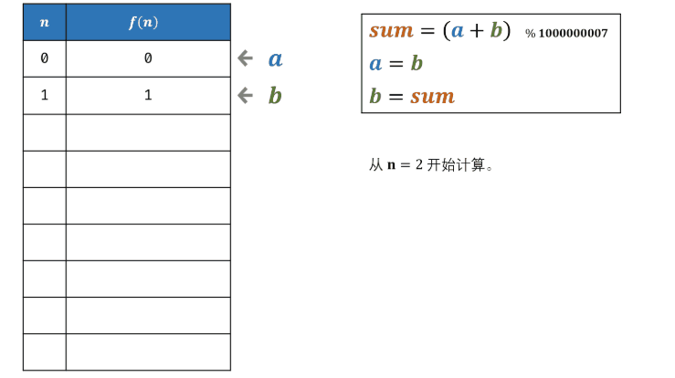

## 题目链接

[面试题10- II. 青蛙跳台阶问题](https://leetcode-cn.com/problems/qing-wa-tiao-tai-jie-wen-ti-lcof/)

## 题目描述

Difficulty: **简单**

一只青蛙一次可以跳上1级台阶，也可以跳上2级台阶。求该青蛙跳上一个 `n` 级的台阶总共有多少种跳法。

答案需要取模 1e9+7（1000000007），如计算初始结果为：1000000008，请返回 1。

**示例 1：**

```text
输入：n = 2
输出：2
```

**示例 2：**

```text
输入：n = 7
输出：21
```

**提示：**

* `0 <= n <= 100`

注意：本题与主站 509 题相同：

## Solution



Language: **Java**

```java
​class Solution {
    public int numWays(int n) {
        if(n < 0){
            return 0;
        }
        if(n == 1 || n ==0){
            return 1;
        }

        int num1;
        //跳0级台阶，只能有1种跳法
        int num2 = 1;
        //跳1级台阶，只能有1种跳法
        int ret = 1;
        for(int i = 2; i <= n; i++){
            //跳n级台阶，跳法的总数为跳n-1和跳n-2次之和
            num1 = num2;
            num2 = ret;
            ret = (num1 + num2) % 1000000007;
        }
        return ret;
    }
}
```
