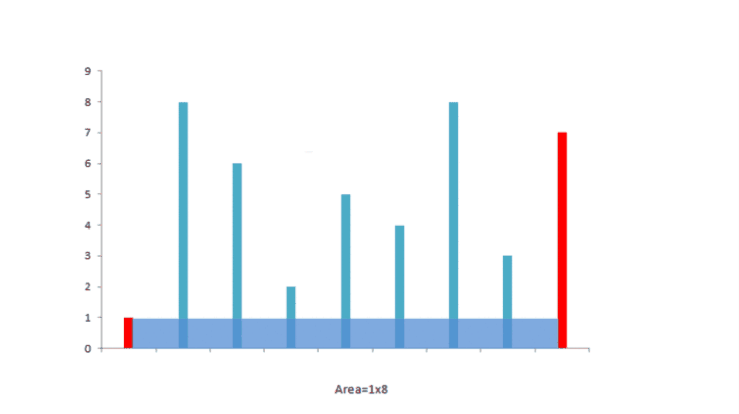

## 题目链接

[11\. 盛最多水的容器](https://leetcode-cn.com/problems/container-with-most-water/)

## 题目描述

Difficulty: **中等**

给定 _n_ 个非负整数 _a_<sub style="display: inline;">1</sub>，_a_<sub style="display: inline;">2，</sub>...，_a_<sub style="display: inline;">n，</sub>每个数代表坐标中的一个点 (_i_, _a<sub style="display: inline;">i</sub>_) 。在坐标内画 _n_ 条垂直线，垂直线 _i_ 的两个端点分别为 (_i_, _a<sub style="display: inline;">i</sub>_) 和 (_i_, 0)。找出其中的两条线，使得它们与 _x_ 轴共同构成的容器可以容纳最多的水。

**说明：**你不能倾斜容器，且 _n_ 的值至少为 2。


<small style="display: inline;">图中垂直线代表输入数组 [1,8,6,2,5,4,8,3,7]。在此情况下，容器能够容纳水（表示为蓝色部分）的最大值为 49。</small>

**示例:**

```
输入: [1,8,6,2,5,4,8,3,7]
输出: 49
```

## Solution



Language: **Java**

```java
​class Solution {
    public int maxArea(int[] height) {
        if(height == null || height.length < 2){
            return 0;
        }

        int max = 0;
        //夹逼
        int left = 0;
        int right = height.length - 1;
        while(left < right){
            //长*宽
            int area = (right - left) * Math.min(height[left],height[right]);
            max = Math.max(max, area);
            if(height[left] < height[right]){
                left++;
            }else{
                right--;
            }
        }
        return max;
    }
}
```

```go
func maxArea(height []int) int {
    l := len(height)
    if l <= 1 {
        return 0
    }

    left, right := 0, l - 1
    maxArea := 0

    for left < right {
        maxArea = max(maxArea, min(height[left], height[right]) * (right - left))
        if height[left] < height[right] {
            left++
        } else {
            right--
        }
    }

    return maxArea
}

func min(a, b int) int {
    if a < b {
        return a
    }
    return b
}

func max(a, b int) int {
    if a < b {
        return b
    }
    return a
}
```