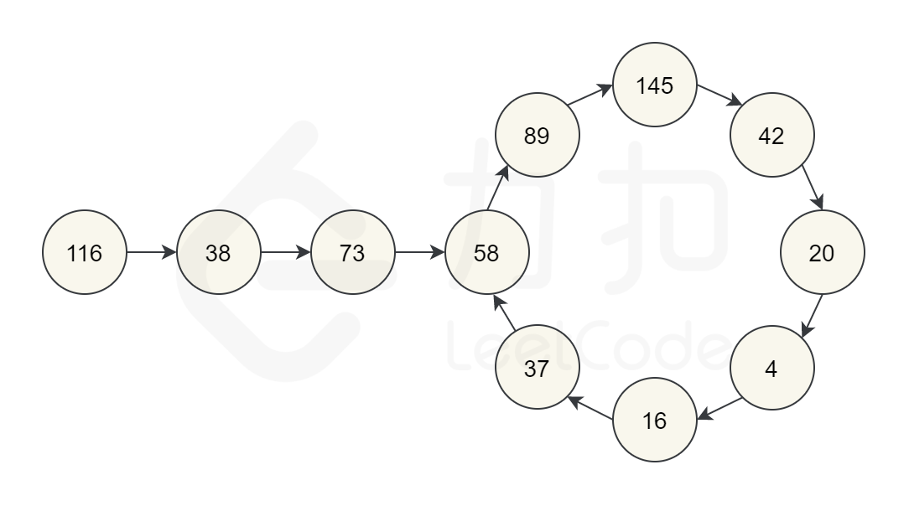

# 202. 快乐数

## 题目链接

[202\. 快乐数](https://leetcode-cn.com/problems/happy-number/)

## 题目描述

Difficulty: **简单**

编写一个算法来判断一个数 `n` 是不是快乐数。

「快乐数」定义为：对于一个正整数，每一次将该数替换为它每个位置上的数字的平方和，然后重复这个过程直到这个数变为 1，也可能是 **无限循环** 但始终变不到 1。如果 **可以变为**  1，那么这个数就是快乐数。

如果 `n` 是快乐数就返回 `True` ；不是，则返回 `False` 。

**示例：**

```
输入：19
输出：true
解释：
12 + 92 = 82
82 + 22 = 68
62 + 82 = 100
12 + 02 + 02 = 1
```

## Solution

这道题可能得结果是什么？

第一种可能，结果为1返回true。

什么时候结果不为1，如果出现循环的时候就永远不能为1了。举一个例子，让我们从 116 开始。通过反复通过平方和计算下一个数字，我们最终得到 58，再继续计算之后，我们又回到 58。由于我们回到了一个已经计算过的数字，可以知道有一个循环，因此不可能达到 11。所以对于 116，函数应该返回 false。



那有没有存在情况说，既不循环，也永远不会等于1的呢？答案是不可能的，因为快乐数的最大值是有限制的，假设快乐数的初始值是999999999， 经过计算后的快乐数为为 (9 ^ 2) * 9，然后再经过一轮快乐数，值就会变得很小了。因为快乐数是有极限的，所以不会造成既不循环，但是永远不会等于的情况。

所以，问题就转换成，如果判断环，如何判断环的话，可以使用双指针或者哈希表。

时间复杂度为O(log N);  
空间复杂度为O(1) / O(log N)

Language: **Java**

### 快慢指针

```java
​class Solution {
    public boolean isHappy(int n) {
        int quick = change(n);
        int slow = n;
        //如果n = 1的情况下，需要这一步进行判断
        if (quick == 1 || slow == 1) return true;

        while (quick != slow){
            // 只要有一个为1，那么就返回true
            if (quick == 1 || slow == 1) return true;
            slow = change(slow);
            
            quick = change(quick);
            quick = change(quick);
        }
        return false;
    }

    private int change(int n){
        int res = 0;
        int temp = 0;
        while (n != 0){
            temp = n % 10;
            n /= 10;
            res += Math.pow(temp, 2);
        }
        return res;
    }
}
```