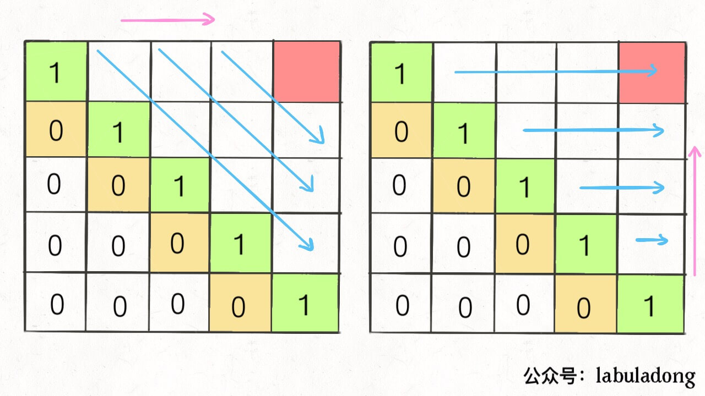

# 516. 最长回文子序列

## 题目链接

[516\. 最长回文子序列](https://leetcode-cn.com/problems/longest-palindromic-subsequence/)

## 题目描述

Difficulty: **中等**

给定一个字符串`s`，找到其中最长的回文子序列。可以假设`s`的最大长度为`1000`。

**示例 1:**  
输入:

```
"bbbab"
```

输出:

```
4
```

一个可能的最长回文子序列为 "bbbb"。

**示例 2:**  
输入:

```
"cbbd"
```

输出:

```
2
```

一个可能的最长回文子序列为 "bb"。

## Solution

### 递归

超出时间限制

```java
class Solution {
    public int longestPalindromeSubseq(String s) {
        char[] chars = s.toCharArray();
        //用left right指针开始递归寻找最长回文子序列
        return recur(chars, 0, s.length() -1);
    }

    private int recur(char[] chars, int left, int right){
        if (left > right){
            return 0;
        }
        //如果只有一个单词，最长回文子序列就是自身
        if (left == right){
            return 1;
        }
        //如果首尾有相同的单词，最长回文子序列的长度 + 2
        if (chars[left] == chars[right]){
            return recur(chars, left + 1, right - 1) + 2;
        }
        //如果单词不同，则最长的回文子序列 取决于 Math.max(区间[left + 1, right], 区间[left, right + 1])
        return Math.max(recur(chars, left + 1, right), recur(chars, left, right -1));
    }
}
```

### 递归 + 记忆化

```java
class Solution {
    //加上记忆化
    private int[][] mem;

    public int longestPalindromeSubseq(String s) {
        char[] chars = s.toCharArray();
        mem = new int[s.length()][s.length()];
        return recur(chars, 0, s.length() -1);
    }

    private int recur(char[] chars, int left, int right){
        if (left > right){
            return 0;
        }
        if (left == right){
            return 1;
        }
        //如果有直接返回
        if (mem[left][right] != 0){
            return mem[left][right];
        }
        if (chars[left] == chars[right]){
            //写入记忆化表中
            mem[left][right] = recur(chars, left + 1, right - 1) + 2;
        }else {
            mem[left][right] = Math.max(recur(chars, left + 1, right), recur(chars, left, right -1));
        }
        //返回记忆化表的值
        return mem[left][right];
    }
}
```

### 动态规划

根据暴力解法推出来。

> [labuladong](https://labuladong.gitbook.io/algo/dong-tai-gui-hua-xi-lie/zi-xu-lie-wen-ti-mo-ban)



Language: **Java**

选择第二个图。

```java
​class Solution {
    public int longestPalindromeSubseq(String s) {

        char[] chars = s.toCharArray();
        //列为left, 横为right
        int[][] dp = new int[s.length()][s.length()];
        //初始化
        for (int i = 0; i < s.length(); i++){
            dp[i][i] = 1;
            for (int j = 0; j < i; j++){
                dp[i][j] = 0;
            }
        }

        for (int i = s.length() - 2; i >= 0; i--){
            for (int j = i + 1; j < s.length(); j++){
                if (chars[i] == chars[j]){
                    dp[i][j] = dp[i + 1][j - 1] + 2;
                }else {
                    dp[i][j] = Math.max(dp[i + 1][j], dp[i][j - 1]);
                }
            }
        }

        return dp[0][s.length() - 1];

    }
}
```