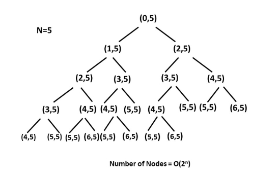

## 题目链接

[70\. 爬楼梯](https://leetcode-cn.com/problems/climbing-stairs/)

## 题目描述

Difficulty: **简单**

假设你正在爬楼梯。需要 _n_ 阶你才能到达楼顶。

每次你可以爬 1 或 2 个台阶。你有多少种不同的方法可以爬到楼顶呢？

**注意：**给定 _n_ 是一个正整数。

**示例 1：**

```
输入： 2
输出： 2
解释： 有两种方法可以爬到楼顶。
1\.  1 阶 + 1 阶
2\.  2 阶
```

**示例 2：**

```
输入： 3
输出： 3
解释： 有三种方法可以爬到楼顶。
1\.  1 阶 + 1 阶 + 1 阶
2\.  1 阶 + 2 阶
3\.  2 阶 + 1 阶
```

## Solution

Language: **Java**

### 暴力解法

该题的递归树如下，可以看到递归树有很多重复子，如果直接使用递归的解法：`climbStairs(n - 1) + climbStairs(n - 2)`，会造成压栈过多，`时间复杂度为: O(2^n)，空间复杂度为压栈的O(n)`



因为递归树有很多重复子，所以我们可以使用备忘录/动态规划。

### 动态规划

```java
class Solution {
    public int climbStairs(int n) {
        if(n == 1) return 1;

        //动态规划，以第n级台阶为决策
        int[] dp = new int[n + 1];
        dp[1] = 1;
        dp[2] = 2;

        for(int i = 3; i <= n; i++){
            dp[i] = dp[i - 1] + dp[i - 2];
        }
        return dp[n];

    }
}
```

时间复杂度为O(n),空间复杂度为O(n)

### 备忘录

```java
class Solution {
    public int climbStairs(int n) {

        //备忘录
        int[] mem = new int[n + 1];
        return dfs(n, mem);

    }

    private int dfs(int n, int[] mem){
        if(n == 1) return 1;
        if(n == 2) return 2;
        //备忘录
        if(mem[n] != 0) return mem[n];

        mem[n] = dfs(n - 1, mem) + dfs(n - 2, mem);
        return mem[n];
    }
}​
```

时间复杂度为O(n)，空间复杂度为O(n)

进一步分析，备忘录也只是用到两个格的数据，所以可以用两个变量表示。解法同斐波那契数列解法。

```java
class Solution {
    public int climbStairs(int n) {
        if(n == 1 || n == 2) return n;

        //斐波那契数列解法
        //num1,num2,res初始值的确定，根据下面num1 = num2等来判断
        int num1 = 0;
        int num2 = 1;
        int res = 2;
        for(int i = 3; i <= n; i++){
            num1 = num2;
            num2 = res;
            res = num1 + num2;
        }
        return res;

    }
}
```

时间复杂度为O(n)，空间复杂度为O(1)