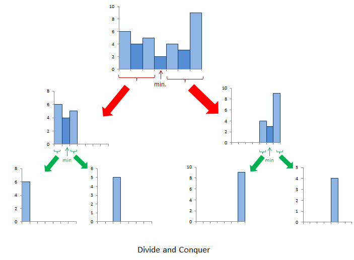

## 题目链接

[84\. 柱状图中最大的矩形](https://leetcode-cn.com/problems/largest-rectangle-in-histogram/)

## 题目描述

Difficulty: **困难**

给定 _n_ 个非负整数，用来表示柱状图中各个柱子的高度。每个柱子彼此相邻，且宽度为 1 。

求在该柱状图中，能够勾勒出来的矩形的最大面积。


<small style="display: inline;">以上是柱状图的示例，其中每个柱子的宽度为 1，给定的高度为 `[2,1,5,6,2,3]`。</small>


<small style="display: inline;">图中阴影部分为所能勾勒出的最大矩形面积，其面积为 `10` 个单位。</small>

**示例:**

```
输入: [2,1,5,6,2,3]
输出: 10
```

## Solution

Language: **Java**

### 暴力解法

以横坐标作为决策。两个指针i,j确定横坐标的范围，指针k再确定在此范围内的最小值。

时间复杂度为：O(n^3)。leetcode运行会超时

```java
​class Solution {
    public int largestRectangleArea(int[] heights) {
        int maxArea = 0;
        for(int i = 0; i < heights.length; i++){
            for(int j = i; j < heights.length; j++){
                //找出最小值
                int minHeight = Integer.MAX_VALUE;
                for(int k = i; k <= j; k++){
                    minHeight = Math.min(minHeight, heights[k]);
                }
                maxArea = Math.max(maxArea, minHeight * (j - i + 1));
            }
        }
        return maxArea;
    }
}
```

### 双指针

以每个柱子的高度作为决策。双指针i,j向两边漫延，确定以以该柱子为高的最大矩形面积。

时间复杂度为：O(n^2)

```java
class Solution {
    public int largestRectangleArea(int[] heights) {
        int maxArea = 0;
        for(int i = 0; i < heights.length; i++){
            int left = i - 1;
            int right = i + 1;
            //长度
            int count = 1;
            //相等也要考虑
            while(left >= 0 && heights[left] >= heights[i]){
                count++;
                left--;
            }
            while(right <= heights.length - 1 && heights[right] >= heights[i]){
                count++;
                right++;
            }
            int area = heights[i] * count;
            maxArea = Math.max(area, maxArea);
        }
        return maxArea;
    }
}
```

### 分治



```java
class Solution {
    public int largestRectangleArea(int[] heights) {
        return calculateArea(0, heights.length - 1, heights);
    }

    private int calculateArea(int start, int end, int[] heights){
        if(start > end){
            return 0;
        }
        int minindex = start;
        for(int i = start; i <= end; i++){
            if(heights[minindex] > heights[i]){
                minindex = i;
            }
        }
        return Math.max(heights[minindex] * (end - start + 1),
                Math.max(calculateArea(start, minindex -1, heights),
                    calculateArea(minindex + 1, end, heights)));

    }
}
```

### 栈

时间复杂度为O(h logn)

```java
class Solution {
    public int largestRectangleArea(int[] heights) {
        Stack<Integer> stack = new Stack<>();
        stack.push(-1);
        int maxArea = 0;
        for(int i = 0; i < heights.length; i++){
            while(stack.peek() != -1 && heights[i] < heights[stack.peek()]){
                maxArea = Math.max(maxArea, heights[stack.pop()] * (i - stack.peek() - 1));
            }
            stack.push(i);
        }
        while(stack.peek() != -1){
            maxArea = Math.max(maxArea, heights[stack.pop()] * (heights.length - stack.peek() - 1));
        }
        return maxArea;
    }
}
```