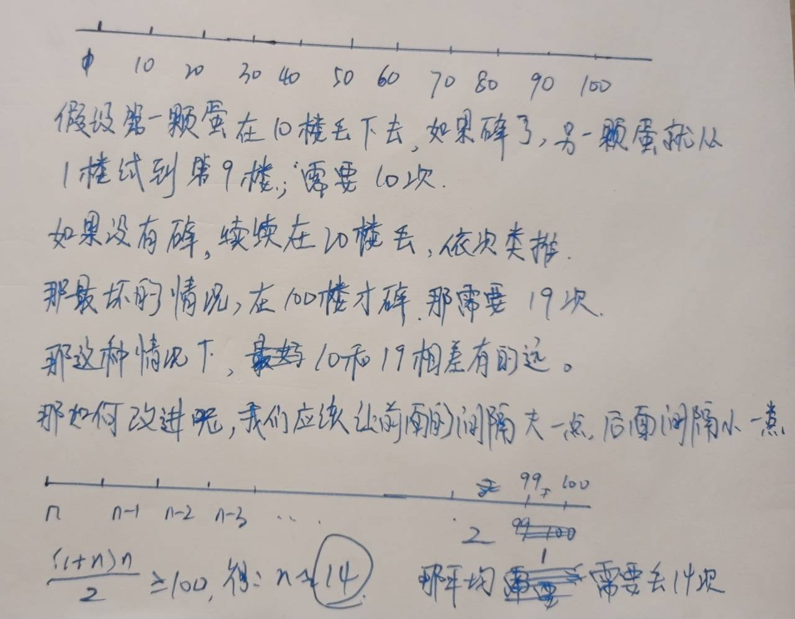

## timulianjie

[887\. 鸡蛋掉落](https://leetcode-cn.com/problems/super-egg-drop/)

### 题目描述

Difficulty: **困难**


你将获得 `K` 个鸡蛋，并可以使用一栋从 `1` 到 `N`  共有 `N` 层楼的建筑。

每个蛋的功能都是一样的，如果一个蛋碎了，你就不能再把它掉下去。

你知道存在楼层 `F` ，满足 `0 <= F <= N` 任何从高于 `F` 的楼层落下的鸡蛋都会碎，从 `F` 楼层或比它低的楼层落下的鸡蛋都不会破。

每次_移动_，你可以取一个鸡蛋（如果你有完整的鸡蛋）并把它从任一楼层 `X` 扔下（满足 `1 <= X <= N`）。

你的目标是**确切地**知道 `F` 的值是多少。

无论 `F` 的初始值如何，你确定 `F` 的值的最小移动次数是多少？

**示例 1：**

```
输入：K = 1, N = 2
输出：2
解释：
鸡蛋从 1 楼掉落。如果它碎了，我们肯定知道 F = 0 。
否则，鸡蛋从 2 楼掉落。如果它碎了，我们肯定知道 F = 1 。
如果它没碎，那么我们肯定知道 F = 2 。
因此，在最坏的情况下我们需要移动 2 次以确定 F 是多少。
```

**示例 2：**

```
输入：K = 2, N = 6
输出：3
```

**示例 3：**

```
输入：K = 3, N = 14
输出：4
```

**提示：**

1. `1 <= K <= 100`
2. `1 <= N <= 10000`


#### Solution

双蛋问题： 在最坏的情况下，如何找出最少的次数呢？

 

---

多蛋问题

该版本是没有优化的版本，时间复杂度过高，会通不过所有的测试样例


```java
class Solution {

    private int[][] mem;

    // 鸡蛋，楼层
    public int superEggDrop(int K, int N) {
        mem = new int[K + 1][N + 1];
        return recur(K, N);
    }

    private int recur(int eggs, int floor) {
        if (eggs == 1) return floor;
        if (floor == 1) return 1;
        
        if (mem[eggs][floor] != 0) {
            return mem[eggs][floor];
        }

        int min = Integer.MAX_VALUE;
        for (int i = 1; i <= floor; i++) {
            min = Math.min(min, 
                            Math.max(recur(eggs, floor - i), recur(eggs - 1, i - 1)));
        }
        mem[eggs][floor] = min + 1;
        return mem[eggs][floor];
    }
}
```